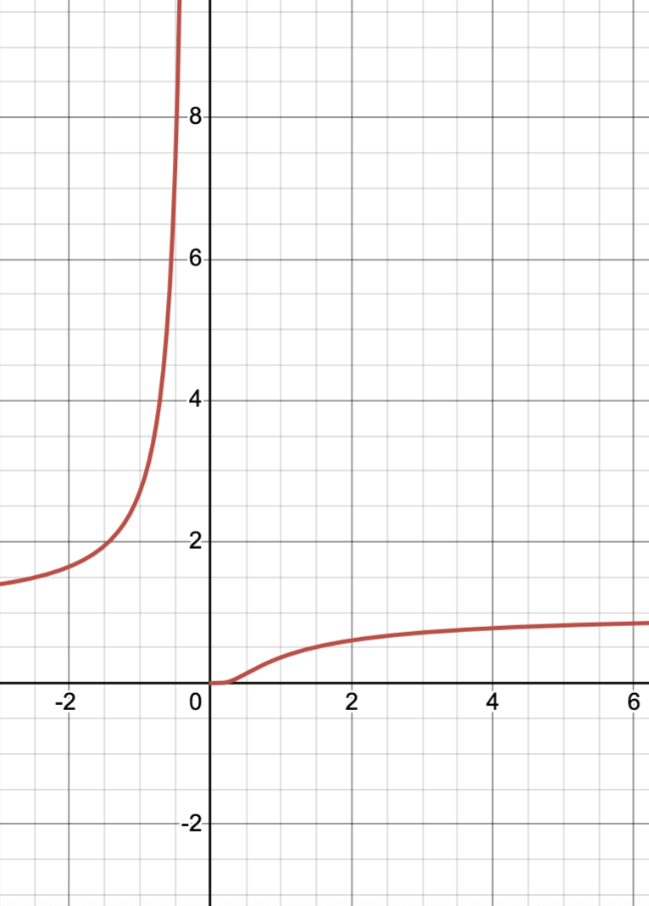

---
title: "Prueba Primer Parcial"
author: "Elvis Sánchez"
format:
  pdf:
    fontsize: 12pt
    break-on-sections: true
    documentclass: article
    include-in-header:
      text: |
        \usepackage[top=2cm, left=2.5cm, right=2.5cm, bottom=2.5cm]{geometry}
--- 

## Ejercicio 1: Límite 

El objetivo es evaluar el límite de $\lim_{x\to 0} \frac{\sqrt{1+x} - \sqrt{1-x}}{x}$.

**a) Qué surge al sustituir $x=0$** explique con sus palabras. 

**solucion:**

La indeterminación es del tipo $\frac{0}{0}$​.

**b) Resuelva el límite:** Muestre todos los pasos.
$$
\begin{aligned}
\lim_{x\to 0} \frac{\sqrt{1+x} - \sqrt{1-x}}{x} &= \lim_{x\to 0} \frac{(\sqrt{1+x} - \sqrt{1-x})(\sqrt{1+x} + \sqrt{1-x})}{x(\sqrt{1+x} + \sqrt{1-x})} \\
&= \lim_{x\to 0} \frac{(1+x) - (1-x)}{x(\sqrt{1+x} + \sqrt{1-x})} \\
&= \lim_{x\to 0} \frac{2x}{x(\sqrt{1+x} + \sqrt{1-x})} \\
&= \lim_{x\to 0} \frac{2}{(\sqrt{1+x} + \sqrt{1-x})} \\
&= 1.
\end{aligned}
$$

## Ejercicio 2: Límite Lateral y Función Exponencial

Se desea estudiar el límite $\lim_{x\to 0} \frac{6}{4 + e^{-1/x}}$.

**a) Análisis de Comportamiento:** por qué es necesario calcular los límites laterales ($x \to 0^+$ y $x \to 0^-$) para evaluar este límite. Explique el **comportamiento** de $e^{-1/x}$ a medida que $x$ se acerca a $0$ por la derecha y por la izquierda.

::: figure
{width="25%"}
figura: $e^{-\frac{1}{x}}$
:::

**Solución:**

Es necesario calcular los límites laterales porque el término **$e^{-1/x}$** involucra **$1/x$** en el exponente. La función $1/x$ tiene comportamientos drásticamente diferentes a medida que $x$ se acerca a $0$ por la derecha o por la izquierda:

* Si $x \to 0^+$ (por la derecha), $1/x \to +\infty$, por lo que $-1/x \to -\infty$.

* Si $x \to 0^-$ (por la izquierda), $1/x \to -\infty$, por lo que $-1/x \to +\infty$.

Dado que el valor del exponente diverge a $\pm \infty$ dependiendo de la dirección, el término $e^{-1/x}$ **no tiene un límite único** cuando $x \to 0$, lo que hace que el límite bilateral no pueda calcularse directamente.

**b) Calcule $\lim_{x\to 0^+} \frac{6}{4 + e^{-1/x}}$ y $\lim_{x\to 0^-} \frac{6}{4 + e^{-1/x}}$.** Con base en sus resultados, **¿que concluye?**.

**Límite Lateral Derecho ($x \to 0^+$):**
Como $x \to 0^+$, tenemos $-1/x \to -\infty$.
Por lo tanto, $\lim_{x\to 0^+} e^{-1/x} = 0$.

$$
\lim_{x\to 0^+} \frac{6}{4 + e^{-1/x}} = \frac{6}{4 + 0} = \frac{6}{4} = \mathbf{\frac{3}{2}}.
$$

**Límite Lateral Izquierdo ($x \to 0^-$):**
Como $x \to 0^-$, tenemos $-1/x \to +\infty$.
Por lo tanto, $\lim_{x\to 0^-} e^{-1/x} = \infty$.

$$
\lim\_{x\to 0^-} \frac{6}{4 + e^{-1/x}} = \lim\_{x\to 0^-} \frac{6}{4 + \infty} = \frac{6}{\infty} = \mathbf{0}.
$$

**Conclusión:** Dado que $\lim_{x\to 0^+} f(x) = 3/2$ y $\lim_{x\to 0^-} f(x) = 0$, y los límites laterales **no coinciden** ($3/2 \ne 0$), el límite bilateral **$\lim_{x\to 0} \frac{6}{4 + e^{-1/x}}$ no existe**.

**c) Proponga** una pequeña **modificación** en el numerador de la función original para que, si el límite bilateral existe, su valor sea exactamente $2$. Calcule si es posible y **justifique**.

Queremos que el límite bilateral sea 2. Esto significa que ambos límites laterales deben ser 2.
Sea la nueva función $h(x) = \frac{A}{4 + e^{-1/x}}$, donde $A$ es la modificación en el numerador.

1.  **Límite Lateral Derecho:**

$$
\displaystyle \lim\_{x\to 0^+} h(x) = \frac{A}{4 + 0} = \frac{A}{4}.
$$

Para que este límite sea $2$:

$$
\frac{A}{4} = 2 \implies \mathbf{A = 8}.
$$

2.  **Límite Lateral Izquierdo:**

$$
\lim\_{x\to 0^-} h(x) = \lim\_{x\to 0^-} \frac{8}{4 + e^{-1/x}} = \frac{8}{4 + \infty} = \frac{8}{\infty} = 0.
$$

**Justificación:** La modificación **no es suficiente** para hacer que el límite bilateral sea 2, ya que el límite por la izquierda sigue siendo 0.

Esta función tiene $\lim_{x\to 0^+} h(x) = 2$, pero $\lim_{x\to 0^-} h(x) = 0$. Por lo tanto, **no es posible** hacer que el límite bilateral exista y sea 2 solo modificando el numerador con una constante, debido al comportamiento exponencial.

## Ejercicio 3: Discontinuidad y Función por Partes

Considere la función por partes:
$$
f(x) =
\begin{cases}
x^3 + 1 & x \le 1 \\
x + 4 & x > 1
\end{cases}
$$

**a) Calcule el límite lateral izquierdo y el límite lateral derecho en $x=1$**. Basándose en esos resultados concluya si existe continuidad o discontinuidad y además **justifique** su nombre de existir un caso o el otro.

Calculamos los límites laterales en $x=1$:

* **Límite lateral izquierdo ($x \to 1^-$):** Usamos la regla para $x \le 1$:

$$
\lim\_{x\to 1^-} f(x) = \lim\_{x\to 1^-} (x^3 + 1) = (1)^3 + 1 = \mathbf{2}.
$$

* **Límite lateral derecho ($x \to 1^+$):** Usamos la regla para $x > 1$:

$$
\lim\_{x\to 1^+} f(x) = \lim\_{x\to 1^+} (x + 4) = 1 + 4 = \mathbf{5}.
$$

Dado que ambos límites laterales son **finitos**, pero **distintos** ($2 \ne 5$), la función $f$ presenta una **discontinuidad de salto finito** (o discontinuidad no evitable de primera especie) en $x=1$. El "salto" es la diferencia de los límites: $5 - 2 = 3$.

**b) Modifique** únicamente la **segunda parte de la función $f(x)$** (es decir, la regla para $x>1$) para que la nueva función $g(x)$ sea **continua** en $x=1$. La regla para $x \le 1$ debe permanecer $x^3+1$. Escriba la nueva función $g(x)$ y **demuestre** que cumple las condiciones de continuidad en $x=1$. defina ordenadamente todos los pasos.

Para que la nueva función $g(x)$ sea continua en $x=1$, se deben cumplir dos condiciones:

1.  **El límite bilateral debe existir:** $\lim_{x\to 1^-} g(x) = \lim_{x\to 1^+} g(x)$.

2.  **El límite debe ser igual al valor de la función:** $\lim_{x\to 1} g(x) = g(1)$.

El límite izquierdo es $\lim_{x\to 1^-} g(x) = 1^3 + 1 = 2$.
El valor de la función es $g(1) = 1^3 + 1 = 2$.

Necesitamos que el límite derecho, $\lim_{x\to 1^+} g(x)$, sea igual a $2$.

La segunda pieza (para $x > 1$) debe ser un polinomio $p(x)$ tal que $\lim_{x\to 1^+} p(x) = 2$.

La modificación más sencilla es hacer que $p(x)$ sea constante o lineal y que pase por el punto $(1, 2)$.

* **Modificación Simple (Constante):** $p(x) = 2$.
* **Modificación Lineal (Manteniendo la forma original):** $p(x) = x + C$.
$1 + C = 2 \implies C = 1$. Entonces $p(x) = x + 1$.

**Nueva Función Continua ($g(x)$ usando la forma lineal):**

$$
g(x) =
\begin{cases}
x^3 + 1 & x \le 1 \\
x + 1 & x > 1
\end{cases}
$$

**Demostración de Continuidad:**

$\lim_{x\to 1^-} g(x) = 2$.
$\lim_{x\to 1^+} g(x) = 1 + 1 = 2$.
$g(1) = 1^3 + 1 = 2$.
Como $\lim_{x\to 1^-} g(x) = \lim_{x\to 1^+} g(x) = g(1) = 2$, la función $g(x)$ es **continua** en $x=1$.

## Ejercicio 4: A continuación se representan las siguintes graficas.

a) Identifica en cada una de las gráficas que expresión algebraica corresponde, así como su nombre, dominio, codominio y si es continua o discontinua,¿en que punto?

::: {.columns}
::: {.column width="50%"}
::: center
{width="50%"}
:::
:::
::: {.column width="50%"}
::: center
{width="50%"}
:::

:::
::: 

## Solución

### Gráfica 1: Recta Horizontal (Superior Izquierda)

| Concepto | Análisis |
| :--- | :--- |
| **Expresión Algebraica** | $f(x) = c$ (donde $c$ es una constante). Específicamente, la recta pasa por $y = -2$. **$f(x) = -2$** |
| **Nombre** | **Función Constante** |
| **Dominio** | $\mathbb{R}$ (Todos los números reales). |
| **Codominio (Rango/Imagen)** | $\{-2\}$ (Solo el valor $y=-2$). |
| **Continuidad** | **Continua** en todo su dominio, ya que no presenta saltos ni rupturas. |

***

### Gráfica 2: Recta Inclinada (Superior Derecha)

| Concepto | Análisis |
| :--- | :--- |
| **Expresión Algebraica** | $f(x) = mx + b$. La pendiente $m$ es negativa (aprox. $-1$), y el intercepto $b$ es $0$. **$f(x) = -x$** |
| **Nombre** | **Función Lineal** (o Función Identidad Negativa) |
| **Dominio** | $\mathbb{R}$ (Todos los números reales). |
| **Codominio (Rango/Imagen)** | $\mathbb{R}$ (Todos los números reales). |
| **Continuidad** | **Continua** en todo su dominio. |

***

### Gráfica 3: Función por Partes con Salto (Inferior Izquierda)

| Concepto | Análisis |
| :--- | :--- |
| **Expresión Algebraica** | **Función definida a trozos** (La ecuación exacta no es necesaria, solo la forma). Para $x \le 1$ es una línea con pendiente negativa. Para $x > 1$ es una línea horizontal. |
| **Nombre** | **Función por Partes** |
| **Dominio** | $\mathbb{R}$ (Todos los números reales). |
| **Codominio (Rango/Imagen)** | $(-\infty, \text{aprox. } 1.5] \cup \{\text{aprox. } -2\}$ |
| **Continuidad** | **Discontinua** en el punto $\mathbf{x=1}$. Presenta una **discontinuidad de salto finito** ya que los límites laterales existen pero son diferentes (aprox. $\lim_{x \to 1^-} f(x) \approx 1.5$ y $\lim_{x \to 1^+} f(x) \approx -2$). |

### Gráfica 4: Hipérbola (Inferior Derecha)

| Concepto | Análisis |
| :--- | :--- |
| **Expresión Algebraica** | $f(x) = \frac{k}{x^n} + c$. Específicamente, parece ser la función recíproca desplazada. $\mathbf{f(x) = \frac{1}{x} + 0}$ o $\mathbf{f(x) = \frac{1}{x}}$ (con asíntotas en $x=0$ y $y=0$). |
| **Nombre** | **Función Racional** (o Función Recíproca) |
| **Dominio** | $\mathbb{R} - \{0\}$ (Todos los reales excepto $x=0$). |
| **Codominio (Rango/Imagen)** | $\mathbb{R} - \{0\}$ (Todos los reales excepto $y=0$). |
| **Continuidad** | **Discontinua** en el punto $\mathbf{x=0}$. Presenta una **discontinuidad infinita** (asíntota vertical), ya que el límite tiende a $\pm \infty$ en ese punto. |

## Ejercicio 5: Dada la gráfica de la función trascendental de la figura, se pide verificar la existencia de los siguientes límites: si existen poner su valor, caso contrario poner no existe.

{width="50%"}

1) $\lim_{x \to -1^-} f(x)$, 2) $\lim_{x \to 1^+} f(x)$, 3) $\lim_{x \to 2^-} f(x)$, 4) $\lim_{x \to 2^+} f(x)$, 5) $\lim_{x \to 2} f(x)$, 6) $\lim_{x \to 3^-} f(x)$, 7) $\lim_{x \to 3^+} f(x)$, 8) $\lim_{x \to 3} f(x)$, 9) $\lim_{x \to 4^-} f(x)$, 10) $\lim_{x \to 4^+} f(x)$, 11) $\lim_{x \to 4} f(x)$, 12) $\lim_{x \to 5^-} f(x)$, 13) $\lim_{x \to 5^+} f(x)$, 14) $\lim_{x \to 5} f(x)$.

**SOLUCIÓN:**

La manera de determinar los límites que se piden es a través de dibujar las ordenadas correspondientes, por la izquierda y por la derecha de cada valor sugerido, viendo si la sucesión de ordenadas convergen hacia el propio valor.

1. $\lim_{x \to -1^-} f(x) = \text{No existe}$ \quad \quad \quad \quad \quad \quad \quad \quad \quad \quad \quad 8. $\lim_{x \to 3} f(x) = \text{No existe}$

2. $\lim_{x \to 1^+} f(x) = 1$ \quad \quad \quad \quad \quad \quad \quad \quad \quad 9. $\lim_{x \to 4^-} f(x) = 0.95$

3. $\lim_{x \to 2^-} f(x) = 2$ \quad \quad \quad \quad \quad \quad \quad \quad \quad \quad \quad 10. $\lim_{x \to 4^+} f(x) = 0.95$

4. $\lim_{x \to 2^+} f(x) = 1$ \quad \quad \quad \quad \quad \quad \quad \quad \quad \quad \quad 11. $\lim_{x \to 4} f(x) = 0.95$

5. $\lim_{x \to 2} f(x) = \text{No existe}$ \quad \quad \quad \quad \quad \quad \quad \quad \quad 12. $\lim_{x \to 5^-} f(x) = 1$

6. $\lim_{x \to 3^-} f(x) = \text{No existe}$ \quad \quad \quad \quad \quad \quad \quad \quad \quad 13. $\lim_{x \to 5^+} f(x) = 3$

7. $\lim_{x \to 3^+} f(x) = -0.1$ \quad \quad \quad \quad \quad \quad \quad \quad \quad 14. $\lim_{x \to 5} f(x) = \text{No existe}$

En el caso del $\lim_{x \to 3^-} f(x)$, la no existencia se afirma diciendo que el límite de la sucesión de las $y$ tiende a **infinito**. En los otros casos de no existencia, las gráficas presentan **saltos** que no dejan que ello ocurra.