```{r}
#| context: setup
#addResourcePath("Images", "Images")
```

# Introducción {.my-slide} 

## [Números Reales: El conjunto $\mathbb{N}$ de los números naturales]{.bg style="--col: #ffff00"} {.scrollable} 

::: columns

::: {.column width="50%"}
::: {.fragment fragment-index="1"}
> **Números Naturales**  
> $$\color{red}{\Large \mathbb{N} = \{ 1, 2, 3, \cdots \}}$$  
:::
:::

::: {.column width="50%"}
::: {.fragment fragment-index="2"}
> ### “Dios creó los números naturales,  
> todo lo demás es obra del hombre.”  
> — **Leopold Kronecker**
:::
:::

:::

::: {.fragment fragment-index="3"}
::: center
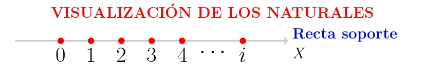{width="80%"}
:::
:::

::: {.fragment fragment-index="4"}

Dado $a, b \in \mathbb{N}$, no siempre existe un número natural $x$ tal que: 
$$\color{red}{a + x = b}$$.
**$\color{blue}{\textbf{El Problema?}}$**  
$$5 + x = 2 \quad \Longrightarrow \quad x = -3 \notin \mathbb{N}$$ 
Pues requerimos de "**números negativos**", esta necesidad obligó requiere de un nuevo conjunto de números al cual llamaremos enteros $$\color{red}{\mathbb{Z}}=\{\cdots,-3,-2,-1,0,1,2,3,\cdots\}$$
:::

## [Números Reales: El conjunto $\mathbb{N}$ de los números naturales]{.bg style="--col: #ffff00"} {.scrollable}


### ¿[**Qué significa**]{.alert} "$a, b \in \mathbb{N}$"?


::: fragment
- Queremos hablar de [**números naturales**]{.alert}: positivos.
- Al escribir **$a, b \in \mathbb{N}$**, estamos diciendo:
:::

::: fragment
  > [“Tomemos **dos números naturales** cualesquiera: uno lo llamamos $a$, y otro $b$”]{.bg style="--col:#fdf6e3"}
:::

::: fragment
Esto nos permite **hablar en general**, sin decir exactamente qué números son.  
Es como decir:

  > [“Imagina dos números enteros… no importa cuáles, pero piensa que existen.”]{.bg style="--col:#fdf6e3"}
:::

::: fragment

Ahora bien, **no siempre se puede encontrar otro natural $x$** que cumpla:

$$a + x = b$$

Por ejemplo, si $a = 2$ y $b = 5$…

→ ¿Existe un número entero $x$ tal que $x = -3$?

❌ **No**, porque $x = -3$ ***No es un número natural*

:::

## [Números Reales: El conjunto $\color{red}{\mathbb{Z}}$ de los números enteros]{.bg style="--col:#ffff00"} {.scrollable}


$$\color{red}{\mathbb{Z}}=\{\cdots,-3,-2,-1,0,1,2,3,\cdots\}$$
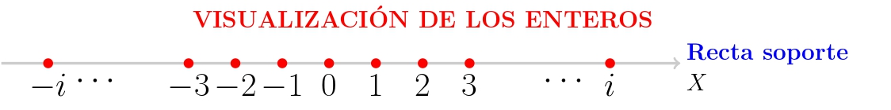


**$\color{blue}{\textbf{El problema de Números Enteros}}:$**  
 Dado $a, b \in \mathbb{Z}$, no siempre existe un número entero $x$ tal que  
$$\color{red}{a \cdot x = b}$$

$$5 \cdot x = 2 \quad \Longrightarrow \quad x = \frac{2}{5} \notin \mathbb{Z}$$

El conjunto $\color{red}{\large \mathbb{Q}}$ de los números **racionales** está formado por aquellos que pueden expresarse como un $\color{blue}{\textbf{cociente entre un número entero y un número natural}}$.

Son [**racionales los números que tienen un número finito de cifras decimales**]{.alert} , y también los $\color{blue}{\textbf{números periódicos}}$

## [Números Reales: El conjunto $\color{red}{\mathbb{Z}}$ de los números enteros]{.bg style="--col: #ffff00"} {.scrollable}

::: {.fragment }

::: {.bg style="background-color:#fdf6e3; padding:0.25em; border-left:6px solid #228B22;"}
Por parecidos que sea dos [**racionales**]{.alert} [**entre ellos**]{.alert}, hay una [**infinidad de racionales**]{.alert}
:::

:::


::: {.fragment }
{with="20%"}


:::

::: {.fragment}

Si $a=1.41$ y $b=1.42$

$$a<1.41\color{red}{37823445637867951846636}<b$$
Lo que significa que los racionales están muy [**comprimidos (pegaditos)**]{.alert}, tan juntitos que parece que contituyen un [**todo continuo**]{.alert} y que llenan por completo la recta soporte, podía parecer que la visualizacion de $\color{red}{\mathbb{Q}}$ es la propia recta soporte.


:::


## [La recta real ampliada $\mathfrak{R}$]{.bg style="--col:#ffff00"} {.scrollable}

::: {.fragment fragment-index="2"}

::: {.bg style="background-color:#fdf6e3;padding:0.25em; border-left:6px solid #228B22;"}
Llamamos recta real ampliada al conjunto que resulta al añadir a $\mathfrak{R}$ los simbolos $+\infty$ y $-\infty$.
:::

:::

::: {.fragment fragment-index="1"}

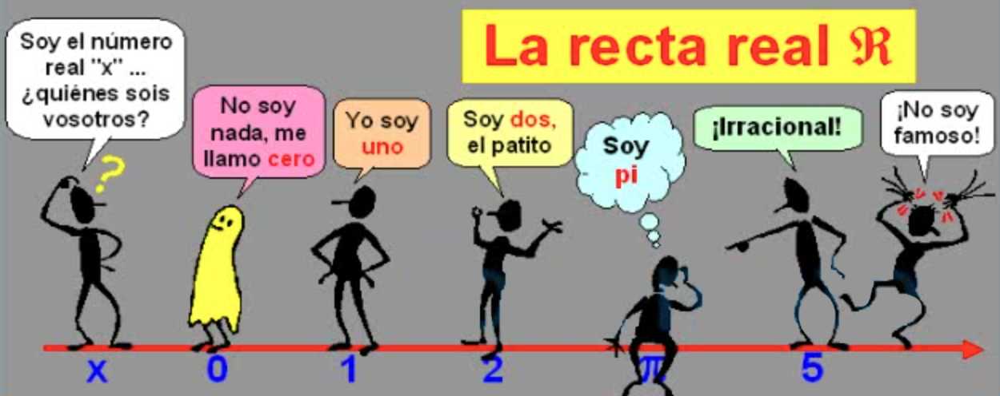

:::

## [La recta real ampliada $\mathfrak{R}$]{.bg style="--col:#ffff00"} {.scrollable}


## [La recta real ampliada $\mathfrak{R}$]{.bg style="--col:#ffff00"} {.scrollable}

::: {.bg style="background-color:#fdf6e3;padding:0.25em; border-left:6px solid #228B22;"}
**También [convenimos]{.alert} que $\forall x \in \mathfrak{R}$, es:**

::: {layout="[[100],[30,70]]"}

$$
\begin{array}{lll}
x + (+\infty)= (+\infty)+(+\infty)=+\infty\\
x + (-\infty)= (+\infty)+(+\infty)=+\infty\\
\dfrac{x}{+\infty}=\dfrac{x}{-\infty}=0
\end{array}
$$

::: {.r-stack}

::: {.fragment fragment-index="1"}
{width="80%"}
:::

::: {.fragment fragment-index="2"}
{width="80%"}
:::

:::

$$
x . (-\infty) \texttt{=} (-\infty).x =
\begin{cases}
-\infty, &  \text{si x > 0 }\\
+\infty,&  \text{si x < 0 }
\end{cases}
$$
$$
x . (+\infty) \texttt{=} (+\infty).x =
\begin{cases}
+\infty, &  \text{si x > 0 }\\
-\infty,&  \text{si x < 0 }
\end{cases}
$$
:::
:::

## Que quede claro!

::: {.cuadro1 style="font-size: 140%;"}
En general, con $\color{blue}{+\infty}$ y $\color{blue}{-\infty}$ 

[No tienen sentido las operaciones que hacemos con los numeros]{.alert} 
:::

## [**Intervalos de la recta real**]{.bg style="--col:#ffff00"} {.scrollable}

::: {.bg style="background-color:#fdf6e3;padding:0.25em; border-left:6px solid #fdf6e3;font-size: 0.75em;"}
Siendo $a,b \in \mathfrak{R}$ tales que $a<b$, se llaman [**intervalo**]{.blue} de [**origen**]{.alert} "**a**" y [extremo]{.alert} "**b**" a los siguientes subconjuntos de $\mathfrak{R}$:

::: columns

::: {.column width="50%"}
$$
\begin{array}{llll}
[a,b]=\{x \in \mathfrak{R}| a\leq x\leq b \} \equiv \textbf{intervalo cerrado} \\
(a,b)=\{x \in \mathfrak{R}| a < x < b\} \equiv \textbf{intervalo abierto} \\
[a,b)=\{x \in \mathfrak{R}| a \leq x < b \} \equiv \textbf{cerrado por la izq.} \\ 
\phantom{(a,b]=\{x \in \mathfrak{R}| a < x\leq b \} \equiv } \textbf{y abierto por la der.} \\
(a,b]=\{x \in \mathfrak{R}| a < x \leq b \} \equiv \textbf{abierto por la izq.} \\
\phantom{[a,b)=\{x \in \mathfrak{R}| a \leq x < b \} \equiv } \textbf{y cerrado por la der.} \\
\end{array}
$$
:::

::: {.column width="30%" style="text-align: right;margin-top: -1cm"}
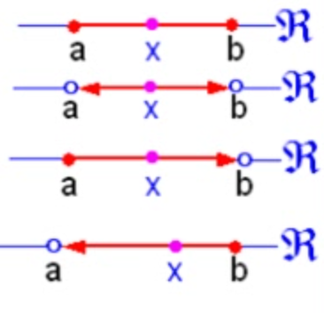{width="55%"}
:::
:::

::: {.bg style="background-color:#bfeeff;padding:0.25em;font-size: 1.2em;"}
De "[a]{.alert}" también se dice que es el [**extremo inferior**]{.alert} del intervalo, y de "[b]{.alert}" se dice que es el [**extremo superior**]{.alert}. Del número real positivo "**b – a**" se dice que es la [**amplitud**]{.alert} del intervalo.
:::

::: {.fragment}
$$
\left.
\begin{array}{llll}
[4,9]=\{x \in \mathfrak{R} \mid 4 \leq x \leq 9 \}\\
(2,5)=\{x \in \mathfrak{R} \mid 2 < x < 5 \}\\
[-4,2)=\{x \in \mathfrak{R} \mid -4 \leq x < 2 \}\\
(6,8]=\{x \in \mathfrak{R} \mid 6 < x \leq 8 \}
\end{array}
\right\}
\begin{array}{ll}
\text{Para expresar que tienen una amplitud finita }, \\
\text{se dice que son acotados} 
\end{array}
$$
:::

::: {.fragment}
Se dice que un [intervalo]{.blue} es [**compacto**]{.alert} si es [**cerrado y acotado**]{.alert}, como los intervalos $[-2,3],[1,8],[6,9]$
:::

::: {.fragment}
::: {.bg style="background-color:#bfeeff;padding:0.25em; border-left:6px solid #bfeeff;"}
Los siguientes intervalos tienen [**amplitud infinita**]{.alert}, y para expresarlo se dice que son [**no acotados:**]{.alert}
$$
\begin{array}{lll}
[a,+\infty) = \{ x\in \mathfrak{R} \mid x \geq a \} \quad;\quad
[a,+\infty) = \{ x\in \mathfrak{R} \mid x > a \}\\
(-\infty,a) = \{ x\in \mathfrak{R} \mid x \leq a \}\quad;\quad (-\infty,a) = \{ x\in \mathfrak{R} \mid x < a\} \\
\end{array}
$$

:::

:::
:::


## [**Valor absoluto de un número real**]{.bg style="--col:#ffff00"} {.scrollable}

El [**valor absoluto**]{.alert} de un número real "$x$" es el [número real no negativo]{.alert} que se denota por $|x|$ y se define de la siguiente manera:
$$
|x| = \left\{
\begin{array}{ll}
x, & \text{si } x \geq 0 \\
-x, & \text{si } x < 0
\end{array}
\right.
$$

::: columns
::: {.column width="50%"}

**Ejemplos:**

- Como $5 > 0$, se tiene:  
  $|5| = 5$

- Como $-7 < 0$, se tiene:  
  $|-7| = -(-7) = 7$

:::

::: {.column width="50%"}

::: {.bg style="background-color:#e6f7ff; padding:0.75em; border-radius:8px;"}

**Propiedades del valor absoluto:**

- $|x| > 0$ &nbsp;&nbsp;&nbsp;&nbsp;&nbsp;&nbsp;&nbsp;&nbsp;&nbsp; si $x \neq 0$  
- $|0| = 0$  
- Si $k > 0$ y $|x| < k$, entonces $-k < x < k$  
- $|x \cdot y| = |x| \cdot |y|$  
- $|x + y| \leq |x| + |y|$

:::
:::
:::

## [**Valor absoluto**]{.bg style="--col:#ffff00"} {.scrollable}

```{=html}
<div id="va-explorador">
<style>
  #va-explorador * { box-sizing: border-box; }
  #va-explorador {
    font-family: 'Segoe UI', system-ui, sans-serif;
    background: #ffffff;
    color: #1a1a1a;
    padding: 1rem;
    max-width: 680px;
    margin: 0 auto;
  }
  #va-explorador .va-titulo {
    font-size: 18px;
    font-weight: 600;
    margin-bottom: 0.25rem;
    color: #1a1a1a;
  }
  #va-explorador .va-subtitulo {
    font-size: 13px;
    color: #666;
    margin-bottom: 1.5rem;
  }
  #va-explorador .va-slider-row {
    display: flex;
    align-items: center;
    gap: 12px;
    margin-bottom: 1.25rem;
  }
  #va-explorador .va-slider-label {
    font-size: 14px;
    color: #555;
    white-space: nowrap;
  }
  #va-explorador input[type=range] {
    flex: 1;
    accent-color: #378ADD;
    height: 4px;
    cursor: pointer;
  }
  #va-explorador .va-slider-val {
    font-size: 22px;
    font-weight: 600;
    min-width: 40px;
    text-align: right;
    color: #1a1a1a;
  }
  #va-explorador svg#va-recta {
    display: block;
    width: 100%;
    margin-bottom: 1rem;
    overflow: visible;
  }
  #va-explorador .va-cards {
    display: grid;
    grid-template-columns: repeat(3, minmax(0, 1fr));
    gap: 10px;
    margin-bottom: 1rem;
  }
  #va-explorador .va-card {
    background: #f5f5f3;
    border-radius: 8px;
    padding: 0.1rem 0.25rem;
    text-align: center;
  }
  #va-explorador .va-card-label {
    font-size: 11px;
    color: #777;
    margin-bottom: 4px;
  }
  #va-explorador .va-card-val {
    font-size: 20px;
    font-weight: 600;
    color: #1a1a1a;
  }
  #va-explorador .va-card-sub {
    font-size: 11px;
    color: #999;
    margin-top: 3px;
  }
  #va-explorador .va-explicacion {
    border-left: 3px solid #378ADD;
    padding: 0.75rem 1rem;
    background: #f0f6fd;
    border-radius: 0 6px 6px 0;
    font-size: 13.5px;
    color: #333;
    line-height: 1.65;
    min-height: 60px;
  }
  #va-explorador .va-definicion {
    margin-top: 1.25rem;
    background: #fafafa;
    border: 1px solid #e5e5e5;
    border-radius: 8px;
    padding: 0.9rem 1.1rem;
    font-size: 13px;
    color: #444;
  }
  #va-explorador .va-definicion strong { color: #1a1a1a; }
  #va-explorador .va-rama {
    display: flex;
    align-items: center;
    gap: 8px;
    margin-top: 6px;
  }
  #va-explorador .va-rama-badge {
    font-size: 11px;
    font-weight: 600;
    padding: 2px 8px;
    border-radius: 20px;
    white-space: nowrap;
  }
  #va-explorador .va-rama-pos  { background: #e1f5ee; color: #0F6E56; }
  #va-explorador .va-rama-neg  { background: #e6f1fb; color: #185FA5; }
  #va-explorador .va-rama-text { font-family: 'Courier New', monospace; font-size: 13px; }
  #va-explorador .va-rama-activa { font-weight: 700; }
</style>

<p class="va-titulo">Explorador: valor absoluto en la recta real</p>
<p class="va-subtitulo">Mueve el deslizador para ver qué rama de la definición se activa.</p>

<div class="va-slider-row">
  <span class="va-slider-label">x =</span>
  <input type="range" min="-10" max="10" step="1" value="-4" id="va-sl">
  <span class="va-slider-val" id="va-aval">−4</span>
</div>

<svg id="va-recta" viewBox="0 0 500 100">
  <line x1="20" y1="52" x2="480" y2="52" stroke="#ccc" stroke-width="1.5"/>
  <g id="va-ticks"></g>
  <line id="va-dist-line" x1="250" y1="38" x2="250" y2="38" stroke="#378ADD" stroke-width="3.5" stroke-linecap="round"/>
  <text id="va-dist-label" x="250" y="25" text-anchor="middle" font-size="12" fill="#185FA5" font-weight="600"></text>
  <circle cx="250" cy="52" r="4" fill="#aaa"/>
  <text x="250" y="72" text-anchor="middle" font-size="11" fill="#888">0</text>
  <circle id="va-punto" cx="170" cy="52" r="7" fill="#378ADD"/>
  <text id="va-punto-label" x="170" y="92" text-anchor="middle" font-size="12" fill="#185FA5" font-weight="600"></text>
</svg>

<div class="va-cards">
  <div class="va-card">
    <p class="va-card-label">valor de x</p>
    <p class="va-card-val" id="va-show-a">−4</p>
    <p class="va-card-sub" id="va-caso-texto">x &lt; 0</p>
  </div>
  <div class="va-card">
    <p class="va-card-label">regla aplicada</p>
    <p class="va-card-val" id="va-show-regla" style="font-size:15px;">|x| = −x</p>
    <p class="va-card-sub" id="va-show-sust">−(−4) = 4</p>
  </div>
  <div class="va-card">
    <p class="va-card-label">|x| = distancia</p>
    <p class="va-card-val" id="va-show-abs" style="color:#185FA5;">4</p>
    <p class="va-card-sub">siempre ≥ 0</p>
  </div>
</div>

<div class="va-explicacion" id="va-explicacion"></div>

<div class="va-definicion">
  <strong>Definición formal</strong> — rama activa resaltada:
  <div class="va-rama" id="va-rama-pos">
    <span class="va-rama-badge va-rama-pos">x ≥ 0</span>
    <span class="va-rama-text" id="va-txt-pos">|x| = x</span>
  </div>
  <div class="va-rama" id="va-rama-neg">
    <span class="va-rama-badge va-rama-neg">x &lt; 0</span>
    <span class="va-rama-text" id="va-txt-neg">|x| = −x</span>
  </div>
</div>

<script>
(function () {
  const sl = document.getElementById('va-sl');

  function px(val) { return 250 + val * 23; }

  function buildTicks() {
    const g = document.getElementById('va-ticks');
    for (let i = -10; i <= 10; i++) {
      const cx = px(i);
      const ln = document.createElementNS('http://www.w3.org/2000/svg', 'line');
      ln.setAttribute('x1', cx); ln.setAttribute('y1', 47);
      ln.setAttribute('x2', cx); ln.setAttribute('y2', 57);
      ln.setAttribute('stroke', '#ddd'); ln.setAttribute('stroke-width', '1');
      g.appendChild(ln);
      if (i % 5 === 0 && i !== 0) {
        const t = document.createElementNS('http://www.w3.org/2000/svg', 'text');
        t.setAttribute('x', cx); t.setAttribute('y', 70);
        t.setAttribute('text-anchor', 'middle');
        t.setAttribute('font-size', '10'); t.setAttribute('fill', '#aaa');
        t.textContent = i; g.appendChild(t);
      }
    }
  }

  function fmt(n) {
    if (n < 0) return '−' + Math.abs(n);
    if (n === 0) return '0';
    return String(n);
  }

  function update() {
    const a     = parseInt(sl.value);
    const abs_a = Math.abs(a);
    const cx    = px(a);

    document.getElementById('va-aval').textContent    = fmt(a);
    document.getElementById('va-show-a').textContent  = fmt(a);
    document.getElementById('va-show-abs').textContent = abs_a;

    const punto = document.getElementById('va-punto');
    punto.setAttribute('cx', cx);
    punto.setAttribute('fill', a >= 0 ? '#1D9E75' : '#378ADD');

    const pl = document.getElementById('va-punto-label');
    pl.setAttribute('x', cx);
    pl.textContent = 'x = ' + fmt(a);
    pl.setAttribute('fill', a >= 0 ? '#0F6E56' : '#185FA5');

    const dl = document.getElementById('va-dist-line');
    dl.setAttribute('x1', Math.min(250, cx));
    dl.setAttribute('x2', Math.max(250, cx));
    dl.setAttribute('stroke', a >= 0 ? '#1D9E75' : (a === 0 ? '#aaa' : '#378ADD'));

    const dlab = document.getElementById('va-dist-label');
    dlab.textContent = abs_a > 0 ? '|x| = ' + abs_a : '';
    dlab.setAttribute('x', (250 + cx) / 2);
    dlab.setAttribute('fill', a >= 0 ? '#0F6E56' : '#185FA5');

    let casoTexto, regla, sust, expl;

    if (a > 0) {
      casoTexto = 'x > 0  (positivo)';
      regla     = '|x| = x';
      sust      = 'ya es positivo';
      expl      = 'x es positivo, está a la derecha del cero. La distancia al origen es simplemente x. No hay nada que corregir: la definición devuelve x tal cual.';
    } else if (a < 0) {
      casoTexto = 'x < 0  (negativo)';
      regla     = '|x| = −x';
      sust      = '−(' + fmt(a) + ') = ' + abs_a;
      expl      = 'x es negativo, está a la izquierda del cero. Para obtener la distancia (siempre positiva) aplicamos −x, que invierte el signo: −(' + fmt(a) + ') = ' + abs_a + '. El resultado es positivo.';
    } else {
      casoTexto = 'x = 0  (neutro)';
      regla     = '|0| = 0';
      sust      = 'distancia cero';
      expl      = 'x es igual a cero, está exactamente en el origen. Su distancia al cero es 0. Ambas ramas coinciden: |0| = 0 = −0 = 0. Es el único número que satisface las tres condiciones a la vez.';
    }

    document.getElementById('va-caso-texto').textContent  = casoTexto;
    document.getElementById('va-show-regla').textContent  = regla;
    document.getElementById('va-show-sust').textContent   = sust;
    document.getElementById('va-explicacion').textContent = expl;

    const posActiva = a >= 0;
    document.getElementById('va-txt-pos').classList.toggle('va-rama-activa', posActiva);
    document.getElementById('va-txt-neg').classList.toggle('va-rama-activa', !posActiva);
    document.getElementById('va-rama-pos').style.opacity = posActiva ? '1' : '0.35';
    document.getElementById('va-rama-neg').style.opacity = !posActiva ? '1' : '0.35';
  }

  buildTicks();
  sl.addEventListener('input', update);
  update();
})();
</script>
</div>
```

## [**Aplicaciones del valor absoluto**]{.bg style="--col:#ffff00"} {.scrollable}

### ¿Cuál es la distancia entre dos puntos?


::: {.fragment}
Para evaluar la [**proximidad**]{.alert} entre dos puntos "**$x$**", "**$y$**" usaremos el [**número real no negativo**]{.alert} llamado [**distancia**]{.alert} entre "**$x$**" e "**$y$**", que se denota $d(x,y)$, siendo:
:::

::: {.fragment}
::: center
[$$d(x,y)= \mid y-x\mid \,\geq 0$$]{.bg style="--col:#bfeeff"}
:::
:::

## [**Ejemplos de distancia y valor absoluto**]{.bg style="--col:#ffff00"} {.scrollable}
::: columns

::: {.column width="50%"}

::: {.fragment fragment-index="1"}
**Ejemplo 1:** La distancia entre los puntos $-4$ y $8$ es:
$$
|8 - (-4)| = |12| = 12
$$
:::

::: {.fragment fragment-index="2"}
**Ejemplo 2:** También se puede calcular como:
$$
|4 - (-8)| = |-12| = 12
$$
:::

:::

::: {.column width="40%"}

::: {.fragment fragment-index="3"}
<p style="text-align: center;">
  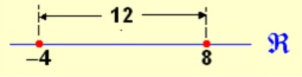
</p>
:::

:::

:::

::: {.fragment fragment-index="4"}

::: {.bg style="background-color:#e6f7ff; padding:0.75em; border-left:6px solid #31BAE9; border-radius: 8px;"}
**Observación:**  
Dos puntos "**x**" e "**y**" son muy (poco) [**próximos**]{.alert} si $d(x, y) = |y - x|$  
es un número muy [**próximo**]{.alert} a cero.
:::

:::

## [**Entorno de un punto en la recta real (continua...)**]{.bg style="--col:#ffff00"} {.scrollable}

### ¿Qué es un entorno?

::: {.bg style="background-color:#e6f7ff; padding:0.75em; border-left:6px solid #31BAE9; border-radius: 8px;"}

Si **$c \in \mathfrak{R}$** y **$r>0$**, el [**entorno**]{.alert} de centro en "**c**" y radio "**r**" se denota **$B_r(c)$**, y lo forman los puntos "**x**" cuya distancia a "**c**" es inferior a "**r**".
:::

$$
B_r(c)=\{ x \in \mathfrak{R} \mid |x-c|<r \}=(c-r,c+r)
$$

::: center
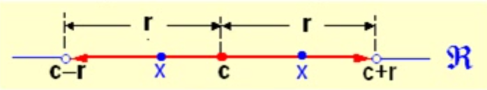
:::

::: columns

::: {.fragment}
::: {.column width="50%"}
::: {.bg style="background-color:#e6f7ff; padding:0.75em; border-radius: 8px;"}
El entorno de [centro]{.alert} en "**5**" y [radio]{.alert} **$0.02$** lo forman los "**x**" tales que **$|x-5|<0.02$**, o sea, son los puntos de intervalo **$(5-0.02, 5+0.02) \equiv (4.98,5.02)$**.
:::
:::


::: {.column width="50%"}
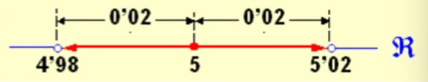
:::
:::

::: columns

::: {.fragment}
::: {.column width="50%"}
::: {.bg style="background-color:#e6f7ff; padding:0.75em; border-radius: 8px;"}
Del intervalo **$(4.98,5]$** se dice que es el [**semientorno izquierdo**]{.alert} de "**$5$**" y radio **$0.02$**.
:::
:::

::: {.column width="50%"}
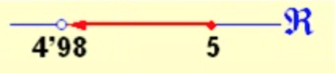
:::

:::

::: columns

::: {.fragment}
::: {.column width="50%"}
::: {.bg style="background-color:#e6f7ff; padding:0.75em; border-radius: 8px;"}
Del intervalo **$[5,5.02)$** se dice que es el [**semientorno derecho**]{.alert} de "**$5$**" y radio **$0.02$**.
:::
:::

::: {.column width="50%"}
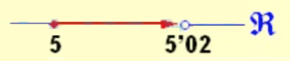
:::
:::

:::
:::
:::

## [**Entorno de un punto en la recta real**]{.bg style="--col:#ffff00"} {.scrollable}

$$
B_r(c)=\{ x \in \mathfrak{R} \mid x-c\mid <r \}=(c-r,c+r)
$$

::: center

:::

::: {.fragment}
::: {.bg style="background-color:#e6f7ff; padding:0.75em; border-left:6px solid #31BAE9; border-radius: 8px;"}
Si de **$B_r(c)$** [**eliminamos**]{.alert} el propio "**$c$**", obtenemos el [**entorno reducido**]{.alert} [**de centro en**]{.alert}  "**$c$**" [**y radio**]{.alert} "**$r$**", que denotamos **$B^*_r(c)$**:
:::

$$
B^*_r(c)=\{ x \in \mathfrak{R} \quad 0 < \mid x-c\mid < r \}=(c-r,c) \cup (c,c+r)
$$

::: center
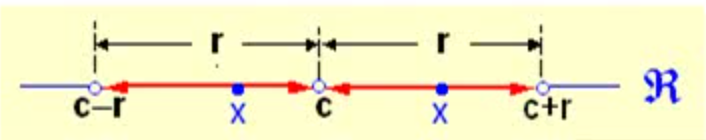
:::

:::


::: {.fragment}
::: {.bg style="background-color:#e6f7ff; padding:0.75em; border-radius: 8px;"}
El entorno $\color{blue}{reducido}$ de centro en "**$5$**" y radio **$0.02$** lo forman los $\color{blue}{\text{x}}$ tales que **$0<|x|<0.02$**; o sea, tales que **$x \in (4.98,5) \cup (5,5.02)$**.
:::

::: center
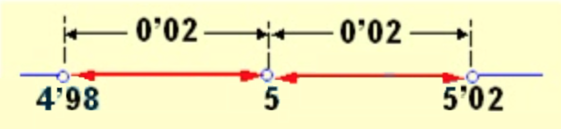
:::

::: {.bg style="background-color:#e6f7ff; padding:0.75em; border-radius: 8px;"}
Del intervalo **$(4.98,5)$** se dice que es el $\color{blue}{\text{semientorno reducido izuierdo}}$ de "**$5$**" y radio **$0.02$**; el intervalo **$(5,5.02)$** es el [**semientorno**]{.alert} reducido derecho de "**$5$**" y radio **$0.02$**
:::
:::

## [**Entorno de un punto en la recta real (continua...)**]{.bg style="--col:#ffff00"} {.scrollable}

De todo intervlo **$(a,+\infty)$** se dice que es un [**entorno**]{.alert} de **$+\infty$**.

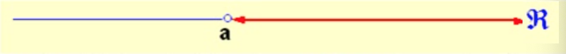

[**Por ejemplo**]{.alert}, el intervalo **$(6,+\infty)$** es entorno de **$+\infty$**, lo mismo que el intervalo **$(-15,+\infty)$**

::: {.fragment}
De todo intervalo $(-\infty, b)$ se dice que es un entorno de $-\infty$.

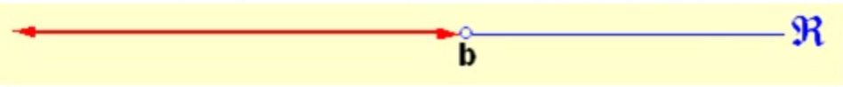

[**Por ejemplo**]{.alert}, el intervalo **$(- \infty,7)$** es [**entorno**]{.alert} de **$-\infty$**, lo mismo que el intervalo **$(-\infty,-17)$**.
:::

::: {.fragment}

::: {.bg style="background-color:#e6f7ff; padding:0.75em; border-radius: 8px;"}
**Que quede Claro!**

En estos dos casos la [**palabra**]{.alert} reducido no quita ni pone nada a la palabra [**entorno**]{.alert} pues como **$+\infty$** no es un número, hablar de un entorno de $+\infty$ es igual que hablar de un [**entorno reducido**]{.alert} de **$+\infty$**, y lo mismo con **$-\infty$**. 
:::
:::

## [**Propiedades de los números reales: $\mathfrak{R}$**]{.bg style="--col:#ffff00"} {.scrollable}

Supondremos la existencia de un conjunto $\mathbb{R}$ de números en el que hay definidas dos operaciones, suma y producto, con las siguientes propiedades:

::: {.bg style="background-color:#e6f7ff; padding:0.75em; border-left:6px solid #31BAE9; border-radius: 8px;"}

**Propiedades de la suma:**

  -   Conmutativa: $a+b= b+a$, para todos los $a,b \in \mathbb{R}$
      
  -   Asociativa: $a+(b+c) = (a+b)+c$ para todos los $a,b,c \in \mathbb{R}$

  -   Existe un elemento neutro, $0 \in \mathbb{R}$,  para la suma: $a+0=a=0+a$.
      
  -   Para cada $a \in \mathbb{R}$ existe un elemento $-a \in \mathbb{R}$, simétrico de $a$, tal que $a+(-a)=0=(-a)+a$
:::

## [**Propiedades de los números reales: $\mathfrak{R}$**]{.bg style="--col:#ffff00"} {.scrollable}

::: {.bg style="background-color:#e6f7ff; padding:0.75em; border-left:6px solid #31BAE9; border-radius: 8px;"}

**Propiedades del producto de números reales:**
      
  -   Conmutativa: $a\cdot b=b \cdot a$, para todos los $a,b \in \mathbb{R}$.
      
  -   Asociativa: $a \cdot (b \cdot c) = (a\cdot b)\cdot c$ para todos los $a,b,c \in \mathbb{R}$
      
  -   Existe un elemento neutro, $1 \in \mathbb{R}$,  para el producto: $a\cdot1=a=1\cdot a$.
      
  -   Para cada $a \in \mathbb{R}$, $a\neq 0$, existe un elemento $\dfrac{1}{a} = a^{-1} \in \mathbb{R}$, inverso de $a$, tal que $a \cdot a^{-1}=1=a ^{-1}\cdot a$
      
  -   El producto es distributivo respecto de la suma: $a\cdot (b+c) = a\cdot b + a \cdot c$ para todos los $a,b,c \in \mathbb{R}$.

:::


## Propiedades del valor absoluto

Sean $a, b \in \mathfrak{R}$:

| # | Propiedad | Nombre |
|---|---|---|
| 1 | $|a| \geq 0$ | No negatividad |
| 2 | $|a| = 0 \iff a = 0$ | Definitud |
| 3 | $|-a| = |a|$ | Simetría |
| 4 | $|ab| = |a||b|$ | Multiplicatividad |
| 5 | $\left|\dfrac{a}{b}\right| = \dfrac{|a|}{|b|},\ b\neq 0$ | División |
| 6 | $|a+b| \leq |a|+|b|$ | Desigualdad triangular |
| 7 | $|a-b| \leq |a|+|b|$ | Corolario triangular |
| 8 | $\big||a|-|b|\big| \leq |a-b|$ | Desigualdad inversa |


## Propiedad 1 — No negatividad: $|a| \geq 0$

Cada demostración usa únicamente la definición:$|a| = \begin{cases} a & \text{si } a \geq 0 \\ -a & \text{si } a < 0 \end{cases}$

::: dem
**Demostración.**

Sea $a \in \mathfrak{R}$ un número real arbitrario, tenemos dos casos debido a que $a$ puedo ser positivo (o cero) ó  negativo.

- **Caso 1:** Si $a \geq 0$, entonces $|a| = a \geq 0$. ✓

- **Caso 2:** Si $a < 0$, entonces $|a| = -a$. Como $a < 0$, multiplicar por $-1$ invierte la desigualdad: $-a > 0 \geq 0$. ✓

En ambos casos $|a| \geq 0$. $\blacksquare$
:::


## Propiedad 2 — Definitud: $|a| = 0 \iff a = 0$

Cada demostración usa únicamente la definición:$|a| = \begin{cases} a & \text{si } a \geq 0 \\ -a & \text{si } a < 0 \end{cases}$

::: dem
**Demostración.** Como se trata de una doble implicación, procederemos en ambas direcciones:

$(\Rightarrow)$ Supongamos que $|a| = 0$. Analicemos los posibles casos para a según la definición:

- **Caso 1:** Si $a > 0$, entonces $|a| = a$. Pero como suponemos $|a| = 0$, tendríamos que $0 > 0$, lo cual es una **contradicción**.

- **Caso 2:** Si $a < 0$, entonces $|a| = -a$. Dado que $a$ es negativo, $-a$ es positivo, por lo que $|a| > 0$. Esto contradice nuevamente que $|a| = 0$.

Por lo tanto, la única posibilidad lógica es que **$a = 0$**.

$(\Leftarrow)$ Recíprocamente, si $a = 0$, aplicando directamente la definición de valor absoluto (específicamente el caso $a \geq 0$), obtenemos que $|0| = 0$. $\blacksquare$
:::


## Propiedad 3 — Simetría: $|-a| = |a|$

Cada demostración usa únicamente la definición:$|a| = \begin{cases} a & \text{si } a \geq 0 \\ -a & \text{si } a < 0 \end{cases}$

::: dem
**Demostración.** Para demostrar que $|-a| = |a|$, analizaremos el comportamiento de $a$ según los tres casos posibles de su definición:

* **Caso 1: Si $a > 0$**
    En este caso, por definición tenemos que $|a| = a$. 
    Como $a$ es positivo, entonces $-a$ es negativo ($-a < 0$). Aplicando la definición para valores negativos:
    $$|-a| = -(-a) = a$$
    Por lo tanto, $|-a| = |a|$.

* **Caso 2: Si $a < 0$**
    Aquí, por definición se tiene que $|a| = -a$.
    Si $a$ es negativo, su opuesto $-a$ es positivo ($-a > 0$). Aplicando la definición para valores positivos:
    $$|-a| = -a$$
    Como en ambos lados obtenemos $-a$, se cumple que $|-a| = |a|$.

* **Caso 3: Si $a = 0$**
    Si $a$ es cero, entonces $-a = -0 = 0$. Sustituyendo directamente:
    $$|-0| = |0| = 0$$
    Lo que confirma que $|-a| = |a|$.


:::

## Propiedad 3 — Simetría: $|-a| = |a|$
### contuniación
::: dem
Dado que la igualdad se cumple para todos los casos posibles de $a$ en los números reales, queda demostrado que **$|-a| = |a|$**. $\blacksquare$
:::

## Propiedad 4 — Multiplicatividad: $|ab| = |a||b|$

Cada demostración usa únicamente la definición: $|a| = \begin{cases} a & \text{si } a \geq 0 \\ -a & \text{si } a < 0 \end{cases}$

::: dem
**Demostración.** Para demostrar que $|ab| = |a||b|$, analizaremos las cuatro combinaciones posibles de signos para $a$ y $b$. En cada caso, compararemos el resultado de $|ab|$ con el producto de los valores absolutos individuales:

* **Caso 1: $a \geq 0$ y $b \geq 0$**
    Como ambos son no negativos, su producto $ab \geq 0$. Por definición:
    $$|ab| = ab \quad \text{y} \quad |a||b| = (a)(b) = ab$$
    Ambas expresiones coinciden.

* **Caso 2: $a \geq 0$ y $b < 0$**
    En este caso, el producto es no positivo ($ab \leq 0$). Aplicando la definición:
    $$|ab| = -(ab) = a(-b)$$
    Dado que $|a| = a$ y $|b| = -b$, sustituimos y obtenemos:
    $$|ab| = |a||b|$$
:::

## Propiedad 4 — Multiplicatividad: $|ab| = |a||b|$
### continuación

::: dem
* **Caso 3: $a < 0$ y $b \geq 0$**
    Similar al anterior, el producto $ab \leq 0$. Entonces:
    $$|ab| = -(ab) = (-a)b$$
    Como $|a| = -a$ y $|b| = b$, la igualdad se mantiene:
    $$|ab| = |a||b|$$

* **Caso 4: $a < 0$ y $b < 0$**
    Aquí, el producto de dos negativos es positivo ($ab > 0$). Por lo tanto:
    $$|ab| = ab$$
    Por otro lado, $|a| = -a$ y $|b| = -b$. Al multiplicarlos:
    $$|a||b| = (-a)(-b) = ab$$
    Nuevamente, $|ab| = |a||b|$.

**Conclusión:** Habiendo agotado todos los casos posibles, se concluye que **$|ab| = |a||b|$** para cualesquiera $a, b \in \mathbb{R}$. $\blacksquare$

:::


## Propiedad 5 — División: $\left|\dfrac{a}{b}\right| = \dfrac{|a|}{|b|}$, con $b \neq 0$


Cada demostración usa únicamente la definición: $|a| = \begin{cases} a & \text{si } a \geq 0 \\ -a & \text{si } a < 0 \end{cases}$

::: dem
**Demostración.** En lugar de analizar casos individuales, utilizaremos la **Propiedad 4 (Multiplicatividad)** sobre una identidad conocida. 

Partimos de la relación fundamental entre división y multiplicación:
$$\left( \frac{a}{b} \right) \cdot b = a$$

1. **Aplicamos valor absoluto** a ambos lados de la igualdad:
   $$\left| \frac{a}{b} \cdot b \right| = |a|$$

:::

## Propiedad 5 — División: $\left|\dfrac{a}{b}\right| = \dfrac{|a|}{|b|}$, con $b \neq 0$
### continuación

::: dem
2. **Aplicamos la propiedad de multiplicatividad** ($|x \cdot y| = |x| \cdot |y|$) en el lado izquierdo:
   $$\left| \frac{a}{b} \right| \cdot |b| = |a|$$

3. **Despejamos el término deseado:** Dado que por hipótesis $b \neq 0$, la **Propiedad 2 (Definitud)** nos asegura que $|b| \neq 0$. Por lo tanto, podemos dividir ambos lados de la ecuación entre $|b|$ sin incurrir en una indeterminación:
   $$\left| \frac{a}{b} \right| = \frac{|a|}{|b|}$$

**Conclusión:** La propiedad queda demostrada para todo $b \neq 0$. $\blacksquare$
:::


## Propiedad 6 — Desigualdad triangular: $|a+b| \leq |a|+|b|$

Cada demostración usa únicamente la definición:$|a| = \begin{cases} a & \text{si } a \geq 0 \\ -a & \text{si } a < 0 \end{cases}$

¡importante!. La demostración estándar usa un lema previo.

**Lema:**  Para todo $x \in \mathbb{R}$, se cumple $x \leq |x|$ y $-x \leq |x|$.

::: dem

*Demostración del lema:*

Para cualquier número real $x$, se cumplen siempre las siguientes dos condiciones:

- Si $x \geq 0$: $|x| = x$, entonces $x = |x|$ y $-x \leq 0 \leq x = |x|$. ✓

- Si $x < 0$: $|x| = -x > 0 > x$, entonces $x < |x|$ y $-x = |x|$. ✓

**Breve explicación:** Si $x$ es positivo, es igual a su valor absoluto; si es negativo, es menor que su valor absoluto (que es positivo). Lo mismo ocurre para su opuesto.
:::

## Propiedad 6 — Desigualdad triangular: $|a+b| \leq |a|+|b|$

### continuación

::: dem

**Demostración de la propiedad.**

Por el lema aplicado a $a$ y a $b$:

$$a \leq |a|, \quad b \leq |b| \implies a + b \leq |a| + |b| \tag{i}$$

$$-a \leq |a|, \quad -b \leq |b| \implies -(a+b) \leq |a| + |b| \tag{ii}$$

De (i) y (ii) tenemos que tanto $a+b$ como $-(a+b)$ son menores o iguales que $|a|+|b|$. Pero por definición:

$$|a+b| = \begin{cases} a+b & \text{si } a+b \geq 0 \\ -(a+b) & \text{si } a+b < 0 \end{cases}$$

En cualquier caso $|a+b| \leq |a|+|b|$. $\blacksquare$

:::


## Propiedad 7 — Corolario: $|a - b| \leq |a| + |b|$

Cada demostración usa únicamente la definición:$|a| = \begin{cases} a & \text{si } a \geq 0 \\ -a & \text{si } a < 0 \end{cases}$

::: dem
**Demostración.** utilizaremos la **Propiedad 6 (Desigualdad Triangular)** mediante un proceso de sustitución. 

Podemos reescribir la resta $a - b$ como una suma de la siguiente manera:
$$|a - b| = |a + (-b)|$$

Aplicamos la propiedad (desigualda triangular) a los términos $a$ y $(-b)$:
    $$|a + (-b)| \leq |a| + |-b|$$

Ahora por la **Propiedad 3** (simetría), sabemos que el valor absoluto de un número es igual al de su opuesto ($|-b| = |b|$). Sustituyendo este valor en la expresión anterior, obtenemos:
    $$|a| + |-b| = |a| + |b|$$

Por lo tanto, uniendo ambos pasos, confirmamos que:
$$|a - b| \leq |a| + |b|$$ $\blacksquare$

:::


## Propiedad 8 — Desigualdad inversa: $\big||a|-|b|\big| \leq |a-b|$

Cada demostración usa únicamente la definición:$|a| = \begin{cases} a & \text{si } a \geq 0 \\ -a & \text{si } a < 0 \end{cases}$

::: dem
**Demostración.** Utilizaremos la **Desigualdad Triangular** de forma estratégica mediante una descomposición aditiva. Procederemos en dos partes:

**Parte 1: Análisis para $a$**
Podemos expresar $a$ como la suma $(a - b) + b$. Aplicando la desigualdad triangular ($|x+y| \leq |x| + |y|$):
$$|a| = |(a - b) + b| \leq |a - b| + |b|$$
Si restamos $|b|$ en ambos lados, obtenemos nuestra primera relación:
$$(i) \quad |a| - |b| \leq |a - b|$$

:::

## Propiedad 8 — Desigualdad inversa: $\big||a|-|b|\big| \leq |a-b|$

::: dem
**Parte 2: Análisis para $b$ (Análogo)**
De igual forma, expresamos $b$ como $(b - a) + a$:
$$|b| = |(b - a) + a| \leq |b - a| + |a|$$
Restando $|a|$ en ambos lados:
$$|b| - |a| \leq |b - a|$$
Como sabemos que $|b - a| = |a - b|$ (por simetría), y multiplicando por $-1$ (lo que invierte la desigualdad), tenemos:
$$(ii) \quad -(|a| - |b|) \leq |a - b|$$

**Conclusión: Aplicando la definición**
Hemos demostrado que tanto la expresión $(|a| - |b|)$ como su opuesto $-(|a| - |b|)$ son menores o iguales a $|a - b|$. 

Por la definición de valor absoluto, el término $||a| - |b||$ debe ser igual a uno de esos dos valores. Como ambos cumplen la cota, concluimos que:
$$||a| - |b|| \leq |a - b|$$

$\blacksquare$

:::


## Interpretación geométrica de las más importantes

| Propiedad | Significado en la recta real |
|---|---|
| $|a|$ | Distancia de $a$ al origen |
| $|a-b|$ | Distancia entre los puntos $a$ y $b$ |
| $\|a+b\| \leq \|a\|+\|b\|$ | El camino directo nunca es más largo que el camino en dos tramos |
| $\big\||a|-|b\|\big| \leq \|a-b\|$ | La diferencia de distancias al origen no supera la distancia entre los puntos |


  