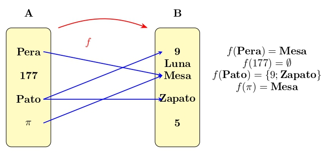
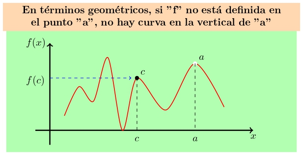

```{r}
#| context: setup
#addResourcePath("Images", "Images")
```

# **Fundamentos Teóricos de Funciones** {.my-slide}

## ¿Por qué Funciones? La Piedra Angular del ML

::: {.bg style="background-color:#fdf6e3; padding:0.75em; margin-top:0.5em;"}
"Los modelos de **Machine Learning** son, en su esencia, funciones que transforman datos de entrada en datos de salida."
:::

* Ejemplos intuitivos:
    * **Función de Regresión:** $y = f(x)$ (ej., predecir precios de casas).
    * **Función de Costo/Pérdida:** $J(w)$ (ej., cuantificar el error de una predicción).
    * **Funciones de Activación:** $g(z)$ (ej., el "interruptor" en una neurona artificial).

## CORRESPONDENCIA DE CONJUNTOS {.small}

::: columns

::: {.column width="50%" style="text-align: center;"} 

::: {.fragment fragment-index="1"}
::: {.bg style="background-color:#e6f7ff; padding:0em;font-size: 0.9em;"}
Si $"A"$ y $"B"$ son conjuntos cualesquiera, se llama [**correspondencia**]{.alert} de $A$ en $B$ a todo criterio o ley que asocia elementos de $"A"$ con elementos de $"B"$.
:::
:::


::: {.fragment fragment-index="2"}
::: {.bg style="background-color:#e6f7ff; padding:0em;font-size: 0.9em; "}
Si el nombre del criterio es $"f"$, para expresar que $"f"$ es una [**correspondencia**]{.alert} de $"A"$ en $"B"$ escibimos $f:A\longrightarrow B$.
:::
:::

::: {.fragment fragment-index="3"}
::: {.bg style="background-color:#e6f7ff; padding:0em;font-size: 0.9em;"}
De $"A"$ se dice que es el [**conjunto inicial**]{.alert} de $"f"$ de $"B"$ se dice es el [**conjunto final**]{.alert}
de $"f"$
:::
:::

::: {.fragment fragment-index="4"}

:::

:::

::: {.column width="50%" style="text-align: center;"}

::: {.fragment fragment-index="5"}


::: definition
**Observaciones:**
:::

::: {.bg style="background-color:#e6f7ff; padding:0.75em;font-size: 0.9em; "}
- En el conjunto inicial "A" puede haber elementos (177) a los que "f" no les asocia nungún elemento de "B".

- En el conjunto inicial "A" puede haber elementos (Pato) a los que "f" les asocie varios elemento de "B".

- En el conjunto final "B" puede haber elementos (5 y Luna) que no corresponden a ningún  elemento de "A".

- En el conjunto final "B" puede haber elementos (Mesa) que corresponden a varios elementos de "A".
:::
:::

::: {.fragment fragment-index="6"}


[**Que quede clarito:**]{.bg style="--col:#ffff00"} en la definición de correspondecia no se impone ninguna restricción o traba al criterio $"f"$ que asocia elementos de $"A"$ con elementos $"B"$; por tanto queda definida una correspondencia de $"A"$ en $"B"$ en el mismo instante en que se establece un [criterio o ley que asocie]{.alert} elementos de $"A"$ con elementos de $"B"$, aunque ese criterio sea muy absurdo o [**chiripitíflautico**]{.alert}.

:::

:::

:::

## 

::: columns

::: {.column width="50%" style="text-align: center;"}

::: {.fragment fragment-index="1"}

::: {.bg style="background-color:#e6f7ff; padding:0.75em; font-size: 0.75em;margin-top:-2.2em;"}
Si $x \in A$ para referirnos al elemento de $"B"$ que $"f"$ asocia a $"x"$, usaremos la notación $"f(x)"$, que los profesionales leen [**efe de x**]{.alert}, pero tú debes leer [**imagen de x según f.**]{.alert}
:::
:::

::: {.bg style="padding:0.75em; font-size: 0.7em;margin-top:-0.7em;"}
::: {.fragment fragment-index="2"}
{height="240px"}
:::
:::

::: {.fragment fragment-index="3"}
::: {.bg style="padding:0.75em; font-size: 0.7em;margin-top:-2.5em;"}

:::
:::

:::

::: {.column width="50%" style="text-align: center;"}

::: {.fragment fragment-index="4"}

::: cuadro2

::: definition

::: {style="font-size: 2em; color: #ff0000; font-weight: bold;font-size: 1.5em;margin-top:-1em;"}
**Aviso navegantes:**
:::

**¡Están condenados al [**fracaso**]{.alert} los principiantes que se empecinen en leer como profesionales!, pues tras la notación [**$f(x)$**]{.alert} hay 5 protagonistas, y el cerebro debe estar simultáneamente pendiente de todos ellos:**
:::

:::

:::
::: {.fragment fragment-index="5"}


::: incremental

::: {.bg style="background-color:#e6f7ff; padding:0em; font-size: 0.75em;margin-top:.2em;"}

- El conjunto $"A"$, que es protagonista [**invisible**]{.fg style="--col: #228dff"}, pues $"A"$ no parece por ningún lado en la notación [**$"f(x)"$**]{.alert} ... ¡pero está!.

- El conjunto $"B"$, también [**invisible**]{.fg style="--col: #228dff"}

- La ley $"f"$ que asocia elementos de $"A"$ con elementos de $"B"$; es protagonista [**visible**]{.fg style="--col: #228dff"}, pues en la notación [**$"f(x)"$**]{.alert} hay una $"f"$.

- El elemento $"x"$ del conjunto $"A"$; también es [**visible**]{.fg style="--col: #228dff"}, pues en la notación [**$"f(x)"$**]{.alert} hay una $"x"$.

- El 5° protagonista es un elemento de $"B"$, pero no un elemento de cualquiera de $"B"$, el 5° protagonista es el elemento de $"B"$ que la ley $"f"$ asocia a $"x"$, y para denotarlo nadie ha inventado una notación más clara y concisa que [**$"f(x)"$**]{.alert}, introducida por **Euler** en 1734.
:::
:::
:::
:::
:::

## Función real de variable real {.small}

### ¿No es fascinante cómo una función real de variable real puede describir el comportamiento de tantas situaciones en el mundo real, conectando conceptos abstractos con la realidad tangible?

::: columns

::: {.column width="50%" style="text-align: center;"}

::: {.fragment fragment-index="1"}

::: {style="font-size: 2em; color: #ff0000; font-weight: bold;"}
**Dirichlet,1854**
:::

:::

::: {.fragment fragment-index="2"}
{height="300px"}

:::

::: {.fragment fragment-index="3"}
::: {.bg style="background-color:#e6f7ff; padding:0.75em;font-size: 0.75em;margin-top:-0.5em"}
Llamamos [**función real de variable real**]{.alert} a toda correspondencia $f: \mathfrak{R} \longrightarrow \mathfrak{R}$; o sea, una función real de variable real es una ley o criterio $f$ que asocia números reales con números reales.
:::
:::

:::


::: {.column width="50%" style="text-align: center;"}

::: {.fragment fragment-index="3"}

{height="90px"}

:::

::: {.fragment fragment-index="3"}
Se dice que $f: \mathfrak{R} \longrightarrow \mathfrak{R}$ es una [función real]{.alert} porque su conjunto final es $\mathfrak{R}$ se dice que $f$ es de [variable real]{.alert} porque su conjunto inicial es $\mathfrak{R}$

:::

::: {.fragment fragment-index="4"}
Para expresar que el número real $x \in \mathfrak{R}_{inicial}$ puede ser el que queramos, se dice que $x$ es una [variable independiente]{.alert}; y para expresar que el número real $f(x) \in \mathfrak{R}_{final}$ que $f$ asocia a $x$ escapa por completo a nuestro control, pues es $f$ quien decide el valor de $f(x)$, se dice que el número real que denotamos $"f(x)"$ es una [variable dependiente.]{.alert}
:::

:::

:::

## Ejemplos {.scrollable}

::: {.bg style="background-color:#fdf6e3; padding:0.75em;font-size: 0.75em;margin-top:-0.5em "}
Por ejemplo, al hablar de la función $f:\mathfrak{R} \longrightarrow \mathfrak{R}$ tal que $f(x)=\frac{x}{x-1}$ se habla de la ley $"f"$ que al número real $"x"$ le asocia el número real $\frac{x}{x-1}$; así, al número $5$ la ley $"f"$ le asocia el número  $\frac{5}{5-1}$ , al número $9$ le asocia el número $\frac{5}{5-1}$..... y escribemos:
:::

$$
f(5)=\frac{5}{5-1}=\frac{5}{4}\quad ;\quad f(9)=\frac{9}{9-1}=\frac{9}{8}
$$

::: {.bg style="padding:0.75em;font-size: 0.75em;margin-top:-0.5em "}
::: center

:::
:::

## 

::: {.bg style="padding:0em;font-size: 0.75em;margin-top:0em "}
**Análogamente:**

::: columns
::: center
::: {.fragment}
$$
\color{red}{f(x)=\frac{x}{x-1}}
$$
:::
:::

::: columns

::: {.column width="50%"}

::: {.bg style="background-color:#fdf6e3; padding:0.5em;" .fragment}
**Si evaluamos**: $x = 3 + h$

$$
f(3+h) = \frac{3+h}{(3+h)-1}
= \frac{3+h}{2+h}
$$
:::

:::

::: {.column width="50%"}

::: {.bg style="background-color:#fdf6e3; padding:0.5em;" .fragment}
**Si evaluamos**: $x = 2 - h$

$$
f(2-h) = \frac{2-h}{(2-h)-1}
= \frac{2-h}{1-h}
$$
:::

:::

:::


::: {.fragment}
Si, operamos la siguiente expresion: Diferencia de cociente 

$$
\color{red}{\frac{f(x+h)-f(x)}{(x+h)-x}}
$$
:::

::: center
::: {.bg style="padding:0em;" .fragment}
**Queremos calcular:**

$$
\color{red}{\frac{f(x+h)-f(x)}{(x+h)-x}}= \frac{\frac{6+h}{(6+h)-1} - \frac{6}{6-1}}{h}
= -\frac{1}{5(5+h)}
$$
:::
:::
:::
:::

## DOMINIO DE DEFINICION DE UNA FUNCION

::: {.bg style="background-color:#ccf5cc; padding:0.8em; margin-top:0em; font-size:0.85em; border-radius: 0.5em;"}
El [dominio de definición]{.alert} de la $f:\mathfrak{R} \longrightarrow \mathfrak{R}$ se denota [Dom(f)]{.alert}, y es el subconjunto de $\mathfrak{R}_{inicial}$ formado por los puntos a los que $f$ les asigna imagen en $\mathfrak{R}_{final}$:
:::

::: center
[$$
Dom(f)= \{ x\in \mathfrak{R} \;| \;f(x)\in \mathfrak{R}\}
$$]{.bg style="--col: #e0ffff"}
:::

::: {.bg style="padding:0em; margin-top:-1em; font-size:0.75em;"}
Si $f(a) \in \mathfrak{R}$ se dice que $f$ [esta definida]{.alert} en el punto $"a"$, y si $f(a) \notin \mathfrak{R}$ se dice que $"f"$ [no está definida]{.alert} en "a".
:::

::: {.bg style="padding:0em; margin-top:-0.5em; font-size:0.75em;"}

::: {.r-stack}

::: {.fragment fragment-index="1"}

::: center

{width="80%"}

:::

:::

::: {.fragment fragment-index="2"}

::: center

{width="80%"}
:::

:::

:::
:::

Una función real de variable real $f:A \subset \mathfrak{R} \rightarrow \mathfrak{R}$ es una regla que asigna a cada elemento de un primer conjunto $A$, un único elemento de un segundo conjunto $\mathfrak{R}$. Las funciones son relaciones entre los elementos de dos conjuntos.

Se llama **dominio** de la función $f$ al conjunto de valores para los cuales la misma está definida

$$Dom\ (f) = A = \{x\in \mathbb R| \exists! y \in \mathbb R: f(x)=y\}$$
El conjunto de todos los resultados posibles de una función dada se denomina **rango**, **imagen** o **codominio** de esa función. 

$$Im\ (f) = \{y\in \mathbb R| \exists x \in \mathbb R: f(x)=y\}$$


## [LA PREGUNTA DEL MILLÓN, [¿Para que sirve la tasa de cambio?]{.bg style="--col: #ffff00"}{with="20%"}]{.bg style="--col: #fdf6e3"} {.scrollable}

::: {.bg style="background-color:#d6f7db; padding:0.25em; border-left:6px solid #228B22;font-size:1.4em;"}
El cociente $\color{blue}{\frac{f(x+h)-f(x)}{(x+h)-x}}$, que es la [**TASA DE CAMBIO**]{.alert} de la funcion $f: \mathfrak{R} \longmapsto \mathfrak{R}$ si la vararible independiente varia desde **x** hasta **x+h**, tendra protagonismo estalar cuando hablemos de la [**derivada**]{.alert} de [**f**]{.alert} en [**x**]{.alert}
:::

## **UTILIDAD DE LA FUNCIÓN REAL DE VARIABLE REAL**

Comprenderás la [**importancia de las funciones reales de variable real**]{.alert} si imaginas que la variable independiente [**"x"**]{.alert} representa la cantidad de capital invertido por una bodega, mientras que la variable dependiente [**$f(x)$**]{.alert} representa la **producción de vino** obtenida.

::: columns

::: {.column width="30%"}
::: {.bg style="background-color:#d6f7db; padding:0.25em;"}

::: center
$$
\overset{\large x}{\text{Capital}} \quad \longrightarrow \quad \overset{\large f(x)}{\text{Producción}}
$$ 

Si invierto [**"x"**]{.alert} euros, la producción de vino es [**$1 + x^2$**]{.alert} litros. Es decir, mi función [**$f$**]{.alert} de producción está definida por:  
[**$f(x) = 1 + x^2$**]{.alert}
:::
:::

:::

::: {.column width="70%"}
::: center
{width="72%"}
:::
:::
:::

## Tasas de Cambio: Preparación para la Derivada

[**Determine la siguiente expresion $\color{red}{\frac{f(x+h)-f(x)}{(x+h)-x}}$ en los siguientes casos: $a. \quad f(x)=x^2 \quad; b. \quad f(x)=\frac{1}{x} \quad;c. \quad f(x)= 2^x$**]{.bg style="--col: #fdf6e3"} 

::: {.fragment fragment-index="2"}
$$
\frac{f(x+h)-f(x)}{(x+h)-x}=\frac{(x+h)^2-x^2}{h}=\frac{2xh+h^2}{h}= 2x+h
$$
:::

::: {.fragment fragment-index="1"}
::: center
{width="50%"}
:::
:::

::: footer
::: {.bg style="background-color:#d6f7db; padding:0em; border-left:0px solid #000000; border-radius: 1px;"}
$\color{blue}{\frac{f(x+h)-f(x)}{(x+h)-x}}$ es la [**Tasa de cambio**]{.alert} de la funcion $"f"$ si la variable independiente $\color{blue}{varia}$  desde "**x**" hasta "**x+h**"
:::
:::

## 

[**Determine la siguiente expresion $\color{red}{\frac{f(x+h)-f(x)}{(x+h)-x}}$ en los siguientes casos: $a. \quad f(x)=x^2 \quad; b. \quad f(x)=\frac{1}{x} \quad;c. \quad f(x)= 2^x$**]{.bg style="--col: #fdf6e3"} 

::: {.fragment fragment-index="2"}
$$
\frac{f(x+h)-f(x)}{(x+h)-x}=\frac{\frac{1}{(x+h)}-\frac{1}{x}}{h}=\frac{-h}{hx(h+x)}= \frac{-1}{x(x+h)}
$$
:::

::: {.fragment fragment-index="1"}
::: center
{width="50%"}
:::
:::

::: footer
::: {.bg style="background-color:#d6f7db; padding:0em; border-left:0px solid #000000; border-radius: 1px;"}
$\color{blue}{\frac{f(x+h)-f(x)}{(x+h)-x}}$ es la [**Tasa de cambio**]{.alert} de la funcion $"f"$ si la variable independiente $\color{blue}{varia}$  desde "**x**" hasta "**x+h**"
:::
:::


## 

[**Determine la siguiente expresion $\color{red}{\frac{f(x+h)-f(x)}{(x+h)-x}}$ en los siguientes casos: $a. \quad f(x)=x^2 \quad; b. \quad f(x)=\frac{1}{x} \quad;c. \quad f(x)= 2^x$**]{.bg style="--col: #fdf6e3"} 

::: {.fragment fragment-index="2"}
$$
\frac{f(x+h)-f(x)}{(x+h)-x}=\frac{(x+h)^2-x^2}{h}=\frac{2xh+h^2}{h}= 2x+h
$$
:::

::: {.fragment fragment-index="1"}
::: center
{width="50%"}
:::
:::

::: footer
::: {.bg style="background-color:#d6f7db; padding:0em; border-left:0px solid #000000; border-radius: 1px;"}
$\color{blue}{\frac{f(x+h)-f(x)}{(x+h)-x}}$ es la [**Tasa de cambio**]{.alert} de la funcion $"f"$ si la variable independiente $\color{blue}{varia}$  desde "**x**" hasta "**x+h**"
:::
:::

## 

[**Determine la siguiente expresion $\color{red}{\frac{f(x+h)-f(x)}{(x+h)-x}}$ en los siguientes casos: $a. \quad f(x)=x^2 \quad; b. \quad f(x)=\frac{1}{x} \quad;c. \quad f(x)= 2^x$**]{.bg style="--col: #fdf6e3"} 

::: {.fragment fragment-index="2"}
$$
\frac{f(x+h)-f(x)}{(x+h)-x}=\frac{2^{x+h}-2^x}{h}
$$
:::

::: {.fragment fragment-index="1"}
::: center
{width="50%"}
:::
:::

::: footer
::: {.bg style="background-color:#d6f7db; padding:0em; border-left:0px solid #000000; border-radius: 1px;"}
$\color{blue}{\frac{f(x+h)-f(x)}{(x+h)-x}}$ es la [**Tasa de cambio**]{.alert} de la funcion $"f"$ si la variable independiente $\color{blue}{varia}$  desde "**x**" hasta "**x+h**"
:::
:::

## 

[Si $f(x):\mathfrak{R} \longmapsto \mathfrak{R}$ es tal que $f(x):1+x^2$ determine su tasa de cambio en los siguientes casos:]{.bg style="--col: #fdf6e3"} 

::: {.bg style="padding:0em;font-size: 0.75em;margin-top:0em"}
- La variable independiente varia de 5 a 7
- La variable independiente varia de 5 a 2
- La variable independiente varia de 3 a 3.02
- La variable independiente varia de 3 a 2.97 
::: 

::: {.bg style="padding:0em;font-size: 0.7em;margin-top:0em"}

::: {.fragment fragment-index="1"}
$$
\frac{f(x+h)-f(x)}{(x+h)-x}=\frac{f(7)-f(5)}{7-5}=\frac{(1+7^2)-(1+5^2)}{2}= \frac{24}{2}=12
$$
:::

::: {.fragment fragment-index="2"}
$$
\frac{f(x+h)-f(x)}{(x+h)-x}=\frac{f(2)-f(5)}{2-5}=\frac{(1+2^2)-(1+5^2)}{-3}= \frac{-21}{-3}=7
$$
:::

::: {.fragment fragment-index="3"}
$$
\frac{f(x+h)-f(x)}{(x+h)-x}=\frac{f(3.02)-f(3)}{3.02-3}=\frac{(1+3.02^2)-(1+3^2)}{0.02}= \frac{0.1204}{0.02}=6.02
$$
:::

::: {.fragment fragment-index="4"}
$$
\frac{f(x+h)-f(x)}{(x+h)-x}=\frac{f(2.97)-f(3)}{2.97-3}=\frac{(1+2.97^2)-(1+3^2)}{-0.03}= \frac{-0.1791}{-0.03}=5.97
$$
:::
:::

::: footer
::: {.bg style="background-color:#d6f7db; padding:0em; border-left:0px solid #000000; border-radius: 1px;"}
$\color{blue}{\frac{f(x+h)-f(x)}{(x+h)-x}}$ es la [**Tasa de cambio**]{.alert} de la funcion $"f"$ si la variable independiente $\color{blue}{varia}$  desde "**x**" hasta "**x+h**"
:::
:::


## **Fijando ideas-problema parte 1 (capital-produccion)**


Si el capital empleado varia desde [**"x"**]{.alert} hasta [**"x+h"**]{.alert}, la produccion obtenida [**varia**]{.alert} desde [**$f(x)=1=x^2$**]{.alert} hasta [**$f(x+h)=1+(x+h)^2$**]{.alert}.
La pregunta seria? Cuantas unidades varia la produccion por cada unidad de varaicion de capital?

$$
\begin{array}{llll}
\left\{ 
\begin{array}{l}
\text{Tasa de cambio de "f" si v.i} \\
\text{varía desde "x" hasta "x+h"}
\end{array}
\right\} 
\equiv \frac{f(x+h)-f(x)}{(x+h)-x} \\
\equiv \frac{
\text{Variación de producción si el capital varía desde "x" a "x+h"}
}{
\text{Variación de capital}
} \equiv \\
\left\{
\begin{array}{l}
\text{Variación MEDIA de producción por cada unidad} \\
\text{de variación de capital cuando este varía desde "x" a "x+h"}
\end{array}
\right\} \\
= \frac{(1+(x+h)^2)-(1+x^2)}{h}= \frac{2xh+h^2}{h} = 2x + h
\end{array}
$$

## **Fijando ideas-problema parte 2 (capital-produccion)**

Saber que la tasa de cambio es: $TC=\frac{f(x+h)-f(x)}{(x+h)-x}= 2x+h \frac{litros}{euro}$ es una oportunidad ventajosa 

| x   | x + h | h     | **TC = 2·x + h** | **litros/euro**        |
|-----|-------|-------|------------------|-------------------------|
| 4   | 7     | 3     | 2·4 + 3          | 11                      |
| 4   | 2     | –2    | 2·4 + (–2)       | 6                       |
| 5   | 5.2   | 0.2   | 2·5 + 0.2        | 10.2                    |
| 5   | 4.9   | –0.1  | 2·5 + (–0.1)     | 9.9                     |
| ⋮   | ⋮     | ⋮     | ⋮                | ⋮                       |

## **Fijando ideas-problema parte 1 (tiempo-velocidad)**
{with="130%"}

Si el tiempo varia desde [**"x"**]{.alert} hasta [**"x+h"**]{.alert}, la velocidad obtenida [**varia**]{.alert} desde [**$f(x)=1+x^3$**]{.alert} hasta [**$f(x+h)=1+(x+h)^3$**]{.alert}.
La pregunta seria? Cuantas unidades varia la velocidad por cada unidad de [**variacion**]{.alert} de tiempo?

$$
\begin{array}{llll}
\left\{ 
\begin{array}{l}
\text{Tasa de cambio de "f" si v.i} \\
\text{varía desde "x" hasta "x+h"}
\end{array}
\right\} 
\equiv \frac{f(x+h)-f(x)}{(x+h)-x} \\
\equiv \frac{
\text{Variación de velocidad entre el instante  "x" y el "x+h"}
}{
\text{Variación de tiempo}
} \equiv \\
\left\{
\begin{array}{l}
\text{Variación MEDIA de velocidad por cada unidad} \\
\text{de variación de tiempo cuando este varía desde "x" a "x+h"}
\end{array}
\right\} \\
= \frac{(1+(x+h)^3)-(1+x^3)}{h}= \frac{3x^2h+3xh^2+h^3}{h} = 3x^2 + 3xh + h^2
\end{array}
$$

[[**Aceleracion media**]{.alert}]{.bg style="--col:#fdf6e3"} entre el instante **"x"** y el instante **"x+h"**

## **Fijando ideas-problema parte 2 (tiempo-velocidad)**]
Saber que la tasa de cambio es: $TC=\frac{f(x+h)-f(x)}{(x+h)-x}= 3x^2+3xh+h^2 \frac{km-hora}{hora}$ es una oportunidad ventajosa 

| x   | x + h | h     | **TC = 3·x² + 3·x·h + h²**             | **km/hora ÷ hora**       |
|-----|-------|-------|----------------------------------------|---------------------------|
| 5   | 9     | 4     | 3·5² + 3·5·4 + 4² = 75 + 60 + 16 = 151 | 151                       |
| 5   | 3     | –2    | 3·5² + 3·5·(–2) + (–2)² = 75 – 30 + 4 = 49 | 49                     |
| ⋮   | ⋮     | ⋮     | ⋮                                      | ⋮                         |


## Aprendizaje Práctico – Experimental (1h):


