```{r}
knitr::opts_chunk$set(echo = TRUE)
library(reticulate)
use_python("/opt/anaconda3/bin/python")
```

```{r}
#| context: setup
#addResourcePath("Images", "Images")
```


# Límites {.my-slide}

## Límites

::: {.bg style="padding:0em; margin-top:0em; font-size:1.4em;margin-top:0em"}

Límites en geometría y álgebra.

En este presentación, aprenderás

  - [La interpretación geométrica de los límites.]{style="color:#107895; font-size:1.05em;" .fragment}

  - [Cómo encontrar límites "fáciles" mediante inspección visual.]{style="color:#107895; font-size:1.05em;" .fragment}

  - [Notación para los límites.]{style="color:#107895; font-size:1.05em;" .fragment}
:::

## {auto-animate=true background-color="rgb(255, 255, 255)" .white-canvas}

::: {style="text-align:center; margin:0; padding:0;"}
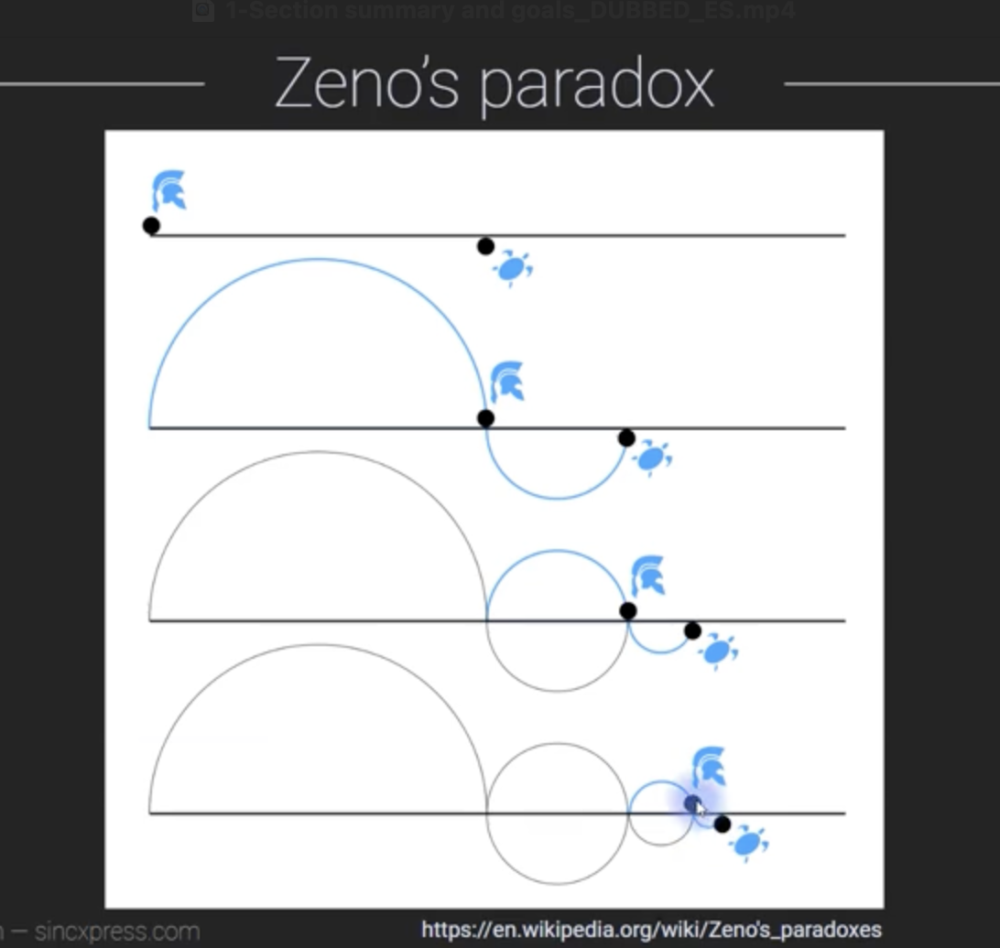{#slide-img width="50%"}
:::

---

## {auto-animate=true background-color="rgb(255, 255, 255)" .white-canvas}

::: {style="text-align:center; margin:0; padding:0;"}
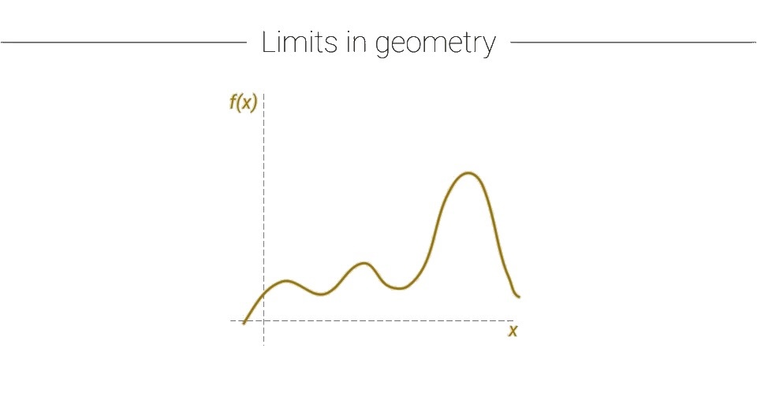{#slide-img width="100%"}
:::

---

## {auto-animate=true background-color="#ffffff" .white-canvas}

::: {style="text-align:center; margin:0; padding:0;"}
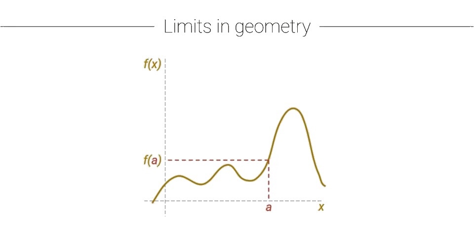{#slide-img width="100%"}
:::

---

## {auto-animate=true background-color="#ffffff" .white-canvas}

::: {style="text-align:center; margin:0; padding:0;"}
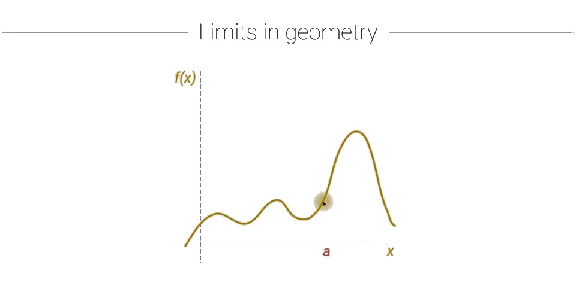{#slide-img width="100%"}
:::

---

## {auto-animate=true background-color="#ffffff" .white-canvas}

::: {style="text-align:center; margin:0; padding:0;"}
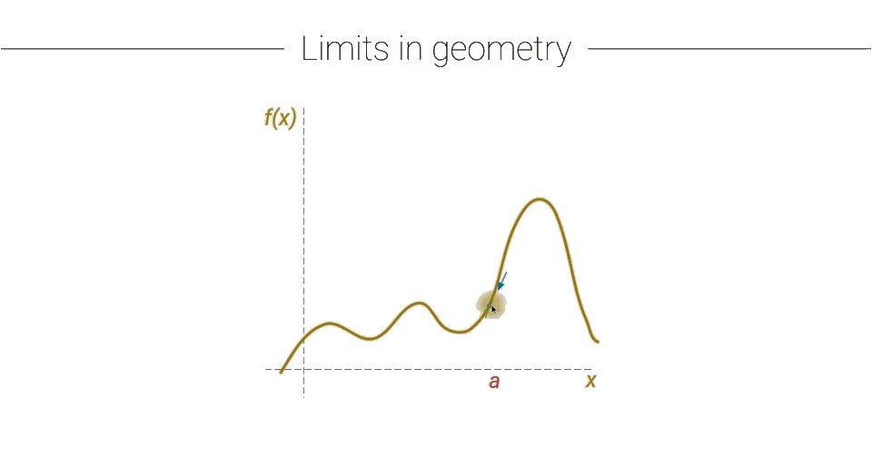{#slide-img width="100%"}
:::

---

## {auto-animate=true background-color="#ffffff" .white-canvas}

::: {style="text-align:center; margin:0; padding:0;"}
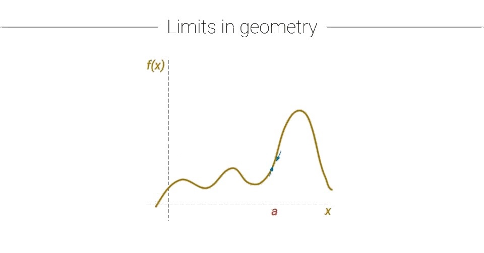{#slide-img width="100%"}
:::

---

## {auto-animate=true background-color="#ffffff" .white-canvas}

::: {style="text-align:center; margin:0; padding:0;"}
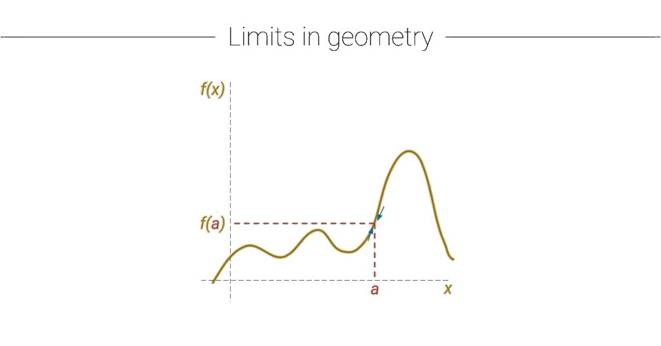{#slide-img width="100%"}
:::

---

## {auto-animate=true background-color="#ffffff" .white-canvas}

::: {style="text-align:center; margin:0; padding:0;"}
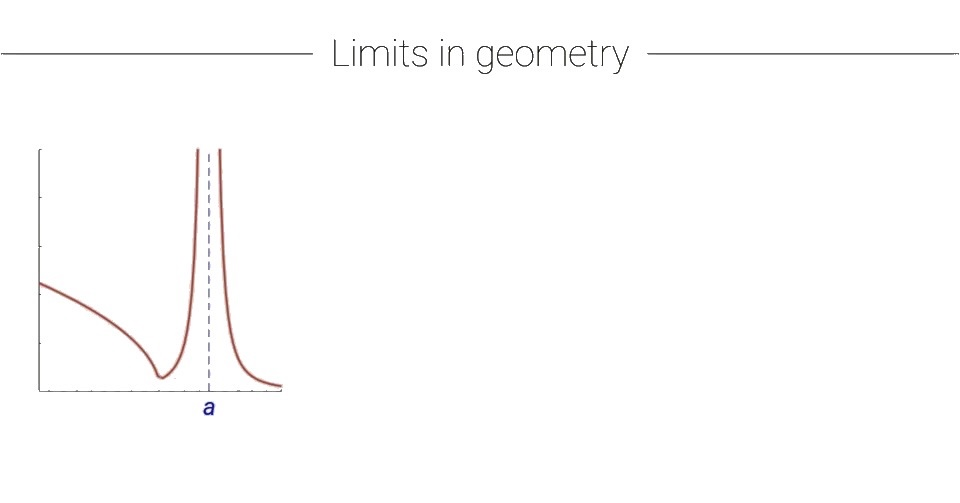{#slide-img width="100%"}
:::

---

## {auto-animate=true background-color="#ffffff" .white-canvas}

::: {style="text-align:center; margin:0; padding:0;"}
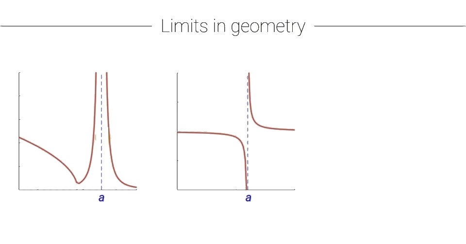{#slide-img width="100%"}
:::

---

## {auto-animate=true background-color="#ffffff" .white-canvas}

::: {style="text-align:center; margin:0; padding:0;"}
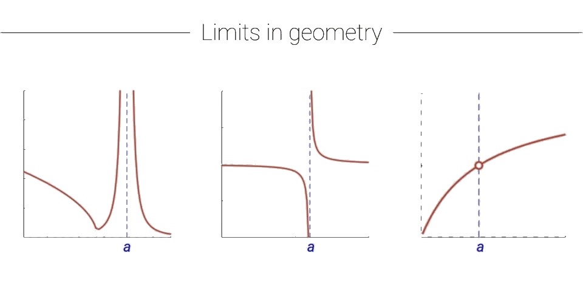{#slide-img width="100%"}
:::

---

## {auto-animate=true background-color="#ffffff" .white-canvas}

::: {style="text-align:center; margin:0; padding:0;"}
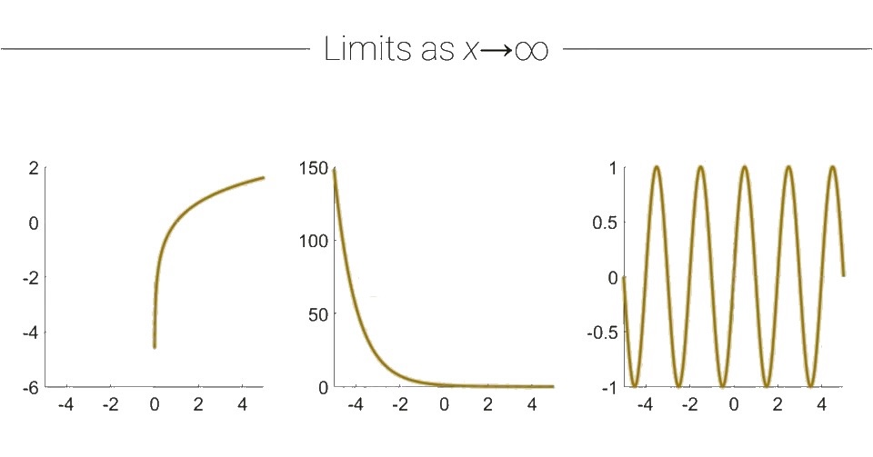{#slide-img width="100%"}
:::

---

## {auto-animate=true background-color="#ffffff" .white-canvas}

::: {style="text-align:center; margin:0; padding:0;"}
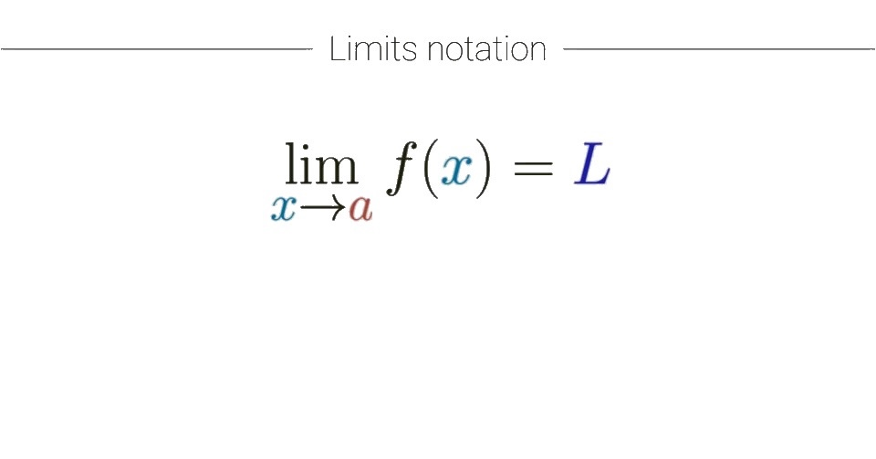{#slide-img width="100%"}
:::

---

## {auto-animate=true background-color="#ffffff" .white-canvas}

::: {style="text-align:center; margin:0; padding:0;"}
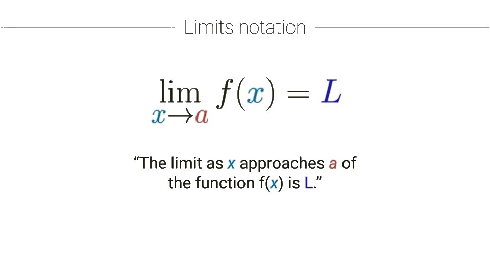{#slide-img width="100%"}
:::

---

## {auto-animate=true background-color="#ffffff" .white-canvas}

::: {style="text-align:center; margin:0; padding:0;"}
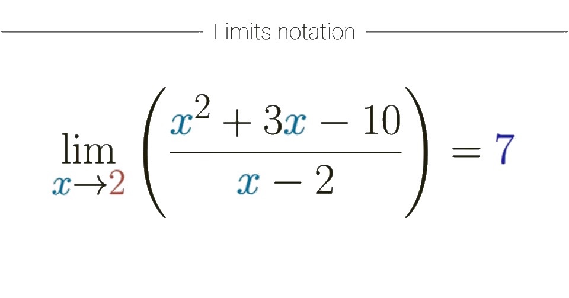{#slide-img width="100%"}
:::

---

## {auto-animate=true background-color="#ffffff" .white-canvas}

::: {style="text-align:center; margin:0; padding:0;"}
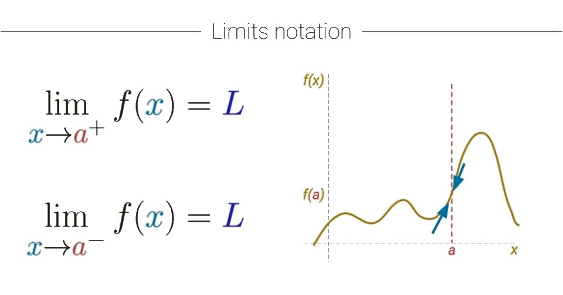{#slide-img width="100%"}
:::

---

## {auto-animate=true background-color="#ffffff" .white-canvas}

::: {style="text-align:center; margin:0; padding:0;"}
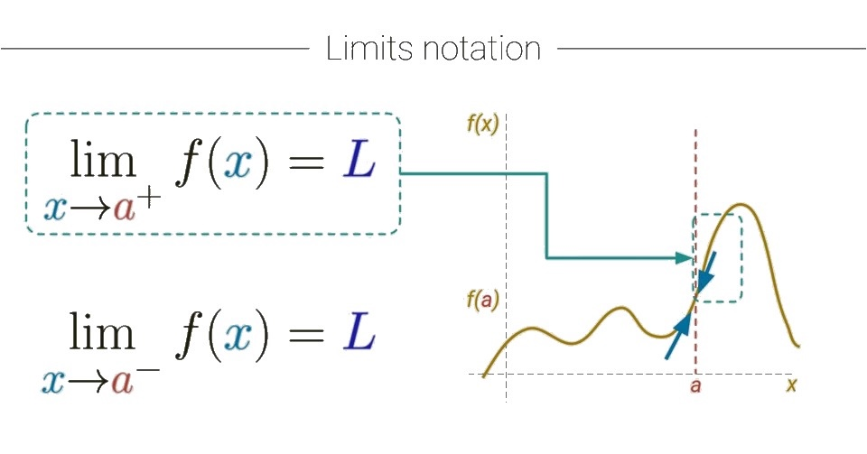{#slide-img width="100%"}
:::

---

## {auto-animate=true background-color="#ffffff" .white-canvas}

::: {style="text-align:center; margin:0; padding:0;"}
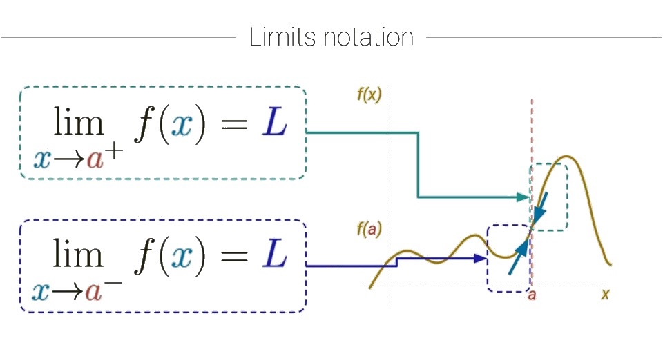{#slide-img width="100%"}
:::

---

## Límite de una función en un punto

::: {.callout-note style="font-size: 1.5em;"}

Si $f:A \subset \mathfrak{R} \longrightarrow \mathfrak{R}$ está definida en [todo punto de un entorno reducido]{.alert} del punto $c \in \mathfrak{R}$, diremos que $L$ es el límite de $f$ en $c$ si $\displaystyle{\lim_{x \rightarrow c^{-}} f(x) = \lim_{x \rightarrow c^{+}} f(x) = L}$.

Y escribiremos
$$
\displaystyle{\lim_{x \rightarrow c} f(x) =L}
$$
:::

::: {.bg style="padding:0em; margin-top:0em; font-size:0.85em;margin-top:-1em"}
**Recuerda:** al escribir $x\to c$ queremos indicar que $x$ se aproxima a $c$ indistintamente por la derecha o por la izquierda. Además, Si los límites laterales de **$f$** en **$c$** son distintos diremos que **$f$** [no tiene límite]{.alert} en el punto **$c$**.
:::

::: {.bg style="padding:0em; margin-top:0em; font-size:0.75em;"}

::: {.r-stack}

::: {.fragment fragment-index="1"}
::: center
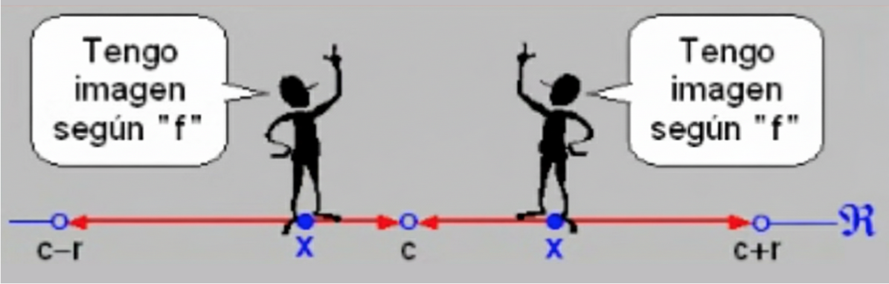{width="55%"}
:::
:::

::: {.fragment fragment-index="2"}
::: center
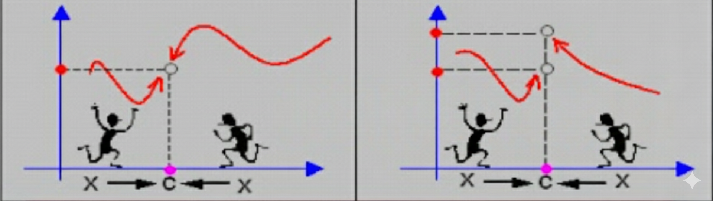{width="56%"}
:::
:::

:::
:::

## Taller experimental python

- Using Python: derivatives and applications

## Límites "fáciles" por sustitución o factorización

::: {.bg style="padding:0em; margin-top:0em; font-size:1.4em;margin-top:0em"}
[En esta presentación, aprenderás]{style="color:#107895; font-size:1.15em; font-weight:500;"}

- [Cómo encontrar los límites de problemas **"fáciles"**.]{style="color:#107895; font-size:1.05em;" .fragment}

- [Cómo factorizar polinomios para encontrar límites de funciones racionales.]{style="color:#B8860B; font-size:1.05em;" .fragment}
:::

## Conéctalo {.title-line}

:::{.r-stack style="font-size: 3em; width: 100%; text-align: center;"}
:::{.fragment .fade-out data-fragment-index=1}
$$\lim_{\color{teal}{x} \to \color{maroon}{2}} \left( \color{teal}{x}^2 + 3\color{teal}{x} - 10 \right) =$$
:::

:::{.fragment .fade-in data-fragment-index=1}
$$\lim_{\color{teal}{x} \to \color{maroon}{2}} \left( \color{teal}{x}^2 + 3\color{teal}{x} - 10 \right) = \color{blue}{0}$$
:::
:::

:::{.fragment .fade-up data-fragment-index=2 style="margin-top:-1.5em;"}
```{python}
#| echo: false
#| fig-align: center
#| results: "hide"
import numpy as np
import matplotlib.pyplot as plt

#plt.rcParams["text.usetex"] = True

x = np.linspace(-9, 10, 400)
y = x**2 + 3*x - 10

fig, ax = plt.subplots(figsize=(8, 4.5))

ax.grid(True, color="gray", alpha=0.15, linewidth=0.8)

# Ejes X e Y resaltados
ax.axhline(0, color="black", linewidth=1.8, zorder=2)
ax.axvline(0, color="black", linewidth=1.8, zorder=2)

ax.plot(x, y, color="#B8860B", linewidth=2.5, zorder=3)

ax.plot(2, 0, "o", color="red", markersize=9, zorder=5)
ax.annotate("$(2,\\ f(2)=0)$", xy=(2, 0), xytext=(3, 4),
            fontsize=13, color="red",
            arrowprops=dict(arrowstyle="-", color="red", lw=1.2))

ax.set_xlim(-10, 5)
ax.set_ylim(-15, 35)
ax.set_xticks(np.arange(-9, 6, 1))
ax.set_yticks(np.arange(-10, 31, 10))
ax.tick_params(labelsize=13)
ax.set_xlabel("$X$", fontsize=14, labelpad=8)
ax.text(0, 35, "$f(x)$", fontsize=18, ha="left", va="bottom")

for spine in ax.spines.values():
    spine.set_visible(False)

plt.tight_layout()
plt.show()
```
::: 

## Límites por factorización {.title-line}

:::{.r-stack style="width: 100%;"}

:::{.fragment .fade-out data-fragment-index=3 style="font-size: 1.8em; width: 100%; text-align: left;"}
$$\lim_{\color{teal}{x} \to \color{maroon}{2}} \frac{\color{teal}{x}^2 + 3\color{teal}{x} - 10}{\color{teal}{x} - 2}$$

:::{.fragment data-fragment-index=1}
$$= \lim_{\color{teal}{x} \to \color{maroon}{2}} \frac{(\color{teal}{x}+5)(\color{teal}{x}-2)}{\color{teal}{x}-2}$$
:::

:::{.fragment data-fragment-index=2}
$$= \lim_{\color{teal}{x} \to \color{maroon}{2}} (\color{teal}{x}+5) = \color{blue}{7}$$
:::
:::

:::{.fragment .fade-in data-fragment-index=3 style="width: 100%;"}
::::columns
::: {.column style="font-size: 2em;"} 
$$\lim_{\color{teal}{x} \to \color{maroon}{2}} \frac{\color{teal}{x}^2 + 3\color{teal}{x} - 10}{\color{teal}{x} - 2}$$
$$= \lim_{\color{teal}{x} \to \color{maroon}{2}} \frac{(\color{teal}{x}+5)(\color{teal}{x}-2)}{\color{teal}{x}-2}$$
$$= \lim_{\color{teal}{x} \to \color{maroon}{2}} (\color{teal}{x}+5) = \color{blue}{7}$$
:::

:::column
```{python}
#| echo: false
#| fig-align: center
#| results: "hide"
import numpy as np
import matplotlib.pyplot as plt

x1 = np.linspace(-5, 1.95, 300)
x2 = np.linspace(2.05, 5, 300)
y1 = x1 + 5
y2 = x2 + 5

fig, ax = plt.subplots(figsize=(7.5, 7.5))

ax.grid(True, color="gray", alpha=0.15, linewidth=0.8)
ax.axhline(0, color="black", linewidth=1.8, zorder=2)
ax.axvline(0, color="black", linewidth=1.8, zorder=2)

ax.plot(x1, y1, color="#B8860B", linewidth=2.5, zorder=3)
ax.plot(x2, y2, color="#B8860B", linewidth=2.5, zorder=3)

# Círculo abierto en (2, 7) — hueco por indeterminación
ax.plot(2, 7, "o", color="white", markersize=11, zorder=5,
        markeredgecolor="#B8860B", markeredgewidth=2.2)

ax.set_xlim(-3, 5)
ax.set_ylim(-10, 10)
ax.set_xticks(np.arange(-3, 5, 1))
ax.set_yticks(np.arange(-10, 20, 5))
ax.tick_params(labelsize=11)
ax.set_xlabel("$x$", fontsize=13, labelpad=8)
ax.text(0.1, 15, "$f(x)$", fontsize=14, ha="left", va="bottom")

for spine in ax.spines.values():
    spine.set_visible(False)

plt.tight_layout()
plt.show()
```
:::
::::
:::

:::

## Cómo encontrar este Límite {.title-line}

:::{style="display:flex; align-items:center; justify-content:center; height:80%;"}
::::columns
::: {.column style="font-size: 2em; text-align:center;"}
$$\lim_{\color{teal}{x} \to \color{maroon}{2}} \frac{|\color{teal}{x} - 2|}{\color{teal}{x} - 2} = \color{purple}{?}$$
:::

::: column
```{python}
#| echo: false
#| fig-align: center
#| results: "hide"
import numpy as np
import matplotlib.pyplot as plt

fig, ax = plt.subplots(figsize=(5.5, 5.5))

ax.grid(True, color="gray", alpha=0.15, linewidth=0.8)
ax.axhline(0, color="black", linewidth=1.8, zorder=2)
ax.axvline(0, color="black", linewidth=1.8, zorder=2)

# Rama izquierda: f(x) = -1 para x < 2
ax.plot([-3, 2], [-1, -1], color="#B8860B", linewidth=2.5, zorder=3)
# Rama derecha: f(x) = 1 para x > 2
ax.plot([2, 5], [1, 1], color="#B8860B", linewidth=2.5, zorder=3)

# Círculos abiertos en x=2
ax.plot(2, -1, "o", color="white", markersize=10, zorder=5,
        markeredgecolor="#B8860B", markeredgewidth=2.2)
ax.plot(2,  1, "o", color="white", markersize=10, zorder=5,
        markeredgecolor="#B8860B", markeredgewidth=2.2)

ax.set_xlim(-3, 5)
ax.set_ylim(-1.5, 1.5)
ax.set_xticks([-2, 0, 2, 4])
ax.set_yticks([-1.5, -1, -0.5, 0, 0.5, 1, 1.5])
ax.tick_params(labelsize=12)

for spine in ax.spines.values():
    spine.set_visible(False)

plt.tight_layout()
plt.show()
```
:::
::::
:::

## Cómo encontrar este Límite-solución {.title-line}

:::{style="display:flex; align-items:center; justify-content:center; height:80%;"}
::::columns
::: {.column style="font-size: 2em; text-align:center;"}
$$\lim_{\color{maroon}{x} \to \color{maroon}{2}^-} \frac{|\color{teal}{x} - 2|}{\color{teal}{x} - 2} = \color{blue}{-1}$$

$$\lim_{\color{maroon}{x} \to \color{maroon}{2}^+} \frac{|\color{teal}{x} - 2|}{\color{teal}{x} - 2} = \color{blue}{+1}$$
:::

:::column
```{python}
#| echo: false
#| fig-align: center
#| results: "hide"
import numpy as np
import matplotlib.pyplot as plt

fig, ax = plt.subplots(figsize=(5.5, 5.5))

ax.grid(True, color="gray", alpha=0.15, linewidth=0.8)
ax.axhline(0, color="black", linewidth=1.8, zorder=2)
ax.axvline(0, color="black", linewidth=1.8, zorder=2)

# Rama izquierda: f(x) = -1 para x < 2
ax.plot([-3, 2], [-1, -1], color="#B8860B", linewidth=2.5, zorder=3)
# Rama derecha: f(x) = 1 para x > 2
ax.plot([2, 5], [1, 1], color="#B8860B", linewidth=2.5, zorder=3)

# Círculos abiertos en x=2
ax.plot(2, -1, "o", color="white", markersize=10, zorder=5,
        markeredgecolor="#B8860B", markeredgewidth=2.2)
ax.plot(2,  1, "o", color="white", markersize=10, zorder=5,
        markeredgecolor="#B8860B", markeredgewidth=2.2)

ax.set_xlim(-3, 5)
ax.set_ylim(-1.5, 1.5)
ax.set_xticks([-2, 0, 2, 4])
ax.set_yticks([-1.5, -1, -0.5, 0, 0.5, 1, 1.5])
ax.tick_params(labelsize=12)

for spine in ax.spines.values():
    spine.set_visible(False)

plt.tight_layout()
plt.show()
```
:::
::::
:::


## Límites laterales e infinitos

::: {.bg style="padding:0em; margin-top:0em; font-size:1.4em;margin-top:0em"}

En esta presentación, aprenderás

  - [La diferencia entre límites laterales (unilaterales) y bilaterales.]{style="color:#107895; font-size:1.05em;" .fragment}

  - [Cómo describir límites al infinito.]{style="color:#107895; font-size:1.05em;" .fragment}

:::


## Cómo encontrar este Límite {.title-line}

:::{style="display:flex; align-items:center; justify-content:center; height:80%;"}
::::columns
::: {.column style="font-size: 2em; text-align:center;"}
$$\lim_{\color{teal}{x} \to \color{maroon}{2}} \frac{|\color{teal}{x} - 2|}{\color{teal}{x} - 2} = \color{purple}{?}$$
:::

::: column
```{python}
#| echo: false
#| fig-align: center
#| results: "hide"
import numpy as np
import matplotlib.pyplot as plt

fig, ax = plt.subplots(figsize=(5.5, 5.5))

ax.grid(True, color="gray", alpha=0.15, linewidth=0.8)
ax.axhline(0, color="black", linewidth=1.8, zorder=2)
ax.axvline(0, color="black", linewidth=1.8, zorder=2)

# Rama izquierda: f(x) = -1 para x < 2
ax.plot([-3, 2], [-1, -1], color="#B8860B", linewidth=2.5, zorder=3)
# Rama derecha: f(x) = 1 para x > 2
ax.plot([2, 5], [1, 1], color="#B8860B", linewidth=2.5, zorder=3)

# Círculos abiertos en x=2
ax.plot(2, -1, "o", color="white", markersize=10, zorder=5,
        markeredgecolor="#B8860B", markeredgewidth=2.2)
ax.plot(2,  1, "o", color="white", markersize=10, zorder=5,
        markeredgecolor="#B8860B", markeredgewidth=2.2)

ax.set_xlim(-3, 5)
ax.set_ylim(-1.5, 1.5)
ax.set_xticks([-2, 0, 2, 4])
ax.set_yticks([-1.5, -1, -0.5, 0, 0.5, 1, 1.5])
ax.tick_params(labelsize=12)

for spine in ax.spines.values():
    spine.set_visible(False)

plt.tight_layout()
plt.show()
```
:::
::::
:::

## Cómo encontrar este Límite-solución {.title-line}

:::{style="display:flex; align-items:center; justify-content:center; height:80%;"}
::::columns
::: {.column style="font-size: 2em; text-align:center;"}
$$\lim_{\color{maroon}{x} \to \color{maroon}{2}^-} \frac{|\color{teal}{x} - 2|}{\color{teal}{x} - 2} = \color{blue}{-1}$$

$$\lim_{\color{maroon}{x} \to \color{maroon}{2}^+} \frac{|\color{teal}{x} - 2|}{\color{teal}{x} - 2} = \color{blue}{+1}$$
:::

:::column
```{python}
#| echo: false
#| fig-align: center
#| results: "hide"
import numpy as np
import matplotlib.pyplot as plt

fig, ax = plt.subplots(figsize=(7, 7))

ax.grid(True, color="gray", alpha=0.15, linewidth=0.8)
ax.axhline(0, color="black", linewidth=1.8, zorder=2)
ax.axvline(0, color="black", linewidth=1.8, zorder=2)

# Rama izquierda: f(x) = -1 para x < 2
ax.plot([-3, 2], [-1, -1], color="#B8860B", linewidth=2.5, zorder=3)
# Rama derecha: f(x) = 1 para x > 2
ax.plot([2, 5], [1, 1], color="#B8860B", linewidth=2.5, zorder=3)

# Círculos abiertos en x=2
ax.plot(2, -1, "o", color="white", markersize=10, zorder=5,
        markeredgecolor="#B8860B", markeredgewidth=2.2)
ax.plot(2,  1, "o", color="white", markersize=10, zorder=5,
        markeredgecolor="#B8860B", markeredgewidth=2.2)

ax.set_xlim(-3, 5)
ax.set_ylim(-1.5, 1.5)
ax.set_xticks([-2, 0, 2, 4])
ax.set_yticks([-1.5, -1, -0.5, 0, 0.5, 1, 1.5])
ax.tick_params(labelsize=12)

for spine in ax.spines.values():
    spine.set_visible(False)

plt.tight_layout()
plt.show()
```
:::
::::
:::

## Dos límites unilaterales {.title-line}

:::{style="display:flex; align-items:center; justify-content:center; height:80%;"}
::::columns
::: {.column style="font-size: 1.6em;"}

$$\color{teal}{H}(\color{teal}{x}) = \begin{cases} 1, & \color{teal}{x} > 0 \\ 0, & \color{teal}{x} \leq 0 \end{cases}$$

:::{.fragment data-fragment-index=1}
$$\lim_{\color{teal}{x} \to \color{maroon}{0}^-} \color{teal}{H}(\color{teal}{x}) = \color{blue}{0}$$
:::

:::{.fragment data-fragment-index=2}
$$\lim_{\color{teal}{x} \to \color{maroon}{0}^+} \color{teal}{H}(\color{teal}{x}) = \color{blue}{+1}$$
:::

:::{.fragment data-fragment-index=3}
$$\lim_{\color{teal}{x} \to \color{maroon}{0}} \color{teal}{H}(\color{teal}{x}) = \color{teal}{\textit{d.n.e.}}$$
:::
:::

:::column
```{python}
#| echo: false
#| fig-align: center
#| results: "hide"
import numpy as np
import matplotlib.pyplot as plt

fig, ax = plt.subplots(figsize=(5, 5))

ax.grid(True, color="gray", alpha=0.15, linewidth=0.8)
ax.axhline(0, color="black", linewidth=1.8, zorder=2)
ax.axvline(0, color="black", linewidth=1.8, zorder=2)

# Rama izquierda: H(x) = 0 para x <= 0 (punto lleno en x=0)
ax.plot([-2, 0], [0, 0], color="#B8860B", linewidth=2.5, zorder=3)
ax.plot(0, 0, "o", color="#B8860B", markersize=10, zorder=5)

# Rama derecha: H(x) = 1 para x > 0 (círculo abierto en x=0)
ax.plot([0, 2], [1, 1], color="#B8860B", linewidth=2.5, zorder=3)
ax.plot(0, 1, "o", color="white", markersize=10, zorder=5,
        markeredgecolor="#B8860B", markeredgewidth=2.2)

ax.set_xlim(-2, 2)
ax.set_ylim(-0.3, 1.5)
ax.set_xticks([-2, -1, 0, 1, 2])
ax.set_yticks([0, 1])
ax.tick_params(labelsize=12)
ax.set_xlabel("$x$", fontsize=13, labelpad=8)
ax.set_ylabel("$H(x)$", fontsize=13, labelpad=10)
ax.text(0.85, 1.35, '"Función Heaviside"',
        fontsize=18, color="#107895", fontweight="bold",
        transform=ax.transAxes, ha="right", va="top")

for spine in ax.spines.values():
    spine.set_visible(False)

plt.tight_layout()
plt.show()
```
:::
::::
:::

## Límtes unilaterales al infinito {.title-line}

:::{.r-stack style="width:100%;"}

:::{.fragment .fade-out data-fragment-index=1 style="text-align:center;"}
```{python}
#| echo: false
#| fig-align: center
#| results: "hide"
import numpy as np
import matplotlib.pyplot as plt

a, eps = 1.0, 0.05
x_L = np.linspace(-2, a - eps, 300)
x_R = np.linspace(a + eps, 3.5, 300)
y_L = np.clip(x_L**2 / (x_L - a)**2, -1, 12)
y_R = np.clip(x_R**2 / (x_R - a)**2, -1, 12)

fig, ax = plt.subplots(figsize=(6, 5))
ax.plot(x_L, y_L, color="#B8860B", linewidth=2.5)
ax.plot(x_R, y_R, color="#B8860B", linewidth=2.5)
ax.axvline(a, color="gray", linestyle="--", linewidth=1.2, zorder=2)
ax.set_xlim(-2, 3.5)
ax.set_ylim(-0.3, 12)
ax.set_xticks([a]); ax.set_xticklabels(["$a$"], fontsize=14)
ax.set_yticks([])
for spine in ax.spines.values(): spine.set_visible(False)
plt.tight_layout(); plt.show()
```
:::

:::{.fragment .fade-in data-fragment-index=1 style="width:100%;"}
:::: {.columns}
::: {.column width="22%" style="font-size:1.35em;"}
$$\lim_{\color{teal}{x} \to \color{maroon}{a}^-} \color{teal}{f}(\color{teal}{x}) = \color{blue}{\infty}$$
$$\lim_{\color{teal}{x} \to \color{maroon}{a}^+} \color{teal}{f}(\color{teal}{x}) = \color{blue}{\infty}$$
$$\lim_{\color{teal}{x} \to \color{maroon}{a}} \color{teal}{f}(\color{teal}{x}) = \color{blue}{\infty}$$
:::

::: {.column width="28%"}
```{python}
#| echo: false
#| fig-align: center
#| results: "hide"
import numpy as np
import matplotlib.pyplot as plt

a, eps = 1.0, 0.05
x_L = np.linspace(-2, a - eps, 300)
x_R = np.linspace(a + eps, 3.5, 300)
y_L = np.clip(x_L**2 / (x_L - a)**2, -1, 12)
y_R = np.clip(x_R**2 / (x_R - a)**2, -1, 12)

fig, ax = plt.subplots(figsize=(3.5, 4))
ax.plot(x_L, y_L, color="#B8860B", linewidth=2.5)
ax.plot(x_R, y_R, color="#B8860B", linewidth=2.5)
ax.axvline(a, color="gray", linestyle="--", linewidth=1.2, zorder=2)
ax.set_xlim(-2, 3.5)
ax.set_ylim(-0.3, 12)
ax.set_xticks([a]); ax.set_xticklabels(["$a$"], fontsize=12)
ax.set_yticks([])
for spine in ax.spines.values(): spine.set_visible(False)
plt.tight_layout(); plt.show()
```
:::

::: {.column width="28%"}
:::{.fragment data-fragment-index=2}
```{python}
#| echo: false
#| fig-align: center
#| results: "hide"
import numpy as np
import matplotlib.pyplot as plt

a, eps = 1.0, 0.05
x_L = np.linspace(-2, a - eps, 300)
x_R = np.linspace(a + eps, 3.5, 300)
y_L = np.clip(x_L / (x_L - a), -12, 12)
y_R = np.clip(x_R / (x_R - a), -12, 12)

fig, ax = plt.subplots(figsize=(3.5, 4))
ax.plot(x_L, y_L, color="#B8860B", linewidth=2.5)
ax.plot(x_R, y_R, color="#B8860B", linewidth=2.5)
ax.axvline(a, color="gray", linestyle="--", linewidth=1.2, zorder=2)
ax.set_xlim(-2, 3.5)
ax.set_ylim(-12, 12)
ax.set_xticks([a]); ax.set_xticklabels(["$a$"], fontsize=12)
ax.set_yticks([])
for spine in ax.spines.values(): spine.set_visible(False)
plt.tight_layout(); plt.show()
```
:::
:::

::: {.column width="22%" style="font-size:1.35em;"}
:::{.fragment data-fragment-index=3}
$$\lim_{\color{teal}{x} \to \color{maroon}{a}^-} \color{teal}{f}(\color{teal}{x}) = \color{blue}{-\infty}$$
$$\lim_{\color{teal}{x} \to \color{maroon}{a}^+} \color{teal}{f}(\color{teal}{x}) = \color{blue}{+\infty}$$
$$\lim_{\color{teal}{x} \to \color{maroon}{a}} \color{teal}{f}(\color{teal}{x}) = \color{teal}{\textit{n.e.}}$$
:::
:::
::::
:::

:::

## {auto-animate=true background-color="#ffffff" .white-canvas}

::: {style="text-align:center; margin:0; padding:0;"}
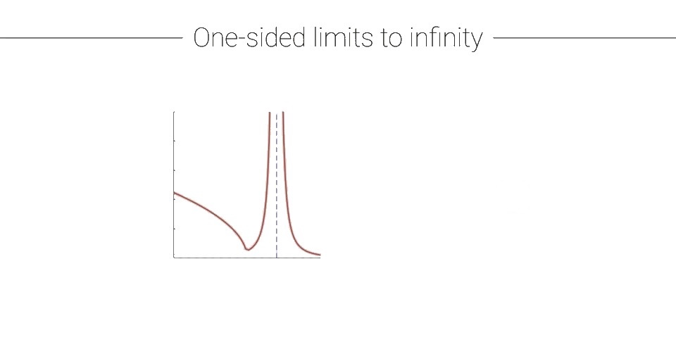{#slide-img width="100%"}
:::

---

## {auto-animate=true background-color="#ffffff" .white-canvas}

::: {style="text-align:center; margin:0; padding:0;"}
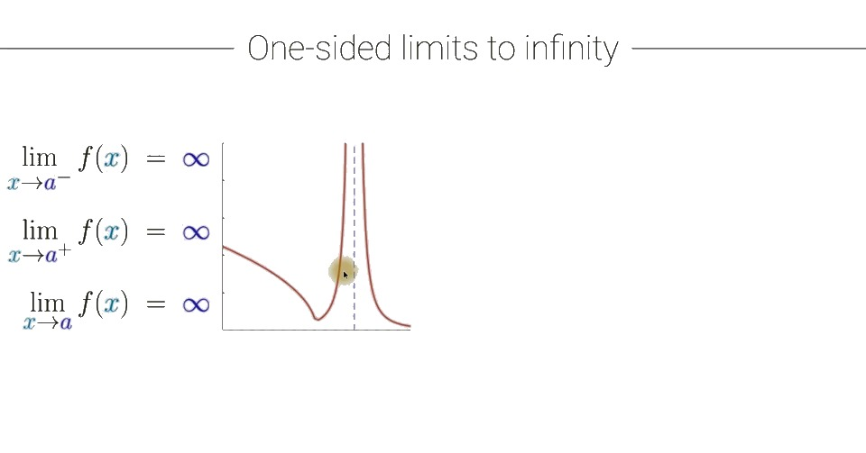{#slide-img width="100%"}
:::

---

## {auto-animate=true background-color="#ffffff" .white-canvas}

::: {style="text-align:center; margin:0; padding:0;"}
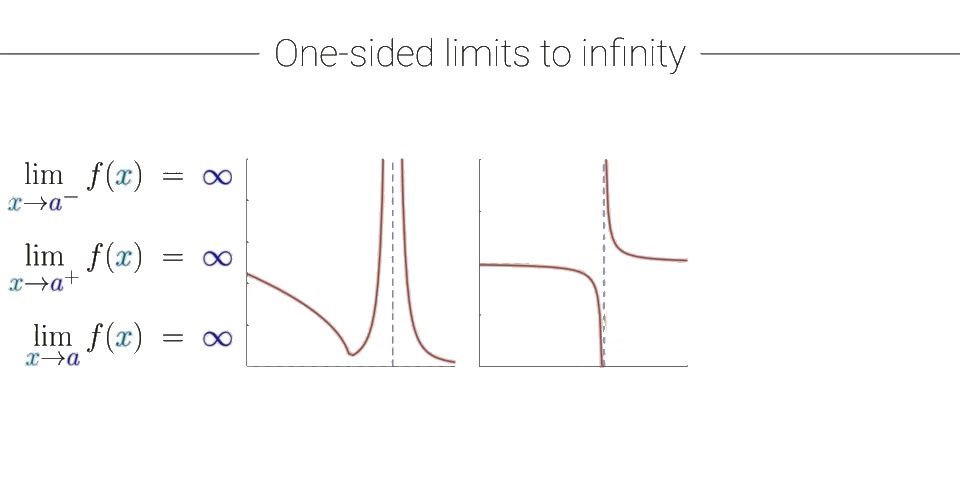{#slide-img width="100%"}
:::

---

## {auto-animate=true background-color="#ffffff" .white-canvas}

::: {style="text-align:center; margin:0; padding:0;"}
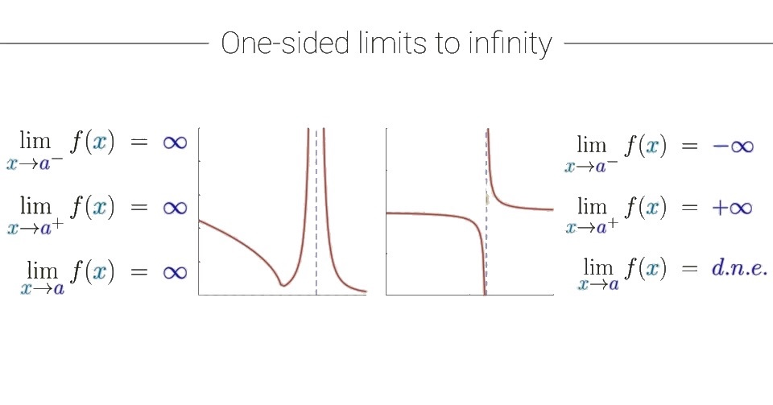{#slide-img width="100%"}
:::

---

## {auto-animate=true background-color="#ffffff" .white-canvas}

::: {style="text-align:center; margin:0; padding:0;"}
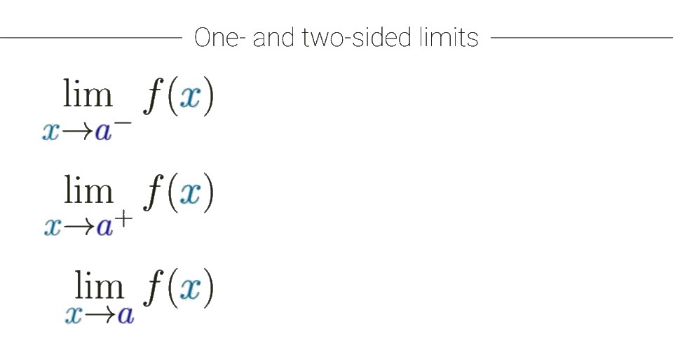{#slide-img width="100%"}
:::

---

## {auto-animate=true background-color="#ffffff" .white-canvas}

::: {style="text-align:center; margin:0; padding:0;"}
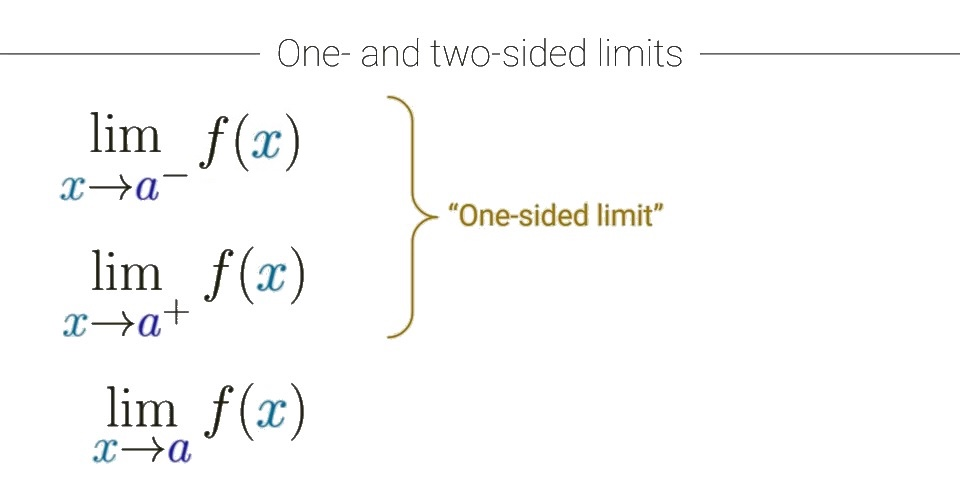{#slide-img width="100%"}
:::

---

## {auto-animate=true background-color="#ffffff" .white-canvas}

::: {style="text-align:center; margin:0; padding:0;"}
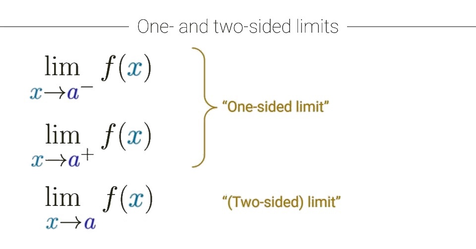{#slide-img width="100%"}
:::

---

## {auto-animate=true background-color="#ffffff" .white-canvas}

::: {style="text-align:center; margin:0; padding:0;"}
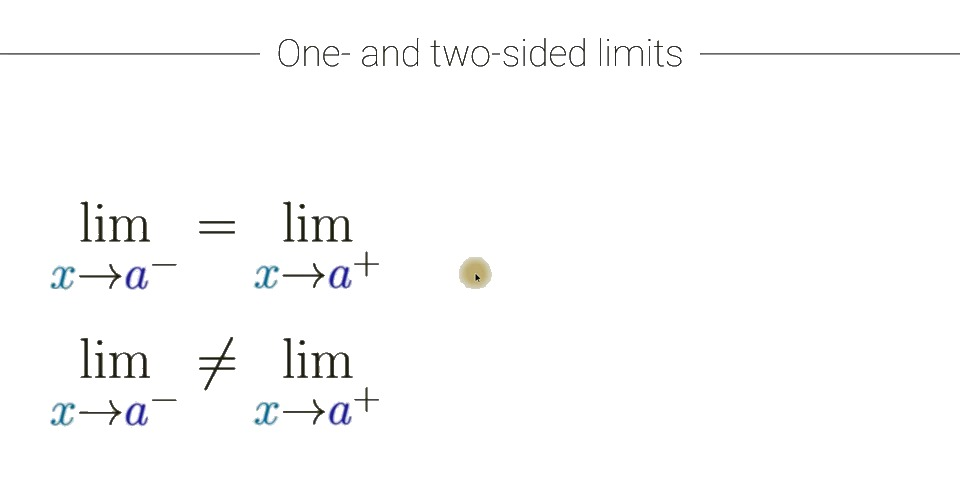{#slide-img width="100%"}
:::

---

## {auto-animate=true background-color="#ffffff" .white-canvas}

::: {style="text-align:center; margin:0; padding:0;"}
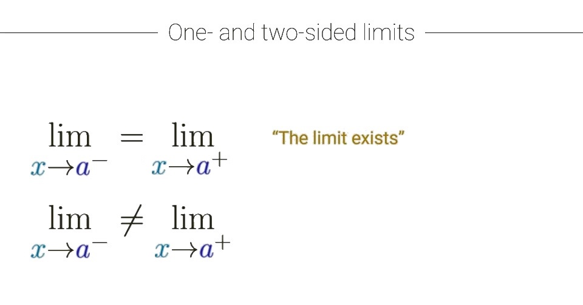{#slide-img width="100%"}
:::

---

## {auto-animate=true background-color="#ffffff" .white-canvas}

::: {style="text-align:center; margin:0; padding:0;"}
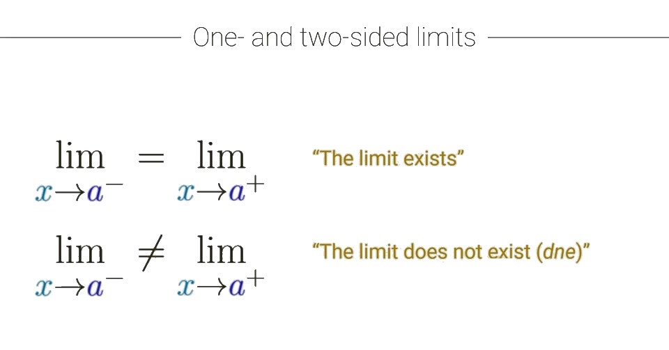{#slide-img width="100%"}
:::

---


## Continuidad y discontinuidades, revisadas

::: {.bg style="padding:0em; margin-top:0em; font-size:1.4em;margin-top:0em"}

En este presentación, aprenderás

  - [La definición —y la prueba formal— de continuidad.]{style="color:#107895; font-size:1.05em;" .fragment}

  - [Definiciones basadas en límites de diferentes tipos de discontinuidades.]{style="color:#107895; font-size:1.05em;" .fragment}

  - [Un recordatorio de que las funciones pueden ser continuas y discontinuas en diferentes subdominios.]{style="color:#107895; font-size:1.05em;" .fragment}
:::


## Definición de continuidad {.title-line}

:::: {.columns style="align-items:flex-start; margin-top:0.8em;"}

::: {style="font-size:1.3em; line-height:2.2em;"}
Una función $f(\color{teal}{x})$ es continua en $\color{teal}{x}=\color{maroon}{a}$ si se cumplen las siguientes **tres condiciones**;

de lo contrario, la función es **discontinua** en el punto $\color{maroon}{a}$.
:::

::: {.column width="50%" style="font-size:1.2em;"}

::: {style="font-size:1.3em; line-height:2.2em;"}
**1.** $\;f(\color{maroon}{a})$ está definida.

**2.** $\;\displaystyle\lim_{\color{teal}{x} \to \color{maroon}{a}} f(\color{teal}{x})$ existe.

**3.** $\;\displaystyle\lim_{\color{teal}{x} \to \color{maroon}{a}} f(\color{teal}{x}) = f(\color{maroon}{a})$.
:::

:::

::: {.column width="50%"}

::: {.r-stack style="width:100%; text-align:center;"}

::: {.fragment .fade-in-then-out data-fragment-index="1"}
```{python}
#| echo: false
#| fig-align: center
#| results: "hide"
#| fig-width: 6
#| fig-height: 5
import numpy as np
import matplotlib.pyplot as plt

a = 1.8
x = np.linspace(-0.3, 3.8, 500)
y = 0.08*x**3 - 0.5*x + 0.6*np.sin(2*x)

fig, ax = plt.subplots(figsize=(5, 4))
ax.grid(True, color="gray", alpha=0.15, linewidth=0.8)
ax.axhline(0, color="black", linewidth=1.8, zorder=2)
ax.axvline(0, color="black", linewidth=1.8, zorder=2)
ax.plot(x, y, color="#0b1cb8", linewidth=2.5, zorder=3)
y_a = 0.08*a**3 - 0.5*a + 0.6*np.sin(2*a)
ax.plot([a, a], [0, y_a], color="gray", linewidth=1.2, linestyle="--", alpha=0.45, zorder=1)

ax.set_xlim(-0.3, 3.8)
ax.set_ylim(-2.0, 3.5)
ax.set_xticks([])
ax.set_yticks([])

ax.text(0.1, 3.4, "$f(x)$", fontsize=18, ha='left', va='top')
ax.text(a, 0.45, "$a$", fontsize=18, ha='center', va='top', color='maroon')
ax.set_xlabel("$X$", fontsize=14, labelpad=4)

for spine in ax.spines.values():
    spine.set_visible(False)

plt.tight_layout()
plt.show()
```
:::

::: {.fragment .fade-in-then-out data-fragment-index="2"}
```{python}
#| echo: false
#| fig-align: center
#| results: "hide"
#| fig-width: 6
#| fig-height: 5
import numpy as np
import matplotlib.pyplot as plt

a = 1.8
y_clip = 8.0
x_left  = np.linspace(-0.3, a - 0.06, 300)
x_right = np.linspace(a + 0.06, 3.8, 300)

fig, ax = plt.subplots(figsize=(5, 4))
ax.grid(True, color="gray", alpha=0.15, linewidth=0.8)
ax.axhline(0, color="black", linewidth=1.8, zorder=2)
ax.axvline(0, color="black", linewidth=1.8, zorder=2)

ax.plot(x_left,  1/(x_left  - a)**2, color="#0b1cb8", linewidth=2.5, zorder=3)
ax.plot(x_right, 1/(x_right - a)**2, color="#0b1cb8", linewidth=2.5, zorder=3)

ax.axvline(a, color="gray", linewidth=1.2, linestyle="--", alpha=0.45, zorder=1)
ax.annotate("", xy=(a, y_clip + 0.5), xytext=(a, y_clip - 1.2),
            arrowprops=dict(arrowstyle="-|>", color="gray", lw=1.0, alpha=0.55))

ax.set_xlim(-0.3, 3.8)
ax.set_ylim(-0.5, y_clip + 0.8)
ax.set_xticks([])
ax.set_yticks([])

ax.text(0.1, y_clip + 0.6, "$f(x)$", fontsize=14, ha='left', va='top')
ax.text(a, -0.15, "$a$", fontsize=18, ha='center', va='top', color='maroon')
ax.set_xlabel("$X$", fontsize=18, labelpad=4)

for spine in ax.spines.values():
    spine.set_visible(False)

plt.tight_layout()
plt.show()
```
:::

::: {.fragment .fade-in data-fragment-index="3"}
```{python}
#| echo: false
#| fig-align: center
#| results: "hide"
#| fig-width: 6
#| fig-height: 5
import numpy as np
import matplotlib.pyplot as plt

a = 1.8
limit_val = 0.5
fa_val    = 2.2

x_full = np.linspace(-0.3, 3.8, 600)
y_full = (x_full - a)**2 + limit_val
mask   = np.abs(x_full - a) > 0.07

fig, ax = plt.subplots(figsize=(5, 4))
ax.grid(True, color="gray", alpha=0.15, linewidth=0.8)
ax.axhline(0, color="black", linewidth=1.8, zorder=2)
ax.axvline(0, color="black", linewidth=1.8, zorder=2)

ax.plot(x_full[mask], y_full[mask], color="#0b1cb8", linewidth=2.5, zorder=3)

ax.plot(a, limit_val, 'o', color='white', markeredgecolor='#B8860B',
        markeredgewidth=2.2, markersize=11, zorder=5)
ax.plot(a, fa_val, 'o', color='maroon', markersize=11, zorder=5)
ax.annotate("$f(a)$", xy=(a, fa_val), xytext=(a + 0.55, fa_val + 0.35),
            fontsize=12, color='maroon',
            arrowprops=dict(arrowstyle="-", color='maroon', lw=1.2))

ax.set_xlim(-0.3, 3.8)
ax.set_ylim(-0.4, 3.6)
ax.set_xticks([])
ax.set_yticks([])

ax.text(0.1, 3.5, "$f(x)$", fontsize=18, ha='left', va='top')
ax.text(a, -0.1, "$a$", fontsize=18, ha='center', va='top', color='maroon')
ax.set_xlabel("$X$", fontsize=18, labelpad=4)

for spine in ax.spines.values():
    spine.set_visible(False)

plt.tight_layout()
plt.show()
```
:::

:::

:::

::::

## {auto-animate=true background-color="#ffffff" .white-canvas}

::: {style="text-align:center; margin:0; padding:0;"}
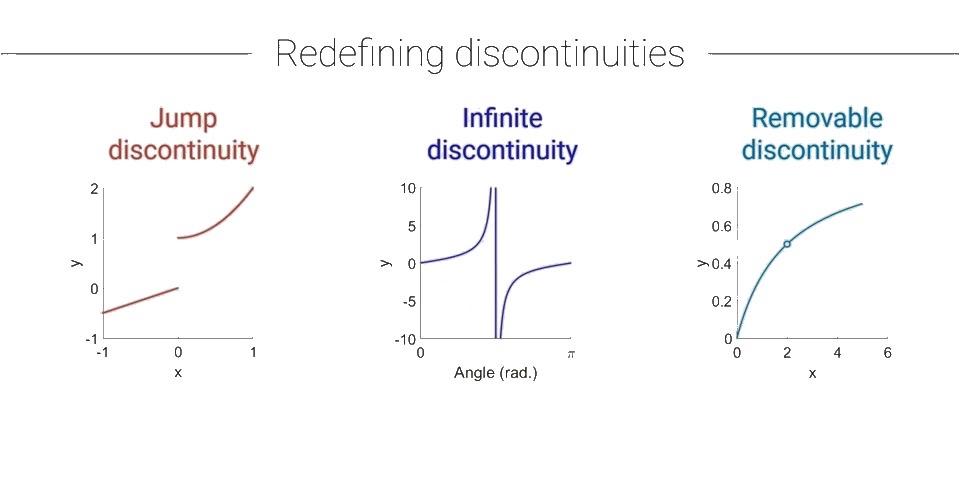{#slide-img width="100%"}
:::

---

## {auto-animate=true background-color="#ffffff" .white-canvas}

::: {style="text-align:center; margin:0; padding:0;"}
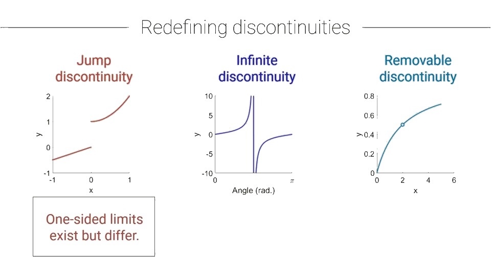{#slide-img width="100%"}
:::

---

## {auto-animate=true background-color="#ffffff" .white-canvas}

::: {style="text-align:center; margin:0; padding:0;"}
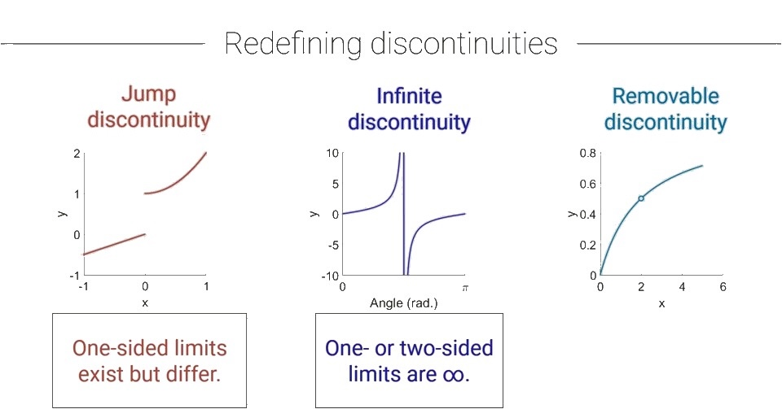{#slide-img width="100%"}
:::

---

## {auto-animate=true background-color="#ffffff" .white-canvas}

::: {style="text-align:center; margin:0; padding:0;"}
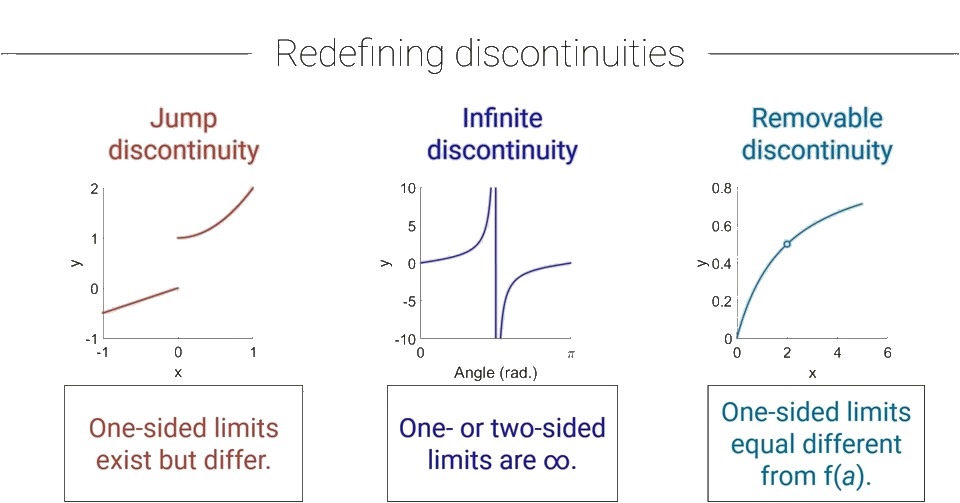{#slide-img width="100%"}
:::

---

## Dos Límites Trigonométricos Fundamentales

::: {.columns}

:::: {.column width="60%"}
### Objetivos de aprendizaje
En esta sesión exploraremos:

* **Fundamentos:** Dos límites trigonométricos críticos para la derivación.
* **Intuición:** El papel de la **representación gráfica** como herramienta de verificación y memoria.
::::

:::: {.column width="40%"}
::: {.callout-note icon=false}
## ¿Por qué importa?
"Una imagen vale más que mil fórmulas cuando la memoria falla".
:::
::::

:::

---

## Dos límites trigonométricos importantes {.title-line}

:::{style="display:flex; align-items:center; justify-content:center; height:80%;"}

::: columns 

::: {.column width="40%" style="font-size: 1.7em; text-align:center;" }

::: {.r-stack style="width:100%; text-align:center;"}
::: {.fragment .fade-out data-fragment-index=1}
$$\lim_{\color{teal}{\phi} \to \color{maroon}{0}} \left(\dfrac{\cos(\color{teal}{\phi})-1}{\color{teal}{\phi}}\right)$$

$\\[1.5em]$
$$\lim_{\color{teal}{\phi} \to \color{maroon}{0}} \left(\dfrac{\sin(\color{teal}{\phi})}{\color{teal}{\phi}}\right)$$
:::

::: {.fragment .fade-in data-fragment-index=1}
$$\lim_{\color{teal}{\phi} \to \color{maroon}{0}} \left(\dfrac{\cos(\color{teal}{\phi})-1}{\color{teal}{\phi}}\right) = \color{blue}{0}$$
$\\[1.5em]$
$$\lim_{\color{teal}{\phi} \to \color{maroon}{0}} \left(\dfrac{\sin(\color{teal}{\phi})}{\color{teal}{\phi}}\right) = \color{blue}{1}$$
:::
:::

:::

::: {.column width="60%" style="font-size: 2em; text-align:center;"}

::: {.fragment .fade-in data-fragment-index=2}
```{python}
#| echo: false
#| fig-align: center
#| results: "hide"
#| fig-width: 6
#| fig-height: 2.8
import numpy as np
import matplotlib.pyplot as plt

eps = 0.08
x_l = np.linspace(-2*np.pi, -eps, 400)
x_r = np.linspace(eps, 2*np.pi, 400)
y_l = (np.cos(x_l) - 1) / x_l
y_r = (np.cos(x_r) - 1) / x_r

fig, ax = plt.subplots(figsize=(6, 2.8))
ax.grid(True, color="gray", alpha=0.15, linewidth=0.8)
ax.axhline(0, color="black", linewidth=1.8, zorder=2)
ax.axvline(0, color="black", linewidth=1.8, zorder=2)
ax.plot(x_l, y_l, color="#1f0bb8", linewidth=2.5, zorder=3)
ax.plot(x_r, y_r, color="#1f0bb8", linewidth=2.5, zorder=3)
ax.plot(0, 0, 'o', color='white', markeredgecolor='#B8860B',
        markeredgewidth=2.2, markersize=9, zorder=5)

ticks = [-2*np.pi, -np.pi, 0, np.pi, 2*np.pi]
labels = [r'$-2\pi$', r'$-\pi$', r'$0$', r'$\pi$', r'$2\pi$']
ax.set_xticks(ticks)
ax.set_xticklabels(labels, fontsize=10)
ax.set_xlim(-2*np.pi - 0.4, 2*np.pi + 0.4)
ax.set_ylim(-1.2, 1.3)
ax.set_yticks([-1, 0, 1])
ax.set_yticklabels(['-1', '0', '1'], fontsize=9)
ax.text(0.98, 0.97, r"$f(\phi)=(\cos(\phi)-1)/\phi$", fontsize=12,
        transform=ax.transAxes, ha='right', va='top')

for spine in ax.spines.values():
    spine.set_visible(False)

plt.tight_layout()
plt.show()
```
:::

::: {.fragment .fade-in data-fragment-index=2}
```{python}
#| echo: false
#| fig-align: center
#| results: "hide"
#| fig-width: 6
#| fig-height: 2.8
import numpy as np
import matplotlib.pyplot as plt

eps = 0.08
x_l = np.linspace(-2*np.pi, -eps, 400)
x_r = np.linspace(eps, 2*np.pi, 400)
y_l = np.sin(x_l) / x_l
y_r = np.sin(x_r) / x_r

fig, ax = plt.subplots(figsize=(6, 2.8))
ax.grid(True, color="gray", alpha=0.15, linewidth=0.8)
ax.axhline(0, color="black", linewidth=1.8, zorder=2)
ax.axvline(0, color="black", linewidth=1.8, zorder=2)
ax.plot(x_l, y_l, color="#1f0bb8", linewidth=2.5, zorder=3)
ax.plot(x_r, y_r, color="#1f0bb8", linewidth=2.5, zorder=3)
ax.plot(0, 1, 'o', color='white', markeredgecolor='#B8860B',
        markeredgewidth=2.2, markersize=9, zorder=5)

ticks = [-2*np.pi, -np.pi, 0, np.pi, 2*np.pi]
labels = [r'$-2\pi$', r'$-\pi$', r'$0$', r'$\pi$', r'$2\pi$']
ax.set_xticks(ticks)
ax.set_xticklabels(labels, fontsize=10)
ax.set_xlim(-2*np.pi - 0.4, 2*np.pi + 0.4)
ax.set_ylim(-1.2, 1.3)
ax.set_yticks([-1, 0, 1])
ax.set_yticklabels(['-1', '0', '1'], fontsize=9)
ax.text(0.98, 0.97, r"$f(\phi)=\sin(\phi)/\phi$", fontsize=12,
        transform=ax.transAxes, ha='right', va='top')

for spine in ax.spines.values():
    spine.set_visible(False)

plt.tight_layout()
plt.show()
```
:::

:::

:::

:::

## límites trigonométricos importantes {.title-line}

:::{style="display:flex; flex-direction:column; justify-content:space-evenly; height:88%;"}

::: {.fragment .fade-in data-fragment-index=1}
```{python}
#| echo: false
#| fig-align: center
#| results: "hide"
#| fig-width: 9
#| fig-height: 2.4
import numpy as np
import matplotlib.pyplot as plt

eps = 0.3
x_l = np.linspace(-60, -eps, 2000)
x_r = np.linspace(eps, 60, 2000)
y_l = (np.cos(x_l) - 1) / x_l
y_r = (np.cos(x_r) - 1) / x_r

fig, ax = plt.subplots(figsize=(9, 2.4))
ax.grid(False)
ax.axhline(0, color="black", linewidth=1.8, zorder=2)
ax.axvline(0, color="black", linewidth=1.8, zorder=2)
ax.plot(x_l, y_l, color="#140bb8", linewidth=2.0, zorder=3)
ax.plot(x_r, y_r, color="#140bb8", linewidth=2.0, zorder=3)
ax.plot(0, 0, 'o', color='white', markeredgecolor='#B8860B',
        markeredgewidth=2.0, markersize=8, zorder=5)

ax.set_xticks([-60, -40, -20, 0, 20, 40, 60])
ax.set_xticklabels(['-60', '-40', '-20', '0', '20', '40', '60'], fontsize=10)
ax.set_xlim(-65, 65)
ax.set_ylim(-1.3, 1.3)
ax.set_yticks([-1, 0, 1])
ax.set_yticklabels(['-1', '0', '1'], fontsize=10)
ax.text(0.98, 0.95, r"$f(\phi)=(\cos(\phi)-1)/\phi$", fontsize=16,
        transform=ax.transAxes, ha='right', va='top')

for spine in ax.spines.values():
    spine.set_visible(False)

plt.tight_layout()
plt.show()
```
:::

::: {.fragment .fade-in data-fragment-index=2}
```{python}
#| echo: false
#| fig-align: center
#| results: "hide"
#| fig-width: 9
#| fig-height: 2.4
import numpy as np
import matplotlib.pyplot as plt

eps = 0.3
x_l = np.linspace(-60, -eps, 2000)
x_r = np.linspace(eps, 60, 2000)
y_l = np.sin(x_l) / x_l
y_r = np.sin(x_r) / x_r

fig, ax = plt.subplots(figsize=(9, 2.4))
ax.grid(False)
ax.axhline(0, color="black", linewidth=1.8, zorder=2)
ax.axvline(0, color="black", linewidth=1.8, zorder=2)
ax.plot(x_l, y_l, color="#140bb8", linewidth=2.0, zorder=3)
ax.plot(x_r, y_r, color="#140bb8", linewidth=2.0, zorder=3)
ax.plot(0, 1, 'o', color='white', markeredgecolor='#B8860B',
        markeredgewidth=2.0, markersize=8, zorder=5)

ax.set_xticks([-60, -40, -20, 0, 20, 40, 60])
ax.set_xticklabels(['-60', '-40', '-20', '0', '20', '40', '60'], fontsize=10)
ax.set_xlim(-65, 65)
ax.set_ylim(-1.3, 1.3)
ax.set_yticks([-1, 0, 1])
ax.set_yticklabels(['-1', '0', '1'], fontsize=10)
ax.text(0.98, 0.95, r"$f(\phi)=\sin(\phi)/\phi$", fontsize=16,
        transform=ax.transAxes, ha='right', va='top')

for spine in ax.spines.values():
    spine.set_visible(False)

plt.tight_layout()
plt.show()
```
:::

:::

## Vizualización $\frac{\sin(\phi)}{\phi}$ {.title-line}


:::: columns

::: {.column width="55%" style="text-align:center;"}

:::{.r-stack style="font-size: 3em; width: 100%; text-align: center;"}

::: {.fragment .fade-out data-fragment-index=1}
```{python}
#| echo: false
#| fig-align: center
#| results: "hide"
#| fig-width: 6
#| fig-height: 5.5
import numpy as np
import matplotlib.pyplot as plt

phi = 0.8  # angle in radians
theta = np.linspace(0, phi, 100)

fig, ax = plt.subplots(figsize=(6, 5.5))
ax.set_aspect('equal')

# Unit circle
circle = np.linspace(0, 2*np.pi, 400)
ax.plot(np.cos(circle), np.sin(circle), color="#B8860B", linewidth=2.5, zorder=3)

# Radius lines
ax.plot([0, np.cos(phi)], [0, np.sin(phi)], color="#107895", linewidth=2, zorder=4)
ax.plot([0, 1], [0, 0], color="#107895", linewidth=2, zorder=4)

# Arc (sector)
ax.fill_between(np.cos(theta), np.sin(theta), 0, alpha=0.08, color="#107895")
ax.plot(np.cos(theta), np.sin(theta), color="#107895", linewidth=2.5, linestyle="--", zorder=4)

# Angle arc
arc_angles = np.linspace(0, phi, 80)
arc_r = 0.25
ax.plot(arc_r*np.cos(arc_angles), arc_r*np.sin(arc_angles), color="maroon", linewidth=2, zorder=5)
ax.text(0.32*np.cos(phi/2), 0.32*np.sin(phi/2), r"$\phi$", fontsize=18, color="maroon", ha="center", va="center")

# Point on circle
ax.plot(np.cos(phi), np.sin(phi), "o", color="red", markersize=10, zorder=6)
ax.annotate(r"$P$", xy=(np.cos(phi), np.sin(phi)), xytext=(np.cos(phi)+0.25, np.sin(phi)+0.15),
            fontsize=16, color="red", arrowprops=dict(arrowstyle="-", color="red", lw=1.2))

ax.set_xlim(-1.5, 1.8)
ax.set_ylim(-0.3, 1.8)
ax.set_xticks([-1, 0, 1])
ax.set_yticks([0, 1])
ax.tick_params(labelsize=11)
ax.set_xlabel("$x$", fontsize=14, labelpad=8)
ax.text(0, 1.75, "$f(x)$", fontsize=18, ha="left", va="bottom")

ax.grid(True, color="gray", alpha=0.15, linewidth=0.8)
ax.axhline(0, color="black", linewidth=1.8, zorder=2)
ax.axvline(0, color="black", linewidth=1.8, zorder=2)

for spine in ax.spines.values():
    spine.set_visible(False)

plt.tight_layout()
plt.show()
```
:::

::: {.fragment .fade-in data-fragment-index=1}
```{python}
#| echo: false
#| fig-align: center
#| results: "hide"
#| fig-width: 6
#| fig-height: 5.5
import numpy as np
import matplotlib.pyplot as plt

phi = 0.8
theta = np.linspace(0, phi, 100)

fig, ax = plt.subplots(figsize=(6, 5.5))
ax.set_aspect('equal')

# Unit circle
circle = np.linspace(0, 2*np.pi, 400)
ax.plot(np.cos(circle), np.sin(circle), color="#B8860B", linewidth=2.5, zorder=3)

# Radius lines
ax.plot([0, np.cos(phi)], [0, np.sin(phi)], color="#107895", linewidth=2, zorder=4)
ax.plot([0, 1], [0, 0], color="#107895", linewidth=2, zorder=4)

# Arc (sector)
ax.fill_between(np.cos(theta), np.sin(theta), 0, alpha=0.08, color="#107895")
ax.plot(np.cos(theta), np.sin(theta), color="#107895", linewidth=2.5, linestyle="--", zorder=4)

# Angle arc
arc_angles = np.linspace(0, phi, 80)
arc_r = 0.25
ax.plot(arc_r*np.cos(arc_angles), arc_r*np.sin(arc_angles), color="maroon", linewidth=2, zorder=5)
ax.text(0.32*np.cos(phi/2), 0.32*np.sin(phi/2), r"$\phi$", fontsize=18, color="maroon", ha="center", va="center")

# Point on circle
ax.plot(np.cos(phi), np.sin(phi), "o", color="red", markersize=10, zorder=6)
ax.annotate(r"$P$", xy=(np.cos(phi), np.sin(phi)), xytext=(np.cos(phi)+0.25, np.sin(phi)+0.15),
            fontsize=16, color="red", arrowprops=dict(arrowstyle="-", color="red", lw=1.2))

# --- sin(phi) vertical segment ---
ax.plot([np.cos(phi), np.cos(phi)], [0, np.sin(phi)], color="teal", linewidth=3, zorder=5)
ax.text(np.cos(phi)+0.08, np.sin(phi)/2, r"$\sin(\phi)$", fontsize=16, color="teal", ha="left", va="center")

# --- arc length φ on circle ---
ax.plot(np.cos(theta), np.sin(theta), color="darkorange", linewidth=3.5, zorder=4)
mid_idx = len(theta)//2
ax.text(np.cos(theta[mid_idx])*1.15, np.sin(theta[mid_idx])*1.15, r"$\phi$", fontsize=16, color="darkorange", ha="center", va="center")

# --- tan(phi) segment ---
tan_phi = np.tan(phi)
ax.plot([1, 1], [0, tan_phi], color="#f03813", linewidth=3, zorder=5)
ax.text(1.08, tan_phi/2, r"$\tan(\phi)$", fontsize=16, color="#f03813", ha="left", va="center")

# Tick mark at x=1
ax.plot([1, 1], [-0.05, 0.05], color="gray", linewidth=1.5, zorder=2)

ax.set_xlim(-1.5, 2.2)
ax.set_ylim(-0.3, 1.8)
ax.set_xticks([-1, 0, 1])
ax.set_yticks([0, 1])
ax.tick_params(labelsize=11)
ax.set_xlabel("$x$", fontsize=14, labelpad=8)
ax.text(0, 1.75, "$f(x)$", fontsize=18, ha="left", va="bottom")

ax.grid(True, color="gray", alpha=0.15, linewidth=0.8)
ax.axhline(0, color="black", linewidth=1.8, zorder=2)
ax.axvline(0, color="black", linewidth=1.8, zorder=2)

for spine in ax.spines.values():
    spine.set_visible(False)

plt.tight_layout()
plt.show()
```
:::

:::

:::

::: {.column width="45%" style="font-size:0.65em; text-align:left;"}

::: {.fragment .fade-in data-fragment-index=2 style="margin-bottom:0.8em;"}
**Desigualdad geométrica:**
$$\sin(\color{teal}{\phi}) < \color{teal}{\phi} < \tan(\color{teal}{\phi})$$
:::

::: {.fragment .fade-in data-fragment-index=3 style="margin-bottom:0.8em;"}
Dividiendo por $\sin(\color{teal}{\phi}) > 0$:
$$1 < \frac{\color{teal}{\phi}}{\sin(\color{teal}{\phi})} < \frac{1}{\cos(\color{teal}{\phi})}$$
:::

::: {.fragment .fade-in data-fragment-index=4 style="margin-bottom:0.8em;"}
Invirtiendo:
$$\cos(\color{teal}{\phi}) < \frac{\sin(\color{teal}{\phi})}{\color{teal}{\phi}} < 1$$
:::

::: {.fragment .fade-in data-fragment-index=5}
Cuando $\color{teal}{\phi} \to \color{maroon}{0}$, $\cos(\color{teal}{\phi}) \to 1$, por el **Teorema del Emparedado**:
$$\lim_{\color{teal}{\phi} \to \color{maroon}{0}} \frac{\sin(\color{teal}{\phi})}{\color{teal}{\phi}} = \color{blue}{1}$$
:::

:::

::::


## Otro Límite trigonométrico importante {.title-line}


:::: columns

::: {.column width="50%" style="text-align:center;"}

:::{.r-stack style="font-size: 3em; width: 100%; text-align: center;"}

::: {.fragment .fade-out data-fragment-index=1}
```{python}
#| echo: false
#| fig-align: center
#| results: "hide"
#| fig-width: 6
#| fig-height: 5
import numpy as np
import matplotlib.pyplot as plt

eps = 0.08
x_l = np.linspace(-2*np.pi, -eps, 400)
x_r = np.linspace(eps, 2*np.pi, 400)
y_l = (np.cos(x_l) - 1) / x_l
y_r = (np.cos(x_r) - 1) / x_r

fig, ax = plt.subplots(figsize=(6, 5))
ax.grid(True, color="gray", alpha=0.15, linewidth=0.8)
ax.axhline(0, color="black", linewidth=1.8, zorder=2)
ax.axvline(0, color="black", linewidth=1.8, zorder=2)
ax.plot(x_l, y_l, color="#B8860B", linewidth=2.5, zorder=3)
ax.plot(x_r, y_r, color="#B8860B", linewidth=2.5, zorder=3)
ax.plot(0, 0, 'o', color='white', markeredgecolor='#B8860B',
        markeredgewidth=2.2, markersize=9, zorder=5)

ticks = [-2*np.pi, -np.pi, 0, np.pi, 2*np.pi]
labels = [r'$-2\pi$', r'$-\pi$', r'$0$', r'$\pi$', r'$2\pi$']
ax.set_xticks(ticks)
ax.set_xticklabels(labels, fontsize=11)
ax.set_xlim(-2*np.pi - 0.4, 2*np.pi + 0.4)
ax.set_ylim(-1.2, 1.3)
ax.set_yticks([-1, 0, 1])
ax.set_yticklabels(['-1', '0', '1'], fontsize=11)
ax.text(0.98, 0.95, r"$f(\phi)=\dfrac{\cos(\phi)-1}{\phi}$", fontsize=14,
        transform=ax.transAxes, ha='right', va='top')
ax.set_xlabel("$x$", fontsize=14, labelpad=8)
ax.text(0, 1.28, "$f(x)$", fontsize=18, ha="left", va="bottom")

for spine in ax.spines.values():
    spine.set_visible(False)

plt.tight_layout()
plt.show()
```
:::

::: {.fragment .fade-in data-fragment-index=1}
```{python}
#| echo: false
#| fig-align: center
#| results: "hide"
#| fig-width: 6
#| fig-height: 5
import numpy as np
import matplotlib.pyplot as plt

eps = 0.08
x_l = np.linspace(-2*np.pi, -eps, 400)
x_r = np.linspace(eps, 2*np.pi, 400)
y_l = (np.cos(x_l) - 1) / x_l
y_r = (np.cos(x_r) - 1) / x_r

fig, ax = plt.subplots(figsize=(6, 5))
ax.grid(True, color="gray", alpha=0.15, linewidth=0.8)
ax.axhline(0, color="black", linewidth=1.8, zorder=2)
ax.axvline(0, color="black", linewidth=1.8, zorder=2)
ax.plot(x_l, y_l, color="#B8860B", linewidth=2.5, zorder=3)
ax.plot(x_r, y_r, color="#B8860B", linewidth=2.5, zorder=3)
ax.plot(0, 0, 'o', color='white', markeredgecolor='#B8860B',
        markeredgewidth=2.2, markersize=9, zorder=5)

ticks = [-2*np.pi, -np.pi, 0, np.pi, 2*np.pi]
labels = [r'$-2\pi$', r'$-\pi$', r'$0$', r'$\pi$', r'$2\pi$']
ax.set_xticks(ticks)
ax.set_xticklabels(labels, fontsize=11)
ax.set_xlim(-2*np.pi - 0.4, 2*np.pi + 0.4)
ax.set_ylim(-1.2, 1.3)
ax.set_yticks([-1, 0, 1])
ax.set_yticklabels(['-1', '0', '1'], fontsize=11)
ax.text(0.98, 0.95, r"$f(\phi)=\dfrac{\cos(\phi)-1}{\phi}$", fontsize=14,
        transform=ax.transAxes, ha='right', va='top')
ax.set_xlabel("$x$", fontsize=14, labelpad=8)
ax.text(0, 1.28, "$f(x)$", fontsize=18, ha="left", va="bottom")

# Highlight the limit point (0,0) in red
ax.plot(0, 0, "o", color="red", markersize=11, zorder=7)
ax.annotate(r"$\lim_{\phi\to 0}\frac{\cos(\phi)-1}{\phi}=0$",
            xy=(0, 0), xytext=(1.5, -0.5),
            fontsize=14, color="red",
            arrowprops=dict(arrowstyle="->", color="red", lw=1.5))

for spine in ax.spines.values():
    spine.set_visible(False)

plt.tight_layout()
plt.show()
```
:::

:::

:::

::: {.column width="50%" style="font-size:0.65em; text-align:left;"}

::: {.fragment .fade-in data-fragment-index=2 style="margin-bottom:0.6em;"}
**Paso 1:** Identidad del ángulo medio
$$\cos(\color{teal}{\phi}) - 1 = -2\sin^2\!\left(\frac{\color{teal}{\phi}}{2}\right)$$
:::

::: {.fragment .fade-in data-fragment-index=3 style="margin-bottom:0.6em;"}
**Paso 2:** Reescribimos el límite
$$\lim_{\color{teal}{\phi} \to \color{maroon}{0}} \frac{-2\sin^2(\frac{\color{teal}{\phi}}{2})}{\color{teal}{\phi}}$$
:::

::: {.fragment .fade-in data-fragment-index=4 style="margin-bottom:0.6em;"}
**Paso 3:** Multiplicamos y dividimos por $\frac{\color{teal}{\phi}}{2}$
$$= \lim_{\color{teal}{\phi} \to \color{maroon}{0}} \left[ -\sin\!\left(\frac{\color{teal}{\phi}}{2}\right) \cdot \frac{\sin(\frac{\color{teal}{\phi}}{2})}{\frac{\color{teal}{\phi}}{2}} \right]$$
:::

::: {.fragment .fade-in data-fragment-index=5 style="margin-bottom:0.6em;"}
**Paso 4:** Aplicamos el límite conocido $\displaystyle\lim_{u\to 0}\frac{\sin u}{u}=1$
$$= \left(\lim_{\color{teal}{\phi} \to \color{maroon}{0}} -\sin\!\left(\frac{\color{teal}{\phi}}{2}\right)\right) \cdot \color{blue}{1}$$
:::

::: {.fragment .fade-in data-fragment-index=6}
**Resultado final:**
$$\lim_{\color{teal}{\phi} \to \color{maroon}{0}} \frac{\cos(\color{teal}{\phi})-1}{\color{teal}{\phi}} = \color{blue}{0}$$
:::

:::

::::

## Desarrollo de la demostración {.title-line}

:::: columns

::: {.column width="50%" style="text-align:center;"}

:::{.r-stack style="font-size: 3em; width: 100%; text-align: center;"}

::: {.fragment .fade-in data-fragment-index=1}
```{python}
#| echo: false
#| fig-align: center
#| results: "hide"
#| fig-width: 6
#| fig-height: 5
import numpy as np
import matplotlib.pyplot as plt

eps = 0.08
x_l = np.linspace(-2*np.pi, -eps, 400)
x_r = np.linspace(eps, 2*np.pi, 400)
y_l = (np.cos(x_l) - 1) / x_l
y_r = (np.cos(x_r) - 1) / x_r

fig, ax = plt.subplots(figsize=(6, 5))
ax.grid(True, color="gray", alpha=0.15, linewidth=0.8)
ax.axhline(0, color="black", linewidth=1.8, zorder=2)
ax.axvline(0, color="black", linewidth=1.8, zorder=2)
ax.plot(x_l, y_l, color="#B8860B", linewidth=2.5, zorder=3)
ax.plot(x_r, y_r, color="#B8860B", linewidth=2.5, zorder=3)
ax.plot(0, 0, 'o', color='white', markeredgecolor='#B8860B',
        markeredgewidth=2.2, markersize=9, zorder=5)

ticks = [-2*np.pi, -np.pi, 0, np.pi, 2*np.pi]
labels = [r'$-2\pi$', r'$-\pi$', r'$0$', r'$\pi$', r'$2\pi$']
ax.set_xticks(ticks)
ax.set_xticklabels(labels, fontsize=11)
ax.set_xlim(-2*np.pi - 0.4, 2*np.pi + 0.4)
ax.set_ylim(-1.2, 1.3)
ax.set_yticks([-1, 0, 1])
ax.set_yticklabels(['-1', '0', '1'], fontsize=11)
ax.text(0.98, 0.95, r"$f(\phi)=\dfrac{\cos(\phi)-1}{\phi}$", fontsize=14,
        transform=ax.transAxes, ha='right', va='top')
ax.set_xlabel("$x$", fontsize=14, labelpad=8)
ax.text(0, 1.28, "$f(x)$", fontsize=18, ha="left", va="bottom")

for spine in ax.spines.values():
    spine.set_visible(False)

plt.tight_layout()
plt.show()
```
:::

:::

:::

::: {.column width="50%" style="font-size:0.65em; text-align:left;"}

::: {.fragment .fade-in data-fragment-index=2 style="margin-bottom:0.6em;"}
**Paso 1:** Multiplicar por el conjugado:
$\displaystyle\frac{\cos(\phi)+1}{\cos(\phi)+1}$
$$\lim_{\color{teal}{\phi} \to \color{maroon}{0}} \frac{\cos(\color{teal}{\phi})-1}{\color{teal}{\phi}} \cdot \frac{\cos(\color{teal}{\phi})+1}{\cos(\color{teal}{\phi})+1}$$
:::

::: {.fragment .fade-in data-fragment-index=3 style="margin-bottom:0.6em;"}

$$= \lim_{\color{teal}{\phi} \to \color{maroon}{0}} \frac{\cos^2(\color{teal}{\phi})-1}{\color{teal}{\phi}\,(\cos(\color{teal}{\phi})+1)}$$
:::

::: {.fragment .fade-in data-fragment-index=4 style="margin-bottom:0.6em;"}

**Paso 2:** Usamos la identidad $\cos^2(\phi)-1 = -\sin^2(\phi)$
$$= \lim_{\color{teal}{\phi} \to \color{maroon}{0}} \frac{-\sin^2(\color{teal}{\phi})}{\color{teal}{\phi}\,(\cos(\color{teal}{\phi})+1)}$$
:::

::: {.fragment .fade-in data-fragment-index=5 style="margin-bottom:0.6em;"}

$$= \lim_{\color{teal}{\phi} \to \color{maroon}{0}} \left[ \frac{\sin(\color{teal}{\phi})}{\color{teal}{\phi}} \cdot \frac{-\sin(\color{teal}{\phi})}{\cos(\color{teal}{\phi})+1} \right]$$
:::

::: {.fragment .fade-in data-fragment-index=6 style="margin-bottom:0.6em;"}
**Paso 3:** Aplicamos el límite conocido $\displaystyle\lim_{u\to 0}\frac{\sin u}{u}=1$
$$= \lim_{\color{teal}{\phi} \to \color{maroon}{0}} \left[ \color{blue}{1} \cdot \frac{-\sin(\color{teal}{\phi})}{\cos(\color{teal}{\phi})+1} \right]$$
:::

::: {.fragment .fade-in data-fragment-index=7}

$$= \frac{-\sin(\color{maroon}{0})}{\cos(\color{maroon}{0})+1} = \frac{0}{1+1} = \color{blue}{0}$$
$$\therefore \quad \lim_{\color{teal}{\phi} \to \color{maroon}{0}} \frac{\cos(\color{teal}{\phi})-1}{\color{teal}{\phi}} = \color{blue}{0}$$
:::

:::

::::

## Teorema del emparedado (Squeeze theorem)

En este presentación, aprenderás:

  - Los conceptos geométricos y algebraicos del teorema del emparedado (también conocido como teorema de la compresión o del sándwich).

  - Varios ejemplos sencillos del teorema del emparedado.

  - Cuándo no es útil el teorema del emparedado.

  - El propósito del teorema del emparedado en el cálculo.


## {auto-animate=true background-color="#ffffff" .white-canvas}

::: {style="text-align:center; margin:0; padding:0;"}
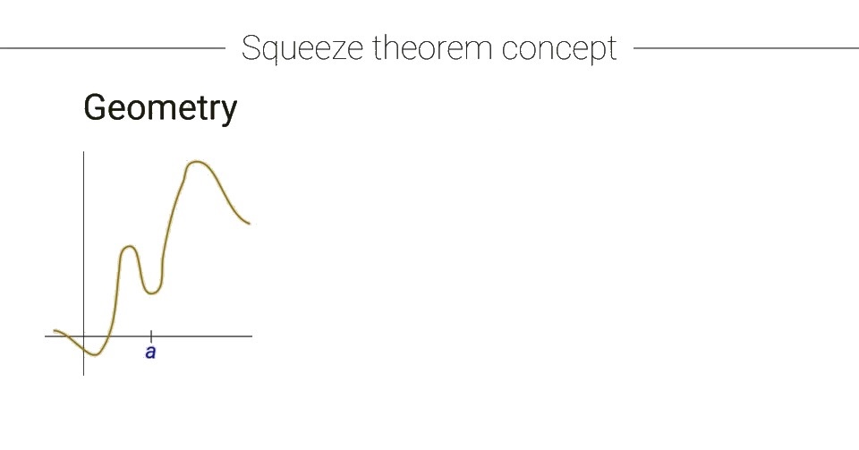{width="100%"}
:::

---

## {auto-animate=true background-color="#ffffff" .white-canvas}

::: {style="text-align:center; margin:0; padding:0;"}
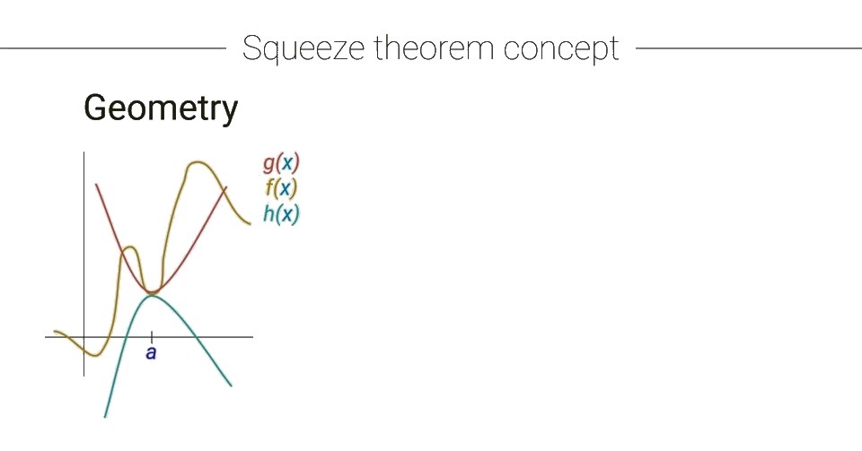{#slide-img width="100%"}
:::

---

## {auto-animate=true background-color="#ffffff" .white-canvas}

::: {style="text-align:center; margin:0; padding:0;"}
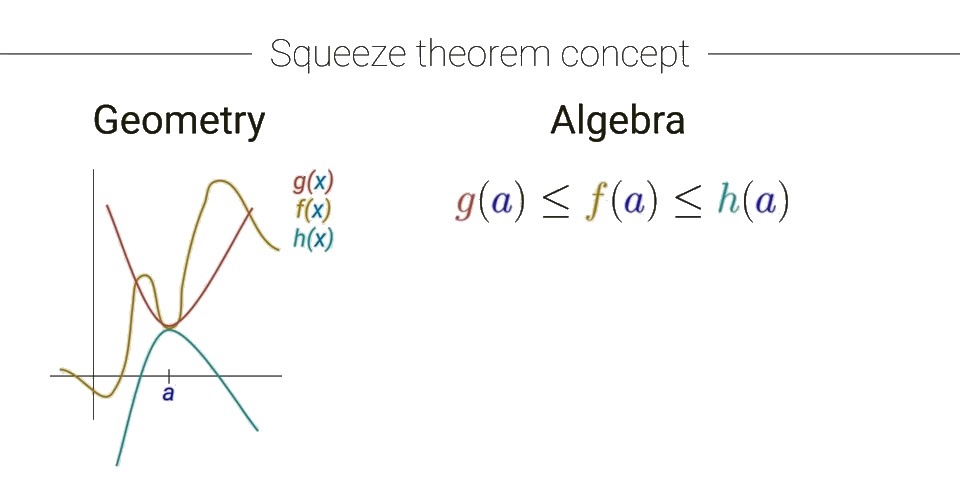{#slide-img width="100%"}
:::

---

## {auto-animate=true background-color="#ffffff" .white-canvas}

::: {style="text-align:center; margin:0; padding:0;"}
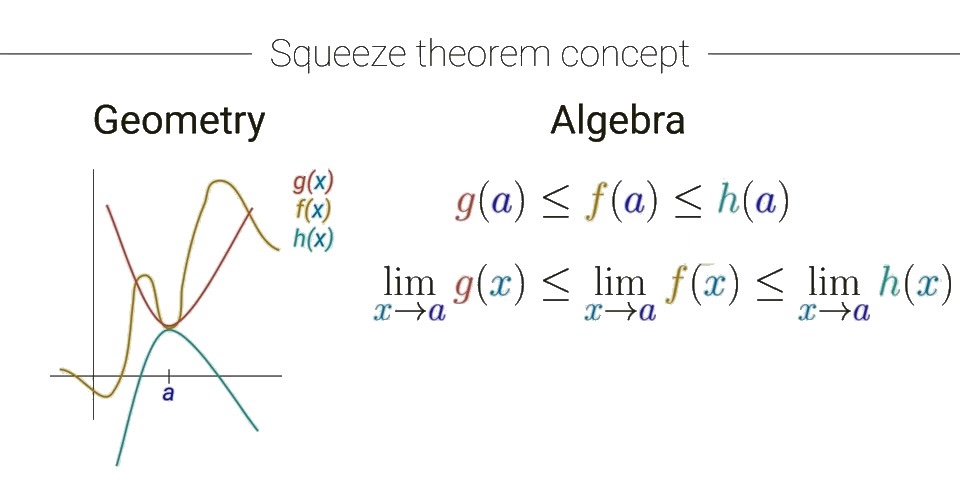{#slide-img width="100%"}
:::

---

## {auto-animate=true background-color="#ffffff" .white-canvas}

::: {style="text-align:center; margin:0; padding:0;"}
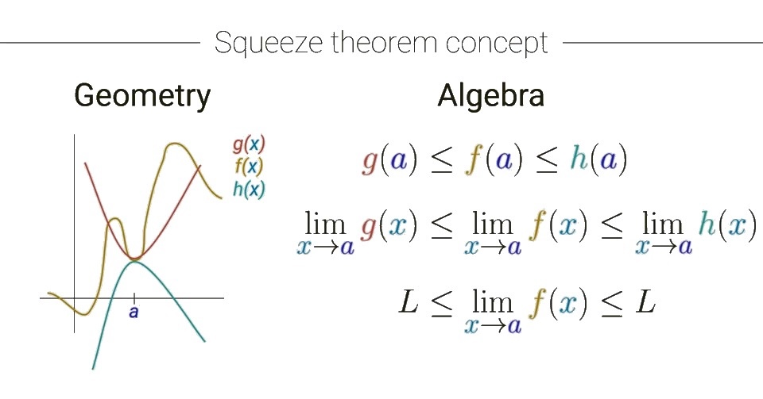{#slide-img width="100%"}
:::

---

## {auto-animate=true background-color="#ffffff" .white-canvas}

::: {style="text-align:center; margin:0; padding:0;"}
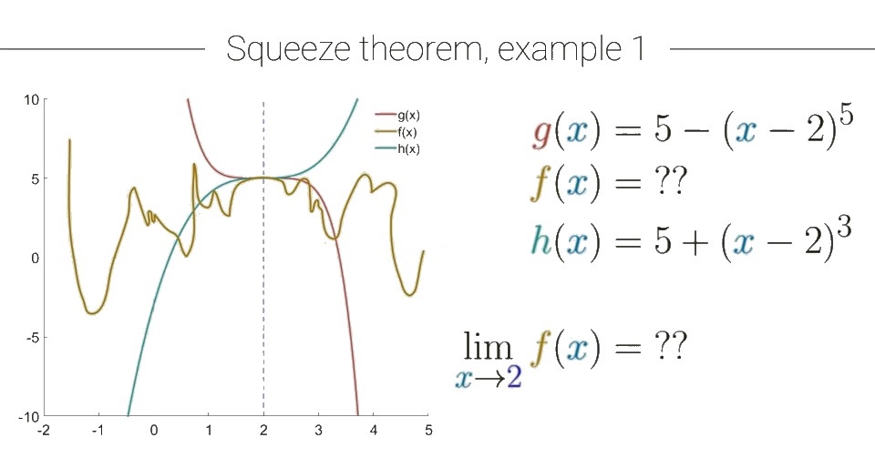{#slide-img width="100%"}
:::

---

## {auto-animate=true background-color="#ffffff" .white-canvas}

::: {style="text-align:center; margin:0; padding:0;"}
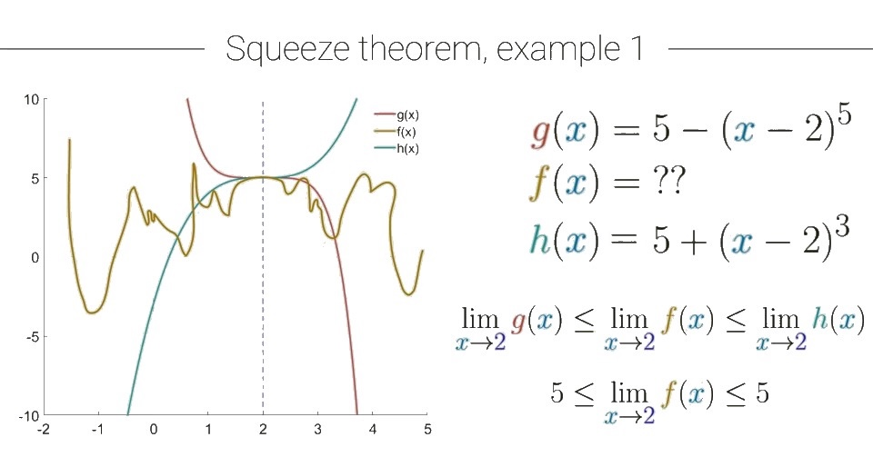{#slide-img width="100%"}
:::

---

## {auto-animate=true background-color="#ffffff" .white-canvas}

::: {style="text-align:center; margin:0; padding:0;"}
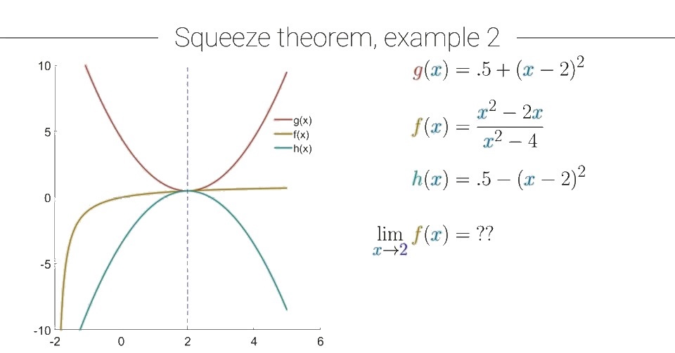{#slide-img width="100%"}
:::

---

## {auto-animate=true background-color="#ffffff" .white-canvas}

::: {style="text-align:center; margin:0; padding:0;"}
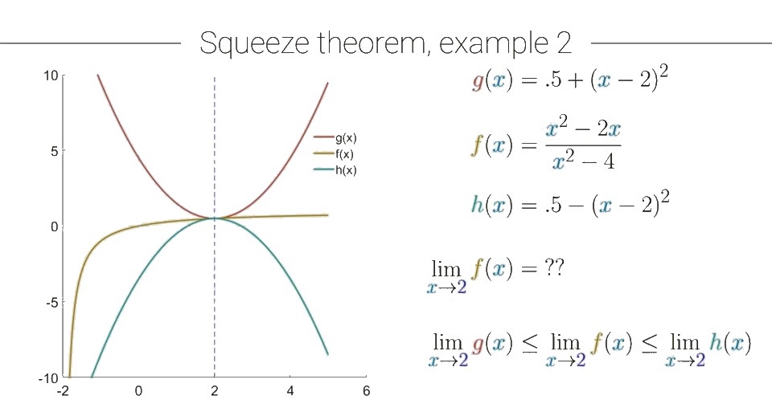{#slide-img width="100%"}
:::

---

## {auto-animate=true background-color="#ffffff" .white-canvas}

::: {style="text-align:center; margin:0; padding:0;"}
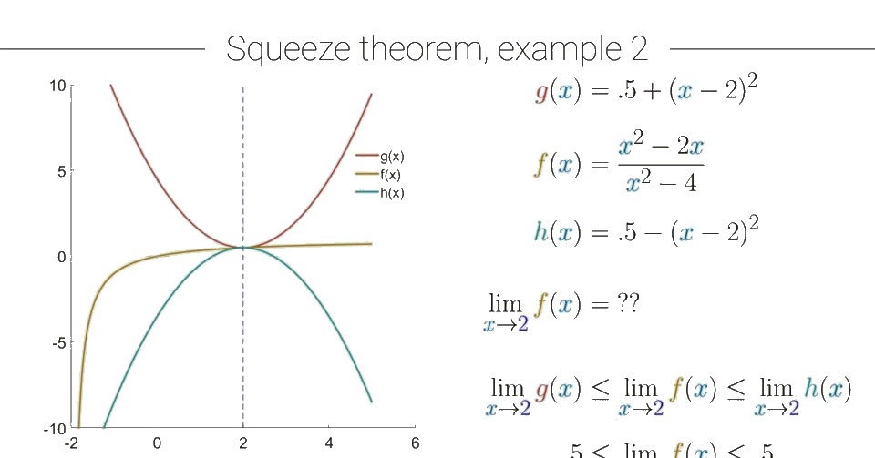{#slide-img width="100%"}
:::

---

## {auto-animate=true background-color="#ffffff" .white-canvas}

::: {style="text-align:center; margin:0; padding:0;"}
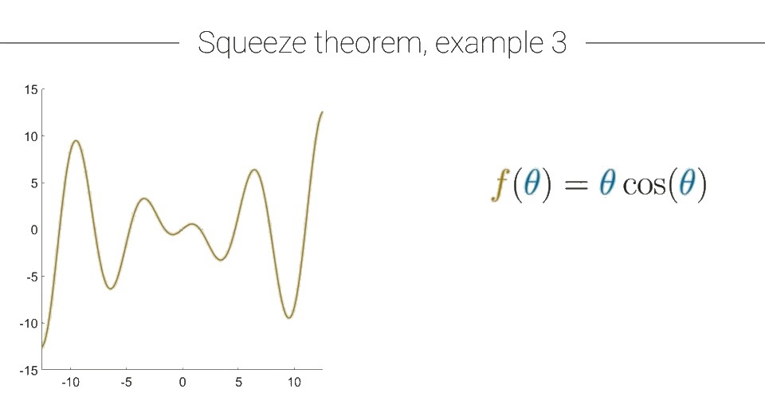{#slide-img width="100%"}
:::

---

## {auto-animate=true background-color="#ffffff" .white-canvas}

::: {style="text-align:center; margin:0; padding:0;"}
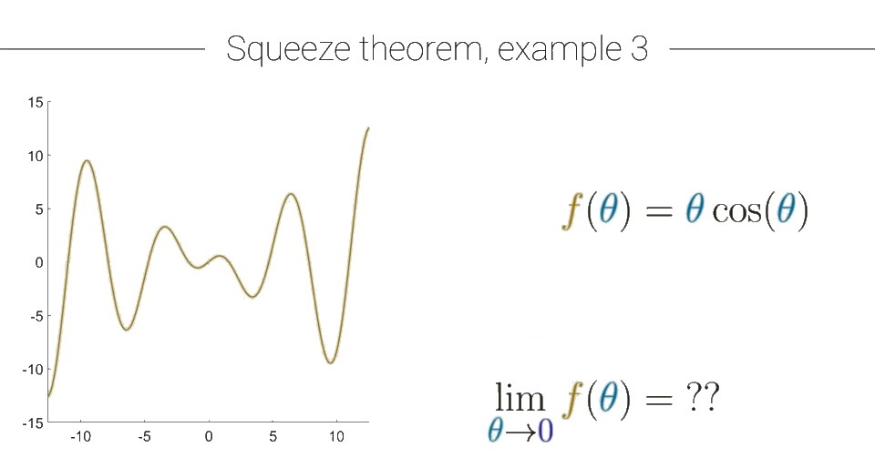{#slide-img width="100%"}
:::

---

## {auto-animate=true background-color="#ffffff" .white-canvas}

::: {style="text-align:center; margin:0; padding:0;"}
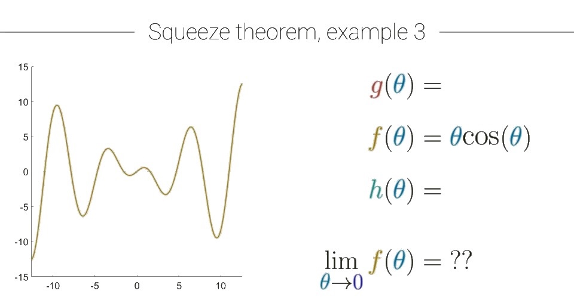{#slide-img width="100%"}
:::

---

## {auto-animate=true background-color="#ffffff" .white-canvas}

::: {style="text-align:center; margin:0; padding:0;"}
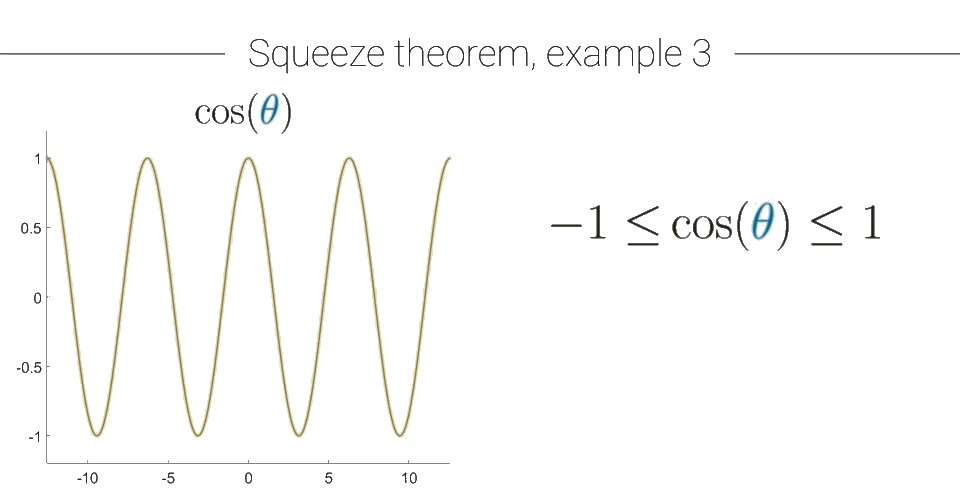{#slide-img width="100%"}
:::

---

## {auto-animate=true background-color="#ffffff" .white-canvas}

::: {style="text-align:center; margin:0; padding:0;"}
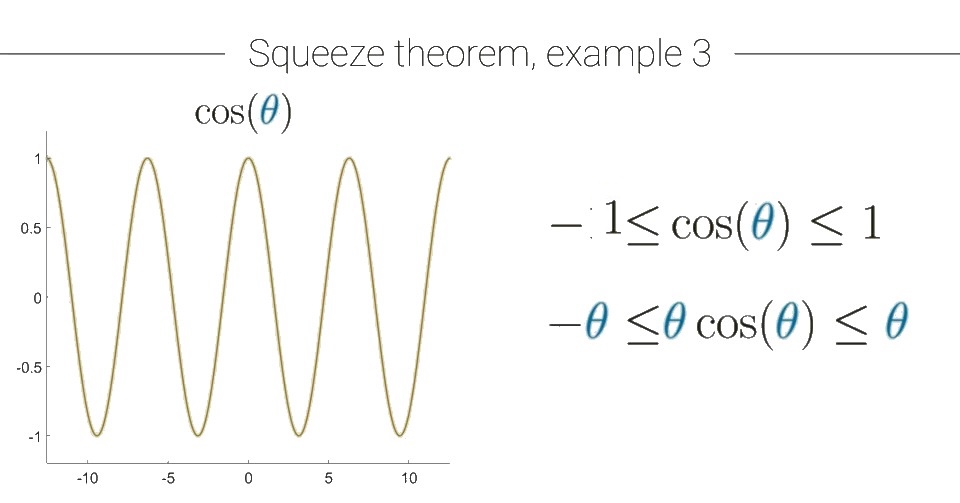{#slide-img width="100%"}
:::

---


## {auto-animate=true background-color="#ffffff" .white-canvas}

::: {style="text-align:center; margin:0; padding:0;"}
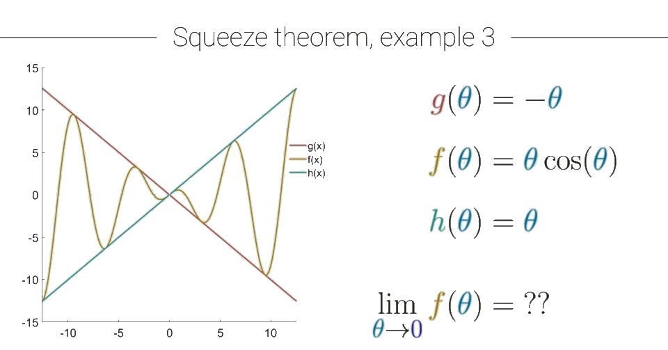{#slide-img width="100%"}
:::

---

## {auto-animate=true background-color="#ffffff" .white-canvas}

::: {style="text-align:center; margin:0; padding:0;"}
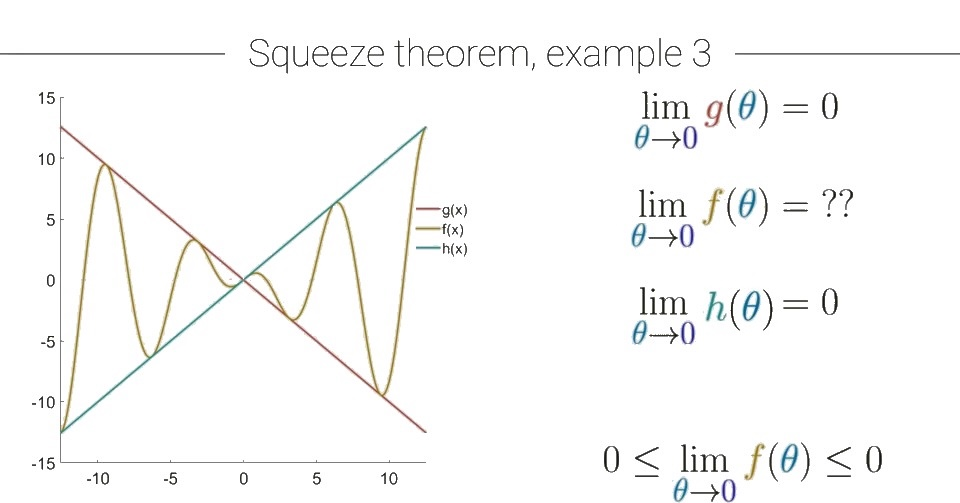{#slide-img width="100%"}
:::

---

## {auto-animate=true background-color="#ffffff" .white-canvas}

::: {style="text-align:center; margin:0; padding:0;"}
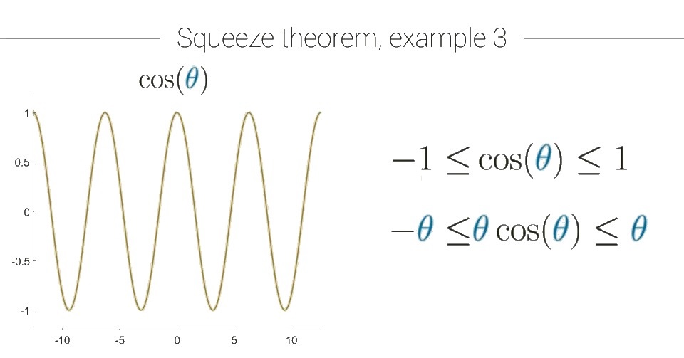{#slide-img width="100%"}
:::

---

## {auto-animate=true background-color="#ffffff" .white-canvas}

::: {style="text-align:center; margin:0; padding:0;"}
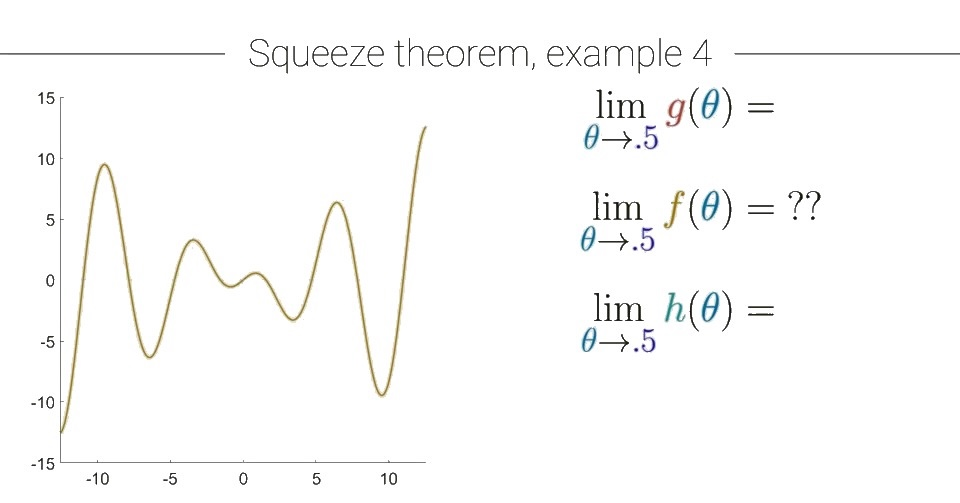{#slide-img width="100%"}
:::

---

## {auto-animate=true background-color="#ffffff" .white-canvas}

::: {style="text-align:center; margin:0; padding:0;"}
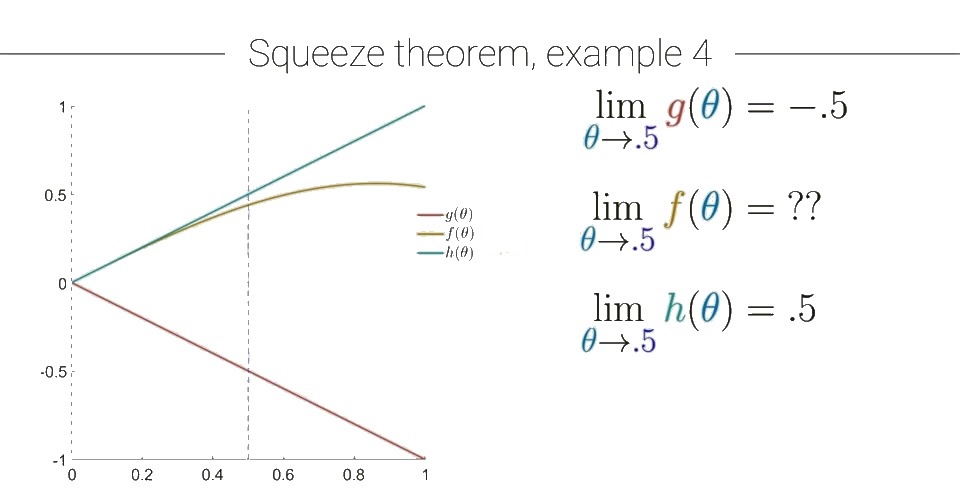{#slide-img width="100%"}
:::

---

## {auto-animate=true background-color="#ffffff" .white-canvas}

::: {style="text-align:center; margin:0; padding:0;"}
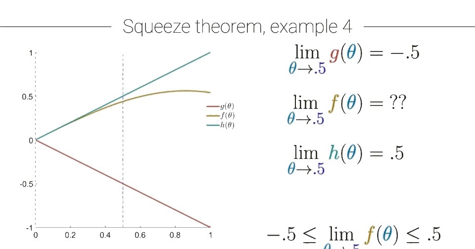{#slide-img width="100%"}
:::

---

## ¿Por qué usar el teorema del emparedado? {.title-line}

  - Deducir el límite de una función que, de otro modo, sería imposible de calcular (por ejemplo, funciones trigonométricas).

  - Hallar la derivada de una función en un punto que, de otra manera, sería imposible de obtener.


## Posibilidades de límites finitos

En este presentación , aprenderás:

  - Las posibilidades de los comportamientos de los límites.

  - Cómo interpretar los resultados de los límites.


## Posibles límites {.title-line}

:::{.r-stack style="font-size: 2em; width: 100%; text-align: center;"}

::: {.fragment .fade-out data-fragment-index=1}
**Caso 1: "Easy"** — Sustitución directa
:::

::: {.fragment .fade-in data-fragment-index=1}
$$\lim_{\color{teal}{x} \to \color{maroon}{a}} f(\color{teal}{x}) = \color{blue}{c}$$
:::

:::

:::{.fragment .fade-up data-fragment-index=2 style="margin-top:-1em;"}
```{python}
#| echo: false
#| fig-align: center
#| results: "hide"
import numpy as np
import matplotlib.pyplot as plt

x = np.linspace(-2, 4, 400)
y = (x + 3) / (x - 1)

fig, ax = plt.subplots(figsize=(8, 4.5))

ax.grid(True, color="gray", alpha=0.15, linewidth=0.8)
ax.axhline(0, color="black", linewidth=1.8, zorder=2)
ax.axvline(0, color="black", linewidth=1.8, zorder=2)

ax.plot(x, y, color="#B8860B", linewidth=2.5, zorder=3)

ax.plot(2, 5, "o", color="red", markersize=9, zorder=5)
ax.annotate("$(2,\\ 5)$", xy=(2, 5), xytext=(2.5, 7),
            fontsize=13, color="red",
            arrowprops=dict(arrowstyle="-", color="red", lw=1.2))

ax.set_xlim(-2, 4)
ax.set_ylim(-5, 10)
ax.set_xticks(np.arange(-1, 5, 1))
ax.set_yticks(np.arange(-4, 11, 2))
ax.tick_params(labelsize=13)
ax.set_xlabel("$x$", fontsize=14, labelpad=8)
ax.text(0, 10, "$f(x)$", fontsize=18, ha="left", va="bottom")

for spine in ax.spines.values():
    spine.set_visible(False)

plt.tight_layout()
plt.show()
```
:::

---

## {auto-animate=true background-color="#ffffff" .white-canvas}

:::{.r-stack style="font-size: 2em; width: 100%; text-align: center;"}

::: {.fragment .fade-out data-fragment-index=1}
**Caso 2: Nonzero over zero** — Asíntota vertical
:::

::: {.fragment .fade-in data-fragment-index=1}
$$\lim_{\color{teal}{x} \to \color{maroon}{a}} f(\color{teal}{x}) = \frac{c}{0} \quad \Rightarrow \quad \pm\infty$$
:::

:::

:::{.fragment .fade-up data-fragment-index=2 style="margin-top:-1em;"}
```{python}
#| echo: false
#| fig-align: center
#| results: "hide"
import numpy as np
import matplotlib.pyplot as plt

x1 = np.linspace(-1, 1.95, 300)
x2 = np.linspace(2.05, 5, 300)
y1 = (x1 + 2) / (x1 - 2)
y2 = (x2 + 2) / (x2 - 2)

fig, ax = plt.subplots(figsize=(8, 4.5))

ax.grid(True, color="gray", alpha=0.15, linewidth=0.8)
ax.axhline(0, color="black", linewidth=1.8, zorder=2)
ax.axvline(0, color="black", linewidth=1.8, zorder=2)

ax.plot(x1, y1, color="#B8860B", linewidth=2.5, zorder=3)
ax.plot(x2, y2, color="#B8860B", linewidth=2.5, zorder=3)

ax.axvline(2, color="red", linestyle="--", linewidth=1.5, alpha=0.7)

ax.set_xlim(-1, 5)
ax.set_ylim(-15, 15)
ax.set_xticks(np.arange(0, 6, 1))
ax.set_yticks(np.arange(-10, 16, 5))
ax.tick_params(labelsize=13)
ax.set_xlabel("$x$", fontsize=14, labelpad=8)
ax.text(0, 15, "$f(x)$", fontsize=18, ha="left", va="bottom")

for spine in ax.spines.values():
    spine.set_visible(False)

plt.tight_layout()
plt.show()
```
:::

---

## {auto-animate=true background-color="#ffffff" .white-canvas}

:::{.r-stack style="font-size: 2em; width: 100%; text-align: center;"}

::: {.fragment .fade-out data-fragment-index=1}
**Caso 3: Indeterminate** — Forma $\frac{0}{0}$
:::

::: {.fragment .fade-in data-fragment-index=1}
$$\lim_{\color{teal}{x} \to \color{maroon}{0}} \frac{\sin(\color{teal}{x})}{\color{teal}{x}} = \color{blue}{1}$$
:::

:::

:::{.fragment .fade-up data-fragment-index=2 style="margin-top:-1em;"}
```{python}
#| echo: false
#| fig-align: center
#| results: "hide"
import numpy as np
import matplotlib.pyplot as plt

x = np.linspace(-3, 3, 400)
y = np.sin(x) / x
y[np.abs(x) < 1e-10] = 1

fig, ax = plt.subplots(figsize=(8, 4.5))

ax.grid(True, color="gray", alpha=0.15, linewidth=0.8)
ax.axhline(0, color="black", linewidth=1.8, zorder=2)
ax.axvline(0, color="black", linewidth=1.8, zorder=2)

ax.plot(x, y, color="#B8860B", linewidth=2.5, zorder=3)

ax.plot(0, 1, "o", color="red", markersize=9, zorder=5)
ax.annotate("$(0,\\ 1)$", xy=(0, 1), xytext=(0.5, 1.3),
            fontsize=13, color="red",
            arrowprops=dict(arrowstyle="-", color="red", lw=1.2))

ax.set_xlim(-3, 3)
ax.set_ylim(-0.5, 1.5)
ax.set_xticks(np.arange(-2, 3, 1))
ax.set_yticks(np.arange(0, 2, 0.5))
ax.tick_params(labelsize=13)
ax.set_xlabel("$x$", fontsize=14, labelpad=8)
ax.text(0, 1.5, "$f(x)$", fontsize=18, ha="left", va="bottom")

for spine in ax.spines.values():
    spine.set_visible(False)

plt.tight_layout()
plt.show()
```
:::

---

## {auto-animate=true background-color="#ffffff" .white-canvas}

:::{.r-stack style="font-size: 2em; width: 100%; text-align: center;"}

::: {.fragment .fade-out data-fragment-index=1}
**Caso 4: Infinite over finite** — Crecimiento sin límite
:::

::: {.fragment .fade-in data-fragment-index=1}
$$\lim_{\color{teal}{x} \to \color{maroon}{\infty}} f(\color{teal}{x}) = \frac{\infty}{c} \quad \Rightarrow \quad \pm\infty$$
:::

:::

:::{.fragment .fade-up data-fragment-index=2 style="margin-top:-1em;"}
```{python}
#| echo: false
#| fig-align: center
#| results: "hide"
import numpy as np
import matplotlib.pyplot as plt

x = np.linspace(0.1, 10, 400)
y = np.sqrt(x) / 2

fig, ax = plt.subplots(figsize=(8, 4.5))

ax.grid(True, color="gray", alpha=0.15, linewidth=0.8)
ax.axhline(0, color="black", linewidth=1.8, zorder=2)
ax.axvline(0, color="black", linewidth=1.8, zorder=2)

ax.plot(x, y, color="#B8860B", linewidth=2.5, zorder=3)

ax.set_xlim(0, 10)
ax.set_ylim(0, 2)
ax.set_xticks(np.arange(0, 11, 2))
ax.set_yticks(np.arange(0, 2.5, 0.5))
ax.tick_params(labelsize=13)
ax.set_xlabel("$x$", fontsize=14, labelpad=8)
ax.text(0, 2, "$f(x)$", fontsize=18, ha="left", va="bottom")

for spine in ax.spines.values():
    spine.set_visible(False)

plt.tight_layout()
plt.show()
```
:::

---

## {auto-animate=true background-color="#ffffff" .white-canvas}

:::{.r-stack style="font-size: 2em; width: 100%; text-align: center;"}

::: {.fragment .fade-out data-fragment-index=1}
**Caso 5: Finite over infinite** — Tiende a cero
:::

::: {.fragment .fade-in data-fragment-index=1}
$$\lim_{\color{teal}{x} \to \color{maroon}{\infty}} \frac{\cos(\color{teal}{x})}{\color{teal}{x}} = \color{blue}{0}$$
:::

:::

:::{.fragment .fade-up data-fragment-index=2 style="margin-top:-1em;"}
```{python}
#| echo: false
#| fig-align: center
#| results: "hide"
import numpy as np
import matplotlib.pyplot as plt

x = np.linspace(0.1, 20, 400)
y = np.cos(x) / x

fig, ax = plt.subplots(figsize=(8, 4.5))

ax.grid(True, color="gray", alpha=0.15, linewidth=0.8)
ax.axhline(0, color="black", linewidth=1.8, zorder=2)
ax.axvline(0, color="black", linewidth=1.8, zorder=2)

ax.plot(x, y, color="#B8860B", linewidth=2.5, zorder=3)

ax.axhline(0, color="blue", linestyle="--", linewidth=1.5, alpha=0.7)

ax.set_xlim(0, 20)
ax.set_ylim(-1.2, 1.2)
ax.set_xticks(np.arange(0, 21, 5))
ax.set_yticks(np.arange(-1, 1.5, 0.5))
ax.tick_params(labelsize=13)
ax.set_xlabel("$x$", fontsize=14, labelpad=8)
ax.text(0, 1.2, "$f(x)$", fontsize=18, ha="left", va="bottom")

for spine in ax.spines.values():
    spine.set_visible(False)

plt.tight_layout()
plt.show()
```
:::

---

## {auto-animate=true background-color="#ffffff" .white-canvas}

:::{.r-stack style="font-size: 2em; width: 100%; text-align: center;"}

::: {.fragment .fade-out data-fragment-index=1}
**Caso 6: Infinite over infinite** — Regla de L'Hôpital
:::

::: {.fragment .fade-in data-fragment-index=1}
$$\lim_{\color{teal}{x} \to \color{maroon}{\infty}} \frac{e^{\color{teal}{x}}}{\color{teal}{x}^3} = \color{blue}{\infty}$$
:::

:::

:::{.fragment .fade-up data-fragment-index=2 style="margin-top:-1em;"}
```{python}
#| echo: false
#| fig-align: center
#| results: "hide"
import numpy as np
import matplotlib.pyplot as plt

x = np.linspace(0.1, 5, 400)
y = np.exp(x) / x**3

fig, ax = plt.subplots(figsize=(8, 4.5))

ax.grid(True, color="gray", alpha=0.15, linewidth=0.8)
ax.axhline(0, color="black", linewidth=1.8, zorder=2)
ax.axvline(0, color="black", linewidth=1.8, zorder=2)

ax.plot(x, y, color="#B8860B", linewidth=2.5, zorder=3)

ax.set_xlim(0, 5)
ax.set_ylim(0, 30)
ax.set_xticks(np.arange(0, 6, 1))
ax.set_yticks(np.arange(0, 35, 5))
ax.tick_params(labelsize=13)
ax.set_xlabel("$x$", fontsize=14, labelpad=8)
ax.text(0, 30, "$f(x)$", fontsize=18, ha="left", va="bottom")

for spine in ax.spines.values():
    spine.set_visible(False)

plt.tight_layout()
plt.show()
```
:::

---

## {auto-animate=true background-color="#ffffff" .white-canvas}

:::{.r-stack style="font-size: 2em; width: 100%; text-align: center;"}

::: {.fragment .fade-out data-fragment-index=1}
**Caso 7: Finite over finite** — Carrera balanceada
:::

::: {.fragment .fade-in data-fragment-index=1}
$$\lim_{\color{teal}{x} \to \color{maroon}{\infty}} \frac{\color{teal}{x}^2}{2\color{teal}{x}^2} = \color{blue}{\frac{1}{2}}$$
:::

:::

:::{.fragment .fade-up data-fragment-index=2 style="margin-top:-1em;"}
```{python}
#| echo: false
#| fig-align: center
#| results: "hide"
import numpy as np
import matplotlib.pyplot as plt

x = np.linspace(0.1, 10, 400)
y = x**2 / (2 * x**2)

fig, ax = plt.subplots(figsize=(8, 4.5))

ax.grid(True, color="gray", alpha=0.15, linewidth=0.8)
ax.axhline(0, color="black", linewidth=1.8, zorder=2)
ax.axvline(0, color="black", linewidth=1.8, zorder=2)

ax.plot(x, y, color="#B8860B", linewidth=2.5, zorder=3)

ax.axhline(0.5, color="blue", linestyle="--", linewidth=1.5, alpha=0.7)

ax.set_xlim(0, 10)
ax.set_ylim(0, 1)
ax.set_xticks(np.arange(0, 11, 2))
ax.set_yticks(np.arange(0, 1.1, 0.25))
ax.tick_params(labelsize=13)
ax.set_xlabel("$x$", fontsize=14, labelpad=8)
ax.text(0, 1, "$f(x)$", fontsize=18, ha="left", va="bottom")

for spine in ax.spines.values():
    spine.set_visible(False)

plt.tight_layout()
plt.show()
```
:::

---

## Tabla de posibilidades de límites

::: {style="font-size: 0.9em; text-align: center; padding: 0.5em;"}

::: {style="border-bottom: 1px solid #333; padding-bottom: 0.3em; margin-bottom: 0.8em;"}
<span style="font-size: 1.3em; color: #666;">Limits possibilities</span>
:::

::: {style="display: grid; grid-template-columns: 1fr 1.5fr 1.2fr 1.5fr; gap: 0.5em; text-align: left;"}

::: {style="font-weight: bold; color: #1a237e; font-size: 1.1em;"}
Label
:::
::: {style="font-weight: bold; color: #1a237e; font-size: 1.1em;"}
Case
:::
::: {style="font-weight: bold; color: #1a237e; font-size: 1.1em;"}
Outcomes
:::
::: {style="font-weight: bold; color: #1a237e; font-size: 1.1em;"}
Example
:::

::: {.fragment .fade-in data-fragment-index=1 style="color: #B8860B; padding: 0.3em 0;"}
"Easy"
:::
::: {.fragment .fade-in data-fragment-index=1 style="padding: 0.3em 0;"}
$\displaystyle\lim_{\color{teal}{x} \to \color{maroon}{a}} f(\color{teal}{x}) = \color{maroon}{c}$
:::
::: {.fragment .fade-in data-fragment-index=1 style="color: #B8860B; padding: 0.3em 0;"}
$c$
:::
::: {.fragment .fade-in data-fragment-index=1 style="padding: 0.3em 0;"}
$\displaystyle\lim_{\color{teal}{x} \to \color{maroon}{2}} \frac{\color{teal}{x}+3}{\color{teal}{x}-1} = \frac{5}{1}$
:::

::: {.fragment .fade-in data-fragment-index=2 style="color: #B8860B; padding: 0.3em 0;"}
Nonzero over zero
:::
::: {.fragment .fade-in data-fragment-index=2 style="padding: 0.3em 0;"}
$\displaystyle\lim_{\color{teal}{x} \to \color{maroon}{a}} f(\color{teal}{x}) = \frac{c}{0}$
:::
::: {.fragment .fade-in data-fragment-index=2 style="color: #8B0000; padding: 0.3em 0;"}
$-\infty, \infty,$ undefined
:::
::: {.fragment .fade-in data-fragment-index=2 style="padding: 0.3em 0;"}
$\displaystyle\lim_{\color{teal}{x} \to \color{maroon}{2^+}} \frac{\color{teal}{x}+2}{\color{teal}{x}-2} = \infty$
:::

::: {.fragment .fade-in data-fragment-index=3 style="color: #B8860B; padding: 0.3em 0;"}
Indeterminate
:::
::: {.fragment .fade-in data-fragment-index=3 style="padding: 0.3em 0;"}
$\displaystyle\lim_{\color{teal}{x} \to \color{maroon}{a}} f(\color{teal}{x}) = \frac{0}{0}$
:::
::: {.fragment .fade-in data-fragment-index=3 style="color: #8B0000; padding: 0.3em 0;"}
Try algebra or L'Hopital's rule
:::
::: {.fragment .fade-in data-fragment-index=3 style="padding: 0.3em 0;"}
$\displaystyle\lim_{\color{teal}{x} \to \color{maroon}{0}} \frac{\sin(\color{teal}{x})}{\color{teal}{x}} = 1$
:::

:::

:::

---

## Tabla de posibilidades de límites (continuación)

::: {style="font-size: 0.9em; text-align: center; padding: 0.5em;"}

::: {style="border-bottom: 1px solid #333; padding-bottom: 0.3em; margin-bottom: 0.8em;"}
<span style="font-size: 1.3em; color: #666;">Limits possibilities</span>
:::

::: {style="display: grid; grid-template-columns: 1fr 1.5fr 1.2fr 1.5fr; gap: 0.5em; text-align: left;"}

::: {style="font-weight: bold; color: #1a237e; font-size: 1.1em;"}
Label
:::
::: {style="font-weight: bold; color: #1a237e; font-size: 1.1em;"}
Case
:::
::: {style="font-weight: bold; color: #1a237e; font-size: 1.1em;"}
Outcomes
:::
::: {style="font-weight: bold; color: #1a237e; font-size: 1.1em;"}
Example
:::

::: {.fragment .fade-in data-fragment-index=1 style="color: #B8860B; padding: 0.3em 0;"}
Infinite over finite
:::
::: {.fragment .fade-in data-fragment-index=1 style="padding: 0.3em 0;"}
$\displaystyle\lim_{\color{teal}{x} \to \color{maroon}{\infty}} f(\color{teal}{x}) = \frac{\infty}{\color{maroon}{c}}$
:::
::: {.fragment .fade-in data-fragment-index=1 style="color: #8B0000; padding: 0.3em 0;"}
$-\infty, \infty,$ undefined
:::
::: {.fragment .fade-in data-fragment-index=1 style="padding: 0.3em 0;"}
$\displaystyle\lim_{\color{teal}{x} \to \color{maroon}{\infty}} \frac{\sqrt{\color{teal}{x}}}{2} = \infty$
:::

::: {.fragment .fade-in data-fragment-index=2 style="color: #B8860B; padding: 0.3em 0;"}
Finite over infinite
:::
::: {.fragment .fade-in data-fragment-index=2 style="padding: 0.3em 0;"}
$\displaystyle\lim_{\color{teal}{x} \to \color{maroon}{\infty}} f(\color{teal}{x}) = \frac{c}{\infty}$
:::
::: {.fragment .fade-in data-fragment-index=2 style="color: #8B0000; padding: 0.3em 0;"}
$0$
:::
::: {.fragment .fade-in data-fragment-index=2 style="padding: 0.3em 0;"}
$\displaystyle\lim_{\color{teal}{x} \to \color{maroon}{\infty}} \frac{\cos(\color{teal}{x})}{\color{teal}{x}} = 0$
:::

::: {.fragment .fade-in data-fragment-index=3 style="color: #B8860B; padding: 0.3em 0;"}
Infinite over infinite
:::
::: {.fragment .fade-in data-fragment-index=3 style="padding: 0.3em 0;"}
$\displaystyle\lim_{\color{teal}{x} \to \color{maroon}{\infty}} f(\color{teal}{x}) = \frac{\infty}{\infty}$
:::
::: {.fragment .fade-in data-fragment-index=3 style="color: #8B0000; padding: 0.3em 0;"}
Try algebra or L'Hopital's rule
:::
::: {.fragment .fade-in data-fragment-index=3 style="padding: 0.3em 0;"}
$\displaystyle\lim_{\color{teal}{x} \to \color{maroon}{\infty}} \frac{e^{\color{teal}{x}}}{\color{teal}{x}^3} = 0$
:::

::: {.fragment .fade-in data-fragment-index=4 style="color: #B8860B; padding: 0.3em 0;"}
Finite over finite
:::
::: {.fragment .fade-in data-fragment-index=4 style="padding: 0.3em 0;"}
$\displaystyle\lim_{\color{teal}{x} \to \color{maroon}{\infty}} f(\color{teal}{x}) = \frac{c}{d}$
:::
::: {.fragment .fade-in data-fragment-index=4 style="color: #8B0000; padding: 0.3em 0;"}
Balanced race to infinity
:::
::: {.fragment .fade-in data-fragment-index=4 style="padding: 0.3em 0;"}
$\displaystyle\lim_{\color{teal}{x} \to \color{maroon}{\infty}} \frac{\color{teal}{x}^2}{2\color{teal}{x}^2} = \frac{1}{2}$
:::

:::

:::

---

## Límite de una función

El límite se enfoca en el **comportamiento** de la función en las **proximidades** de un [punto]{.alert}, no necesariamente en el valor exacto de la [función en ese punto]{.alert}.

  * **Concepto:** Imagina que te acercas a un punto en el eje $x$ desde la izquierda y la derecha. El límite es el valor al que la función ($y$) se va acercando.
  * **Existencia:** Un límite puede [existir]{.alert} incluso si la [función no está definida]{.alert} en el punto en cuestión. Por ejemplo, en una función con un agujero. .
  * **Notación:** $\displaystyle\lim_{x \to a} f(x) = L$


## El Problema del Límite y su Naturaleza

El problema típico en el cálculo de límites es determinar el límite de una función **$f$** en un punto dado **$c$**. Para abordar esto, es fundamental comprender dos tipos de límites, dependiendo de si se infringe o no una "Regla Sagrada del Cálculo" en el punto **$c$**.

### Tipos de Límites

#### Límites Inofensivos

Un límite se considera **inofensivo** si en el punto **$c$** no se viola ninguna regla sagrada del cálculo. En estos casos, la función **$f$** tendrá un límite en **$c$** que coincidirá con el valor de la función en dicho punto, $f(c)$. Esto significa que los límites laterales de **$f$** en **$c$** existirán y serán iguales.

#### Límites Peligrosos

Un límite es **peligroso** si en el punto **$c$** se viola alguna regla sagrada del cálculo. El estudio de estos límites puede ser más complejo y no existe una receta mágica que resuelva todos los casos.

## Observación y Simplificación

Para el cálculo de un límite, es importante recordar que la definición solo involucra los valores de la función en puntos **próximos** a **$c$**, no en el punto **$c$** mismo. Por lo tanto, no importa si **$c$** tiene una imagen definida por la función **$f$**. Esto permite simplificar la función antes de calcular el límite.

Si una función **$f(x)$** es igual a otra función **$g(x)$** en todos los puntos de un entorno reducido de **$c$**, ambas funciones tendrán el mismo límite en **$c$**. Por esta razón, es legítimo hacer simplificaciones convenientes antes de calcular el límite, incluso la supresión de factores comunes que se anulan en **$c$**, siempre que estos no se anulen en las **proximidades** de **$c$**.

## Ejemplo 

::: {.bg style="background-color:none; padding:0.8em; margin-top:0em; font-size:0.82em;"}

Si $f(x) = 4x+2$, es: 
$$\lim_{x \to 7} f(x) = f(7) = 30$$

[¡Qué genial!:]{.alert} Si $f(x) = 4x+2$, en el punto "$7$" no se viola ninguna Regla Sagrada (RS); por tanto, el límite de "$f$" en el punto "$7$" coincide con $f(7)$.

:::

::: {.bg style="background-color: #f2f398ff; padding:0.8em; margin-top:0em; font-size:0.8em; border-radius: 0.5em;"}

[En examen no importa lo que sabes, importa lo que **parece** que sabes.]{.bg style="background:white;font-size:1em;"}

Eligiendo "$x$" suficientemente próximo a "$7$", el valor absoluto de $\mid f(x) - 30 \mid$ es inferior a todo número positivo que se fije de antemano.

::: center
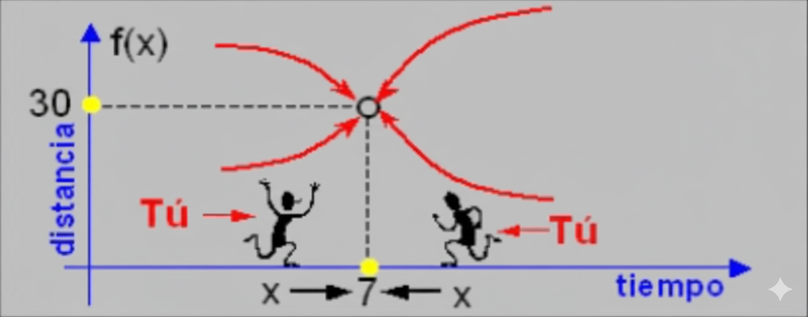{width="38%"}
:::
:::


## Ejemplo 

::: {.bg style="background-color:none; padding:0.8em; margin-top:0em; font-size:0.85em;"}

[Por ejemplo]{.alert}, sea una función $f$ tal que: $f(x) = \frac{3 \cdot (x-2)^2 + (x-2)}{(x-2)}$

El límite de $f(x)$ cuando $x$ se aproxima a $26$ se calcula de la siguiente manera:

::: center
$\displaystyle\lim_{x \to 26} \frac{3 \cdot (x-2)^2 + (x-2)}{(x-2)} = \displaystyle\lim_{x \to 26} (3 \cdot (x-2) + 1)$
:::

:::

::: {.bg style="background-color: #f2f398ff; padding:0.8em; margin-top:0em; font-size:0.85em; border-radius: 0.5em;"}

En las [proximidades]{.alert} del punto $x=26$, sucede que $f(x)$ coincide con la función $g(x) = 3 \cdot (x-2) + 1$. Esto es así porque, si $x$ es [próximo]{.alert} a 26, se cumple que:

::: center
$\frac{3 \cdot (x-2)^{2} + {(x-2)}}{{(x-2)}} =\frac{(x-2)[3 \cdot (x-2)] + {1}]}{{(x-2)}}= 3 \cdot (x-2) + 1$
:::

::: {.bg style="background:white;font-size:1"}
Dividimos el $N^{dor}$ y el denominador $D^{dor}$ por el factor $(x-2)$, que no se anula en ningún punto de las [proximidades]{.alert} de $x=26$.
:::

:::

## Ejemplo 

::: {.bg style="background-color:none; padding:0.8em; margin-top:-0.8em; font-size:0.85em;"}

[Por ejemplo]{.alert}, sea una función $f$ tal que: $f(x) = \frac{3 \cdot (x-2)^2 + (x-2)}{(x-2)}$

::: center
$\displaystyle\lim_{x \to 2.01} \frac{3 \cdot (x-2)^2 + (x-2)}{(x-2)} = \displaystyle\lim_{x \to 26} (3 \cdot (x-2) + 1)$
:::

:::

::: {.bg style="background-color: #f2f398ff; padding:0.5em; margin-top:-0.75em; font-size:0.8em; border-radius: 0.5em;"}

En las [proximidades]{.alert} del punto $x=2.01$, sucede que $f(x)$ coincide con la función $g(x) = 3 \cdot (x-2) + 1$. Esto es así porque, si $x$ es [próximo]{.alert} a 2.01, se cumple que:

::: center
$\frac{3 \cdot (x-2)^{2} + {(x-2)}}{{(x-2)}} =\frac{(x-2)[3 \cdot (x-2)] + {1}]}{{(x-2)}}= 3 \cdot (x-2) + 1$
:::

::: {.bg style="background:white;font-size:0.85em;padding:0.2em;"}
Dividimos el $N^{dor}$ y el denominador $D^{dor}$ por el factor $(x-2)$, que no se anula en ningún punto de las [proximidades]{.alert} de $x=2.01$.

::: center
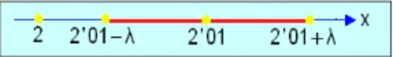{width="40%"}
:::

[Obvio]{.alert} , si $0<\lambda<0.01$, el factor $x-2$ no se anula en ningun punto del entorno reducido de centro en 2.01 y radio $\lambda$ 
:::

:::

## Ejemplo 

::: {.bg style="background-color:none; padding:0.8em; margin-top:-0.8em; font-size:0.85em;"}

[Por ejemplo]{.alert}, sea una función $f$ tal que: $f(x) = \frac{3 \cdot (x-2)^2 + (x-2)}{(x-2)}$

::: center
$\displaystyle\lim_{x \to 2} \frac{3 \cdot (x-2)^2 + (x-2)}{(x-2)} = \displaystyle\lim_{x \to 2} (3 \cdot (x-2) + 1)$
:::

:::

::: {.bg style="background-color: #f2f398ff; padding:0.5em; margin-top:-0.75em; font-size:0.9em; border-radius: 0.5em;"}

En las [proximidades]{.alert} del punto $x=2$, sucede que $f(x)$ coincide con la función $g(x) = 3 \cdot (x-2) + 1$. Esto es así porque, si $x$ es [próximo]{.alert} a 2, se cumple que:

::: center
$\frac{3 \cdot (x-2)^{2} + {(x-2)}}{{(x-2)}} =\frac{(x-2)[3 \cdot (x-2)] + {1}]}{{(x-2)}}= 3 \cdot (x-2) + 1$
:::

::: {.bg style="background:white;font-size:1em;padding:0.2em;"}
Dividimos el $N^{dor}$ y el denominador $D^{dor}$ por el factor $(x-2)$, que  se anula en el punto $x=2$ Pues el resultado obtenido tras la división no es valido si $x=2$ al dividir por $x-2$ se divide por [cero]{.alert}, lo que es prohibido, pero no se anula en la [proximidades]{.alert} de $x=2$
:::

:::


## Ejemplos de PL (con límites inofensivos)

En los siguientes ejemplos, el límite de la función en un [punto]{.blue} es [igual al valor]{.alert} de la función en ese mismo [punto]{.blue}.

::: center
::: {.bg style="background: #fdf6e3; font-size:0.68em;margin-top:-0.5em;"}
::: {.fragment}
* Si $f(x) = 2x+3$, entonces: $\displaystyle\lim_{x \to 5} f(x) = 13 = f(5)$

    *PL*: si $x \to 5 \Rightarrow f(x) = 2x+3 \to 2 \cdot (5) + 3 = 13$

    Es decir: $f(x)$ "[tiende]{.alert}" a 13 tanto si $x \to 5^-$ como si $x \to 5^+$
:::
:::

::: {.bg style="background: none; font-size:0.68em;margin-top:0em;"}
::: {.fragment}
* Si $f(x) = x^2+7$, entonces: $\displaystyle\lim_{x \to -3} f(x) = 16 = f(-3)$

    *PL*: si $x \to -3 \Rightarrow f(x) = x^2+7 \to (-3)^2 + 7 = 16$

    Es decir: $f(x)$ "[tiende]{.alert}" a 16 tanto si $x \to -3^-$ como si $x \to -3^+$
:::
:::

::: {.bg style="background: #fdf6e3; font-size:0.68em;margin-top:-0.5em;"}
::: {.fragment}
* Si $f(x) = 3x^3-x$, entonces: $\displaystyle\lim_{x \to 2} f(x) = 3 \cdot 2^3 - 2 = 22$

    *PL*: si $x \to 2 \Rightarrow f(x) = 3x^3-x \to 3 \cdot 2^3 - 2 = 22$

    Es decir: $f(x)$ "[tiende]{.alert}" a 22 tanto si $x \to 2^-$ como si $x \to 2^+$
:::
:::
:::

::: {.bg style="background: #ccf5cc; font-size:0.7em;margin-top:-0.5em;padding:0.1em"}
[**Recuerda:**]{.alert} al escribir $x \to c$, que se lee "$x$ tiende a $c$", queremos indicar que "$x$" se aproxima a "$c$" indistintamente por la derecha ($x \to c^+$) o por la izquierda ($x \to c^-$).
:::

## Ejemplos de PL (con límites inofensivos)

En los siguientes ejemplos, el límite de la función en un [punto]{.blue} es [igual al valor]{.alert} de la función en ese mismo [punto]{.blue}.

::: center
::: {.bg style="background: #fdf6e3; font-size:0.7em;margin-top:-0.5em;"}
::: {.fragment}
* Si $f(x) = \frac{x+1}{x+6}$, entonces:
    $\displaystyle\lim_{x \to 3} f(x) = \frac{4}{9} = f(3)$
    *PL*: si $x \to 3 \Rightarrow \left\{ \begin{array}{l} x+1 \to 4 \\ x+6 \to 9 \end{array} \right\} \Rightarrow f(x) = \frac{x+1}{x+6} \to \frac{4}{9}$

    Es decir: $f(x)$ "tiende" a $\frac{4}{9}$ tanto si $x \to 3^-$ como si $x \to 3^+$
:::
:::

::: {.bg style="background: none; font-size:0.7em;margin-top:0em;"}
::: {.fragment}
* Si $f(x) = \ln \frac{x-1}{7-x}$, entonces:
    $\displaystyle\lim_{x \to 4} f(x) = 0 = f(4)$
    *PL*: si $x \to 4 \Rightarrow \left\{ \begin{array}{l} x-1 \to 3 \\ 7-x \to 3 \end{array} \right\} \Rightarrow f(x) = \ln \frac{x-1}{7-x} \to \ln \frac{3}{3} = 0$

    Es decir: $f(x)$ "tiende" a 0 tanto si $x \to 4^-$ como si $x \to 4^+$
:::
:::

::: {.bg style="background: #fdf6e3; font-size:0.7em;margin-top:-0.5em;"}
::: {.fragment}
* Si $f(x) = e^x \cdot \cos(1+x^3)$, entonces:
    $\displaystyle\lim_{x \to 0} f(x) = \cos(1) = f(0)$
    *PL*: si $x \to 0 \Rightarrow \left\{ \begin{array}{l} e^x \to e^0 = 1 \\ 1+x^3 \to 1 \Rightarrow \cos(1+x^3) \to \cos 1 \end{array} \right\} \Rightarrow f(x) = e^x \cdot \cos(1+x^3) \to \cos 1$
:::
:::
:::

::: {.bg style="background: #ccf5cc; font-size:0.7em;margin-top:-0.5em;"}
[**Recuerda:**]{.alert} al escribir $x \to c$, que se lee "$x$ tiende a $c$", queremos indicar que "$x$" se aproxima a "$c$" indistintamente por la derecha ($x \to c^+$) o por la izquierda ($x \to c^-$).
:::

## Ejemplos de Límites (Casos Inofensivos)

En los siguientes ejemplos, el límite de la función en un [punto]{.blue} es [igual al valor]{.alert} de la función en ese mismo [punto]{.blue}.

::: center
::: {.bg style="background: #fdf6e3; font-size:0.75em;margin-top:-0.5em;"}
::: {.fragment}
* Si $f(x) = (1+x^2)^{x+2}$, entonces:
    $\displaystyle\lim_{x \to 1} f(x) = 8 = f(1)$
    *PL*: si $x \to 1 \Rightarrow \left\{ \begin{array}{l} 1+x^2 \to 2 \\ x+2 \to 3 \end{array} \right\} \Rightarrow f(x) = (1+x^2)^{x+2} \to 2^3 = 8$
:::
:::

::: {.bg style="background: none; font-size:0.78em;margin-top:0em;"}
::: {.fragment}
* Si $f(x) = \frac{2-x^2}{x+1} \cdot \sqrt[3]{\frac{8+x}{1-x}}$, entonces:
    $\displaystyle\lim_{x \to 0} f(x) = 4 = f(0)$
    *PL*: si $x \to 0 \Rightarrow \left\{ \begin{array}{l} \frac{2-x^2}{x+1} \to \frac{2-0}{0+1} = 2 \\ \sqrt[3]{\frac{8+x}{1-x}} \to \sqrt[3]{\frac{8}{1}} = 2 \end{array} \right\} \Rightarrow f(x) = \frac{2-x^2}{x+1} \cdot \sqrt[3]{\frac{8+x}{1-x}} \to 2 \cdot 2 = 4$
:::
:::

::: {.bg style="background: #fdf6e3; font-size:0.76em;margin-top:-0.5em;"}
::: {.fragment}
* Si $f(x) = |1-x^3|$, entonces:
    $\displaystyle\lim_{x \to 2} f(x) = 7 = f(2)$
    *PL*: si $x \to 2 \Rightarrow 1-x^3 \to 1-2^3 = -7 \Rightarrow f(x) = |1-x^3| \to |-7| = 7$
:::
:::
:::

::: {.bg style="background: #ccf5cc; font-size:0.7em;margin-top:-0.5em;"}
[**Recuerda:**]{.alert} al escribir $x \to c$, que se lee "$x$ tiende a $c$", queremos indicar que "$x$" se aproxima a "$c$" indistintamente por la derecha ($x \to c^+$) o por la izquierda ($x \to c^-$).
:::

## Ejemplos de Límites (Casos de funciones por partes)

::: center
::: {.bg style="background: #fdf6e3; font-size:0.7em;margin-top:-0.5em;"}
Sea una función $f: \mathbb{R} \to \mathbb{R}$ tal que: $f(x) = \left\{ \begin{array}{ll} x^3 & \text{si } x < 1 \\ 2^x-1 & \text{si } 1 \leq x \leq 3 \\ x^2+1 & \text{si } x > 3 \end{array} \right.$
:::
:::

::: center
::: {.fragment style="margin-top:-1.2em;"}
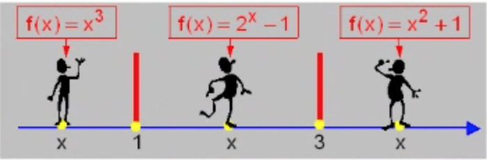{width="50%"}
:::
:::

::: {.bg style="background: none; font-size:0.9em;margin-top:-1.5em;"}
::: {.fragment}
Para calcular el límite de $f(x)$ cuando $x$ se aproxima a $-5$, primero debemos identificar qué parte de la función se aplica en ese punto.
:::
:::

::: {.fragment}
::: {.bg style="background: none; font-size:0.9em;margin-top:-1.5em;"}
$\displaystyle\lim_{x \to -5} f(x) = -125$ *PL*: Si $x \to -5$, entonces  $\Rightarrow f(x) = x^3 \to (-5)^3 = -125$
:::
:::

::: center
::: {.fragment style="margin-top:-2.2em;"}
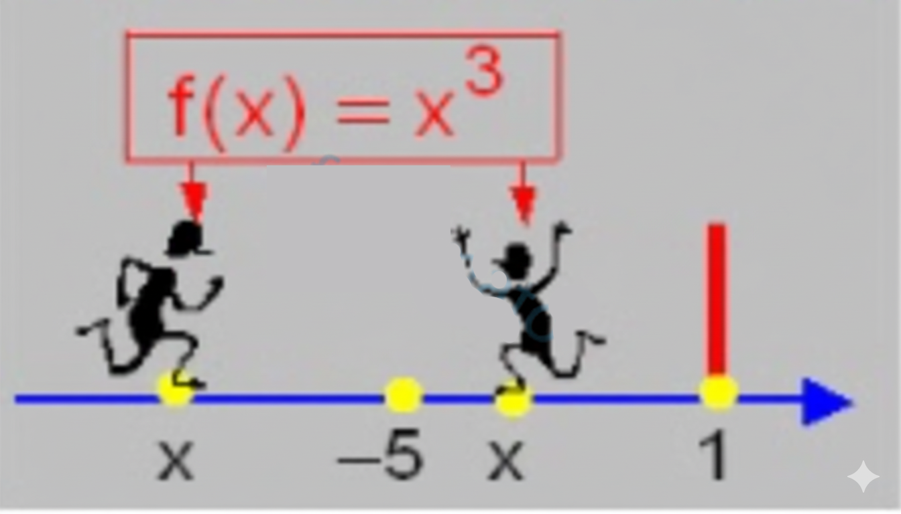{width="25%"}
:::
:::

## Ejemplos de Límites (Casos de funciones por partes)

::: center
::: {.bg style="background: #fdf6e3; font-size:0.7em;margin-top:-0.5em;"}
Sea una función $f: \mathbb{R} \to \mathbb{R}$ tal que: $f(x) = \left\{ \begin{array}{ll} x^3 & \text{si } x < 1 \\ 2^x-1 & \text{si } 1 \leq x \leq 3 \\ x^2+1 & \text{si } x > 3 \end{array} \right.$
:::
:::

::: center
::: {.fragment style="margin-top:-1.2em;"}
{width="50%"}
:::
:::

::: {.bg style="background: none; font-size:0.9em;margin-top:-1.5em;"}
::: {.fragment}
Para calcular el límite de $f(x)$ cuando $x$ se aproxima a $2$, primero debemos identificar qué parte de la función se aplica en ese punto.
:::
:::

::: {.fragment}
::: {.bg style="background: none; font-size:0.9em;margin-top:-1.5em;"}
$\displaystyle\lim_{x \to 2} f(x) = 3$ *PL*: Si $x \to 2$, entonces  $\Rightarrow f(x) = 2^x-1 \to 2^2-1 = 3$
:::
:::

::: center
::: {.fragment style="margin-top:-2.2em;"}
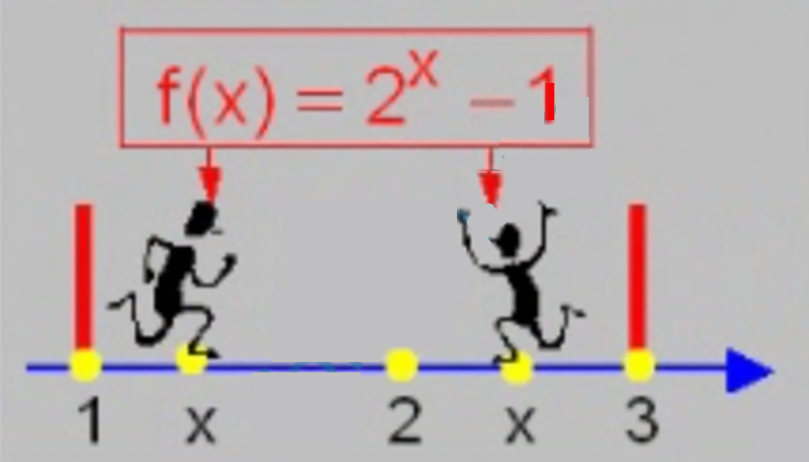{width="25%"}
:::
:::

## Ejemplos de Límites (Casos de funciones por partes)

::: center
::: {.bg style="background: #fdf6e3; font-size:0.7em;margin-top:-0.5em;"}
Sea una función $f: \mathfrak{R} \to \mathfrak{R}$ tal que: $f(x) = \left\{ \begin{array}{ll} x^3 & \text{si } x < 1 \\ 2^x-1 & \text{si } 1 \leq x \leq 3 \\ x^2+1 & \text{si } x > 3 \end{array} \right.$
:::
:::

::: center
::: {.fragment style="margin-top:-1.2em;"}
{width="50%"}
:::
:::

::: {.bg style="background: none; font-size:0.9em;margin-top:-1.5em;"}
::: {.fragment}
Para calcular el límite de $f(x)$ cuando $x$ se aproxima a $4$, primero debemos identificar qué parte de la función se aplica en ese punto.
:::
:::

::: {.fragment}
::: {.bg style="background: none; font-size:0.9em;margin-top:-1.5em;"}
$\displaystyle\lim_{x \to 4} f(x) = 17$ *PL*: Si $x \to 4$, entonces  $\Rightarrow f(x) = x^2+1 \to 4^2+1 = 17$
:::
:::

::: center
::: {.fragment style="margin-top:-2.2em;"}
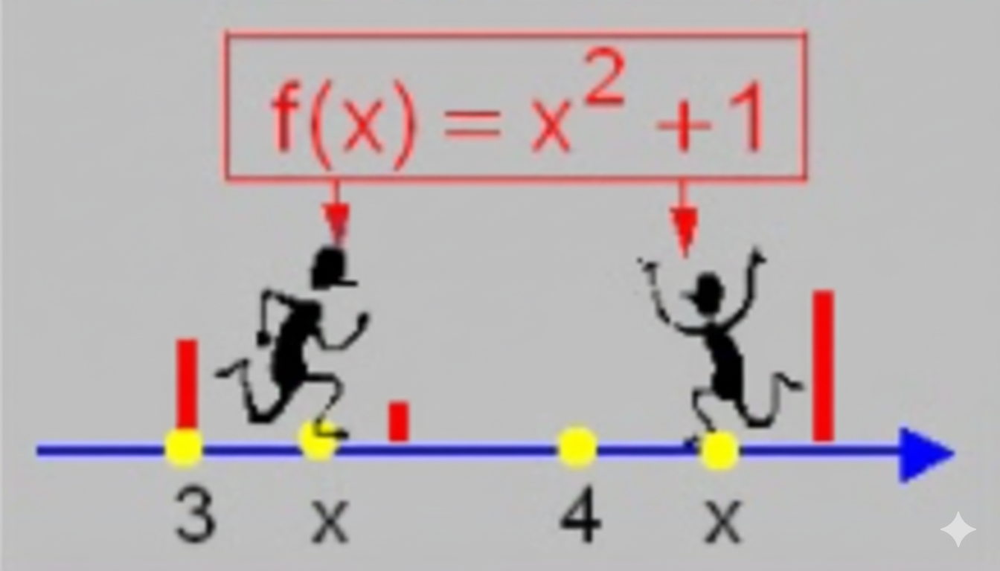{width="25%"}
:::
:::

## Ejemplos de Límites (Casos de funciones por partes)

::: center
::: {.bg style="background: #fdf6e3; font-size:0.7em;margin-top:-0.5em;"}
Sea una función $f: \mathfrak{R} \to \mathfrak{R}$ tal que: $f(x) = \left\{ \begin{array}{ll} x^3 & \text{si } x < 1 \\ 2^x-1 & \text{si } 1 \leq x \leq 3 \\ x^2+1 & \text{si } x > 3 \end{array} \right.$
:::
:::

::: center
::: {.fragment style="margin-top:-1.2em;"}
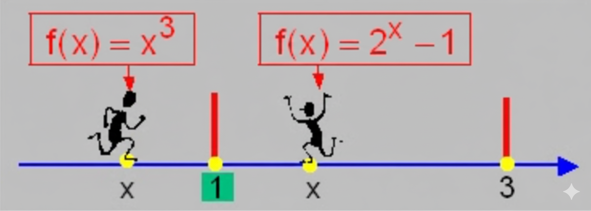{width="50%"}
:::
:::

::: {.fragment}
::: {.bg style="background: none; font-size:0.75em;margin-top:-1.5em;"}
Para el límite cuando $x$ se acerca a 1 por la izquierda ($x \to 1^-$), usamos la primera parte de la función:
:::
:::

::: {.fragment}
::: {.bg style="background: none; font-size:0.75em;margin-top:-1.5em;"}
$PL: \text{si } x \to 1^- \implies f(x) = x^3 \to 1^3 = 1$
:::
:::

::: {.fragment}
::: {.bg style="background: none; font-size:0.75em;margin-top:-1.5em;"}
Para el límite cuando $x$ se acerca a 1 por la derecha ($x \to 1^+$), usamos la segunda parte de la función:
:::
:::

::: {.fragment}
::: {.bg style="background: none; font-size:0.75em;margin-top:-1.5em;"}
$PL: \text{si } x \to 1^+ \implies f(x) = 2^x - 1 \to 2^1 - 1 = 1$
:::
:::

::: center
::: {.fragment}
::: {.bg style="background: none; font-size:0.75em;margin-top:-1.5em;"}
$$\displaystyle\lim_{x \to 1} f(x) = 1$$ 
:::
:::
:::

## Ejemplos de Límites (Casos de funciones por partes)

::: center
::: {.bg style="background: #fdf6e3; font-size:0.7em;margin-top:-0.5em;"}
Sea una función $f: \mathbb{R} \to \mathbb{R}$ tal que: $f(x) = \left\{ \begin{array}{ll} x^3 & \text{si } x < 1 \\ 2^x-1 & \text{si } 1 \leq x \leq 3 \\ x^2+1 & \text{si } x > 3 \end{array} \right.$
:::
:::

::: center
::: {.fragment style="margin-top:-1.2em;"}
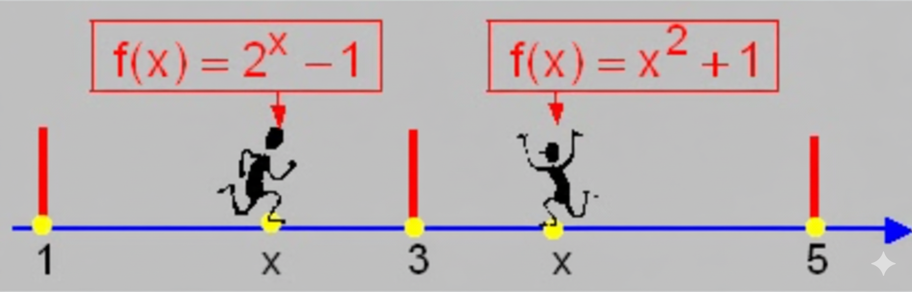{width="50%"}
:::
:::

::: {.fragment}
::: {.bg style="background: none; font-size:0.75em;margin-top:-1.5em;"}
Para el límite cuando $x$ se acerca a 3 por la izquierda ($x \to 3^-$), usamos la segunda parte de la función:

::: {.fragment}
$PL: \text{si } x \to 3^- \implies f(x) = 2^x - 1 \to 2^3 - 1 = 7$
:::

::: {.fragment}
Para el límite cuando $x$ se acerca a 3 por la derecha ($x \to 3^+$), usamos la tercera parte de la función:
:::

::: {.fragment}
$PL: \text{si } x \to 3^+ \implies f(x) = x^2 + 1 \to 3^2 + 1 = 10$
:::

::: center
::: {.fragment}
**No tiene límite en el punto 3**
:::
:::

:::
:::

## Límite peligrosos 

::: {.bg style="background: #fdf6e3; font-size:0.7em;margin-top:-0.5em;"}

**Solución de andar por casa**

Como "$f$" es inofensiva en "5", su límite en "5" coincide con $f(5) = \ln(1+5^2) = \ln 26$. [Desplegamos el "PL"]{.alert}

::: center
$\lim_{x \to 5} f(x) = \ln 26$

"PL": si $x \to 5 \Rightarrow 1+x^2 \to 26 \Rightarrow \ln(1+x^2) \to \ln 26$
:::
:::

::: {.bg style="background:none; font-size:0.85em;margin-top:-0.5em;"}

[Camino novedoso]{.alert}

::: center
$\lim_{h \to 0} f(5+h) = \lim_{h \to 0} \ln(1+(5+h)^2)$

$f(5+h) = \ln(1+(5+h)^2)$

Esto se expande a:

$$
\lim_{h \to 0} \ln(26 + h^2 + 10h) = \left\{
    \begin{array}{ll}
        \ln 26 & \text{si } h \to 0^- \implies \lim_{x \to 5^-} f(x) \\
        \ln 26 & \text{si } h \to 0^+ \implies \lim_{x \to 5^+} f(x)
    \end{array}
\right.
$$
:::
:::

## Límites peligrosos

::: colums

::: {.column width="50%"}
::: {.bg style="background: #fdf6e3; font-size:0.65em;margin-top:-0.5em;"}

**Definición del Límite Lateral Izquierdo**

El que $\lim_{x \to 5^-} f(x) = \ln 26$ significa que:

$$
\forall \epsilon > 0, \exists \delta_1 > 0 \text{ / } |f(x) - \ln 26| < \epsilon \text{ si } x \in (5-\delta_1; 5)
$$
:::
:::

::: {.column width="50%"}

::: {.bg style="background: #fdf6e3; font-size:0.65em;margin-top:-0.5em;padding:0.1em"}
**Definición del Límite Lateral Derecho**

El que $\lim_{x \to 5^+} f(x) = \ln 26$ significa que:

$$
\forall \epsilon > 0, \exists \delta_2 > 0 \text{ / } |f(x) - \ln 26| < \epsilon \text{ si } x \in (5; 5+\delta_2)
$$
:::
:::

::: {.bg style="background: none; font-size:0.65em;margin-top:-0.5em;padding:0.1em"}
::: center 
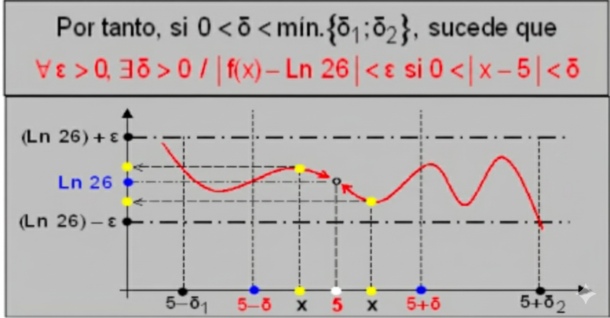{width="82%"}
:::
:::


:::

## Límites Infinitos

::: {.bg style="background: none; font-size:0.75em;margin-top:-0.85em;padding:0.1em"}
Si "$f$" está definida en todo punto de un semientorno reducido izquierdo (derecho) del punto $c \in \mathfrak{R}$, diremos que el **límite de "f" en "c" por la izquierda (derecha) es +$\infty$** para indicar que si "$x$" se aproxima más y más a "$c$" por la izquierda (derecha), el número $f(x)$ **se hace más y más positivo**... y tan enormemente positivo llega a ser $f(x)$ que, sin más que elegir "$x$" bastante próximo a "$c$", el número $f(x)$ llega a ser mayor que todo número que se fije de antemano.

$$
\lim_{x \to c^-} f(x) = +\infty \qquad ; \qquad \lim_{x \to c^+} f(x) = +\infty
$$
:::

::: {.bg style="background: none; font-size:0.8em;margin-top:-1.5em;padding:0.1em"}
::: center
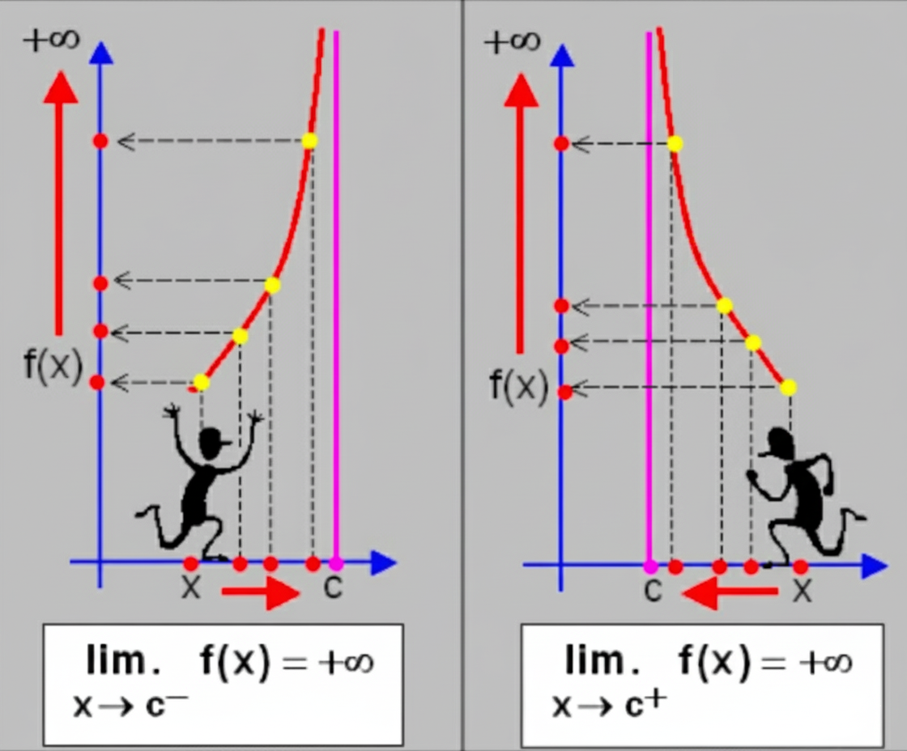{width="45%"}
:::
:::

## Límite de una Función

Si los dos límites laterales de "$f$" en "$c$" son $+\infty$, se dice que el **límite de "$f$" en "$c$" es $+\infty$**, y se escribe:

$$
\lim_{x \to c} f(x) = +\infty
$$

::: {.bg style="background: none; font-size:0.8em;margin-top:-1.5em;padding:0.1em"}
::: center
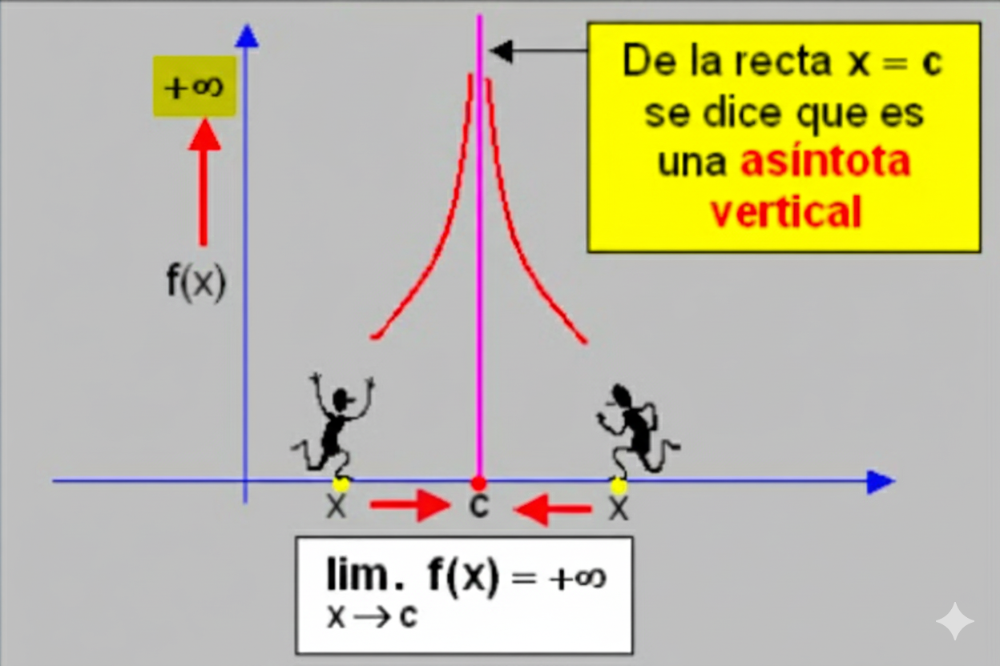{width="55%"}
:::
:::

## Límite de una Función

::: {.bg style="background: none; font-size:0.8em;margin-top:-1.5em;padding:0.1em"}
::: center
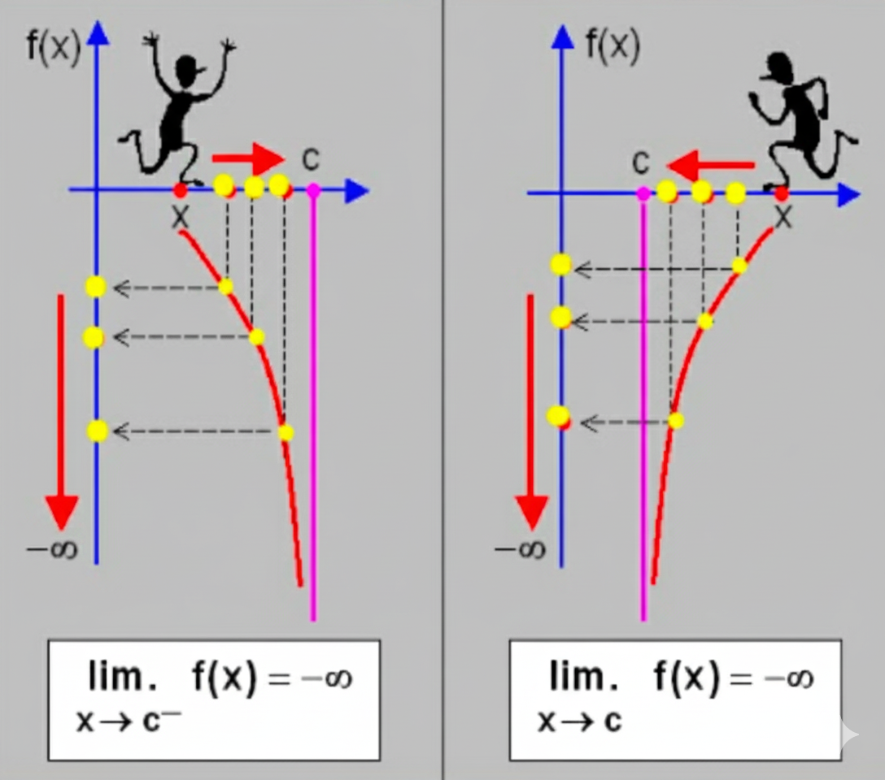{width="65%"}
:::
:::


##  Límite de una función en un punto

::: observ
**Observaciones.** 
:::

**1.** Igual que hemos hecho con las sucesiones y los números irracionales, con esta definción convertimos el problema de evaluar una función en un punto irracional en el de calcular el límite de una sucesión. 

**2.** El hecho requerir que $c$ sea un punto de acumulación de $A$, nos garantiza que existan sucesiones $\{x_n\}$ de puntos de $A$ tales que $\displaystyle{\lim_{n\rightarrow \infty} x_n = c}$ y, por lo tanto, la definición tiene sentido.

**3.** Si $c$ es un punto **aislado** de $A$, es decir si hay un entorno de $c$ en el cual no hay puntos de $A$ diferentes de $c$, entonces no tiene sentido hablar del límite de $f$ en ese punto.

## Límite de una función en un punto: Ejemplos.

<div class="example"> **Ejemplos**

**Ejemplo 1.** Sea $f: \mathbb{R}\rightarrow \mathbb{R}$ definida por $f(x)=x$ y sea $c \in \mathbb{R}$, entonces
$$
\lim_{x \rightarrow c} x = c,
$$
puesto que para cualquier sucesión $x_n  \rightarrow c$ es obvio que $f(x_n) = x_n \rightarrow c$.

**Ejemplo 2.** Análogamente si ahora es $f(x) = \dfrac{1}{x}$ y $c \neq 0$, entonces 

$$
\lim_{x \rightarrow c} \dfrac{1}{x} = \dfrac{1}{c},
$$
puesto que si $x_n \rightarrow c$, entonces $\dfrac{1}{x_n} \rightarrow \dfrac{1}{c}.$

</div>

## Ejemplo 1 Enunciado

Sea la función $f: \mathfrak{R} \to \mathfrak{R}$ dada por $f(x) = -\frac{1}{2}x+3$. Demostrar que $\lim_{x \to 2} f(x)=2$.


## Ejemplo 1 {.scrollable}

::: {.bg style="background-color:none; font-size: 0.7em"}

Sea la función $f: \mathfrak{R} \to \mathfrak{R}$ dada por $f(x) = -\frac{1}{2}x+3$. Demostrar que $\lim_{x \to 2} f(x)=2$.

### Demostración 

Sea $\epsilon>0$, buscamos un $\delta>0$ tal que si $0 < |x-2| < \delta$, entonces $|f(x) - 2| < \epsilon$.

Comenzamos con la expresión $|f(x) - L|$:

$$
\left| f(x) - 2 \right| = \left| \left(-\frac{1}{2}x+3\right) - 2 \right|
$$

$$
= \left| -\frac{1}{2}x+1 \right|
$$

Factorizamos el término $-1/2$ para aislar la expresión $(x-2)$:

$$
= \left| -\frac{1}{2}(x-2) \right|
$$

$$
= \left| -\frac{1}{2} \right| |x-2|
$$

$$
= \frac{1}{2}|x-2|
$$

Ahora, para que esta expresión sea menor que $\epsilon$, establecemos:

$$
\frac{1}{2}|x-2| < \epsilon
$$

$$
|x-2| < 2 \epsilon
$$

Por lo tanto, elegimos $\delta = 2\epsilon$. Con esta elección de $\delta$, si $0 < |x-2| < \delta$, entonces:

$$
\left| f(x) - 2 \right| = \frac{1}{2}|x-2| < \frac{1}{2}\delta = \frac{1}{2}(2\epsilon) = \epsilon
$$

Hemos demostrado que para cualquier $\epsilon>0$, existe un $\delta=2\epsilon$ tal que si $0<|x-2|< \delta$, entonces $|f(x)-2|< \epsilon$.

Por lo tanto, $\lim_{x \to 2} f(x)=2$.
:::

## Ejemplo 2 Enunciado

Demostrar que $\lim_{x \to 4} \left( -\frac{1}{2}x+3 \right) = 1$.

## Solucion {.scrollable}

### Ejemplo 2 Demostración del Límite de $f(x) = -\frac{1}{2}x + 3$

::: {.bg style="background-color:none; font-size: 0.7em"}
Demostrar que $\lim_{x \to 4} \left( -\frac{1}{2}x+3 \right) = 1$.

### Demostración

Sea $\epsilon > 0$, debemos encontrar un $\delta > 0$ tal que si $0 < |x-4| < \delta$, entonces $|f(x) - 1| < \epsilon$.

Comenzamos con la expresión $|f(x) - L|$:

$$
\left| \left(-\frac{1}{2}x+3\right) - 1 \right| = \left| -\frac{1}{2}x+2 \right|
$$

Factorizamos el término $-1/2$ para obtener la expresión $(x-4)$:

$$
= \left| -\frac{1}{2}(x-4) \right|
$$

$$
= \left| -\frac{1}{2} \right| |x-4|
$$

$$
= \frac{1}{2}|x-4|
$$

Para que la expresión final sea menor que $\epsilon$, establecemos:

$$
\frac{1}{2}|x-4| < \epsilon
$$

Despejando $|x-4|$, obtenemos:

$$
|x-4| < 2\epsilon
$$

Por lo tanto, elegimos $\delta = 2\epsilon$.

Con esta elección de $\delta$, si $0 < |x-4| < \delta$, entonces:

$$
\left| f(x) - 1 \right| = \frac{1}{2}|x-4| < \frac{1}{2}\delta = \frac{1}{2}(2\epsilon) = \epsilon
$$

Hemos demostrado que para cualquier $\epsilon > 0$, existe un $\delta = 2\epsilon$ tal que si $0 < |x-4| < \\delta$, entonces $|f(x) - 1| < \epsilon$.

Por lo tanto, $\lim_{x \\to 4} \left( -\frac{1}{2}x+3 \right) = 1$.
:::


## Ejemplo 3 {.scrollable}
::: {.bg style="background-color:none; font-size: 0.7em"}
### Ejemplo de la propiedad $\epsilon - \delta$

Prueba formal del límite de la función $f(x) = \frac{1}{x}$ en un punto $x=c$ utilizando la definición $\epsilon - \delta$. El objetivo es demostrar que $\lim_{x \to c} \frac{1}{x} = \frac{1}{c}$.

### 1. Manipulación Algebraica

Primero, manipulamos la expresión $|f(x) - L| = \left| \frac{1}{x} - \frac{1}{c} \right|$ para encontrar un término que incluya $|x - c|$.

$$
\left| \frac{1}{x} - \frac{1}{c} \right| = \left| \frac{c - x}{xc} \right| = \frac{|c - x|}{|x||c|} = \frac{|x - c|}{|x|c}
$$

### 2. Acotando la expresión

El siguiente paso es acotar el término $\frac{1}{|x|}$. Para ello, debemos asegurarnos de que $x$ no se acerque demasiado a cero. Elegimos una cota inicial para $\delta$, por ejemplo, $\delta_1 = \frac{c}{2}$.

Si $|x - c| < \delta_1 = \frac{c}{2}$, entonces:

$$
-\frac{c}{2} < x - c < \frac{c}{2}
$$
$$
c - \frac{c}{2} < x < c + \frac{c}{2}
$$
$$
\frac{c}{2} < x < \frac{3c}{2}
$$

Dado que $x > \frac{c}{2}$, podemos decir que $\frac{1}{x} < \frac{2}{c}$. Usando esta cota, la expresión original se convierte en:

$$
\left| \frac{1}{x} - \frac{1}{c} \right| = \frac{|x - c|}{|x|c} < \frac{|x - c|}{(\frac{c}{2})c} = \frac{2}{c^2}|x - c|
$$

### 3. Encontrando el valor de $\delta$

Ahora, para que la expresión final sea menor que $\epsilon$, necesitamos que:

$$
\frac{2}{c^2}|x - c| < \epsilon
$$

$$
|x - c| < \frac{\epsilon c^2}{2}
$$

Llamemos a esta cota $\delta_2 = \frac{\epsilon c^2}{2}$. Para que ambas condiciones se cumplan ($|x - c| < \delta_1$ y $|x - c| < \delta_2$), debemos elegir el valor más pequeño de los dos.

Por lo tanto, $\delta$ se define como:

$$
\delta = \min\left\{ \frac{c}{2}, \frac{\epsilon c^2}{2} \right\}
$$

Si $0 < |x - c| < \delta$, entonces $|x - c| < \frac{c}{2}$ y $|x - c| < \frac{\epsilon c^2}{2}$.

Esto nos permite concluir que:

$$ \left| \frac{1}{x} - \frac{1}{c} \right| = \frac{|x - c|}{|x|c} < \frac{2}{c^2}|x - c| < \frac{2}{c^2}\left(\frac{\epsilon c^2}{2}\right) = \epsilon $$

Por lo tanto, hemos probado que $\lim_{x \to c} \frac{1}{x} = \frac{1}{c}$.

### Conclusión

Hemos demostrado que para cualquier $\epsilon > 0$ dado, podemos encontrar un $\delta = \min\left\{ \frac{c}{2}, \frac{\epsilon c^2}{2} \right\}$ tal que si $0 < |x - c| < \delta$, entonces $\left| \frac{1}{x} - \frac{1}{c} \right| < \epsilon$.
:::


## Límite de una función en un punto: Ejemplos

<div class="example"> **Ejemplos**

**Ejemplo 3.** Si $f(x) = P_n(x) = a_n x^n + a_{n-1}x^{n-1}+ \cdots + a_1 x + a_0$, entonces para todo $c \in \mathbb{R}$ es
$$
\lim_{x \rightarrow c}P_n(x) = P_n(c) = a_n c^n + a_{n-1}c^{n-1}+ \cdots + a_1 c + a_0,
$$
como se deduce fácilmente de las propiedades aritméticas de los límites de sucesiones.

**Ejemplo 4.** Igualmente, si $P_n(x)$ y $Q_m(x)$ són polinomios tales que $Q_m(c) \ne 0$, entonces 
$$
\lim_{x \rightarrow c} \dfrac{P_n(x)}{Q_m(x)} = \dfrac{P_n(c)}{Q_m(c)}.
$$
**Ejemplo 5.** Si $f(x) = e^x$, entonces $\displaystyle{\lim_{x \rightarrow c} e^x = e^{c}}$ puesto que, como hemos demostrado, si $x_n \rightarrow c$, entonces $e^{x_n} \rightarrow e^{c}$.
</div>


## Límite de una función en un punto: Ejemplos

<div class="example"> **Ejemplos**

**Ejemplo 6.** Más interesante es el caso $\displaystyle{\lim_{x \rightarrow 1} \dfrac{x^5-2x^3+1}{x-1}}$, puesto que, en principio, para $x=1$ la función no está definida al anularse el denominador, es decir que el dominio de la función es $\mathbb{R}\setminus\{1\}$ y, por lo tanto, $1$ es un punto de acumulación del dominio.

Ahora bien, dado que el numerador también se anula en este punto, podemos simplificar la fracción por $x-1$, con lo que nos queda que $\dfrac{x^5-2x^3+1}{x-1} = x^4+x^3-x^2-x$, y por lo tanto, 
$$\lim _{x \rightarrow 1} \dfrac{x^5-2x^3+1}{x-1} = \lim _{x \rightarrow 1} (x^4+x^3-x^2-x-1 )= -1.
$$
</div>

## Caracterización del límite: propiedad $\epsilon-\delta$.

<l class="prop"> **Proposición** </l>

Sea $f:A \subset \mathbb{R} \rightarrow \mathbb{R}$ una función definida sobre el conjunto $A \subset \mathbb{R}$ y sea $c$ un punto de acumulación de $A$. entonces son equivalentes las tres afirmaciones siguientes:

  a) $\displaystyle{\lim_{x \rightarrow c}f(x)=L}$
  
  b) Para todo $\epsilon >0$ existe un $\delta >0$ tal que siempre que $0<|x-c|< \delta$, entonces es $|f(x)-L|<\epsilon$. (**Propiedad $\epsilon-\delta$**).

  c) Para todo entorno abierto de $L$, $V_{\epsilon}(L)$, existe un entorno abierto de $c$, $V_{\delta} (c)$ tal que para todo $x \in V^*_{\delta} (c)$ es $f(x) \in V_{\epsilon}(L)$, donde $V^*_{\delta}= V_{\delta} \setminus \{c\}$, es decir el entorno reducido de $c$ y radio $\delta$


## Caracterización del límite: propiedad $\epsilon-\delta$

<div class="dem"> **Demostración**

 Veamos en primer lugar que 2) $\implies$ 1). Sea $x_n$ una sucesión de puntos distintos de $c$, tal que $x_n \rightarrow c$.

Supongamos que para todo $\epsilon >0$ existe $\delta >0$ tal que si $|x - c|< \delta$, entonces $|f(x)-L|<\epsilon$. 

Dado que $\delta >0$, existe $n_0$ tal que para todo $n > n_0$ es $|x_n - c|<\delta$, por lo tanto será $|f(x_n) - L| < \epsilon$, para todo $n > n_0$, por lo que, efectivamente, $f(x_n) \rightarrow L$.

</div>

## Las dos definiciones son equivalentes

<div class="dem"> **Demostración. (Continuación)**

Demostramos la otra implicación por contraposición, es decir usando la equivalencia $2 \implies 1 \equiv \lnot 1 \implies \lnot 2$. 

Suponemos, pues que se verifica la propiedad $\epsilon-\delta$, es decir que hay un $\epsilon > 0$ tal que para todo $\delta >0$ existe $x_{\delta}$ tal que $|x_{\delta} - c|<\delta$ y $|f(x_{\delta}) - L| \geq \epsilon$. 

Se trata de ver que hay una sucesión, $\{x_n\}$ que tiene límite  $c$ y que $f(x_n) \not\rightarrow_{x \rightarrow c} L$. 

Consideremos ahora la sucesión de números positivos $\delta_n = \frac{1}{n}$, y los correspondientes $x_n$ tales que $|x_n-c|< \frac{1}{n}$, es $|f(x_n) -L | \geq \epsilon$, es decir $f(x_n) \not\rightarrow L$, en tanto que $x_n \rightarrow c$, que es lo que se quería demostrar.

Finalmente, en lo que se refiere al tercer apartado, es suficiente tener en cuenta que que $|x-c| < \delta$ si, y sólo si,  $x \in V_{\delta}(c)$.

</div>

## Definición de límites

::: columns

::: {.column width="50%" style="font-size:0.75em;margin-top:-1em;"}
Anteriormente se ha establecido que $\lim_{x \to c} f(x) = L$ significa que la diferencia entre $f(x)$ y $L$ se puede hacer tan pequeña como se quiera siempre que $x$ esté próxima a $c$ con $x \neq c$. Ahora se cuenta con elementos que posibilitarán una mejor comprensión de la **definición precisa de límite** en la que se utilizan las letras griegas $\epsilon$ (**épsilon**) y $\delta$ (**delta**) para representar pequeños números positivos arbitrarios.

Para expresar que $f(x)$ y $L$ difieren menos que $\epsilon$ se escribe:

$$|f(x) - L| < \epsilon$$

Es decir:

$$L - \epsilon < f(x) < L + \epsilon$$

Por tanto, $f(x)$ pertenece al intervalo abierto $(L - \epsilon, L + \epsilon)$ (véase figura 2.15).

Para expresar que $x$ está próximo a $c$, pero $x \neq c$, para algún $\delta$, significa que $x$ pertenece al intervalo abierto $(c - \delta, c + \delta)$ donde $x \neq c$, es decir:

$$0 < |x - c| < \delta$$

Donde $0 < |x - c| < \delta$ indica que $c - \delta < x < c + \delta$ y $0 < |x - c|$ precisa la exclusión de $x = c$ (véase figura 2.16).
:::

::: {.column width="50%" style="font-size:0.75em;margin-top:-2em;"}


::: {layout="[40,50]"}
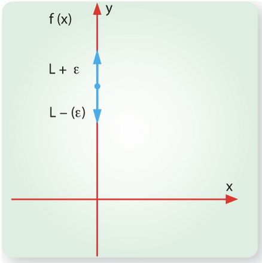

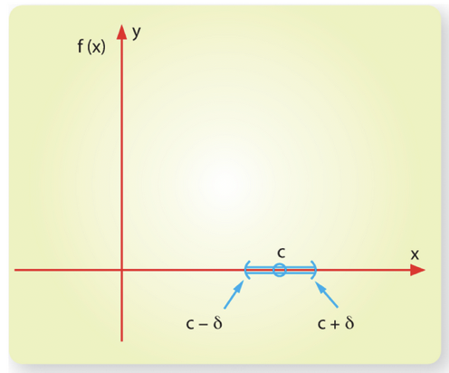

:::

Para una función $f$ definida en todo punto de un intervalo abierto $I$ que contiene a $c$, con la posible excepción de $c$.

El $\lim_{x \to c} f(x) = L$ si para cualquier $\epsilon > 0$, no importa qué tan pequeña sea, existe una $\delta > 0$ tal que $|f(x) - L| < \epsilon$ siempre que $0 < |x - c| < \delta$, es decir,

$$0 < |x - c| < \delta \quad \Rightarrow \quad |f(x) - L| < \epsilon.$$

En esta definición de límite se establece que los valores de la función $f(x)$ se aproximan a un límite $L$ cuando $x$ se aproxima a un número $c$, de tal manera que el valor absoluto de la diferencia entre $f(x)$ y $L$ se hace tan pequeña como se quiera tomando valores de $x$ muy próximos a $c$ pero no iguales a $c$.
:::

:::


## Ejemplo de la propiedad $\epsilon-\delta$

<div class="example"> **Ejemplo**


Si $f(x)=\dfrac{1}{x}$, dado un punto $c>0$, tenemos para $x>0$, 
$$
\left|\dfrac{1}{x} -\dfrac{1}{c}\right|= \left|\dfrac{1}{cx}(c-x)\right| = \dfrac{1}{cx}|c-x|
$$
Ahora, si $x$ es tal que $|x-c| <\dfrac{1}{2}c$, de tal manera que $\dfrac{c}{2}<x<\dfrac{3c}{2}$, por lo que $0 < \dfrac{1}{cx} <  \dfrac{2}{c^2} \quad \text{ para } |x-c|< \dfrac{1}{2}c$.
Por lo tanto, para estos valores de $x$ tenemos que
$$
\left|\dfrac{1}{x} -\dfrac{1}{c}\right| \leq \dfrac{2}{c^2} |x-c|.
$$


Ahora, dado un $\epsilon >0$ bastará tomar $\delta = \min \left\{\dfrac{1}{2}c, \dfrac{1}{2}c^2 \epsilon \right\}$ para tener asegurado que si $|x -c|<\delta$, entonces $\left|\dfrac{1}{x} -\dfrac{1}{c}\right| < \epsilon$.

</div>

## Ejemplos  {.scrollable}

::: columns

::: {.column width="60%"}
1. Sea la función $f$ definida por $f(x) = 3x + 2$. Si $\lim_{x\to 2} f(x) = 8$ hallar una $\delta$ para:
   $$\varepsilon = 0.01 \text{ tal que } |f(x) - 8| < 0.01 \text{ siempre que } 0 < |x - 2| < \delta.$$

**Solución:**

**Análisis preliminar.** Para $\varepsilon = 0.01$ se debe encontrar una $\delta > 0$ tal que:
$$0 < |x - 2| < \delta \implies |f(x) - 8| < \varepsilon$$

Considerando la desigualdad de la derecha se tiene:
$$
\begin{align*}
|(3x + 2) - 8| < \varepsilon &\iff |3x - 6| < \varepsilon \\
&\iff |3(x - 2)| < \varepsilon \\
&\iff 3|x - 2| < \varepsilon \\
&\iff |x - 2| < \frac{\varepsilon}{3}
\end{align*}
$$

Como se quiere que $3|x - 2| < \varepsilon$ siempre que $0 < |x - 2| < \delta$ entonces conviene elegir:
$$\delta = \frac{\varepsilon}{3}$$

Es decir:
$$3\delta = \varepsilon$$
:::
::: {.column width="40%"}


:::

:::


## **Prueba formal:**

Sea $\varepsilon = 0.01$. Elegir $\delta = \frac{\varepsilon}{3}$. Entonces $0 < |x - 2| < \delta$ implica que:
$$
\begin{align*}
|(3x + 2) - 8| &= |3x - 6| \\
&= |3(x - 2)| \\
&= 3|x - 2| \\
&< 3\delta \\
&= \varepsilon
\end{align*}
$$

Por tanto:
$$|(3x + 2) - 8| < 0.01$$

En este ejemplo el problema ha consistido en encontrar una $\delta$ para una $\varepsilon$ establecida. Si para cualquier $\varepsilon$ se encuentra una $\delta$ correspondiente entonces se habrá demostrado que el límite es $8$.


## Ejemplo 1 Enunciado

Sea la función $f: \mathfrak{R} \to \mathfrak{R}$ dada por $f(x) = -\frac{1}{2}x+3$. Demostrar que $\lim_{x \to 2} f(x)=2$.

## Solución {.scrollable}

::: {.bg style="background-color:none; font-size: 0.7em"}

Sea la función $f: \mathfrak{R} \to \mathfrak{R}$ dada por $f(x) = -\frac{1}{2}x+3$. Demostrar que $\lim_{x \to 2} f(x)=2$.

### Demostración 

Sea $\epsilon>0$, buscamos un $\delta>0$ tal que si $0 < |x-2| < \delta$, entonces $|f(x) - 2| < \epsilon$.

Comenzamos con la expresión $|f(x) - L|$:

$$
\left| f(x) - 2 \right| = \left| \left(-\frac{1}{2}x+3\right) - 2 \right|
$$

$$
= \left| -\frac{1}{2}x+1 \right|
$$

Factorizamos el término $-1/2$ para aislar la expresión $(x-2)$:

$$
= \left| -\frac{1}{2}(x-2) \right|
$$

$$
= \left| -\frac{1}{2} \right| |x-2|
$$

$$
= \frac{1}{2}|x-2|
$$

Ahora, para que esta expresión sea menor que $\epsilon$, establecemos:

$$
\frac{1}{2}|x-2| < \epsilon
$$

$$
|x-2| < 2 \epsilon
$$

Por lo tanto, elegimos $\delta = 2\epsilon$. Con esta elección de $\delta$, si $0 < |x-2| < \delta$, entonces:

$$
\left| f(x) - 2 \right| = \frac{1}{2}|x-2| < \frac{1}{2}\delta = \frac{1}{2}(2\epsilon) = \epsilon
$$

Hemos demostrado que para cualquier $\epsilon>0$, existe un $\delta=2\epsilon$ tal que si $0<|x-2|< \delta$, entonces $|f(x)-2|< \epsilon$.

Por lo tanto, $\lim_{x \to 2} f(x)=2$.
:::

## Ejemplo 2 Enunciado

Demostrar que $\lim_{x \to 4} \left( -\frac{1}{2}x+3 \right) = 1$.

## Solucion {.scrollable}

### Ejemplo 2 Demostración del Límite de $f(x) = -\frac{1}{2}x + 3$

::: {.bg style="background-color:none; font-size: 0.7em"}
Demostrar que $\lim_{x \to 4} \left( -\frac{1}{2}x+3 \right) = 1$.

### Demostración

Sea $\epsilon > 0$, debemos encontrar un $\delta > 0$ tal que si $0 < |x-4| < \delta$, entonces $|f(x) - 1| < \epsilon$.

Comenzamos con la expresión $|f(x) - L|$:

$$
\left| \left(-\frac{1}{2}x+3\right) - 1 \right| = \left| -\frac{1}{2}x+2 \right|
$$

Factorizamos el término $-1/2$ para obtener la expresión $(x-4)$:

$$
= \left| -\frac{1}{2}(x-4) \right|
$$

$$
= \left| -\frac{1}{2} \right| |x-4|
$$

$$
= \frac{1}{2}|x-4|
$$

Para que la expresión final sea menor que $\epsilon$, establecemos:

$$
\frac{1}{2}|x-4| < \epsilon
$$

Despejando $|x-4|$, obtenemos:

$$
|x-4| < 2\epsilon
$$

Por lo tanto, elegimos $\delta = 2\epsilon$.

Con esta elección de $\delta$, si $0 < |x-4| < \delta$, entonces:

$$
\left| f(x) - 1 \right| = \frac{1}{2}|x-4| < \frac{1}{2}\delta = \frac{1}{2}(2\epsilon) = \epsilon
$$

Hemos demostrado que para cualquier $\epsilon > 0$, existe un $\delta = 2\epsilon$ tal que si $0 < |x-4| < \\delta$, entonces $|f(x) - 1| < \epsilon$.

Por lo tanto, $\lim_{x \\to 4} \left( -\frac{1}{2}x+3 \right) = 1$.
:::


##  Ejemplo de la propiedad $\epsilon-\delta$

<div class="example"> **Ejemplo**

Veamos que $\displaystyle{\lim_{x \rightarrow 2} \dfrac{x^3-4}{x^2+1}= \dfrac{4}{5}}$
$$
\left|\dfrac{x^3-4}{x^2+1} -  \dfrac{4}{5}\right|= \left|\dfrac{5x^3-20-4x^2-4}{5(x^2+1)}\right| = \dfrac{|5x^2+6x+12|}{5(x^2+1)}|x-2|
$$
Ahora, si $|x-2|<1$, o equivalentemente, si $0<x<3$, tendremos que $\dfrac{|5x^2+6x+12|}{5(x^2+1)} \leq \dfrac{15}{2}$, puesto que el numerador es menor o igual que $15$ y el numerador mayor o igual que $2$. 

Si para un $\epsilon >0$ tomamos $\delta = \min \left\{1, \dfrac{2}{15} \epsilon \right\}$, tendremos que si $|x-2| < \delta$, entonces 
$$
\left|\dfrac{x^3-4}{x^2+1} -  \dfrac{4}{5}\right| < \epsilon
$$

</div>

## Sobre la propiedad $\epsilon-\delta$

<l class="observ"> **Observaciones** </l>

**1.** La propiedad $\epsilon -\delta$, significa que dada una precisión cualquiera, $\epsilon$, para el resultado, $L$, podemos determinar la precisión, $\delta$, con la que hay que tomar la aproximación, $x$ de $c$, para tener asegurada la precisión requerida para $L$.

**2.** Los ejemplos anteriores muestran que $\delta$ puede depender de $\epsilon$ y del punto $c$, por lo que sería más apropiado escribir $\delta(\epsilon,c)$, lo que no se acostumbra a hacer para evitar complicar la notación en exceso, lo cual no es óbice para olvidar esta dependencia.

**3.** Los ejemplos anteriores también pueden producir la impresión, equivocada, que es más conveniente usar la primera definición de límite que la propiedad $\epsilon-\delta$, pero veremos que, en ocasiones, resulta más conveniente esta última que la primera.

## La propiedad $\epsilon-\delta$

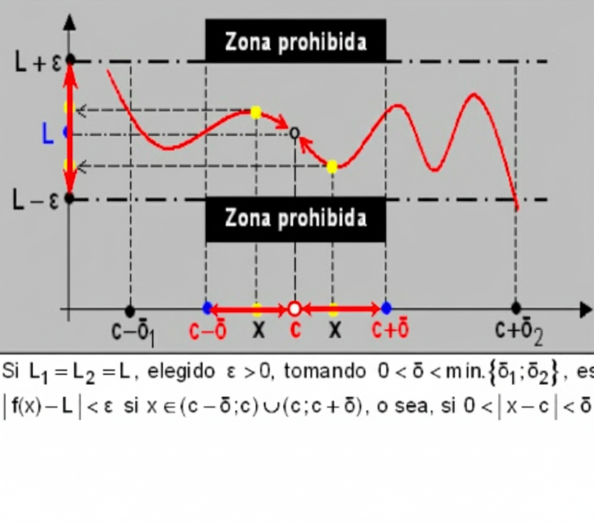
<div class="center">
```{r, echo=FALSE, label=edelta,fig.cap="",out.width = "600px"}
knitr::include_graphics("Images/epdel0.png",dpi=1200)
```
</div>

## Propiedades del límite de una función

<l class="definition"> **Definición** </l>

Sea $f:A \subset \mathbb{R} \rightarrow \mathbb{R}$ y $c$ un punto de acumulación de $A$. $f$ **está acotada en un entorno de $c$**, $V_{\delta}(c)$, si existe una constante $M \in \mathbb{R}$ tal que $|f(x)| \leq M$ para todo $x \in A \cap V_{\delta}(c)$.

<l class="prop"> **Proposición**

Sea $f:A \subset \mathbb{R} \rightarrow \mathbb{R}$ y $c$ un punto de acumulación de $A$. Si $\lim _{x \rightarrow c} f(x) =L$, entonces $f$ está acotada en un entorno de $c$.

<div class="dem"> **Demostración**

Dado $\epsilon=1>0$, existe $\delta$ tal que $|f(x)|-|L| \leq |f(x)-L|<1$, para todo $x \in A \cap V_{\delta}(c)$. Por consiguiente si $M= |L|+1$, es $|f(x)| < |L|+1 = M$.

</div>

## Propiedades del límite de una función

<l class="definition"> **Definición** </l>

Sean $f,g:A \subset \mathbb{R} \rightarrow \mathbb{R}$ dos funciones reales de variable real. Entonces

1) $f+g: A \subset \mathbb{R} \rightarrow \mathbb{R}$ es la función definida por $(f+g)(x) = f(x)+g(x)$

2)  $f \cdot g: A \subset \mathbb{R} \rightarrow \mathbb{R}$ es la función definida por $(f\cdot g)(x) = f(x) \cdot g(x)$

3) Si $g(x)\neq 0$ en un $A$, entonces $\dfrac{1}{g}:A \subset \mathbb{R} \rightarrow \mathbb{R}$ es la función definida por $\dfrac{1}{g}(x)= \dfrac{1}{g(x)}$

4) Si $\lambda \in \mathbb{R}$, entonces $\lambda \cdot f: A \subset \mathbb{R} \rightarrow \mathbb{R}$ es la función definida por $(\lambda \cdot f)(x)= \lambda \cdot f(x)$.


## Propiedades del límite de una función


<l class="prop"> **Proposición** </l>

Sean $f,g:A \subset \mathbb{R} \rightarrow \mathbb{R}$ dos funciones reales de variable real y $c$ un punto de acumulación de $A$, tales que $\displaystyle{\lim_{x \rightarrow c} f(x) = L_1}$ y $\displaystyle{\lim_{x \rightarrow c} g(x)= L_2}$. Entonces

P1. $\displaystyle{\lim_{x \rightarrow c}(f+g)(x) = L_1+L_2}$.

P2. $\displaystyle{\lim_{x \rightarrow c}(f \cdot g)(x) = L_1 \cdot L_2}$.

P3. $\displaystyle{\lim_{x \rightarrow c} (\lambda \cdot f)(x) = \lambda \cdot L_1}$.

P4. Si $L_2 \neq 0$, entonces $\displaystyle{\lim_{x \rightarrow c} \dfrac{f(x)}{g(x)} = \dfrac{L_1}{L_2}}$.

## Propiedades del límite de una función

<div class="dem"> **Demostración**

P1, P2 y P3 son una consecuencia inmediata de la definción de límite de una función. En el caso de P1, por ejemplo, tenemos que si $x_n \rightarrow c$ entonces $f(x_n) \rightarrow L_1$ y $g(x_n) \rightarrow L_2$, por lo tanto, 

$$
\lim_{x \rightarrow c}(f+g)(x)= \lim_{n  \rightarrow \infty} (f+g)(x_n)= \lim_{n  \rightarrow \infty} \left( f(x_n)+g(x_n) \right)
$$

$$=  \lim_{n  \rightarrow \infty} f(x_n) + \lim_{n  \rightarrow \infty} g(x_n) = L_1+L_2 = \lim_{x \rightarrow c} f(x) + \lim_{x \rightarrow c} g(x) 
$$


Por lo que se refiere a P4, tenemos que si $L_2 \neq 0$, entonces hemos demostrado, en el tema de límite de sucesiones, que para toda sucesión $x_n$ de puntos de $A$ tal que $g(x_n) \rightarrow L_2$, existe $n_0$ tal $g(x_n) \neq 0$ para todo $n \geq n_0$ y, además, $\lim_{n \rightarrow \infty}\dfrac{1}{g(x_n)} = \dfrac{1}{L_2}$ y, por lo tanto,
$$
\lim_{x \rightarrow c} \dfrac{f(x)}{g(x)} = \dfrac{L_1}{L_2}.
$$

</div>

## Propiedades del límite de una función

<l class="prop"> **Proposición** </l>

Si para todo $x \in A$ es $a \leq f(x) \leq b$, entonces $\displaystyle{a \leq \lim_{x \rightarrow c} f(x) \leq b}$

<l class="prop"> **Proposición** </l>

Sean $f,g,h :A\subset \mathbb{R} \rightarrow \mathbb{R}$, tales que $h(x) \leq f(x) \leq g(x)$, para todo $x \in A$, y

que $\displaystyle{\lim_{x \rightarrow c} g(x) =  \lim_{x \rightarrow c} h(x) = L}$, entonces  
$$
\lim_{x \rightarrow c} f(x) = L.
$$

## Propiedades del límite de una función

<l class="prop"> **Proposición** </l>

Sean $f:A \subset \mathbb{R} \rightarrow \mathbb{R}$ y $c$ un punto de acumulación de $A$. Si $\lim _{x \rightarrow c} f(x) = L>0$, entonces existe $\delta > 0$ tal que $f(x)>0$ para todo $x \in V^*_{\delta}(c) \cap A$.

Análogamente, si $\lim _{x \rightarrow c} f(x) = L <0$, entonces existe $\delta > 0$ tal que $f(x)<0$ para todo $x \in V^*_{\delta}(c) \cap A$.

<div class="dem"> **Demostración**

Supongamos, en primer lugar que $L>0$. Sea $\epsilon = \dfrac{L}{2} > 0$, entonces, por ser $L= \lim _{x \rightarrow c} f(x)$, existe $\delta >0$ tal que $|f(x)-L|<\dfrac{L}{2}= \epsilon$, por lo tanto, tenemos que $-\dfrac{L}{2} < f(x) - L < \dfrac{L}{2}$ y por lo tanto, es $0 <\dfrac{L}{2} < f(x)$. 

La demostración para el caso $L<0$ es completamente similar y se deja como ejercicio.

</div>

## Límites laterales


La función $f:\mathbb{R} \setminus \{0\} \rightarrow \mathbb{R}$, $f(x) = \dfrac{x}{|x|}$, no està definida en el punto ${0}$, de hecho, se trata de la función
$$ 
f(x) =
\begin{cases}
\;\;   1, & \mbox { si } x>0 \\
-1, & \mbox { si } x<0
\end{cases}
$$
conocida como la función *signo* de $x$, que se acostumbra a indicar por $\text{sgn}(x)$

$0$ es un punto de acumulación del dominio de $f$, pero no existe el $\displaystyle{\lim_{x \rightarrow 0} \text{sgn}(x)}$

## Límites laterales

No existe el $\displaystyle{\lim_{x \rightarrow 0}\text{sgn}(x)}$. 

En efecto, consideremos la sucesión de término general $x_n = \dfrac{(-1)^n}{n}$, entonces es $\text{sgn}(x_{2k})= 1$ en tanto que $\text{sgn}(x_{2k+1})=-1$, para todo $k \in \mathbb{N}$, es decir que la sucesión de término general $\text{sgn}(x_n)$ tiene dos subsucesiones con límite diferente y, por lo tanto, $\text{sgn}(x_n)$ no tiene límite. 

En definitiva no existe el $\displaystyle{\lim_{x \rightarrow 0}\text{sgn}(x)}$.


## Límites laterales: gráfica de la función $\text{sgn}(x)$

<div class="center">
```{r, echo=FALSE, label=sgn1,fig.cap="",out.width = "600px"}
knitr::include_graphics("Images/sgn1.png",dpi=1200)
```
</div>

## Límites laterales

<l class="definition"> **Definición de límite lateral** </l>

1) Sea $f: A \subset \mathbb{R} \rightarrow \mathbb{R}$ una función real de variable real y sea $c$ un punto de acumulación de $A$. $L \in \mathbb{R}$ es el **límite lateral por la derecha** de $f$ en $c$, si para toda sucesión $x_n$ tal que $x_n \rightarrow c$ con $x_n \geq c$, es $f(x_n)\rightarrow L$. Escribiremos 
$$
L = \lim_{x \rightarrow c^+}f(x).
$$


2) Análogamente, $L \in \mathbb{R}$ es el **límite lateral por la izquierda** de $f$ en $c$, si para toda sucesión $x_n$ tal que $x_n \rightarrow c$ con $x_n \leq c$, es $f(x_n)\rightarrow L$. Escribiremos 
$$
L = \lim_{x \rightarrow c^-}f(x).
$$


## Límites laterales 

<div class="example"> **Ejemplos**

1) En el caso de la función *signo*, $\text{sgn}(x) = \dfrac{x}{|x|}$, hemos visto que  $\lim_{x \rightarrow 0^+}\text{sgn}(x) = 1$ y  $\lim_{x \rightarrow 0^-} \text{sgn}(x) = -1$.

2) Sea $g:\mathbb{R} \rightarrow \mathbb{R}$, la función definida por
$$
g(x)=
\begin{cases}
x+1, & \mbox{ si } x \leq 0, \\
x^2, & \mbox{ si } x > 0.
\end{cases}
$$
Entonces $\lim_{x \rightarrow 0^-} g(x) = 1$ y $\lim_{x \rightarrow 0^+} g(x) = 0$.

3) Sea $h:\mathbb{R} \rightarrow \mathbb{R}$, la función definida por
$$
h(x)=
\begin{cases}
x+1, & \mbox{ si } x \leq 0, \\
x^2+1, & \mbox{ si } x > 0. 
\end{cases}
$$
Entonces $\lim_{x \rightarrow 0^+} h(x) = 1$ y $\lim_{x \rightarrow 0^-} h(x) = 1$ y, como veremos a continuación, existe el $\lim_{x \rightarrow 0} h(x)$ y es igual a $1$.

</div>

## Gráfica de la función g 

<div class="center">
```{r, echo=FALSE, label=gx,fig.cap="",out.width = "600px"}
knitr::include_graphics("Images/gx.png",dpi=1200)
```
</div>

## Gráfica de la función h 

<div class="center">
```{r, echo=FALSE, label=hx,fig.cap="",out.width = "600px"}
knitr::include_graphics("Images/hx.png",dpi=1200)
```
</div>

## Límites laterales

<div class="exercise"> **Ejercicios**

En lo que sigue,  $f: A \subset \mathbb{R} \rightarrow \mathbb{R}$ es una función real de variable real y $c$ es un punto de acumulación de $A$.

1. Demuestra que $L = \lim_{x \rightarrow c^+}f(x)$ si, y sólo si, para todo $\epsilon >0$, existe $\delta >0$ tal que, siempre que $0<x-c<\delta$, entonces es $|f(x)-L| < \epsilon$. 

2. Demuestra que   $L = \lim_{x \rightarrow c^-}f(x)$ si, y sólo si, para todo $\epsilon >0$, existe $\delta >0$ tal que, siempre que $0<c-x<\delta$, entonces es $|f(x)-L| < \epsilon$.

3. Demuestra que  $L = \lim_{x \rightarrow c^+}f(x)$ si, y sólo si, para todo $\epsilon >0$, existe $\delta >0$ tal que si $x \in V^*_{\delta} (c) \cap (c, +\infty)$, entonces $f(x) \in V_{\epsilon}(L)$

4. Demuestra que  $L = \lim_{x \rightarrow c^-}f(x)$ si, y sólo si, para todo $\epsilon >0$, existe $\delta >0$ tal que si $x \in V^*_{\delta} (c) \cap (-\infty, c)$, entonces $f(x) \in V_{\epsilon}(L)$.

</div>


## Límites laterales

<l class="prop"> **Proposición** </l>

Sea $f: A \subset \mathbb{R} \rightarrow \mathbb{R}$ y sea $c$ un punto de acumulación de $A$. Entonces existe el $\displaystyle{\lim_{x \rightarrow c}f(x)}$ si, y sólo si, los dos límites laterales $\displaystyle{\lim_{x \rightarrow c^+}f(x)}$ y $\displaystyle{\lim_{x \rightarrow c^-}f(x)}$
existen y son iguales.

## Límites laterales

<div class="dem"> **Demostración**

Si $\lim_{x \rightarrow c}f(x) = L$, entonces para toda sucesión $x_n$ tal que $x_n \rightarrow c$ es $f(x_n) \rightarrow L$. Ahora, si $x_n \rightarrow c$ y $x_n > c$ será igualmente $f(x_n) \rightarrow L$. Análogamente si $x_n <c$.

Supongamos ahora que los dos límites laterales existen y son iguales a $L$. Sea $x_n$ tal que $x_n \rightarrow c$, entonces tres casos són posibles:

1) todos los $x_n$ a partir de un lugar son tales que $x_n \geq c$, 

2) todos los $x_n$ a partir de un lugar son tales que $x_n \leq c$, y 

3) existen infinitos $x_{n_k}$ tales que $x_{n_k} \geq c$ e infinitos $x_{n_j}$ tales que $x_{n_j} \leq c$, claramente $\{x_n\}= \{ x_{n_k}\} \cup \{x_{n_j}\}$.

En todos los casos es $f(x_n) \rightarrow L$, en el primero por ser $\lim_{x \rightarrow c^+}f(x)$ y en el segundo por ser  $\lim_{x \rightarrow c^-}f(x)$. El el tercer caso tendríamos dos subsucesiones $f(x_{n_k})$ y $f(x_{n_j})$ con el mismo límite L y, por lo tanto es $f(x_n) \rightarrow L$, dado que $\{x_n\}= \{ x_{n_k}\} \cup \{x_{n_j}\}$. En definitiva es  $\lim_{x \rightarrow c}f(x) = L$.

</div>

## Limites infinitos

<l class="definition"> **Definición** </l>

Sean $f: A \subset \mathbb{R} \rightarrow \mathbb{R}$ y $c$ un punto de acumulación de $A$,

1. Diremos que $\lim_{x \rightarrow c}f(x) = +\infty$, si para cada $K >0$ existe un $\delta > 0$ tal que si $x \in V^*_{\delta}(c)$ entonces es $f(x)>K$.

2. Diremos que $\lim_{x \rightarrow c}f(x) = - \infty$, si para cada $K >0$ existe un $\delta > 0$ tal que si $x \in V^*_{\delta}(c)$ entonces es $f(x)< -K$

<div class="exercise"> **Ejercicio** 

Las definiciones anteriores también se pueden formular en términos de sucesiones así, por ejemplo, se pide comprobar que la primera definición es equivalente a

$\lim_{x \rightarrow c}f(x) = +\infty$ si, y sólo si, para toda sucesión $x_n$ tal que $x_n \rightarrow c$ es $f(x_n) \rightarrow \infty$. 

</div>

## Limites infinitos: Ejemplos.

<div class="example"> **Ejemplo**

$\displaystyle{\lim_{x \rightarrow 0} \dfrac{1}{x^2} = \infty}$, puesto que si $x_n \rightarrow 0$ entonces para todo $K>0$ existe $n_0$ tal que para todo $n > n_0$ es $|x_n| < \dfrac{1}{\sqrt{K}}$ y, por lo tanto $|f(x_n)|=\dfrac{1}{x_n^2}>K$.

</div>

<div class="center">

```{r, echo=FALSE, label=inversax2,fig.cap="",out.width = "500px"}
knitr::include_graphics("Images/inversax2.png",dpi=1200)
```
</div>

## Límites en el infinito

El ejemplo anterior también sirve para justificar la siguiente definición:

<l class="definition"> **Definición** </l>

Sean $f: \mathbb{R} \rightarrow \mathbb{R}$ y $L \in \mathbb{R}$, $L = \lim_{x \rightarrow \infty}f(x)$ si para toda sucesión $x_n$ tal que $\lim_{n \rightarrow \infty}x_n= +\infty$ entonces $\lim_{n \rightarrow +\infty} f(x_n)= L$.

Análogamente, $L = \lim_{x \rightarrow -\infty}f(x)$ si para toda sucesión $x_n$ tal que $\lim_{n \rightarrow \infty}x_n= -\infty$ entonces $\lim_{n \rightarrow \infty} f(x_n)= L$.

<div class="exercise"> **Ejercicios**

1) Demuestra que $L = \lim_{x \rightarrow +\infty}f(x)$ si, sólo sí, para todo $\epsilon >0$ existe $K>0$ tal que si $x>K$ entonces $|f(x)-L|<\epsilon$.

2) Demuestra que $L = \lim_{x \rightarrow -\infty}f(x)$ si, sólo sí, para todo $\epsilon >0$ existe $K>0$ tal que si $x<-K$ entonces $|f(x)-L|<\epsilon$.

</div>

## Limites en el infinito

<div class="example"> **Ejemplos**

1) $\displaystyle{\lim_{x \rightarrow +\infty} \dfrac{1}{x^2} = 0}$, puesto que dado un $\epsilon >0$ para $K=\dfrac{1}{\sqrt{\epsilon}}$ es $f(x)= \dfrac{1}{x^2} < \epsilon$ siempre que $x >K$.

2) Anàlogamente $\lim_{x \rightarrow -\infty} \dfrac{1}{x^2} = 0$, puesto que dado un $\epsilon >0$ para $K=\dfrac{1}{\sqrt{\epsilon}}$ es $f(x)= \dfrac{1}{x^2} < \epsilon$ siempre que $x <-K$.

3) La función $h(x) = \dfrac{1}{x}$, proporciona un interesante ejemplo de que también tienen sentido los límites laterales para los límites infinitos, puesto que como es fácil comprobar $\lim_{x \rightarrow 0^+} h(x) = +\infty$ en tanto que $\lim_{x \rightarrow 0^-} h(x) = -\infty$. 

4) También es fácil comprobar que $\lim_{x \rightarrow -\infty} \dfrac{1}{x} =0 = \lim_{x \rightarrow +\infty}  \dfrac{1}{x}.$

</div>

## Límites en el infinito: Gráfica de la función $\frac{1}{x}$

<div class="center">

```{r, echo=FALSE, label=inversx,fig.cap="",out.width = "600px"}
knitr::include_graphics("Images/inversx.png",dpi=1200)
```
</div>

# Cálculo de límites

## Cálculo de límites

Dada la definición de límite de una función en un punto que hemos hecho, vinculada a la de límite de sucesiones, no debería sorprendernos que una buena parte de las técnicas exploradas para el cálculo de límites de sucesiones sean también de aplicación para el cálculo de límite de funciones.

Así, por ejemplo $\lim_{x \rightarrow 0}(1+x)^{\frac{1}{x}} = e$, puesto que, como hemos visto en el tema anterior, dada una sucesión $a_n$ tal que $a_n \rightarrow 0$, es $\lim (1+a_n)^{\frac{1}{a_n}}=e$, como esta igualdad es cierta para cualquier sucesión que tenga límite $0$, es $\lim_{x \rightarrow 0}(1+x)^{\frac{1}{x}} =e$.

Aparecen algunas técnicas nuevas, como las relacionadas con la consideración de límites laterales o la de los infinitésimos equivalentes, y algunas dejan de tener sentido, como por ejemplo, las que involucran el criterio de Stoltz.

## Cálculo de límites

<div class="example"> **Ejemplo 1**

Calcula el $\lim_{x \rightarrow 0}\dfrac{\sqrt{1+2x} - \sqrt{1+3x}}{x+2x^2}$.

En primer lugar, la función està definida para todos los puntos $x \geq -\frac{1}{3}$, menos el punto $x=0$. Por lo tanto $0$ es un punto de acumulación del dominio y tiene sentido considerar el límite de la función en ese punto.

En segundo lugar, se trata de una indeterminación del tipo $\frac{0}{0}$, en estos casos que involucran sumas o diferencias de raíces cuadradas, es conveniente intentar resolver la indeterminación multiplicando y dividiendo por el conjugado:
$$
\lim_{x \rightarrow 0}\dfrac{\sqrt{1+2x} - \sqrt{1+3x}}{x+2x^2} = \lim_{x \rightarrow 0}\dfrac{(\sqrt{1+2x} - \sqrt{1+3x})(\sqrt{1+2x} + \sqrt{1+3x})}{(x+2x^2)(\sqrt{1+2x} + \sqrt{1+3x})}
$$
$$
= \lim_{x \rightarrow 0}\dfrac{1+2x - (1+3x)}{x(1+2x)(\sqrt{1+2x} + \sqrt{1+3x})} = \lim_{x \rightarrow 0}\dfrac{-x}{x(1+2x)(\sqrt{1+2x} + \sqrt{1+3x})}=-\dfrac{1}{2}
$$

Este resultado se puede comprobar con `Wolfram Alpha` en este enlace: [](https://www.wolframalpha.com/input/?i=lim+%28sqrt%281%2B2x%29-sqrt%281%2B3x%29%29%2F%28x%2B2x%5E2%29+as+x+tends+to+0)
</div>


## Cálculo de límites

<div class="example">
La gráfica de la función corrobora el resultado obtenido:

<div class="center">

```{r, echo=FALSE, label=limit1,fig.cap="",out.width = "600px"}
knitr::include_graphics("Images/limit1.png",dpi=1200)
```
</div>
</div>

## Cálculo de límites

<div class="example"> **Ejemplo 2**

Demuestra que no existe el $\lim_{x \rightarrow 0}  \cos \dfrac{1}{x}$ y que $\lim_{x \rightarrow 0} x \cos \dfrac{1}{x}=0$

Para ver que no existe el primer límite es suficiente considerar las dos sucesiones $\dfrac{1}{2n\pi}$ y $\dfrac{1}{2n\pi + \frac{\pi}{2}}$, ambas tienden a $0$, sin embargo $\cos (2n \pi) \rightarrow 1$ en tanto que $\cos (2n\pi + \frac{\pi}{2}) \rightarrow 0$.

En el segundo límite, se trata de una función que tiene límite $0$ multiplicada por otra que está acotada, ya que $\left|\cos \dfrac{1}{x}\right| \leq 1$, por lo tanto $\lim_{x \rightarrow 0} x \cos \dfrac{1}{x}=0$

</div>

## Cálculo de límites

Gráficas de la funciones $f(x)=\cos \frac{1}{x}$ y $g(x)=x \cos \frac{1}{x}$, respectivamente:

<div class="center">

```{r, echo=FALSE, label=limit12_3,fig.cap=" ",out.width = "900px"}
knitr::include_graphics("Images/limit2_3.png",dpi=1200)
```
</div>

## Cálculo de límites

<div class="example"> **Ejemplo 3**

Calcula el $\lim_{x \rightarrow 1} \dfrac{\sqrt{x} -1}{x-1}$.

Se trata de una indeterminación del tipo $\dfrac{0}{0}$. En este caso el cambio de variable $x = t^2$ puede ser útil, dado que 
$$
\lim_{x \rightarrow 1} \dfrac{\sqrt{x} -1}{x-1} = \lim_{t \rightarrow 1}\dfrac{t-1}{t^2-1}=\lim_{t \rightarrow 1}\dfrac{t-1}{(t-1)(t+1)} =\lim_{t \rightarrow 1}\dfrac{1}{t+1} = \dfrac{1}{2}
$$
Este resultado se puede comprobar con `Wolfram Alpha` en este enlace: [](https://www.wolframalpha.com/input/?i=lim%20%28sqrt%28x%29-1%29%2F%28x-1%29%20as%20x-%3E1)
</div>
<div class="center">

```{r, echo=FALSE, label=limit3,fig.cap="",out.width = "250px"}
knitr::include_graphics("Images/limit3.png",dpi=1200)
```
</div>

## Cálculo de límites {.scrollable}

¡Claro! Con gusto te explico este ejercicio de límites paso a paso.

El ejercicio que quieres resolver es el siguiente límite:

$$\lim_{x\to0} \left(\frac{1-x}{1+x}\right)^{\frac{1}{x}}$$

Este es un límite indeterminado de la forma $1^\infty$. Para resolverlo, se usa una propiedad especial de los límites relacionada con el número $e$.


Paso 1: Convertir la forma indeterminada

La propiedad que se aplica aquí es:

$$\lim_{f(x)\to\infty} \left(1 + \frac{1}{f(x)}\right)^{f(x)} = e$$

Para usarla, necesitamos que nuestra expresión se parezca a la de la propiedad, lo que no sucede directamente. Por eso, el ejercicio introduce un cambio de variable.


 Paso 2: Realizar un cambio de variable

Se introduce la variable $t = \frac{1}{x}$.

* Si $x \to 0^+$, entonces $t \to \infty$.
* Si $x \to 0^-$, entonces $t \to -\infty$.

Al hacer este cambio, el límite se reescribe de la siguiente manera:

$$\lim_{t\to\infty} \left(\frac{1-\frac{1}{t}}{1+\frac{1}{t}}\right)^t = \lim_{t\to\infty} \left(\frac{\frac{t-1}{t}}{\frac{t+1}{t}}\right)^t = \lim_{t\to\infty} \left(\frac{t-1}{t+1}\right)^t$$

Esta es la primera igualdad en tu ejercicio.


 Paso 3: Manipular la expresión para usar la propiedad de $e$

El siguiente paso es transformar la fracción $\frac{t-1}{t+1}$ para que se parezca a la forma $(1 + \frac{1}{f(t)})$.

Para lograrlo, se puede dividir el numerador y el denominador por $t+1$:

$$\frac{t-1}{t+1} = \frac{(t+1)-2}{t+1} = \frac{t+1}{t+1} - \frac{2}{t+1} = 1 - \frac{2}{t+1}$$

Ahora, reescribimos el límite con esta nueva expresión:

$$\lim_{t\to\infty} \left(1 - \frac{2}{t+1}\right)^t$$

Para que la forma coincida con la de la propiedad de $e$, necesitamos que el exponente sea el recíproco de la expresión dentro del paréntesis. Es decir, necesitamos un exponente de $-\frac{t+1}{2}$.

$$\lim_{t\to\infty} \left[\left(1 - \frac{2}{t+1}\right)^{-\frac{t+1}{2}}\right]^{-\frac{2t}{t+1}}$$

La parte dentro del corchete tiende a $e$ cuando $t \to \infty$. Ahora, solo necesitamos calcular el límite del exponente.


 Paso 4: Calcular el límite del exponente

El límite del exponente es:

$$\lim_{t\to\infty} \frac{-2t}{t+1}$$

Para resolverlo, dividimos el numerador y el denominador por la variable de mayor grado ($t$):

$$\lim_{t\to\infty} \frac{-2}{\frac{t}{t}+\frac{1}{t}} = \lim_{t\to\infty} \frac{-2}{1+\frac{1}{t}}$$

Cuando $t \to \infty$, el término $\frac{1}{t}$ tiende a 0. Por lo tanto:

$$\frac{-2}{1+0} = -2$$


 Paso 5: Combinar los resultados

Ahora que tenemos el límite de la base ($e$) y el límite del exponente ($-2$), el resultado final es:

$$e^{-2}$$

Finalmente, la regla de los exponentes indica que $e^{-2}$ es lo mismo que $\frac{1}{e^2}$.

Algunos de estos pasos, como la manipulación de la expresión para que coincida con la propiedad de $e$, pero el resultado final es el mismo. El paso intermedio que se muestra en tu imagen ($e^{\lim_{t\to\infty} t(\frac{t-1}{t+1}-1)}$) es una forma alternativa de llegar al mismo resultado, usando la propiedad de que $\lim [f(x)]^{g(x)} = e^{\lim g(x)(f(x)-1)}$ para límites de tipo $1^\infty$. Ambas rutas te llevan a la misma solución.


## Cálculo de límites

<div class="example"> **Ejemplo 4**

Calcula el $\lim_{x \rightarrow a} \dfrac{x^2-(a+1)x+a}{x^3-a^3}$

Se trata de una indeterminación del tipo $\dfrac{0}{0}$. Dado que $a$ es una raíz de los dos polinomios, ambos son múltiplos de $x-a$, efectuando la división entera obtenemos que 
$$
x^2-(a+1)x+a = (x-1)(x-a) \quad \text{ y} \quad x^3-a^3= (x^2 +ax+a^2)(x-a).
$$
Por lo tanto 
$$
\lim_{x \rightarrow a} \dfrac{x^2-(a+1)x+a}{x^3-a^3} =\lim_{x \rightarrow a} \dfrac{(x-1)(x-a)}{(x^2 +ax+a^2)(x-a)} = \lim_{x \rightarrow a} \dfrac{x-1}{x^2 +ax+a^2} =\dfrac{a-1}{3a^2}
$$
Este resultado se puede comprobar con `Wolfram Alpha` en este enlace: [](https://www.wolframalpha.com/input/?i=lim%28x%5E2-%28a%2B1%29x%2Ba%29%2F%28x%5E3-a%5E3%29+as+x+tends+to+a)

</div>

## Cálculo de límites

<div class="example"> **Ejemplo 5**

Calcula $\lim_{x \rightarrow 0}\left(\dfrac{1-x}{1+x}\right)^{\dfrac{1}{x}}$

Se trata de una indeterminación del tipo $1^{\infty}$, con el cambio $x=\dfrac{1}{t}$, tenemos
$$
\lim_{x \rightarrow 0}\left(\dfrac{1-x}{1+x}\right)^{\frac{1}{x}} =\lim_{t \rightarrow \infty}\left(\dfrac{t-1}{t+1} \right)^t= e^{\lim_{t \rightarrow \infty}t \left(\frac{t-1}{t+1}-1\right)} = e^{-2}=\dfrac{1}{e^2}
$$

Este resultado se puede comprobar con `Wolfram Alpha` en este enlace: [](https://www.wolframalpha.com/input/?i=lim+%28%281-x%29%2F%281%2Bx%29%29%5E%281%2Fx%29+as+x+tends+to+0)

</div>


## Cálculo de límites

<div class="example"> **Ejemplo 6**

Calcula el $\displaystyle{\lim_{x \rightarrow 0}\dfrac{1}{x} \log \sqrt{\dfrac{1+x}{1-x}}}$

Se trata de una indeterminación del tipo $\dfrac{0}{0}$. 

Dado que  $\log \sqrt{\dfrac{1+x}{1-x}} = \dfrac{1}{2} (\log (1+x)- \log(1-x))$, tenemos que el límite a calcular es

$$
\lim_{x \rightarrow 0}\dfrac{1}{x} \log \sqrt{\dfrac{1+x}{1-x}} = \dfrac{1}{2} \log \lim_{x \rightarrow 0} \left(\dfrac{1+x}{1-x} \right)^{\dfrac{1}{x}}= \dfrac{1}{2} \log e^2 =1
$$

Este resultado se puede comprobar con `Wolfram Alpha` en este enlace: [](https://www.wolframalpha.com/input/?i=lim+%281%2Fx%29ln+%28sqrt%28+%28%281%2Bx%29%2F%281-x%29%29%29%29+as+x+tends+0)
</div>

# Continuidad {.my-slide}

## Introducción

Dada una función $f:A\subset \mathfrak{R} \rightarrow \mathfrak{R}$, si $x \in A$ es irracional cabe preguntarse cómo podemos evaluar $f(x)$. Dado que podemos aproximar $x$ por racionales tanto como queramos, sería conveniente poder determinar la precisión de esta aproximación una vez que conozcamos la precisión requerida para $f(x)$. 

Las funciones continuas son precisamente las funciones para las que, una vez fijada la precisión requerida a $f(x)$, es posible determinar la precisión de $x$, para tener asegurada la precisión requerida.

En lo que sigue, veremos que esta condición tiene consecuencias muy notables.

## Funciones continuas.

<l class="definition"> **Definición** </l>

Sean $f: A\subset \mathfrak{R} \rightarrow \mathbb{R}$ y $x_0 \in A$, **$f$ es continua en $x_0$** si para cada $\epsilon >0$ existe un $\delta >0$ tal que para todo $x \in A$ que verifique que $|x-x_0|<\delta$, entonces $|f(x)-f(x_0)|< \epsilon$.

Diremos que **$f$ es continua en $A$**, si es continua para todo $x \in A$.

Dicho de otra forma, **$f$ es continua en $x_0$** si, una vez fijada la precisión, $\epsilon$, que se requiere para $f(x_0)$, es posible determinar la precisión, $\delta$, que hay que exigir a $x_0$ para tener asegurada la precisión de $f(x_0)$.

La gráfica siguiente ilustra esta definición.


## Funciones continuas

<div class="center">
```{r, echo=FALSE, label=fcont,fig.cap="",out.width = "300px"}
knitr::include_graphics("Images/fcont.png",dpi=1200)
```
</div>

$\epsilon$ es la precisión con la queremos $f(x_0)$ y $\delta$ es la precisón para $x_0$. Es decir, $f(x_0) \in (f(x_0)-\epsilon,f(x_0)+\epsilon)$, siempre que $x_0 \in (x_0 -\delta, x_0 + \delta)$.

## CRITERIOS DE CONTINUIDAD
 
<div style="text-align: center; color: yellow; background-color: #2980b9; padding: 4px; border-radius: 5px; font-size: 1em; font-weight: bold;">
CRITERIOS DE CONTINUIDAD
</div>

<div style="background-color: #e0f7fa; padding: 4px; border-radius: 5px; margin-top: 15px;font-size:0.85em;">

<span style="color: blue; font-size:0.85em;font-weight: bold;">Recuerda:</span> La función $f: \mathfrak{R} \to \mathfrak{R}$ es <span style="color: red; font-weight: bold;">continua</span> en el punto $c \in \mathfrak{R}$ si el <span style="color: red; font-weight: bold;">límite</span> de "$f$" en "$c$" coincide con $f(c)$; o sea: eligiendo "$x$" <span style="color: red; font-weight: bold;">bastante próximo a "c"</span>, el valor absoluto de $f(x) - f(c)$, que es la <span style="color: magenta; font-weight: bold;">distancia</span> entre $f(x)$ y $f(c)$, llega a ser inferior a todo número positivo fijado de antemano .... y en términos geométricos significa que la <span style="color: red; font-weight: bold;">gráfica de "$f$" no está rota en "$c$"</span>.

<div style="color: #660099; font-size: 0.85em; font-weight: bold; text-align: center; margin: 10px 0;">
$\forall \epsilon > 0, \exists \delta > 0 \ / \ |f(x) - f(c)| < \epsilon \text{ si } x \in (c - \delta, c + \delta)$
</div>

</div>

<div style="background-color: none; padding: 4px; border-radius: 5px; margin-top: 15px;">

<p style="color: #004d40; font-size: 0.75em;">
Como tu objetivo es <span style="font-weight: bold; color: black;">ser eficiente representando curvas</span>, en unos pocos milisegundos debes ser capaz de determinar los puntos en que una función $f: \mathfrak{R} \to \mathfrak{R}$ <span style="font-weight: bold; color: red;">no es continua</span>: o sea, los puntos en que la gráfica de "$f$" está <span style="font-weight: bold; color: red;">rota</span>.
</p>

</div>

<div style="margin-top: 10px; background-color: #f0f0f0; padding: 10px;">

<div style="float: right; color: red; font-weight: bold; font-size: 0.85em; margin-top: -10px;">
LAS REGLAS SAGRADAS
</div>
  <ol style="font-size: 0.75em; font-weight: bold;">
    <li><span style="color: brown;">Prohibido</span> dividir por cero.</li>
    <li>El logaritmo de un número $\le 0$ no es real.</li>
    <li>Toda raíz de índice par de un número $< 0$ no es real.</li>
  </ol>
</div>

## CRITERIOS DE CONTINUIDAD


::: {.bg style="background-color: #f0f0f0; padding: 10px;"}

La noción de <span style="font-weight: bold;">continuidad</span> de "$f$" en el punto $c \in \mathfrak{R}$ nace al comparar $f(c)$ con el límite de "$f$" en "$c$"

:::


::: {.bg style="background-color: none; padding: 10px;text-align: center;"}

  <h1 style="font-size: 2.5em; margin: 0; padding: 0;">
        **PROBLEMA TÍPICO DE LÍMITES**
    </h1>

  <p style="font-size: 1.8em; color: black; margin: 5px 0 0 0;">
        **Dada "$f$", calcula su límite**
  </p>
  <p style="font-size: 1.8em; color: black; margin: 0; padding: 0;">
        **en el punto dado "$c$"**
  </p>
:::

<div style="margin-top: 30px; font-size: 0.9em;">
    
* <span style="color: blue; font-weight: bold;">INOFENSIVOS:</span> si en "$c$" <span style="color: red;">no se viola ninguna Regla Sagrada</span>, la función "$f$" tendrá límite en "$c$" y <span style="color: red; font-weight: bold;">coincidirá con $f(c)$</span>; o sea, existirán los dos límites laterales de "$f$" en "$c$" y coincidirán con $f(c)$.

* <span style="color: blue; font-weight: bold;">PELIGROSOS:</span> si en "$c$" <span style="color: red; font-weight: bold;">se viola alguna Regla Sagrada</span>, el cálculo del límite de "$f$" en "$c$" puede ser <span style="color: red; font-weight: bold;">muy complicado</span>, y no hay una receta mágica que resuelva la papeleta en todos los casos.
    
</div>

## 

<div style="text-align: center; color: yellow; background-color: #2980b9; padding: 4px; border-radius: 5px; font-size: 1.2em; font-weight: bold;">
CONTINUIDAD EN UN INTERVALO
</div>

<div style="background-color: #e0f7fa; padding: 15px; border-radius: 5px; margin-top: 15px; font-size: 0.8em;">

<p style="color: blue;">
Se dice que la función $f: \mathfrak{R} \to \mathfrak{R}$ es <span style="color: red; font-weight: bold;">continua en el intervalo abierto $(a;b)$</span> si es continua en todo punto de $(a;b)$.
</p>

<p style="color: blue;">
Se dice que la función $f: \mathfrak{R} \to \mathfrak{R}$ es <span style="color: red; font-weight: bold;">continua en el intervalo cerrado $[a;b]$</span> si es continua en todo punto de $(a;b)$, es continua en el punto "$a$" <span style="color: red; font-weight: bold;">por la derecha</span> y en el punto "$b$" <span style="color: red; font-weight: bold;">por la izquierda</span>.
</p>

</div>

::: columns

::: {.column width="50%"}

<div style="margin-top: 20px; font-size: 0.6em;">
    
<p style="color: #004d40; font-weight: bold;">
Sea $f: \mathfrak{R} \to \mathfrak{R}$ tal que $f(x) = 1/x$.
</p>

<ul style="list-style-type: none; padding-left: 0;">
    <li style="margin-bottom: 8px;">
        <span style="font-weight: bold; color: black;">• Es continua en $(2;4)$,</span> pues es continua $\forall x \in (2;4)$.
    </li>
    <li style="margin-bottom: 8px;">
        <span style="font-weight: bold; color: black;">• Es continua en $(0;1)$,</span> pues es continua $\forall x \in (0;1)$.
    </li>
    <li style="margin-bottom: 8px;">
        <span style="font-weight: bold; color: black;">• Es continua en $(-5;0)$,</span> pues es continua $\forall x \in (-5;0)$.
    </li>
    <li style="margin-bottom: 8px;">
        <span style="font-weight: bold; color: black;">• Es continua en $[2;4]$,</span> pues es continua en $(2;4)$, es continua en "$2$" <span style="color: red; font-weight: bold;">por la derecha</span> y en "$4$" <span style="color: red; font-weight: bold;">por la izquierda</span>.
    </li>
    <li style="margin-bottom: 8px;">
        <span style="font-weight: bold; color: black;">• No es continua en $[0;1]$,</span> pues como $f(0) \notin \mathfrak{R}$, no es continua en "$0$" <span style="color: red; font-weight: bold;">por la derecha</span>.
    </li>
    <li style="margin-bottom: 8px;">
        <span style="font-weight: bold; color: black;">• No es continua en $[-5;0]$,</span> pues como $f(0) \notin \mathfrak{R}$, no es continua en "$0$" <span style="color: red; font-weight: bold;">por la izquierda</span>.
    </li>
</ul>

</div>
:::

::: {.column width="50%"}

```{python}
#| fig-align: center
#| echo: false
#| warning: false

import numpy as np
import matplotlib.pyplot as plt

# 1. Definir la función
def f(x):
    """Función: f(x) = 1/x"""
    return 1/x

# 2. Definir el rango de x (evitando la asíntota en x=0)
epsilon = 1e-4
x_neg = np.linspace(-5.0, -epsilon, 500)
x_pos = np.linspace(epsilon, 5.0, 500)

# 3. Crear la figura
plt.figure(figsize=(8, 6))

# 4. Graficar ambas ramas
plt.plot(x_neg, f(x_neg), label=r'$f(x) = \frac{1}{x}$', color='blue')
plt.plot(x_pos, f(x_pos), color='blue')

# 5. Añadir detalles
plt.title('Gráfica de la función f(x) = 1/x (Hipérbola)', fontsize=16,fontweight='bold')
plt.xlabel('Eje X')
plt.ylabel('Eje Y')
plt.axhline(0, color='gray', linestyle='--', linewidth=1.8, label='Asíntota horizontal (y=0)')
plt.axvline(0, color='gray', linestyle='--', linewidth=1.8, label='Asíntota vertical (x=0)')
plt.xlim(-5, 5);
plt.ylim(-5, 5);
plt.xticks(np.arange(-5, 6, 1));
plt.yticks(np.arange(-5, 6, 1));
plt.grid(True)
plt.legend()
```
:::

:::

## Reflexión {.scrollable}

<div style="background-color: red; color: white; padding: 5px; font-weight: bold; width: fit-content; margin-bottom: 5px;">
La luz
</div>

<div style="background-color: yellow; padding: 20px; border: 2px solid black;font-size:0.75em;">
  <p style="text-align: justify; font-size: 1.2em; color: black; font-weight: bold;">
        Si he conseguido ver más lejos es porque me he aupado en hombros de gigantes; no sé lo que pareceré a los ojos del mundo, pero a los míos es como si hubiese sido un muchacho que juega en la orilla del mar y se divierte de tanto en tanto encontrando un guijarro más pulido o una concha más hermosa, mientras el inmenso océano de la verdad se extiende inexplorado frente a mí.
  </p>
  <p style="text-align: right; color: blue; font-weight: bold; font-size: 1.1em; margin-top: 15px;">
        Isaac Newton (1642-1727)
  </p>
</div>


<div style="display: flex; align-items: center; background-color: #87CEEB; padding: 20px; margin-top: 15px;font-size:0.75;">
    


<div style="background-color: yellow; padding: 15px; border: 2px solid black; flex-grow: 1;">
  <p style="font-size: 1.5em; color: black; font-weight: bold; margin: 0;">
            Isaac Newton,
    </p>
      <p style="font-size: 1.5em; color: blue; font-weight: bold; margin: 0;">
            el de las manzanas,
    </p>
      <p style="font-size: 1.5em; color: black; font-weight: bold; margin: 0;">
            descubridor de la
    </p>
      <p style="font-size: 1.5em; color: black; font-weight: bold; margin: 0;">
        <span style="color: blue;">Ley de la Gravita-</span>
    </p>
      <p style="font-size: 1.5em; color: black; font-weight: bold; margin: 0;">
        <span style="color: blue;">ción Universal</span>
  </p>
</div>

</div>


## Ejemplo numérico 

::: example
Sea la función $f(x) = 2x + 3$ y queremos ver si es continua en $x_0 = 1.$
:::

::: columns
::: {.column width="50%" style="font-size:0.52em;"}

Sabemos que: $$f(1) = 2(1) + 3 = 5.$$

#### Fijando la Precisión $\varepsilon = 0.1.$
Es decir, aceptamos como “buenos” los valores de $f(x)$ que caigan dentro del intervalo: $(5 - 0.1, 5 + 0.1) = (4.9, 5.1).$

#### Paso 1. Condición de Continuidad Queremos encontrar un ($\delta > 0$) tal que si
$|x - 1| < \delta,$ entonces $|f(x) - 5| < 0.1.$

#### Paso 2. Sustituimos la Función
Como $f(x) = 2x + 3$, $|f(x) - 5| = |(2x+3) - 5| = |2x - 2| = 2|x - 1|.$ Queremos que:
$2|x - 1| < 0.1 \quad \Rightarrow \quad |x - 1| < 0.05.$

#### Paso 3. Elección de $\delta$ Esto significa que podemos tomar $\delta = 0.05.$

#### Interpretación: Si tomamos cualquier $x$ dentro del intervalo $(1 - 0.05, 1 + 0.05) = (0.95, 1.05),$ entonces su imagen $f(x)$ caerá dentro del intervalo
$(4.9, 5.1),$ es decir, a menos de $\varepsilon = 0.1$ de $f(1)$.

##### Conclusión: Con esto hemos verificado numéricamente la definición: la función lineal $f(x) = 2x+3$ es continua en $x_0 = 1$.
:::

::: {.column width="50%"}
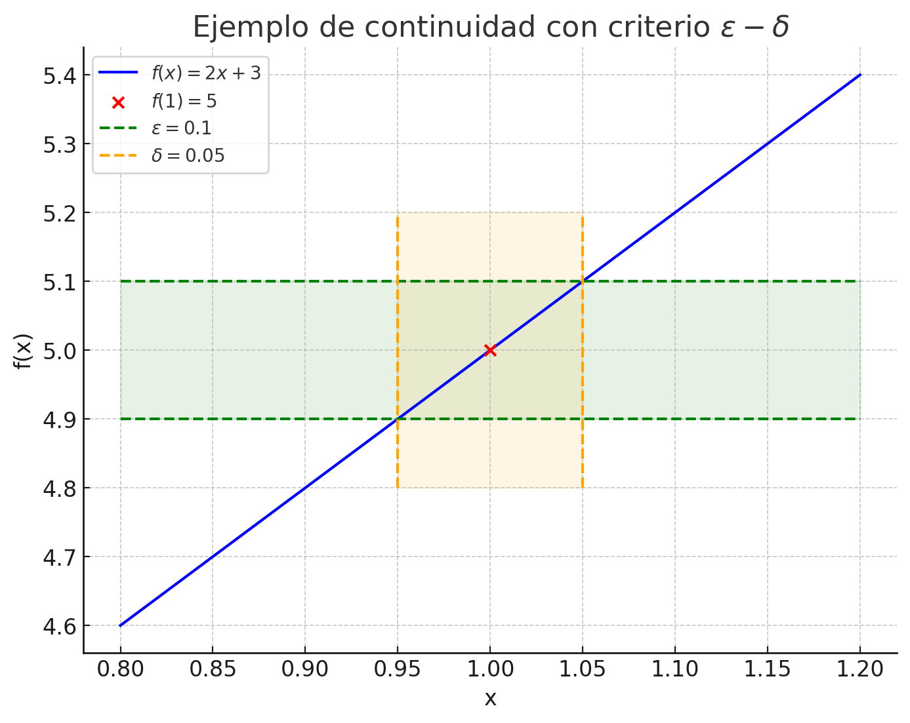{width="80%"}
:::

:::

## Ejemplo: función discontinua (escalón de Heaviside)

::: columns

::: {.column width="50%" style="font-size:0.77em;"}

La función azul es el **escalón de Heaviside**:

$$
g(x) =
\begin{cases}
0, & \text{si } x < 0, \\
1, & \text{si } x \geq 0.
\end{cases}
$$

El punto rojo indica: $g(0) = 1.$

La banda verde representa la franja  $\varepsilon = 0.1$ alrededor de $g(0) = 1$.

La banda naranja es el intervalo  $\delta$ alrededor de $x_0 = 0$.

🔎 Observa que, no importa lo pequeño que sea $\delta$, siempre habrá valores de $x$ dentro de la franja naranja (los que están a la izquierda de 0) cuya imagen cae en $0$, que queda fuera de la franja verde.  

👉 Esto demuestra que aquí no existe un $\delta$ que funcione, y por tanto la función no es continua en $x_0 = 0$.

:::

::: {.column width="50%"}
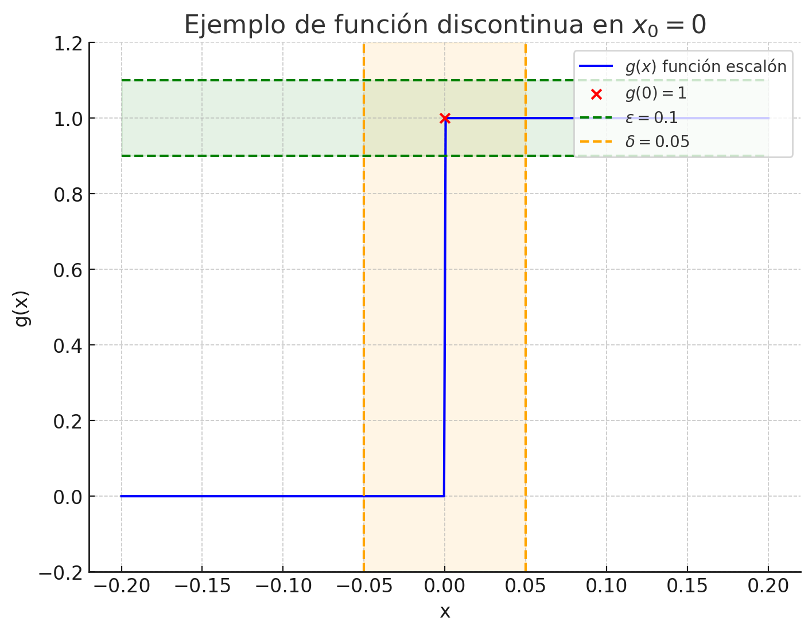{width="90%"}
:::

:::


## Ejemplo: discontinuidad removible

::: columns

::: {.column width="50%" style="font-size:0.8em;"}

La función es: $h(x) = \frac{x^2 - 1}{x - 1},$

que se simplifica a: $h(x) = x + 1 \quad \text{para } x \neq 1.$

🔎 **Observa en la gráfica:**

- La curva azul corresponde a $y = x+1$.  
- En $x=1$, la función no está definida (se produce una indeterminación $0/0$).  
- Esto genera un **hueco** (marcado en rojo).  

El límite:  $\lim_{x \to 1} h(x) = 2$

existe, pero la función no está definida en ese punto.  

👉 Si “rellenamos el hueco” definiendo $h(1) = 2$, la función se vuelve continua en $x=1$.  

:::

::: {.column width="50%"}
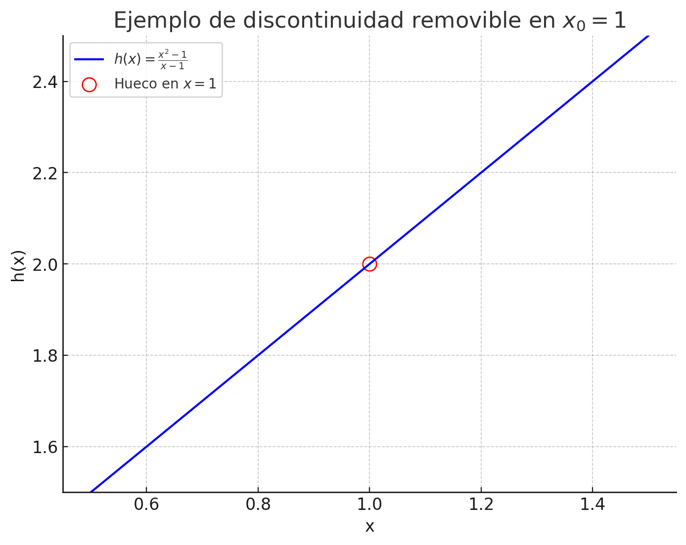{width="90%"}
:::

:::


## Funciones continuas

<l class="observ"> **Observaciones** </l>

1. Es fàcil comprobar que si $x_0$ es un punto de acumulación de $A$, entonces $f$ es continua en $x_0$ si, y sólo sí, $\displaystyle{\lim _{x \rightarrow x_0}f(x)=f(x_0)}$.

2. Si $x_0$ es un punto aislado de $A$, es decir, que no es de acumulación, entonces, dado que existe un entorno de $x_0$ donde este es el único punto de $A$, para que $f$ sea continua en $x_0$ es suficiente que $f$ esté definida en ese punto.

## Funciones continuas

<l class="important"> **Observación importante** </l>

Pese a que la definición de continuidad sobre un conjunto pueda inducir a pensar lo contrario, el concepto de continuidad es esencialmente **local**: una función es continua en un punto. No hay que olvidar, pues, que aunque la función sea continua sobre un conjunto $A$, la precisión $\delta$ para cada $x_0 \in A$, depende de $\epsilon$ y de $x_0$, por lo que se debería escribir $\delta(\epsilon,x_0)$, aunque no se haga, se debe tener siempre en cuenta esta dependencia. Por otra parte, veremos algunos casos en los que $\delta$ sólo depende de $\epsilon$, es la llamada **continuidad uniforme**. 


## Funciones continuas: Ejemplos.

<div class="example"> **Ejemplos**

**Ejemplo 1**. Una función constante $f(x)=c$ es continua para todo $x \in \mathbb{R}$, dado que si $x_n \rightarrow x_0$, entonces $f(x_0) \rightarrow c$, puesto que $f(x_n)=c=f(x_0)$, para todo $n \in \mathbb{N}$.

**Ejemplo 2**. $g(x) = x$ es continua para todo $x_0  \in \mathbb{R}$, puesto que si $x_n \rightarrow x_0$, entonces, obviamente $g(x_n)=x_n \rightarrow x_0=g(x_0)$.

**Ejemplo 3**. $h(x)=x^2$ es continua para todo $x_0 \in \mathbb{R}$, puesto que si $x_n \rightarrow x_0$, entonces $x_n^2 \rightarrow x_0^2=h(x_0)$.

**Ejemplo 4**. La función signo $\text{sgn}(x)$ no es continua en $x_0=0$, puesto que como hemos visto no existe el $\lim_{x \rightarrow x_0} \text{sgn} (x)$, dado que $-1 = \lim_{x \rightarrow x_0^-} \text{sgn}(x) \neq \lim_{x \rightarrow x_0^+} \text{sgn}(x) =1$.

**Ejemplo 5**. La función $\psi :\mathbb{R} \rightarrow \mathbb{R}$ definida por
$$
\psi(x)=
\begin{cases}
1, \text{ si } x \in \mathbb{Q}, \\
0, \text{ si } x \in \mathbb{R} \setminus \mathbb{Q},
\end{cases}
$$
es discontinua en todo punto $x \in \mathbb{R}$, puesto que si $x \in \mathbb{Q}$, existe una sucesión de irracionales $x_n$, tal que $x_n \rightarrow x$ y, por lo tanto $\psi(x_n)= 0$ para todo $n$, es decir que $\psi(x_n) \rightarrow 0 \neq 1=\psi(x)$. Análogamente, si $x \in \mathbb{R}\setminus \mathbb{Q}$, existe una sucesión de racionales tal que $x_n \rightarrow x$ y, por lo tanto $\psi(x_n) \rightarrow 1 \neq 0=\psi(x)$.
</div>

## Funciones continuas: Ejemplos.

<div class="example"> **Ejemplos**

**Ejemplo 6**. La función $f(x)=e^x$ es continua para todo $x_0 \in \mathbb{R}$, puesto que, como demostramos en el tema de sucesiones, si $x_n \rightarrow x_0$, entonces $e^{x_n} \rightarrow e^{x_0}$

**Ejemplo 7**. La función $\log: (0,+\infty) \rightarrow \mathbb{R}$, es continua para todo $x_0 \in (0,+\infty)$, puesto que, igual que con la exponencial, en su día demostramos que si $x_n \rightarrow x_0$, con $x_n > 0$, entonces $\log x_n \rightarrow \log x_0$

</div>

## La funcion por partes

La función $f(x)$ es continua en todo $\mathfrak{R}$

::: {.columns}

::: {.column width="60%"}

$$
f(x)=
\begin{cases}
0 & \text{si } x=0 \\
1-x & \text{si } 0<x<1 \\
1 & \text{si } x=1
\end{cases}
$$

::: {.fragment index="2"}
<l class="definition"> **Definición** </l>

::: {style="background: #fdf6e3; padding:0.2em;"}

Sean $f: A\subset \mathfrak{R} \rightarrow \mathbb{R}$ y $x_0 \in A$, **$f$ es continua en $x_0$** si para cada $\epsilon >0$ existe un $\delta >0$ tal que para todo $x \in A$ que verifique que $|x-x_0|<\delta$, entonces $|f(x)-f(x_0)|< \epsilon$.

Diremos que $f$ es continua en $A$, si es continua para [todo]{.alert} $x\in A$.

:::
:::

:::

::: {.column width="40%"}

::: {.fragment index="3" style="margin-top:-1.5em;"}
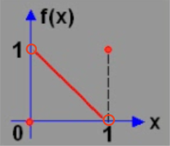{width="80%"}

(Gráfica de la función $f(x)$)
:::

::: {.fragment index="4"}
Que en los puntos del intervalo $[0; 1]$ toma **todos los valores** entre $f(0)=0$ y $f(1)=1$, pero **no es continua** en $[0; 1]$.
:::

:::

:::


## La función $\sin x$ es continua.

<l class="prop"> **Proposición** </l>

La función $\sin : \mathbb{R} \rightarrow \mathbb{R}$ es continua para todo $x \in \mathbb{R}$.

<div class="dem"> **Demostración**

Hay que ver que, para cada $\epsilon >0$ existe $\delta >0$ tal que si $|x-x_0| < \delta$ entonces $|\sin x - \sin x_0|<\epsilon$, o lo que es lo mismo, dado que en su dominio no hay puntos aislados, que $\lim_{x \rightarrow x_0} \sin x = \sin x_0$.

Teniendo en cuenta la igualdad trigonométrica: $\sin \alpha -\sin \beta = 2 \sin \frac{\alpha - \beta}{2} \cos \frac{\alpha + \beta}{2}$, 
tenemos 
$$
\sin x -\sin x_0 =2 \sin \frac{x-x_0}{2} \cos \frac{x+x_0}{2}.
$$
Dado que que la función $\cos x$ está acotada, tendremos que $\displaystyle{\lim_{x \rightarrow x_0} (\sin x -\sin x_0) }= 0$, es decir, que
$$
\lim_{x \rightarrow x_0} \sin x = \sin x_0.
$$
</div>

## Funciones continuas

<l class="observ"> **Observaciones** </l>

1. Puede ocurrir que una función $f : A \subset \mathbb{R} \rightarrow \mathbb{R}$ no esté definida en un punto de acumulación $c$ de $A$ y, sin embargo exista el $\lim_{x \rightarrow c} f(x) = L$, entonces la función $F :A \cup \{c\} \rightarrow \mathbb{R}$ definida por
$$
F(x)=
\begin{cases}
L, \quad  \text{ si } x=c, \\
f(x), \text{ si } x \in A,
\end{cases}
$$
es una función continua en $A \cup \{c\}$.

2. Caso que no exista el  $\lim_{x \rightarrow c} f(x)$, entonces no es posible extender $f$ a una función continua en $A \cup \{c\}$, puesto que sea cual sea el valor, $L$ que asignemos a la extensión $F$ en $c$, dicha función no podría ser continua, puesto que si fuera continua tendríamos que $\lim_{x \rightarrow c} f(x)=L$, y hemos supuesto dicho límite no existía.

## Funciones continuas

<div class="example"> **Ejemplos**

1. La función $f(x)= \frac{\sin x}{x}$, no está definida en $x=0$, sin embargo, dado que existe $\lim_{x \rightarrow 0} \frac{\sin x}{x} =1$, se puede extender dicha función a una función continua definida en $x=0$, asignando en ese punto el valor del límite, es decir 
$$
f(0) =1 = \lim_{x \rightarrow 0} \frac{\sin x}{x}.
$$

2. Por el contrario, no es posible extender la función $h(x)= \text{sgn}(x)$ para que sea continua en $x=0$, puesto que, como como hemos visto, no existe el $\lim_{x \rightarrow 0} \text{sgn} (x)$.

3. Dado que el $\lim_{x \rightarrow 0} x \cos \frac{1}{x} = 0$, entonces la función $\varphi :\mathbb{R} \rightarrow \mathbb{R}$, definida por
$$
\varphi (x) =
\begin{cases}
0, \qquad \,  \text{ si } x=0, \\
x \cos \frac{1}{x}, \text{ si } x \neq 0,
\end{cases}
$$
es una función continua para todo $x \in \mathbb{R}$.

</div>

## Discontinuidades: Tipos.

Las consideraciones anteriores, juntamente con la coincidencia o no de los limites laterales en un punto, lleva a la siguiente clasificación de las dicontinuidades

1. *Evitable:* $f$ no está definida en $x_0$, pero existe el $\lim_{x \rightarrow x_0}f(x)$.

2. *De primera especie (o de salto):* $\lim_{x \rightarrow x_0^-}f(x) \neq \lim_{x \rightarrow x_0^+}f(x)$.

3. *De segunda especie:* No existe alguno o ninguno de los límites laterales.

<l class="observ"> **Observación** </l>

Las discontinuidades de salto, como la de la función sgn$(x)$ en el punto $0$, ayudan a entender el nombre **continua** para las funciones que lo son: su gráfica no presenta saltos de ningún tipo, es decir -y valga la redundancia- la gráfica de una función continua es continua.


## Combinaciones de funciones continuas

Recordemos la definición siguiente:

<l class="definition"> **Definición** </l>

Sean $f,g: A \subset \mathbb{R} \rightarrow \mathbb{R}$ dos funciones reales de variable real. Entonces

1. $f+g$ es la función de $A$ en $\mathbb{R}$ definida por $(f+g)(x)=f(x)+g(x)$.
2. $f \cdot g$ es la función de $A$ en $\mathbb{R}$ definida por $(f \cdot g)(x)=f(x) \cdot g(x)$.
3. Si $\lambda \in \mathbb{R}$, $\lambda \cdot f$ es la función de $A$ en $\mathbb{R}$ definida por $( \lambda \cdot f)(x) =\lambda \cdot f(x)$.
4. Si $g(x) \neq 0$, $\dfrac{f}{g}$ es la función de $A$ en $\mathbb{R}$ definida por $\dfrac{f}{g}(x)= \dfrac{f(x)}{g(x)}$.

## Combinaciones de funciones continuas

<l class="prop"> **Proposición** </l>

Sean $f,g : A \subset \mathbb{R} \rightarrow \mathbb{R}$  tales que $f$ y $g$ són continuas en en $x_0 \in A$. Entonces

1. $f+g$ es continua en $x_0$.
2. $f \cdot g$ es continua en $x_0$.
3. Si $\lambda \in \mathbb{R}$, $\lambda f$ es continua en $x_0$.
4. Si $g(x) \neq 0$ para todo $x \in A$, entonces $\dfrac{f}{g}$ es continua en $x_0$.

## Combinaciones de funciones continuas

<div class="dem"> **Demostración**

Si $x_0$ es un punto aislado, el resultado es inmediato. 

Supongamos pues que $x_0$ es un punto de acumulación de $A$, sea $x_n$ una sucesión de puntos de $A$ tal que $x_n \rightarrow x_0$, entonces, dado que $f$ y $g$ son continuas en $x_0$, tendremos que $f(x_n) \rightarrow f(x_0)$ y $g(x_n) \rightarrow g(x_0)$, por lo tanto 
$$
(f+g)(x_n) = f(x_n)+g(x_n) \rightarrow f(x_0)+g(x_0) = (f+g)(x_0).
$$

Consideraciones análogas sirven para demostrar las otras combinaciones descritas en el enunciado.

</div>

## Combinaciones de funciones continuas

<l class="prop"> **Proposición** </l>

Sean $f,g : A \subset \mathbb{R} \rightarrow \mathbb{R}$  tales que $f$ y $g$ **són continuas en en $A$**. Entonces

1. $f+g$ es continua en $A$.
2. $f \cdot g$ es continua en $A$.
3. Si $\lambda \in \mathbb{R}$, $\lambda f$ es continua en $A$.
4. Si $g(x) \neq 0$ para todo $x \in A$, entonces $\dfrac{f}{g}$ es continua en $A$.

<div class="dem"> **Demostración**

Inmediata a partir de la definición de continuidad en un conjunto y de la proposición anterior.

</div>
 
## Composición de funciones

<l class="definition"> **Definición** </l>

Sean $f: A \subset \mathbb{R} \rightarrow \mathbb{R}$ y $g: B \subset \mathbb{R} \rightarrow \mathbb{R}$ tales que $f(A) \subset B$. La **función compuesta de $f$ y $g$**, $g \circ f$, es la función $g \circ f : A \rightarrow \mathbb{R}$ definida por
$$
(g \circ f) (x)= g(f(x)).
$$


<l class="observ"> **Observación** </l>

Por $f(A)$ se entiende el conjunto de los elementos de $\mathbb{R}$ tales que son imagen por $f$ de algún elemento de $A$, es decir
$$
f(A) =\{y \in \mathbb{R}: y=f(x)\text{ para algún } x \in A \}.
$$

## Composición de funciones

<div class="center">
```{r, echo=FALSE, label=gof,fig.cap="",out.width = "700px"}
knitr::include_graphics("Images/gof.png",dpi=1200)
```
</div>

## Composició de funciones: Ejemplos.

<div class="example"> **Ejemplos**

1. $h(x) = \sin \left(\dfrac{\pi}{2}-x \right)$ es la composición de las funciones $g(x)=\sin x$ y $f(x) =\dfrac{\pi}{2}-x$: $h(x) = (g \circ f)(x)$. Se debe tener en cuenta que la composición de funciones **no** es conmutativa, en  este caso 
$$
(f \circ g)(x) = \dfrac{\pi}{2}  - \sin x \neq \sin \left(\dfrac{\pi}{2}-x \right) = (g \circ f)(x).
$$

2. $h(x)= |x|$ es la composición de las funciones $r(x) = \sqrt{x}$ y $s(x)= x^2$: $h(x) = |x| = \sqrt{x^2}=r(s(x))$. Nuevamente $|x| = (r \circ s)(x) \neq (s \circ r) = (\sqrt{x})^2= x$, ya que la igualdad sólo sería vàlida para los $x >0$.

3. $h(x)=\log(x+1)$ es la composición de las funciones $f(x)= x+1$ y $g(x) = \log(x)$.

</div>

## Composición de funciones continuas

<l class="prop"> **Proposición** </l>

Sean $f: A \subset \mathbb{R} \rightarrow \mathbb{R}$ y $g : B \subset \mathbb{R} \rightarrow \mathbb{R}$, tales que $f(A) \subset B$. Si $f$ es continua en $x_0$ y $g$ es continua en $f(x_0)$, entonces $g \circ f$ es continua en $x_0$.

<div class="dem"> **Demostración**

Para simplificar la notación, pongamos que $y_0=f(x_0)$ y que $V_{\epsilon}(y)$ es el entorno centrado en $y$ y de radio $\epsilon$.

Sea $\epsilon >0$, dado que $g$ es continua en $y_0$, existe un $\gamma >0$ tal que si $y \in V_{\gamma} (y_0) \cap B$, entonces $g(y) \in V_{\epsilon}(g(y_0))$.

Dado que $f$ es continua en $x_0$, $f(A) \subset B$ y que $\gamma >0$, existe un $\delta >0$ tal que si $x \in V_{\delta}(x_0) \cap A$, entonces $y=f(x) \in V_{\gamma}(f(x_0))$.

En definitiva, para cada $\epsilon >0$ hemos podido determinar un $\delta >0$ tal que si $x \in V_{\delta}(x_0) \cap A$, entonces $g(f(x)) \in V_{\epsilon} (g(f(x_0)))$, es decir que $g \circ f$ es continua en $x_0$.


</div>

## Composición de funciones continuas

<div class="example"> **Ejemplos**

1. La función $\cos : \mathbb{R} \rightarrow \mathbb{R}$ es continua para todo $x \in \mathbb{R}$. En efecto: si $g(x) = \sin(x)$ y $f(x) = \dfrac{\pi}{2} -x$, entonces, tanto $f$ como $g$ son continuas para todo $x \in \mathbb{R}$, por lo tanto
$$
\cos (x) = \sin \left(\dfrac{\pi}{2} - x \right) = g(f(x)).
$$
es una función continua para todo $x \in \mathbb{R}$ por ser la composición de dos funciones continuas.

2. Si $f(x)$ es una función continua en $x_0$, entonces $|f(x)|$ también es continua en $x_0$, puesto que $h(x)=|x|$ es una función continua para todo $x \in \mathbb{R}$, dado que $|x|=\sqrt{x^2}$ y tanto $r(x) = \sqrt{x}$, como $s(x)=x^2$ son funciones continuas, la primera para todo $x \geq 0$ y la segunda para todo $x$. Entonces 
$$
|f(x)|= r(s(f(x))),
$$
es decir seria la composición de tres funciones continuas.

2. Si $f(x)$ es una función continua en $x_0$, entonces $e^{f(x)}$ es también continua en $x_0$, puesto que se trata de la composición de dos funciones continuas, $f$, y la exponencial, $e^x$. Lo mismo pasa con $\log f(x)$, si $f$ es una función positiva.

</div>

## Composición de funciones continuas

<l class="prop"> **Proposición** </l>

Sean $f: A \subset \mathbb{R} \rightarrow \mathbb{R}$ y $g : B \subset \mathbb{R} \rightarrow \mathbb{R}$, tales que $f(A) \subset B$. Si $f$ es continua en $A$ y $g$ es continua en $B$, entonces $g \circ f$ es continua en $A$.

<div class="dem"> **Demostración**

Inmediata a partir de la definición de continuidad en un conjunto y de la proposición anterior.

</div>

# Funciones continuas en intervalos

## Introducción

Al considerar funciones continuas sobre intervalos aparece, con todo su esplendor, la potencia y la magia de la propiedad de continuidad. Veremos que el hecho que la gráfica de la función entre los extremos del intervalo no se interrumpa -es decir, que sea continua- se convierte en un potente instrumento para la localización de raíces de una ecuación, polinómica o no.

También se demuestra que si el intervalo es cerrado, entonces la función está acotada y, el que posiblemente sea el resultado más importante, es que en este caso, las funciones continuas son **uniformemente continuas**, es decir que el $\delta$ de la propiedad $\epsilon -\delta$, que depende de $\epsilon$ y del punto, pasa a depender sólo de $\epsilon$, un hecho que tiene importantes consecuencias, como se verá posteriormente.


## Teorema de la conservación del signo

<l class="prop"> **Proposición: Teorema de la conservación del signo** </l>

Sea $f:[a,b] \rightarrow \mathbb{R}$ continua y sea $c \in (a,b)$ tal que $f(c) >0$. Entonces existe un $\delta >0$ tal que $f(x) >0$ para todo $x \in (c-\delta, c+\delta)$. Análogamente, si $f(c) <0$, entonces existe un $\delta >0$ tal que $f(x) <0$ para todo $x \in (c-\delta, c+\delta)$.

<l class="prop"> **Corolario** </l>

Sea $f:[a,b] \rightarrow \mathbb{R}$ continua y sea $c \in (a,b)$ tal que en todo entorno de $c$ hay puntos en los que $f$ es positiva y puntos en los que $f$ es negativa, entonces $f(c) =0$ .


## Teorema de la conservación del signo: Demostración.

::: dem
La demostración se basa en la definición $\epsilon-\delta$ de continuidad. 

Supondremos el caso $f(c) > 0$. Dao que $f$ es continua en c. por definicion, para este $\epsilon >0$ existe un $\delta >0$ tal que $\forall x \in (a,b), \quad |x-c| < \delta \implies |f(x)-f(c)| < \epsilon.$ La desigualdad $|f(x)-f(c)| < \epsilon$ es equivalente a: 

$$
f(c) - \epsilon < f(x) < f(c) + \epsilon \\ 
f(c) - \frac{f(c)}{2} < f(x) < f(c) + \frac{f(c)}{2} \\
\frac{f(c)}{2} < f(x) < \frac{3f(c)}{2} \\
$$

Puesto que $f(c) > 0$, se sigue inmediatamente que $\frac{f(c)}{2} > 0$.

Por lo tanto, si $x \in (c-\delta, c+\delta) \cap [a,b]$, se tiene que $f(x) > \frac{f(c)}{2} > 0.$

Hemos encontrado un $\delta > 0$ tal que $f(x) > 0$ para todo $x \in (c-\delta, c+\delta) \cap [a,b]$. $\square$
:::

::: exercise

**Ejercicio**

Demuestra el teorema anterior en el caso que $f(c) <0$.
:::


## Teorema de Bolzano

<l class="prop"> **Proposición: Teorema de Bolzano** </l>

Sea $f:[a,b] \rightarrow \mathbb{R}$ continua tal que $f(a)\cdot f(b) < 0$, entonces existe $c \in (a,b)$ tal que $f(c)=0$.

La condición $f(a)\cdot f(b) < 0$ es una forma sencilla para expresar que $f(a)$ y $f(b)$ son de signo diferente como se ilustra en el gráfico siguiente:


<div class="center">
```{r, echo=FALSE, label=bolzano,fig.cap="",out.width = "900px"}
knitr::include_graphics("Images/bolzanot2.png",dpi=1200)
```
</div>


## Teorema de Bolzano: Demostración

<div class="dem"> **Demostración**

Supongamos que $f(a)<0$ y que $f(b)>0$, el conjunto $S=\{x \in [a,b]: f(x) <0\}$ está acotado superiormente, por ejemplo, por $b$. Sea $c= \sup S$, veamos que $f(c)=0$.

Supongamos en primer lugar que $f(c) <0$, por ser $f$ continua y por el teorema de la conservación del signo, existirá un $\delta >0$ tal que para todo $x \in (c-\delta, c+\delta)$ es $f(x) <0$, es decir, existirían elementos $x>c$ tales que $f(x)<0$, lo que contradice que $c$ sea el mayor para los que $f$ toma valores negativos, por lo tanto no puede ser que $f(c)<0$.

Supongamos, pues que $f(c)>0$, razonamientos análogos a los anteriores no llevarían a ver que es incompatible esta condición con el hecho que $c$ sea el supremo de $S$.

En consecuencia, $f(c)=0$, que es lo que queríamos demostrar.

</div>

<div class="exercise"> **Ejercicio**

Demuestra el teorema de Bolzano en el caso que sea $f(a) >0$ y $f(b)<0$.

</div>

## CEROS DE UNA FUNCIÓN {.scrollable}

::: columns

::: {.column width="50%"}

::: {.bg style="margin-top: 15px; font-size: 1em;"} 
Se dice que $k \in \mathfrak{R}$ es un [cero]{.alert} de $f: \mathfrak{R} \to \mathfrak{R}$ si $f(k) = 0$. En términos geométricos, los [ceros]{.alert} de "$f$" son los puntos en que la gráfica de "$f$" [toca al eje de abscisas]{.alert}.
:::


<div style="text-align: center; margin: 15px;font-size: 0.7em">
  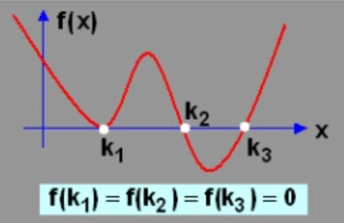{width="70%"}    
  $$f(k_1) = f(k_2) = f(k_3) = 0$$
</div>


::: {.bg style="margin-top: -2em; font-size: 1em;"} 
Si $k \in \mathfrak{R}$ es un [cero]{.alert} de "$f$", se dice es una [raíz]{.alert} de la ecuación $f(x) = 0$.
:::

:::

::: {.column width="50%"}
```{python}
#| fig-align: center
#| echo: false
#| warning: false

import numpy as np
import matplotlib.pyplot as plt

# 1. Definir la función
def f(x):
    """Función: f(x) = 1/x"""
    return x**2 -5*x +6

# 2. Definir el rango de x (evitando la asíntota en x=0)
epsilon = 1e-4
x_neg = np.linspace(-1.0, -epsilon, 500)
x_pos = np.linspace(epsilon, 5.0, 500)

# 3. Crear la figura
plt.figure(figsize=(8, 6))

# 4. Graficar ambas ramas
plt.plot(x_neg, f(x_neg), label=r'$f(x) = \frac{1}{x}$', color='blue')
plt.plot(x_pos, f(x_pos), color='blue', linewidth=3)

# 5. Añadir detalles
plt.title('Gráfica de la función f(x) = x^2-5x+5 (Parábola)', fontsize=16,fontweight='bold')
plt.xlabel('Eje X')
plt.ylabel('Eje Y')
plt.axhline(0, color='gray', linestyle='--', linewidth=1.8, label='Asíntota horizontal (y=0)')
plt.axvline(0, color='gray', linestyle='--', linewidth=1.8, label='Asíntota vertical (x=0)')
plt.xlim(-1, 5);
plt.ylim(-1, 2);
plt.xticks(np.arange(-1, 5, 1));
plt.yticks(np.arange(-1, 2, 1));
# Agregar puntos en las raíces
roots_x = [2,3]
roots_y = [0,0]
plt.scatter(roots_x, roots_y, color='red', s=80, marker='o', label='Raíces')
plt.grid(True)
plt.legend()
```
::: {.bg style="margin-top: -3em; font-size: 0.75em;"}
<p>
[Por ejemplo]{style="color: magenta; font-weight: bold;"}, si $f(x) = x^2 - 5x + 6$, los únicos [ceros]{.alert} de "$f$" son $2$ y $3$
</p>

$$
\text{pues } f(x) = x^2 - 5x + 6 = 0 \implies x = \frac{5 \pm \sqrt{25 - 24}}{2} = \begin{cases} 2 \\ 3 \end{cases}
$$


[Por ejemplo]{style="color: magenta; font-weight: bold;"}, si $g(x) = e^x$, la función "$g$" carece de [ceros]{.alert}, pues $\forall x \in \mathfrak{R}$ sucede que $g(x) = e^x > 0$.


:::

:::
:::

## Ejercicio: Demostración Formal (Teorema de Bolzano) {.scrollable}

::: {.bg style="background-color: #fdf6e3;padding:0.1em; font-size:1.2em;margin-top:0em"}
Demostrar la existencia de al menos una raíz real negativa para el polinomio $P(x)=x^4−4x2−1$. en el $[-3, 0]$.
:::

::: {.bg style="background-color: none;padding:0.25em; font-size:0.9em;"}

**Variables y Suposiciones:** La función $f(x)$ es polinómica, por lo tanto, es **continua en todo $\mathfrak{R}$**, en $[-3, 0]$.**Estrategia de Demostración:** Evaluar $f(x)$ en el extremo superior ($x=0$) para obtener un signo. Evaluar $f(x)$ en el extremo inferior ($x=-3$) para obtener el signo opuesto. **Objetivo**:Demostrar la existencia de **al menos una raíz real negativa** para el polinomio $P(x) = x^4 - 4x^2 - 1$.
:::

::: example

**Demostración:**

Sea $f: \mathfrak{R} \to \mathfrak{R}$ definida por $f(x) = x^4 - 4x^2 - 1.$ Dado que $f(x)$ es una función polinómica, es continua en todo $\mathfrak{R}$ y por lo tanto, en el intervalo cerrado $[-3, 0]$
Evaluación en los extremos del intervalo $[-3, 0]$

Extremo superior ($x=0$): $f(0) = (0)^4 - 4(0)^2 - 1 = -1.$ Por lo tanto, $f(0) < 0.$ ([negativo]{.alert})

Extremo inferior ($x=-3$): $f(-3) = (-3)^4 - 4(-3)^2 - 1 = 81 - 4(9) - 1 = 81 - 36 - 1 = 44.$ Por lo tanto, $f(-3) > 0.$ ([positivo]{.alert})

Aplicación del Teorema de Bolzano: Hemos establecido que $f$ es continua en $[-3, 0]$ y cumple:

$$f(-3) \cdot f(0) = (44) \cdot (-1) = -44 < 0$$

El producto de las imágenes de los extremos es negativo, lo que implica un cambio de signo. Por el Teorema de Bolzano, existe al menos un  $c \in (-3, 0)$ tal que $f(c) = 0$. 

Puesto que el intervalo $(-3, 0)$ contiene únicamente números negativos, la raíz  $c$  es negativa. $\square$

:::


## Ejercicio: Demostración Formal (Teorema de Bolzano) {.scrollable}

::: {.bg style="background-color: #fdf6e3;padding:0.1em; font-size:1.2em;margin-top:0em"}

Demostrar que si $k>−3$, la ecuación $x^3 + x^2 + kx - 6 =0$ tiene al menos una raíz real menor que $2$.
:::

::: {.bg style="background-color: none;padding:0.25em; font-size:0.9em;"}


**Variables y Suposiciones:**
* Sea $f: \mathfrak{R} \to \mathfrak{R}$ definida por $f(x) = x^3 + x^2 + kx - 6$.
* Se establece la condición $k > -3$.
* El objetivo es demostrar que existe una raíz $c$ tal que $c < 2$,. **Estrategia:** Aplicar el Teorema de Bolzano en un intervalo cerrado $[a, 2]$, donde $a$ es un valor suficientemente negativo para garantizar que $f(a)$ y $f(2)$ tengan signos opuestos.
:::
::: example
**Demostración:**

**Sea** $f(x)$ es una función polinómica, es continua en todo $\mathfrak{R}$, y por lo tanto, en cualquier intervalo cerrado $[a, 2]$. Evaluamos $f(2)$:

$$
f(2) = 2^3 + 2^2 + k(2) - 6 = 8 + 4 + 2k - 6 = 6 + 2k.
$$

Puesto que $k > -3$, implica que $6 + 2k > 0$. Por lo tanto, $f(2) > 0$ (positivo).

**Ahora** analizamos el comportamiento de $f(x)$ para $x \to -\infty :$

$$
\lim_{x \to -\infty} f(x) = \lim_{x \to -\infty} (x^3 + x^2 + kx - 6) = \lim_{x \to -\infty} x^3 = -\infty.
$$

Dado que $\lim_{x \to -\infty} f(x) = -\infty$, por definición de límite, para cualquier $L < 0$ ([elegimos]{.alert}) $L = -|f(2)| < 0$, o **simplemente**  $L = -1$. Existe un $a \in \mathfrak{R}$ con $a < 2$, tal que $f(x) < L$ para todo $x \le a$. En particular, elegimos un $a < 2$ tal que  $f(a) < 0$. Hemos establecido un intervalo cerrado $[a, 2]$ en el que
$f$ es continua y se cumple:

$$f(a) < 0 \quad \text{y} \quad f(2) > 0.$$

Por lo tanto, por el **Teorema de Bolzano**, existe al menos un $c \in (a, 2)$ tal que $f(c) = 0.$

Puesto que $c \in (a, 2)$ y $a < 2$, se concluye que $c$ 
es una raíz real menor que 2. $\square$
:::

## Pruebe que la ecuación $e^x - 8 = 0$ tiene alguna raíz real en $(2; 3)$.


Sea $f: \mathfrak{R} \to \mathfrak{R}$ tal que $f(x) = e^x - 8$.

Como "$f$" es continua en todo punto, es **continua** $[2; 3]$; además, los valores de "$f$" en los extremos de $[2; 3]$ tienen **signo distinto**:

$$
\begin{aligned}
&f(2) = e^2 - 8 < 0 \\
&f(3) = e^3 - 8 > 0
\end{aligned}
$$

Así, según **Bolzano**, hay al menos un punto $c \in (2; 3)$ tal que $f(c) = 0$, y decir $f(c) = 0$ es decir $e^c - 8 = 0$; o sea: $e^c = 8$.


## Ejemplo {.scrollable}
<div class="example">
Vamos a aproximar el cero de la función $f(x)=x^3-x+1$ entre $a=-2$ y $b=-1$, o sea, vamos a aproximar el valor $\hat{x}\in (-2,-1)$ tal que $f(\hat{x})=\hat{x}^3-\hat{x}+1=0.$

```{r,echo=FALSE}
f=function(x){x^3-x+1}

bolzano=function(a,b,tol,f){
  x=(a+b)/2;
  while(abs(f(x)) >=tol){
    x=(a+b)/2;
    if(f(a)*f(x)<0){b=x}
    if(f(a)*f(x)>0){a=x}
  }
return(x)
}

pas.bolzano=function(xn,yn,f){
  c=(xn+yn)/2;
  if(f(xn)*f(c)<0){yn1=c;xn1=xn}
  if(f(xn)*f(c)>0){xn1=c;yn1=yn}
  return(c(xn1,yn1))
}

an=c(-2)
bn=c(-1)
iteracions=25
for (i in 1:iteracions){
  n=length(an);
  aux=pas.bolzano(an[n],bn[n],f)
  an=c(an,aux[1])
  bn=c(bn,aux[2])
}
options(scipen=999)
xn=(an+bn)/2
```
Comprobemos que hay un cambio de signo entre $a=-2$ y $b=-1$: 
$$
f(-2)=(-2)^3-(-2)+1=-8+2+1=`r f(-2)`, \quad f(-1)=(-1)^3-(-1)+1=-1+1+1=`r f(-1)`.
$$

:::: {.columns}

::: {.column with="50%"}

1) $\color{red}{n=0}$, $\color{blue}{Step \; first}$, $[a_0,b_0]=[-2,-1]$, 

verificamos el **teorema de bolzano**
$$\begin{array}
ff(a_0) \cdot f(b_0)<0 \\
f(-2) \cdot f(-1)<0 \\
`r f(-2)`\cdot `r f(-1)` <0
\end{array}$$
Evaluamos, primera aproximación $\hat{x}_0=c_0=\frac{( a_0+ b_0)}{2}=`r (-2+(-1))/2`$

2) $\color{red}{n=1}$, $\color{blue}{Step\; Second}$, 
$$\begin{array}
ff(a) \cdot f(\hat{x}_0)<0 \\
f(-2) \cdot f(-1.5)<0 \\
`r f(-2)`\cdot `r f((-2+(-1))/2)` >0 \quad \text{¡no se cumple!}
\end{array}$$

Entonces el $a_1 \rightarrow c_0$, entonces: $[ a_1,b_1]=[ c_0,b_0]=[-1.5,-1]$

Evaluamos, segunda aproximación $\hat{x}_1=c_1=\frac{( a_1+ b_1)}{2}=`r (-1.5+(-1))/2`$

:::

::: {.column with="50%"}

3) $\color{red}{n=2}$, $\color{blue}{Step \; third}$, 
$$\begin{array}
ff(a_1) \cdot f(\hat{x}_1)<0 \\
f(-1.5) \cdot f(-1.25)<0 \\
`r f(-1.5)`\cdot `r f(-1.25)` <0 \quad \text{¡genial!}
\end{array}$$
luego el $b_2 \rightarrow c_1$, entonces: $[ a_1,c_1]=[a_2,b_2]=[-1.5,-1.25]$;

Evaluamos, tercera aproximación $\hat{x}_2=c_2=\frac{( a_2+ b_2)}{2}=`r (-1.5+(-1.25))/2`$

4) $\color{red}{n=3}$, $\color{blue}{Step \;third}$, 
$$\begin{array}
ff(a) \cdot f(\hat{x}_2)<0 \\
f(-1.5) \cdot f(-1.375)<0 \\
`r f(-1.5)`\cdot `r f(-1.375)` >0
\end{array}$$
luego $a_3 \rightarrow c_2$: $[a_3,b_3]=[ c_2,b_2]=[-1.375,-1.25]$

Evaluamos, tercera aproximación $\hat{x}_3=c=\frac{( a_3+ b_3)}{2}=`r (-1.375+(-1.25))/2`$

Seguimos así hasta alcanzar un valor que este por debajo de la **tolerancia** deseada,en eeste ejemplo la es: $\epsilon=0.001$.
:::
::::
</div>


## Teorema de los valores intermedios

<l class="prop"> **Proposición: Teorema de los valores intermedios**

Sea $f:[a,b] \rightarrow \mathbb{R}$ continua y sean $x_1,x_2 \in [a,b]$ tales que $x_1 < x_2$ y $f(x_1)\neq f(x_2)$, entonces $f$ toma todos los valores comprendidos entre $f(x_1)$ y $f(x_2)$.

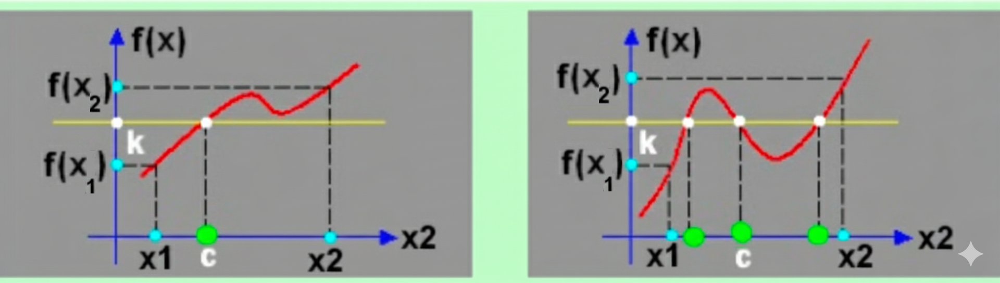{width="80%"}

##

<div class="dem"> **Demostración**.

En primer lugar  hay que tener en cuenta que  $x_1 < x_2$ no significa que $f(x_1)<f(x_2)$. 

Supongamos, pues, que $f(x_1) < f(x_2)$, sea $d \in (f(x_1), f(x_2))$, entonces $h(x)= f(x)-d$ es una función continua sobre el intervalo $[x_1,x_2]$ tal que $h(x_1)=f(x_1) -d <0$ y $h(x_2)= f(x_2) -d >0$, por el teorema de Bolzano, existe $c \in (x_1,x_2)$ tal que $h(c)=0=f(c)-d$, es decir que $f(c)=d$.

</div>

<div class="exercise"> **Ejercicio**

Demuestra la proposición para el caso $x_1 < x_2$ y $f(x_1) > f(x_2)$.

</div>


## Funciones acotadas

<l class="definition"> **Definición** </l>

Sea $f:A \subset \mathbb{R} \rightarrow \mathbb{R}$:

1. $f$ está acotada superiormente si existe $K \in \mathbb{R}$ tal que $f(x) < K$, para todo $x \in A$.

2. $f$ está acotada inferiormente si existe $K \in \mathbb{R}$ tal que $f(x) > K$, para todo $x \in A$.

3.  $f$ está acotada si lo está inferiormente y superiormente, es decir si existe $K \in \mathbb{R}$ tal que $|f(x)|<K$, para todo $x \in A$.

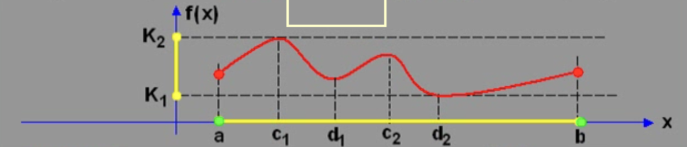{width="80%"}

## Funciones acotadas: Ejemplos

<div class="example"> **Ejemplos**

1. Las funciones $\sin$ y $\cos$ estan acotadas en $\mathbb{R}$, puesto que $|\sin(x)| \leq 1$ y $|\cos(x)| \leq 1$ para todo $x \in \mathbb{R}$.

2. La función $f(x)= \dfrac{1}{x^2}$ está acotada inferiormente en $\mathbb{R}$ por $0$, pero no lo está superiormente.

3. La función $g(x)= 2-x^2$ está acotada superiormente en $\mathbb{R}$ por $2$, pero no lo está inferiormente.

4. La función $h(x)= \dfrac{1}{x}$ no està acotada inferiormente ni superiormente en cualquier entorno de $0$.

</div>

## Teorema de Weierstrass

<l class="prop"> **Proposición: Teorema de Weierstrass.** </l>

Sea $f:[a,b] \rightarrow \mathbb{R}$ continua, entonces $f$ está acotada.

<div class="dem"> **Demostración**

Por reducción al absurdo. Supongamos que $f$ no está acotada en $[a,b]$, entonces existe $x_1 \in I_1= [a,b]$ tal que $f(x_1) >1$. Sea $c =\dfrac{a+b}{2}$, entonces $f$ no está acotada en $[a,c]$ o en $[c,b]$, sea $I_2 =[a_2,b_2]$ dicho intervalo. Entonces $f$ no está cotada en $I_2$, por lo tanto, existe $x_2 \in I_2$ tal que $f(x_2) > 2$. Reiterando este proceso, construiremos una sucesión $I_n$ de intervalos anidados, $I_{n-1} \supset I_n$, tal que $b_n - a_n = \dfrac{b_{n-1 }-a_{n-1}}{2}$, por lo que $\lim_{n \rightarrow \infty}(b_n - a_n)=0$ y, además $x_n \in I_n$.

Por el principio de los intervalos anidados, existe $c$ tal que $\lim_{n \rightarrow \infty} a_n = c = \lim_{n \rightarrow \infty} b_n$. Dado que $a_n \leq x_n \leq b_n$, tendremos que $\lim_{n \rightarrow \infty} x_n = c$ como, por otra parte $f(x_n) > n$, resulta que $f(x_n)  \rightarrow \infty$, lo que contradice que $f$ sea continua, puesto que debería ser $f(x_n) \rightarrow f(c)$.

</div>

## 

<div style="text-align: center; color: black; background-color: yellow; padding: 10px; border-radius: 5px; font-size: 1em; font-weight: bold;">
TEOREMA DE WEIERSTRASS
</div>

<div style="margin-top: 15px; font-size: 1em; color: black; font-weight: bold;">

<p style="text-align: justify;">
Si la función "$f$" es <span style="color: red;">continua en el cerrado $[a;b]$</span>, entre los valores que toma "$f$" en los puntos de $[a;b]$ hay un <span style="color: red;">mínimo $K_1$</span> que no supera a ningún otro, y un <span style="color: red;">máximo $K_2$</span> no superado por ningún otro.
</p>

<p style="text-align: justify; margin-top: 10px;">
De $K_1$ se dice que es el <span style="color: red; font-weight: bold;">mínimo absoluto (global)</span> de "$f$" en $[a;b]$.
</p>
<p style="text-align: justify; margin-top: -10px;">
De $K_2$ se dice que es el <span style="color: red; font-weight: bold;">máximo absoluto (global)</span> de "$f$" en $[a;b]$.
</p>
</div>


<div style="display: flex; justify-content: center; align-items: flex-start; margin-top: 20px;">
    
<div style="flex-shrink: 0; margin-right: 20px;">
    
</div>

::: columns

::: {.column width="50%"} 
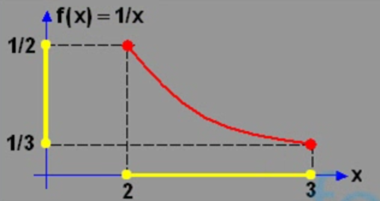
:::
::: {.column width="50%"} 
<div style="background-color: yellow; padding: 15px; border: 2px solid black; flex-grow: 1; font-size: 1em; max-width: 400px;margin-top:3em">
<p style="margin: 0;">
  <span style="color: red; font-weight: bold;">El máximo absoluto (global)</span> de $f(x) = 1/x$ en $[2;3]$ es "$1/2$", y "$f$" toma ese valor en el punto $x = 2$; el <span style="color: red; font-weight: bold;">mínimo absoluto (global)</span> es "$1/3$", y "$f$" toma ese valor en el punto $x = 3$.
</p>
</div>
:::
:::

</div>

<div style="margin-top: 20px; font-size: 1em; color: black; font-weight: bold;">
<p style="text-align: justify;">
Se introduce la palabra <span style="color: red; font-weight: bold;">absoluto (global)</span> para distinguir $K_1$ y $K_2$ de los máximos y mínimos <span style="color: red; font-weight: bold;">relativos (locales)</span> que estudiaremos más adelante.
</p>
</div>

## 


## Teorema del extremo

<l class="prop"> **Proposición. Teorema del extremo** </l>

Sea $f:[a,b] \rightarrow \mathbb{R}$ continua, entonces existen $x_1$ y $x_2$ tales que $f(x_1) = \inf_{[a,b]}f$ y que $f(x_2) = \sup_{[a,b]}f$.

<div class="dem"> **Demostración**

Dado que $f$ es continua en $[a,b]$, $f$ está acotada, por lo tanto existen $M= \sup_{[a,b]}f$ y $m= \inf_{[a,b]}f$. Veamos que existen $x_1$ y $x_2$ tales que $m=f(x_1)$ y $M=f(x_2)$. Supongamos, en primer lugar que no existe $x$ tal que $f(x) = M$, entonces la función $h(x)=\dfrac{1}{f(x)-M}$ es continua y por lo tanto, debería estar acotada en $[a,b]$.
Veamos que no es así: sea $K>0$, por ser $M= \sup_{[a,b]}f$, existe $x \in [a,b]$ tal que $f(x) \in \left(M-\dfrac{1}{K},M+\dfrac{1}{K}\right)$, puesto que, de no ser así $M-\dfrac{1}{K}$ seria una cota superior para $f$ en $[a,b]$, por lo tanto, dado que $|h(x)| = \dfrac{1}{|f(x)-M|} > K$, es decir $h(x)$ no está acotada, lo cual contradice que sea continua en $[a,b]$. Así pues, existe $x_2$ tal que $f(x_2)=M= \sup_{[a,b]} f$. 

Razonamientos análogos permiten demostrar que existe $x_1 \in [a,b]$ tal que $f(x_1)=m= \inf_{[a,b]}f$.
</div>

## Teorema del extremo

<div class="center">
```{r, echo=FALSE, label=extemo,fig.cap="",out.width = "800px"}
knitr::include_graphics("Images/teormaxmin.png",dpi=1200)
```
</div>

## Corolario del teorema del extremo

::: prop
**Proposición. Corolario del teorema del extremo.** 
:::

La imagen de un intervalo cerrado por una función continua es un intervalo cerrado.

::: dem

**Demostración**

Sea $f: [a,b] \rightarrow \mathbb{R}$, el teorema del extremo asegura que existen $x_1, x_2 \in [a,b]$ tales que $f(x_1)= m=\inf{[a,b]}$ y $f(x_2)= M=\sup{[a,b]}$, por lo tanto $f([a,b]) \subset [m,M]$. Sea ahora $y \in [m,M]$, por el teorema de los valores intermedios, existe $x \in [a,b]$ tal que $y=f(x)$, por lo que $[m,M] \subset f([a,b])$. Por consiguiente es $f([a,b]) = [m,M]$.
:::

## Funciones monótonas

::: definition
**Definición**
:::

Sea $f: A \subset \mathbb{R} \rightarrow \mathbb{R}$ una función y sea $B \subset A$.

1. $f$ es **creciente** en $B$ si, para todo par $x,y \in B$  tales que si $x <y$, entonces  $f(x) \leq f(y)$. Si esta última desigualdad es estricta, es decir $f(x) <f(y)$, entonces $f$ es **estrictamente creciente**.

2. $f$ es **decreciente** en $B$ si, para todo par $x,y \in B$ tales que $x < y$, entonces $f(x) \geq f(y)$. Si $f(x) > f(y)$, entonces $f$ es **estrictamente decreciente** en $B$.

3. $f$ es **monótona** en $B$, si es creciente o decreciente en $B$. **Estrictamente monónotona** seria, por consiguiente una función estrictamente creciente o estrictamente decreciente.


## Funciones monótonas.

::: example

**Ejemplos** 

La función representada en esta gráfica, es estrictamente creciente en los intervalos $[a,x_2)$ y $[x_1,b)$ y es estrictamente decreciente en el intervalo $(x_2,x_1)$.

::: center
```{r, echo=FALSE, label=monot1,fig.cap="",out.width = "600px"}
knitr::include_graphics("Images/teormaxmin.png",dpi=1200)
```
:::
:::

## Funciones monótonas.

<div class="example"> **Ejemplos** 

La función $f(x)= \dfrac{1}{x}$ es estrictamente decreciente en todo su dominio, es  decir en $\mathbb{R} \setminus \{0\}$.

<div class="center">

```{r, echo=FALSE, label=monot2,fig.cap="",out.width = "600px"}
knitr::include_graphics("Images/inversx.png",dpi=1200)
```
</div> </div>

## Funciones monótonas.

<div class="example"> **Ejemplos** 

La función $f(x)= \dfrac{1}{x^2}$ es estrictamente creciente en $(-\infty,0)$ y estrictamente decreciente en $(0,+\infty)$.
<div class="center">

```{r, echo=FALSE, label=monot3,fig.cap="",out.width = "500px"}
knitr::include_graphics("Images/inversax2.png",dpi=1200)
```
</div>

</div>

## Funciones monótonas.

<div class="example"> **Ejemplos** 

Un ejemplo de función creciente, pero no estrictamente creciente:
$$
g(x)= \begin{cases}
x+1,& \text{ si } x \in [-2,0], \\
1, & \text{ si } x \in [0,1], \\
x^2, & \text{ si } x \in [1,2]. 
\end{cases}
$$
<div class="center">

```{r, echo=FALSE, label=monot4,fig.cap="",out.width = "500px"}
knitr::include_graphics("Images/creix1.png",dpi=1200)
```
</div>

</div>


## Funciones monótonas

<l class="prop"> **Proposición** </l>

$f: A \subset \mathbb{R} \rightarrow \mathbb{R}$ una función monótona en $A$. Entonces $f$ no puede tener ninguna discontinuïdad de segunda especie.

<div class="dem"> **Demostración**

En esencia, lo que nos asegura el enunciado es que existen los límites laterales de $f$ en todo punto de acumulación de $A$. Supongamos que $f$ es creciente y sea $c$ uno de estos puntos de acumulación, veamos que existe el $\lim_{x \rightarrow c^-} f(x)$. Para ello consideremos el conjunto $D=\{f(x): x<c, \, x \in A \}$. Dado que $f$ es creciente, $D$ está acotado superiormente por $f(c)$, por lo tanto existe el supremo de $D$, sea $s= \sup D$, dado un $\epsilon >0$, existe $x_0 < c$ tal que $s-\epsilon < f(x_0) <s$, puesto que, de no ser así, el supremo sería $s-\epsilon$ y no $s$. 
Sea $\delta = c-x_0 >0$, para todo $x  \in A$ tal que $x_0 <x < c$ es $|c-x| < \delta$ y $|s -f(x)| < \epsilon$, puesto que $f(x_0) < f(x)$ por ser $f$ creciente, Por lo tanto, queda demostrado que $\lim_{x \rightarrow c^-} f(x) = s$.

Consideraciones análogas permiten demostrar que existe $\lim_{x \rightarrow c^+}f(x)$. </div>

<div class="exercise"> **Ejercicio**

Demuestra la proposición anterior para $f$ decreciente. </div>


## Funciones inversas

Recordemos que una **aplicación biyectiva** o **correspondencia uno a uno** es una aplicación que es, a la vez, inyectiva y exhaustiva.


::: {style="font-size:1em;"}
::: center
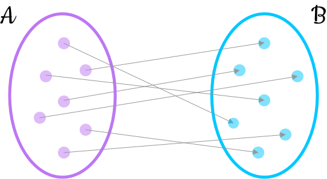{width="50%"}
:::
:::


Una propiedad importante de esta aplicaciones biyectivas es que se puede invertir el sentido de las flechas y el resultado continua siendo una aplicación biyectiva. 

## Funciones inversas

<l class="prop"> **Proposición** </l>

Sea $f: A \rightarrow B$ una aplicación biyectiva. Entonces la aplicación $f^{-1}: B \rightarrow A$, definida por $f^{-1}(y)= x$ si $f(x)=y$ es una aplicación biyectiva.

<div class="exercise"> **Ejercicio**

Demuestra esta proposición. 

</div>

Está claro que $f$ y $f^{-1}$ son tales que $(f \circ f^{-1})(x) = x = (f^{-1}\circ f)(x)$

En el caso de funciones, es decir, aplicaciones entre conjuntos de números, la aplicación inversa recibe el nombre de función inversa.

## Funciones inversas

<div class="example"> **Ejemplos**

1. La inversa en $[0,+\infty)$ de la función $f(x)= x^2$ es $f^{-1}(x)= \sqrt{x}$, en general la de $g(x)= x^n$ es $g^{-1}(x)=\sqrt[n]{x}$.

2. La inversa de la función $\sin: \left[-\dfrac{\pi}{2},\dfrac{\pi}{2} \right] \rightarrow [-1,1]$ es $\arcsin:  [-1,1] \rightarrow \left[-\dfrac{\pi}{2},\dfrac{\pi}{2} \right]$.

3. La inversa de la función $g(x) = \dfrac{1}{x}$ en $\mathbb{R} \setminus \{0\}$ es ella misma. 

4. La inversa de la funcion $h(x) =\dfrac{1}{x^2}$ en $(0,+\infty)$ es $h^{-1}(x) = \dfrac{1}{\sqrt{x}}$.  

5. La inversa de $t(x)=a + (b-a)x$ en $[0,1]$ es $t^{-1}(x)= \dfrac{x-a}{b-a}$ en $[a,b]$. Este ejemplo muestra que siempre existe una aplicación biyectiva entre dos intervalos cerrados cualesquiera de $\mathbb{R}$.


</div>

## Funciones inversas

Las gràficas de una función, $f$, y la de su inversa, $f^{-1}$ són simétricas respecto de la recta $y=x$:

::: {style="font-size:1em;"}
::: center
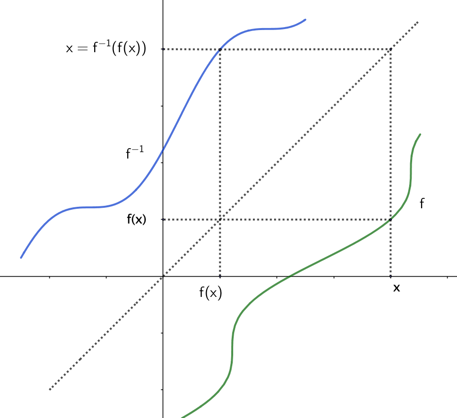{width="50%"}
:::
:::

## Funciones monótonas e inversas

<l class="prop"> **Proposición**

Sea $f: [a,b] \rightarrow \mathbb{R}$ una función continua y estrictamente creciente. Entonces 

1. Existe la función inversa $f^{-1} : [f(a),f(b)] \rightarrow [a,b]$.
2. $f^{-1}$ es continua y estrictamente creciente.

<div class="dem"> **Demostración**

Vamos a demostrar que existe $f^{-1}$, es decir que $f$ es una biyección entre $[a,b]$ y $[f(a),f(b)]$. El teorema de los valores intermedios nos asegura que $f$ es exhaustiva, puesto que dado un $y \in [f(a),f(b)]$, existe un $x \in [a,b]$, tal que $f(x)=y$, o lo que es lo mismo tal que $f^{-1}(y)=x$, por lo tanto, todos los elementos de $[f(a),f(b)]$ son imagen de alguno de $[a,b]$, por lo tanto $f$ es exhaustiva.
$f$ es, además inyectiva por ser estrictamente creciente, puesto que si $x_1 \neq x_2$, entonces o es $x_1 < x_2$ o es $x_1 > x_2$, en el primer caso seria $f(x_1) <f(x_2)$ y, en el segundo, $f(x_1) > f(x_2)$ y, por lo tanto, en cualquier caso $f(x_1) \neq f(x_2)$. Al ser $f$ exhaustiva y inyectiva, es biyectiva y, por lo tanto $f^{-1}$ es una función. </div>

## Funciones monótonas e inversas

<div class="box">
<div class="important">
<i class="fa fa-dizzy"> Contenido muy técnico. </i>
</div>
</div>

<div class="dem"> **Demostración**

$f^{-1}$ es estrictamente creciente, puesto que si $y_1 < y_2$ entonces, si $f^{-1}(y_1) > f^{-1}(y_2)$, tendríamos, por ser $f$ estrictamente creciente y $f(f^{-1}(y))=y$, que $y_1=f(f^{-1}(y_1)) > f(f^{-1}(y_2))=y_2$, y si fuera $f^{-1}(y_1) = f^{-1}(y_2)$, sería $y_1=f(f^{-1}(y_1)) = f(f^{-1}(y_2))=y_2$, como las dos opciones son absurdas, resulta que ha de ser $f^{-1}(y_1) < f^{-1}(y_2)$.

Falta ver que $f^{-1}$ es continua: Con este fin, sean $y_0 \in (f(a),f(b))$, $c=f^{-1}(y_0)$ y $\epsilon >0$. Sea ahora $\delta = \min \{f(c+\epsilon) - y_0, y_0 - f(c-\epsilon)\}$.

Si $y$ es tal que $|y-y_0|< \delta$, entonces, dado que $f(c-\epsilon) <y < f(c+ \epsilon)$, tendremos que $f^{-1}(f(c-\epsilon)) < f^{-1}(y) < f^{-1}(f(c+ \epsilon))$, por lo que
$c-\epsilon < f^{-1}(y) < c+ \epsilon$, es decir que $|f^{-1}(y)-c| < \epsilon$ o sea que
$|f^{-1}(y)-f^{-1}(y_0)| < \epsilon$. 

En los extremos del intervalo $f(a)$ y $f(b)$, es suficiente considerar $\delta = |f(a+\epsilon) -f(a)|$ en el primer caso y $\delta = |f(b-\epsilon) -f(b)|$.
</div>

## Funciones monótonas e inversas

<l class="prop"> **Proposición**

Sea $f: [a,b] \subset \mathbb{R} \rightarrow \mathbb{R}$ una función continua y estrictamente decreciente. Entonces 

1. Existe la función inversa $f^{-1} : [f(b),f(a)] \rightarrow [a,b]$.
2. $f^{-1}$ es continua y estrictamente decreciente.

<div class="exercise"> **Ejercicio**

La demostración es completamente análoga a la anterior y se deja como ejercicio.
</div>

## Funciones monótonas e inversas

<div class="example"> **Ejemplos de aplicación**

1. Dado que la función $f(x)=x^2$ es estrictamente creciente y continua en $[0,+\infty]$, su función inversa $f^{-1}(x)= \sqrt{x}$ también es estrictamente creciente y continua sobre la imagen por $f$ de $[0,+\infty]$, que es el mismo conjunto.

2. Dado que la función $\sin(x)$ es estrictamente creciente y continua en el intervalo $\left[-\dfrac{\pi}{2},\dfrac{\pi}{2} \right]$, su función inversa $\arcsin(x)$ es estrictamente creciente y continua en el intervalo $[-1,1]$.

3. Dado que la función $\cos(x)$ es estrictamente decreciente y continua en el intervalo $[0,\pi]$, su función inversa $\arccos(x)$ es estrictamente decreciente y continua en el intervalo $[-1,1]$.

</div>
<div class="center">

```{r, echo=FALSE, label=sin_cos,fig.cap="",out.width = "350px"}
knitr::include_graphics("Images/sin_cos.png",dpi=1200)
```
</div>

# Continuidad uniforme

## Introducción

A pesar de las múltiples e interesantes propiedades que tienen la funciones continuas en un punto, en determinadas situaciones, el hecho que el $\delta$ dependa de $\epsilon$ y del punto se convierte en una limitación importante. Así, por ejemplo, la convergencia de determinadas series de funciones está vinculada a que $\delta$ sea el mismo para todos los $x$, una vez fijado el $\epsilon$.

En este apartado se estudia un tipo de continuidad en la que $\delta$ sólo depende de $\epsilon$, es la llamada **continuidad uniforme**.

## Continuidad uniforme

<l class="definition"> **Definición** </l>

Sea $f: A \subset \mathbb{R} \rightarrow \mathbb{R}$, $f$ es **uniformemente continua** en $A$ si para todo $\epsilon > 0$ existe $\delta >0$ tal que si $x,y \in A$ son tales $|x-y| < \delta$, entonces $|f(x) -f(y)| < \epsilon$.

<div class="important"> **Observación importante**

La **continuidad uniforme** es una propiedad de conjunto: una función puede ser uniformemente continua en un conjunto, pero no tiene sentido decir que una función es uniformemente continua en un punto. Con todo, para evitar confusiones, se acostumbra a denotar esta última por **continuidad puntual** para distinguirla de la **uniforme**.

</div>

## Continuidad uniforme

<div class="example"> **Ejemplo de función uniformemente continua**

La funció $g(x)=\sqrt{x}$ es uniformemente continua en $(0,+\infty)$. Puesto que si $x,y \in (0,+\infty)$, con $x <y$, multiplicando y dividiendo por el conjugado de $\sqrt{y} - \sqrt{x}$ tendremos que:
$$
\sqrt{y} - \sqrt{x} \leq \dfrac{y-x}{\sqrt{y} + \sqrt{x}} \leq \dfrac{y-x}{\sqrt{y-x}}= \sqrt{y-x}
$$
por lo tanto, dado que cuando $x=y$ la desigualdad sigue siendo cierta y que podemos cambiar el papel de $x$ e $y$, resulta que, dado un $\epsilon > 0$, tomado $\delta = \epsilon^2$, tendremos que siempre que $|y-x|<\delta$, será 
$$
\sqrt{y} - \sqrt{x} \leq \sqrt{|y-x|} < \epsilon.
$$
</div>

Más adelante veremos más ejemplos de funciones continuas.

## Continuidad uniforme

Sea $f:A\subset \mathbb{R} \rightarrow \mathbb{R}$. $f$ es uniformemente continua en $A$ si, y sólo si, para todo par de sucesiones $x_n$ y $y_n$ de puntos de $A$ tales que $\lim_{n \rightarrow \infty} (x_n - y_n) =0$ es $\lim_{n \rightarrow \infty}(f(x_n)- f(y_n)) =0$.

<div class="dem"> **Demostración**

Supongamos que $f$ es uniformemente continua, dado $\epsilon >0$ existe $\delta >0$ tal que para todo $x,y \in A$ tales que $|x-y| < \delta$, entonces $|f(x)-f(y)|< \epsilon$. Dado que $\delta >0$, existe $n_0 \in \mathbb{N}$ tal que para todo $n > n_0$ es $|x_n - y_n| < \delta$ y, por lo tanto es $|f(x_n) - f(y_n)| < \epsilon$, es decir que  $\lim_{n \rightarrow \infty}(f(x_n)- f(y_n)) =0$.

Para el recíproco, supongamos que $f$ no es uniformemente continua, veremos que existe un par de sucesiones $x_n$ y $y_n$ tales que $\lim (x_n-y_n) =0$, en tanto que $\lim (f(x_n) -f(y_n)) \neq 0$.
Ahora bien, por no ser $f$ uniformemente continua, existe un $\epsilon >0$ tal que para todo $\delta >0$ existe un par $x_{\delta}$, y $y_{\delta}$ tal que $|x_{\delta} - y_{\delta}| < \delta$ y $|f(x_{\delta})-f(y_{\delta})|  \geq \epsilon$. Por lo tanto es suficiente considerar $\delta_n = \dfrac{1}{n}$ y los correspondientes $x_n = x_{\delta_n}$ y $y_n=y_{\delta_n}$ para tener las dos sucesiones que satisfacen que $(x_n - y_n) \rightarrow 0$ en tanto que $|f(x_n)-f(y_n)| \geq \epsilon$.

</div>

## Continuidad uniforme

::: prop
**Corolario**
:::

Sea $f:A\subset \mathbb{R} \rightarrow \mathbb{R}$. Si $f$ **no** es uniformemente continua en $A$ entonces existen $\epsilon > 0$ y dos sucesiones $x_n$ y $y_n$ de puntos de $A$ tales que $\lim_{n \rightarrow \infty} (x_n - y_n) =0$ y $|f(x_n) - f(y_n)| \geq \epsilon$.

::: dem
**Demostración**

Si $f$ no es uniformente continua, entonces existe $\epsilon >0$ tal que para todo $\delta >0$ existen $x_{\delta}$ y $y_{\delta}$ tales que $|x_{\delta} - y_{\delta}|  < \delta$ y $|f(x_{\delta}) - f(y_{\delta})| > \epsilon$.

Dado este $\epsilon$, consideremos la sucesión de números positivos $\dfrac{1}{n}>0$. Para cada uno de estos números existen, pues, $x_n$ y $y_n$ tales que $|x_n - y_n| <\dfrac{1}{n}$ y $|f(x_n) - f(y_n)| \geq \epsilon$. Por lo tanto $x_n$ y $y_n$ satisfacen las condiciones del enunciado.
:::

## Continuidad uniforme

::: example
**Ejemplo de función no uniformemente continua**

La función $f(x)=\dfrac{1}{x}$ no es uniformemente continua en $(0,+\infty)$. 

En efecto: las sucesiones $x_n = \dfrac{1}{n}$ y $y_n = \dfrac{1}{n+1}$ son tales que $|x_n -y_n|= \dfrac{1}{n(n+1)}$, es decir que $\lim_{n \rightarrow \infty}(x_n - y_n) = 0$ en tanto que que
$|f(x_n)-f(y_n)| = |n -(n+1)| = 1$.

:::

## Continuidad uniforme

::: prop
**Proposición** 
:::

Sean $f: A \subset \mathbb{R} \rightarrow \mathbb{R}$ y  $g: B \subset \mathbb{R} \rightarrow \mathbb{R}$ tales que $f(A) \subset B$. Entonces si $f$ y $g$ son uniformemente continuas, también lo es la función compuesta $g \circ f$.

::: dem
**Demostración**

La demostración es inmediata  a partir de la observación anterior: Sean $x_n$ y $y_n$ dos sucesiones tales que $\lim_{n \rightarrow \infty} (x_n - y_n) =0$. Por ser $f$ uniformente continua, tendremos que $\lim_{n \rightarrow \infty}(f(x_n)- f(y_n)) =0$. Por ser $g$ uniformemente continua, tendremos que $\lim_{n \rightarrow \infty}(g(f(x_n))- g(f(y_n))) =0$, por lo tanto $g \circ f$ es uniformemente continua.
:::

## Continuidad uniforme: La propiedad de Lipschitz

Un ejemplo de condición que implica la continuidad uniforme sobre un conjunto -pero no al revés- és la llamada propiedad de **Lipschitz**:

::: definition
**Definición** 
:::

Sea $f:A \subset \mathbb{R} \rightarrow \mathbb{R}$, $f$ cumple **la propiedad de Lipschitz** si existe $M>0$ tal que para todo $x,y \in A$ es 
$$
|f(x)-f(y)|\leq M|x-y|.
$$
A una función que cumpla esta propiedad, se le acostumbra a llamar **función lipschitziana**.

## Continuidad uniforme: La propiedad de Lipschitz

::: observ
**Observación** 
:::

Si una función $f$ verifica la propiedad de Lipschitz entonces el conjunto
$$
{\cal{M}}=\left\{\dfrac{f(y)-f(x)}{y-x}: x,y \in A, \quad x \neq y \right\}
$$
es no vacío y está acotado superiormente, por lo que existe $M_0 = \sup \cal{M}$. $M_0$ recibe el nombre de **constante de Lipschitz** para $f$.


## Continuidad uniforme: La propiedad de Lipschitz

::: prop
**Proposición** 
:::

Sea $f:A \subset \mathbb{R} \rightarrow \mathbb{R}$ una función lipschitziana en $A$, entonces $f$ es uniformemente continua en $A$.

::: dem
 **Demostración**

Si $M >0$ es tal que $|f(x)-f(y)|\leq M|x-y|$, para todo $x,y \in A$, para cada $\epsilon >0$, sea $\delta < \dfrac{\epsilon}{M}$, entonces, siempre $|x-y| < \delta = \dfrac{\epsilon}{M}$, tendremos que
$$
|f(x)-f(y)|\leq M|x-y| < M \dfrac{\epsilon}{M}= \epsilon,
$$
es decir, $f$ es uniformemente continua en $A$.
:::

## Continuidad uniforme: La propiedad de Lipschitz

::: example
**Ejemplo**

La función $g(x)= \sqrt{x}$ es uniformemente continua en $(0,+\infty)$, pero no es lipschitziana.

Hemos demostrado anteriormente que $g$ era uniformemente continua en $(0,+\infty)$, veamos que no verifica la propiedad de Lipschitz. Para ello veremos que
$$
\lim_{x \rightarrow y}\dfrac{\sqrt{y}-\sqrt{x}}{y-x} = \dfrac{1}{2\sqrt{y}}.
$$
Por lo que el cociente $\dfrac{\sqrt{y}-\sqrt{x}}{y-x}$ no está acotado en $(0,+\infty)$ y hemos visto que este cociente estaba acotado para las funciones lipschitzianas.

Para calcular el límite, basta considerar los cambios $\sqrt{y} = u$ y $\sqrt{x}=v$, con lo que tendremos
$$
\lim_{x \rightarrow y}\dfrac{\sqrt{y}-\sqrt{x}}{y-x} = \lim_{v \rightarrow u}\dfrac{u-v}{u^2-v^2}=\lim_{v \rightarrow u} \dfrac{1}{u+v}= \lim_{v \rightarrow u} \dfrac{1}{2u}= \dfrac{1}{2\sqrt{y}}.
$$

:::


## Continuidad uniforme

::: prop
**Proposición. Teorema de Heine-Cantor** 
:::

Toda función continua sobre un intervalo cerrado es uniformemente continua.

::: dem
**Demostración**

Supongamos que $f$ no es uniformemente continua en $[a,b]$. De acuerdo con el corolario anterior, existen un $\epsilon >0$ y dos sucesiones $x_n$ y $y_n$ de puntos de $[a,b]$ tales que $\lim_{n \rightarrow \infty}(x_n-y_n)=0$ y $|f(x_n)-f(y_n)| > \epsilon$. 

Dado que, tanto $x_n$, como $y_n$ estan acotadas por estar contenidas en $[a,b]$, de acuerdo con el teorema de Bolzano-Weierstrass, cada una de ellas tiene una subsucesión convergente. Sean estas $x_{n _k}$ y $y_{n_k}$, sea $l = \lim x_{n _k}$, tenemos que $|y_{n_k} -l|\leq |y_{n_k} - x_{n _k}| + |x_{n _k}-l|$ y, por lo tanto, dado que $\lim (x_n -y_n) =0$, tendremos que $\lim y_{n_k} =l$. Por consiguiente, tanto $f(x_{n_k}) \rightarrow f(l)$, como $f(y_{n_k}) \rightarrow f(l)$,es decir que $\lim (f(x_{n_k}) - f(y_{n_k})) = 0$ lo cual es absurdo, puesto que $|f(x_n)-f(y_n)| > \epsilon$ para todo $n$. 

Queda así demostrado que si $f$ es continua sobre un intervalo cerrado, entonces $f$ es uniformemente continua.

:::

## Continuidad uniforme: funciones escalonadas.

Una consecuencia notable del resultado anterior es que, dada una función continua sobre un intervalo cerrado, podemos aproximar esta función  por una función constante a trozos.

::: definition
**Definición** 
:::

**Una partición** de un intervalo $[a,b] \subset \mathbb{R}$ és una colección de subintervalos disjuntos,$[a,x_1]$,$(x_i,x_{i+1}]$, con $i \in \{1, \ldots, n-1\}$ y $a <x_1< \ldots < x_n=b$, tales que 
$$
[a,x_1] \cup (x_1,x_2]  \ldots \cup (x_i,x_{i+1}] \cup \dots \cup (x_{n-1}, x_n] = [a,b]
$$
Representaremos la partición por el conjunto de extremos de los subintervalos que la definen: $\{a,x_1, \ldots,x_{n-1},b\}$


## Continuidad uniforme: funciones escalonadas.

::: definition
**Definición** 
:::

Dada una partición $\{a,x_1, \ldots,x_{n-1},b\}$ de un intervalo $[a,b]$, $S:[a,b] \rightarrow \mathbb{R}$ es **una función escalonada** sobre $[a,b]$ si $S$ es constante sobre cada uno de los subintervalos de la partición.


::: example
**Ejemplo de función escalonada**

La función $S: [-3,5] \rightarrow \mathbb{R}$ definida por
$$
S(x) =
\begin{cases}
-2, & \text{ si } x \in [-3,-1],\\
1, & \text{ si } x \in (-1,1], \\
-1, &\text{ si } x \in (1,3],\\
2, &\text{ si } x \in (3,4], \\
4, &\text{ si } x \in (4,5],
\end{cases}
$$
:::

## Ejemplo de función escalonada

::: center

```{r, echo=FALSE, label=escalonada,fig.cap="",out.width = "600px"}
knitr::include_graphics("Images/escalonada.png",dpi=1200)
```
:::

## Continuidad uniforme: funciones escalonadas.

::: prop 
**Proposición** 
:::

Sea $f:[a,b] \rightarrow \mathbb{R}$ una función continua. Entonces, para cada $\epsilon > 0$ existen una partición $\{a,x_1, \ldots,x_{n-1},b\}$ del intervalo $[a,b]$, con todos los subintervalos de igual longitud, y una función escalonada $S_{\epsilon}: [a,b] \rightarrow \mathbb{R}$ tales que, para todo $x \in \mathbb{R}$, es
$$
|f(x)-S_{\epsilon}(x)| < \epsilon.
$$

## Continuidad uniforme: funciones escalonadas.

::: dem
**Demostración**

Por ser $f$ continua sobre un intervalo cerrado, es uniformemente continua, por lo tanto dado un $\epsilon>0$, existe un $\delta >0$, tal que si $|x-y|< \delta$, entonces $|f(x)-f(y)|< \epsilon$. La propiedad arquimediana nos asegura que existe $n \in \mathbb{N}$ tal que $h=\dfrac{b-a}{n} < \delta$. Consideremos pues la partición de $[a,b]$ dada por los puntos.
$$
a; x_1=a+h; x_2=a+2h; \ldots x_k=a+kh; \ldots x_{n-1}=a+(n-1)h; b,
$$
Consideremos los intervalos $I_1=[a,x_1]=[a,a+h]$ y $I_k=(x_{k-1},x_k]=(a+(k-1)h,a+kh]$, para $k \in \{2,\ldots, n\}$.
Sea ahora la función escalonada definida por
$$
S_{\epsilon} (x) = f(a+kh)=f(x_k) \text{ si } x \in I_k,
$$
para $k \in \{1, \ldots n \}$.

$S_{\epsilon}$ es la función escalonada buscada, puesto que dado $x \in [a,b]$ existe un $k$ tal que $x \in I_k$, por lo tanto
$$
|f(x)-S_{\epsilon}(x)| = |f(x)-f(x_k)| < \epsilon,
$$
puesto que $|x-x_k| < \delta$, dado que $x \in I_k$.

:::

## Continuidad uniforme: funciones lineales a trozos.

::: definition
**Definición** 
:::

**Función lineal** entre dos intervalos, $f:[a,b] \rightarrow [c,d]$, es la función que tiene por gráfica el segmento que une los puntos $(a,c)$ y $(b,d)$, es decir la función definida por
$$
f(x) = \dfrac{d-c}{b-a}(x-a)+c.
$$

Está claro que una función lineal entre dos intervalos es siempre continua.

## Continuidad uniforme: funciones lineales a trozos.

::: definition
**Definición** 
:::

Una función entre dos intervalos $f:[a,b] \rightarrow [c,d]$ es **lineal a trozos** si existe una partición del intervalo $I_k$, $k=1, \ldots ,n$, tal que $f$ restringida a cada $I_k$ es una función lineal sobre dicho intervalo. 

Una función lineal a trozos es siempre continua.

## Ejemplo de función lineal a trozos

::: center

```{r, echo=FALSE, label=linealtr,fig.cap="",out.width = "600px"}
knitr::include_graphics("Images/linealtr.png",dpi=1200)
```
:::

## Continuidad uniforme: funciones lineales a trozos.

::: prop
**Proposición** 
:::

Sea $f: [a,b] \rightarrow \mathbb{R}$ una función continua. Entonces, para cada $\epsilon >0$ existe una función lineal a trozos $g_{\epsilon}: [a,b] \rightarrow \mathbb{R}$ tal que, para todo $x \in [a,b]$ es 
$$
|f(x)-g_{\epsilon}(x)|<\epsilon.
$$

## Funciones lineales a trozos.

::: dem
 **Demostración**

Por ser $f$ continua sobre $[a,b]$, es uniformemente continua. Por lo tanto, dado un $\epsilon > 0$, existe un $\delta >0$ tal que si $|x-y| < \delta$, entonces $|f(x)-f(y)|<\dfrac{\epsilon}{2}$. Sea $n \in \mathbb{N}$ tal que $h = \dfrac{b-a}{n} < \delta$ y sean $I_k$ los subintervalos de la partición de $[a,b]$ determinada por los puntos 
$$
x_0=a,x_1=a+h, \ldots x_k=a+kh, \ldots x_{n-1}=a+(m-1)h,x_n=b,
$$
Entonces la función lineal, $g_{\epsilon}$ a trozos que une los puntos 
$$
(x_{k-1}, f(x_{k-1})) \text{ y } (x_k, f(x_k)),
$$
es la función buscada. 
:::

## Funciones lineales a trozos.

::: dem
 **Demostración**

En efecto,
$$
g_{\epsilon}(x)=\dfrac{f(x_k) - f(x_{k-1})}{x_k - x_{k-1}} (x -x_{k-1})+f(x_{k-1}).
$$

Por lo tanto
$$
|g_{\epsilon}(x)-f(x_{k-1})| \leq \left|\dfrac{x -x_{k-1}}{x_k - x_{k-1}}\right| |f(x_k) - f(x_{k-1})|\leq \dfrac{\epsilon}{2},
$$

ya que $\left|\dfrac{x -x_{k-1}}{x_k - x_{k-1}} \right| \leq 1$ y $|x_k - x_{k-1}| < \delta$,


En definitiva, 
$$
|g_{\epsilon}(x)-f(x)| \leq |g_{\epsilon}(x)-f(x_{k-1})| + |f(x_{k-1})-f(x_k)|< \dfrac{\epsilon}{2}+\dfrac{\epsilon}{2}=\epsilon.
$$
:::


# Reglas de diferenciación y Teoremas

## Linealidad de la diferenciación (proof)


## Teoremas: Diferenciabilidad implica continuidad