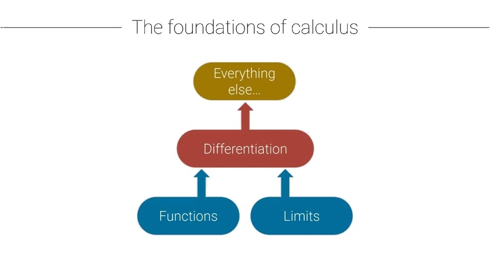
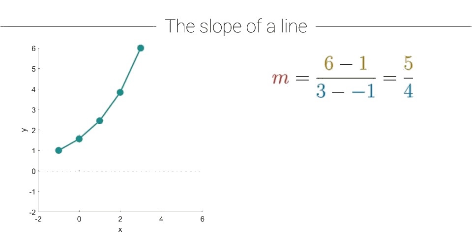
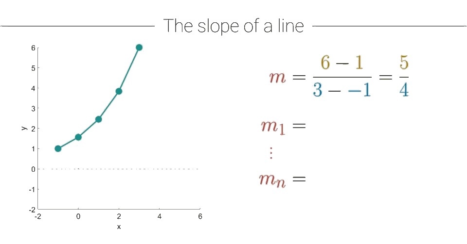
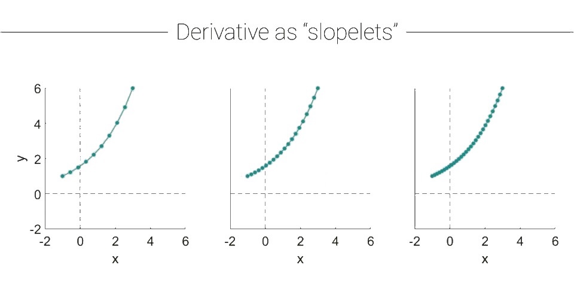
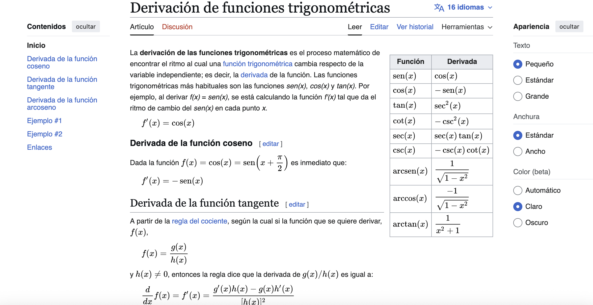

```{r}
knitr::opts_chunk$set(echo = TRUE)
library(reticulate)
use_python("/opt/anaconda3/bin/python")
```


# Derivada {.my-slide}

## Diferenciación: Resumen de la sección y objetivos {.title-line}

::: {style="display: flex; flex-direction: column; justify-content: center; flex: 1; min-height: 0; padding: 0 2em; gap: 0.9em; font-size: 1.5em;"}

[En esta presentación, aprenderás]{style="color: goldenrod;"}

- [El concepto y definición de una "derivada" en cálculo.]{style="color: #c0392b;"}

- [Terminología y notación de las derivadas.]{style="color: navy;"}

- [Derivadas de la mayoría de las funciones.]{style="color: teal;"}

- [Puntos críticos.]{style="color: #c0392b;"}

:::

## {auto-animate=true background-color="rgb(255, 255, 255)" .white-canvas}

::: {style="text-align:center; margin:0; padding:0;"}
{#slide-img width="100%"}
:::

---

## Términos y Condiciones {.title-line}

::: {style="display: grid; grid-template-columns: 1fr 1.8fr; column-gap: 1.5em; row-gap: 3em; align-content: center; align-items: center; height: 75vh; padding: 0 2em;"}

[**Derivada:**]{style="color: #b8860b; font-size: 1.8em; font-weight: bold; text-align: right;"}

[La secuencia de pendientes instantáneas.]{style="color: #c0392b; font-size: 1.8em;"}

[**Diferenciación:**]{style="color: #c0392b; font-size: 1.8em; font-weight: bold; text-align: right;"}

[El proceso de encontrar la derivada.]{style="color: #c0392b; font-size: 1.8em;"}

:::

## Pendiente de una recta {.title-line}

::: {style="display: flex; flex-direction: column; justify-content: center; flex: 1; min-height: 0; padding: 0 2em; gap: 0.9em; font-size: 1.5em;"}

[En esta presentación, aprenderás]{style="color: goldenrod;"}

- [El concepto y la definición de una pendiente.]{style="color: #c0392b;"}

- [Por qué la pendiente no es útil para muchas funciones.]{style="color: navy;"}

- [El papel de los límites en el cálculo de la derivada.]{style="color: teal;"}

:::

## Pendiente {.title-line}

::: {style="display: grid; grid-template-columns: 1fr 1.3fr; flex: 1; min-height: 0; gap: 0.5em; padding: 0 0.5em; align-items: start; font-size: 1em;"}

:::{}
::: {.r-stack}

<!-- Graph A: línea limpia (estado base) -->
:::{}
```{python}
#| echo: false
#| fig-align: center
#| results: 'hide'
#| fig-width: 6
#| fig-height: 6
import matplotlib.pyplot as plt
import numpy as np
fig, ax = plt.subplots(figsize=(6.3, 6.3))
ax.plot([-1, 3], [1, 6], color='#107895', linewidth=2.5, zorder=5)
ax.plot([-1, 3], [1, 6], 'o', color='#107895', markersize=9, zorder=6)
ax.spines['left'].set_position('zero')
ax.spines['bottom'].set_position('zero')
ax.spines['top'].set_visible(False)
ax.spines['right'].set_visible(False)
ax.set_xlim(-2, 6); ax.set_ylim(-2, 6)
ax.set_xticks([i for i in range(-2, 7) if i != 0])
ax.set_yticks([i for i in range(-2, 7) if i != 0])
ax.set_xlabel('X', fontsize=18, fontweight='bold')
ax.set_ylabel('Y', fontsize=18, rotation=0, fontweight='bold')
ax.yaxis.set_label_coords(-0.08, 1.0)
plt.tight_layout(); plt.show()
```
:::

<!-- Graph B: con etiquetas p₁, p₂ y líneas punteadas doradas (frag 2) -->
::: {.fragment .fade-in data-fragment-index=2 style="background: white;"}
```{python}
#| echo: false
#| fig-align: center
#| results: 'hide'
#| fig-width: 6
#| fig-height: 6
import matplotlib.pyplot as plt
import numpy as np
fig, ax = plt.subplots(figsize=(6.3, 6.3))
ax.plot([-1, 3], [1, 6], color='#107895', linewidth=2.5, zorder=5)
ax.plot([-1, 3], [1, 6], 'o', color='#107895', markersize=9, zorder=6)
ax.annotate('$p_1$', (-1, 1), textcoords="offset points", xytext=(-20, 8), fontsize=12, color='#107895')
ax.annotate('$p_2$', (3, 6), textcoords="offset points", xytext=(5, 5), fontsize=12, color='#107895')
ax.plot([-1, 3], [1, 1], '--', color='#B8860B', linewidth=1.8, zorder=4)
ax.plot([3, 3], [1, 6], '--', color='#B8860B', linewidth=1.8, zorder=4)
ax.spines['left'].set_position('zero')
ax.spines['bottom'].set_position('zero')
ax.spines['top'].set_visible(False)
ax.spines['right'].set_visible(False)
ax.set_xlim(-2, 6); ax.set_ylim(-2, 6)
ax.set_xticks([i for i in range(-2, 7) if i != 0])
ax.set_yticks([i for i in range(-2, 7) if i != 0])
ax.set_xlabel('X', fontsize=18, fontweight='bold')
ax.set_ylabel('Y', fontsize=18, rotation=0, fontweight='bold')
ax.yaxis.set_label_coords(-0.08, 1.0)
plt.tight_layout(); plt.show()
```
:::

:::
:::

::: {style="display: grid; grid-template-columns: 1fr 1fr; gap: 0.3em; padding-top: 1.2em; align-items: start; font-size: 1.4em;"}

::: {style="display: flex; flex-direction: column; gap: 0.4em;"}

::: {.fragment .fade-in data-fragment-index=1}
$$f({\color{teal} x}) = {\color{red} m}{\color{teal} x} + {\color{blue} b}$$
:::

::: {.fragment .fade-in data-fragment-index=2}
$${\color{red} m} = \frac{{\color{goldenrod} y_2}-{\color{goldenrod} y_1}}{{\color{teal} x_2}-{\color{teal} x_1}}$$
$$= \frac{{\color{goldenrod} \Delta y}}{{\color{teal} \Delta x}}$$
:::

:::

::: {style="display: flex; flex-direction: column; gap: 0.4em;"}

::: {.fragment .fade-in data-fragment-index=3}
$${\color{red} m} = \frac{{\color{goldenrod} 6}-{\color{goldenrod} 1}}{{\color{teal} 3}-({\color{teal} -1})}$$
$$= \frac{{\color{goldenrod} 5}}{{\color{teal} 4}}$$
:::

:::

:::

:::

---

::: {style="display: grid; grid-template-columns: 1fr 1.3fr; flex: 1; min-height: 0; gap: 0.5em; padding: 0 0.5em; align-items: start; font-size: 0.85em;"}

:::{}
```{python}
#| echo: false
#| fig-align: center
#| results: 'hide'
#| fig-width: 6
#| fig-height: 6
import matplotlib.pyplot as plt
import numpy as np
fig, ax = plt.subplots(figsize=(6.3, 6.3))
# Segmentos por partes
ax.plot([-1, 1, 3], [1, 2, 6], color='#107895', linewidth=2.5, zorder=5)
ax.plot([-1, 1, 3], [1, 2, 6], 'o', color='#107895', markersize=9, zorder=6)
# Cuerda total (dashed roja)
ax.plot([-1, 3], [1, 6], '--', color='#c0392b', linewidth=2.0, zorder=4)
# Etiquetas
ax.text(0.7, 1.3, '$m_1$', fontsize=18, color='#107895', style='italic')
ax.text(2.5, 4.3, '$m_2$', fontsize=18, color='#107895', style='italic')
ax.text(1, 4, '$m$', fontsize=18, color='#c0392b', style='italic')
ax.spines['left'].set_position('zero')
ax.spines['bottom'].set_position('zero')
ax.spines['top'].set_visible(False)
ax.spines['right'].set_visible(False)
ax.set_xlim(-2, 6); ax.set_ylim(-2, 6)
ax.set_xticks([i for i in range(-2, 7) if i != 0])
ax.set_yticks([i for i in range(-2, 7) if i != 0])
ax.set_xlabel('X', fontsize=18, fontweight='bold')
ax.set_ylabel('Y', fontsize=18, rotation=0, fontweight='bold')
ax.yaxis.set_label_coords(-0.08, 1.0)
plt.tight_layout(); plt.show()
```
:::

::: {style="display: flex; flex-direction: column; gap: 0.5em; padding-top: 1.2em; font-size: 1.7em;"}

$${\color{red} m} = \frac{{\color{goldenrod} 6}-{\color{goldenrod} 1}}{{\color{teal} 3}-({\color{teal} -1})} = \frac{{\color{goldenrod} 5}}{{\color{teal} 4}}$$

::: {.fragment .fade-in data-fragment-index=1}
$${\color{red} m_1} = \frac{{\color{goldenrod} 2}-{\color{goldenrod} 1}}{{\color{teal} 1}-({\color{teal} -1})} = \frac{{\color{goldenrod} 1}}{{\color{teal} 2}}$$
:::

::: {.fragment .fade-in data-fragment-index=2}
$${\color{red} m_2} = \frac{{\color{goldenrod} 6}-{\color{goldenrod} 2}}{{\color{teal} 3}-{\color{teal} 1}} = \frac{{\color{goldenrod} 4}}{{\color{teal} 2}}$$
:::

:::

:::


## {auto-animate=true background-color="rgb(255, 255, 255)" .white-canvas}

::: {style="text-align:center; margin:0; padding:0;"}
{#slide-img width="100%"}
:::

---

## {auto-animate=true background-color="rgb(255, 255, 255)" .white-canvas}

::: {style="text-align:center; margin:0; padding:0;"}
{#slide-img width="100%"}
:::

---

## {auto-animate=true background-color="rgb(255, 255, 255)" .white-canvas}

::: {style="text-align:center; margin:0; padding:0;"}
{#slide-img width="100%"}
:::

---


## Conclusiones {.title-line}

::: {style="display: flex; flex-direction: column; justify-content: center; flex: 1; min-height: 0; padding: 0 5em; gap: 1.8em;"}

::: {.fragment .fade-in data-fragment-index=1}
[La pendiente es ideal para una línea recta.]{style="color: #b8860b; font-size: 1.5em;"}
:::

::: {.fragment .fade-in data-fragment-index=2}
[La pendiente para una línea curva o definida por partes es informativa pero imprecisa..]{style="color: #8B1A1A; font-size: 1.5em;"}
:::

::: {.fragment .fade-in data-fragment-index=3}
[**Calcular pendientes de secciones (segmentos).**]{style="color: #107895; font-size: 1.5em;"}
:::

::: {.fragment .fade-in data-fragment-index=4}
[La derivada es la "serie de pendientes" a medida que el ancho del segmento $\to 0$]{style="color: #107895; font-size: 1.5em;"}
:::

:::


## Desde la pendiente a derivada {.title-line}

::: {style="display: grid; grid-template-columns: 9em 1fr; align-items: center; align-content: center; flex: 1; min-height: 0; padding: 0 1em; row-gap: 0.1em; font-size: 0.85em;"}

::: {.fragment .fade-in data-fragment-index=5 style="color:#c0392b; font-style:italic; font-size:0.85em; line-height:1.4; text-align:right; padding-right:0.7em;"}
**Pendiente** cuando $\color{blue}{\Delta} \color{blue}{x}$ es grande.
:::


::: {.fragment .fade-in data-fragment-index=5 style="border: 2px dashed #c0392b; border-radius: 6px; padding: 0.15em 0.7em; justify-self: start;"}
$${\color{red} m} = \frac{{\color{goldenrod}{y_2}-\color{goldenrod}{y_1}}}{{\color{teal}{x_2}-\color{teal}{x_1}}} = \frac{\Delta{\color{goldenrod}{y}}}{{\color{blue}{\Delta}  \color{blue}{x}}}$$
:::

::: {}
:::

::: {.fragment .fade-in data-fragment-index=1 style="margin-left: 3em;"}
$${\color{red} m} = \frac{{\color{goldenrod}{y_2}-\color{goldenrod}{y_1}}}{{\color{teal}{x_2}-\color{teal}{x_1}}} = \frac{\Delta{\color{goldenrod}{y}}}{{\color{blue}{\Delta}  \color{blue}{x}}}$$
:::

::: {}
:::

::: {.fragment .fade-in data-fragment-index=2 style="margin-left: 3em;"}
$$= \frac{f({\color{teal} x} + {\color{blue} \Delta} {\color{blue} x}) - f({\color{teal} x})}{{\color{blue} \Delta} {\color{blue} x}}$$
:::

::: {}
:::

::: {.fragment .fade-in data-fragment-index=3 style="margin-left: 3em;"}
$$= \frac{f({\color{teal} x}+{\color{blue} h}) - f({\color{teal} x})}{{\color{blue} h}}$$
:::

::: {.fragment .fade-in data-fragment-index=6 style="color:#c0392b; font-style:italic; font-size:0.85em; line-height:1.4; text-align:right; padding-right:0.7em;margin-top: -2.5em;"}
**Derivada** cuando $\color{blue}{\Delta} \color{blue}{x}$ → 0, es infinitesimal.
:::

::: {.fragment .fade-in data-fragment-index=4 style="margin-left: 3em;"}
$$\frac{dy}{dx} = \lim_{{\color{blue} h} \to {\color{maroon}{0}}}\left[\frac{f({\color{teal} x}+{\color{blue} h})-f({\color{teal} x})}{{\color{blue} h}}\right] = {\color{blue}{\text{...}}}$$ 
:::


::: {.fragment .fade-in data-fragment-index=6 style="border: 2px dashed #c0392b; border-radius: 6px; padding: 0.15em 0.7em; justify-self: start;margin-top: -2.5em;"}
$$\frac{dy}{dx} = \lim_{{\color{blue} h} \to {\color{maroon}{0}}}\left[\frac{f({\color{teal} x}+{\color{blue} h})-f({\color{teal} x})}{{\color{blue} h}}\right] = {\color{blue}{\text{...}}}$$ 
:::

:::

## Ejemplo de cálculo de la derivada 1a {.title-line}

::: {style="display: grid; grid-template-columns: 1fr 1.2fr; flex: 1; min-height: 0; gap: 0.5em; padding: 0 0.5em; align-items: start; font-size: 0.88em;"}

<!-- Columna izquierda: gráfico + función -->
:::{}

```{python}
#| echo: false
#| fig-width: 6
#| fig-height: 6
#| results: 'hide'
import matplotlib.pyplot as plt
import numpy as np

fig, ax = plt.subplots(figsize=(6.3, 6.3))

# Segmento de línea
ax.plot([-1, 3], [1, 6], color='#107895', linewidth=2.5)
ax.plot([-1], [1], 'o', color='#107895', markersize=9)
ax.plot([3],  [6], 'o', color='#107895', markersize=9)

# Línea vertical punteada en x=0
ax.axvline(x=0, color='#999999', linestyle='--', linewidth=1)

# Ejes centrados en cero
ax.spines['left'].set_position('zero')
ax.spines['bottom'].set_position('zero')
ax.spines['top'].set_visible(False)
ax.spines['right'].set_visible(False)

ax.set_xlim(-2, 6)
ax.set_ylim(-2, 6)
ax.set_xticks([i for i in range(-2, 7) if i != 0])
ax.set_yticks([i for i in range(-2, 7) if i != 0])
ax.tick_params(labelsize=10)

# Etiquetas de ejes
ax.text(6.3, 0, 'X', va='center', fontsize=12, fontweight='bold')
ax.text(0.1, 6.3, 'Y', ha='left', fontsize=12, fontweight='bold')

plt.tight_layout()
plt.show()
```

::: {.fragment .fade-in data-fragment-index=1}
$$f({\color{teal} x}) = \frac{5}{4}{\color{teal} x} + \frac{9}{4}$$
:::

:::

<!-- Columna derecha: ecuaciones -->
::: {style="display: flex; flex-direction: column; justify-content: flex-start; gap: 0.4em; padding-top: 1em;"}

::: {.fragment .fade-in data-fragment-index=2}
$${\color{red} m} = \lim_{{\color{teal} h} \to 1}\left[\frac{f({\color{teal} x}+{\color{teal} h})-f({\color{teal} x})}{{\color{teal} h}}\right]$$
:::

::: {.fragment .fade-in data-fragment-index=3}
$$= \left[\frac{\left(\dfrac{5}{4}({\color{maroon} 0}+1)+\dfrac{9}{4}\right)-\left(\dfrac{5}{4}\cdot{\color{maroon} 0}+\dfrac{9}{4}\right)}{{\color{teal} 1}}\right]$$
:::

::: {.fragment .fade-in data-fragment-index=4}
$$= \left(\frac{5}{4}+\frac{9}{4}\right)-\frac{9}{4}$$
:::

::: {.fragment .fade-in data-fragment-index=5}
$${\color{blue} = \frac{5}{4}}$$
:::

:::

:::

## Ejemplo de cálculo de la derivada 1b {.title-line}

::: {style="display: grid; grid-template-columns: 1fr 1.3fr; flex: 1; min-height: 0; gap: 0.5em; padding: 0 0.5em; align-items: start; font-size: 0.82em;"}

<!-- Columna izquierda: gráfico + función (estado base) -->
:::{}

```{python}
#| echo: false
#| fig-width: 5
#| fig-height: 5
#| results: 'hide'
import matplotlib.pyplot as plt
import numpy as np

fig, ax = plt.subplots(figsize=(6.3, 6.3))
ax.plot([-1, 3], [1, 6], color='#107895', linewidth=2.5)
ax.plot([-1], [1], 'o', color='#107895', markersize=9)
ax.plot([3],  [6], 'o', color='#107895', markersize=9)
ax.axvline(x=0, color='#999999', linestyle='--', linewidth=1)
ax.spines['left'].set_position('zero')
ax.spines['bottom'].set_position('zero')
ax.spines['top'].set_visible(False)
ax.spines['right'].set_visible(False)
ax.set_xlim(-2, 6)
ax.set_ylim(-2, 6)
ax.set_xticks([i for i in range(-2, 7) if i != 0])
ax.set_yticks([i for i in range(-2, 7) if i != 0])
ax.tick_params(labelsize=10)
ax.text(6.3, 0, 'X', va='center', fontsize=12,fontweight='bold')
ax.text(0.1, 6.3, 'Y', ha='left', fontsize=12,fontweight='bold')
plt.tight_layout()
plt.show()
```

$$f({\color{teal} x}) = \frac{5}{4}{\color{teal} x} + \frac{9}{4}$$

:::

<!-- Columna derecha: ecuaciones (base + fragmentos) -->
::: {style="display: flex; flex-direction: column; gap: 0.35em; padding-top: 0.5em;"}

$$\frac{d{\color{goldenrod} y}}{d{\color{teal} x}} = \lim_{{\color{teal} h} \to 0}\left[\frac{f({\color{teal} x}+{\color{teal} h})-f({\color{teal} x})}{{\color{teal} h}}\right]$$

::: {.fragment .fade-in data-fragment-index=1}
$$= \lim_{{\color{teal} h} \to 0}\left[\frac{\left(\tfrac{5}{4}({\color{teal} x}+{\color{teal} h})+\tfrac{9}{4}\right)-\left(\tfrac{5}{4}{\color{teal} x}+\tfrac{9}{4}\right)}{{\color{teal} h}}\right]$$
:::

::: {.fragment .fade-in data-fragment-index=2}
$$= \lim_{{\color{teal} h} \to 0}\left[\frac{\tfrac{5}{4}{\color{teal} x}+\tfrac{5}{4}{\color{teal} h}+\tfrac{9}{4}-\tfrac{5}{4}{\color{teal} x}-\tfrac{9}{4}}{{\color{teal} h}}\right]$$
:::

::: {.fragment .fade-in data-fragment-index=3}
$$= \lim_{{\color{teal} h} \to 0}\left[\frac{\tfrac{5}{4}{\color{teal} h}}{{\color{teal} h}}\right]$$
:::

::: {.fragment .fade-in data-fragment-index=4}
$${\color{blue} = \frac{5}{4}}$$
:::

:::

:::

## Ejemplo de cálculo de la derivada 2 {.title-line}

::: {style="display: grid; grid-template-columns: 1fr 1.3fr; flex: 1; min-height: 0; gap: 0.5em; padding: 0 0.5em; align-items: start; font-size: 0.82em;"}

:::{}
```{python}
#| echo: false
#| fig-align: center
#| fig-width: 5
#| fig-height: 5
#| results: 'hide'
import matplotlib.pyplot as plt
import numpy as np

fig, ax = plt.subplots(figsize=(5.8, 5.8))

x = np.linspace(-2, 6, 400)
y = x**2

ax.plot(x, y, color='#107895', linewidth=2.5)

ax.axvline(x=0, color='gray', linestyle='--', linewidth=1, alpha=0.5)
ax.axhline(y=0, color='gray', linestyle='--', linewidth=1, alpha=0.5)

ax.spines['left'].set_position('zero')
ax.spines['bottom'].set_position('zero')
ax.spines['top'].set_visible(False)
ax.spines['right'].set_visible(False)

ax.set_xlim(-2, 6)
ax.set_ylim(-2, 6)
ax.set_xticks([i for i in range(-2, 7) if i != 0])
ax.set_yticks([i for i in range(-2, 7) if i != 0])

ax.text(6.3, 0, 'X', va='center', fontsize=12,fontweight='bold')
ax.text(0.1, 6.3, 'Y', ha='left', fontsize=12,fontweight='bold')
ax.text(3.2, 5.5, r'$f(x)=x^2$', fontsize=18, color='#080a0a')

plt.tight_layout()
plt.show()
```

$$f({\color{teal} x}) = {\color{teal} x}^2$$

$$\frac{d{\color{goldenrod} y}}{d{\color{teal} x}} = \lim_{{\color{teal} h} \to 0}\left[\frac{({\color{teal} x}+{\color{teal} h})^2 - {\color{teal} x}^2}{{\color{teal} h}}\right]$$
:::

::: {style="display: flex; flex-direction: column; gap: 0.35em; padding-top: 0.5em;font-size: 1.3em;"}

::: {.fragment .fade-in data-fragment-index=1}
$$= \lim_{{\color{teal} h} \to 0}\left[\frac{{\color{teal} x}^2 + 2{\color{teal} x}{\color{teal} h} + {\color{teal} h}^2 - {\color{teal} x}^2}{{\color{teal} h}}\right]$$
:::

::: {.fragment .fade-in data-fragment-index=2}
$$= \lim_{{\color{teal} h} \to 0}\left[\frac{{\color{teal} h}(2{\color{teal} x} + {\color{teal} h})}{{\color{teal} h}}\right]$$
:::

::: {.fragment .fade-in data-fragment-index=3}
$$= \lim_{{\color{teal} h} \to 0}\left[2{\color{teal} x} + {\color{teal} h}\right]$$
:::

::: {.fragment .fade-in data-fragment-index=4}
$${\frac{d{\color{goldenrod}{y}}}{{d\color{teal}{x}}} = 2{\color{teal}{x}}}$$
:::

:::

:::

## Graficando la derivada {.title-line}

::: {style="display: grid; grid-template-columns: 1fr 1fr; grid-template-rows: 1fr 1fr; flex: 1; min-height: 0; gap: 0.3em; padding: 0.2em 0.5em; font-size: 0.8em;"}

:::{}
```{python}
#| echo: false
#| fig-align: center
#| results: 'hide'
#| fig-width: 5
#| fig-height: 5
import matplotlib.pyplot as plt
import numpy as np

fig, ax = plt.subplots(figsize=(4.2,3.8))
x = np.linspace(-2, 6, 400)
y = 1.25*x + 2.25
ax.plot(x, y, color='#107895', linewidth=2.5)
ax.axvline(x=0, color='gray', linestyle='--', linewidth=1, alpha=0.5)
ax.axhline(y=0, color='gray', linestyle='--', linewidth=1, alpha=0.5)
ax.spines['left'].set_position('zero')
ax.spines['bottom'].set_position('zero')
ax.spines['top'].set_visible(False)
ax.spines['right'].set_visible(False)
ax.set_xlim(-2, 6); ax.set_ylim(-2, 6)
ax.set_xticks([i for i in range(-2, 7) if i != 0])
ax.set_yticks([i for i in range(-2, 7) if i != 0])
ax.set_xlabel('X', labelpad=2, fontsize=14, fontweight='bold')
ax.set_ylabel('Y', labelpad=2, fontsize=14, rotation=0, fontweight='bold')
ax.yaxis.set_label_coords(-0.08, 1.0)
ax.text(2.5, 4.8, r'$f(\mathit{x}) = \frac{5}{4}\mathit{x} + \frac{9}{4}$', fontsize=14, color='#107895')
plt.tight_layout(); plt.show()
```
:::

:::{}
```{python}
#| echo: false
#| fig-align: center
#| results: 'hide'
#| fig-width: 5
#| fig-height: 5
import matplotlib.pyplot as plt
import numpy as np

fig, ax = plt.subplots(figsize=(4.2,3.8))
x = np.linspace(-2, 3, 400)
y = x**2
ax.plot(x, y, color='#107895', linewidth=2.5)
ax.axvline(x=0, color='gray', linestyle='--', linewidth=1, alpha=0.5)
ax.axhline(y=0, color='gray', linestyle='--', linewidth=1, alpha=0.5)
ax.spines['left'].set_position('zero')
ax.spines['bottom'].set_position('zero')
ax.spines['top'].set_visible(False)
ax.spines['right'].set_visible(False)
ax.set_xlim(-2, 6); ax.set_ylim(-2, 6)
ax.set_xticks([i for i in range(-2, 7) if i != 0])
ax.set_yticks([i for i in range(-2, 7) if i != 0])
ax.set_xlabel('X', labelpad=2, fontsize=14, fontweight='bold')
ax.set_ylabel('Y', labelpad=2, fontsize=14, rotation=0, fontweight='bold')
ax.yaxis.set_label_coords(-0.08, 1.0)
ax.text(2.5, 4.8, r'$f(\mathit{x}) = \mathit{x}^2$', fontsize=14, color='#107895')
plt.tight_layout(); plt.show()
```
:::

:::{}
```{python}
#| echo: false
#| fig-align: center
#| results: 'hide'
#| fig-width: 5
#| fig-height: 5
import matplotlib.pyplot as plt
import numpy as np

fig, ax = plt.subplots(figsize=(4.2,3.8))
x_range = np.linspace(-2, 6, 400)
ax.plot(x_range, np.full_like(x_range, 1.25), color='#107895', linewidth=2.5)
ax.axvline(x=0, color='gray', linestyle='--', linewidth=1, alpha=0.5)
ax.axhline(y=0, color='gray', linestyle='--', linewidth=1, alpha=0.5)
ax.spines['left'].set_position('zero')
ax.spines['bottom'].set_position('zero')
ax.spines['top'].set_visible(False)
ax.spines['right'].set_visible(False)
ax.set_xlim(-2, 6); ax.set_ylim(-2, 6)
ax.set_xticks([i for i in range(-2, 7) if i != 0])
ax.set_yticks([i for i in range(-2, 7) if i != 0])
ax.set_xlabel('X', labelpad=2, fontsize=14, fontweight='bold')
ax.set_ylabel('dy/dx', labelpad=2, fontsize=14, rotation=0, fontweight='bold')
ax.yaxis.set_label_coords(-0.15, 1.02)
ax.text(1.8, 3.2, r'$d\mathit{y}/d\mathit{x} = 5/4$', fontsize=14, color='#107895')
plt.tight_layout(); plt.show()
```
:::

:::{}
```{python}
#| echo: false
#| fig-align: center
#| results: 'hide'
#| fig-width: 5
#| fig-height: 5
import matplotlib.pyplot as plt
import numpy as np

fig, ax = plt.subplots(figsize=(4.2,3.8))
x = np.linspace(-2, 6, 400)
y = 2*x
ax.plot(x, y, color='#107895', linewidth=2.5)
ax.axvline(x=0, color='gray', linestyle='--', linewidth=1, alpha=0.5)
ax.axhline(y=0, color='gray', linestyle='--', linewidth=1, alpha=0.5)
ax.spines['left'].set_position('zero')
ax.spines['bottom'].set_position('zero')
ax.spines['top'].set_visible(False)
ax.spines['right'].set_visible(False)
ax.set_xlim(-2, 6); ax.set_ylim(-2, 6)
ax.set_xticks([i for i in range(-2, 7) if i != 0])
ax.set_yticks([i for i in range(-2, 7) if i != 0])
ax.set_xlabel('X', labelpad=2, fontsize=14, fontweight='bold')
ax.set_ylabel('dy/dx', labelpad=2, fontsize=14, rotation=0, fontweight='bold')
ax.yaxis.set_label_coords(-0.15, 1.02)
ax.text(2.0, 3.8, r'$d\mathit{y}/d\mathit{x} = 2\mathit{x}$', fontsize=14, color='#107895')
plt.tight_layout(); plt.show()
```
:::

:::

## Recapitulando {.title-line}

::: {style="display: grid; grid-template-columns: 9em 1fr; align-items: center; align-content: center; flex: 1; min-height: 0; padding: 0 1em; row-gap: 0.1em; font-size: 0.85em;"}

::: {.fragment .fade-in data-fragment-index=5 style="color:#c0392b; font-style:italic; font-size:0.85em; line-height:1.4; text-align:right; padding-right:0.7em;"}
**Pendiente** cuando $\color{blue}{\Delta} \color{blue}{x}$ es grande.
:::


::: {.fragment .fade-in data-fragment-index=5 style="border: 2px dashed #c0392b; border-radius: 6px; padding: 0.15em 0.7em; justify-self: start;"}
$${\color{red} m} = \frac{{\color{goldenrod}{y_2}-\color{goldenrod}{y_1}}}{{\color{teal}{x_2}-\color{teal}{x_1}}} = \frac{\Delta{\color{goldenrod}{y}}}{{\color{blue}{\Delta}  \color{blue}{x}}}$$
:::

::: {}
:::

::: {.fragment .fade-in data-fragment-index=1 style="margin-left: 3em;"}
$${\color{red} m} = \frac{{\color{goldenrod}{y_2}-\color{goldenrod}{y_1}}}{{\color{teal}{x_2}-\color{teal}{x_1}}} = \frac{\Delta{\color{goldenrod}{y}}}{{\color{blue}{\Delta}  \color{blue}{x}}}$$
:::

::: {}
:::

::: {.fragment .fade-in data-fragment-index=2 style="margin-left: 3em;"}
$$= \frac{f({\color{teal} x} + {\color{blue} \Delta} {\color{blue} x}) - f({\color{teal} x})}{{\color{blue} \Delta} {\color{blue} x}}$$
:::

::: {}
:::

::: {.fragment .fade-in data-fragment-index=3 style="margin-left: 3em;"}
$$= \frac{f({\color{teal} x}+{\color{blue} h}) - f({\color{teal} x})}{{\color{blue} h}}$$
:::

::: {.fragment .fade-in data-fragment-index=6 style="color:#c0392b; font-style:italic; font-size:0.85em; line-height:1.4; text-align:right; padding-right:0.7em;margin-top: -2.5em;"}
**Derivada** cuando $\color{blue}{\Delta} \color{blue}{x}$ → 0, es infinitesimal.
:::

::: {.fragment .fade-in data-fragment-index=4 style="margin-left: 3em;"}
$$\frac{dy}{dx} = \lim_{{\color{blue} h} \to {\color{maroon}{0}}}\left[\frac{f({\color{teal} x}+{\color{blue} h})-f({\color{teal} x})}{{\color{blue} h}}\right] = {\color{blue}{\text{...}}}$$ 
:::


::: {.fragment .fade-in data-fragment-index=6 style="border: 2px dashed #c0392b; border-radius: 6px; padding: 0.15em 0.7em; justify-self: start;margin-top: -2.5em;"}
$$\frac{dy}{dx} = \lim_{{\color{blue} h} \to {\color{maroon}{0}}}\left[\frac{f({\color{teal} x}+{\color{blue} h})-f({\color{teal} x})}{{\color{blue} h}}\right] = {\color{blue}{\text{...}}}$$ 
:::

:::

## Definición formal de la derivada  {.title-line}

::: {style="display: flex; flex-direction: column; justify-content: center; flex: 1; min-height: 0; padding: 0 5em; gap: 1em; font-size: 1.3em;"}


::: {.fragment .fade-in data-fragment-index=1}

[La relación entre la pendiente y la derivada.]{style="color: #b8860b; font-size: 1.2em;"}
:::

::: {.fragment .fade-in data-fragment-index=2}

[La definición formal de una derivada (pista: ¡pendiente + límite!).]{style="color: #8B1A1A; font-size: 1.2em; font-weight: bold; text-align: right;"}
:::

::: {.fragment .fade-in data-fragment-index=4}

[Algunos ejemplos de cálculo de la derivada.]{style="color:#107895; font-size: 1.2em; font-weight: bold; text-align: right;"}
:::

:::

## La derivada de una constante es 0 (demostración) {.title-line}

::: {style="display: flex; flex-direction: column; justify-content: center; flex: 1; min-height: 0; padding: 0 2em; gap: 0.9em; font-size: 1.5em;"}

[En esta presentación, aprenderás]{style="color: goldenrod;"}

- [Demostrarás lo que dice el título...]{style="color: #c0392b;"}

- [Tendrás la oportunidad de ganar más experiencia con la definición de límite de las derivadas.]{style="color: navy;"}

- [Aprenderás cómo usar la definición de derivadas en demostraciones.]{style="color: teal;"}

:::

## Derivada de una constante {.title-line}

::: {style="display: flex; flex-direction: column; justify-content: center; align-items: center; flex: 1; min-height: 0; gap: 1.8em; font-size: 1.3em;"}

$${\color{goldenrod} f}({\color{teal} x}) = {\color{red} c}$$

::: {.fragment .fade-in data-fragment-index=1 style="width: 75%; height: 3px; background-color: #1a237e; border-radius: 2px;"}
:::

::: {.fragment .fade-in data-fragment-index=2}
$$\frac{d}{d{\color{teal} x}}{\color{goldenrod} f}({\color{teal} x}) = 0$$
:::

:::

## Proof usando la definición de límite de la derivada {.title-line}

::: {style="display: flex; flex-direction: column; justify-content: center; align-items: center; flex: 1; min-height: 0; gap: 1.5em; font-size: 1.3em;"}

$${\color{goldenrod} f}({\color{teal} x}) = {\color{red} c}$$

::: {.fragment .fade-in data-fragment-index=1}
$$\frac{d{\color{goldenrod} f}}{d{\color{teal} x}} = \lim_{{\color{blue} h} \to 0} \frac{{\color{goldenrod} f}({\color{teal} x}+{\color{blue} h}) - {\color{goldenrod} f}({\color{teal} x})}{{\color{blue} h}}$$
:::

::: {.fragment .fade-in data-fragment-index=2}
$$= \lim_{{\color{blue} h} \to 0} \frac{{\color{red} c} - {\color{red} c}}{{\color{blue} h}} = 0$$
:::

:::


## Varias notaciones de la derivada {.title-line}

::: {style="display: flex; flex-direction: column; justify-content: center; flex: 1; min-height: 0; padding: 0 2em; gap: 0.9em; font-size: 1.5em;"}

[En esta presentación, aprenderás]{style="color: goldenrod;"}

- [Varias notaciones diferentes de diferenciación.]{style="color: #c0392b;"}

- [Algunas ventajas y desventajas de cada notación.]{style="color: navy;"}

- [La interpretación geométrica de la derivada.]{style="color: teal;"}

:::

## Diferentes notaciones de la derivada {.title-line}

::: {style="display: grid; grid-template-columns: 9em 1fr 1fr; flex: 1; min-height: 0; gap: 1em; padding: 0 1em; align-items: start; font-size: 1.2em;"}

::: {style="display: flex; flex-direction: column; gap: 1.4em; padding-top: 0.8em; border-right: 2px solid #ccc; padding-right: 0.8em; font-size: 1.1em;"}
[**Leibniz**]{style="color: #b8860b; font-weight: bold;"}
[Lagrange]{style="color: #555;"}
[Newton]{style="color: #555;"}
[Euler]{style="color: #555;"}
:::

::: {.fragment .fade-in data-fragment-index=1 style="display: flex; flex-direction: column; gap: 0.5em; padding-top: 0.4em;"}
$$\frac{d{\color{goldenrod} y}}{d{\color{teal} x}} = \frac{d{\color{goldenrod} f}}{d{\color{teal} x}} = \frac{d}{d{\color{teal} x}}{\color{goldenrod} f}({\color{teal} x})$$

$$\frac{d^2{\color{goldenrod} y}}{d{\color{teal} x}^2}$$

::: {.fragment .fade-in data-fragment-index=2}
$$\frac{d{\color{goldenrod} y}}{d{\color{teal} x}} = \frac{d{\color{goldenrod} y}}{d{\color{teal} u}} \cdot \frac{d{\color{teal} u}}{d{\color{teal} x}}$$
:::
:::

::: {.fragment .fade-in data-fragment-index=2 style="padding-top: 0.4em; font-size: 0.9em;"}
**[Ventajas:]{style="color: #1a237e;"}**

- Clara (inequívoca)
- Fácil para la regla de la cadena

**[Desventajas:]{style="color: #107895;"}**

- Ocupa más espacio
:::

:::

---

::: {style="display: grid; grid-template-columns: 9em 1fr 1fr; flex: 1; min-height: 0; gap: 1em; padding: 0 1em; align-items: start; font-size: 1.2em;"}

::: {style="display: flex; flex-direction: column; gap: 1.4em; padding-top: 0.8em; border-right: 2px solid #ccc; padding-right: 0.8em; font-size: 1.1em;"}
[Leibniz]{style="color: #555;"}
[**Lagrange**]{style="color: #b8860b; font-weight: bold;"}
[Newton]{style="color: #555;"}
[Euler]{style="color: #555;"}
:::

::: {.fragment .fade-in data-fragment-index=1 style="display: flex; flex-direction: column; gap: 0.5em; padding-top: 0.4em;"}
$${\color{goldenrod} f}'({\color{teal} x}) = {\color{goldenrod} f}' = {\color{goldenrod} f}_{\color{teal} x}$$

::: {.fragment .fade-in data-fragment-index=2}
$${\color{goldenrod} f}'' = {\color{goldenrod} f}_{{\color{teal} x}{\color{teal} x}}$$
:::
:::

::: {.fragment .fade-in data-fragment-index=2 style="padding-top: 0.4em; font-size: 0.9em;"}
**[Ventajas:]{style="color: #1a237e;"}**

- Simple y elegante
- Conveniente para derivadas parciales

**[Desventajas:]{style="color: #107895;"}**

- Puede ser ambigua (omite la variable)
:::

:::

---

::: {style="display: grid; grid-template-columns: 9em 1fr 1fr; flex: 1; min-height: 0; gap: 1em; padding: 0 1em; align-items: start; font-size: 1.2em;"}

::: {style="display: flex; flex-direction: column; gap: 1.4em; padding-top: 0.8em; border-right: 2px solid #ccc; padding-right: 0.8em; font-size: 1.1em;"}
[Leibniz]{style="color: #555;"}
[Lagrange]{style="color: #555;"}
[**Newton**]{style="color: #b8860b; font-weight: bold;"}
[Euler]{style="color: #555;"}
:::

::: {.fragment .fade-in data-fragment-index=1 style="display: flex; flex-direction: column; gap: 0.5em; padding-top: 0.4em;"}
$$\dot{{\color{goldenrod} y}}$$

::: {.fragment .fade-in data-fragment-index=2}
$$\ddot{{\color{goldenrod} y}}$$
:::
:::

::: {.fragment .fade-in data-fragment-index=2 style="padding-top: 0.4em; font-size: 0.9em;"}
**[Ventajas:]{style="color: #1a237e;"}**

- Concisa
- Usada principalmente para derivadas temporales en física

**[Desventajas:]{style="color: #107895;"}**

- No se usa para derivadas parciales
:::

:::

---

::: {style="display: grid; grid-template-columns: 9em 1fr 1fr; flex: 1; min-height: 0; gap: 1em; padding: 0 1em; align-items: start; font-size: 1.2em;"}

::: {style="display: flex; flex-direction: column; gap: 1.4em; padding-top: 0.8em; border-right: 2px solid #ccc; padding-right: 0.8em; font-size: 1.1em;"}
[Leibniz]{style="color: #555;"}
[Lagrange]{style="color: #555;"}
[Newton]{style="color: #555;"}
[**Euler**]{style="color: #b8860b; font-weight: bold;"}
:::

::: {.fragment .fade-in data-fragment-index=1 style="display: flex; flex-direction: column; gap: 0.5em; padding-top: 0.4em;"}
$$D{\color{goldenrod} f} = D{\color{goldenrod} f}({\color{teal} x})$$

::: {.fragment .fade-in data-fragment-index=2}
$$D^2{\color{goldenrod} f}$$
:::
:::

::: {.fragment .fade-in data-fragment-index=2 style="padding-top: 0.4em; font-size: 0.9em;"}
**[Ventajas:]{style="color: #1a237e;"}**

- Simple

**[Desventajas:]{style="color: #107895;"}**

- Usada con poca frecuencia
- Puede confundirse con el dominio
- No se usa para derivadas parciales
:::

:::

---

::: {style="display: grid; grid-template-columns: 9em 1fr; flex: 1; min-height: 0; gap: 0.5em; padding: 0 2em; align-items: center; font-size: 1.2em;"}

::: {style="display: flex; flex-direction: column; gap: 1.6em; border-right: 2px solid #ccc; padding-right: 0.8em; font-size: 1.2em;"}
[Leibniz]{style="color: #555;"}
[Lagrange]{style="color: #555;"}
[Newton]{style="color: #555;"}
[Euler]{style="color: #555;"}
:::

::: {style="display: flex; flex-direction: column; gap: 1.3em; padding-left: 1.3em;"}
$$\frac{d{\color{goldenrod} y}}{d{\color{teal} x}}$$
$${\color{goldenrod} f}'$$
$$\dot{{\color{goldenrod} y}}$$
$$D{\color{goldenrod} f}$$
:::

:::

## Dos términos geómetricos importantes {.title-line}

::: {style="display: grid; grid-template-columns: 1fr 1.2fr; flex: 1; min-height: 0; gap: 1em; padding: 0 0.5em; align-items: center;"}

<!-- Columna izquierda: gráfica con r-stack -->
:::{}
::: {.r-stack}

<!-- Graph A: parábola limpia (base) -->
:::{}
```{python}
#| echo: false
#| fig-align: center
#| results: 'hide'
#| fig-width: 5
#| fig-height: 5
import matplotlib.pyplot as plt
import numpy as np
fig, ax = plt.subplots(figsize=(4.8, 4.8))
x = np.linspace(-4, 4, 400)
ax.plot(x, x**2, color='#107895', linewidth=2.5)
ax.spines['left'].set_position('zero')
ax.spines['bottom'].set_position('zero')
ax.spines['top'].set_visible(False)
ax.spines['right'].set_visible(False)
ax.set_xlim(-4, 4); ax.set_ylim(0, 16)
ax.set_xticks([-4, -2, 2, 4])
ax.set_yticks([4, 8, 12, 16])
plt.tight_layout(); plt.show()
```
:::

<!-- Graph B: parábola + recta secante azul (frag 1) -->
::: {.fragment .fade-in data-fragment-index=1 style="background: white;"}
```{python}
#| echo: false
#| fig-align: center
#| results: 'hide'
#| fig-width: 5
#| fig-height: 5
import matplotlib.pyplot as plt
import numpy as np
fig, ax = plt.subplots(figsize=(4.8, 4.8))
x = np.linspace(-4, 4, 400)
ax.plot(x, x**2, color='#107895', linewidth=2.5, zorder=3)
# Secante por (-1,1) y (3,9): y = 2x + 3
x_sec = np.linspace(-2, 4, 100)
ax.plot(x_sec, 2*x_sec + 3, color='#1a237e', linewidth=2.2, zorder=4)
ax.plot([-1, 3], [1, 9], 'o', color='#1a237e', markersize=10, zorder=5)
ax.spines['left'].set_position('zero')
ax.spines['bottom'].set_position('zero')
ax.spines['top'].set_visible(False)
ax.spines['right'].set_visible(False)
ax.set_xlim(-4, 4); ax.set_ylim(0, 16)
ax.set_xticks([-4, -2, 2, 4])
ax.set_yticks([4, 8, 12, 16])
plt.tight_layout(); plt.show()
```
:::

<!-- Graph C: parábola + recta tangente roja (frag 2) -->
::: {.fragment .fade-in data-fragment-index=2 style="background: white;"}
```{python}
#| echo: false
#| fig-align: center
#| results: 'hide'
#| fig-width: 5
#| fig-height: 5
import matplotlib.pyplot as plt
import numpy as np
fig, ax = plt.subplots(figsize=(4.8, 4.8))
x = np.linspace(-4, 4, 400)
ax.plot(x, x**2, color='#107895', linewidth=2.5, zorder=3)
# Tangente en (2.5, 6.25): pendiente = 5, y = 5x - 6.25
x_tan = np.linspace(1.25, 4, 100)
ax.plot(x_tan, 5*x_tan - 6.25, color='#c0392b', linewidth=2.2, zorder=4)
ax.plot([2.5], [6.25], 'o', color='#c0392b', markersize=10, zorder=5)
ax.spines['left'].set_position('zero')
ax.spines['bottom'].set_position('zero')
ax.spines['top'].set_visible(False)
ax.spines['right'].set_visible(False)
ax.set_xlim(-4, 4); ax.set_ylim(0, 16)
ax.set_xticks([-4, -2, 2, 4])
ax.set_yticks([4, 8, 12, 16])
plt.tight_layout(); plt.show()
```
:::

<!-- Graph D: función seno + tangente roja (frag 3) -->
::: {.fragment .fade-in data-fragment-index=3 style="background: white;"}
```{python}
#| echo: false
#| fig-align: center
#| results: 'hide'
#| fig-width: 5
#| fig-height: 5
import matplotlib.pyplot as plt
import numpy as np
fig, ax = plt.subplots(figsize=(5.5, 5))
x = np.linspace(0, 14, 500)
ax.plot(x, np.sin(x), color='#107895', linewidth=2.5, zorder=3)
# Tangente en x=2: sin(2)≈0.909, pendiente=cos(2)≈-0.416
x0, y0, m = 2, np.sin(2), np.cos(2)
x_tan = np.linspace(0, 6.5, 100)
ax.plot(x_tan, m*(x_tan - x0) + y0, color='#c0392b', linewidth=2.2, zorder=4)
ax.plot([x0], [y0], 'o', color='#c0392b', markersize=10, zorder=5)
ax.spines['left'].set_position('zero')
ax.spines['bottom'].set_position('zero')
ax.spines['top'].set_visible(False)
ax.spines['right'].set_visible(False)
ax.set_xlim(0, 14); ax.set_ylim(-1, 1)
ax.set_xticks([2, 4, 6, 8, 10, 12, 14])
ax.set_yticks([-1, -0.5, 0.5, 1])
plt.tight_layout(); plt.show()
```
:::

:::
:::

<!-- Columna derecha: definiciones (siempre visibles) -->
::: {style="display: flex; flex-direction: column; gap: 1.8em; padding: 1em 1em;"}

::: {}
[**Recta secante**]{style="color: #1a237e; font-size: 1.3em; font-weight: bold;"}

[pasa a través de dos puntos.]{style="color: #333; font-size: 1.2em;"}
:::

::: {}
[**Recta tangente**]{style="color: #c0392b; font-size: 1.3em; font-weight: bold;"}

[pasa a través de un punto.]{style="color: #c0392b; font-size: 1.2em;"}
:::

:::

:::

## Interpretación de gráficas de derivadas {.title-line}

::: {style="display: flex; flex-direction: column; justify-content: center; flex: 1; min-height: 0; padding: 0 2em; gap: 0.9em; font-size: 1.5em;"}

[En esta presentación, aprenderás]{style="color: goldenrod;"}

- [Cómo interpretar gráficas de derivadas.]{style="color: #c0392b;"}

- [Que las gráficas de las funciones y sus derivadas no se ven necesariamente iguales.]{style="color: navy;"}

:::

## Gráfico de la función vs derivada {.title-line}

::: {style="display: flex; flex-direction: column; justify-content: center; flex: 1; min-height: 0; gap: 2.2em; padding: 0 3em;"}

::: {style="font-size: 1.5em; line-height: 1.5; color: #c0392b;"}
- La gráfica de la [**función**]{style="color: #b8860b;"} muestra los
valores de la función en cada punto del eje x.
:::

::: {style="font-size: 1.5em; line-height: 1.5; color: #b8860b;"}
- La gráfica de la [**derivada**]{style="color: #1a237e;"} muestra la
[**pendiente de la recta tangente**]{style="color: #1a237e;"} a la función en
cada punto del eje x.
:::

:::

## Función vs derivada: Ejemplo 1 {.title-line}

::: {style="display: flex; flex-direction: column; justify-content: center; align-items: center; flex: 1; min-height: 0; gap: 0.1em;"}

```{python}
#| echo: false
#| fig-align: center
#| results: 'hide'
#| fig-width: 7
#| fig-height: 4
import matplotlib.pyplot as plt
import numpy as np

fig, ax = plt.subplots(figsize=(7.0, 4))
x = np.linspace(-2, 2, 200)
ax.plot(x, 2*x + 1, color='#B8860B', linewidth=2.5)
ax.spines['bottom'].set_position('zero')
ax.spines['left'].set_visible(True)
ax.spines['top'].set_visible(False)
ax.spines['right'].set_visible(False)
ax.set_xlim(-2, 2); ax.set_ylim(-4, 4)
ax.set_xticks([-2, -1, 0, 1, 2])
ax.set_yticks([-4, -2, 0, 2, 4])
ax.set_ylabel('Valor Funcción', fontsize=18)
ax.set_title(r'$f(x) = 2x + 1$', fontsize=18, style='italic', pad=6)
plt.tight_layout(); plt.show()
```

::: {.fragment .fade-in data-fragment-index=1}
```{python}
#| echo: false
#| fig-align: center
#| results: 'hide'
#| fig-width: 7
#| fig-height: 4
import matplotlib.pyplot as plt
import numpy as np

fig, ax = plt.subplots(figsize=(7.0, 4))
x = np.linspace(-2, 2, 200)
ax.plot(x, np.full_like(x, 2), color='#B8860B', linewidth=2.5)
ax.spines['bottom'].set_position('zero')
ax.spines['left'].set_visible(True)
ax.spines['top'].set_visible(False)
ax.spines['right'].set_visible(False)
ax.set_xlim(-2, 2); ax.set_ylim(-4, 4)
ax.set_xticks([-2, -1, 0, 1, 2])
ax.set_yticks([-4, -2, 0, 2, 4])
ax.set_ylabel('Pendiente Tangente', fontsize=18)
ax.set_title(r"$f'(x) = 2$", fontsize=18, style='italic', pad=6)
plt.tight_layout(); plt.show()
```
:::

:::

## Función vs derivada: Ejemplo 2 {.title-line}

::: {style="display: flex; flex-direction: column; justify-content: center; align-items: center; flex: 1; min-height: 0; gap: 0.1em;"}

```{python}
#| echo: false
#| fig-align: center
#| results: 'hide'
#| fig-width: 7
#| fig-height: 4
import matplotlib.pyplot as plt
import numpy as np

fig, ax = plt.subplots(figsize=(7, 4))
x = np.linspace(-2, 2, 300)
ax.plot(x, x**2, color='#B8860B', linewidth=2.5)
ax.spines['bottom'].set_position('zero')
ax.spines['left'].set_visible(True)
ax.spines['top'].set_visible(False)
ax.spines['right'].set_visible(False)
ax.set_xlim(-2, 2); ax.set_ylim(0, 4)
ax.set_xticks([-2, -1, 0, 1, 2])
ax.set_yticks([0, 1, 2, 3, 4])
ax.set_ylabel('Function value', fontsize=18)
ax.set_title(r'$f(x) = x^2$', fontsize=18, style='italic', pad=6)
plt.tight_layout(); plt.show()
```

::: {.fragment .fade-in data-fragment-index=1}
```{python}
#| echo: false
#| fig-align: center
#| results: 'hide'
#| fig-width: 7
#| fig-height: 4
import matplotlib.pyplot as plt
import numpy as np

fig, ax = plt.subplots(figsize=(7.0, 4.0))
x = np.linspace(-2, 2, 200)
ax.plot(x, 2*x, color='#B8860B', linewidth=2.5)
ax.spines['bottom'].set_position('zero')
ax.spines['left'].set_visible(True)
ax.spines['top'].set_visible(False)
ax.spines['right'].set_visible(False)
ax.set_xlim(-2, 2); ax.set_ylim(-4, 4)
ax.set_xticks([-2, -1, 0, 1, 2])
ax.set_yticks([-4, -2, 0, 2, 4])
ax.set_ylabel('Tangent slope', fontsize=18)
ax.set_title(r"$f'(x) = 2x$", fontsize=18, style='italic', pad=6)
plt.tight_layout(); plt.show()
```
:::

:::

## Función vs derivada: Ejemplo 3 {.title-line}

::: {style="display: flex; flex-direction: column; justify-content: center; align-items: center; flex: 1; min-height: 0; gap: 0.1em;"}

```{python}
#| echo: false
#| fig-align: center
#| results: 'hide'
#| fig-width: 7
#| fig-height: 4
import matplotlib.pyplot as plt
import numpy as np
fig, ax = plt.subplots(figsize=(7, 4))
x = np.linspace(-1, 1.5, 300)
ax.plot(x, x**3 - x**2, color='#B8860B', linewidth=2.5)
ax.spines['bottom'].set_position('zero')
ax.spines['left'].set_visible(True)
ax.spines['top'].set_visible(False)
ax.spines['right'].set_visible(False)
ax.set_xlim(-1, 1.5)
ax.set_ylim(-1, 1)
ax.set_xticks([-1, 0, 1])
ax.set_yticks([-1, 0, 1])
ax.set_ylabel('Function value', fontsize=10)
ax.set_title(r'$f(x) = x^3 - x^2$', fontsize=12, style='italic', pad=6)
plt.tight_layout()
plt.show()
```

::: {.fragment .fade-in data-fragment-index=1}
```{python}
#| echo: false
#| fig-align: center
#| results: 'hide'
#| fig-width: 7
#| fig-height: 4
import matplotlib.pyplot as plt
import numpy as np
fig, ax = plt.subplots(figsize=(7, 4))
x = np.linspace(-1, 1.5, 300)
ax.plot(x, 3*x**2 - 2*x, color='#B8860B', linewidth=2.5)
ax.spines['bottom'].set_position('zero')
ax.spines['left'].set_visible(True)
ax.spines['top'].set_visible(False)
ax.spines['right'].set_visible(False)
ax.set_xlim(-1, 1.5)
ax.set_ylim(-1, 4)
ax.set_xticks([-1, 0, 1])
ax.set_yticks([-1, 0, 1, 2, 3, 4])
ax.set_ylabel('Tangent slope', fontsize=10)
ax.set_title(r"$f'(x) = 3x^2 - 2x$", fontsize=12, style='italic', pad=6)
plt.tight_layout()
plt.show()
```
:::

:::

## Función vs derivada: Ejemplo 4 {.title-line}

::: {style="display: flex; flex-direction: column; justify-content: center; align-items: center; flex: 1; min-height: 0; gap: 0.1em;"}

```{python}
#| echo: false
#| fig-align: center
#| results: 'hide'
#| fig-width: 7
#| fig-height: 4
import matplotlib.pyplot as plt
import numpy as np
fig, ax = plt.subplots(figsize=(7, 4))
x = np.linspace(-5, 5, 400)
ax.plot(x, np.cos(x), color='#B8860B', linewidth=2.5)
ax.spines['bottom'].set_position('zero')
ax.spines['left'].set_visible(True)
ax.spines['top'].set_visible(False)
ax.spines['right'].set_visible(False)
ax.set_xlim(-5, 5)
ax.set_ylim(-1, 1)
ax.set_xticks([-5, 0, 5])
ax.set_yticks([-1, -0.5, 0, 0.5, 1])
ax.set_ylabel('Function value', fontsize=18)
ax.set_title(r'$f(x) = \cos(x)$', fontsize=18, style='italic', pad=6)
plt.tight_layout()
plt.show()
```

::: {.fragment .fade-in data-fragment-index=1}
```{python}
#| echo: false
#| fig-align: center
#| results: 'hide'
#| fig-width: 7
#| fig-height: 4
import matplotlib.pyplot as plt
import numpy as np
fig, ax = plt.subplots(figsize=(7,4))
x = np.linspace(-5, 5, 400)
ax.plot(x, -np.sin(x), color='#B8860B', linewidth=2.5)
ax.axhline(y=0, color='gray', linestyle='--', linewidth=1, alpha=0.6)
ax.spines['bottom'].set_position('zero')
ax.spines['left'].set_visible(True)
ax.spines['top'].set_visible(False)
ax.spines['right'].set_visible(False)
ax.set_xlim(-5, 5)
ax.set_ylim(-1, 1)
ax.set_xticks([-5, 0, 5])
ax.set_yticks([-1, -0.5, 0, 0.5, 1])
ax.set_ylabel('Tangent slope', fontsize=18)
ax.set_title(r"$f'(x) = -\sin(x)$", fontsize=18, style='italic', pad=6)
plt.tight_layout()
plt.show()
```
:::

:::

## Función vs derivada: Ejemplo 5 {.title-line}

::: {style="display: flex; flex-direction: column; justify-content: center; align-items: center; flex: 1; min-height: 0; gap: 0.1em;"}

```{python}
#| echo: false
#| fig-align: center
#| results: 'hide'
#| fig-width: 7
#| fig-height: 4
import matplotlib.pyplot as plt
import numpy as np
fig, ax = plt.subplots(figsize=(7, 4))
x = np.linspace(0.1, 2, 400)
ax.plot(x, np.log(x), color='#B8860B', linewidth=2.5)
ax.spines['bottom'].set_position('zero')
ax.spines['left'].set_visible(True)
ax.spines['top'].set_visible(False)
ax.spines['right'].set_visible(False)
ax.set_xlim(0.1, 2)
ax.set_ylim(-4, 1)
ax.set_xticks([0.5, 1, 1.5, 2])
ax.set_yticks([-4, -2, 0])
ax.set_ylabel('Function value', fontsize=18)
ax.set_title(r'$f(x) = \ln(x)$', fontsize=18, style='italic', pad=6)
plt.tight_layout()
plt.show()
```

::: {.fragment .fade-in data-fragment-index=1}
```{python}
#| echo: false
#| fig-align: center
#| results: 'hide'
#| fig-width: 7
#| fig-height: 4
import matplotlib.pyplot as plt
import numpy as np
fig, ax = plt.subplots(figsize=(7, 4))
x = np.linspace(0.1, 2, 400)
ax.plot(x, 1/x, color='#B8860B', linewidth=2.5)
ax.spines['bottom'].set_position('zero')
ax.spines['left'].set_visible(True)
ax.spines['top'].set_visible(False)
ax.spines['right'].set_visible(False)
ax.set_xlim(0.1, 2)
ax.set_ylim(0, 20)
ax.set_xticks([0.5, 1, 1.5, 2])
ax.set_yticks([0, 10, 20])
ax.set_ylabel('Tangent slope', fontsize=18)
ax.set_title(r"$f'(x) = 1/x$", fontsize=18, style='italic', pad=6)
plt.tight_layout()
plt.show()
```
:::

:::

## Puntos general a considerar {.title-line}

::: {style="display: flex; flex-direction: column; justify-content: center; flex: 1; min-height: 0; gap: 1.8em; padding: 0 3em;"}

::: {style="font-size: 1.5em; line-height: 1.5; color: #b8860b;"}
El signo de la derivada muestra dónde la función es [creciente]{style="color: #c0392b;"} y [decreciente]{style="color: #c0392b;"}.
:::

::: {style="font-size: 1.5em; line-height: 1.5;"}
Los [cruces por cero de la derivada]{style="color: #1a237e;"} se denominan "puntos críticos" e indican [cambios cualitativos]{style="color: #1565c0;"} en la función.
:::

:::

## Interpretación de gráficas de derivadas {.title-line}

::: {style="display: flex; flex-direction: column; justify-content: center; flex: 1; min-height: 0; padding: 0 2em; gap: 0.9em; font-size: 1.5em;"}

[En esta presentación, aprenderás]{style="color: goldenrod;"}

- [Cómo interpretar gráficas de derivadas.]{style="color: #c0392b;"}

- [Que las gráficas de las funciones y sus derivadas no se ven necesariamente iguales.]{style="color: navy;"}

:::


## Derivadas de polinomios {.title-line}

::: {style="display: flex; flex-direction: column; justify-content: center; flex: 1; min-height: 0; padding: 0 2em; gap: 0.9em; font-size: 1.5em;"}

[En esta presentación, aprenderás]{style="color: goldenrod;"}

- [Un truco simple para calcular la derivada de expresiones polinómicas.]{style="color: #c0392b;"}

- [Que este "truco simple" en realidad se llama la "regla de la potencia."]{style="color: navy;"}

- [Que las derivadas de polinomios pares son polinomios impares, y viceversa.]{style="color: teal;"}

:::


## Derivadas de Polinomios {.title-line}

::: {style="display: flex; flex-direction: column; justify-content: center; align-items: center; flex: 1; min-height: 0; gap: 1.8em; font-size: 1.7em;"}

$$f({\color{teal} x}) = {\color{goldenrod} c}{\color{teal} x}^{\color{red} r}$$

$$f'({\color{teal} x}) = {\color{red} r}{\color{goldenrod} c}{\color{teal} x}^{{\color{red} r}-1}$$

:::

## Derivada de polinomios: {.title-line}

::: {style="display: grid; grid-template-columns: 1fr 1.2fr; flex: 1; min-height: 0; gap: 0; align-items: stretch; border: 1.5px solid #aaa; border-radius: 6px; overflow: hidden; font-size: 0.92em;"}

<!-- Panel izquierdo: gráfico -->
:::{}
```{python}
#| echo: false
#| fig-align: center
#| results: hide
#| fig-width: 7
#| fig-height: 7
import matplotlib.pyplot as plt
import numpy as np
fig, ax = plt.subplots(figsize=(7, 7))
x = np.linspace(-2, 7, 400)
ax.plot(x, x**2, color='#107895', linewidth=2.5)
ax.axvline(x=0, color='gray', linestyle='--', linewidth=1, alpha=0.5)
ax.spines['left'].set_position('zero')
ax.spines['bottom'].set_position('zero')
ax.spines['top'].set_visible(False)
ax.spines['right'].set_visible(False)
ax.set_xlim(-2, 7); ax.set_ylim(-2, 6.5)
ax.set_xticks([-2, 0, 2, 4, 6]); ax.set_yticks([-2, -1, 0, 1, 2, 3, 4, 5, 6])
ax.set_xlabel('X', fontsize=18, fontweight='bold',style='italic')
ax.set_ylabel('Y', fontsize=18, fontweight='bold',rotation=0, style='italic')
ax.yaxis.set_label_coords(0.01, 1.0)
ax.text(2.4, 2.7, r'$f(\mathit{x}) = \mathit{x}^2$', fontsize=18, color='#107895',
        bbox=dict(boxstyle='round,pad=0.4', edgecolor='#951210', facecolor='white', linestyle='dashed', linewidth=1.8))
ax.set_title('Ejemplo de cálculo de derivada 2', fontsize=18, color='#333', pad=8)
plt.tight_layout(); plt.show()
```
:::

<!-- Panel derecho: desarrollo algebraico -->
::: {style="display: flex; flex-direction: column; justify-content: center; padding: 1em 1.2em; gap: 0.3em; font-size: 0.9em;"}

$$\frac{d{\color{goldenrod} y}}{d{\color{teal} x}} = \lim_{h \to 0} f(x) =  \left[\frac{({\color{teal} x}+h)^2 - {\color{teal} x}^2}{h}\right]$$

$$= \left[\frac{{\color{teal} x}^2 + 2{\color{teal} x}h + h^2 - {\color{teal} x}^2}{h}\right]$$

$$= \left[\frac{h(2{\color{teal} x} + h)}{h}\right]$$

$$= 2{\color{teal} x} + h =  2{\color{teal} x}$$

::: {style="border: 2px dashed #951210; border-radius: 6px; padding: 0.2em 0.8em; align-self: start; margin-top: -4em;"}
$$\frac{d{\color{goldenrod} y}}{d{\color{teal} x}} = 2{\color{teal} x}$$
:::

:::

:::

## Derivada de polinomios: {.title-line}

::: {style="display: flex; flex-direction: column; justify-content: center; align-items: center; flex: 1; min-height: 0; gap: 2em; font-size: 1.7em;"}

<!-- Fila 1: base = LHS, frag 1 = ecuación completa -->
::: {.r-stack}
$$\frac{d}{d{\color{teal}x}}\left(3{\color{teal}x}^4\right) =$$

::: {.fragment .fade-in data-fragment-index=1 style="background: white;"}
$$\frac{d}{d{\color{teal}x}}\left(3{\color{teal}x}^4\right) = 12{\color{teal}x}^3$$
:::
:::

<!-- Fila 2: frag 2 = LHS, frag 3 = ecuación completa -->
::: {.r-stack style="font-size: 0.85em;"}
::: {.fragment .fade-in data-fragment-index=2 style="background: white;"}
$$\frac{d}{d{\color{teal}x}}\left(3{\color{teal}x}^4 + 2.5{\color{teal}x}^3 - 7{\color{teal}x}^2 + {\color{teal}x} + 10\right) =$$
:::

::: {.fragment .fade-in data-fragment-index=3 style="background: white;"}
$$\frac{d}{d{\color{teal}x}}\left(3{\color{teal}x}^4 + 2.5{\color{teal}x}^3 - 7{\color{teal}x}^2 + {\color{teal}x} + 10\right) = 12{\color{teal}x}^3 + 7.5{\color{teal}x}^2 - 14{\color{teal}x} + 1 + 0$$
:::
:::

:::


## Derivada de compuestos o productos {.title-line}

::: {style="display: flex; flex-direction: column; justify-content: center; align-items: center; flex: 1; min-height: 0; gap: 2em; font-size: 1.7em;"}

$$f({\color{teal}x}) = \sin^3({\color{teal}x}^2)$$

$$f({\color{teal}x}) = 4{\color{teal}x}^3 e^{\sqrt{{\color{teal}x}}}$$

:::

## Derivada de polinomios1: {.title-line}

::: {style="display: flex; flex-direction: column; justify-content: center; align-items: flex-start; flex: 1; min-height: 0; gap: 1.8em; padding: 0 4em; font-size: 1.7em;"}

<!-- Fila 1: base=LHS, frag 1=completa -->
::: {.r-stack}
$$\frac{d}{d{\color{teal}x}}\left(-4{\color{teal}x}^2 + 3{\color{teal}x}^5 - \pi\right) =$$

::: {.fragment .fade-in data-fragment-index=1 style="background: white;"}
$$\frac{d}{d{\color{teal}x}}\left(-4{\color{teal}x}^2 + 3{\color{teal}x}^5 - \pi\right) = -8{\color{teal}x} + 15{\color{teal}x}^4$$
:::
:::

<!-- Fila 2: base=LHS (indentada), frag 1=completa -->
::: {.r-stack style="margin-left: 3em;"}
$$\frac{d}{d{\color{teal}x}}\left(e^\pi {\color{teal}x}^2 - \pi^e {\color{teal}x}^4\right) =$$

::: {.fragment .fade-in data-fragment-index=1 style="background: white;"}
$$\frac{d}{d{\color{teal}x}}\left(e^\pi {\color{teal}x}^2 - \pi^e {\color{teal}x}^4\right) = 2e^\pi {\color{teal}x} - 4\pi^e {\color{teal}x}^3$$
:::
:::

:::

## Derivada de polinomios2: {.title-line}

::: {style="display: flex; flex-direction: column; justify-content: center; align-items: center; flex: 1; min-height: 0; padding: 0.5em 2em; gap: 0.3em; font-size: 0.78em;"}

${\color{goldenrod}f}({\color{teal}x}) = 2{\color{teal}x}^3$

::: {.fragment .fade-in data-fragment-index=1}
$\frac{d{\color{goldenrod}y}}{d{\color{teal}x}} = \lim_{{\color{maroon}h}\to 0}\left[\frac{2({\color{teal}x}+{\color{maroon}h})^3 - 2{\color{teal}x}^3}{{\color{maroon}h}}\right]$
:::

::: {.fragment .fade-in data-fragment-index=2}
$= \lim_{{\color{maroon}h}\to 0}\left[\frac{2({\color{teal}x}+{\color{maroon}h})({\color{teal}x}+{\color{maroon}h})({\color{teal}x}+{\color{maroon}h}) - 2{\color{teal}x}^3}{{\color{maroon}h}}\right]$
:::

::: {.fragment .fade-in data-fragment-index=3}
$= \lim_{{\color{maroon}h}\to 0}\left[\frac{2({\color{teal}x}^2+{\color{maroon}h}^2+2{\color{teal}x}{\color{maroon}h})({\color{teal}x}+{\color{maroon}h}) - 2{\color{teal}x}^3}{{\color{maroon}h}}\right]$
:::

::: {.fragment .fade-in data-fragment-index=4}
$= \lim_{{\color{maroon}h}\to 0}\left[\frac{2({\color{teal}x}^3+{\color{teal}x}^2{\color{maroon}h}+{\color{maroon}h}^2{\color{teal}x}+{\color{maroon}h}^3+2{\color{teal}x}^2{\color{maroon}h}+2{\color{teal}x}{\color{maroon}h}^2) - 2{\color{teal}x}^3}{{\color{maroon}h}}\right]$
:::

::: {.fragment .fade-in data-fragment-index=5}
$= \lim_{{\color{maroon}h}\to 0}\left[\frac{2{\color{teal}x}^3+2{\color{teal}x}^2{\color{maroon}h}+2{\color{teal}x}{\color{maroon}h}^2+2{\color{maroon}h}^3+4{\color{teal}x}^2{\color{maroon}h}+4{\color{teal}x}{\color{maroon}h}^2 - 2{\color{teal}x}^3}{{\color{maroon}h}}\right]$
:::

::: {.fragment .fade-in data-fragment-index=6}
$= \lim_{{\color{maroon}h}\to 0}\left[\frac{{\color{maroon}h}(2{\color{teal}x}^2+2{\color{teal}x}{\color{maroon}h}+2{\color{maroon}h}^2+4{\color{teal}x}^2+4{\color{teal}x}{\color{maroon}h})}{{\color{maroon}h}}\right]$
:::

::: {.fragment .fade-in data-fragment-index=7}
$= \lim_{{\color{maroon}h}\to 0} 6{\color{teal}{x}}^2 +{\color{maroon}{h}}(6{\color{teal}{x}}+2 {\color{maroon}{h}})=6x$
:::

:::

## Regla de la potencia {.title-line}

::: {style="display: flex; flex-direction: column; justify-content: center; align-items: center; flex: 1; min-height: 0; gap: 1.5em; font-size: 1.5em;"}

$$f({\color{teal}x}) = {\color{goldenrod}c}{\color{teal}x}^{\color{red}r}$$

$$f'({\color{teal}x}) = {\color{red}r}{\color{goldenrod}c}{\color{teal}x}^{{\color{red}r}-1}$$

:::

## Paridad alterna de las derivadas de polinomios {.title-line}

::: {style="display: flex; flex-direction: column; justify-content: center; flex: 1; min-height: 0; padding: 0 2em; gap: 1.2em; font-size: 1.35em;"}

- [Un polinomio ]{style="color: goldenrod;"}[**par**]{style="color: teal;"}[ tiene una derivada ]{style="color: goldenrod;"}[**impar**]{style="color: navy;"}[.]{style="color: goldenrod;"}

- [Un polinomio ]{style="color: goldenrod;"}[**impar**]{style="color: teal;"}[ tiene una derivada ]{style="color: goldenrod;"}[**par**]{style="color: navy;"}[.]{style="color: goldenrod;"}

:::

## Paridad alterna de las derivadas de polinomios: Ejemplo {.title-line}

```{python}
#| echo: false
#| fig-align: center
#| results: 'hide'
import matplotlib.pyplot as plt
import numpy as np

TEAL = '#107895'

funcs = [
    (lambda x: x**2, r'$f = x^2$',       lambda x: 2*x,    r"$f' = 2x^1$"),
    (lambda x: x**3, r'$f = x^3$',       lambda x: 3*x**2, r"$f' = 3x^2$"),
    (lambda x: x**4, r'$f = x^4$',       lambda x: 4*x**3, r"$f' = 4x^3$"),
    (lambda x: x**5, r'$f = x^5$',       lambda x: 5*x**4, r"$f' = 5x^4$"),
]

fig, axes = plt.subplots(2, 4, figsize=(15, 7))
fig.patch.set_facecolor('white')

x_top = np.linspace(-1.4, 1.4, 400)
x_bot = np.linspace(-1.2, 1.2, 400)

for col, (f, flabel, df, dflabel) in enumerate(funcs):
    for row, (xvals, func, label) in enumerate([
        (x_top, f,  flabel),
        (x_bot, df, dflabel),
    ]):
        ax = axes[row][col]
        yvals = func(xvals)
        ax.plot(xvals, yvals, color=TEAL, linewidth=2.2)
        ax.axvline(x=0, color='gray', linestyle='--', linewidth=0.8, alpha=0.5)
        ax.axhline(y=0, color='gray', linestyle='--', linewidth=0.8, alpha=0.5)
        ax.spines['left'].set_position('zero')
        ax.spines['bottom'].set_position('zero')
        ax.spines['top'].set_visible(False)
        ax.spines['right'].set_visible(False)
        ax.set_xticks([]); ax.set_yticks([])
        ax.set_title(label, fontsize=15, color='black', pad=8, loc='center')
        ymin, ymax = yvals.min(), yvals.max()
        margin = max((ymax - ymin) * 0.12, 0.3)
        ax.set_ylim(ymin - margin, ymax + margin)
        ax.set_xlim(xvals[0], xvals[-1])

plt.tight_layout(h_pad=3.5, w_pad=2.0)
plt.show()
```

## Derivada de polinomios {.title-line}

::: {style="display: flex; flex-direction: column; justify-content: center; flex: 1; min-height: 0; padding: 0 2em; gap: 0.9em; font-size: 1.5em;"}

[En esta presentación, aprenderás]{style="color: goldenrod;"}

- [Un truco simple para calcular la derivada de expresiones polinómicas.]{style="color: #c0392b;"}

- [Que este "truco simple" en realidad se llama la "regla de la potencia."]{style="color: navy;"}

- [Que las derivadas de polinomios pares son polinomios impares, y viceversa.]{style="color: teal;"}

:::


## Linealidad de la diferenciación {.title-line}

::: {style="display: flex; flex-direction: column; justify-content: center; flex: 1; min-height: 0; padding: 0 2em; gap: 0.9em; font-size: 1.5em;"}

[En esta presentación, aprenderás]{style="color: goldenrod;"}

- [Que la diferenciación es una operación lineal, lo que significa que los múltiplos escalares y las sumas se pueden separar.]{style="color: #c0392b;"}

- [Cómo demostrar la linealidad en SymPy.]{style="color: navy;"}

:::

## Linealidad de la diferenciación {.title-line}

::: {style="display: flex; flex-direction: column; justify-content: center; align-items: center; flex: 1; min-height: 0; gap: 1.2em; font-size: 1.7em;"}

$$\frac{d}{d{\color{teal} x}}\left[{\color{goldenrod} a}f({\color{teal} x}) + {\color{red} b}g({\color{teal} x})\right]$$

::: {.fragment .fade-in data-fragment-index=1}
$${\color{goldenrod} a}f'({\color{teal} x}) + {\color{red} b}g'({\color{teal} x})$$
:::

:::

## Ejercicio 1: Derivado de terminos sumados {.title-line}

::: {style="display: flex; flex-direction: column; justify-content: center; align-items: center; flex: 1; min-height: 0; gap: 1.2em; font-size: 1.3em;"}

$${\color{goldenrod} f}({\color{teal} x}) = {\color{goldenrod} a}{\color{teal} x}^2 + {\color{red} b}{\color{teal} x}^3 + {\color{blue} c}e^{2{\color{teal} x}}$$

::: {.fragment .fade-in data-fragment-index=1 style="border: 1px solid #aaa; border-radius: 6px; padding: 1em 2em; font-size: 0.78em; line-height: 2; background: white; text-align: left;"}
**Derivative of combined function:** $2ax + 3bx^2 + 2ce^{2x}$

Derivative of $ax^2$ is $2ax$<br/>
Derivative of $bx^3$ is $3bx^2$<br/>
Derivative of $ce^{2x}$ is $2ce^{2x}$

**Combination of individual components:** $2ax + 3bx^2 + 2ce^{2x}$
:::

:::

## Taller 1: de programación: Linealidad de la diferenciación {.title-line}


```{.python style="font-size: 1.4em;" code-line-numbers="1-5|7-15|16-21|22-24"}
import numpy as np
import sympy as sym
import matplotlib.pyplot as plt

from IPython.display import Math,display

# two functions and two scalars
x,a,b,c = sym.symbols('x,a,b,c')

# one function with summed terms
fun = a*x**2 + b*x**3 + c*sym.exp(2*x)

# derivative
display(Math('\\text{Derivative of combined function: }%s' %sym.latex(sym.diff(fun,x))))
print('\n')

combined = ''
for piece in fun.args:
  display(Math('\\text{Derivative of } %s \\text{ is } %s'
               %(sym.latex(piece),sym.latex(sym.diff(piece,x)))))
  combined += sym.latex(sym.diff(piece,x)) + ' + '

print('\n')
display(Math('\\text{Combination of individual components: }%s' %combined[:-2]))

```

::: {style="margin-top: 1.5em; font-size: 0.82em; color: #2c3e50;"}
**Resultado de la ejecución:**
:::

```{python style="font-size: 0.5em;"}
#| echo: false
#| results: asis
import sympy as sym

x, a, b, c = sym.symbols('x a b c')

fun = a*x**2 + b*x**3 + c*sym.exp(2*x)

print(r'$$\text{Derivative of combined function: }' + sym.latex(sym.diff(fun, x)) + '$$\n\n')

combined = ''
for piece in fun.args:
    deriv = sym.diff(piece, x)
    print(r'$$\text{Derivative of } ' + sym.latex(piece) + r' \text{ is } ' + sym.latex(deriv) + '$$\n\n')
    combined += sym.latex(deriv) + ' + '

print(r'$$\text{Combination of individual components: }' + combined[:-3] + '$$\n\n')
```

## Ejercicio 2: Múltiplos escalares {.title-line}

::: {style="display: flex; flex-direction: column; justify-content: center; align-items: center; flex: 1; min-height: 0; font-size: 1.7em;"}

$$\frac{d}{d{\color{teal} x}}\left({\color{goldenrod} a}{\color{teal} x}^2\right) = {\color{goldenrod} a}\left(\frac{d}{d{\color{teal} x}}{\color{teal} x}^2\right)$$

:::

## Taller 2: de programación: Linealidad de la diferenciación {.title-line}


```{.python style="font-size: 1.4em;" code-line-numbers="1|3-4|6-8"}
import sympy as sym

print("f'[ax**2] :")
print(sym.diff( a*x**2 ,x))

print(' ')
print("a * f'[x**2] :")
print(a*sym.diff( x**2 ,x))
```

::: {style="margin-top: 1.5em; font-size: 0.82em; color: #2c3e50;"}
**Resultado de la ejecución:**
:::

```{python style="font-size: 1em;"}
#| echo: false
#| results: asis
import sympy as sym

x, a, b, c = sym.symbols('x a b c')

print(r"$$\frac{d}{dx}\bigl[a x^{2}\bigr] = " + sym.latex(sym.diff(a*x**2, x)) + "$$")
print()
print(r"$$a \cdot \frac{d}{dx}\bigl[x^{2}\bigr] = " + sym.latex(a * sym.diff(x**2, x)) + "$$")
```

## Ejercicio 3: Prueba de linealidad completa {.title-line}

::: {style="display: flex; flex-direction: column; justify-content: center; align-items: center; flex: 1; min-height: 0; font-size: 1.4em;"}

$$\frac{d}{d{\color{teal} x}}\left({\color{goldenrod} a}{\color{teal} x}^2 + {\color{red} b}\cos{\color{teal} x}\right) = {\color{goldenrod} a}\frac{d}{d{\color{teal} x}}\left({\color{teal} x}^2\right) + {\color{red} b}\frac{d}{d{\color{teal} x}}\left(\cos{\color{teal} x}\right)$$

:::

## Taller 3: de programación: Linealidad de la diferenciación {.title-line}

```{.python style="font-size: 1.4em;" code-line-numbers="1-5|7-8|10-13"}
import numpy as np
import sympy as sym
import matplotlib.pyplot as plt

from IPython.display import Math,display

display(Math("\\frac{d}{dx}(ax^2 + b\\cos(x)) = %s"
             %sym.latex(sym.diff( a*x**2 + b*sym.cos(x) ,x))))

print('\n')

display(Math("a\\frac{d}{dx}(x^2) + b\\frac{d}{dx}(\\cos(x)) = %s"
             %sym.latex(a*sym.diff(x**2,x) + b*sym.diff(sym.cos(x),x) ) ))
```

::: {style="margin-top: 1.5em; font-size: 0.82em; color: #2c3e50;"}
**Resultado de la ejecución:**
:::

```{python}
#| echo: false
#| results: asis
import sympy as sym

x, a, b = sym.symbols('x a b')

expr = a*x**2 + b*sym.cos(x)
print(r'$$\frac{d}{dx}(ax^2 + b\cos(x)) = ' + sym.latex(sym.diff(expr, x)) + '$$\n\n')
print(r'$$a\frac{d}{dx}(x^2) + b\frac{d}{dx}(\cos(x)) = ' + sym.latex(a*sym.diff(x**2, x) + b*sym.diff(sym.cos(x), x)) + '$$\n\n')
```

## ¿Por qué la diferenciación es lineal? {.title-line}

::: {style="display: flex; flex-direction: column; justify-content: center; align-items: center; flex: 1; min-height: 0; gap: 2em;"}

[La demostración está en la siguiente sección :)]{style="color: #b8860b; font-size: 2em; font-weight: bold;"}

[Presentación "Linealidad de la diferenciación (demostración)"]{style="color: #c0392b; font-size: 1.4em;"}

:::

## Derivadas de coseno y seno {.title-line}

::: {style="display: flex; flex-direction: column; justify-content: center; flex: 1; min-height: 0; padding: 0 2em; gap: 0.9em; font-size: 1.5em;"}

[En esta presentación, aprenderás]{style="color: goldenrod;"}

- [El "círculo" de las derivadas trigonométricas.]{style="color: #c0392b;"}

- [Intuición geométrica para las derivadas de seno y coseno.]{style="color: navy;"}

- [Que las demostraciones de derivadas pueden ser tediosas...]{style="color: teal;"}

:::

## Derivadas circulares {.title-line}

::: {style="display: flex; flex-direction: row; flex: 1; min-height: 0; align-items: center; padding: 0.5em 2.5em; gap: 3em;"}

::: {style="display: flex; flex-direction: column; gap: 0.6em; font-size: 1.3em;"}

$$[\cos({\color{teal}x})]' = -\sin({\color{teal}x})$$

::: {.fragment .fade-in data-fragment-index=1}
$$[-\sin({\color{teal}x})]' = -\cos({\color{teal}x})$$
:::

::: {.fragment .fade-in data-fragment-index=2}
$$[-\cos({\color{teal}x})]' = \sin({\color{teal}x})$$
:::

::: {.fragment .fade-in data-fragment-index=3}
$$[\sin({\color{teal}x})]' = \cos({\color{teal}x})$$
:::

:::

::: {.fragment .fade-in data-fragment-index=4 style="display: flex; align-items: center; justify-content: center; flex-shrink: 0;"}
```{python}
#| echo: false
#| results: 'hide'
#| fig-width: 7
#| fig-height: 7
import matplotlib.pyplot as plt
import numpy as np

TEAL = '#107895'
GOLD = '#B8860B'
DARK_RED = '#8B0000'

def cw_to_xy(cw_deg, r=1.0):
    rad = np.radians(90 - cw_deg)
    return r * np.cos(rad), r * np.sin(rad)

def clockwise_arc(cw_start, cw_end, r=1.0, n=40):
    cw = np.linspace(cw_start, cw_end, n)
    rad = np.radians(90 - cw)
    return r * np.cos(rad), r * np.sin(rad)

fig, ax = plt.subplots(figsize=(7, 7))
ax.set_aspect('equal'); ax.axis('off')
ax.set_xlim(-2, 2); ax.set_ylim(-2, 2)

# Labels clockwise from top: C(0°), -S(90°), -C(180°), S(270°)
for name, cw_angle, color in [('C', 0, GOLD), ('-S', 90, DARK_RED),
                                ('-C', 180, DARK_RED), ('S', 270, DARK_RED)]:
    x, y = cw_to_xy(cw_angle, 1.45)
    ax.text(x, y, name, fontsize=20, fontweight='bold',
            color=color, ha='center', va='center')

# Clockwise arcs with arrowheads
gap = 20
for cw_s, cw_e in [(0+gap, 90-gap), (90+gap, 180-gap),
                    (180+gap, 270-gap), (270+gap, 360-gap)]:
    x, y = clockwise_arc(cw_s, cw_e, r=1.0)
    ax.plot(x, y, color=TEAL, linewidth=2.2)
    ax.annotate('', xy=(x[-1], y[-1]), xytext=(x[-3], y[-3]),
                arrowprops=dict(arrowstyle='->', color=TEAL, lw=2.2,
                                mutation_scale=16))

plt.tight_layout()
plt.show()
```
:::

:::

## Intuición geométrica seno y coseno {.title-line}

```{python}
#| echo: false
#| results: 'hide'
#| fig-align: center
#| fig-width: 9
#| fig-height: 5.5
import matplotlib.pyplot as plt
import numpy as np

x = np.linspace(-np.pi, np.pi, 500)

fig, axes = plt.subplots(2, 1, figsize=(9, 5.5))
fig.patch.set_facecolor('white')

configs = [
    (np.cos(x), '#107895', r'$y = \cos(x)$'),
    (np.sin(x), '#2c3e8c', r'$y = \sin(x)$'),
]

ticks_x = [-np.pi, -np.pi/2, 0, np.pi/2, np.pi]
labels_x = [r'$-\pi$', r'$-\pi/2$', r'$0$', r'$\pi/2$', r'$\pi$']

for ax, (y, color, label) in zip(axes, configs):
    ax.plot(x, y, color=color, linewidth=2.2)
    ax.axvline(x=0, color='gray', linestyle='--', linewidth=0.9, alpha=0.6)
    ax.axhline(y=0, color='gray', linestyle='--', linewidth=0.9, alpha=0.6)
    ax.set_xlim(-np.pi, np.pi)
    ax.set_ylim(-1.25, 1.25)
    ax.set_xticks(ticks_x)
    ax.set_xticklabels(labels_x, fontsize=11)
    ax.set_yticks([-1, -0.5, 0, 0.5, 1])
    ax.set_yticklabels(['-1', '-0.5', '0', '0.5', '1'], fontsize=10)
    ax.spines['top'].set_visible(False)
    ax.spines['right'].set_visible(False)
    ax.spines['left'].set_color('lightgray')
    ax.spines['bottom'].set_color('lightgray')
    ax.tick_params(colors='gray', length=3)
    ax.legend([label], loc='upper right', fontsize=11,
              frameon=False, labelcolor=color)

plt.tight_layout(h_pad=1.5)
plt.show()
```

## Demostración de que cos'(x) = -sin(x) {.title-line}

::: {style="display: flex; flex-direction: column; justify-content: flex-start; flex: 1; min-height: 0; padding: 0.4em 2em; gap: 0.3em; font-size: 0.88em;"}

$${\color{goldenrod}f}({\color{teal}x}) = \cos({\color{teal}x})$$

::: {.fragment .fade-in data-fragment-index=1}
$$\frac{d{\color{goldenrod}y}}{d{\color{teal}x}} = \lim_{{\color{maroon}h}\to 0}\left[\frac{\cos({\color{teal}x}+{\color{maroon}h}) - \cos({\color{teal}x})}{{\color{maroon}h}}\right]$$
:::

::: {.fragment .fade-in data-fragment-index=2 style="margin-left: 2.5em;"}
$$= \lim_{{\color{maroon}h}\to 0}\left[\frac{\cos({\color{teal}x})\cos({\color{maroon}h}) - \sin({\color{teal}x})\sin({\color{maroon}h}) - \cos({\color{teal}x})}{{\color{maroon}h}}\right]$$
:::

::: {.fragment .fade-in data-fragment-index=3 style="margin-left: 2.5em;"}
$$= \lim_{{\color{maroon}h}\to 0}\left[\frac{\cos({\color{teal}x})\cos({\color{maroon}h}) - \cos({\color{teal}x}) - \sin({\color{teal}x})\sin({\color{maroon}h})}{{\color{maroon}h}}\right]$$
:::

::: {.fragment .fade-in data-fragment-index=4 style="margin-left: 2.5em;"}
$$= \lim_{{\color{maroon}h}\to 0}\left[\frac{\cos({\color{teal}x})(\cos({\color{maroon}h}) - 1) - \sin({\color{teal}x})\sin({\color{maroon}h})}{{\color{maroon}h}}\right]$$
:::

:::

## Demostración de que cos'(x) = -sin(x) {.title-line}

::: {style="display: flex; flex-direction: column; justify-content: flex-start; flex: 1; min-height: 0; padding: 0.4em 2em; gap: 0.25em; font-size: 0.85em;"}

$$= \lim_{{\color{maroon}h}\to 0}\left[\frac{\cos({\color{teal}x})(\cos({\color{maroon}h}) - 1) - \sin({\color{teal}x})\sin({\color{maroon}h})}{{\color{maroon}h}}\right]$$

::: {.fragment .fade-in data-fragment-index=1 style="margin-left: 1.2em;"}
$$= \lim_{{\color{maroon}h}\to 0}\left[\frac{\cos({\color{teal}x})(\cos({\color{maroon}h}) - 1)}{{\color{maroon}h}}\right] - \lim_{{\color{maroon}h}\to 0}\left[\frac{\sin({\color{teal}x})\sin({\color{maroon}h})}{{\color{maroon}h}}\right]$$
:::

::: {.fragment .fade-in data-fragment-index=2 style="margin-left: 1.2em;"}
$$= \cos({\color{teal}x})\lim_{{\color{maroon}h}\to 0}\left[\frac{\cos({\color{maroon}h}) - 1}{{\color{maroon}h}}\right] - \sin({\color{teal}x})\lim_{{\color{maroon}h}\to 0}\left[\frac{\sin({\color{maroon}h})}{{\color{maroon}h}}\right]$$
:::

::: {.fragment .fade-in data-fragment-index=3 style="margin-left: 1.2em;"}
$$= \cos({\color{teal}x})\times 0 - \sin({\color{teal}x})\times 1$$
:::

::: {.fragment .fade-in data-fragment-index=4 style="margin-left: 1.2em;"}
$$= -\sin({\color{teal}x})$$
:::

:::

## Demostración de que sin'(x) = cos(x) {.title-line}

::: {style="display: flex; flex-direction: column; justify-content: flex-start; flex: 1; min-height: 0; padding: 0.4em 2em; gap: 0.3em; font-size: 0.88em;"}

$${\color{goldenrod}f}({\color{teal}x}) = \sin({\color{teal}x})$$

::: {.fragment .fade-in data-fragment-index=1}
$$\frac{d{\color{goldenrod}y}}{d{\color{teal}x}} = \lim_{{\color{maroon}h}\to 0}\left[\frac{\sin({\color{teal}x}+{\color{maroon}h}) - \sin({\color{teal}x})}{{\color{maroon}h}}\right]$$
:::

::: {.fragment .fade-in data-fragment-index=2 style="margin-left: 2.5em;"}
$$= \lim_{{\color{maroon}h}\to 0}\left[\frac{\sin({\color{teal}x})\cos({\color{maroon}h}) + \cos({\color{teal}x})\sin({\color{maroon}h}) - \sin({\color{teal}x})}{{\color{maroon}h}}\right]$$
:::

::: {.fragment .fade-in data-fragment-index=3 style="margin-left: 2.5em;"}
$$= \lim_{{\color{maroon}h}\to 0}\left[\frac{\sin({\color{teal}x})\cos({\color{maroon}h}) - \sin({\color{teal}x}) + \cos({\color{teal}x})\sin({\color{maroon}h})}{{\color{maroon}h}}\right]$$
:::

::: {.fragment .fade-in data-fragment-index=4 style="margin-left: 2.5em;"}
$$= \lim_{{\color{maroon}h}\to 0}\left[\frac{\sin({\color{teal}x})(\cos({\color{maroon}h}) - 1) + \cos({\color{teal}x})\sin({\color{maroon}h})}{{\color{maroon}h}}\right]$$
:::

:::

## Demostración de que sin'(x) = cos(x) parte 2{.title-line}

::: {style="display: flex; flex-direction: column; justify-content: flex-start; flex: 1; min-height: 0; padding: 0.4em 2em; gap: 0.25em; font-size: 0.85em;"}

$$= \lim_{{\color{maroon}h}\to 0}\left[\frac{\sin({\color{teal}x})(\cos({\color{maroon}h}) - 1) + \cos({\color{teal}x})\sin({\color{maroon}h})}{{\color{maroon}h}}\right]$$

::: {.fragment .fade-in data-fragment-index=1 style="margin-left: 1.2em;"}
$$= \sin({\color{teal}x})\lim_{{\color{maroon}h}\to 0}\left[\frac{\cos({\color{maroon}h}) - 1}{{\color{maroon}h}}\right] + \cos({\color{teal}x})\lim_{{\color{maroon}h}\to 0}\left[\frac{\sin({\color{maroon}h})}{{\color{maroon}h}}\right]$$
:::

::: {.fragment .fade-in data-fragment-index=2 style="margin-left: 1.2em;"}
$$= \sin({\color{teal}x})\times 0 + \cos({\color{teal}x})\times 1$$
:::

::: {.fragment .fade-in data-fragment-index=3 style="margin-left: 1.2em;"}
$$= \cos({\color{teal}x})$$
:::

:::


## Qué pasa con las otras funciones trigonometricas? {.title-line}

{width="100%"}

[Fuente: Derivación de funciones trigonométricas - Wikipedia](https://es.wikipedia.org/wiki/Derivaci%C3%B3n_de_funciones_trigonom%C3%A9tricas)

## Derivadas de valor absoluto y raíz cuadrada {.title-line}

::: {style="display: flex; flex-direction: column; justify-content: center; flex: 1; min-height: 0; padding: 0 2em; gap: 0.9em; font-size: 1.5em;"}

[En esta presentación, aprenderás]{style="color: goldenrod;"}

- [Derivadas de dos funciones comunes adicionales.]{style="color: #c0392b;"}

- [La notación y definición de la función "signum" (signo).]{style="color: navy;"}

- [Una pista sobre la regla de la potencia.]{style="color: teal;"}

:::


## Derivada de la función valor absoluto {.title-line}

::: {style="display: flex; flex-direction: row; flex: 1; min-height: 0; padding: 0.3em 1.5em; gap: 2em; align-items: flex-start;"}

::: {style="display: flex; flex-direction: column; gap: 0.1em; font-size: 1.05em; flex: 1;"}

$${\color{goldenrod}f}({\color{teal}x}) = |{\color{teal}x}|$$

::: {.fragment .fade-in data-fragment-index=1 style="margin-left: 2.5em;"}
$$= \begin{cases} -{\color{teal}x} & \text{if } {\color{teal}x} < 0 \\ {\color{teal}x} & \text{if } {\color{teal}x} \geq 0 \end{cases}$$
:::

$${\color{goldenrod}f}'({\color{teal}x}) = \text{sgn}({\color{teal}x})$$

::: {.r-stack style="margin-left: 2.5em;"}
::: {.fragment .fade-in data-fragment-index=2}
$$= \begin{cases} -1 & \text{if } {\color{teal}x} < 0 \\ 1 & \text{if } {\color{teal}x} > 0 \\ \phantom{\text{d.n.e.}} & \text{if } {\color{teal}x} = 0 \end{cases}$$
:::
::: {.fragment .fade-in data-fragment-index=4 style="background: white;"}
$$= \begin{cases} -1 & \text{if } {\color{teal}x} < 0 \\ 1 & \text{if } {\color{teal}x} > 0 \\ \text{n.existe.} & \text{if } {\color{teal}x} = 0 \end{cases}$$
:::
:::

:::

::: {style="display: flex; flex-direction: column; gap: 0.5em; align-items: center; flex-shrink: 0;"}

::: {.fragment .fade-in data-fragment-index=3}
```{python}
#| echo: false
#| results: 'hide'
#| fig-width: 5.2
#| fig-height: 4.4
import matplotlib.pyplot as plt
import numpy as np

TEAL = '#107895'
x = np.linspace(-2, 2, 500)

fig, ax = plt.subplots(figsize=(5.2, 4.4))
fig.patch.set_facecolor('white')
ax.plot(x, np.abs(x), color=TEAL, linewidth=2.2)
ax.set_xlim(-2.3, 2.3); ax.set_ylim(-0.15, 2.3)
ax.set_xticks([-2, 0, 2]); ax.set_yticks([0, 1, 2])
for spine in ax.spines.values():
    spine.set_visible(False)
ax.axhline(0, color='black', linewidth=1.5)
ax.axvline(0, color='black', linewidth=1.5)
ax.text(2.3, -0.05, 'X', fontsize=18, fontweight='bold', ha='left', va='top')
ax.text(0, 2.35, 'Y', fontsize=18, fontweight='bold', ha='center', va='bottom')
plt.tight_layout(); plt.show()
```
:::

::: {.fragment .fade-in data-fragment-index=4}
```{python}
#| echo: false
#| results: 'hide'
#| fig-width: 5.2
#| fig-height: 4.4
import matplotlib.pyplot as plt
import numpy as np

TEAL = '#107895'

fig, ax = plt.subplots(figsize=(5, 4))
fig.patch.set_facecolor('white')
ax.plot([-2, 0], [-1, -1], color=TEAL, linewidth=2.2)
ax.plot([0, 2],  [ 1,  1], color=TEAL, linewidth=2.2)
ax.plot(0, -1, 'o', color='white', markeredgecolor=TEAL, markersize=7, markeredgewidth=2)
ax.plot(0,  1, 'o', color='white', markeredgecolor=TEAL, markersize=7, markeredgewidth=2)
ax.set_xlim(-2.3, 2.3); ax.set_ylim(-1.6, 1.6)
ax.set_xticks([-2, 0, 2]); ax.set_yticks([-1, 0, 1])
for spine in ax.spines.values():
    spine.set_visible(False)
ax.axhline(0, color='black', linewidth=1.5)
ax.axvline(0, color='black', linewidth=1.5)
ax.text(2.3, -0.1, 'X', fontsize=18, fontweight='bold', ha='left', va='top')
ax.text(0, 1.7, 'dy/dx', fontsize=18, fontweight='bold', ha='center', va='bottom')
plt.tight_layout(); plt.show()
```
:::

:::

:::

## Definicón de la función signo (signum) {.title-line}

::: {style="display: flex; flex-direction: column; justify-content: center; align-items: center; flex: 1; min-height: 0; gap: 1.5em; font-size: 1.7em;"}

$$\text{sgn} = \begin{cases} -1 & \text{if } {\color{teal}x} < 0 \\ 1 & \text{if } {\color{teal}x} > 0 \\ 0 & \text{if } {\color{teal}x} = 0 \end{cases}$$

::: {.fragment .fade-in data-fragment-index=1}
$$\text{sgn} = \frac{|{\color{teal}x}|}{{\color{teal}x}}$$
:::

:::

## Derivada de la función raíz cuadrada {.title-line}

::: {style="display: flex; flex-direction: column; justify-content: center; align-items: center; flex: 1; min-height: 0; gap: 0.2em; font-size: 1.3em;"}

$${\color{goldenrod}f}({\color{teal}x}) = \sqrt{{\color{teal}x}}$$

::: {.fragment .fade-in data-fragment-index=1}
$$= {\color{teal}x}^{1/2}$$
:::

$${\color{goldenrod}f}'({\color{teal}x}) = \frac{1}{2\sqrt{{\color{teal}x}}}$$

::: {.fragment .fade-in data-fragment-index=2}
$$= \tfrac{1}{2}\,{\color{teal}x}^{-1/2}$$
:::

:::

## Regla de la potencia {.title-line}

::: {style="display: flex; flex-direction: column; justify-content: center; align-items: center; flex: 1; min-height: 0; gap: 1.5em; font-size: 1.5em;"}

$$f({\color{teal}x}) = {\color{goldenrod}c}{\color{teal}x}^{\color{red}r}$$

$$f'({\color{teal}x}) = {\color{red}r}{\color{goldenrod}c}{\color{teal}x}^{{\color{red}r}-1}$$

:::

## Derivada de la función raíz cuadrada {.title-line}

::: {style="display: flex; flex-direction: column; justify-content: center; align-items: center; flex: 1; min-height: 0; gap: 0.2em; font-size: 1.3em;"}

$${\color{goldenrod}f}({\color{teal}x}) = \sqrt{{\color{teal}x}}$$

::: {.fragment .fade-in data-fragment-index=1}
$$= {\color{teal}x}^{1/2}$$
:::

$${\color{goldenrod}f}'({\color{teal}x}) = \frac{1}{2\sqrt{{\color{teal}x}}}$$

::: {.fragment .fade-in data-fragment-index=2}
$$= \tfrac{1}{2}\,{\color{teal}x}^{-1/2}$$
:::

:::

## Derivadas de log y exp {.title-line}

::: {style="display: flex; flex-direction: column; justify-content: center; flex: 1; min-height: 0; padding: 0 2em; gap: 0.9em; font-size: 1.5em;"}

[En esta presentación, aprenderás]{style="color: goldenrod;"}

- [La derivada del logaritmo natural.]{style="color: #c0392b;"}

- [La derivada del logaritmo en cualquier otra base.]{style="color: navy;"}

- [La derivada de exp(x).]{style="color: teal;"}

:::

## Derivadas de log y exp: {.title-line}

::: {style="display: flex; flex-direction: row; flex: 1; min-height: 0; padding: 0.3em 1em; gap: 1.5em; align-items: flex-start;"}

::: {style="display: flex; flex-direction: column; gap: 0.15em; font-size: 1.2em; flex: 0 0 14em; padding-top: 0.6em;"}

$${\color{goldenrod}f}({\color{teal}x}) = \ln({\color{teal}x})$$

::: {.fragment .fade-in data-fragment-index=2 style="margin-left: 1.5em;"}
$${\color{goldenrod}f}' = \frac{1}{{\color{teal}x}}$$
:::

::: {.fragment .fade-in data-fragment-index=3}
$${\color{goldenrod}f}({\color{teal}x}) = \log_{\color{red}B}({\color{teal}x})$$
:::

::: {.fragment .fade-in data-fragment-index=3 style="margin-left: 1.5em;"}
$${\color{goldenrod}f}' = \frac{1}{{\color{teal}x}\ln({\color{red}B})}$$
:::

:::

::: {style="display: flex; flex-direction: column; gap: 0.4em; flex: 1;"}

```{python}
#| echo: false
#| results: 'hide'
#| fig-width: 5
#| fig-height: 2.8
import matplotlib.pyplot as plt
import numpy as np

x = np.linspace(0.15, 5, 500)
C_LN  = '#B8860B'
C_L2  = '#c0392b'
C_L10 = '#107895'

fig, ax = plt.subplots(figsize=(4.5, 3.8))
fig.patch.set_facecolor('white')
ax.plot(x, np.log(x),        color=C_LN,  linewidth=2, label=r'$\ln(x)$')
ax.plot(x, np.log2(x),       color=C_L2,  linewidth=2, label=r'$\log_2(x)$')
ax.plot(x, np.log10(x),      color=C_L10, linewidth=2, label=r'$\log_{10}(x)$')
ax.axhline(0, color='lightgray', linewidth=0.8)
ax.set_xlim(0.15, 5); ax.set_ylim(-2.2, 3.2)
ax.set_xticks([0.5, 1, 1.5, 2, 2.5, 3, 3.5, 4, 4.5, 5])
ax.spines['top'].set_visible(False); ax.spines['right'].set_visible(False)
ax.spines['left'].set_color('lightgray'); ax.spines['bottom'].set_color('lightgray')
ax.legend(fontsize=9, frameon=False, loc='upper left')
plt.tight_layout(); plt.show()
```

::: {.fragment .fade-in data-fragment-index=1}
```{python}
#| echo: false
#| results: 'hide'
#| fig-width: 5
#| fig-height: 2.8
import matplotlib.pyplot as plt
import numpy as np

x = np.linspace(0.15, 5, 500)
C_LN  = '#B8860B'
C_L2  = '#c0392b'
C_L10 = '#107895'

fig, ax = plt.subplots(figsize=(4.5, 3.8))
fig.patch.set_facecolor('white')
ax.plot(x, 1/x,                    color=C_LN,  linewidth=2, label=r"$[\ln(x)]'$")
ax.plot(x, 1/(x*np.log(2)),        color=C_L2,  linewidth=2, label=r"$[\log_2(x)]'$")
ax.plot(x, 1/(x*np.log(10)),       color=C_L10, linewidth=2, label=r"$[\log_{10}(x)]'$")
ax.axhline(0, color='lightgray', linewidth=0.8)
ax.set_xlim(0.15, 5); ax.set_ylim(0, 5.2)
ax.set_xticks([0.5, 1, 1.5, 2, 2.5, 3, 3.5, 4, 4.5, 5])
ax.spines['top'].set_visible(False); ax.spines['right'].set_visible(False)
ax.spines['left'].set_color('lightgray'); ax.spines['bottom'].set_color('lightgray')
ax.legend(fontsize=9, frameon=False, loc='upper right')
plt.tight_layout(); plt.show()
```
:::

:::

:::

## Derivada de $e^x$ {.title-line}

::: {style="display: grid; grid-template-columns: 13em 1fr; grid-template-rows: 1fr 1fr; flex: 1; min-height: 0; padding: 0.3em 1em; gap: 0.3em 1em; align-items: center;"}

::: {style="font-size: 1.15em; text-align: center;"}
$${\color{goldenrod}f}({\color{teal}x}) = e^{\color{teal}x}$$
:::

:::{}
```{python}
#| echo: false
#| results: 'hide'
#| fig-width: 5
#| fig-height: 2.8
import matplotlib.pyplot as plt
import numpy as np

x = np.linspace(-2, 2, 400)
GOLD = '#B8860B'

fig, ax = plt.subplots(figsize=(6, 3.8))
fig.patch.set_facecolor('white')
ax.plot(x, np.exp(x), color=GOLD, linewidth=2, label=r'$e^x$')
ax.set_xlim(-2, 2); ax.set_ylim(0, 10)
ax.set_xticks([-2, -1.5, -1, -0.5, 0, 0.5, 1, 1.5, 2])
ax.set_yticks([0, 2.5, 5, 7.5, 10])
ax.spines['top'].set_visible(False); ax.spines['right'].set_visible(False)
ax.spines['left'].set_color('lightgray'); ax.spines['bottom'].set_color('lightgray')
ax.legend(fontsize=18, frameon=False, loc='upper left')
plt.tight_layout(); plt.show()
```
:::

::: {.fragment .fade-in data-fragment-index=2 style="font-size: 1.15em; text-align: center;"}
$${\color{goldenrod}f}' = e^{\color{teal}x}$$
:::

::: {.fragment .fade-in data-fragment-index=1}
```{python}
#| echo: false
#| results: 'hide'
#| fig-width: 5
#| fig-height: 2.8
import matplotlib.pyplot as plt
import numpy as np

x = np.linspace(-2, 2, 400)
GOLD = '#B8860B'

fig, ax = plt.subplots(figsize=(6, 3.8))
fig.patch.set_facecolor('white')
ax.plot(x, np.exp(x), color=GOLD, linewidth=2, label=r"$[e^x]'$")
ax.set_xlim(-2, 2); ax.set_ylim(0, 10)
ax.set_xticks([-2, -1.5, -1, -0.5, 0, 0.5, 1, 1.5, 2])
ax.set_yticks([0, 2.5, 5, 7.5, 10])
ax.spines['top'].set_visible(False); ax.spines['right'].set_visible(False)
ax.spines['left'].set_color('lightgray'); ax.spines['bottom'].set_color('lightgray')
ax.legend(fontsize=18, frameon=False, loc='upper left')
plt.tight_layout(); plt.show()
```
:::

:::

## Dato interesante sobre $e^x$ {.title-line}

::: {style="display: flex; flex-direction: column; justify-content: center; flex: 1; min-height: 0; padding: 0 2.5em; gap: 0.6em; font-size: 1.5em;"}

- [exp(x) es la única función que es igual a su derivada.]{style="color: goldenrod;"}

::: {.fragment .fade-in data-fragment-index=1}
- [(Excepto por y=0, pero eso es realmente y=0e^x^)]{style="color: teal;"}

- [(La demostración se basa en integración.)]{style="color: navy;"}
:::

:::

## Puntos criticos: definiciones y aplicaciones {.title-line}

::: {style="display: flex; flex-direction: column; justify-content: center; flex: 1; min-height: 0; padding: 0 2em; gap: 0.9em; font-size: 1.5em;"}

[En esta presentación, aprenderás]{style="color: goldenrod;"}

- [Qué hace que un punto sea "crítico."]{style="color: #c0392b;"}

- [Los diferentes tipos de puntos críticos.]{style="color: navy;"}

- [Por qué los puntos críticos son importantes en el cálculo.]{style="color: teal;"}

:::

## Ejemplos de puntos criticos? {.title-line}

::: {style="display: flex; flex-direction: column; justify-content: center; align-items: center; flex: 1; min-height: 0;"}

::: {.r-stack}

```{python}
#| echo: false
#| results: 'hide'
#| fig-width: 7
#| fig-height: 5
import matplotlib.pyplot as plt
import numpy as np

GOLD = '#B8860B'
x = np.linspace(-2, 2, 500)

fig, (ax1, ax2) = plt.subplots(2, 1, figsize=(10, 8))
fig.patch.set_facecolor('white')

ax1.plot(x, np.sin(np.pi * x), color=GOLD, linewidth=2.2)
ax1.set_xlim(-2, 2); ax1.set_ylim(-1.3, 1.3)
ax1.set_xticks([-2, -1, 0, 1, 2]); ax1.set_yticks([-1, 0, 1])
ax1.spines['top'].set_visible(False); ax1.spines['right'].set_visible(False)
ax1.spines['left'].set_color('lightgray'); ax1.spines['bottom'].set_color('lightgray')

x2 = np.linspace(-2, 2, 500)
y2 = np.abs(x2)**(2/3)
ax2.plot(x2, y2, color=GOLD, linewidth=2.2)
ax2.set_xlim(-2, 2); ax2.set_ylim(0, 1.7)
ax2.set_xticks([-2, -1, 0, 1, 2]); ax2.set_yticks([0, 0.5, 1, 1.5])
ax2.spines['top'].set_visible(False); ax2.spines['right'].set_visible(False)
ax2.spines['left'].set_color('lightgray'); ax2.spines['bottom'].set_color('lightgray')

plt.tight_layout(h_pad=1.5)
plt.show()
```

::: {.fragment .fade-in data-fragment-index=1 style="background: white;"}
```{python}
#| echo: false
#| results: 'hide'
#| fig-width: 7
#| fig-height: 5
import matplotlib.pyplot as plt
import numpy as np

GOLD = '#B8860B'
RED  = '#c0392b'
x = np.linspace(-2, 2, 500)

fig, (ax1, ax2) = plt.subplots(2, 1, figsize=(10, 8))
fig.patch.set_facecolor('white')

ax1.plot(x, np.sin(np.pi * x), color=GOLD, linewidth=2.2)
for xc in [-1.5, -0.5, 0.5, 1.5]:
    yc = np.sin(np.pi * xc)
    ax1.plot(xc, yc, 's', color=RED, markersize=9, zorder=5)
ax1.set_xlim(-2, 2); ax1.set_ylim(-1.3, 1.3)
ax1.set_xticks([-2, -1, 0, 1, 2]); ax1.set_yticks([-1, 0, 1])
ax1.spines['top'].set_visible(False); ax1.spines['right'].set_visible(False)
ax1.spines['left'].set_color('lightgray'); ax1.spines['bottom'].set_color('lightgray')

x2 = np.linspace(-2, 2, 500)
y2 = np.abs(x2)**(2/3)
ax2.plot(x2, y2, color=GOLD, linewidth=2.2)
ax2.plot(0, 0, 's', color=RED, markersize=9, zorder=5)
ax2.set_xlim(-2, 2); ax2.set_ylim(0, 1.7)
ax2.set_xticks([-2, -1, 0, 1, 2]); ax2.set_yticks([0, 0.5, 1, 1.5])
ax2.spines['top'].set_visible(False); ax2.spines['right'].set_visible(False)
ax2.spines['left'].set_color('lightgray'); ax2.spines['bottom'].set_color('lightgray')

plt.tight_layout(h_pad=1.5)
plt.show()
```
:::

:::

:::

## Qué son los puntos criticos? {.title-line}

::: {style="display: flex; flex-direction: column; justify-content: center; flex: 1; min-height: 0; padding: 0 2em; gap: 1em; font-size: 1.2em;"}

::: {.fragment .fade-in data-fragment-index=1 style="color: goldenrod; line-height: 1.5;"}
- Puntos de una función donde la derivada es indefinida o igual a 0 (*f'*=0), *y la función está definida.*
:::

::: {.fragment .fade-in data-fragment-index=2 style="color: #c0392b; line-height: 1.5;"}
- Geométricamente, son los valores del eje x donde la pendiente es una línea horizontal o no existe.
:::

::: {.fragment .fade-in data-fragment-index=3 style="display: flex; flex-direction: column; gap: 0.4em; color: navy; padding-left: 1em;"}
 - [*Punto* crítico: La coordenada del eje x.]{style="font-style: italic;"}

 - [*Valor* crítico: El valor de la función en el eje y (*¡no el valor de la derivada!*).]{style="font-style: italic;"}
:::

:::

## Como encontrar puntos criticos? {.title-line}

::: {style="display: flex; flex-direction: column; justify-content: center; flex: 1; min-height: 0; padding: 0 2.5em; gap: 0.5em; font-size: 1.3em;"}

::: {.fragment .fade-in data-fragment-index=1 style="color: goldenrod; font-weight: bold;"}
Algebraico:
:::

::: {.fragment .fade-in data-fragment-index=2 style="color: #c0392b; margin-left: 2em;"}
1) Calcular la derivada y resolver para f'(x)=0.
:::

::: {.fragment .fade-in data-fragment-index=3 style="color: #c0392b; margin-left: 2em;"}
2) Inspeccionar la función en busca de discontinuidades.
:::

::: {.fragment .fade-in data-fragment-index=4 style="color: navy; font-weight: bold; margin-top: 0.5em;"}
Geométrico:
:::

::: {.fragment .fade-in data-fragment-index=5 style="color: teal; margin-left: 2em;"}
Observar la gráfica en busca de curvaturas o discontinuidades.
:::

:::

## Tipos de puntos críticos {.title-line}

```{python}
#| include: false
import numpy as np
import matplotlib.pyplot as plt

GOLD_CP  = '#B8860B'
RED_CP   = '#c0392b'
NAVY_CP  = 'navy'
TEAL_CP  = 'teal'
CORN_CP  = '#8e44ad'   # púrpura — diferencia Corner de Inflection
CURVE_CP = '#1a237e'

# ============================================
# PUNTO DE UNIÓN entre seno y cúbica (x=3.0)
# ============================================
_X_UNION_CP = 3.0  # Punto donde se conectan seno y cúbica

# ============================================
# SECCIÓN 2: Función cúbica f(x) = x³ (trasladada)
# Punto de inflexión claro: cambia de cóncavo a convexo
# ============================================
_X_INFL_CP = 3.5  # Punto de inflexión de la cúbica
_Y_INFL_CP = 2.8  # Valor en el punto de inflexión
_CUBIC_A_CP = 0.8  # Factor de escala para la cúbica

def _f_cubica_cp(x):
    """Función cúbica con punto de inflexión en (_X_INFL_CP, _Y_INFL_CP)"""
    return _Y_INFL_CP + _CUBIC_A_CP * (x - _X_INFL_CP)**3

def _df_cubica_cp(x):
    """Primera derivada de la cúbica"""
    return 3 * _CUBIC_A_CP * (x - _X_INFL_CP)**2

# Valores en el punto de unión (desde la cúbica)
_Y_UNION_CP = _f_cubica_cp(_X_UNION_CP)      # Valor de continuidad
_DY_UNION_CP = _df_cubica_cp(_X_UNION_CP)    # Pendiente para suavidad (C¹)

# ============================================
# SECCIÓN 1: Seno con máximo y mínimo
# Conectado suavemente con la cúbica en x=3.0
# f_seno(x) = A + B·sin(w·x + φ)
# Condiciones en x=3.0:
#   f_seno(3.0) = Y_UNION_CP (continuidad C⁰)
#   f'_seno(3.0) = DY_UNION_CP (suavidad C¹)
# ============================================
_W_CP = np.pi / 1.5  # Frecuencia angular (ajustada para mostrar mínimo)
_B_CP = 1.4          # Amplitud (ligeramente mayor)

# Calcular fase y offset para conectar suavemente
# f(3.0) = A + B·sin(w·3.0 + φ) = Y_UNION_CP
# f'(3.0) = B·w·cos(w·3.0 + φ) = DY_UNION_CP
def _f_seno_cp(x):
    # Fase calculada para que f'(3.0) = DY_UNION_CP
    _phase_at_union = np.arccos(np.clip(_DY_UNION_CP / (_B_CP * _W_CP), -1, 1))
    _phi_cp = _phase_at_union - _W_CP * _X_UNION_CP
    # Offset calculado para que f(3.0) = Y_UNION_CP
    _A_cp = _Y_UNION_CP - _B_CP * np.sin(_W_CP * _X_UNION_CP + _phi_cp)
    return _A_cp + _B_CP * np.sin(_W_CP * x + _phi_cp)

# ============================================
# SECCIÓN 3: Función gaussiana (derecha)
# ============================================
X_MAX2_CP = 6.5
Y_MAX2_CP = 3.7

def _f_right_cp(x):
    return 1.3 + 2.4 * np.exp(-0.7 * (x - X_MAX2_CP)**2)

# ============================================
# PUNTOS CRÍTICOS CLAVE
# ============================================
# Mínimo del seno: ocurre cuando sin(w·x + φ) = -1
X_MIN_CP  = 1.6
Y_MIN_CP  = _f_seno_cp(X_MIN_CP)

# Inflexión de la cúbica
X_INFL_CP = _X_INFL_CP
Y_INFL_CP = _f_cubica_cp(_X_INFL_CP)

# Esquina (corner)
X_CORN_CP = 5.0
Y_CORN_CP = 5.0

# Discontinuidad
X_DISC_CP = 5.5
Y_DISC_CP = 2.5

# Máximo de la gaussiana
#X_MAX2_CP = 6.5
#Y_MAX2_CP = _f_right_cp#(X_MAX2_CP)

# ============================================
# SECCIONES DE LA CURVA (precomputadas)
# ============================================
# Sección 1: Seno (x=0.5 a x=3.0) - conecta suavemente en x=3.0
_xs1_cp = np.linspace(0.5, _X_UNION_CP, 300)
_ys1_cp = _f_seno_cp(_xs1_cp)

# Sección 2: Cúbica (x=3.0 a x=4.5) - muestra claramente el punto de inflexión
_xs2_cp = np.linspace(_X_UNION_CP, 4.5, 200)
_ys2_cp = _f_cubica_cp(_xs2_cp)

# Sección 3a: Línea hacia la esquina (x=4.5 a x=5.0)
_xs3a_cp = np.array([4.5, X_CORN_CP])
_ys3a_cp = np.array([_f_cubica_cp(4.5), Y_CORN_CP])

# Sección 3b: Línea desde la esquina hacia discontinuidad
_xs3b_cp = np.array([X_CORN_CP, X_DISC_CP])
_ys3b_cp = np.array([Y_CORN_CP, Y_DISC_CP])

# Sección 4: Gaussiana (derecha) - ampliada para mostrar más de la parábola
_xs4_cp = np.linspace(5.75, 7.5, 200)
_ys4_cp = _f_right_cp(_xs4_cp)

def plot_cp(show_points=False, show_legend=False):
    fig, ax = plt.subplots(figsize=(10, 7))

    # Dibujar todas las secciones
    ax.plot(_xs1_cp,  _ys1_cp,  color=CURVE_CP, lw=2.5, label='Seno')
    ax.plot(_xs2_cp,  _ys2_cp,  color=CURVE_CP, lw=2.5, label='Cúbica')
    ax.plot(_xs3a_cp, _ys3a_cp, color=CURVE_CP, lw=2.5)
    ax.plot(_xs3b_cp, _ys3b_cp, color=CURVE_CP, lw=2.5)
    ax.plot(_xs4_cp,  _ys4_cp,  color=CURVE_CP, lw=2.5)

    if show_points:
        ms, mk = 11, 's'
        ax.plot(X_MIN_CP,  Y_MIN_CP,  mk, color=RED_CP,  ms=ms, zorder=5)
        ax.plot(X_INFL_CP, Y_INFL_CP, mk, color=TEAL_CP, ms=ms, zorder=5)
        ax.plot(X_CORN_CP, Y_CORN_CP, '^', color=CORN_CP, ms=14, zorder=5)
        ax.plot(X_MAX2_CP, Y_MAX2_CP, mk, color=GOLD_CP, ms=ms, zorder=5)
        
        # Discontinuidad: ○ fin izquierdo (valor excluido) + ● inicio derecho
        _xdr = 5.75
        _ydr = _f_right_cp(_xdr)
        ax.plot(X_DISC_CP, Y_DISC_CP, 'o', ms=12, zorder=6,
                color='white', markeredgecolor=NAVY_CP, markeredgewidth=2.5)
        ax.plot(_xdr, _ydr, 'o', ms=12, zorder=6, color=NAVY_CP)

    if show_legend:
        lx = 4.4
        items = [
            ('Maximum',       GOLD_CP, 1.8),
            ('Minimum',       RED_CP,  1.4),
            ('Discontinuity', NAVY_CP, 1.0),
            ('Inflection',    TEAL_CP, 0.6),
            ('Corner',        CORN_CP, 0.2),
        ]
        for label, color, ly in items:
            ax.text(lx, ly, label, color=color, fontsize=22,
                    fontweight='bold', ha='left', va='center')

    ax.set_xticks([])
    ax.set_yticks([])
    for sp in ax.spines.values():
        sp.set_visible(False)
    ax.set_xlim(0.1, 8.1)
    ax.set_ylim(-0.3, 6.5)  # Límite inferior negativo para mostrar el mínimo
    plt.tight_layout(pad=0.3)
    plt.show()
```

::: {style="display: flex; flex-direction: column; flex: 1; min-height: 0;"}

::: {.r-stack style="flex: 1; min-height: 0; width: 100%;"}

::: {style="width: 100%;"}

```{python}
#| echo: false
#| fig-align: center
plot_cp()
```

:::

::: {.fragment .fade-in data-fragment-index=1 style="background: white; width: 100%;"}

```{python}
#| echo: false
#| fig-align: center
plot_cp(show_points=True)
```

:::

::: {.fragment .fade-in data-fragment-index=2 style="background: white; width: 100%;"}

```{python}
#| echo: false
#| fig-align: center
plot_cp(show_points=True, show_legend=True)
```

:::

:::

:::


## Porqué son utiles los puntos criticos? {.title-line}

::: {style="display: flex; flex-direction: column; justify-content: center; flex: 1; min-height: 0; padding: 0 2em; gap: 0.6em; font-size: 1.5em; font-weight: bold;"}

::: {.fragment .fade-in data-fragment-index=1 style="color: #B8860B;"}
Ayudan a caracterizar una función (e.g., para bosquejar su gráfica).
:::

::: {.fragment .fade-in data-fragment-index=2 style="color: #c0392b;"}
Se usan en optimización (minimizar errores/costos, maximizar área/ganancias).
:::

:::

## Puntos críticos en derivadas superiores.? {.title-line}

::: {style="display: flex; flex-direction: row; align-items: center; flex: 1; min-height: 0; padding: 0 1.5em; gap: 2em;"}

::: {style="display: flex; flex-direction: column; gap: 0.6em; flex: 1; font-weight: bold; font-size: 1.05em;"}

::: {.fragment .fade-in data-fragment-index=1 style="color: #B8860B; font-size: 1.5em;"}
¡Super importante!
:::

::: {.fragment .fade-in data-fragment-index=2 style="color: #c0392b;"}
Los puntos críticos de derivadas de orden superior ($f''=0$) indican puntos de inflexión.
:::

::: {.fragment .fade-in data-fragment-index=4 style="color: blue;"}
Más sobre esto en la siguiente sección :)
:::

:::

::: {.fragment .fade-in data-fragment-index=3}
```{python}
#| echo: false
#| results: 'hide'
#| fig-width: 5
#| fig-height: 3.5
import matplotlib.pyplot as plt
import numpy as np

GOLD = '#B8860B'

x = np.linspace(-1.8, 1.8, 300)
y = 1 / (1 + np.exp(-3 * x))

fig, ax = plt.subplots(figsize=(7, 5.5))
fig.patch.set_facecolor('white')
ax.plot(x, y, color=GOLD, linewidth=2.5)
ax.set_xticks([-1, 0, 1])
ax.set_yticks([0, 0.5, 1])
ax.spines['top'].set_visible(False)
ax.spines['right'].set_visible(False)
ax.set_xlim(-1.8, 1.8)
ax.set_ylim(-0.05, 1.1)
plt.tight_layout()
plt.show()
```
:::

:::

## Ejemplo: 1 {.title-line}

::: {style="display: flex; flex-direction: row; align-items: flex-start; flex: 1; min-height: 0; padding: 0.5em 2em; gap: 2em;font-size: 1.3em;"}

::: {style="display: flex; flex-direction: column; flex: 1; gap: 0.1em;"}

$$f({\color{teal}x}) = 3{\color{teal}x} + 6$$

::: {.fragment .fade-in data-fragment-index=1}
$$f'({\color{teal}x}) = 3$$
:::

::: {.fragment .fade-in data-fragment-index=1 style="padding-left: 2.5em;"}
$$3 = 0$$
:::

::: {.fragment .fade-in data-fragment-index=2 style="margin-top: 0em; font-weight: bold; color: #B8860B;font-size: 1em;"}
La derivada nunca es 0 y siempre está definida.
:::

::: {.fragment .fade-in data-fragment-index=2 style="font-weight: bold; color: #c0392b;font-size: 1em;"}
¡No hay puntos críticos!
:::

:::

::: {.fragment .fade-in data-fragment-index=3}
```{python}
#| echo: false
#| results: 'hide'
#| fig-width: 6.5
#| fig-height: 7
import matplotlib.pyplot as plt
import numpy as np

GOLD = '#B8860B'
x = np.linspace(-2.2, 2.2, 300)

fig, (ax1, ax2) = plt.subplots(2, 1, figsize=(6.5, 7))
fig.patch.set_facecolor('white')

ax1.plot(x, 3*x + 6, color=GOLD, linewidth=2.5)
ax1.set_xlim(-2.2, 2.2); ax1.set_ylim(-3.5, 14)
ax1.set_xticks([-2, 0, 2]); ax1.set_yticks([0, 5, 10])
ax1.spines['top'].set_visible(False); ax1.spines['right'].set_visible(False)
ax1.set_ylabel('f(x)', fontsize=18, rotation=0, labelpad=10)
ax1.axhline(y=0, color='black', linewidth=1.2, linestyle='--')
ax1.axvline(x=0, color='black', linewidth=1.2, linestyle='--')


ax2.plot(x, np.full_like(x, 3), color=GOLD, linewidth=2.5)
ax2.set_xlim(-2.2, 2.2); ax2.set_ylim(-3.5, 12)
ax2.set_xticks([-2, 0, 2]); ax2.set_yticks([0, 5, 10])
ax2.spines['top'].set_visible(False); ax2.spines['right'].set_visible(False)
ax2.set_ylabel("f '(x)", fontsize=18, rotation=0, labelpad=10)
ax2.axhline(y=0, color='black', linewidth=1.2, linestyle='--')
ax2.axvline(x=0, color='black', linewidth=1.2, linestyle='--')

plt.tight_layout()
plt.show()
```
:::

:::

## Ejemplo: 2 {.title-line}

::: {style="display: flex; flex-direction: row; align-items: flex-start; flex: 1; min-height: 0; padding: 0.5em 2em; gap: 2em;font-size: 1.3em;"}

::: {style="display: flex; flex-direction: column; flex: 1; gap: 0.1em;"}

$$f({\color{teal}x}) = 3{\color{teal}x}^2 + 2$$

::: {.fragment .fade-in data-fragment-index=1}
$$f'({\color{teal}x}) = 6{\color{teal}x}$$
:::

::: {.fragment .fade-in data-fragment-index=2 style="padding-left: 2.5em;"}
$$6{\color{teal}x} = 0$$
:::

::: {.fragment .fade-in data-fragment-index=2 style="padding-left: 2.5em;"}
$${\color{teal}x} = 0$$
:::

::: {.fragment .fade-in data-fragment-index=2 style="margin-top: 0.1em; font-weight: bold; color: #B8860B;"}
Un punto crítico en $x=0$.
:::

::: {.fragment .fade-in data-fragment-index=2 style="font-weight: bold; color: #c0392b;"}
Punto crítico/valor: $(0,\,2)$
:::

:::

::: {.fragment .fade-in data-fragment-index=3}
```{python}
#| echo: false
#| results: 'hide'
#| fig-width: 6.5
#| fig-height: 7
import matplotlib.pyplot as plt
import numpy as np

GOLD = '#B8860B'
x = np.linspace(-2.2, 2.2, 300)

fig, (ax1, ax2) = plt.subplots(2, 1, figsize=(6.5, 7))
fig.patch.set_facecolor('white')

ax1.plot(x, 3*x**2 + 2, color=GOLD, linewidth=2.5)
ax1.set_xlim(-2.2, 2.2); ax1.set_ylim(-3.5, 14)
ax1.set_xticks([-2, 0, 2]); ax1.set_yticks([0, 2, 5, 10])
ax1.spines['top'].set_visible(False); ax1.spines['right'].set_visible(False)
ax1.set_ylabel('f(x)', fontsize=18, rotation=0, labelpad=10)
ax1.axhline(y=0, color='black', linewidth=1.2, linestyle='--')
ax1.axvline(x=0, color='black', linewidth=1.2, linestyle='--')

ax2.plot(x, 6*x, color=GOLD, linewidth=2.5)
ax2.set_xlim(-2.2, 2.2); ax2.set_ylim(-13, 13)
ax2.set_xticks([-2, 0, 2]); ax2.set_yticks([-10, 0, 10])
ax2.spines['top'].set_visible(False); ax2.spines['right'].set_visible(False)
ax2.set_ylabel("f '(x)", fontsize=18, rotation=0, labelpad=10)
ax2.axhline(y=0, color='black', linewidth=1.2, linestyle='--')
ax2.axvline(x=0, color='black', linewidth=1.2, linestyle='--')

plt.tight_layout()
plt.show()
```
:::

:::

## Ejemplo: 3 {.title-line}

::: {style="display: flex; flex-direction: row; align-items: flex-start; flex: 1; min-height: 0; padding: 0.5em 2em; gap: 1em;"}

::: {style="display: flex; flex-direction: column; flex: 1; gap: 0.1em;font-size: 1.15em;"}

$$f({\color{teal}x}) = \cos({\color{teal}x})$$

::: {.fragment .fade-in data-fragment-index=1}
$$f'({\color{teal}x}) = -\sin({\color{teal}x})$$
:::

::: {.fragment .fade-in data-fragment-index=2 style="margin-top: 0em;"}
$$\sin({\color{teal}x}) = 0$$
:::

::: {.fragment .fade-in data-fragment-index=3 style="padding-left: 2.5em;"}
$${\color{teal}x} = {\color{goldenrod}k}\pi, \quad {\color{goldenrod}k} \in \mathbb{Z}$$
:::

::: {.fragment .fade-in data-fragment-index=4 style="margin-top: 0em; font-weight: bold; color: #B8860B;"}
¡Infinitos puntos críticos!
:::

::: {.fragment .fade-in data-fragment-index=4 style="font-weight: bold; color: #c0392b;"}
Infinitos mínimos/máximos locales.
:::

:::

::: {.fragment .fade-in data-fragment-index=5}
::: {.r-stack}

```{python}
#| echo: false
#| results: 'hide'
#| fig-width: 4.5
#| fig-height: 5
import matplotlib.pyplot as plt
import numpy as np

GOLD = '#B8860B'
x = np.linspace(-7.5, 7.5, 1000)

fig, (ax1, ax2) = plt.subplots(2, 1, figsize=(6.5, 7))
fig.patch.set_facecolor('white')

ax1.plot(x, np.cos(x), color=GOLD, linewidth=2.5)
ax1.set_xlim(-7.5, 7.5); ax1.set_ylim(-1.4, 1.4)
ax1.set_xticks([-5, 0, 5]); ax1.set_yticks([-1, 0, 1])
ax1.spines['top'].set_visible(False); ax1.spines['right'].set_visible(False)
ax1.set_title('f(x)', fontsize=13)

ax2.plot(x, -np.sin(x), color=GOLD, linewidth=2.5)
ax2.set_xlim(-7.5, 7.5); ax2.set_ylim(-1.4, 1.4)
ax2.set_xticks([-5, 0, 5]); ax2.set_yticks([-1, 0, 1])
ax2.spines['top'].set_visible(False); ax2.spines['right'].set_visible(False)
ax2.set_title("f '(x)", fontsize=13)

plt.tight_layout(); plt.show()
```

::: {.fragment .fade-in data-fragment-index=6 style="background: white;"}
```{python}
#| echo: false
#| results: 'hide'
#| fig-width: 4.5
#| fig-height: 5
import matplotlib.pyplot as plt
import numpy as np

GOLD = '#B8860B'; BLUE = '#2c3e8c'
x = np.linspace(-7.5, 7.5, 1000)

fig, (ax1, ax2) = plt.subplots(2, 1, figsize=(6.5, 7))
fig.patch.set_facecolor('white')

ax1.plot(x, np.cos(x), color=GOLD, linewidth=2.5)
ax1.set_xlim(-7.5, 7.5); ax1.set_ylim(-1.4, 1.4)
ax1.set_xticks([-5, 0, 5]); ax1.set_yticks([-1, 0, 1])
ax1.spines['top'].set_visible(False); ax1.spines['right'].set_visible(False)
ax1.set_title('f(x)', fontsize=13)
for k in range(-2, 3):
    ax1.axvline(x=k * np.pi, color=BLUE, linestyle='--', linewidth=1.2, alpha=0.7)

ax2.plot(x, -np.sin(x), color=GOLD, linewidth=2.5)
ax2.set_xlim(-7.5, 7.5); ax2.set_ylim(-1.4, 1.4)
ax2.set_xticks([-5, 0, 5]); ax2.set_yticks([-1, 0, 1])
ax2.spines['top'].set_visible(False); ax2.spines['right'].set_visible(False)
ax2.set_title("f '(x)", fontsize=13)
for k in range(-2, 3):
    ax2.axvline(x=k * np.pi, color=BLUE, linestyle='--', linewidth=1.2, alpha=0.7)

plt.tight_layout(); plt.show()
```
:::

:::
:::

:::

## Ejemplo: 4 {.title-line}

::: {style="display: flex; flex-direction: row; align-items: flex-start; flex: 1; min-height: 0; padding: 0.5em 2em; gap: 2em;"}

::: {style="display: flex; flex-direction: column; flex: 1; gap: 0.1em;font-size: 1.3em;"}

$$f({\color{teal}x}) = e^{{\color{teal}x}}$$

::: {.fragment .fade-in data-fragment-index=1}
$$f'({\color{teal}x}) = e^{{\color{teal}x}}$$
:::

::: {.fragment .fade-in data-fragment-index=1 style="padding-left: 2.5em;"}
$$e^{{\color{teal}x}} = 0$$
:::

::: {.fragment .fade-in data-fragment-index=2 style="margin-top: 0.6em; font-weight: bold; color: #B8860B;"}
La derivada nunca es 0 y siempre está definida.
:::

::: {.fragment .fade-in data-fragment-index=2 style="font-weight: bold; color: #c0392b;margin-top: -1em;"}
¡No hay puntos críticos!
:::

:::

::: {.fragment .fade-in data-fragment-index=3}
```{python}
#| echo: false
#| results: 'hide'
#| fig-width: 7.5
#| fig-height: 7
import matplotlib.pyplot as plt
import numpy as np

GOLD = '#B8860B'
x = np.linspace(-2.5, 2.8, 300)

fig, (ax1, ax2) = plt.subplots(2, 1, figsize=(7.5, 7))
fig.patch.set_facecolor('white')

for ax, title in [(ax1, 'f(x)'), (ax2, "f '(x)")]:
    ax.plot(x, np.exp(x), color=GOLD, linewidth=2.5)
    ax.set_xlim(-2.5, 2.8); ax.set_ylim(-0.5, 14)
    ax.set_xticks([-2, 0, 2]); ax.set_yticks([0, 5, 10])
    ax.spines['top'].set_visible(False); ax.spines['right'].set_visible(False)
    ax.set_title(title, fontsize=13)
    ax.axhline(y=0, color='black', linewidth=1.2, linestyle='--')
    ax.axvline(x=0, color='black', linewidth=1.2, linestyle='--')
plt.tight_layout(); plt.show()
```
:::

:::

## Ejemplo: 5 {.title-line}

::: {style="display: flex; flex-direction: row; align-items: flex-start; flex: 1; min-height: 0; padding: 0.5em 2em; gap: 2em; font-size: 0.95em;"}

::: {style="display: flex; flex-direction: column; flex: 1; gap: 0.05em;"}

$$f({\color{teal}x}) = {\color{teal}x}^3 - 2{\color{teal}x}^2 + 1/2$$

::: {.fragment .fade-in data-fragment-index=1}
$$f'({\color{teal}x}) = 3{\color{teal}x}^2 - 4{\color{teal}x}$$
:::

::: {.fragment .fade-in data-fragment-index=2}
$$3{\color{teal}x}^2 - 4{\color{teal}x} = 0$$
:::

::: {.fragment .fade-in data-fragment-index=3}
$$(3{\color{teal}x} - 4){\color{teal}x} = 0 \qquad\quad 3{\color{teal}x} = 4 \qquad\quad {\color{teal}x} = 4/3$$
:::

::: {.fragment .fade-in data-fragment-index=3 style="margin-top: 0.2em; font-weight: bold; color: #B8860B;"}
Puntos críticos en $x=\{0,\, 4/3\}$.
:::

::: {.fragment .fade-in data-fragment-index=3 style="font-weight: bold; color: #c0392b;"}
Puntos críticos/valores: $(0,\,1/2)$, $(4/3,\,-37/54)$
:::

:::

::: {.fragment .fade-in data-fragment-index=4}
```{python}
#| echo: false
#| results: 'hide'
#| fig-width: 4.5
#| fig-height: 5
import matplotlib.pyplot as plt
import numpy as np

GOLD = '#B8860B'
x = np.linspace(-1.2, 2.5, 400)

fig, (ax1, ax2) = plt.subplots(2, 1, figsize=(6.5, 7))
fig.patch.set_facecolor('white')

ax1.plot(x, x**3 - 2*x**2 + 0.5, color=GOLD, linewidth=2.5)
ax1.set_xlim(-1.2, 2.5); ax1.set_ylim(-5.5, 5.5)
ax1.set_xticks([-1, 0, 1, 2]); ax1.set_yticks([-5, 0, 5])
ax1.spines['top'].set_visible(False); ax1.spines['right'].set_visible(False)
ax1.set_title('f(x)', fontsize=18)
ax1.axhline(y=0, color='black', linewidth=1.2, linestyle='--')
ax1.axvline(x=0, color='black', linewidth=1.2, linestyle='--')
# Punto máximo en (0, 0.5)
ax1.plot(0, 0.5, 's', color=GOLD, markersize=13, zorder=5)
# Punto mínimo en (4/3, -37/54)
ax1.plot(4/3, -37/54, 's', color='red', markersize=13, zorder=5)

ax2.plot(x, 3*x**2 - 4*x, color=GOLD, linewidth=2.5)
ax2.set_xlim(-1.2, 2.5); ax2.set_ylim(-2, 11)
ax2.set_xticks([-1, 0, 1, 2]); ax2.set_yticks([0, 5, 10])
ax2.spines['top'].set_visible(False); ax2.spines['right'].set_visible(False)
ax2.set_title("f '(x)", fontsize=18)
ax2.axhline(y=0, color='black', linewidth=1.2, linestyle='--')
ax2.axvline(x=0, color='black', linewidth=1.2, linestyle='--')
# Raíces de f'(x) en x=0 y x=4/3
ax2.plot(0, 0, 's', color=GOLD, markersize=13, zorder=5)
ax2.plot(4/3, 3*(4/3)**2 - 4*(4/3), 's', color='red', markersize=13, zorder=5)

plt.tight_layout(); plt.show()
```
:::

:::

## Ejemplo: 6 {.title-line}

::: {style="display: flex; flex-direction: row; align-items: flex-start; flex: 1; min-height: 0; padding: 0.3em 1.5em; gap: 1.5em; font-size: 0.83em;"}

::: {style="display: flex; flex-direction: column; flex: 1; gap: 0.15em;"}

$$f({\color{teal}x}) = \begin{cases} {\color{teal}x}/2 & \text{if } {\color{teal}x} < 0 \\ {\color{teal}x}^2 + 1 & \text{if } 0 \leq {\color{teal}x} < 3 \\ -\ln({\color{teal}x}) & \text{otherwise} \end{cases}$$

::: {.fragment .fade-in data-fragment-index=1}
$$f'({\color{teal}x}) = \begin{cases} 1/2 & \text{if } {\color{teal}x} < 0 \\ 2{\color{teal}x} & \text{if } 0 \leq {\color{teal}x} < 3 \\ -1/{\color{teal}x} & \text{otherwise} \end{cases}$$
:::

::: {.fragment .fade-in data-fragment-index=2 style="margin-top: 0.4em; line-height: 1.9;"}
$1/2 = 0 \quad\to$ no p.c.

$2{\color{teal}x} = 0 \quad\to$ p.c. en ${\color{teal}x} = 0$

$-1/{\color{teal}x} = 0 \quad\to$ no p.c.
:::

::: {.fragment .fade-in data-fragment-index=3 style="margin-top: 0.5em; font-weight: bold; color: #B8860B;"}
Puntos críticos en $x=0$. Discontinuidades en $x=0,\,3$.
:::

::: {.fragment .fade-in data-fragment-index=3 style="font-weight: bold; color: #c0392b;margin-top: -1em;"}
Puntos críticos/valores: $(0,\,1)$, $\bigl(3,\,-\ln 3\bigr)$
:::

:::

::: {.fragment .fade-in data-fragment-index=4}
```{python}
#| echo: false
#| results: 'hide'
#| fig-width: 4.5
#| fig-height: 5
import matplotlib.pyplot as plt
import numpy as np

GOLD = '#B8860B'

fig, (ax1, ax2) = plt.subplots(2, 1, figsize=(8.5, 8.8))
fig.patch.set_facecolor('white')

# f(x) piecewise
x1 = np.linspace(-5.5, -0.01, 200)
x2 = np.linspace(0,    2.99,  200)
x3 = np.linspace(3,    5.5,   200)
ax1.plot(x1, x1/2,           color=GOLD, linewidth=2.5)
ax1.plot(x2, x2**2 + 1,      color=GOLD, linewidth=2.5)
ax1.plot(x3, -np.log(x3),    color=GOLD, linewidth=2.5)
ax1.plot(0,  0,  'o', color=GOLD, markersize=5, mfc='white', markeredgewidth=1.5)
ax1.plot(0,  1,  'o', color=GOLD, markersize=5, mfc=GOLD)
ax1.plot(3,  10, 'o', color=GOLD, markersize=5, mfc='white', markeredgewidth=1.5)
ax1.plot(3,  -np.log(3), 'o', color=GOLD, markersize=5, mfc=GOLD)
ax1.set_xlim(-3.5, 3.5); ax1.set_ylim(-3, 12)
ax1.set_xticks([-3, 0, 3, 3.5]); ax1.set_yticks([0, 5, 10])
ax1.spines['top'].set_visible(False); ax1.spines['right'].set_visible(False)
ax1.set_title('f(x)', fontsize=18,fontweight='bold')
ax1.axhline(y=0, color='black', linewidth=1.2, linestyle='--')
ax1.axvline(x=0, color='black', linewidth=1.2, linestyle='--')

# f'(x) piecewise
ax2.plot(x1, np.full_like(x1, 0.5), color=GOLD, linewidth=2.5)
ax2.plot(x2, 2*x2,                  color=GOLD, linewidth=2.5)
ax2.plot(x3, -1/x3,                 color=GOLD, linewidth=2.5)
ax2.plot(0,  0.5, 'o', color=GOLD, markersize=5, mfc='white', markeredgewidth=1.5)
ax2.plot(0,  0,   'o', color=GOLD, markersize=5, mfc=GOLD)
ax2.plot(3,  6,   'o', color=GOLD, markersize=5, mfc='white', markeredgewidth=1.5)
ax2.plot(3,  -1/3,'o', color=GOLD, markersize=5, mfc=GOLD)
ax2.set_xlim(-3.5, 3.5); ax2.set_ylim(-1, 7)
ax2.set_xticks([-3.5, 0, 3, 3.5]); ax2.set_yticks([0, 2, 4, 6])
ax2.spines['top'].set_visible(False); ax2.spines['right'].set_visible(False)
ax2.set_title("f '(x)", fontsize=18, fontweight='bold')
ax2.axhline(y=0, color='black', linewidth=1.2, linestyle='--')
ax2.axvline(x=0, color='black', linewidth=1.2, linestyle='--')
plt.tight_layout(); plt.show()
```
:::

:::

# De donde vienen las matemáticas? {.title-line}

## ¿Las matemáticas son descubiertas o inventadas? {.title-line}

::: {style="display: flex; flex-direction: column; justify-content: center; flex: 1; min-height: 0; padding: 0 2em; gap: 0.9em; font-size: 1.5em;"}

[En esta presentación, aprenderás]{style="color: goldenrod;"}

- [Un antiguo debate filosófico sobre las matemáticas y la naturaleza.]{style="color: #c0392b;"}

- [Las posturas dominantes sobre el tema.]{style="color: navy;"}

- [¡¡¡LA RESPUESTA VERDADERA DEFINITIVA!!!! (es broma, jajaja)]{style="color: teal;"}

:::

## Las matemáticas son como super gigantes {.tile-line}

::: {style="display: flex; flex-direction: column; justify-content: center; flex: 1; min-height: 0; padding: 0 2em; gap: 0.8em; font-size: 1.05em; font-weight: bold;"}

::: {.fragment .fade-in data-fragment-index=1 style="color: #B8860B;"}
No cabe duda de que las matemáticas nos permiten entender y controlar la naturaleza.
:::

::: {.fragment .fade-in data-fragment-index=2 style="color: #c0392b;"}
La pregunta es si las matemáticas existen independientemente de los humanos (y otras inteligencias), o si son inventadas por los humanos para describir y resolver problemas.
:::

::: {.fragment .fade-in data-fragment-index=3 style="color: blue;"}
Es un debate filosófico que probablemente no puede resolverse, y parece no tener implicaciones para las matemáticas aplicadas.
:::

:::

## Posiciones sobre este debate {.title-line}

::: {style="display: flex; flex-direction: column; flex: 1; min-height: 0;"}
::: {.r-stack style="flex: 1; min-height: 0; width: 100%;"}

::: {style="display: flex; flex-direction: row; width: 100%; padding: 0.5em 1.5em; gap: 0.5em; align-items: flex-start;"}
::: {style="width: 36%; display: flex; flex-direction: column; gap: 1.8em; font-size: 1.05em; text-align: center; padding-top: 1.5em;"}
Las matemáticas son inventadas.

Las matemáticas son descubiertas.

Parcialmente descubiertas, parcialmente inventadas.

Funciona; no me importa.
:::
::: {style="width: 64%;"}
:::
:::

::: {.fragment .fade-in data-fragment-index=1 style="background: white; width: 100%; display: flex; flex-direction: row; padding: 0.5em 1.5em; gap: 0.5em; align-items: flex-start;"}
::: {style="width: 36%; display: flex; flex-direction: column; gap: 1.8em; font-size: 1.05em; text-align: center; padding-top: 1.5em;"}
::: {style="font-weight: bold;"}
Las matemáticas son inventadas.
:::
::: {style="color: #aaa;"}
Las matemáticas son descubiertas.
:::
::: {style="color: #aaa;"}
Parcialmente descubiertas, parcialmente inventadas.
:::
::: {style="color: #aaa;"}
Funciona; no me importa.
:::
:::
::: {style="width: 64%;"}
:::
:::

::: {.fragment .fade-in data-fragment-index=2 style="background: white; width: 100%; display: flex; flex-direction: row; padding: 0.5em 1.5em; gap: 0.5em; align-items: flex-start;"}
::: {style="width: 36%; display: flex; flex-direction: column; gap: 1.8em; font-size: 1.05em; text-align: center; padding-top: 1.5em;"}
::: {style="font-weight: bold;"}
Las matemáticas son inventadas.
:::
::: {style="color: #aaa;"}
Las matemáticas son descubiertas.
:::
::: {style="color: #aaa;"}
Parcialmente descubiertas, parcialmente inventadas.
:::
::: {style="color: #aaa;"}
Funciona; no me importa.
:::
:::
::: {style="width: 64%; display: flex; flex-direction: column; gap: 1em; font-size: 0.95em; font-weight: bold; padding: 1.5em 0.5em 0.5em;"}
::: {style="color: #B8860B;"}
La naturaleza simplemente 'es'; las matemáticas son un lenguaje que inventamos para describirla.
:::
:::
:::

::: {.fragment .fade-in data-fragment-index=3 style="background: white; width: 100%; display: flex; flex-direction: row; padding: 0.5em 1.5em; gap: 0.5em; align-items: flex-start;"}
::: {style="width: 36%; display: flex; flex-direction: column; gap: 1.8em; font-size: 1.05em; text-align: center; padding-top: 1.5em;"}
::: {style="font-weight: bold;"}
Las matemáticas son inventadas.
:::
::: {style="color: #aaa;"}
Las matemáticas son descubiertas.
:::
::: {style="color: #aaa;"}
Parcialmente descubiertas, parcialmente inventadas.
:::
::: {style="color: #aaa;"}
Funciona; no me importa.
:::
:::
::: {style="width: 64%; display: flex; flex-direction: column; gap: 1em; font-size: 0.95em; font-weight: bold; padding: 1.5em 0.5em 0.5em;"}
::: {style="color: #B8860B;"}
La naturaleza simplemente 'es'; las matemáticas son un lenguaje que inventamos para describirla.
:::
::: {style="color: #c0392b;"}
Las matemáticas son un conjunto de estructuras y reglas que inventamos, como el ajedrez o el fútbol o las leyes fiscales.
:::
:::
:::

::: {.fragment .fade-in data-fragment-index=4 style="background: white; width: 100%; display: flex; flex-direction: row; padding: 0.5em 1.5em; gap: 0.5em; align-items: flex-start;"}
::: {style="width: 36%; display: flex; flex-direction: column; gap: 1.8em; font-size: 1.05em; text-align: center; padding-top: 1.5em;"}
::: {style="font-weight: bold;"}
Las matemáticas son inventadas.
:::
::: {style="color: #aaa;"}
Las matemáticas son descubiertas.
:::
::: {style="color: #aaa;"}
Parcialmente descubiertas, parcialmente inventadas.
:::
::: {style="color: #aaa;"}
Funciona; no me importa.
:::
:::
::: {style="width: 64%; display: flex; flex-direction: column; gap: 1em; font-size: 0.95em; font-weight: bold; padding: 1.5em 0.5em 0.5em;"}
::: {style="color: #B8860B;"}
La naturaleza simplemente 'es'; las matemáticas son un lenguaje que inventamos para describirla.
:::
::: {style="color: #c0392b;"}
Las matemáticas son un conjunto de estructuras y reglas que inventamos, como el ajedrez o el fútbol o las leyes fiscales.
:::
::: {style="color: blue;"}
Las personas eligen los éxitos de las matemáticas e ignoran el espacio mucho más grande de matemáticas sin relevancia física.
:::
:::
:::

::: {.fragment .fade-in data-fragment-index=5 style="background: white; width: 100%; display: flex; flex-direction: row; padding: 0.5em 1.5em; gap: 0.5em; align-items: flex-start;"}
::: {style="width: 36%; display: flex; flex-direction: column; gap: 1.8em; font-size: 1.05em; text-align: center; padding-top: 1.5em;"}
::: {style="color: #aaa;"}
Las matemáticas son inventadas.
:::
::: {style="font-weight: bold;"}
Las matemáticas son descubiertas.
:::
::: {style="color: #aaa;"}
Parcialmente descubiertas, parcialmente inventadas.
:::
::: {style="color: #aaa;"}
Funciona; no me importa.
:::
:::
::: {style="width: 64%;"}
:::
:::

::: {.fragment .fade-in data-fragment-index=6 style="background: white; width: 100%; display: flex; flex-direction: row; padding: 0.5em 1.5em; gap: 0.5em; align-items: flex-start;"}
::: {style="width: 36%; display: flex; flex-direction: column; gap: 1.8em; font-size: 1.05em; text-align: center; padding-top: 1.5em;"}
::: {style="color: #aaa;"}
Las matemáticas son inventadas.
:::
::: {style="font-weight: bold;"}
Las matemáticas son descubiertas.
:::
::: {style="color: #aaa;"}
Parcialmente descubiertas, parcialmente inventadas.
:::
::: {style="color: #aaa;"}
Funciona; no me importa.
:::
:::
::: {style="width: 64%; display: flex; flex-direction: column; gap: 1em; font-size: 0.95em; font-weight: bold; padding: 1.5em 0.5em 0.5em;"}
::: {style="color: #B8860B;"}
Las matemáticas son el lenguaje del universo.
:::
::: {style="color: #c0392b;"}
Son estructuras que existen independientes de nosotros desde el Big Bang. Como átomos, gravedad, radiación...
:::
:::
:::

::: {.fragment .fade-in data-fragment-index=7 style="background: white; width: 100%; display: flex; flex-direction: row; padding: 0.5em 1.5em; gap: 0.5em; align-items: flex-start;"}
::: {style="width: 36%; display: flex; flex-direction: column; gap: 1.8em; font-size: 1.05em; text-align: center; padding-top: 1.5em;"}
::: {style="color: #aaa;"}
Las matemáticas son inventadas.
:::
::: {style="font-weight: bold;"}
Las matemáticas son descubiertas.
:::
::: {style="color: #aaa;"}
Parcialmente descubiertas, parcialmente inventadas.
:::
::: {style="color: #aaa;"}
Funciona; no me importa.
:::
:::
::: {style="width: 64%; display: flex; flex-direction: column; gap: 1em; font-size: 0.95em; font-weight: bold; padding: 1.5em 0.5em 0.5em;"}
::: {style="color: #B8860B;"}
Las matemáticas son el lenguaje del universo.
:::
::: {style="color: #c0392b;"}
Son estructuras que existen independientes de nosotros desde el Big Bang. Como átomos, gravedad, radiación...
:::
::: {style="color: blue;"}
Los humanos han descubierto una fracción de ese lenguaje universal fundamental. (Posibles interpretaciones religiosas.)
:::
:::
:::

::: {.fragment .fade-in data-fragment-index=8 style="background: white; width: 100%; display: flex; flex-direction: row; padding: 0.5em 1.5em; gap: 0.5em; align-items: flex-start;"}
::: {style="width: 36%; display: flex; flex-direction: column; gap: 1.8em; font-size: 1.05em; text-align: center; padding-top: 1.5em;"}
::: {style="color: #aaa;"}
Las matemáticas son inventadas.
:::
::: {style="color: #aaa;"}
Las matemáticas son descubiertas.
:::
::: {style="font-weight: bold;"}
Parcialmente descubiertas, parcialmente inventadas.
:::
::: {style="color: #aaa;"}
Funciona; no me importa.
:::
:::
::: {style="width: 64%;"}
:::
:::

::: {.fragment .fade-in data-fragment-index=9 style="background: white; width: 100%; display: flex; flex-direction: row; padding: 0.5em 1.5em; gap: 0.5em; align-items: flex-start;"}
::: {style="width: 36%; display: flex; flex-direction: column; gap: 1.8em; font-size: 1.05em; text-align: center; padding-top: 1.5em;"}
::: {style="color: #aaa;"}
Las matemáticas son inventadas.
:::
::: {style="color: #aaa;"}
Las matemáticas son descubiertas.
:::
::: {style="font-weight: bold;"}
Parcialmente descubiertas, parcialmente inventadas.
:::
::: {style="color: #aaa;"}
Funciona; no me importa.
:::
:::
::: {style="width: 64%; display: flex; flex-direction: column; gap: 1em; font-size: 0.95em; font-weight: bold; padding: 1.5em 0.5em 0.5em;"}
::: {style="color: #B8860B;"}
Hay algunas estructuras matemáticas intrínsecas a la naturaleza.
:::
:::
:::

::: {.fragment .fade-in data-fragment-index=10 style="background: white; width: 100%; display: flex; flex-direction: row; padding: 0.5em 1.5em; gap: 0.5em; align-items: flex-start;"}
::: {style="width: 36%; display: flex; flex-direction: column; gap: 1.8em; font-size: 1.05em; text-align: center; padding-top: 1.5em;"}
::: {style="color: #aaa;"}
Las matemáticas son inventadas.
:::
::: {style="color: #aaa;"}
Las matemáticas son descubiertas.
:::
::: {style="font-weight: bold;"}
Parcialmente descubiertas, parcialmente inventadas.
:::
::: {style="color: #aaa;"}
Funciona; no me importa.
:::
:::
::: {style="width: 64%; display: flex; flex-direction: column; gap: 1em; font-size: 0.95em; font-weight: bold; padding: 1.5em 0.5em 0.5em;"}
::: {style="color: #B8860B;"}
Hay algunas estructuras matemáticas intrínsecas a la naturaleza.
:::
::: {style="color: #c0392b;"}
Los humanos han inventado otras matemáticas sin relación con nada en el universo.
:::
:::
:::

::: {.fragment .fade-in data-fragment-index=11 style="background: white; width: 100%; display: flex; flex-direction: row; padding: 0.5em 1.5em; gap: 0.5em; align-items: flex-start;"}
::: {style="width: 36%; display: flex; flex-direction: column; gap: 1.8em; font-size: 1.05em; text-align: center; padding-top: 1.5em;"}
::: {style="color: #aaa;"}
Las matemáticas son inventadas.
:::
::: {style="color: #aaa;"}
Las matemáticas son descubiertas.
:::
::: {style="font-weight: bold;"}
Parcialmente descubiertas, parcialmente inventadas.
:::
::: {style="color: #aaa;"}
Funciona; no me importa.
:::
:::
::: {style="width: 64%; display: flex; flex-direction: column; gap: 1em; font-size: 0.95em; font-weight: bold; padding: 1.5em 0.5em 0.5em;"}
::: {style="color: #B8860B;"}
Hay algunas estructuras matemáticas intrínsecas a la naturaleza.
:::
::: {style="color: #c0392b;"}
Los humanos han inventado otras matemáticas sin relación con nada en el universo.
:::
::: {style="color: blue;"}
Si alguna vez conocemos inteligencias alienígenas, encontraríamos algo en común y muchas matemáticas únicas.
:::
:::
:::

::: {.fragment .fade-in data-fragment-index=12 style="background: white; width: 100%; display: flex; flex-direction: row; padding: 0.5em 1.5em; gap: 0.5em; align-items: flex-start;"}
::: {style="width: 36%; display: flex; flex-direction: column; gap: 1.8em; font-size: 1.05em; text-align: center; padding-top: 1.5em;"}
::: {style="color: #aaa;"}
Las matemáticas son inventadas.
:::
::: {style="color: #aaa;"}
Las matemáticas son descubiertas.
:::
::: {style="color: #aaa;"}
Parcialmente descubiertas, parcialmente inventadas.
:::
::: {style="font-weight: bold;"}
Funciona; no me importa.
:::
:::
::: {style="width: 64%;"}
:::
:::

::: {.fragment .fade-in data-fragment-index=13 style="background: white; width: 100%; display: flex; flex-direction: row; padding: 0.5em 1.5em; gap: 0.5em; align-items: flex-start;"}
::: {style="width: 36%; display: flex; flex-direction: column; gap: 1.8em; font-size: 1.05em; text-align: center; padding-top: 1.5em;"}
::: {style="color: #aaa;"}
Las matemáticas son inventadas.
:::
::: {style="color: #aaa;"}
Las matemáticas son descubiertas.
:::
::: {style="color: #aaa;"}
Parcialmente descubiertas, parcialmente inventadas.
:::
::: {style="font-weight: bold;"}
Funciona; no me importa.
:::
:::
::: {style="width: 64%; display: flex; flex-direction: column; gap: 1em; font-size: 0.95em; font-weight: bold; padding: 1.5em 0.5em 0.5em;"}
::: {style="color: #B8860B;"}
Las matemáticas han permitido triunfos increíbles en tecnología (comunicaciones, medicina, transporte, entretenimiento) que han mejorado enormemente la vida humana.
:::
:::
:::

::: {.fragment .fade-in data-fragment-index=14 style="background: white; width: 100%; display: flex; flex-direction: row; padding: 0.5em 1.5em; gap: 0.5em; align-items: flex-start;"}
::: {style="width: 36%; display: flex; flex-direction: column; gap: 1.8em; font-size: 1.05em; text-align: center; padding-top: 1.5em;"}
::: {style="color: #aaa;"}
Las matemáticas son inventadas.
:::
::: {style="color: #aaa;"}
Las matemáticas son descubiertas.
:::
::: {style="color: #aaa;"}
Parcialmente descubiertas, parcialmente inventadas.
:::
::: {style="font-weight: bold;"}
Funciona; no me importa.
:::
:::
::: {style="width: 64%; display: flex; flex-direction: column; gap: 1em; font-size: 0.95em; font-weight: bold; padding: 1.5em 0.5em 0.5em;"}
::: {style="color: #B8860B;"}
Las matemáticas han permitido triunfos increíbles en tecnología (comunicaciones, medicina, transporte, entretenimiento) que han mejorado enormemente la vida humana.
:::
::: {style="color: #c0392b;"}
'De dónde vienen las matemáticas' es un debate esotérico y filosófico que no contribuye al progreso.
:::
::: {style="color: blue;"}
La respuesta es incognoscible y este debate es una distracción inútil.
:::
:::
:::

:::
:::

## Las matemáticas son como super gigantes {.tile-line}

::: {style="display: flex; flex-direction: column; justify-content: center; flex: 1; min-height: 0; padding: 0 2em; gap: 0.8em; font-size: 1.2em; font-weight: bold;"}

::: {.fragment .fade-in data-fragment-index=1 style="color: #B8860B;"}
No cabe duda de que las matemáticas nos permiten entender y controlar la naturaleza.
:::

::: {.fragment .fade-in data-fragment-index=2 style="color: #c0392b;"}
La pregunta es si las matemáticas existen independientemente de los humanos (y otras inteligencias), o si son inventadas por los humanos para describir y resolver problemas.
:::

::: {.fragment .fade-in data-fragment-index=3 style="color: blue;"}
Es un debate filosófico que probablemente no puede resolverse, y parece no tener implicaciones para las matemáticas aplicadas.
:::

:::


