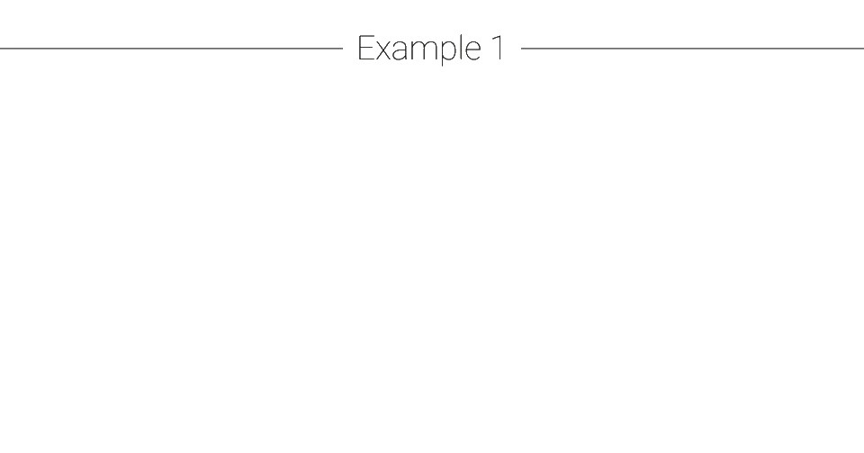
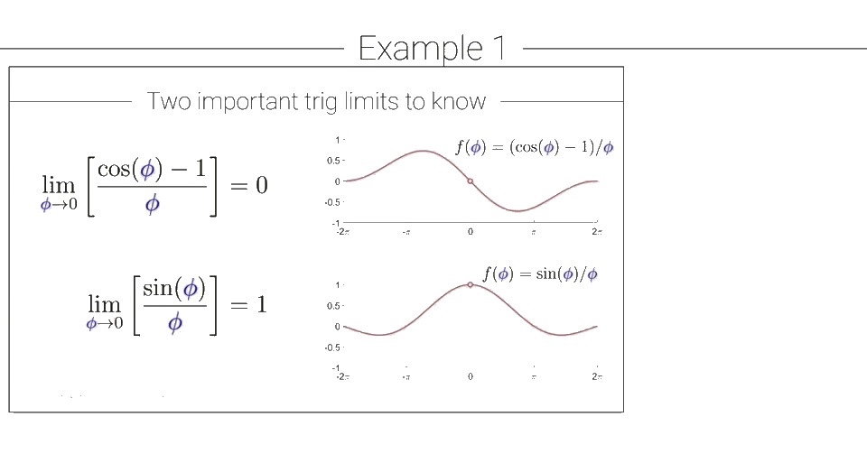
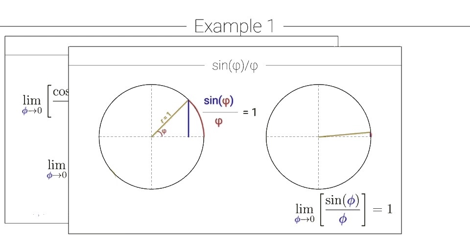
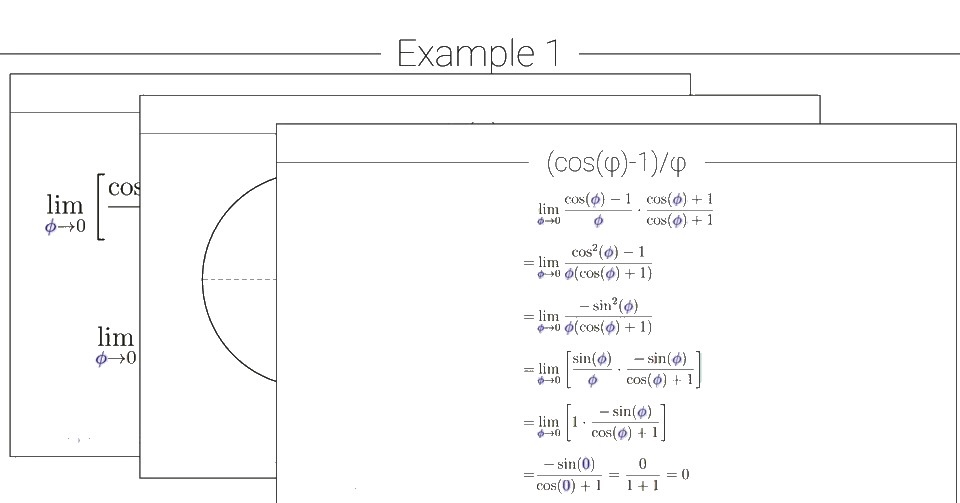
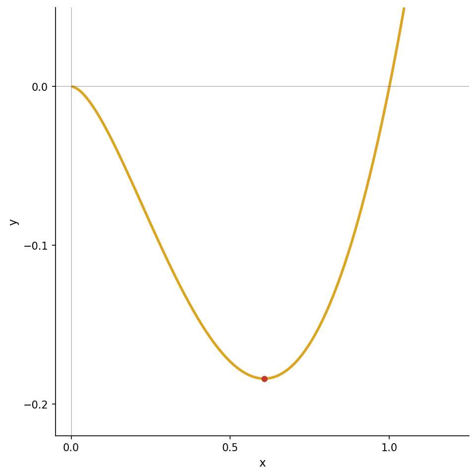

```{r}
knitr::opts_chunk$set(echo = TRUE)
library(reticulate)
use_python("/opt/anaconda3/bin/python")
```

# Reglas de diferenciación 

## Linealidad de la diferenciación (demostración) {.title-line}

::: {style="display: flex; flex-direction: column; justify-content: center; flex: 1; min-height: 0; padding: 0 2em; gap: 0.9em; font-size: 1.5em;"}

[En esta presentación, aprenderás]{style="color: goldenrod;"}

- [La demostración de que la diferenciación es una operación lineal.]{style="color: #c0392b;"}

:::

## Linealidad de la diferenciación {.title-line background-color="#ffffff"}

::: {style="display: flex; flex-direction: column; justify-content: center; align-items: center; flex: 1; min-height: 0; padding: 0.5em 2em; font-size: 2em;"}

$$\frac{d}{d{\color{teal}x}}\left[{\color{goldenrod}a}f({\color{teal}x}) + {\color{red}b}g({\color{teal}x})\right] = {\color{goldenrod}a}f'({\color{teal}x}) + {\color{red}b}g'({\color{teal}x})$$

:::

## ¿Porqué la diferenciación es lineal? {.title-line}

::: {style="display: flex; flex-direction: column; justify-content: center; align-items: center; flex: 1; min-height: 0; padding: 0.5em 0.5em; gap: 0.01em; font-size: 0.95em;margin-top: -1.7em;"}

$k({\color{teal}x}) = {\color{goldenrod}a}f({\color{teal}x}) + {\color{red}b}g({\color{teal}x})$

::: {.fragment .fade-in data-fragment-index=1}
$\displaystyle k' = \lim_{h \to 0}\frac{k({\color{teal}x}+h) - k({\color{teal}x})}{h}$
:::

::: {.fragment .fade-in data-fragment-index=2}
$\displaystyle \phantom{k'} = \lim_{h \to 0}\frac{({\color{goldenrod}a}f({\color{teal}x}+h) + {\color{red}b}g({\color{teal}x}+h)) - ({\color{goldenrod}a}f({\color{teal}x}) + {\color{red}b}g({\color{teal}x}))}{h}$
:::

::: {.fragment .fade-in data-fragment-index=3}
$\displaystyle \phantom{k'} = \lim_{h \to 0}\frac{{\color{goldenrod}a}f({\color{teal}x}+h) - {\color{goldenrod}a}f({\color{teal}x}) + {\color{red}b}g({\color{teal}x}+h) - {\color{red}b}g({\color{teal}x})}{h}$
:::

::: {.fragment .fade-in data-fragment-index=4}
$\displaystyle \phantom{k'} = \lim_{h \to 0}\frac{{\color{goldenrod}a}[f({\color{teal}x}+h) - f({\color{teal}x})] + {\color{red}b}[g({\color{teal}x}+h) - g({\color{teal}x})]}{h}$
:::

::: {.fragment .fade-in data-fragment-index=5}
$\displaystyle \phantom{k'} = \lim_{h \to 0}{\color{goldenrod}a}\!\left[\frac{f({\color{teal}x}+h) - f({\color{teal}x})}{h}\right] + \lim_{h \to 0}{\color{red}b}\!\left[\frac{g({\color{teal}x}+h) - g({\color{teal}x})}{h}\right]$
:::

::: {.fragment .fade-in data-fragment-index=6}
$\displaystyle \phantom{k'} = {\color{goldenrod}a}f'({\color{teal}x}) + {\color{red}b}g'({\color{teal}x})$
:::

:::


## Teorema: La derivabilidad implica continuidad {.title-line}

::: {style="display: flex; flex-direction: column; justify-content: center; flex: 1; min-height: 0; padding: 0 2em; gap: 0.9em; font-size: 1.5em;"}

[En esta presentación, aprenderás]{style="color: goldenrod;"}

- [Que si una función es derivable en un punto, entonces también es continua en ese punto.]{style="color: #c0392b;"}

- [La demostración de esa afirmación.]{style="color: navy;"}

- [La respuesta a la pregunta de si la continuidad implica derivabilidad.]{style="color: teal;"}

:::


## El Teorema {.title-line}

::: {style="display: flex; flex-direction: column; justify-content: center; flex: 1; min-height: 0; padding: 0 2.5em; gap: 1.3em; font-size: 1.35em;"}

[Si la derivada existe en un punto $x_0$ de una función $f$,]{style="color: teal;font-weight: bold;"}

[entonces la función $f$ es continua en $x_0$.]{style="color: #c0392b;font-weight: bold;"}

:::

## Recordatorio sobre límites {.title-line}

::: {style="display: flex; flex-direction: column; justify-content: center; align-items: center; flex: 1; min-height: 0; gap: 0.1em; font-size: 3em;"}

::: {.fragment .fade-in data-fragment-index=1}
$$\lim_{{\color{teal}x}\to{\color{red}a}} {\color{teal}x} = {\color{red}a}$$
:::

::: {.fragment .fade-in data-fragment-index=2}
$$\lim_{{\color{goldenrod}h}\to 0} f({\color{teal}x}+{\color{goldenrod}h}) = f({\color{teal}x})$$
:::

:::

## La demostración {.title-line}

::: {style="display: flex; flex-direction: column; justify-content: center; align-items: center; flex: 1; min-height: 0; padding: 0.5em 2em; gap: 0em; font-size: 0.9em; text-align: center;"}
Queremos probar que $\displaystyle\lim_{x \to x_0} f(x) = f(x_0)$, es decir, que $\displaystyle\lim_{x \to x_0} [f(x) - f(x_0)] = 0$.

$\displaystyle\lim_{{\color{teal}x}\to{\color{red}a}} f({\color{teal}x}) = f({\color{red}a})$

::: {.fragment .fade-in data-fragment-index=1}
$\displaystyle\lim_{{\color{teal}x}\to{\color{red}a}} [f({\color{teal}x}) - f({\color{red}a})] = 0$
:::

::: {.fragment .fade-in data-fragment-index=2}
$\displaystyle\lim_{{\color{teal}x}\to{\color{red}a}} \left[\frac{f({\color{teal}x})-f({\color{red}a})}{{\color{teal}x}-{\color{red}a}}\cdot({\color{teal}x}-{\color{red}a})\right] = 0$
:::

::: {.fragment .fade-in data-fragment-index=3 style="display: flex; flex-direction: row; align-items: center; justify-content: center; gap: 0em;"}
::: {style="border: 2px dashed teal; border-radius: 6px; padding: 0.3em 0.8em;"}
$\displaystyle\lim_{{\color{teal}x}\to{\color{red}a}}\frac{f({\color{teal}x})-f({\color{red}a})}{{\color{teal}x}-{\color{red}a}}$
:::
::: {}
$\displaystyle\cdot\lim_{{\color{teal}x}\to{\color{red}a}}({\color{teal}x}-{\color{red}a})=0$
:::
:::

::: {.fragment .fade-in data-fragment-index=4}
$\displaystyle f'({\color{red}a})\cdot 0 = 0$
:::

::: {.fragment .fade-in data-fragment-index=5}
Por lo tanto $\displaystyle\lim_{x \to x_0} f(x) = f(x_0)$. $\blacksquare$
:::
:::

## Intuición geométrica: La brecha que se cierra {.title-line}

```{python}
#| echo: false
#| results: 'hide'
import matplotlib.pyplot as plt
import numpy as np

X0 = 2.0

def f_cont(x):
    return x**2

def f_disc(x):
    return np.where(np.asarray(x) < X0, 1.0, 3.0)

def make_frame(x_c, x_d, label_gap_c, label_gap_d):
    fig, (ax1, ax2) = plt.subplots(1, 2, figsize=(13, 5.2))

    # ── LEFT: continuous ──────────────────────────────────────────────────
    xp = np.linspace(0.4, 3.6, 400)
    ax1.plot(xp, f_cont(xp), color='#B8860B', lw=2.5)

    yc0 = f_cont(X0);  yc = f_cont(x_c)
    ax1.plot(X0, yc0, 'o', color='teal', ms=11, zorder=5)
    ax1.plot(x_c,  yc,  'o', color='#c0392b', ms=10, zorder=5)

    # dashed guides
    for xv, yv, col in [(X0, yc0, 'teal'), (x_c, yc, '#c0392b')]:
        ax1.plot([xv, xv], [0, yv], '--', color=col, alpha=0.45, lw=1.3)
        ax1.plot([0.4, xv], [yv, yv], '--', color=col, alpha=0.45, lw=1.3)

    # gap arrow
    ylo, yhi = min(yc, yc0), max(yc, yc0)
    ax1.annotate('', xy=(x_c + 0.05, ylo), xytext=(x_c + 0.05, yhi),
                 arrowprops=dict(arrowstyle='<->', color='#c0392b', lw=2.2))
    ax1.text(x_c + 0.18, (ylo + yhi) / 2,
             f'brecha\n= {label_gap_c}', color='#c0392b',
             fontsize=11, va='center', fontweight='bold')

    ax1.text(X0,  -0.7, '$x_0$', color='teal',     ha='center', fontsize=13)
    ax1.text(x_c, -0.7, '$x$',   color='#c0392b',  ha='center', fontsize=13)
    ax1.set_xlim(0.4, 3.6); ax1.set_ylim(-0.9, 13)
    ax1.set_xticks([]); ax1.set_yticks([])
    ax1.spines['top'].set_visible(False); ax1.spines['right'].set_visible(False)
    ax1.set_title('Función CONTINUA  →  brecha → 0 ✓',
                  color='#27ae60', fontsize=13, fontweight='bold', pad=8)
    ax1.set_xlabel('$x$', fontsize=12)

    # ── RIGHT: discontinuous ──────────────────────────────────────────────
    xl = np.linspace(0.4, X0 - 0.005, 300)
    xr = np.linspace(X0, 3.6, 300)
    ax2.plot(xl, f_disc(xl), color='#B8860B', lw=2.5)
    ax2.plot(xr, f_disc(xr), color='#B8860B', lw=2.5)
    ax2.plot(X0, 3.0, 'o', color='#B8860B', ms=10, zorder=5)           # filled
    ax2.plot(X0, 1.0, 'o', color='white', ms=10, mec='#B8860B',
             mew=2.2, zorder=5)                                          # open

    yd0 = f_disc(X0);  yd = float(f_disc(x_d - 0.001))
    ax2.plot(X0,  yd0, 'o', color='teal',     ms=11, zorder=6)
    ax2.plot(x_d, yd,  'o', color='#c0392b',  ms=10, zorder=6)

    ax2.plot([X0, X0], [0, yd0], '--', color='teal',    alpha=0.45, lw=1.3)
    ax2.plot([x_d, x_d], [0, yd], '--', color='#c0392b', alpha=0.45, lw=1.3)

    ylo2, yhi2 = min(yd, yd0), max(yd, yd0)
    ax2.annotate('', xy=(x_d - 0.08, ylo2), xytext=(x_d - 0.08, yhi2),
                 arrowprops=dict(arrowstyle='<->', color='#c0392b', lw=2.2))
    ax2.text(x_d - 0.55, (ylo2 + yhi2) / 2,
             f'brecha\n= {label_gap_d}', color='#c0392b',
             fontsize=11, va='center', fontweight='bold')

    ax2.text(X0,  -0.35, '$x_0$', color='teal',    ha='center', fontsize=13)
    ax2.text(x_d, -0.35, '$x$',   color='#c0392b', ha='center', fontsize=13)
    ax2.set_xlim(0.4, 3.6); ax2.set_ylim(-0.5, 4.8)
    ax2.set_xticks([]); ax2.set_yticks([])
    ax2.spines['top'].set_visible(False); ax2.spines['right'].set_visible(False)
    ax2.set_title('Función con SALTO  →  brecha ≠ 0 ✗',
                  color='#c0392b', fontsize=13, fontweight='bold', pad=8)
    ax2.set_xlabel('$x$', fontsize=12)

    plt.tight_layout(pad=1.2)
    return fig
```

::: {style="display: flex; flex-direction: column; justify-content: center; align-items: center; flex: 1; min-height: 0; padding: 0.2em 1em;"}

::: {.r-stack style="width: 100%;"}

::: {style="width: 100%; display: flex; justify-content: center;"}
```{python}
#| echo: false
#| results: 'hide'
fig = make_frame(3.4, 0.6, '8.76', '2')
plt.show()
```
:::

::: {.fragment .fade-in data-fragment-index=1 style="background: white; width: 100%; display: flex; justify-content: center;"}
```{python}
#| echo: false
#| results: 'hide'
fig = make_frame(2.8, 1.3, '3.84', '2')
plt.show()
```
:::

::: {.fragment .fade-in data-fragment-index=2 style="background: white; width: 100%; display: flex; justify-content: center;"}
```{python}
#| echo: false
#| results: 'hide'
fig = make_frame(2.3, 1.7, '1.29', '2')
plt.show()
```
:::

::: {.fragment .fade-in data-fragment-index=3 style="background: white; width: 100%; display: flex; justify-content: center;"}
```{python}
#| echo: false
#| results: 'hide'
fig = make_frame(2.05, 1.97, '0.20', '2')
plt.show()
```
:::

:::

:::

## ¿Funciona al revés? {.title-line}

::: {style="display: flex; flex-direction: column; justify-content: center; flex: 1; min-height: 0; gap: 1.8em; padding: 0 2em;"}

::: {.fragment .fade-in data-fragment-index=1 style="font-size: 1.7em; font-weight: bold; line-height: 1.5;"}
::: {style="color: #c0392b;"}
Si la función es continua en $x_0$,
:::
::: {style="color: #B8860B;"}
¿existe la derivada en el punto $x_0$?
:::
:::

::: {.fragment .fade-in data-fragment-index=2 style="font-size: 3em; font-weight: bold; color: blue; text-align: center;"}
¡No!
:::

:::

## Demuestralo! {.title-line}

::: {style="display: flex; flex-direction: column; flex: 1; min-height: 0;"}
::: {.r-stack style="flex: 1; min-height: 0; width: 90%; place-items: end;"}

::: {style="width: 90%; min-height: 1px;"}
:::

::: {.fragment .fade-in data-fragment-index=1 style="background: white; width: 90%; padding: 0.4em 1em;"}
::: {style="color: teal; font-size: 1.4em; font-weight: bold;"}
Un contraejemplo refuta la afirmación.
:::
:::

::: {.fragment .fade-in data-fragment-index=2 style="background: white; width: 90%; display: flex; flex-direction: column; gap: 0.3em; padding: 0.4em 1em;"}
::: {style="color: teal; font-size: 1.4em; font-weight: bold;"}
Un contraejemplo refuta la afirmación.
:::

```{python}
#| echo: false
#| fig-width: 9
#| fig-height: 6
#| results: 'hide'
import matplotlib.pyplot as plt
import numpy as np

GOLD = '#B8860B'
x = np.linspace(-2, 2, 400)
y = np.abs(x)

fig, ax = plt.subplots(figsize=(9, 6))
ax.plot(x, y, color=GOLD, linewidth=2)
ax.set_xlim(-2.1, 2.1)
ax.set_ylim(-0.05, 2.1)
ax.set_xticks([-2, -1, 0, 1, 2])
ax.set_yticks([0, 0.5, 1, 1.5, 2])
ax.set_title('$f(x) = |x|$', fontsize=12)
ax.spines['top'].set_visible(False)
ax.spines['right'].set_visible(False)
plt.tight_layout()
plt.show()
```

:::

:::
:::

## Regla de la cadena {.title-line}

::: {style="display: flex; flex-direction: column; justify-content: center; flex: 1; min-height: 0; padding: 0 2em; gap: 0.9em; font-size: 1.5em;"}

[En esta presentación, aprenderás]{style="color: goldenrod;"}

- [¡La regla de la cadena! Una de las reglas de derivación más importantes.]{style="color: #c0392b;"}

- [La intuición de por qué funciona la regla de la cadena.]{style="color: navy;"}

:::

## funciones compuestas {.title-line}

```{=html}
<div style="display:flex;flex-direction:column;justify-content:center;align-items:center;flex:1;min-height:0;height:100%;">
<svg viewBox="0 0 1000 520" xmlns="http://www.w3.org/2000/svg" style="width:92%;height:auto;max-height:650px;">
<defs>
<marker id="arr" markerWidth="18" markerHeight="12" refX="17" refY="6" orient="auto" markerUnits="userSpaceOnUse">
<polygon points="0 0,18 6,0 12" fill="#222"/>
</marker>
</defs>

<!-- FILA PRINCIPAL -->
<circle cx="90" cy="370" r="56" fill="#16a085"/>
<text x="90" y="370" text-anchor="middle" dominant-baseline="central" font-style="italic" font-size="46" fill="white" font-family="Georgia, serif">x</text>

<line x1="148" y1="370" x2="188" y2="370" stroke="#222" stroke-width="7" marker-end="url(#arr)"/>

<polygon points="265,300 330,345 308,415 222,415 200,345" fill="#B8860B"/>
<text x="265" y="372" text-anchor="middle" dominant-baseline="central" font-style="italic" font-size="30" fill="white" font-family="Georgia, serif">f(x)</text>

<line x1="332" y1="370" x2="372" y2="370" stroke="#222" stroke-width="7" marker-end="url(#arr)"/>

<rect x="400" y="315" width="110" height="110" rx="14" fill="#2980b9"/>
<text x="455" y="370" text-anchor="middle" dominant-baseline="central" font-style="italic" font-size="46" fill="white" font-family="Georgia, serif">y</text>

<line x1="512" y1="370" x2="552" y2="370" stroke="#222" stroke-width="7" marker-end="url(#arr)"/>

<polygon points="565,315 715,315 742,425 538,425" fill="#c0392b"/>
<text x="640" y="372" text-anchor="middle" dominant-baseline="central" font-style="italic" font-size="30" fill="white" font-family="Georgia, serif">g(y)</text>

<line x1="744" y1="370" x2="784" y2="370" stroke="#222" stroke-width="7" marker-end="url(#arr)"/>

<rect x="810" y="315" width="110" height="110" rx="14" fill="#1a237e"/>
<text x="865" y="370" text-anchor="middle" dominant-baseline="central" font-style="italic" font-size="46" fill="white" font-family="Georgia, serif">z</text>

<!-- BLOQUE SUPERIOR g(f(x)) -->
<polygon points="355,80 645,80 615,230 385,230" fill="#c0392b"/>
<polygon points="500,92 562,133 540,197 460,197 438,133" fill="#B8860B"/>
<text x="500" y="158" text-anchor="middle" dominant-baseline="central" font-style="italic" font-size="26" fill="white" font-family="Georgia, serif">g(f(x))</text>

<!-- FLECHAS DIAGONALES -->
<line x1="272" y1="304" x2="379" y2="198" stroke="#222" stroke-width="7" marker-end="url(#arr)"/>
<line x1="621" y1="202" x2="816" y2="320" stroke="#222" stroke-width="7" marker-end="url(#arr)"/>
</svg>
</div>
```

## La regla de la cadena {.title-line}

::: {style="display: flex; flex-direction: column; flex: 1; min-height: 0;"}
::: {.r-stack style="flex: 1; min-height: 0; width: 90%; place-items: center;"}

::: {style="width: 90%; display: flex; flex-direction: column; align-items: center; gap: 0.8em; padding: 1em 3em; font-size: 1.2em;"}
$[ {\color{goldenrod}f}({\color{red}g}({\color{teal}x})) ]' \;=\; {\color{goldenrod}f}'({\color{red}g}({\color{teal}x}))\,{\color{red}g}'({\color{teal}x})$
:::

::: {.fragment .fade-in data-fragment-index=1 style="background: white; width: 90%; display: flex; flex-direction: column; align-items: center; gap: 0.6em; padding: 1em 3em;"}
::: {style="font-size: 1.2em;"}
$[ {\color{goldenrod}f}({\color{red}g}({\color{teal}x})) ]' \;=\; {\color{goldenrod}f}'({\color{red}g}({\color{teal}x}))\,{\color{red}g}'({\color{teal}x})$
:::
::: {style="font-size: 1.7em; display: flex; flex-direction: column; gap: 0.3em; align-items: center; margin-top: 0.4em;"}
${\color{red}y} = {\color{red}g}({\color{teal}x})$
${\color{goldenrod}z} = {\color{goldenrod}f}({\color{red}y})$
:::
:::

::: {.fragment .fade-in data-fragment-index=2 style="background: white; width: 90%; display: flex; flex-direction: column; align-items: center; gap: 0.6em; padding: 1em 3em;"}
::: {style="font-size: 1.2em;"}
$[ {\color{goldenrod}f}({\color{red}g}({\color{teal}x})) ]' \;=\; {\color{goldenrod}f}'({\color{red}g}({\color{teal}x}))\,{\color{red}g}'({\color{teal}x})$
:::
::: {style="font-size: 1.2em; display: flex; flex-direction: column; gap: 0.3em; align-items: center;"}
${\color{red}y} = {\color{red}g}({\color{teal}x})$
${\color{goldenrod}z} = {\color{goldenrod}f}({\color{red}y})$
:::
::: {style="font-size: 1.2em; margin-top: 0.3em;"}
$\frac{{\color{goldenrod}dz}}{{\color{teal}dx}} \;=\; \frac{{\color{goldenrod}dz}}{{\color{red}dy}} \cdot \frac{{\color{red}dy}}{{\color{teal}dx}}$
:::
:::

::: {.fragment .fade-in data-fragment-index=3 style="background: white; width: 90%; display: flex; justify-content: center; align-items: center; padding: 1em 3em;"}
::: {style="display: flex; flex-direction: column; align-items: flex-start; gap: 0.5em; font-size: 1em;"}
::: {style="display: flex; align-items: center; gap: 0.4em;"}
::: {style="border: 2px dashed #B8860B; border-radius: 6px; padding: 0.1em 0.5em;"}
$[ {\color{goldenrod}f}({\color{red}g}({\color{teal}x})) ]'$
:::
::: {}
$\;=\; {\color{goldenrod}f}'({\color{red}g}({\color{teal}x}))\,{\color{red}g}'({\color{teal}x})$
:::
:::
::: {style="display: flex; align-items: flex-start; gap: 0.5em;"}
::: {style="border-left: 2px solid #B8860B; width: 1.2em; min-height: 3em;"}
:::
::: {style="display: flex; flex-direction: column; gap: 0.25em; font-size: 1.2em; padding-top: 0.2em;"}
${\color{red}y} = {\color{red}g}({\color{teal}x})$
${\color{goldenrod}z} = {\color{goldenrod}f}({\color{red}y})$
:::
:::
::: {style="display: flex; align-items: center; gap: 0.4em;"}
::: {style="border: 2px dashed #B8860B; border-radius: 6px; padding: 0.1em 0.5em;"}
$\frac{{\color{goldenrod}dz}}{{\color{teal}dx}}$
:::
::: {}
$\;=\; \frac{{\color{goldenrod}dz}}{{\color{red}dy}} \cdot \frac{{\color{red}dy}}{{\color{teal}dx}}$
:::
:::
:::
:::

:::
:::

## Ejemplo 1: {.title-line}

::: {style="display: flex; flex-direction: column; justify-content: center; flex: 1; min-height: 0; padding: 0.5em 3em; gap: 0.4em; font-size: 1.15em;"}

${\color{goldenrod}f}(x) = x^2$

${\color{red}g}(x) = x^3 + 3x$

::: {.fragment .fade-in data-fragment-index=1 style="margin-top: 0.5em;"}
${\color{goldenrod}f}({\color{red}g}(x)) = (x^3+3x)^2$
:::

::: {.fragment .fade-in data-fragment-index=2 style="margin-top: 0.5em; display: flex; flex-direction: row; align-items: center; gap: 0.4em;"}
::: {}
${\color{goldenrod}f}({\color{red}g}(x))' =$
:::
::: {style="border: 2px dashed #B8860B; border-radius: 6px; padding: 0.1em 0.5em;"}
${\color{goldenrod}f}'({\color{red}g}(x))$
:::
::: {style="border: 2px dashed #c0392b; border-radius: 6px; padding: 0.1em 0.5em;"}
${\color{red}g}'(x)$
:::
:::

::: {.fragment .fade-in data-fragment-index=3 style="display: flex; flex-direction: row; align-items: center; gap: 0.4em;"}
::: {}
$\phantom{f(g(x))'} =$
:::
::: {style="border: 2px dashed #B8860B; border-radius: 6px; padding: 0.1em 0.5em;"}
${\color{goldenrod}2(x^3+3x)}$
:::
::: {style="border: 2px dashed #c0392b; border-radius: 6px; padding: 0.1em 0.5em;"}
${\color{red}(3x^2+3)}$
:::
:::

:::

## Ejemplo: 2 {.title-line}

::: {style="display: flex; flex-direction: column; justify-content: center; flex: 1; min-height: 0; padding: 0.5em 3em; gap: 0.4em; font-size: 1.15em;"}

${\color{goldenrod}f}(x) = e^x$

${\color{red}g}(x) = 2x^2 + 3$

::: {.fragment .fade-in data-fragment-index=1 style="margin-top: 0.5em;"}
${\color{goldenrod}f}({\color{red}g}(x)) = e^{2x^2+3}$
:::

::: {.fragment .fade-in data-fragment-index=2 style="margin-top: 0.5em; display: flex; flex-direction: row; align-items: center; gap: 0.4em;"}

::: {}
${\color{goldenrod}f}({\color{red}g}(x))' =$
:::

::: {style="border: 2px dashed #B8860B; border-radius: 6px; padding: 0.1em 0.5em;"}
${\color{goldenrod}f}'({\color{red}g}(x))$
:::

::: {style="border: 2px dashed #c0392b; border-radius: 6px; padding: 0.1em 0.5em;"}
${\color{red}g}'(x)$
:::

:::

::: {.fragment .fade-in data-fragment-index=3 style="display: flex; flex-direction: row; align-items: center; gap: 0.4em;"}

::: {}
$\phantom{f(g(x))'} =$
:::

::: {style="border: 2px dashed #B8860B; border-radius: 6px; padding: 0.1em 0.5em;"}
${\color{goldenrod}e^{2x^2+3}}$
:::

::: {style="border: 2px dashed #c0392b; border-radius: 6px; padding: 0.1em 0.5em;"}
${\color{red}4x}$
:::

:::

:::

## Ejemplo: 3a {.title-line}

::: {style="display: flex; flex-direction: row; flex: 1; min-height: 0; gap: 1em; padding: 0.4em 1em; font-size: 1.05em;"}

::: {style="flex: 1.1; display: flex; flex-direction: column; gap: 0.4em; padding: 0.4em 1em; justify-content: center;"}

${\color{goldenrod}f}(x) = x^2$

${\color{red}g}(x) = \cos(x)$

${\color{goldenrod}f}({\color{red}g}(x)) = (\cos(x))^2 = \cos^2(x)$

::: {.fragment .fade-in data-fragment-index=1 style="margin-top: 0.5em;"}
${\color{goldenrod}f}({\color{red}g}(x))' = {\color{goldenrod}f}'({\color{red}g}(x)){\color{red}g}'(x)$
:::

::: {.fragment .fade-in data-fragment-index=1}
$\phantom{f(g(x))'} = {\color{goldenrod}-2\cos(x)}{\color{red}\sin(x)}$
:::

:::

::: {.fragment .fade-in data-fragment-index=2 style="flex: 1; display: flex; flex-direction: column; justify-content: center;"}
```{python}
#| echo: false
#| fig-width: 7
#| fig-height: 7.5
#| results: 'hide'
import matplotlib.pyplot as plt
import numpy as np

GOLD = '#B8860B'
x = np.linspace(-4, 4, 400)
y1 = np.cos(x)**2
y2 = -2 * np.cos(x) * np.sin(x)

fig, (ax1, ax2) = plt.subplots(2, 1, figsize=(7, 7.5))

ax1.plot(x, y1, color=GOLD, linewidth=2)
ax1.set_title('$f(x) = \\cos^2(x)$', fontsize=11)
ax1.set_ylabel('Function value', fontsize=9)
ax1.set_xlim(-4, 4)
ax1.set_ylim(-0.05, 1.2)
ax1.set_xticks([-4, -2, 0, 2, 4])
ax1.set_yticks([0, 0.5, 1])
ax1.spines['top'].set_visible(False)
ax1.spines['right'].set_visible(False)

ax2.plot(x, y2, color=GOLD, linewidth=2)
ax2.axhline(y=0, color='gray', linestyle='--', linewidth=0.8)
ax2.set_title("$f'(x) = -2\\cos(x)\\sin(x)$", fontsize=11)
ax2.set_ylabel('Tangent slope', fontsize=9)
ax2.set_xlim(-4, 4)
ax2.set_ylim(-1.2, 1.2)
ax2.set_xticks([-4, -2, 0, 2, 4])
ax2.set_yticks([-1, 0, 1])
ax2.spines['top'].set_visible(False)
ax2.spines['right'].set_visible(False)

for ax in [ax1, ax2]:
    ax.axvline(x=-np.pi/2, color='steelblue', linestyle='--', linewidth=1.5, alpha=0.85)
    ax.axvline(x=0, color='steelblue', linestyle='--', linewidth=1.5, alpha=0.85)

plt.tight_layout()
plt.show()
```
:::

:::

## Ejemplo: 3b {.title-line}

::: {style="display: flex; flex-direction: row; flex: 1; min-height: 0; gap: 1em; padding: 0.4em 1em; font-size: 1.05em;"}

::: {style="flex: 1.1; display: flex; flex-direction: column; gap: 0.4em; padding: 0.4em 1em; justify-content: center;"}

${\color{goldenrod}f}(x) = x^2 + \pi$

${\color{red}g}(x) = \cos(x)$

${\color{red}g}({\color{goldenrod}f}(x)) = \cos(x^2+\pi)$

::: {.fragment .fade-in data-fragment-index=1 style="margin-top: 0.5em;"}
${\color{red}g}({\color{goldenrod}f}(x))' = {\color{red}g}'({\color{goldenrod}f}(x))\,{\color{goldenrod}f}'(x)$
:::

::: {.fragment .fade-in data-fragment-index=2}
$\phantom{g(f(x))'} = {\color{red}-\sin(x^2+\pi)}\cdot{\color{goldenrod}2x}$
:::

:::

::: {.fragment .fade-in data-fragment-index=3 style="flex: 1; display: flex; flex-direction: column; justify-content: center;"}
```{python}
#| echo: false
#| fig-width: 7
#| fig-height: 7.5
#| results: 'hide'
import matplotlib.pyplot as plt
import numpy as np

GOLD = '#B8860B'
x = np.linspace(-4, 4, 400)
y1 = np.cos(x**2 + np.pi)
y2 = -2*x*np.sin(x**2 + np.pi)

fig, (ax1, ax2) = plt.subplots(2, 1, figsize=(7, 7.5))

ax1.plot(x, y1, color=GOLD, linewidth=2)
ax1.set_title('$f(x) = \\cos(x^2 + \\pi)$', fontsize=11)
ax1.set_ylabel('Function value', fontsize=9)
ax1.set_xlim(-4, 4)
ax1.set_ylim(-1.2, 1.2)
ax1.set_xticks([-4, -2, 0, 2, 4])
ax1.set_yticks([-1, 0, 1])
ax1.spines['top'].set_visible(False)
ax1.spines['right'].set_visible(False)

ax2.plot(x, y2, color=GOLD, linewidth=2)
ax2.axhline(y=0, color='gray', linestyle='--', linewidth=0.8)
ax2.set_title("$f'(x) = -2x\\sin(x^2 + \\pi)$", fontsize=11)
ax2.set_ylabel('Tangent slope', fontsize=9)
ax2.set_xlim(-4, 4)
ax2.set_xticks([-4, -2, 0, 2, 4])
ax2.spines['top'].set_visible(False)
ax2.spines['right'].set_visible(False)

plt.tight_layout()
plt.show()
```
:::

:::

## Ejemplo: 4a {.title-line}

::: {style="display: flex; flex-direction: row; flex: 1; min-height: 0; gap: 1em; padding: 0.4em 1em; font-size: 1.05em;"}

::: {style="flex: 1.1; display: flex; flex-direction: column; gap: 0.4em; padding: 0.4em 1em; justify-content: center;"}

${\color{goldenrod}f}(x) = 4x^2$

${\color{red}g}(x) = \ln(x)$

${\color{goldenrod}f}({\color{red}g}(x)) = 4(\ln(x))^2$

::: {.fragment .fade-in data-fragment-index=1 style="margin-top: 0.5em;"}
${\color{goldenrod}f}({\color{red}g}(x))' = {\color{goldenrod}f}'({\color{red}g}(x)){\color{red}g}'(x)$
:::

::: {.fragment .fade-in data-fragment-index=2 style="padding-left: 4.5em;"}
$= \frac{{\color{goldenrod}8\ln(x)}}{{\color{red}x}}$
:::

:::

::: {.fragment .fade-in data-fragment-index=3 style="flex: 1; display: flex; flex-direction: column; justify-content: center;"}
```{python}
#| echo: false
#| fig-width: 7
#| fig-height: 7.5
#| results: 'hide'

import matplotlib.pyplot as plt
import numpy as np

GOLD = '#B8860B'
x = np.linspace(0.05, 1, 400)
y1 = 4 * np.log(x)**2
y2 = 8 * np.log(x) / x

fig, (ax1, ax2) = plt.subplots(2, 1, figsize=(7, 7.5))

ax1.plot(x, y1, color=GOLD, linewidth=2)
ax1.set_title('$f(x) = 4(\\ln(x))^2$', fontsize=11)
ax1.set_ylabel('Function value', fontsize=9)
ax1.set_xlim(0.05, 1)
ax1.set_xticks([0.2, 0.4, 0.6, 0.8, 1.0])
ax1.spines['top'].set_visible(False)
ax1.spines['right'].set_visible(False)

ax2.plot(x, y2, color=GOLD, linewidth=2)
ax2.axhline(y=0, color='gray', linestyle='--', linewidth=0.8)
ax2.set_title("$f'(x) = 8\\ln(x)/x$", fontsize=11)
ax2.set_ylabel('Tangent slope', fontsize=9)
ax2.set_xlim(0.05, 1)
ax2.set_xticks([0.2, 0.4, 0.6, 0.8, 1.0])
ax2.spines['top'].set_visible(False)
ax2.spines['right'].set_visible(False)

plt.tight_layout()
plt.show()
```
:::

:::


## Ejemplo: 4b {.title-line}

::: {style="display: flex; flex-direction: column; flex: 1; min-height: 0;"}
::: {.r-stack style="flex: 1; min-height: 0; width: 90%; place-items: start;"}

::: {style="width: 90%; display: flex; flex-direction: column; gap: 0.4em; padding: 0.6em 3em; font-size: 1.15em;"}
::: {}
${\color{goldenrod}f}(x) = 4x^2$
:::
::: {}
${\color{red}g}(x) = \ln(x)$
:::
::: {style="margin-top: 0.5em;"}
${\color{red}g}({\color{goldenrod}f}(x)) = \ln(4x^2)$
:::
:::

::: {.fragment .fade-in data-fragment-index=1 style="background: white; width: 90%; display: flex; flex-direction: column; gap: 0.4em; padding: 0.6em 3em; font-size: 1.15em;"}
::: {}
${\color{goldenrod}f}(x) = 4x^2$
:::
::: {}
${\color{red}g}(x) = \ln(x)$
:::
::: {style="margin-top: 0.5em;"}
${\color{red}g}({\color{goldenrod}f}(x)) = \ln(4x^2)$
:::
::: {style="margin-top: 0.5em;"}
${\color{red}g}({\color{goldenrod}f}(x))' = {\color{red}g}'({\color{goldenrod}f}(x))\,{\color{goldenrod}f}'(x)$
:::
:::

::: {.fragment .fade-in data-fragment-index=2 style="background: white; width: 90%; display: flex; flex-direction: column; gap: 0.4em; padding: 0.6em 3em; font-size: 1.15em;"}
::: {}
${\color{goldenrod}f}(x) = 4x^2$
:::
::: {}
${\color{red}g}(x) = \ln(x)$
:::
::: {style="margin-top: 0.5em;"}
${\color{red}g}({\color{goldenrod}f}(x)) = \ln(4x^2)$
:::
::: {style="margin-top: 0.5em;"}
${\color{red}g}({\color{goldenrod}f}(x))' = {\color{red}g}'({\color{goldenrod}f}(x))\,{\color{goldenrod}f}'(x)$
:::
::: {style="padding-left: 4.5em;"}
$= \frac{{\color{red}1}}{{\color{red}4x^2}} \cdot {\color{goldenrod}8x}$
:::
::: {style="padding-left: 4.5em;"}
$= \frac{{\color{goldenrod}8x}}{{\color{red}4x^2}} = \frac{2}{x}$
:::
:::

::: {.fragment .fade-in data-fragment-index=3 style="background: white; width: 90%; display: flex; flex-direction: row; gap: 1em; padding: 0.4em 1em; font-size: 1.05em;"}
::: {style="flex: 1.1; display: flex; flex-direction: column; gap: 0.4em; padding: 0.4em 1em;"}
::: {}
${\color{goldenrod}f}(x) = 4x^2$
:::
::: {}
${\color{red}g}(x) = \ln(x)$
:::
::: {style="margin-top: 0.5em;"}
${\color{red}g}({\color{goldenrod}f}(x)) = \ln(4x^2)$
:::
::: {style="margin-top: 0.5em;"}
${\color{red}g}({\color{goldenrod}f}(x))' = {\color{red}g}'({\color{goldenrod}f}(x))\,{\color{goldenrod}f}'(x)$
:::
::: {style="padding-left: 4.5em;"}
$= \frac{{\color{red}1}}{{\color{red}4x^2}} \cdot {\color{goldenrod}8x}$
:::
::: {style="padding-left: 4.5em;"}
$= \frac{{\color{goldenrod}8x}}{{\color{red}4x^2}} = \frac{2}{x}$
:::
:::
::: {style="flex: 1; display: flex; flex-direction: column; justify-content: center;"}
```{python}
#| echo: false
#| fig-width: 7
#| fig-height: 7.5
#| results: 'hide'

import matplotlib.pyplot as plt
import numpy as np

GOLD = '#B8860B'
x = np.linspace(0.1, 2, 400)
y1 = np.log(4 * x**2)
y2 = 2 / x

fig, (ax1, ax2) = plt.subplots(2, 1, figsize=(7, 7.5))

ax1.plot(x, y1, color=GOLD, linewidth=2)
ax1.set_title('$g(f(x)) = \\ln(4x^2)$', fontsize=11)
ax1.set_ylabel('Function value', fontsize=9)
ax1.set_xlim(0.1, 2)
ax1.set_xticks([0.5, 1.0, 1.5, 2.0])
ax1.spines['top'].set_visible(False)
ax1.spines['right'].set_visible(False)

ax2.plot(x, y2, color=GOLD, linewidth=2)
ax2.axhline(y=0, color='gray', linestyle='--', linewidth=0.8)
ax2.set_title("$g'(f(x))\\cdot f'(x) = 2/x$", fontsize=11)
ax2.set_ylabel('Tangent slope', fontsize=9)
ax2.set_xlim(0.1, 2)
ax2.set_xticks([0.5, 1.0, 1.5, 2.0])
ax2.spines['top'].set_visible(False)
ax2.spines['right'].set_visible(False)

plt.tight_layout()
plt.show()
```
:::
:::

:::
:::


## La regla de la cadena {.title-line}

::: {style="display: flex; flex-direction: column; align-items: center; flex: 1; min-height: 0; padding: 0 1em;"}

<!-- Fragmento 1: Fórmula de la regla de la cadena -->
::: {.fragment .fade-in data-fragment-index=1 style="font-size: 1.7em;"}
$[ {\color{goldenrod}f}({\color{red}g}({\color{teal}x})) ]' = {\color{goldenrod}f}'({\color{red}g}({\color{teal}x}))\,{\color{red}g}'({\color{teal}x})$
:::

<!-- Fragmento 2: Sustituciones y + notación Leibniz -->
::: {.fragment .fade-in data-fragment-index=2 style="font-size: 1.6em; display: flex; flex-direction: column; gap: 0.3em; align-items: center; margin-top: 0.5em;"}
${\color{goldenrod}y} = {\color{red}g}({\color{teal}x})$ \;
${\color{goldenrod}z} = {\color{goldenrod}f}({\color{red}y})$
:::


<!-- Fragmento 4: Notación Leibniz con emojis -->
::: {.fragment .fade-in data-fragment-index=4 style="font-size: 1.5em; margin-top: 1em;"}
$\frac{{\color{goldenrod}dz}}{{\color{teal}dx}} = \frac{{\color{goldenrod}dz}}{{\color{red}dy}} \cdot \frac{{\color{red}dy}}{{\color{teal}dx}}$
:::

::: {.fragment .fade-in data-fragment-index=5 style="font-size: 1.5em; margin-top: 0.5em;"}
$\frac{\text{✈}}{\text{🚶}} = \frac{\text{✈}}{\text{🚗}} \cdot \frac{\text{🚗}}{\text{🚶}}$
:::

:::

## Regla del cociente {.title-line}

::: {style="display: flex; flex-direction: column; justify-content: center; flex: 1; min-height: 0; padding: 0 2em; gap: 0.9em; font-size: 1.5em;"}

[En esta presentación, aprenderás]{style="color: goldenrod;"}

- [Otra regla extraña que solo tienes que memorizar...]{style="color: #c0392b;"}

- [¡La regla del cociente, que es súper importante!]{style="color: navy;"}

- [Una aplicación de la regla de la cadena, para demostrar la regla del cociente.]{style="color: teal;"}

:::

## La regla del cociente {.title-line}

::: {style="display: flex; flex-direction: column; align-items: center; flex: 1; min-height: 0; padding: 0 1em;"}

<!-- Fragmento 1: Fórmula de la regla del cociente -->
::: {.fragment .fade-in data-fragment-index=1 style="font-size: 1.5em;"}
$$\left(\frac{{\color{goldenrod}f}}{{\color{maroon}g}}\right)^{\color{teal}'} = \frac{{\color{goldenrod}f}^{\color{teal}'}{\color{maroon}g} - {\color{goldenrod}f}{\color{maroon}g}^{\color{teal}'}}{{\color{maroon}g}^2}$$
:::

<!-- Fragmento 2: Mnemotécnico -->
::: {.fragment .fade-in data-fragment-index=2 style="font-size: 1.2em; margin-top: 1em; text-align: center;"}
"<span style="color: maroon;">Abajo</span> por <span style="color: teal;">d</span>-<span style="color: goldenrod;">arriba</span> menos <span style="color: goldenrod;">arriba</span> por <span style="color: teal;">d</span>-<span style="color: maroon;">abajo</span>,<br/>¡el <span style="color: maroon;">de abajo</span> al cuadrado y a dividir!"
:::

:::

## Ejemplo-1 {.title-line}

::: {style="display: flex; flex-direction: row; flex: 1; min-height: 0; gap: 1em;"}

::: {style="display: flex; flex-direction: column; flex: 1; min-height: 0; padding: 0 0.5em; font-size: 1.1em;"}

<!-- Paso 1: Definiciones de funciones -->
::: {.fragment .fade-in data-fragment-index=1}
${\color{goldenrod}f}({\color{teal}x}) = {\color{teal}x}^2$
:::

::: {.fragment .fade-in data-fragment-index=1}
${\color{maroon}g}({\color{teal}x}) = \cos({\color{teal}x})$
:::

<!-- Paso 2: Fórmula de la regla del cociente -->
::: {.fragment .fade-in data-fragment-index=2 style="margin-top: 0.8em;"}
$$\left(\frac{{\color{goldenrod}f}}{{\color{maroon}g}}\right)^{\color{teal}'} = \frac{{\color{goldenrod}f}^{\color{teal}'}{\color{maroon}g} - {\color{goldenrod}f}{\color{maroon}g}^{\color{teal}'}}{{\color{maroon}g}^2}$$
:::

<!-- Paso 3: Primera sustitución -->
::: {.fragment .fade-in data-fragment-index=3 style="margin-top: 0.3em;"}
$$= \frac{\cos({\color{teal}x}) \cdot 2{\color{teal}x} + {\color{teal}x}^2 \sin({\color{teal}x})}{\cos^2({\color{teal}x})}$$
:::

<!-- Paso 4: Forma factorizada -->
::: {.fragment .fade-in data-fragment-index=4 style="margin-top: 0.3em;"}
$$= \frac{{\color{teal}x}(2\cos({\color{teal}x}) + {\color{teal}x}\sin({\color{teal}x}))}{\cos^2({\color{teal}x})}$$
:::

:::

<!-- Paso 5: Gráficos -->
::: {.fragment .fade-in data-fragment-index=5 style="flex: 1; min-height: 0; display: flex; flex-direction: column; justify-content: center;"}
```{python}
#| echo: false
#| fig-width: 6
#| fig-height: 7
#| results: 'hide'
import matplotlib.pyplot as plt
import numpy as np

GOLD = '#B8860B'
x = np.linspace(-1.5, 1.5, 400)
y1 = x**2 / np.cos(x)
y2 = x * (2*np.cos(x) + x*np.sin(x)) / (np.cos(x)**2)

fig, (ax1, ax2) = plt.subplots(2, 1, figsize=(6, 7))

ax1.plot(x, y1, color=GOLD, linewidth=2)
ax1.set_title('$k(x) = x^2/\\cos(x)$', fontsize=11)
ax1.set_ylabel('Function value', fontsize=9)
ax1.set_xlim(-2, 2)
ax1.set_xticks([-2, -1, 0, 1, 2])
ax1.spines['top'].set_visible(False)
ax1.spines['right'].set_visible(False)

ax2.plot(x, y2, color=GOLD, linewidth=2)
ax2.axhline(y=0, color='gray', linestyle='--', linewidth=0.8)
ax2.set_title("$k'(x) = x(2\\cos(x) + x\\sin(x))/(\\cos^2(x))$", fontsize=11)
ax2.set_ylabel('Tangent slope', fontsize=9)
ax2.set_xlim(-2, 2)
ax2.set_xticks([-2, -1, 0, 1, 2])
ax2.spines['top'].set_visible(False)
ax2.spines['right'].set_visible(False)

plt.tight_layout()
plt.show()
```
:::

:::

## Ejemplo-2 {.title-line}

::: {style="display: grid; grid-template-columns: 1fr 1fr; gap: 0.5em; align-items: start;"}

::: {style="display: flex; flex-direction: column; gap: 0.3em; padding: 0 0.5em; font-size: 0.92em;"}

::: {.fragment .fade-in data-fragment-index="0"}
${\color{goldenrod}f}({\color{teal}x}) = \ln({\color{teal}x})$
:::

::: {.fragment .fade-in data-fragment-index="0"}
${\color{maroon}g}({\color{teal}x}) = 4{\color{teal}x}^2$
:::

::: {.fragment .fade-in data-fragment-index="1" style="margin-top: 0.5em;"}
$$\left(\frac{{\color{goldenrod}f}}{{\color{maroon}g}}\right)^{\color{teal}'} = \frac{{\color{goldenrod}f}'{\color{maroon}g} - {\color{goldenrod}f}{\color{maroon}g}'}{{\color{maroon}g}^2}$$
:::

::: {.fragment .fade-in data-fragment-index="2" style="margin-left: 2em;"}
$$= \frac{4{\color{teal}x}^2/{\color{teal}x} - \ln({\color{teal}x})8{\color{teal}x}}{16{\color{teal}x}^4}$$
:::

::: {.fragment .fade-in data-fragment-index="3" style="margin-left: 2em;"}
$$= \frac{4{\color{teal}x}({\color{teal}x}/{\color{teal}x} - \ln({\color{teal}x})2)}{16{\color{teal}x}^4}$$
:::

::: {.fragment .fade-in data-fragment-index="4" style="margin-left: 2em;"}
$$= \frac{1 - 2\ln({\color{teal}x})}{4{\color{teal}x}^3}$$
:::

:::

::: {.fragment .fade-in data-fragment-index="5" style="display: flex; flex-direction: column; justify-content: center;"}
```{python}
#| echo: false
#| fig-width: 7.5
#| fig-height: 8
#| results: 'hide'
import matplotlib.pyplot as plt
import numpy as np

GOLD = '#B8860B'
x = np.linspace(0.05, 1, 400)
y1 = 4 * x**2 / np.log(x)
y2 = (1 - 2 * np.log(x)) / (4 * x**3)

fig, (ax1, ax2) = plt.subplots(2, 1, figsize=(7.5, 8))

ax1.plot(x, y1, color=GOLD, linewidth=2)
ax1.set_title('$k(x) = 4x^2/\\ln(x)$', fontsize=11)
ax1.set_ylabel('Function value', fontsize=9)
ax1.set_xlim(0.05, 1)
ax1.set_xticks([0.2, 0.4, 0.6, 0.8, 1.0])
ax1.spines['top'].set_visible(False)
ax1.spines['right'].set_visible(False)

ax2.plot(x, y2, color=GOLD, linewidth=2)
ax2.axhline(y=0, color='gray', linestyle='--', linewidth=0.8)
ax2.set_title("$k'(x) = (1 - 2\\ln(x))/4x^3$", fontsize=11)
ax2.set_ylabel('Tangent slope', fontsize=9)
ax2.set_xlim(0.05, 1)
ax2.set_xticks([0.2, 0.4, 0.6, 0.8, 1.0])
ax2.spines['top'].set_visible(False)
ax2.spines['right'].set_visible(False)

plt.tight_layout()
plt.show()
```
:::

:::

## Ejemplo-3 {.title-line}

::: {style="display: grid; grid-template-columns: 1fr 1fr; gap: 0.5em; align-items: start;"}

::: {style="display: flex; flex-direction: column; gap: 0.3em; padding: 0 0.5em; font-size: 1.1em;"}

::: {.fragment .fade-in data-fragment-index="0"}
${\color{goldenrod}f}({\color{teal}x}) = {\color{teal}x}^2$
:::

::: {.fragment .fade-in data-fragment-index="0"}
${\color{maroon}g}({\color{teal}x}) = {\color{blue}c}$
:::

::: {.fragment .fade-in data-fragment-index="1" style="margin-top: 0.5em;"}
$$\left(\frac{{\color{goldenrod}f}}{{\color{maroon}g}}\right)^{\color{teal}'} = \frac{{\color{goldenrod}f}'{\color{maroon}g} - {\color{goldenrod}f}{\color{maroon}g}'}{{\color{maroon}g}^2}$$
:::

::: {.fragment .fade-in data-fragment-index="2" style="margin-left: 2em;"}
$$= \frac{2{\color{teal}x}{\color{blue}c} - {\color{teal}x}^2 \cdot 0}{{\color{blue}c}^2}$$
:::

::: {.fragment .fade-in data-fragment-index="3" style="margin-left: 2em;"}
$$= \frac{2{\color{teal}x}}{{\color{blue}c}}$$
:::

:::

::: {.fragment .fade-in data-fragment-index="3" style="display: flex; flex-direction: column; justify-content: center; padding: 0 0.5em;"}
$$\left(\frac{{\color{goldenrod}f}}{{\color{blue}c}}\right)^{\color{teal}'} = \frac{1}{{\color{blue}c}}{\color{goldenrod}f}'$$
:::

:::

## Proof del cociente {.title-line}

::: {style="display: grid; grid-template-columns: 9em 1fr; align-items: center; align-content: center; flex: 1; min-height: 0; padding: 0 1em; row-gap: 0.1em; font-size: 0.92em;"}

<!-- Fragmento 1: Identidad inicial -->
::: {.fragment .fade-in data-fragment-index="1" style="border: 2px dashed #c0392b; border-radius: 6px; padding: 0.15em 0.7em; justify-self: start;"}
$$\frac{{\color{goldenrod}f}}{{\color{maroon}g}} = {\color{goldenrod}f} \cdot \frac{1}{{\color{maroon}g}}$$
:::

::: {}
:::

<!-- Fragmento 2: Aplicar derivada -->
::: {.fragment .fade-in data-fragment-index="2" style="margin-left: 3em;"}
$$\left(\frac{{\color{goldenrod}f}}{{\color{maroon}g}}\right)^{\color{teal}'} = \left({\color{goldenrod}f} \cdot \frac{1}{{\color{maroon}g}}\right)^{\color{teal}'}$$
:::

<!-- Fragmento 3: Regla del producto -->
::: {.fragment .fade-in data-fragment-index="3" style="margin-left: 3em;"}
$$= {\color{goldenrod}f} \left(\frac{1}{{\color{maroon}g}}\right)^{\color{teal}'} + {\color{goldenrod}f}^{\color{teal}'} \left(\frac{1}{{\color{maroon}g}}\right)$$
:::

<!-- Fragmento 4: Caja con derivada de 1/g y continuaciones -->
::: {.fragment .fade-in data-fragment-index="4" style="border: 2px dashed #c0392b; border-radius: 6px; padding: 0.15em 0.7em; justify-self: start;"}
$$\left(\frac{1}{{\color{maroon}g}}\right)^{\color{teal}'} = \left({\color{maroon}g}^{-1}\right)^{\color{teal}'} = -{\color{maroon}g}^{-2}{\color{maroon}g}^{\color{teal}'}$$
:::

::: {}
:::

::: {.fragment .fade-in data-fragment-index="4" style="margin-left: 3em;"}
$$= \frac{-{\color{goldenrod}f}{\color{maroon}g}^{\color{teal}'}}{{\color{maroon}g}^2} + \frac{{\color{goldenrod}f}^{\color{teal}'}}{{\color{maroon}g}}$$
:::

::: {.fragment .fade-in data-fragment-index="4" style="margin-left: 3em;"}
$$= \frac{{\color{goldenrod}f}^{\color{teal}'}{\color{maroon}g} - {\color{goldenrod}f}{\color{maroon}g}^{\color{teal}'}}{{\color{maroon}g}^2}$$
:::

:::

## La regla del cociente {.title-line}

::: {style="display: flex; flex-direction: column; justify-content: center; align-items: center; flex: 1; min-height: 0; font-size: 2em;"}

$$\left(\frac{{\color{goldenrod}f}}{{\color{maroon}g}}\right)^{\color{teal}'} = \frac{{\color{goldenrod}f}^{\color{teal}'}{\color{maroon}g} - {\color{goldenrod}f}{\color{maroon}g}^{\color{teal}'}}{{\color{maroon}g}^2}$$

:::

## Derivada de la razón vs razón de las derivadas {.title-line}

::: {style="display: flex; flex-direction: column; justify-content: center; align-items: center; flex: 1; min-height: 0; font-size: 2em;"}

$$\left(\frac{{\color{teal}f}}{{\color{maroon}g}}\right)^{\color{goldenrod}'} \stackrel{?}{=} \frac{{\color{teal}f}^{\color{goldenrod}'}}{{\color{maroon}g}^{\color{goldenrod}'}}$$

:::


## Ejercicio 1P: Confirma la regla del producto Python

::: {style="display: flex; flex-direction: row; justify-content: space-between; align-items: flex-start; flex: 1; min-height: 0; font-size: 1.4em;"}

::: {style="flex: 1; padding-right: 1em;"}

$$
\begin{aligned}
{\color{teal}f}(x) &= x^2 \\
{\color{maroon}g}(x) &= \cos(x) \\[1em]
({\color{teal}f}{\color{maroon}g})^{\color{goldenrod}'} &= {\color{teal}f}^{\color{goldenrod}'}{\color{maroon}g} + {\color{teal}f}{\color{maroon}g}^{\color{goldenrod}'} \\
&= 2x \cos(x) - x^2 \sin(x)
\end{aligned}
$$

:::

::: {style="flex: 1; background-color: white; padding: 0.5em; border-radius: 0.3em;"}

**$(fg)^{\prime}$:**

$$-x^2 \sin(x) + 2x \cos(x)$$

**$f^{\prime}g + fg^{\prime}$:**

$$-x^2 \sin(x) + 2x \cos(x)$$

:::

:::


## Desafíos de programación-1 {.title-line}

::: {.taller-programacion}

```{.python style="font-size: 1.5em;" code-line-numbers="1-5|7-8|10-11|13-14|16-19|21-25|28|30-31|33-34"}
import numpy as np
import sympy as sym
import matplotlib.pyplot as plt

# better image resolution
import IPython
IPython.matplotlib_inline.backend_inline.set_matplotlib_formats('svg')

# create symbolic variable
x = sym.symbols('x')

# create functions
f = x**2
g = sym.cos(x)

# and their derivatives
df = sym.diff(f)
dg = sym.diff(g)

# their combination
fg = f*g
dfg = sym.diff(fg)

# "manual" product rule
man_dfg = df*g + f*dg

# print them out
from IPython.display import display # for nicer in-line printing

print(f"(fg)':")
display(dfg)

print(f"\nf'g + fg':")
display(man_dfg)
```

::: {style="margin-top: 1.5em; font-size: 0.62em; color: #2c3e50;"}
**Resultado de la ejecución:**
:::

```{python style="font-size: 0.75em;"}
#| echo: false
#| results: asis
import sympy as sym

x = sym.symbols('x')

f = x**2
g = sym.cos(x)

df = sym.diff(f)
dg = sym.diff(g)

fg = f*g
dfg = sym.diff(fg)

man_dfg = df*g + f*dg

print(r'$$' + "(fg)':" + '$$')
print(r'$$' + sym.latex(dfg) + '$$\n\n')

print(r'$$' + "f'g + fg':" + '$$')
print(r'$$' + sym.latex(man_dfg) + '$$\n\n')
```

:::


## Ejercicio 2P: Confirma la regla del Cociente Python {.tile-line}

::: {style="display: flex; flex-direction: row; justify-content: space-between; align-items: flex-start; flex: 1; min-height: 0; font-size: 1.3em;"}

::: {style="flex: 1; padding-right: 1em;"}

$$
\begin{aligned}
{\color{teal}f}(x) &= x^2 \\
{\color{maroon}g}(x) &= \cos(x) \\[1em]
\left(\frac{{\color{teal}f}}{{\color{maroon}g}}\right)^{\color{goldenrod}'} &= \frac{{\color{teal}f}^{\color{goldenrod}'}{\color{maroon}g} - {\color{teal}f}{\color{maroon}g}^{\color{goldenrod}'}}{{\color{maroon}g}^2} \\
&= \frac{x(2\cos(x) + x \sin(x))}{\cos^2(x)}
\end{aligned}
$$

:::

::: {style="flex: 1; background-color: white; padding: 0.5em; border-radius: 0.3em; color: black;"}

**$(f/g)^{\prime}$:**

$$\frac{x^2 \sin(x)}{\cos^2(x)} + \frac{2x}{\cos(x)}$$

**$(f'g - fg')/(g^2)^{\prime}$:**

$$\frac{x^2 \sin(x) + 2x \cos(x)}{\cos^2(x)}$$

:::

:::


## Desafíos de programación-3P {.title-line}

::: {style="display: flex; flex-direction: column; justify-content: center; flex: 1; min-height: 0;"}

```{.python style="font-size: 1.4em;" code-line-numbers="1-6|9-10|12-13|15"}
import numpy as np
import sympy as sym
import matplotlib.pyplot as plt

# better image resolution
import IPython
IPython.matplotlib_inline.backend_inline.set_matplotlib_formats('svg')

print(f"(f/g)':\n")
display(dfg)

print(f"\n\n(f'g - fg')/(g**2)':\n")
display(man_dfg)

sym.simplify(man_dfg)
```

::: {style="margin-top: -1.2em; font-size: 0.75em; color: #2c3e50;"}
**Resultado de la ejecución:**
:::

```{python style="font-size: 0.55em;"}
#| echo: false
#| results: asis
import sympy as sym

x = sym.symbols('x')
f, g = sym.symbols('f g', cls=sym.Function)

# Definir funciones simbólicas
f_x = x**2  # ejemplo: f(x) = x^2
g_x = x + 1  # ejemplo: g(x) = x + 1

# Derivada del cociente (f/g)'
dfg = sym.diff(f_x / g_x, x)

# Derivada manual usando regla del cociente: (f'g - fg') / g^2
f_prime = sym.diff(f_x, x)
g_prime = sym.diff(g_x, x)
man_dfg = (f_prime * g_x - f_x * g_prime) / (g_x ** 2)

print(r'$$' + sym.latex(dfg) + '$$\n\n')
print(r'$$' + sym.latex(man_dfg) + '$$\n\n')
print(r'$$' + sym.latex(sym.simplify(man_dfg)) + '$$')
```

:::

## Desafíos de programación-4P {.title-line}

::: {.taller-programacion}
::: {style="display: flex; flex-direction: row; gap: 1.5em; align-items: flex-start; width: 100%;"}

::: {style="flex: 1.4; min-width: 0;"}
```{.python style="font-size: 1.1em;" code-line-numbers="1-7|9-12|14-17|19-24|26-30"}
import numpy as np
import sympy as sym
import matplotlib.pyplot as plt

# better image resolution
import matplotlib_inline.backend_inline
matplotlib_inline.backend_inline.set_matplotlib_formats('svg')

# piecewise function
resolution = .1
xx = np.arange(-1,2,resolution)

# list function definitions
pieces    = [0]*3 # initialize list
pieces[0] = np.sin(xx*np.pi)
pieces[1] = 1.5*np.ones(len(xx))
pieces[2] = -(xx-2)**2

# and their x-axis value domains
xdomains    = [0]*3 # initialize list
xdomains[0] = xx<0
xdomains[1] = np.abs(xx)<resolution/2
xdomains[2] = xx>0

# and plot
marker = '-o-'
for i in range(len(pieces)):
  plt.plot(xx[xdomains[i]],pieces[i][xdomains[i]],marker[i],linewidth=2)

plt.xlabel('x')
plt.ylabel('y=f(x)')
plt.grid()
plt.title('A function with a jump discontinuity')
plt.show()
```
:::

::: {style="flex: 1; display: flex; flex-direction: column; justify-content: center;"}
```{python}
#| echo: false
#| fig-width: 5
#| fig-height: 5
import numpy as np
import matplotlib.pyplot as plt

resolution = .1
xx = np.arange(-1, 2, resolution)

pieces = [0]*3
pieces[0] = np.sin(xx*np.pi)
pieces[1] = 1.5*np.ones(len(xx))
pieces[2] = -(xx-2)**2

xdomains = [0]*3
xdomains[0] = xx<0
xdomains[1] = np.abs(xx)<resolution/2
xdomains[2] = xx>0

marker = '-o-'
for i in range(len(pieces)):
    plt.plot(xx[xdomains[i]], pieces[i][xdomains[i]], marker[i], linewidth=2)

plt.xlabel('x')
plt.ylabel('y=f(x)')
plt.grid()
plt.title('A function with a jump discontinuity')
plt.tight_layout()
plt.show()
```
:::

:::
:::

## diferenciación implicita {.title-line}

::: {style="display: flex; flex-direction: column; justify-content: center; flex: 1; min-height: 0; padding: 0 2em; gap: 0.9em; font-size: 1.5em;"}

[En esta presentación, aprenderás]{style="color: goldenrod;"}

- [La diferencia entre una función "implícita" y una función "explícita".]{style="color: #c0392b;"}

- [Por qué necesitamos la diferenciación implícita.]{style="color: navy;"}

- [Cómo realizar la diferenciación implícita.]{style="color: teal;"}

:::

## Funciones explicitas vs implicitas {.title-line}

::: {style="display: grid; grid-template-columns: 10em 1fr; align-items: start; align-content: center; flex: 1; min-height: 0; padding: 0 3em; row-gap: 1.5em; font-size: 1em;"}

::: {style="color:#B8860B; font-weight:bold; font-size:1.3em; text-align:right; padding-right:0.8em; padding-top:0.15em;"}
Explicit:
:::

::: {style="display: flex; flex-direction: column; gap: 0.3em; font-size: 1.2em;"}
${\color{goldenrod}y} = 2{\color{teal}x}$

${\color{goldenrod}y} = e^{{\color{teal}x}}\ln(\cos({\color{teal}x}))$
:::

::: {style="color:#c0392b; font-weight:bold; font-size:1.3em; text-align:right; padding-right:0.8em; padding-top:0.15em;"}
Implicit:
:::

::: {.fragment .fade-in data-fragment-index=1 style="display: flex; flex-direction: column; gap: 0.3em; font-size: 1.2em;"}
${\color{teal}x}{\color{goldenrod}y} = 17{\color{teal}x}^{\cos({\color{goldenrod}y})}$

$\sqrt{{\color{teal}x}{\color{goldenrod}y}} = \ln(\sin({\color{teal}x}{\color{goldenrod}y})) + 4{\color{goldenrod}y}^4$
:::

:::

## Estrategías de la diferenciación implicita {.title-line}

::: {style="display: flex; flex-direction: column; justify-content: center; flex: 1; min-height: 0; padding: 0 3em; gap: 0.8em; font-size: 1.3em; font-weight: bold;"}

::: {.fragment .fade-in data-fragment-index=1 style="color: #B8860B;"}
Differentiate both sides of the equation.
:::

::: {.fragment .fade-in data-fragment-index=2 style="color: #c0392b;"}
Define the derivative of *y* as *y*'.
:::

::: {.fragment .fade-in data-fragment-index=3 style="color: #1a5276;"}
Solve for *y*'.
:::

::: {.fragment .fade-in data-fragment-index=4 style="color: #1a5276;"}
Solve for *y* and replace (optional and often impossible).
:::

:::

## Ejemplo problema: 1 {.title-line}

::: {style="display: flex; flex-direction: column; flex: 1; min-height: 0;"}
::: {.r-stack style="flex: 1; min-height: 0; width: 90%; place-items: center;"}

::: {style="width: 90%; display: flex; flex-direction: column; align-items: center; padding: 1em 3em; font-size: 1.8em;"}
${\color{teal}x}{\color{goldenrod}y} = 1$
:::

::: {.fragment .fade-in data-fragment-index=1 style="background: white; width: 90%; display: flex; flex-direction: column; align-items: center; gap: 0.5em; padding: 1em 3em; font-size: 1.8em;"}
::: {}
${\color{teal}x}{\color{goldenrod}y} = 1$
:::
::: {}
${\color{teal}x} \cdot {\color{goldenrod}y}({\color{teal}x}) = 1$
:::
:::

::: {.fragment .fade-in data-fragment-index=2 style="background: white; width: 90%; display: flex; flex-direction: column; align-items: center; gap: 0.5em; padding: 1em 3em; font-size: 1.8em;"}
::: {}
${\color{teal}x}{\color{goldenrod}y} = 1$
:::
::: {style="margin-top: 0.5em;"}
$({\color{teal}x}{\color{goldenrod}y})' = (1)'$
:::
:::

::: {.fragment .fade-in data-fragment-index=3 style="background: white; width: 90%; display: flex; flex-direction: column; align-items: center; gap: 0.4em; padding: 1em 3em; font-size: 1.8em;"}
::: {}
${\color{teal}x}{\color{goldenrod}y} = 1$
:::
::: {style="margin-top: 0.5em;"}
$({\color{teal}x}{\color{goldenrod}y})' = (1)'$
:::
::: {}
$1{\color{goldenrod}y} + {\color{teal}x}{\color{blue}y'} = 0$
:::
:::

::: {.fragment .fade-in data-fragment-index=4 style="background: white; width: 90%; display: flex; flex-direction: column; align-items: center; gap: 0.4em; padding: 1em 3em; font-size: 1.8em;"}
::: {}
${\color{teal}x}{\color{goldenrod}y} = 1$
:::
::: {style="margin-top: 0.5em;"}
$({\color{teal}x}{\color{goldenrod}y})' = (1)'$
:::
::: {}
$1{\color{goldenrod}y} + {\color{teal}x}{\color{blue}y'} = 0$
:::
::: {}
${\color{blue}y'} = \frac{-{\color{goldenrod}y}}{{\color{teal}x}}$
:::
:::

:::
:::

## Ejemplo problema: 2 {.title-line}

::: {style="display: flex; flex-direction: column; flex: 1; min-height: 0;"}
::: {.r-stack style="flex: 1; min-height: 0; width: 80%; place-items: start;"}

::: {style="background: white; width: 90%; display: flex; flex-direction: column; align-items: center; gap: 0.3em; padding: 0.8em 3em; font-size: 1.35em;"}
${\color{teal}x}^3{\color{goldenrod}y}^2 = 5{\color{teal}x}^4$
:::

::: {.fragment .fade-in data-fragment-index=1 style="background: white; width: 90%; display: flex; flex-direction: column; align-items: center; gap: 0.3em; padding: 0.8em 3em; font-size: 1.35em;"}
${\color{teal}x}^3{\color{goldenrod}y}^2 = 5{\color{teal}x}^4$

$({\color{teal}x}^3{\color{goldenrod}y}^2)' = (5{\color{teal}x}^4)'$
:::

::: {.fragment .fade-in data-fragment-index=2 style="background: white; width: 80%; display: flex; flex-direction: column; align-items: center; gap: 0.3em; padding: 0.8em 3em; font-size: 1.35em;"}
${\color{teal}x}^3{\color{goldenrod}y}^2 = 5{\color{teal}x}^4$

$({\color{teal}x}^3{\color{goldenrod}y}^2)' = (5{\color{teal}x}^4)'$

$3{\color{teal}x}^2{\color{goldenrod}y}^2 + 2{\color{teal}x}^3{\color{goldenrod}y}{\color{blue}y'} = 20{\color{teal}x}^3$
:::

::: {.fragment .fade-in data-fragment-index=3 style="background: white; width: 80%; display: flex; flex-direction: column; align-items: center; gap: 0.3em; padding: 0.8em 3em; font-size: 1.35em;"}
${\color{teal}x}^3{\color{goldenrod}y}^2 = 5{\color{teal}x}^4$

$({\color{teal}x}^3{\color{goldenrod}y}^2)' = (5{\color{teal}x}^4)'$

$3{\color{teal}x}^2{\color{goldenrod}y}^2 + 2{\color{teal}x}^3{\color{goldenrod}y}{\color{blue}y'} = 20{\color{teal}x}^3$

$2{\color{teal}x}^3{\color{goldenrod}y}{\color{blue}y'} = 20{\color{teal}x}^3 - 3{\color{teal}x}^2{\color{goldenrod}y}^2$
:::

::: {.fragment .fade-in data-fragment-index=4 style="background: white; width: 80%; display: flex; flex-direction: column; align-items: center; gap: 0.3em; padding: 0.8em 3em; font-size: 1.35em;"}
${\color{teal}x}^3{\color{goldenrod}y}^2 = 5{\color{teal}x}^4$

$({\color{teal}x}^3{\color{goldenrod}y}^2)' = (5{\color{teal}x}^4)'$

$3{\color{teal}x}^2{\color{goldenrod}y}^2 + 2{\color{teal}x}^3{\color{goldenrod}y}{\color{blue}y'} = 20{\color{teal}x}^3$

$2{\color{teal}x}^3{\color{goldenrod}y}{\color{blue}y'} = 20{\color{teal}x}^3 - 3{\color{teal}x}^2{\color{goldenrod}y}^2$

${\color{blue}y'} = \frac{20{\color{teal}x}^3 - 3{\color{teal}x}^2{\color{goldenrod}y}^2}{2{\color{teal}x}^3{\color{goldenrod}y}}$
:::

::: {.fragment .fade-in data-fragment-index=5 style="background: white; width: 80%; display: flex; flex-direction: column; align-items: center; gap: 0.3em; padding: 0.8em 3em; font-size: 1.35em;"}
${\color{teal}x}^3{\color{goldenrod}y}^2 = 5{\color{teal}x}^4$

$({\color{teal}x}^3{\color{goldenrod}y}^2)' = (5{\color{teal}x}^4)'$

$3{\color{teal}x}^2{\color{goldenrod}y}^2 + 2{\color{teal}x}^3{\color{goldenrod}y}{\color{blue}y'} = 20{\color{teal}x}^3$

$2{\color{teal}x}^3{\color{goldenrod}y}{\color{blue}y'} = 20{\color{teal}x}^3 - 3{\color{teal}x}^2{\color{goldenrod}y}^2$

${\color{blue}y'} = \frac{20{\color{teal}x}^3 - 3{\color{teal}x}^2{\color{goldenrod}y}^2}{2{\color{teal}x}^3{\color{goldenrod}y}}= \frac{{\color{teal}x}^2(20{\color{teal}x} - 3{\color{goldenrod}y}^2)}{{\color{teal}x}^2(2{\color{teal}x}{\color{goldenrod}y})}$


:::

::: {.fragment .fade-in data-fragment-index=6 style="background: white; width: 80%; display: flex; flex-direction: row; gap: 0.5em; padding: 0.5em 0.8em;"}
::: {style="flex: 1.1; display: flex; flex-direction: column; align-items: center; gap: 0.25em; font-size: 0.9em; padding: 0.3em 0.5em;"}
${\color{teal}x}^3{\color{goldenrod}y}^2 = 5{\color{teal}x}^4$

$({\color{teal}x}^3{\color{goldenrod}y}^2)' = (5{\color{teal}x}^4)'$

$3{\color{teal}x}^2{\color{goldenrod}y}^2 + 2{\color{teal}x}^3{\color{goldenrod}y}{\color{blue}y'} = 20{\color{teal}x}^3$

$2{\color{teal}x}^3{\color{goldenrod}y}{\color{blue}y'} = 20{\color{teal}x}^3 - 3{\color{teal}x}^2{\color{goldenrod}y}^2$

${\color{blue}y'} = \frac{20{\color{teal}x}^3 - 3{\color{teal}x}^2{\color{goldenrod}y}^2}{2{\color{teal}x}^3{\color{goldenrod}y}}$

$= \frac{{\color{teal}x}^2(20{\color{teal}x} - 3{\color{goldenrod}y}^2)}{{\color{teal}x}^2(2{\color{teal}x}{\color{goldenrod}y})}$
:::
::: {style="flex: 1; display: flex; flex-direction: column; align-items: flex-start; gap: 0.45em; font-size: 1.05em; padding: 0.5em 1em; justify-content: center;"}
${\color{goldenrod}y} = \sqrt{5{\color{teal}x}}$

${\color{blue}y'} = \frac{20{\color{teal}x} - 15{\color{teal}x}}{2{\color{teal}x}\sqrt{5{\color{teal}x}}}$
:::
:::

::: {.fragment .fade-in data-fragment-index=7 style="background: white; width: 80%; display: flex; flex-direction: row; gap: 0.5em; padding: 0.5em 0.8em;"}
::: {style="flex: 1.1; display: flex; flex-direction: column; align-items: center; gap: 0.25em; font-size: 0.9em; padding: 0.3em 0.5em;"}
${\color{teal}x}^3{\color{goldenrod}y}^2 = 5{\color{teal}x}^4$

$({\color{teal}x}^3{\color{goldenrod}y}^2)' = (5{\color{teal}x}^4)'$

$3{\color{teal}x}^2{\color{goldenrod}y}^2 + 2{\color{teal}x}^3{\color{goldenrod}y}{\color{blue}y'} = 20{\color{teal}x}^3$

$2{\color{teal}x}^3{\color{goldenrod}y}{\color{blue}y'} = 20{\color{teal}x}^3 - 3{\color{teal}x}^2{\color{goldenrod}y}^2$

${\color{blue}y'} = \frac{20{\color{teal}x}^3 - 3{\color{teal}x}^2{\color{goldenrod}y}^2}{2{\color{teal}x}^3{\color{goldenrod}y}}$

$= \frac{{\color{teal}x}^2(20{\color{teal}x} - 3{\color{goldenrod}y}^2)}{{\color{teal}x}^2(2{\color{teal}x}{\color{goldenrod}y})}$
:::
::: {style="flex: 1; display: flex; flex-direction: column; align-items: flex-start; gap: 0.45em; font-size: 1.05em; padding: 0.5em 1em; justify-content: center;"}
${\color{goldenrod}y} = \sqrt{5{\color{teal}x}}$

${\color{blue}y'} = \frac{20{\color{teal}x} - 15{\color{teal}x}}{2{\color{teal}x}\sqrt{5{\color{teal}x}}}$

$= \frac{5}{2\sqrt{5{\color{teal}x}}}$

$= \frac{5\sqrt{5{\color{teal}x}}}{10{\color{teal}x}} = \frac{\sqrt{5}}{2}{\color{teal}x}^{-1/2}$
:::
:::

::: {.fragment .fade-in data-fragment-index=8 style="background: white; width: 80%; display: flex; flex-direction: row; gap: 0.5em; padding: 0.5em 0.8em;"}
::: {style="flex: 1.1; display: flex; flex-direction: column; align-items: center; gap: 0.25em; font-size: 1.1em; padding: 0.3em 0.5em;"}
${\color{teal}x}^3{\color{goldenrod}y}^2 = 5{\color{teal}x}^4$

$({\color{teal}x}^3{\color{goldenrod}y}^2)' = (5{\color{teal}x}^4)'$

$3{\color{teal}x}^2{\color{goldenrod}y}^2 + 2{\color{teal}x}^3{\color{goldenrod}y}{\color{blue}y'} = 20{\color{teal}x}^3$

$2{\color{teal}x}^3{\color{goldenrod}y}{\color{blue}y'} = 20{\color{teal}x}^3 - 3{\color{teal}x}^2{\color{goldenrod}y}^2$

${\color{blue}y'} = \frac{20{\color{teal}x}^3 - 3{\color{teal}x}^2{\color{goldenrod}y}^2}{2{\color{teal}x}^3{\color{goldenrod}y}}$

$= \frac{{\color{teal}x}^2(20{\color{teal}x} - 3{\color{goldenrod}y}^2)}{{\color{teal}x}^2(2{\color{teal}x}{\color{goldenrod}y})}$
:::
::: {style="flex: 1; display: flex; flex-direction: column; align-items: flex-start; gap: 0.45em; font-size: 1.1em; padding: 0.5em 1em; justify-content: center;"}
${\color{goldenrod}y} = \sqrt{5{\color{teal}x}}$

${\color{blue}y'} = \frac{20{\color{teal}x} - 15{\color{teal}x}}{2{\color{teal}x}\sqrt{5{\color{teal}x}}}$

$= \frac{5}{2\sqrt{5{\color{teal}x}}}$

$= \frac{5\sqrt{5{\color{teal}x}}}{10{\color{teal}x}}$

::: {style="border: 2px dashed #1a5276; border-radius: 6px; padding: 0.15em 0.7em; align-self: flex-start;"}
$= \frac{\sqrt{5}}{2}{\color{teal}x}^{-1/2}$
:::
:::
:::

:::
:::

## Ejemplo problema: 3 {.title-line}

::: {.r-stack style="place-items: start; width: 100%; align-items: center;"}

::: {style="background: white; width: 100%; font-size: 1.45em;"}
Hallar ${\color{blue}y'}$ si $\cos({\color{teal}x}{\color{goldenrod}y}) = \sin({\color{teal}x})$
:::

::: {.fragment style="background: white; width: 100%; font-size: 1.45em;"}
Hallar ${\color{blue}y'}$ si $\cos({\color{teal}x}{\color{goldenrod}y}) = \sin({\color{teal}x})$

$$(\cos({\color{teal}x}{\color{goldenrod}y}))' = (\sin({\color{teal}x}))'$$
:::

::: {.fragment style="background: white; width: 100%; font-size: 1.45em;"}
Hallar ${\color{blue}y'}$ si $\cos({\color{teal}x}{\color{goldenrod}y}) = \sin({\color{teal}x})$

$$(\cos({\color{teal}x}{\color{goldenrod}y}))' = (\sin({\color{teal}x}))'$$

$$-\sin({\color{teal}x}{\color{goldenrod}y})\left({\color{goldenrod}y} + {\color{teal}x}{\color{blue}y'}\right) = \cos({\color{teal}x})$$
:::

::: {.fragment style="background: white; width: 100%; font-size: 1.45em;"}
Hallar ${\color{blue}y'}$ si $\cos({\color{teal}x}{\color{goldenrod}y}) = \sin({\color{teal}x})$

$$(\cos({\color{teal}x}{\color{goldenrod}y}))' = (\sin({\color{teal}x}))'$$

$$-\sin({\color{teal}x}{\color{goldenrod}y})\left({\color{goldenrod}y} + {\color{teal}x}{\color{blue}y'}\right) = \cos({\color{teal}x})$$

$$-{\color{goldenrod}y}\sin({\color{teal}x}{\color{goldenrod}y}) - {\color{teal}x}{\color{blue}y'}\sin({\color{teal}x}{\color{goldenrod}y}) = \cos({\color{teal}x})$$
:::

::: {.fragment style="background: white; width: 100%; font-size: 1.45em;"}
Hallar ${\color{blue}y'}$ si $\cos({\color{teal}x}{\color{goldenrod}y}) = \sin({\color{teal}x})$

$$(\cos({\color{teal}x}{\color{goldenrod}y}))' = (\sin({\color{teal}x}))'$$

$$-\sin({\color{teal}x}{\color{goldenrod}y})\left({\color{goldenrod}y} + {\color{teal}x}{\color{blue}y'}\right) = \cos({\color{teal}x})$$

$$-{\color{goldenrod}y}\sin({\color{teal}x}{\color{goldenrod}y}) - {\color{teal}x}{\color{blue}y'}\sin({\color{teal}x}{\color{goldenrod}y}) = \cos({\color{teal}x})$$

$$-{\color{teal}x}{\color{blue}y'}\sin({\color{teal}x}{\color{goldenrod}y}) = \cos({\color{teal}x}) + {\color{goldenrod}y}\sin({\color{teal}x}{\color{goldenrod}y})$$
:::

::: {.fragment style="background: white; width: 100%; font-size: 1.45em;"}
Hallar ${\color{blue}y'}$ si $\cos({\color{teal}x}{\color{goldenrod}y}) = \sin({\color{teal}x})$

$$(\cos({\color{teal}x}{\color{goldenrod}y}))' = (\sin({\color{teal}x}))'$$

$$-\sin({\color{teal}x}{\color{goldenrod}y})\left({\color{goldenrod}y} + {\color{teal}x}{\color{blue}y'}\right) = \cos({\color{teal}x})$$

$$-{\color{goldenrod}y}\sin({\color{teal}x}{\color{goldenrod}y}) - {\color{teal}x}{\color{blue}y'}\sin({\color{teal}x}{\color{goldenrod}y}) = \cos({\color{teal}x})$$

$$-{\color{teal}x}{\color{blue}y'}\sin({\color{teal}x}{\color{goldenrod}y}) = \cos({\color{teal}x}) + {\color{goldenrod}y}\sin({\color{teal}x}{\color{goldenrod}y})$$

$${\color{blue}y'} = \frac{\cos({\color{teal}x}) + {\color{goldenrod}y}\sin({\color{teal}x}{\color{goldenrod}y})}{-{\color{teal}x}\sin({\color{teal}x}{\color{goldenrod}y})}$$
:::

:::

## Ejemplo problema: 4 {.title-line}

::: {.r-stack style="place-items: start; width: 100%; align-items: center;"}

::: {style="background: white; width: 100%; font-size: 1.2em;"}
$$e^{{\color{teal}x^2}+{\color{goldenrod}y^2}} = {\color{teal}x} + {\color{goldenrod}y}$$
:::

::: {.fragment style="background: white; width: 100%; font-size: 1.2em;"}
$$e^{{\color{teal}x^2}+{\color{goldenrod}y^2}} = {\color{teal}x} + {\color{goldenrod}y}$$
$$(e^{{\color{teal}x^2}+{\color{goldenrod}y^2}})' = ({\color{teal}x} + {\color{goldenrod}y})'$$
:::

::: {.fragment style="background: white; width: 100%; font-size: 1.2em;"}
$$e^{{\color{teal}x^2}+{\color{goldenrod}y^2}} = {\color{teal}x} + {\color{goldenrod}y}$$
$$(e^{{\color{teal}x^2}+{\color{goldenrod}y^2}})' = ({\color{teal}x} + {\color{goldenrod}y})'$$
$$\exp({\color{teal}x^2} + {\color{goldenrod}y^2})(2{\color{teal}x} + 2{\color{goldenrod}y}{\color{blue}y'}) = 1 + {\color{blue}y'}$$
:::

::: {.fragment style="background: white; width: 100%; font-size: 1.2em;"}
$$e^{{\color{teal}x^2}+{\color{goldenrod}y^2}} = {\color{teal}x} + {\color{goldenrod}y}$$
$$(e^{{\color{teal}x^2}+{\color{goldenrod}y^2}})' = ({\color{teal}x} + {\color{goldenrod}y})'$$
$$\exp({\color{teal}x^2} + {\color{goldenrod}y^2})(2{\color{teal}x} + 2{\color{goldenrod}y}{\color{blue}y'}) = 1 + {\color{blue}y'}$$
$$2{\color{teal}x}\exp({\color{teal}x^2} + {\color{goldenrod}y^2}) + 2{\color{goldenrod}y}{\color{blue}y'}\exp({\color{teal}x^2} + {\color{goldenrod}y^2}) = 1 + {\color{blue}y'}$$
:::

::: {.fragment style="background: white; width: 100%; font-size: 1.2em;"}
$$e^{{\color{teal}x^2}+{\color{goldenrod}y^2}} = {\color{teal}x} + {\color{goldenrod}y}$$
$$(e^{{\color{teal}x^2}+{\color{goldenrod}y^2}})' = ({\color{teal}x} + {\color{goldenrod}y})'$$
$$\exp({\color{teal}x^2} + {\color{goldenrod}y^2})(2{\color{teal}x} + 2{\color{goldenrod}y}{\color{blue}y'}) = 1 + {\color{blue}y'}$$
$$2{\color{teal}x}\exp({\color{teal}x^2} + {\color{goldenrod}y^2}) + 2{\color{goldenrod}y}{\color{blue}y'}\exp({\color{teal}x^2} + {\color{goldenrod}y^2}) = 1 + {\color{blue}y'}$$
$$2{\color{goldenrod}y}{\color{blue}y'}\exp({\color{teal}x^2} + {\color{goldenrod}y^2}) - {\color{blue}y'} = 1 - 2{\color{teal}x}\exp({\color{teal}x^2} + {\color{goldenrod}y^2})$$
:::

::: {.fragment style="background: white; width: 100%; font-size: 1.2em;"}
$$e^{{\color{teal}x^2}+{\color{goldenrod}y^2}} = {\color{teal}x} + {\color{goldenrod}y}$$
$$(e^{{\color{teal}x^2}+{\color{goldenrod}y^2}})' = ({\color{teal}x} + {\color{goldenrod}y})'$$
$$\exp({\color{teal}x^2} + {\color{goldenrod}y^2})(2{\color{teal}x} + 2{\color{goldenrod}y}{\color{blue}y'}) = 1 + {\color{blue}y'}$$
$$2{\color{teal}x}\exp({\color{teal}x^2} + {\color{goldenrod}y^2}) + 2{\color{goldenrod}y}{\color{blue}y'}\exp({\color{teal}x^2} + {\color{goldenrod}y^2}) = 1 + {\color{blue}y'}$$
$$2{\color{goldenrod}y}{\color{blue}y'}\exp({\color{teal}x^2} + {\color{goldenrod}y^2}) - {\color{blue}y'} = 1 - 2{\color{teal}x}\exp({\color{teal}x^2} + {\color{goldenrod}y^2})$$
$${\color{blue}y'}(2{\color{goldenrod}y}\exp({\color{teal}x^2} + {\color{goldenrod}y^2}) - 1) = 1 - 2{\color{teal}x}\exp({\color{teal}x^2} + {\color{goldenrod}y^2})$$
:::

::: {.fragment style="background: white; width: 100%; font-size: 1.2em;"}
$$e^{{\color{teal}x^2}+{\color{goldenrod}y^2}} = {\color{teal}x} + {\color{goldenrod}y}$$
$$(e^{{\color{teal}x^2}+{\color{goldenrod}y^2}})' = ({\color{teal}x} + {\color{goldenrod}y})'$$
$$\exp({\color{teal}x^2} + {\color{goldenrod}y^2})(2{\color{teal}x} + 2{\color{goldenrod}y}{\color{blue}y'}) = 1 + {\color{blue}y'}$$
$$2{\color{teal}x}\exp({\color{teal}x^2} + {\color{goldenrod}y^2}) + 2{\color{goldenrod}y}{\color{blue}y'}\exp({\color{teal}x^2} + {\color{goldenrod}y^2}) = 1 + {\color{blue}y'}$$
$$2{\color{goldenrod}y}{\color{blue}y'}\exp({\color{teal}x^2} + {\color{goldenrod}y^2}) - {\color{blue}y'} = 1 - 2{\color{teal}x}\exp({\color{teal}x^2} + {\color{goldenrod}y^2})$$
$${\color{blue}y'}(2{\color{goldenrod}y}\exp({\color{teal}x^2} + {\color{goldenrod}y^2}) - 1) = 1 - 2{\color{teal}x}\exp({\color{teal}x^2} + {\color{goldenrod}y^2})$$
$${\color{blue}y'} = \frac{1 - 2{\color{teal}x}\exp({\color{teal}x^2} + {\color{goldenrod}y^2})}{-1 + 2{\color{goldenrod}y}\exp({\color{teal}x^2} + {\color{goldenrod}y^2})}$$
:::

::: {.fragment style="background: white; width: 100%; font-size: 1.2em;"}
$${\color{teal}u} = e^{{\color{teal}x^2}+{\color{goldenrod}y^2}}$$

$$\begin{align*}
{\color{teal}u} &= {\color{teal}x} + {\color{goldenrod}y} \\
{\color{teal}u}' &= ({\color{teal}x} + {\color{goldenrod}y})' \\
{\color{teal}u}(2{\color{teal}x} + 2{\color{goldenrod}y}{\color{blue}y'}) &= 1 + {\color{blue}y'} \\
2{\color{teal}x}{\color{teal}u} + 2{\color{goldenrod}y}{\color{blue}y'}{\color{teal}u} &= 1 + {\color{blue}y'} \\
2{\color{goldenrod}y}{\color{blue}y'}{\color{teal}u} - {\color{blue}y'} &= 1 - 2{\color{teal}x}{\color{teal}u} \\
{\color{blue}y'}(2{\color{goldenrod}y}{\color{teal}u} - 1) &= 1 - 2{\color{teal}x}{\color{teal}u} \\
{\color{blue}y'} &= \frac{1 - 2{\color{teal}x}{\color{teal}u}}{-1 + 2{\color{goldenrod}y}{\color{teal}u}}
\end{align*}$$
:::

:::

## Ejemplo problema: 5 {.title-line}

::: {.r-stack style="place-items: start; width: 100%; align-items: center;"}

::: {style="background: white; width: 100%; font-size: 1.3em;"}
$$\cos({\color{teal}x^2}) = e^{\color{goldenrod}y}$$
:::

::: {.fragment style="background: white; width: 100%; font-size: 1.3em;"}
$$\cos({\color{teal}x^2}) = e^{\color{goldenrod}y}$$
$$(\cos({\color{teal}x^2}))' = (e^{\color{goldenrod}y})'$$
:::

::: {.fragment style="background: white; width: 100%; font-size: 1.3em;"}
$$\cos({\color{teal}x^2}) = e^{\color{goldenrod}y}$$
$$(\cos({\color{teal}x^2}))' = (e^{\color{goldenrod}y})'$$
$$-2{\color{teal}x}\sin({\color{teal}x^2}) = e^{\color{goldenrod}y}{\color{blue}y'}$$
:::

::: {.fragment style="background: white; width: 100%; font-size: 1.3em;"}
$$\cos({\color{teal}x^2}) = e^{\color{goldenrod}y}$$
$$(\cos({\color{teal}x^2}))' = (e^{\color{goldenrod}y})'$$
$$-2{\color{teal}x}\sin({\color{teal}x^2}) = e^{\color{goldenrod}y}{\color{blue}y'}$$
$${\color{blue}y'} = \frac{-2{\color{teal}x}\sin({\color{teal}x^2})}{e^{\color{goldenrod}y}}$$
:::

::: {.fragment style="background: white; width: 100%; font-size: 1.3em;"}
$$\cos({\color{teal}x^2}) = e^{\color{goldenrod}y}$$
$$(\cos({\color{teal}x^2}))' = (e^{\color{goldenrod}y})'$$
$$-2{\color{teal}x}\sin({\color{teal}x^2}) = e^{\color{goldenrod}y}{\color{blue}y'}$$
$$\begin{align*}
{\color{blue}y'} &= \frac{-2{\color{teal}x}\sin({\color{teal}x^2})}{e^{\color{goldenrod}y}} \\[0.4em]
&= \frac{-2{\color{teal}x}\sin({\color{teal}x^2})}{\cos({\color{teal}x^2})}
\end{align*}$$
:::

::: {.fragment style="background: white; width: 100%; font-size: 1.15em;"}
::: {style="display: flex; flex-direction: row; gap: 3em; align-items: start;"}

::: {style="flex: 1.2;"}
$$\cos({\color{teal}x^2}) = e^{\color{goldenrod}y}$$
$$(\cos({\color{teal}x^2}))' = (e^{\color{goldenrod}y})'$$
$$-2{\color{teal}x}\sin({\color{teal}x^2}) = e^{\color{goldenrod}y}{\color{blue}y'}$$
$$\begin{align*}
{\color{blue}y'} &= \frac{-2{\color{teal}x}\sin({\color{teal}x^2})}{e^{\color{goldenrod}y}} \\[0.4em]
&= \frac{-2{\color{teal}x}\sin({\color{teal}x^2})}{\cos({\color{teal}x^2})}
\end{align*}$$
:::

::: {style="flex: 1;"}
$$\ln(\cos({\color{teal}x^2})) = \ln(e^{\color{goldenrod}y})$$
:::

:::
:::

::: {.fragment style="background: white; width: 100%; font-size: 1.15em;"}
::: {style="display: flex; flex-direction: row; gap: 3em; align-items: start;"}

::: {style="flex: 1.2;"}
$$\cos({\color{teal}x^2}) = e^{\color{goldenrod}y}$$
$$(\cos({\color{teal}x^2}))' = (e^{\color{goldenrod}y})'$$
$$-2{\color{teal}x}\sin({\color{teal}x^2}) = e^{\color{goldenrod}y}{\color{blue}y'}$$
$$\begin{align*}
{\color{blue}y'} &= \frac{-2{\color{teal}x}\sin({\color{teal}x^2})}{e^{\color{goldenrod}y}} \\[0.4em]
&= \frac{-2{\color{teal}x}\sin({\color{teal}x^2})}{\cos({\color{teal}x^2})}
\end{align*}$$
:::

::: {style="flex: 1;"}
$$\ln(\cos({\color{teal}x^2})) = \ln(e^{\color{goldenrod}y})$$
$$\ln(\cos({\color{teal}x^2})) = {\color{goldenrod}y}$$
:::

:::
:::

::: {.fragment style="background: white; width: 100%; font-size: 1.15em;"}
::: {style="display: flex; flex-direction: row; gap: 3em; align-items: start;"}

::: {style="flex: 1.2;"}
$$\cos({\color{teal}x^2}) = e^{\color{goldenrod}y}$$
$$(\cos({\color{teal}x^2}))' = (e^{\color{goldenrod}y})'$$
$$-2{\color{teal}x}\sin({\color{teal}x^2}) = e^{\color{goldenrod}y}{\color{blue}y'}$$
$$\begin{align*}
{\color{blue}y'} &= \frac{-2{\color{teal}x}\sin({\color{teal}x^2})}{e^{\color{goldenrod}y}} \\[0.4em]
&= \frac{-2{\color{teal}x}\sin({\color{teal}x^2})}{\cos({\color{teal}x^2})}
\end{align*}$$
:::

::: {style="flex: 1;"}
$$\ln(\cos({\color{teal}x^2})) = \ln(e^{\color{goldenrod}y})$$
$$\ln(\cos({\color{teal}x^2})) = {\color{goldenrod}y}$$
$${\color{blue}y'} = \frac{-2{\color{teal}x}\sin({\color{teal}x^2})}{\cos({\color{teal}x^2})}$$
:::

:::
:::

:::

## Prueba de diferenciación Implicita {.title-line}

::: {style="display: flex; flex-direction: column; justify-content: center; flex: 1; min-height: 0; padding: 0 2em; gap: 0.9em; font-size: 1.5em;"}

[En esta presentación, aprenderás]{style="color: goldenrod;"}

- [Recordatorios de algunas reglas de cálculo]{style="color: #c0392b;"}

- [Demostraciones de esas reglas usando diferenciación implícita.]{style="color: navy;"}

- [¡Más sobre la total genialidad de la diferenciación implícita!]{style="color: teal;"}

:::

## La derivada del log natural {.title-line}

::: {style="text-align: center; font-size: 1.7em; margin-top: 0.5em;"}

$$f({\color{teal}x}) = \ln({\color{teal}x})$$

$$f' = \frac{1}{{\color{teal}x}}$$

:::

## Probando la regla de log con diferenciación implicita {.title-line}

::: {.r-stack style="place-items: start; width: 100%; align-items: start;"}

::: {style="background: white; width: 100%; font-size: 1.3em;"}
$${\color{goldenrod}y} = \ln({\color{teal}x})$$
:::

::: {.fragment style="background: white; width: 100%; font-size: 1.3em;"}
$${\color{goldenrod}y} = \ln({\color{teal}x})$$
$$e^{\color{goldenrod}y} = e^{\ln({\color{teal}x})}$$
:::

::: {.fragment style="background: white; width: 100%; font-size: 1.15em;"}
::: {style="display: flex; flex-direction: row; gap: 3em; align-items: start;"}

::: {style="flex: 1;"}
$${\color{goldenrod}y} = \ln({\color{teal}x})$$
$$e^{\color{goldenrod}y} = e^{\ln({\color{teal}x})}$$
$$e^{\color{goldenrod}y} = {\color{teal}x}$$
:::

::: {style="flex: 1;"}
$$(e^{\color{goldenrod}y})' = ({\color{teal}x})'$$
:::

:::
:::

::: {.fragment style="background: white; width: 100%; font-size: 1.5em;"}
::: {style="display: flex; flex-direction: row; gap: 3em; align-items: start;"}

::: {style="flex: 1;"}
$${\color{goldenrod}y} = \ln({\color{teal}x})$$
$$e^{\color{goldenrod}y} = e^{\ln({\color{teal}x})}$$
$$e^{\color{goldenrod}y} = {\color{teal}x}$$
:::

::: {style="flex: 1;"}
$$(e^{\color{goldenrod}y})' = ({\color{teal}x})'$$
$$e^{\color{goldenrod}y}{\color{blue}y'} = 1$$
$${\color{blue}y'} = \frac{1}{e^{\color{goldenrod}y}}$$
:::

:::
:::

::: {.fragment style="background: white; width: 100%; font-size: 1.5em;"}
::: {style="display: flex; flex-direction: row; gap: 3em; align-items: start;"}

::: {style="flex: 1;"}
$${\color{goldenrod}y} = \ln({\color{teal}x})$$
$$e^{\color{goldenrod}y} = e^{\ln({\color{teal}x})}$$
$$e^{\color{goldenrod}y} = {\color{teal}x}$$
:::

::: {style="flex: 1;"}
$$(e^{\color{goldenrod}y})' = ({\color{teal}x})'$$
$$e^{\color{goldenrod}y}{\color{blue}y'} = 1$$
$${\color{blue}y'} = \frac{1}{e^{\color{goldenrod}y}}$$
$${\color{blue}y'} = \frac{1}{e^{\ln({\color{teal}x})}}$$
:::

:::
:::

::: {.fragment style="background: white; width: 100%; font-size: 1.5em;"}
::: {style="display: flex; flex-direction: row; gap: 3em; align-items: start;"}

::: {style="flex: 1;"}
$${\color{goldenrod}y} = \ln({\color{teal}x})$$
$$e^{\color{goldenrod}y} = e^{\ln({\color{teal}x})}$$
$$e^{\color{goldenrod}y} = {\color{teal}x}$$
:::

::: {style="flex: 1;"}
$$(e^{\color{goldenrod}y})' = ({\color{teal}x})'$$
$$e^{\color{goldenrod}y}{\color{blue}y'} = 1$$
$${\color{blue}y'} = \frac{1}{e^{\color{goldenrod}y}}$$
$${\color{blue}y'} = \frac{1}{e^{\ln({\color{teal}x})}}$$
$${\color{blue}y'} = \frac{1}{{\color{teal}x}}$$
:::

:::
:::

:::

## La derivada de la exponencial natural $e^x$ {.tile-line}

::: {style="text-align: center; font-size: 1.7em; margin-top: 0.5em;"}

$$f({\color{teal}x}) = e^{\color{teal}x}$$

$$f' = e^{\color{teal}x}$$

:::

## Probando la regla exponencial con diferenciacion implicita {.title-line}

::: {.r-stack style="place-items: start; width: 100%; align-items: center;"}

::: {style="background: white; width: 100%; font-size: 1.3em;"}
$${\color{goldenrod}y} = e^{\color{teal}x}$$
:::

::: {.fragment style="background: white; width: 100%; font-size: 1.3em;"}
$${\color{goldenrod}y} = e^{\color{teal}x}$$
$$\ln({\color{goldenrod}y}) = \ln(e^{\color{teal}x})$$
:::

::: {.fragment style="background: white; width: 100%; font-size: 1.2em;"}
$${\color{goldenrod}y} = e^{\color{teal}x}$$
$$\ln({\color{goldenrod}y}) = \ln(e^{\color{teal}x})$$
$$\ln({\color{goldenrod}y}) = {\color{teal}x}$$
$$(\ln({\color{goldenrod}y}))' = ({\color{teal}x})'$$
:::

::: {.fragment style="background: white; width: 100%; font-size: 1.2em;"}
$${\color{goldenrod}y} = e^{\color{teal}x}$$
$$\ln({\color{goldenrod}y}) = \ln(e^{\color{teal}x})$$
$$\ln({\color{goldenrod}y}) = {\color{teal}x}$$
$$(\ln({\color{goldenrod}y}))' = ({\color{teal}x})'$$
$$\frac{{\color{blue}y'}}{{\color{goldenrod}y}} = 1$$
$$\begin{align*}
{\color{blue}y'} &= {\color{goldenrod}y}
\end{align*}$$
:::

::: {.fragment style="background: white; width: 100%; font-size: 1.2em;"}
$${\color{goldenrod}y} = e^{\color{teal}x}$$
$$\ln({\color{goldenrod}y}) = \ln(e^{\color{teal}x})$$
$$\ln({\color{goldenrod}y}) = {\color{teal}x}$$
$$(\ln({\color{goldenrod}y}))' = ({\color{teal}x})'$$
$$\frac{{\color{blue}y'}}{{\color{goldenrod}y}} = 1$$
$$\begin{align*}
{\color{blue}y'} &= {\color{goldenrod}y} \\[0.3em]
&= e^{\color{teal}x}
\end{align*}$$
:::

:::

## Probando la regla de la potencia {.title-line}

::: {style="text-align: center; font-size: 1.7em; gap:3em; margin-top: 0.5em;"}

$$f({\color{teal}x}) = {\color{goldenrod}c}{\color{teal}x}^{\color{red}r}$$

$$f'({\color{teal}x}) = {\color{red}r}{\color{goldenrod}c}{\color{teal}x}^{{\color{red}r}-1}$$

:::

## Probando la regla de potencia con diferenciación implicita {.title-line}

::: {.r-stack style="place-items: start; width: 100%; align-items: center;"}

::: {style="background: white; width: 100%; font-size: 1.3em;"}
$${\color{goldenrod}y} = {\color{teal}x}^{\color{red}n}$$
$$\ln({\color{goldenrod}y}) = \ln({\color{teal}x}^{\color{red}n})$$
:::

::: {.fragment style="background: white; width: 100%; font-size: 1.3em;"}
$${\color{goldenrod}y} = {\color{teal}x}^{\color{red}n}$$
$$\ln({\color{goldenrod}y}) = \ln({\color{teal}x}^{\color{red}n})$$
$$\ln({\color{goldenrod}y}) = {\color{red}n}\ln({\color{teal}x})$$
:::

::: {.fragment style="background: white; width: 100%; font-size: 1.15em;"}
$${\color{goldenrod}y} = {\color{teal}x}^{\color{red}n}$$
$$\ln({\color{goldenrod}y}) = \ln({\color{teal}x}^{\color{red}n})$$
$$\ln({\color{goldenrod}y}) = {\color{red}n}\ln({\color{teal}x})$$
$$\begin{align*}
\frac{1}{{\color{goldenrod}y}}{\color{blue}y'} &= {\color{red}n}\frac{1}{{\color{teal}x}} \\[0.5em]
{\color{blue}y'} &= {\color{red}n}\frac{{\color{goldenrod}y}}{{\color{teal}x}} \\[0.5em]
&= {\color{red}n}\frac{{\color{teal}x}^{\color{red}n}}{{\color{teal}x}} = {\color{red}n}{\color{teal}x}^{{\color{red}n}-1}
\end{align*}$$
:::

:::

## DesafíosCode Diferenciación implicita {.title-line background-color="#fbfbfb"}

::: {style="display: flex; flex-direction: column; justify-content: center; flex: 1; min-height: 0; padding: 0 2em; gap: 0.9em; font-size: 1.5em;"}

[En esta presentación, aprenderás]{style="color: goldenrod;"}

- [Cómo implementar la diferenciación implícita en sympy.]{style="color: #c0392b;"}

- [Cómo visualizar funciones implícitas en sympy.]{style="color: navy;"}

- [¡Más sobre lo complicada que puede ser la diferenciación implícita!]{style="color: teal;"}

- [Más sobre trabajar con números simbólicos vs. de precisión finita.]{style="color: #c0392b;"}

:::

## Ejercicio 1: Diferenciación implicita en sympy {.title-line}

::: {style="font-size: 1.15em;font-weight: bold;padding: 0.3em 1em; line-height: 1.9;"}

::: {style="color: #6891d8; margin-bottom: 0.3em;"}
● Usa [`sym.idiff`]{style="font-family: monospace; color: #6891d8;"} para calcular y' de xy=1.
:::

::: {style="color: #5bc8c8; margin-bottom: 0.3em;"}
● Usa [`sym.plot_implicit`]{style="font-family: monospace; color: #5bc8c8;"} para graficar la función y su derivada.
:::

::: {style="color: #f0d050; margin-bottom: 0.3em;"}
● Usa [`sym.solve`]{style="font-family: monospace; color: #f0d050;"} para transformar la función a su forma explícita.
:::

::: {style="color: #e89060; margin-bottom: 0.3em;"}
● Sustituye la forma explícita en la forma implícita para obtener y' sin y.
:::

::: {style="color: #e87878;"}
● Grafica esa derivada.
:::

:::

## Derivadas de Orden Superior {.title-line}

::: {style="display: flex; flex-direction: column; justify-content: center; flex: 1; min-height: 0; padding: 0 2em; gap: 0.9em; font-size: 1.5em;"}

[En esta presentación, aprenderás]{style="color: goldenrod;"}

- [Notaciones para derivadas de orden superior.]{style="color: #c0392b;"}

- [Cómo calcular derivadas de orden superior.]{style="color: navy;"}

- [Aplicaciones de las derivadas de orden superior.]{style="color: teal;"}

:::

## ¿Qué es una derivada de Orden superior? {.title-line}

::: {style="font-size: 1.5em; padding: 0.5em 1em; line-height: 1.9;font-weight: bold"}

::: {style="color: goldenrod; margin-bottom: 0.2em;"}
● "Primera derivada" es la derivada de la función.
:::

::: {.fragment style="color: #c0392b; margin-bottom: 0.2em;"}
● "Segunda derivada" es la derivada de la derivada.
:::

::: {.fragment style="color: navy; margin-bottom: 0.2em;"}
● "Tercera derivada" es la derivada de la derivada de la derivada.
:::

::: {.fragment style="color: navy;"}
● "Derivada de orden N" es tomar la derivada N veces.
:::

:::

## Notación diferente de la diferenciación {.title-line}

::: {style="display: grid; grid-template-columns: 8em 1fr 1fr 1fr; align-items: center; row-gap: 1em; column-gap: 0.3em; font-size: 1.1em; margin-top: 1.2em; padding: 0 1em;"}

::: {}
:::

::: {style="text-align: center; color: #c0392b; font-weight: bold; border-bottom: 2px solid #c0392b; padding-bottom: 0.25em;"}
1^a^ Derivada
:::

::: {style="text-align: center; color: #c0392b; font-weight: bold; border-bottom: 2px solid #c0392b; padding-bottom: 0.25em;"}
2^a^ Derivada
:::

::: {style="text-align: center; color: #c0392b; font-weight: bold; border-bottom: 2px solid #c0392b; padding-bottom: 0.25em;"}
3^a^ Derivada
:::

::: {style="border-right: 2px solid #555; padding-right: 0.6em; font-weight: bold;"}
Leibniz
:::

::: {style="text-align: center;"}
$\frac{d{\color{goldenrod}y}}{d{\color{teal}x}}$
:::

::: {.fragment data-fragment-index="1" style="text-align: center;"}
$\frac{d^2{\color{goldenrod}y}}{d{\color{teal}x}^2}$
:::

::: {.fragment data-fragment-index="2" style="text-align: center;"}
$\frac{d^3{\color{goldenrod}y}}{(d{\color{teal}x})^3}$
:::

::: {style="border-right: 2px solid #555; padding-right: 0.6em; font-weight: bold;"}
Lagrange
:::

::: {style="text-align: center;"}
${\color{goldenrod}f'}$
:::

::: {.fragment data-fragment-index="3" style="text-align: center;"}
${\color{goldenrod}f''}$
:::

::: {.fragment data-fragment-index="3" style="text-align: center;"}
${\color{goldenrod}f}^{(3)}$
:::

::: {style="border-right: 2px solid #555; padding-right: 0.6em; font-weight: bold;"}
Newton
:::

::: {style="text-align: center;"}
$\dot{{\color{goldenrod}y}}$
:::

::: {.fragment data-fragment-index="4" style="text-align: center;"}
$\ddot{{\color{goldenrod}y}}$
:::

::: {.fragment data-fragment-index="4" style="text-align: center;"}
$\overset{3}{\dot{{\color{goldenrod}y}}}$
:::

::: {style="border-right: 2px solid #555; padding-right: 0.6em; font-weight: bold;"}
Euler
:::

::: {style="text-align: center;"}
${\color{goldenrod}D}{\color{goldenrod}f}$
:::

::: {.fragment data-fragment-index="5" style="text-align: center;"}
${\color{goldenrod}D}^2{\color{goldenrod}f}$
:::

::: {.fragment data-fragment-index="5" style="text-align: center;"}
${\color{goldenrod}D}^3{\color{goldenrod}f}$
:::

:::


## Cálculo de las derivadas de orden superior {.title-line}

::: {.r-stack style="place-items: start; font-size: 1.6em; margin-top: 0.5em;"}

::: {style="background: white; width: 100%;"}
$$\begin{align*}
{\color{goldenrod}f}({\color{teal}x}) &= 3{\color{teal}x}^4 + e^{-{\color{teal}x}^2} + \cos({\color{teal}x}) \\[0.5em]
{\color{blue}f'}({\color{teal}x}) &= \\[0.5em]
{\color{blue}f''}({\color{teal}x}) &=
\end{align*}$$
:::

::: {.fragment style="background: white; width: 100%;"}
$$\begin{align*}
{\color{goldenrod}f}({\color{teal}x}) &= 3{\color{teal}x}^4 + e^{-{\color{teal}x}^2} + \cos({\color{teal}x}) \\[0.5em]
{\color{blue}f'}({\color{teal}x}) &= 12{\color{teal}x}^3 - 2{\color{teal}x}e^{-{\color{teal}x}^2} - \sin({\color{teal}x}) \\[0.5em]
{\color{blue}f''}({\color{teal}x}) &=
\end{align*}$$
:::

::: {.fragment style="background: white; width: 100%;"}
$$\begin{align*}
{\color{goldenrod}f}({\color{teal}x}) &= 3{\color{teal}x}^4 + e^{-{\color{teal}x}^2} + \cos({\color{teal}x}) \\[0.5em]
{\color{blue}f'}({\color{teal}x}) &= 12{\color{teal}x}^3 - 2{\color{teal}x}e^{-{\color{teal}x}^2} - \sin({\color{teal}x}) \\[0.5em]
{\color{blue}f''}({\color{teal}x}) &= 36{\color{teal}x}^2 + \left(-2e^{-{\color{teal}x}^2} - 2{\color{teal}x}(-2{\color{teal}x}e^{-{\color{teal}x}^2})\right) - \cos({\color{teal}x})
\end{align*}$$
:::

::: {.fragment style="background: white; width: 100%;"}
$$\begin{align*}
{\color{goldenrod}f}({\color{teal}x}) &= 3{\color{teal}x}^4 + e^{-{\color{teal}x}^2} + \cos({\color{teal}x}) \\[0.5em]
{\color{blue}f'}({\color{teal}x}) &= 12{\color{teal}x}^3 - 2{\color{teal}x}e^{-{\color{teal}x}^2} - \sin({\color{teal}x}) \\[0.5em]
{\color{blue}f''}({\color{teal}x}) &= 36{\color{teal}x}^2 + \left(-2e^{-{\color{teal}x}^2} - 2{\color{teal}x}(-2{\color{teal}x}e^{-{\color{teal}x}^2})\right) - \cos({\color{teal}x}) \\
&= 36{\color{teal}x}^2 + 2e^{-{\color{teal}x}^2}\left(2{\color{teal}x}^2 - 1\right) - \cos({\color{teal}x})
\end{align*}$$
:::

:::

## Complejidades de las derivadas de orden superior {.title-line}

::: {style="font-size: 1.4em; margin-top: 1.5em; line-height: 1.5;"}

::: {style="color: goldenrod; margin-bottom: 0.8em;"}
● Los polinomios tienden a simplificarse en la diferenciación de orden superior.
:::

::: {style="color: #c0392b;"}
● Las funciones trascendentales tienden a complicarse más con cada diferenciación.
:::

:::

## Aplicaciones de la derivada de orden superior {.title-line}

::: {style="font-size: 1.5em; margin-top: 1.5em; line-height: 1.6;"}

::: {.fragment .fade-in data-fragment-index="1" style="color: goldenrod;"}
Exámenes de cálculo...
:::

::: {.fragment .fade-in data-fragment-index="2" style="color: #c0392b;"}
Trazado de curvas (puntos de inflexión)
:::

::: {.fragment .fade-in data-fragment-index="3" style="color: navy;"}
Clasificación de puntos críticos
:::

::: {.fragment .fade-in data-fragment-index="4" style="color: navy;"}
Física (posición, velocidad, aceleración)
:::

:::

## Regla de L'Hôpital para límites indeterminados {.title-line}

::: {style="display: flex; flex-direction: column; justify-content: center; flex: 1; min-height: 0; padding: 0 2em; gap: 0.9em; font-size: 1.5em;"}

[En esta presentación, aprenderás]{style="color: goldenrod;"}

- [Qué es la regla de L'Hôpital.]{style="color: #c0392b;"}

- [Cuándo y cómo aplicar la regla.]{style="color: navy;"}

:::

## Posibiliades de Límites {.title-line}

::: {.r-stack style="place-items: start; margin-top: 0.4em;"}

::: {style="background: white; width: 100%;"}
::: {style="display: grid; grid-template-columns: 10em 1.4fr 1fr 1.3fr; align-items: center; column-gap: 0; row-gap: 0.7em; font-size: 0.85em;"}

::: {style="color: navy; font-weight: bold; padding: 0.3em 0.7em;"}
Etiqueta
:::
::: {style="color: navy; font-weight: bold; padding: 0.3em 0.5em; text-align: center;"}
Caso
:::
::: {style="color: navy; font-weight: bold; padding: 0.3em 0.5em; text-align: center;"}
Resultado
:::
::: {style="color: navy; font-weight: bold; padding: 0.3em 0.5em; text-align: center;"}
Ejemplo
:::

::: {style="color: goldenrod; padding: 0.3em 0.7em;"}
«Fácil»
:::
::: {style="padding: 0.3em 0.5em; text-align: center;"}
$\displaystyle\lim_{x\to a}{\color{goldenrod}f}(x) = {\color{goldenrod}c}$
:::
::: {style="color: #e57373; padding: 0.3em 0.5em; text-align: center; font-style: italic;"}
$c$
:::
::: {style="padding: 0.3em 0.5em; text-align: center;"}
$\displaystyle\lim_{x\to 2}\dfrac{x+3}{x-1} = \dfrac{5}{1}$
:::

::: {style="color: goldenrod; padding: 0.3em 0.7em; line-height: 1.3;"}
No cero<br/>sobre cero
:::
::: {style="padding: 0.3em 0.5em; text-align: center;"}
$\displaystyle\lim_{x\to a}{\color{goldenrod}f}(x) = \dfrac{{\color{goldenrod}c}}{0}$
:::
::: {style="color: #c0392b; padding: 0.3em 0.5em; text-align: center; line-height: 1.3;"}
-∞, ∞,<br/>indefinido
:::
::: {style="padding: 0.3em 0.5em; text-align: center;"}
$\displaystyle\lim_{x\to 2^+}\dfrac{x+2}{x-2} = \infty$
:::

::: {style="color: goldenrod; padding: 0.3em 0.7em; border: 2px dashed teal; border-right: none; border-radius: 8px 0 0 8px;"}
Indeterminado
:::
::: {style="padding: 0.3em 0.5em; text-align: center; border-top: 2px dashed teal; border-bottom: 2px dashed teal;"}
$\displaystyle\lim_{x\to a}{\color{goldenrod}f}(x) = \dfrac{0}{0}$
:::
::: {style="color: #c0392b; padding: 0.3em 0.5em; text-align: center; border-top: 2px dashed teal; border-bottom: 2px dashed teal; line-height: 1.3;"}
Álgebra o regla<br/>de L'Hôpital
:::
::: {style="padding: 0.3em 0.5em; text-align: center; border: 2px dashed teal; border-left: none; border-radius: 0 8px 8px 0;"}
$\displaystyle\lim_{x\to 0}\dfrac{\sin(x)}{x} = 1$
:::

:::
:::

::: {.fragment style="background: white; width: 100%;"}
::: {style="display: grid; grid-template-columns: 10em 1.4fr 1fr 1.3fr; align-items: center; column-gap: 0; row-gap: 0.6em; font-size: 0.85em;"}

::: {style="color: navy; font-weight: bold; padding: 0.3em 0.7em;"}
Etiqueta
:::
::: {style="color: navy; font-weight: bold; padding: 0.3em 0.5em; text-align: center;"}
Caso
:::
::: {style="color: navy; font-weight: bold; padding: 0.3em 0.5em; text-align: center;"}
Resultado
:::
::: {style="color: navy; font-weight: bold; padding: 0.3em 0.5em; text-align: center;"}
Ejemplo
:::

::: {style="color: goldenrod; padding: 0.3em 0.7em; line-height: 1.3;"}
Infinito<br/>sobre finito
:::
::: {style="padding: 0.3em 0.5em; text-align: center;"}
$\displaystyle\lim_{x\to\infty}{\color{goldenrod}f}(x) = \dfrac{\infty}{{\color{goldenrod}c}}$
:::
::: {style="color: #c0392b; padding: 0.3em 0.5em; text-align: center; line-height: 1.3;"}
-∞, ∞,<br/>indefinido
:::
::: {style="padding: 0.3em 0.5em; text-align: center;"}
$\displaystyle\lim_{x\to\infty}\dfrac{\sqrt{x}}{2} = \infty$
:::

::: {style="color: goldenrod; padding: 0.3em 0.7em; line-height: 1.3;"}
Finito<br/>sobre infinito
:::
::: {style="padding: 0.3em 0.5em; text-align: center;"}
$\displaystyle\lim_{x\to\infty}{\color{goldenrod}f}(x) = \dfrac{{\color{goldenrod}c}}{\infty}$
:::
::: {style="color: #c0392b; padding: 0.3em 0.5em; text-align: center;"}
0
:::
::: {style="padding: 0.3em 0.5em; text-align: center;"}
$\displaystyle\lim_{x\to\infty}\dfrac{\cos(x)}{x} = 0$
:::

::: {style="color: goldenrod; padding: 0.3em 0.7em; border: 2px dashed teal; border-right: none; border-radius: 8px 0 0 8px; line-height: 1.3;"}
Infinito<br/>sobre infinito
:::
::: {style="padding: 0.3em 0.5em; text-align: center; border-top: 2px dashed teal; border-bottom: 2px dashed teal;"}
$\displaystyle\lim_{x\to\infty}{\color{goldenrod}f}(x) = \dfrac{\infty}{\infty}$
:::
::: {style="color: #c0392b; padding: 0.3em 0.5em; text-align: center; border-top: 2px dashed teal; border-bottom: 2px dashed teal; line-height: 1.3;"}
Álgebra o regla<br/>de L'Hôpital
:::
::: {style="padding: 0.3em 0.5em; text-align: center; border: 2px dashed teal; border-left: none; border-radius: 0 8px 8px 0;"}
$\displaystyle\lim_{x\to\infty}\dfrac{e^x}{x^3} = 0$
:::

::: {style="color: goldenrod; padding: 0.3em 0.7em; line-height: 1.3;"}
Finito<br/>sobre finito
:::
::: {style="padding: 0.3em 0.5em; text-align: center;"}
$\displaystyle\lim_{x\to\infty}{\color{goldenrod}f}(x) = \dfrac{{\color{goldenrod}c}}{{\color{goldenrod}d}}$
:::
::: {style="color: #c0392b; padding: 0.3em 0.5em; text-align: center; line-height: 1.3;"}
Carrera equilibrada<br/>al infinito
:::
::: {style="padding: 0.3em 0.5em; text-align: center;"}
$\displaystyle\lim_{x\to\infty}\dfrac{x^2}{2x^2} = \dfrac{1}{2}$
:::

:::
:::

:::

## La regla de Hôspital para curar funciones enfermas {.title-line}

::: {.r-stack style="place-items: start; font-size: 1.2em; margin-top: 0.5em;"}

::: {style="background: white; width: 100%; text-align: center;"}
::: {style="color: goldenrod; font-weight: bold; font-size: 1.1em; margin-bottom: 0.4em;"}
Regla de L'Hôpital:
:::
::: {style="color: #c0392b;"}
Si el límite de una razón de dos funciones es indeterminado,
:::
::: {style="color: navy;"}
intenta el límite de la razón de las derivadas.
:::
:::

::: {.fragment style="background: white; width: 100%; text-align: center;"}
::: {style="color: goldenrod; font-weight: bold; font-size: 1.1em; margin-bottom: 0.4em;"}
Regla de L'Hôpital:
:::
::: {style="color: #c0392b;"}
Si el límite de una razón de dos funciones es indeterminado,
:::
::: {style="color: navy; margin-bottom: 0.5em;"}
intenta el límite de la razón de las derivadas.
:::
$$\text{si} \quad \lim_{{\color{teal}x}\to c}\dfrac{{\color{goldenrod}f}({\color{teal}x})}{{\color{blue}g}({\color{teal}x})} = \dfrac{0}{0} \quad \text{o} \quad \dfrac{\pm\infty}{\pm\infty}$$
$$\text{entonces} \quad \lim_{{\color{teal}x}\to c}\dfrac{{\color{goldenrod}f}({\color{teal}x})}{{\color{blue}g}({\color{teal}x})} = \lim_{{\color{teal}x}\to c}\dfrac{{\color{goldenrod}f'}({\color{teal}x})}{{\color{blue}g'}({\color{teal}x})}$$
:::

::: {.fragment style="background: white; width: 100%; text-align: center;"}
::: {style="color: goldenrod; font-weight: bold; font-size: 1.1em; margin-bottom: 0.4em;"}
Regla de L'Hôpital:
:::
::: {style="color: #c0392b;"}
Si el límite de una razón de dos funciones es indeterminado,
:::
::: {style="color: navy; margin-bottom: 0.5em;"}
intenta el límite de la razón de las derivadas.
:::
::: {style="border: 2px dashed #c0392b; border-radius: 8px; padding: 0.2em 2em; margin-bottom: 0.3em;"}
$$\text{si} \quad \lim_{{\color{teal}x}\to c}\dfrac{{\color{goldenrod}f}({\color{teal}x})}{{\color{blue}g}({\color{teal}x})} = \dfrac{0}{0} \quad \text{o} \quad \dfrac{\pm\infty}{\pm\infty}$$
:::
$$\text{entonces} \quad \lim_{{\color{teal}x}\to c}\dfrac{{\color{goldenrod}f}({\color{teal}x})}{{\color{blue}g}({\color{teal}x})} = \lim_{{\color{teal}x}\to c}\dfrac{{\color{goldenrod}f'}({\color{teal}x})}{{\color{blue}g'}({\color{teal}x})}$$
:::

::: {.fragment style="background: white; width: 100%; text-align: center;"}
::: {style="color: goldenrod; font-weight: bold; font-size: 1.1em; margin-bottom: 0.4em;"}
Regla de L'Hôpital:
:::
::: {style="color: #c0392b;"}
Si el límite de una razón de dos funciones es indeterminado,
:::
::: {style="color: navy; margin-bottom: 0.5em;"}
intenta el límite de la razón de las derivadas.
:::
::: {style="border: 2px dashed #c0392b; border-radius: 8px; padding: 0.2em 2em; margin-bottom: 0.3em;"}
$$\text{si} \quad \lim_{{\color{teal}x}\to c}\dfrac{{\color{goldenrod}f}({\color{teal}x})}{{\color{blue}g}({\color{teal}x})} = \dfrac{0}{0} \quad \text{o} \quad \dfrac{\pm\infty}{\pm\infty}$$
:::
::: {style="border: 2px dashed navy; border-radius: 8px; padding: 0.2em 2em;"}
$$\text{entonces} \quad \lim_{{\color{teal}x}\to c}\dfrac{{\color{goldenrod}f}({\color{teal}x})}{{\color{blue}g}({\color{teal}x})} = \lim_{{\color{teal}x}\to c}\dfrac{{\color{goldenrod}f'}({\color{teal}x})}{{\color{blue}g'}({\color{teal}x})}$$
:::
:::

:::

## ¡La regla de Hôpital no es la regla del cociente!

::: {style="text-align: center; margin-top: 2em; font-size: 1.7em;"}
$$\dfrac{{\color{goldenrod}f'}({\color{teal}x})}{{\color{blue}g'}({\color{teal}x})} \;\neq\; \left(\dfrac{{\color{goldenrod}f}({\color{teal}x})}{{\color{blue}g}({\color{teal}x})}\right)'$$
:::

## Ejemplo 1: {.title-line}

::: {.r-stack style="place-items: start; margin-top: 0.5em;"}

::: {.fragment style="background: white; width: 100%;"}
::: {style="border: 1.5px solid #bbb; border-radius: 6px; padding: 0.8em 1.5em;"}

<div style="display: flex; align-items: center; gap: 0.8em; color: #777; font-size: 1.05em; margin-bottom: 0.8em;">
<div style="flex: 1; height: 1px; background: #ccc;"></div>
Dos límites trigonométricos importantes
<div style="flex: 1; height: 1px; background: #ccc;"></div>
</div>

::: {style="color: navy; font-size: 1.35em; text-align: center;"}
$$\lim_{\phi\to 0}\left[\frac{\cos(\phi)-1}{\phi}\right] = 0$$

$$\lim_{\phi\to 0}\left[\frac{\sin(\phi)}{\phi}\right] = 1$$
:::

:::
:::

::: {.fragment style="background: white; width: 100%; border: 1.5px solid #bbb; border-radius: 6px; padding: 0.8em 2em;"}

<div style="display: flex; align-items: center; gap: 0.8em; color: #777; font-size: 1.05em; margin-bottom: 0.8em;">
<div style="flex: 1; height: 1px; background: #ccc;"></div>
<span>sin(φ)/φ — Interpretación geométrica</span>
<div style="flex: 1; height: 1px; background: #ccc;"></div>
</div>

::: {style="color: navy; font-size: 1.2em; text-align: center; line-height: 1.8;"}
En el círculo unitario ($r = 1$), cuando $\phi \to 0$,

el arco $\phi$ y el segmento $\sin(\phi)$ son casi iguales:

$$\frac{{\color{goldenrod}\sin(\phi)}}{{\color{teal}\phi}} \approx 1 \qquad \therefore \qquad \lim_{\phi\to 0}\left[\frac{\sin(\phi)}{\phi}\right] = 1$$
:::

:::

:::

## Ejemplo 1: {.title-line}

## {auto-animate=true background-color="rgb(255, 255, 255)" .white-canvas}

::: {style="text-align:center; margin:0; padding:0;"}
{#slide-img width="100%"}
:::

---

## {auto-animate=true background-color="rgb(255, 255, 255)" .white-canvas}

::: {style="text-align:center; margin:0; padding:0;"}
{#slide-img width="100%"}
:::

---

## {auto-animate=true background-color="rgb(255, 255, 255)" .white-canvas}

::: {style="text-align:center; margin:0; padding:0;"}
{#slide-img width="100%"}
:::

---

## {auto-animate=true background-color="rgb(255, 255, 255)" .white-canvas}

::: {style="text-align:center; margin:0; padding:0;"}
{#slide-img width="100%"}
:::

---

## Ejemplo 1: {.title-line}

::: {.r-stack style="place-items: start; font-size: 1.5em; margin-top: 1em;"}

::: {style="background: white; width: 100%;"}
$\displaystyle\lim_{{\color{teal}\theta}\to 0}\frac{\cos({\color{teal}\theta})-1}{{\color{teal}\theta}} = \frac{0}{0}$
:::

::: {.fragment style="background: white; width: 100%;"}
$\displaystyle\lim_{{\color{teal}\theta}\to 0}\frac{\cos({\color{teal}\theta})-1}{{\color{teal}\theta}} = \frac{0}{0}$

$\displaystyle\lim_{{\color{teal}\theta}\to 0}\frac{-\sin({\color{teal}\theta})}{1}$
:::

::: {.fragment style="background: white; width: 100%; display: flex; gap: 5em; align-items: flex-start;"}
::: {}
$\displaystyle\lim_{{\color{teal}\theta}\to 0}\frac{\cos({\color{teal}\theta})-1}{{\color{teal}\theta}} = \frac{0}{0}$

$\displaystyle\lim_{{\color{teal}\theta}\to 0}\frac{-\sin({\color{teal}\theta})}{1} = \frac{0}{1} = 0$
:::
::: {}
$\displaystyle\lim_{{\color{teal}\theta}\to 0}\frac{\sin({\color{teal}\theta})}{{\color{teal}\theta}} = \frac{0}{0}$
:::
:::

::: {.fragment style="background: white; width: 100%; display: flex; gap: 5em; align-items: flex-start;"}
::: {}
$\displaystyle\lim_{{\color{teal}\theta}\to 0}\frac{\cos({\color{teal}\theta})-1}{{\color{teal}\theta}} = \frac{0}{0}$

$\displaystyle\lim_{{\color{teal}\theta}\to 0}\frac{-\sin({\color{teal}\theta})}{1} = \frac{0}{1} = 0$
:::
::: {}
$\displaystyle\lim_{{\color{teal}\theta}\to 0}\frac{\sin({\color{teal}\theta})}{{\color{teal}\theta}} = \frac{0}{0}$

$\displaystyle\lim_{{\color{teal}\theta}\to 0}\frac{\cos({\color{teal}\theta})}{1}$
:::
:::

:::

## Ejemplo 2: {.title-line}

::: {.r-stack style="place-items: start; font-size: 1.3em; margin-top: 0.8em;"}

::: {style="background: white; width: 100%;"}
$$\lim_{{\color{teal}x}\to\infty}\frac{2{\color{teal}x}^2+4{\color{teal}x}-7}{7{\color{teal}x}^2-13{\color{teal}x}+2} = \frac{\infty}{\infty}$$
:::

::: {.fragment style="background: white; width: 100%;"}
$$\lim_{{\color{teal}x}\to\infty}\frac{2{\color{teal}x}^2+4{\color{teal}x}-7}{7{\color{teal}x}^2-13{\color{teal}x}+2} = \frac{\infty}{\infty}$$

$$\lim_{{\color{teal}x}\to\infty}\frac{4{\color{teal}x}+4}{14{\color{teal}x}-13} = \frac{\infty}{\infty}$$
:::

::: {.fragment style="background: white; width: 100%;"}
$$\lim_{{\color{teal}x}\to\infty}\frac{2{\color{teal}x}^2+4{\color{teal}x}-7}{7{\color{teal}x}^2-13{\color{teal}x}+2} = \frac{\infty}{\infty}$$

$$\lim_{{\color{teal}x}\to\infty}\frac{4{\color{teal}x}+4}{14{\color{teal}x}-13} = \frac{\infty}{\infty}$$

$$\lim_{{\color{teal}x}\to\infty}\frac{4}{14} = \frac{4}{14} = \frac{2}{7}$$
:::

:::

## Ejercicio 3 {.title-line}

```{python}
#| echo: false
#| include: false

import matplotlib.pyplot as plt
import numpy as np

GOLD = '#DAA520'
x = np.linspace(0.005, 1.2, 500)
y = x**2 * np.log(x)

fig, ax = plt.subplots(figsize=(6.5, 6.5))
ax.plot(x, y, color=GOLD, linewidth=2.5)
ax.axhline(y=0, color='#555', linestyle='-', linewidth=0.8, alpha=0.4)
ax.axvline(x=0, color='#555', linestyle='-', linewidth=0.8, alpha=0.4)
x_min = np.exp(-0.5)
y_min = x_min**2 * np.log(x_min)
ax.plot(x_min, y_min, 'o', color='#c0392b', markersize=5)
ax.set_xlim(-0.05, 1.25)
ax.set_ylim(-0.22, 0.05)
ax.set_xticks([0, 0.5, 1.0])
ax.set_yticks([-0.2, -0.1, 0])
ax.set_xlabel('x', fontsize=11)
ax.set_ylabel('y', fontsize=11)
ax.spines['top'].set_visible(False)
ax.spines['right'].set_visible(False)
plt.tight_layout()
plt.savefig('ejercicio3_graph.png', dpi=150, bbox_inches='tight')
plt.close()
```

::: {.r-stack style="place-items: start; font-size: 1.3em; margin-top: 0.5em;"}

::: {style="background: white; width: 100%;"}
$$\lim_{{\color{teal}x} \to 0^+} {\color{teal}x}^2 \ln {\color{teal}x} = 0 \cdot (-\infty)$$
:::

::: {.fragment style="background: white; width: 100%;"}
$$\lim_{{\color{teal}x} \to 0^+} {\color{teal}x}^2 \ln {\color{teal}x} = 0 \cdot (-\infty)$$

$$\lim_{{\color{teal}x} \to 0^+} \frac{\ln {\color{teal}x}}{{\color{teal}x}^{-2}}$$
:::

::: {.fragment style="background: white; width: 100%;"}
$$\lim_{{\color{teal}x} \to 0^+} {\color{teal}x}^2 \ln {\color{teal}x} = 0 \cdot (-\infty)$$

$$\lim_{{\color{teal}x} \to 0^+} \frac{\ln {\color{teal}x}}{{\color{teal}x}^{-2}} = \frac{-\infty}{\infty}$$

$$\lim_{{\color{teal}x} \to 0^+} \frac{{\color{teal}x}^{-1}}{-2{\color{teal}x}^{-3}}$$
:::

::: {.fragment style="background: white; width: 100%;"}
$$\lim_{{\color{teal}x} \to 0^+} {\color{teal}x}^2 \ln {\color{teal}x} = 0 \cdot (-\infty)$$

$$\lim_{{\color{teal}x} \to 0^+} \frac{\ln {\color{teal}x}}{{\color{teal}x}^{-2}} = \frac{-\infty}{\infty}$$

$$\lim_{{\color{teal}x} \to 0^+} \frac{{\color{teal}x}^{-1}}{-2{\color{teal}x}^{-3}} = -\frac{1}{2}{\color{teal}x}^{3} \cdot {\color{teal}x}^{-1} = -\frac{1}{2}{\color{teal}x}^{2} = 0$$
:::

::: {.fragment style="background: white; width: 100%; display: flex; gap: 2em; align-items: flex-start;"}
::: {style="flex: 1; text-align: center;"}
${\color{goldenrod}f}({\color{teal}x}) = {\color{teal}x}^2 \ln {\color{teal}x}$

{width=620px}
:::
::: {style="flex: 1.2;"}
$$\begin{align*}
{\color{blue}f}'({\color{teal}x}) &= 2{\color{teal}x} \ln {\color{teal}x} + {\color{teal}x}^2 \cdot \frac{1}{{\color{teal}x}}
\end{align*}$$
:::
:::

::: {.fragment style="background: white; width: 100%; display: flex; gap: 2em; align-items: flex-start;"}
::: {style="flex: 1; text-align: center;"}
${\color{goldenrod}f}({\color{teal}x}) = {\color{teal}x}^2 \ln {\color{teal}x}$

{width=620px}
:::
::: {style="flex: 1.2;"}
$$\begin{align*}
{\color{blue}f}'({\color{teal}x}) &= 2{\color{teal}x} \ln {\color{teal}x} + {\color{teal}x}^2 \cdot \frac{1}{{\color{teal}x}} \\
&= 2{\color{teal}x} \ln {\color{teal}x} + {\color{teal}x} \\
&= {\color{teal}x}(2\ln {\color{teal}x} + 1)
\end{align*}$$
:::
:::

::: {.fragment style="background: white; width: 100%; display: flex; gap: 2em; align-items: flex-start;"}
::: {style="flex: 1; text-align: center;"}
${\color{goldenrod}f}({\color{teal}x}) = {\color{teal}x}^2 \ln {\color{teal}x}$

{width=620px}
:::
::: {style="flex: 1.2;"}
$$\begin{align*}
{\color{blue}f}'({\color{teal}x}) &= 2{\color{teal}x} \ln {\color{teal}x} + {\color{teal}x}^2 \cdot \frac{1}{{\color{teal}x}} \\
&= 2{\color{teal}x} \ln {\color{teal}x} + {\color{teal}x} \\
&= {\color{teal}x}(2\ln {\color{teal}x} + 1) \\
0 &= {\color{teal}x}(2\ln {\color{teal}x} + 1) \\
0 &= \ln({\color{teal}x}^2) + 1 \\
-1 &= \ln({\color{teal}x}^2)
\end{align*}$$
:::
:::

::: {.fragment style="background: white; width: 100%; display: flex; gap: 2em; align-items: flex-start;"}
::: {style="flex: 1; text-align: center;"}
${\color{goldenrod}f}({\color{teal}x}) = {\color{teal}x}^2 \ln {\color{teal}x}$

{width=620px}
:::
::: {style="flex: 1.2;"}
$$\begin{align*}
{\color{blue}f}'({\color{teal}x}) &= 2{\color{teal}x} \ln {\color{teal}x} + {\color{teal}x}^2 \cdot \frac{1}{{\color{teal}x}} \\
&= 2{\color{teal}x} \ln {\color{teal}x} + {\color{teal}x} \\
&= {\color{teal}x}(2\ln {\color{teal}x} + 1) \\
0 &= {\color{teal}x}(2\ln {\color{teal}x} + 1) \\
0 &= \ln({\color{teal}x}^2) + 1 \\
-1 &= \ln({\color{teal}x}^2) \\
e^{-1} &= {\color{teal}x}^2 \\
{\color{teal}x} &= \sqrt{e^{-1}} \approx 0.607
\end{align*}$$
:::
:::

:::

## Condiciones de la regla de L'Hôpital {.title-line}

::: {style="font-size: 1.5em; margin-top: 1.5em; line-height: 1.8;"}

::: {.fragment .fade-in data-fragment-index="1" style="color: goldenrod;"}
1)  Se expresa como una razón de funciones
:::

::: {.fragment .fade-in data-fragment-index="2" style="color: #c0392b;"}
2)  $\lim({\color{goldenrod}f}/{\color{blue}g})$ es indeterminado
:::

::: {.fragment .fade-in data-fragment-index="3" style="color: navy;"}
3)  ${\color{goldenrod}f}'$ y ${\color{blue}g}'$ existen
:::

::: {.fragment .fade-in data-fragment-index="4" style="color: navy;"}
4)  $\lim({\color{goldenrod}f}'/{\color{blue}g}')$ existe y ${\color{blue}g}' \neq 0$
:::

:::

## Ejemplo 4: {.title-line}

::: {.r-stack style="place-items: start; font-size: 1.4em; margin-top: 0.5em;"}

::: {style="background: white; width: 100%;"}
$$\lim_{{\color{teal}x} \to 3} \frac{{\color{teal}x}+1}{3{\color{teal}x}+1}$$
:::

::: {.fragment style="background: white; width: 100%;"}
$$\lim_{{\color{teal}x} \to 3} \frac{{\color{teal}x}+1}{3{\color{teal}x}+1} = \frac{4}{10} = \frac{2}{5}$$
:::

::: {.fragment style="background: white; width: 100%;"}
$$\lim_{{\color{teal}x} \to 3} \frac{{\color{teal}x}+1}{3{\color{teal}x}+1} = \frac{4}{10} = \frac{2}{5}$$

$$\lim_{{\color{teal}x} \to 3} \frac{({\color{teal}x}+1)'}{(3{\color{teal}x}+1)'}$$
:::

:::

## Ejemplo 5: {.title-line}

```{python}
#| echo: false
#| include: false
import matplotlib.pyplot as plt
import numpy as np

GOLD = '#DAA520'
theta = np.linspace(0.1, 500, 10000)
y = (np.sin(theta) + theta) / theta

fig, ax = plt.subplots(figsize=(9, 3.5))
ax.plot(theta, y, color=GOLD, linewidth=1.2)
ax.axhline(y=1, color='gray', linestyle='--', linewidth=0.8, alpha=0.6)
ax.set_xlim(0, 500)
ax.set_ylim(0.5, 2.0)
ax.set_xlabel('θ', fontsize=12)
ax.set_ylabel('y', fontsize=12)
ax.set_xticks([0, 100, 200, 300, 400, 500])
ax.set_yticks([0.5, 1.0, 1.5, 2.0])
ax.spines['top'].set_visible(False)
ax.spines['right'].set_visible(False)
plt.tight_layout()
plt.savefig('ejemplo5_graph.png', dpi=150, bbox_inches='tight')
plt.close()
```

::: {style="display: flex; flex-direction: column; flex: 1; min-height: 0;"}
::: {.r-stack style="flex: 1; min-height: 0; width: 90%; place-items: start;"}

<!-- Paso 1: Estado inicial -->
::: {style="width: 90%; display: flex; flex-direction: column; gap: 0.5em; padding: 0.6em 1em; font-size: 1.15em;"}
::: {}
$$\lim_{{\color{teal}\theta} \to \infty} \frac{\sin({\color{teal}\theta})+{\color{teal}\theta}}{{\color{teal}\theta}}$$
:::
:::

<!-- Paso 2: Aplica L'Hôpital -->
::: {.fragment .fade-in data-fragment-index=2 style="background: white; width: 90%; display: flex; flex-direction: column; gap: 0.5em; padding: 0.6em 1em; font-size: 1.15em;"}
::: {}
$$\lim_{{\color{teal}\theta} \to \infty} \frac{\sin({\color{teal}\theta})+{\color{teal}\theta}}{{\color{teal}\theta}}$$
:::
::: {}
$$\lim_{{\color{teal}\theta} \to \infty} \frac{(\sin({\color{teal}\theta})+{\color{teal}\theta})'}{({\color{teal}\theta})'}$$
:::
:::

<!-- Paso 3: Deriva -->
::: {.fragment .fade-in data-fragment-index=3 style="background: white; width: 90%; display: flex; flex-direction: column; gap: 0.5em; padding: 0.6em 1em; font-size: 1.15em;"}
::: {}
$$\lim_{{\color{teal}\theta} \to \infty} \frac{\sin({\color{teal}\theta})+{\color{teal}\theta}}{{\color{teal}\theta}}$$
:::
::: {}
$$\lim_{{\color{teal}\theta} \to \infty} \frac{(\sin({\color{teal}\theta})+{\color{teal}\theta})'}{({\color{teal}\theta})'}$$
:::
::: {}
$$\lim_{{\color{teal}\theta} \to \infty} \frac{\cos({\color{teal}\theta})+1}{1}$$
:::
:::

<!-- Paso 4: Resultado d.n.e. -->
::: {.fragment .fade-in data-fragment-index=4 style="background: white; width: 90%; display: flex; flex-direction: column; gap: 0.5em; padding: 0.6em 1em; font-size: 1.15em;"}
::: {}
$$\lim_{{\color{teal}\theta} \to \infty} \frac{\sin({\color{teal}\theta})+{\color{teal}\theta}}{{\color{teal}\theta}}$$
:::
::: {}
$$\lim_{{\color{teal}\theta} \to \infty} \frac{(\sin({\color{teal}\theta})+{\color{teal}\theta})'}{({\color{teal}\theta})'}$$
:::
::: {}
$$\lim_{{\color{teal}\theta} \to \infty} \frac{\cos({\color{teal}\theta})+1}{1} = \frac{\text{d.n.e.}}{1}$$
:::
:::

:::
:::

## Ejercicio 5 continuacion {.title-line}

::: {.r-stack style="place-items: start; font-size: 1.3em; margin-top: 0.5em;"}

::: {style="background: white; width: 100%; display: flex; flex-direction: column; align-items: center; gap: 1.5em;"}
$$\lim_{{\color{teal}\theta} \to \infty} \frac{\sin({\color{teal}\theta})+{\color{teal}\theta}}{{\color{teal}\theta}}$$

```{python}
#| echo: false
#| fig-width: 9
#| fig-height: 3.5
#| fig-align: center
#| results: 'hide'
import matplotlib.pyplot as plt
import numpy as np

GOLD = '#DAA520'
theta = np.linspace(0.1, 500, 10000)
y = (np.sin(theta) + theta) / theta

fig, ax = plt.subplots(figsize=(9, 3.5))
ax.plot(theta, y, color=GOLD, linewidth=1.2)
ax.axhline(y=1, color='gray', linestyle='--', linewidth=0.8, alpha=0.6)
ax.set_xlim(0, 500)
ax.set_ylim(0.5, 2.0)
ax.set_xlabel('θ', fontsize=12)
ax.set_ylabel('y', fontsize=12)
ax.set_xticks([0, 100, 200, 300, 400, 500])
ax.set_yticks([0.5, 1.0, 1.5, 2.0])
ax.spines['top'].set_visible(False)
ax.spines['right'].set_visible(False)
plt.tight_layout()
plt.show()
```
:::

:::

## Teorema de Rolle {.title-line}

::: {style="display: flex; flex-direction: column; justify-content: center; flex: 1; min-height: 0; padding: 0 2em; gap: 0.9em; font-size: 1.5em;"}

[En esta presentación, aprenderás]{style="color: goldenrod;"}

- [Intuición geométrica del teorema de Rolle.]{style="color: #c0392b;"}

- [La definición formal del teorema.]{style="color: navy;"}

- [Las condiciones para que el teorema de Rolle sea válido.]{style="color: teal;"}

:::

## Intuición del teorema de Rolle {.title-line}

::: {.r-stack style="place-items: start;"}

::: {style="background: white; width: 100%;"}
```{python}
#| echo: false
#| fig-width: 10
#| fig-height: 5
#| fig-align: center
#| results: 'hide'
import matplotlib.pyplot as plt
import numpy as np

TEAL = '#2980b9'
GOLD = '#DAA520'
NAVY = '#1a5276'
RED  = '#c0392b'

a_x, b_x, c_x = 1.5, 2.6, 5.5
y0, y_max = 0.45, 0.82

lnr = np.log(y_max / y0)
sl  = (b_x - a_x) / np.sqrt(2 * lnr)
sr  = (c_x - b_x) / np.sqrt(2 * lnr)

x = np.linspace(0.05, 7.8, 1000)
y = np.where(x <= b_x,
             y_max * np.exp(-0.5 * ((x - b_x) / sl)**2),
             y_max * np.exp(-0.5 * ((x - b_x) / sr)**2))

fig, ax = plt.subplots(figsize=(10, 5))
fig.patch.set_facecolor('white')
ax.set_facecolor('white')

ax.plot(x, y, color=TEAL, linewidth=2.5)
ax.hlines(y0, 0.0, c_x + 0.9, linestyles='--', colors='gray', linewidth=1.0, alpha=0.8)

ax.plot(a_x, y0, 'o', color=GOLD, markersize=11, zorder=5)
ax.plot(c_x, y0, 'o', color=NAVY, markersize=11, zorder=5)

ax.set_xlim(0.0, 7.8)
ax.set_ylim(-0.08, 1.0)
ax.set_xticks([a_x, b_x, c_x])
ax.set_xticklabels(['a', 'b', 'c'], fontsize=16)
lbs = ax.get_xticklabels()
lbs[0].set_color(GOLD)
lbs[1].set_color(RED)
lbs[2].set_color(NAVY)

ax.set_yticks([y0])
ax.set_yticklabels(['y₀'], fontsize=14)

ax.text(6.6, 0.30, r'$f(x)$', color=TEAL, fontsize=15, style='italic')

ax.spines['top'].set_visible(False)
ax.spines['right'].set_visible(False)
plt.tight_layout()
plt.show()
```
:::

::: {.fragment style="background: white; width: 100%;"}
```{python}
#| echo: false
#| fig-width: 10
#| fig-height: 5
#| fig-align: center
#| results: 'hide'
import matplotlib.pyplot as plt
import numpy as np

TEAL = '#2980b9'
GOLD = '#DAA520'
NAVY = '#1a5276'
RED  = '#c0392b'

a_x, b_x, c_x = 1.5, 2.6, 5.5
y0, y_max = 0.45, 0.82

lnr = np.log(y_max / y0)
sl  = (b_x - a_x) / np.sqrt(2 * lnr)
sr  = (c_x - b_x) / np.sqrt(2 * lnr)

x = np.linspace(0.05, 7.8, 1000)
y = np.where(x <= b_x,
             y_max * np.exp(-0.5 * ((x - b_x) / sl)**2),
             y_max * np.exp(-0.5 * ((x - b_x) / sr)**2))

fig, ax = plt.subplots(figsize=(10, 5))
fig.patch.set_facecolor('white')
ax.set_facecolor('white')

ax.plot(x, y, color=TEAL, linewidth=2.5)
ax.hlines(y0, 0.0, c_x + 0.9, linestyles='--', colors='gray', linewidth=1.0, alpha=0.8)

ax.plot(a_x, y0,    'o', color=GOLD, markersize=11, zorder=5)
ax.plot(c_x, y0,    'o', color=NAVY, markersize=11, zorder=5)
ax.plot(b_x, y_max, 'o', color=RED,  markersize=11, zorder=5)

ax.set_xlim(0.0, 7.8)
ax.set_ylim(-0.08, 1.0)
ax.set_xticks([a_x, b_x, c_x])
ax.set_xticklabels(['a', 'b', 'c'], fontsize=16)
lbs = ax.get_xticklabels()
lbs[0].set_color(GOLD)
lbs[1].set_color(RED)
lbs[2].set_color(NAVY)

ax.set_yticks([y0])
ax.set_yticklabels(['y₀'], fontsize=14)

ax.text(6.6, 0.30, r'$f(x)$', color=TEAL, fontsize=15, style='italic')

ax.spines['top'].set_visible(False)
ax.spines['right'].set_visible(False)
plt.tight_layout()
plt.show()
```
:::

:::

## Definición del teorema de Rolle {.tile-line}

::: {style="font-size: 1.8em; margin-top: 1.5em; line-height: 1.8;"}

$$\text{if} \quad f({\color{goldenrod}a}) = f({\color{navy}c})$$

$$\text{then} \quad \exists \; {\color{goldenrod}a} < {\color{#c0392b}b} < {\color{navy}c} \quad \text{s.t.} \quad f'({\color{#c0392b}b}) = 0$$

:::

## Intuición del teorema de Rolle {.title-line}

```{python}
#| echo: false
#| fig-width: 10
#| fig-height: 5
#| fig-align: center
#| results: 'hide'
import matplotlib.pyplot as plt
import numpy as np

TEAL = '#2980b9'
GOLD = '#DAA520'
NAVY = '#1a5276'
RED  = '#c0392b'

a_x, b_x, c_x = 1.5, 2.6, 5.5
y0, y_max = 0.45, 0.82

lnr = np.log(y_max / y0)
sl  = (b_x - a_x) / np.sqrt(2 * lnr)
sr  = (c_x - b_x) / np.sqrt(2 * lnr)

x = np.linspace(0.05, 7.8, 1000)
y = np.where(x <= b_x,
             y_max * np.exp(-0.5 * ((x - b_x) / sl)**2),
             y_max * np.exp(-0.5 * ((x - b_x) / sr)**2))

fig, ax = plt.subplots(figsize=(10, 5))
fig.patch.set_facecolor('white')
ax.set_facecolor('white')

ax.plot(x, y, color=TEAL, linewidth=2.5)

# Gray dashed line at y0
ax.hlines(y0, 0.0, c_x + 0.9, linestyles='--', colors='gray', linewidth=1.0, alpha=0.8)

# Red dashed line at y_max (tangent at maximum)
ax.hlines(y_max, b_x - 0.9, b_x + 0.9, linestyles='--', colors=RED, linewidth=1.2)

# Dots
ax.plot(a_x, y0,    'o', color=GOLD, markersize=11, zorder=5)
ax.plot(c_x, y0,    'o', color=NAVY, markersize=11, zorder=5)
ax.plot(b_x, y_max, 'o', color=RED,  markersize=11, zorder=5)

ax.set_xlim(0.0, 7.8)
ax.set_ylim(-0.08, 1.0)
ax.set_xticks([a_x, b_x, c_x])
ax.set_xticklabels(['a', 'b', 'c'], fontsize=16)
lbs = ax.get_xticklabels()
lbs[0].set_color(GOLD)
lbs[1].set_color(RED)
lbs[2].set_color(NAVY)

ax.set_yticks([y0])
ax.set_yticklabels(['y₀'], fontsize=14)

ax.text(6.6, 0.30, r'$f(x)$', color=TEAL, fontsize=15, style='italic')

ax.spines['top'].set_visible(False)
ax.spines['right'].set_visible(False)
plt.tight_layout()
plt.show()
```

## Definición del teorema de Rolle {.tile-line}

::: {style="font-size: 1.8em; margin-top: 1.5em; line-height: 1.8;"}

$$\text{if} \quad f({\color{goldenrod}a}) = f({\color{navy}c})$$

$$\text{then} \quad \exists \; {\color{goldenrod}a} < {\color{#c0392b}b} < {\color{navy}c} \quad \text{s.t.} \quad f'({\color{#c0392b}b}) = 0$$

:::

## Ejemplo 1: {.title-line}

```{python}
#| include: false
#| results: 'hide'

import numpy as np
import matplotlib.pyplot as plt

TEAL  = '#2980b9'
GOLD  = '#DAA520'
NAVY  = '#1a5276'
RED   = '#c0392b'

a_x = 3 - np.sqrt(3)
b_x = 3.0
c_x = 3 + np.sqrt(3)

x = np.linspace(a_x - 0.2, c_x + 0.2, 400)
y = -x**2/3 + 2*x - 3

f_a = -a_x**2/3 + 2*a_x - 3
f_b = -b_x**2/3 + 2*b_x - 3
f_c = -c_x**2/3 + 2*c_x - 3
```

::: {style="display: flex; flex-direction: column; flex: 1; min-height: 0;"}
::: {.r-stack style="flex: 1; min-height: 0; width: 100%;"}

::: {style="display: flex; flex-direction: row; width: 100%; padding: 0.5em 1.5em; gap: 1.5em; align-items: flex-start;"}
::: {style="width: 30%; display: flex; flex-direction: column; gap: 1.2em; font-size: 1.0em; padding-top: 0.5em;"}
::: {style="color: goldenrod;"}
1. Inspect the plot
:::
::: {style="color: #c0392b;"}
2. Confirm $f(a)=f(c)$
:::
::: {style="color: navy;"}
3. Compute $f'$
:::
::: {style="color: teal;"}
4. Set $f'=0$ to find $b$
:::
::: {style="color: teal;"}
5. Confirm in plot
:::
:::
::: {style="width: 70%;"}
:::
:::

::: {.fragment .fade-in data-fragment-index=1 style="background: white; width: 80%; display: flex; flex-direction: row; padding: 0.5em 1.5em; gap: 1.5em; align-items: flex-start;"}
::: {style="width: 30%; display: flex; flex-direction: column; gap: 1.2em; font-size: 1.0em; padding-top: 0.5em;"}
::: {style="color: goldenrod;"}
1. Inspect the plot
:::
::: {style="color: #c0392b;"}
2. Confirm $f(a)=f(c)$
:::
::: {style="color: navy;"}
3. Compute $f'$
:::
::: {style="color: teal;"}
4. Set $f'=0$ to find $b$
:::
::: {style="color: teal;"}
5. Confirm in plot
:::
:::
::: {style="width: 60%; font-size: 1.15em;"}
$$f(x) = -\frac{x^2}{3} + 2x - 3, \quad x \in [3\pm\sqrt{3}]$$
:::
:::

::: {.fragment .fade-in data-fragment-index=2 style="background: white; width: 80%; display: flex; flex-direction: row; padding: 0.5em 1.5em; gap: 1.5em; align-items: flex-start;"}
::: {style="width: 30%; display: flex; flex-direction: column; gap: 1.2em; font-size: 1.0em; padding-top: 0.5em;"}
::: {style="color: goldenrod; font-weight: bold;"}
1. Inspect the plot
:::
::: {style="color: #aaa;"}
2. Confirm $f(a)=f(c)$
:::
::: {style="color: #aaa;"}
3. Compute $f'$
:::
::: {style="color: #aaa;"}
4. Set $f'=0$ to find $b$
:::
::: {style="color: #aaa;"}
5. Confirm in plot
:::
:::
::: {style="width: 60%; font-size: 1.15em;"}
$$f(x) = -\frac{x^2}{3} + 2x - 3, \quad x \in [3\pm\sqrt{3}]$$

```{python}
#| echo: false
#| fig-align: center
#| fig-width: 6.5
#| fig-height: 3.5
#| results: 'hide'
fig, ax = plt.subplots(figsize=(6.5, 3.5))
ax.plot(x, y, color=TEAL, linewidth=2.5)
ax.axhline(0, color='black', linewidth=0.8)
ax.set_xlim(a_x - 0.4, c_x + 0.4)
ax.set_ylim(-1.6, 0.5)
ax.set_xlabel('x', fontsize=18)
ax.set_ylabel('f(x)', fontsize=18)
ax.plot(a_x, f_a, 'o', color=GOLD, markersize=9, zorder=5)
ax.plot(c_x, f_c, 'o', color=NAVY, markersize=9, zorder=5)
ax.annotate(r'$a$', (a_x, f_a), xytext=(-18, -14), textcoords='offset points',
            color=GOLD, fontsize=16, fontweight='bold')
ax.annotate(r'$c$', (c_x, f_c), xytext=(6, -14), textcoords='offset points',
            color=NAVY, fontsize=16, fontweight='bold')
ax.spines['top'].set_visible(False)
ax.spines['right'].set_visible(False)
plt.tight_layout()
plt.show()
```
:::
:::

::: {.fragment .fade-in data-fragment-index=3 style="background: white; width: 80%; display: flex; flex-direction: row; padding: 0.5em 1.5em; gap: 1.5em; align-items: flex-start;"}
::: {style="width: 30%; display: flex; flex-direction: column; gap: 1.2em; font-size: 1.0em; padding-top: 0.5em;"}
::: {style="color: #aaa;"}
1. Inspect the plot
:::
::: {style="color: #c0392b; font-weight: bold;"}
2. Confirm $f(a)=f(c)$
:::
::: {style="color: #aaa;"}
3. Compute $f'$
:::
::: {style="color: #aaa;"}
4. Set $f'=0$ to find $b$
:::
::: {style="color: #aaa;"}
5. Confirm in plot
:::
:::
::: {style="width: 60%; font-size: 1.15em;"}
$$f(x) = -\frac{x^2}{3} + 2x - 3, \quad x \in [3\pm\sqrt{3}]$$

$$\begin{align*} f({\color{goldenrod}a}) &= \end{align*}$$
:::
:::

::: {.fragment .fade-in data-fragment-index=4 style="background: white; width: 80%; display: flex; flex-direction: row; padding: 0.5em 1.5em; gap: 1.5em; align-items: flex-start;"}
::: {style="width: 30%; display: flex; flex-direction: column; gap: 1.2em; font-size: 1.0em; padding-top: 0.5em;"}
::: {style="color: #aaa;"}
1. Inspect the plot
:::
::: {style="color: #c0392b; font-weight: bold;"}
2. Confirm $f(a)=f(c)$
:::
::: {style="color: #aaa;"}
3. Compute $f'$
:::
::: {style="color: #aaa;"}
4. Set $f'=0$ to find $b$
:::
::: {style="color: #aaa;"}
5. Confirm in plot
:::
:::
::: {style="width: 60%; font-size: 1.15em;"}
$$f(x) = -\frac{x^2}{3} + 2x - 3, \quad x \in [3\pm\sqrt{3}]$$

$$\begin{align*} f({\color{goldenrod}a}) &= -\frac{(3-\sqrt{3})^2}{3} + 2(3-\sqrt{3}) - 3 \end{align*}$$
:::
:::

::: {.fragment .fade-in data-fragment-index=5 style="background: white; width:80%; display: flex; flex-direction: row; padding: 0.5em 1.5em; gap: 1.5em; align-items: flex-start;"}
::: {style="width: 30%; display: flex; flex-direction: column; gap: 1.2em; font-size: 1.0em; padding-top: 0.5em;"}
::: {style="color: #aaa;"}
1. Inspect the plot
:::
::: {style="color: #c0392b; font-weight: bold;"}
2. Confirm $f(a)=f(c)$
:::
::: {style="color: #aaa;"}
3. Compute $f'$
:::
::: {style="color: #aaa;"}
4. Set $f'=0$ to find $b$
:::
::: {style="color: #aaa;"}
5. Confirm in plot
:::
:::
::: {style="width: 60%; font-size: 1.15em;"}
$$f(x) = -\frac{x^2}{3} + 2x - 3, \quad x \in [3\pm\sqrt{3}]$$

$$\begin{align*} f({\color{goldenrod}a}) &= -\frac{(3-\sqrt{3})^2}{3} + 2(3-\sqrt{3}) - 3 \\ &= -\frac{9+3-6\sqrt{3}}{3} + 6 - 2\sqrt{3} - 3 \end{align*}$$
:::
:::

::: {.fragment .fade-in data-fragment-index=6 style="background: white; width: 80%; display: flex; flex-direction: row; padding: 0.5em 1.5em; gap: 1.5em; align-items: flex-start;"}
::: {style="width: 30%; display: flex; flex-direction: column; gap: 1.2em; font-size: 1.0em; padding-top: 0.5em;"}
::: {style="color: #aaa;"}
1. Inspect the plot
:::
::: {style="color: #c0392b; font-weight: bold;"}
2. Confirm $f(a)=f(c)$
:::
::: {style="color: #aaa;"}
3. Compute $f'$
:::
::: {style="color: #aaa;"}
4. Set $f'=0$ to find $b$
:::
::: {style="color: #aaa;"}
5. Confirm in plot
:::
:::
::: {style="width: 60%; font-size: 1.15em;"}
$$f(x) = -\frac{x^2}{3} + 2x - 3, \quad x \in [3\pm\sqrt{3}]$$

$$\begin{align*} f({\color{goldenrod}a}) &= -\frac{(3-\sqrt{3})^2}{3} + 2(3-\sqrt{3}) - 3 \\ &= -\frac{9+3-6\sqrt{3}}{3} + 6 - 2\sqrt{3} - 3 \\ &= -3-1+2\sqrt{3}+6-2\sqrt{3}-3 \\ &= {\color{#c0392b}-1} \end{align*}$$
:::
:::

::: {.fragment .fade-in data-fragment-index=7 style="background: white; width: 80%; display: flex; flex-direction: row; padding: 0.5em 1.5em; gap: 1.5em; align-items: flex-start;"}
::: {style="width: 30%; display: flex; flex-direction: column; gap: 1.2em; font-size: 1.0em; padding-top: 0.5em;"}
::: {style="color: #aaa;"}
1. Inspect the plot
:::
::: {style="color: #aaa;"}
2. Confirm $f(a)=f(c)$
:::
::: {style="color: navy; font-weight: bold;"}
3. Compute $f'$
:::
::: {style="color: #aaa;"}
4. Set $f'=0$ to find $b$
:::
::: {style="color: #aaa;"}
5. Confirm in plot
:::
:::
::: {style="width: 60%; font-size: 1.15em;"}
$$f(x) = -\frac{x^2}{3} + 2x - 3, \quad x \in [3\pm\sqrt{3}]$$

$$\begin{align*} f({\color{goldenrod}a}) &= {\color{#c0392b}-1} \end{align*}$$

$$f'(x) =$$
:::
:::

::: {.fragment .fade-in data-fragment-index=8 style="background: white; width: 80%; display: flex; flex-direction: row; padding: 0.5em 1.5em; gap: 1.5em; align-items: flex-start;"}
::: {style="width: 30%; display: flex; flex-direction: column; gap: 1.2em; font-size: 1.0em; padding-top: 0.5em;"}
::: {style="color: #aaa;"}
1. Inspect the plot
:::
::: {style="color: #aaa;"}
2. Confirm $f(a)=f(c)$
:::
::: {style="color: navy; font-weight: bold;"}
3. Compute $f'$
:::
::: {style="color: #aaa;"}
4. Set $f'=0$ to find $b$
:::
::: {style="color: #aaa;"}
5. Confirm in plot
:::
:::
::: {style="width: 60%; font-size: 1.15em;"}
$$f(x) = -\frac{x^2}{3} + 2x - 3, \quad x \in [3\pm\sqrt{3}]$$

$$\begin{align*} f({\color{goldenrod}a}) &= {\color{#c0392b}-1} \end{align*}$$

$$\begin{align*} f'(x) &= -\frac{2}{3}x + 2 \end{align*}$$
:::
:::

::: {.fragment .fade-in data-fragment-index=9 style="background: white; width: 80%; display: flex; flex-direction: row; padding: 0.5em 1.5em; gap: 1.5em; align-items: flex-start;"}
::: {style="width: 30%; display: flex; flex-direction: column; gap: 1.2em; font-size: 1.0em; padding-top: 0.5em;"}
::: {style="color: #aaa;"}
1. Inspect the plot
:::
::: {style="color: #aaa;"}
2. Confirm $f(a)=f(c)$
:::
::: {style="color: #aaa;"}
3. Compute $f'$
:::
::: {style="color: teal; font-weight: bold;"}
4. Set $f'=0$ to find $b$
:::
::: {style="color: #aaa;"}
5. Confirm in plot
:::
:::
::: {style="width: 60%; font-size: 1.15em;"}
$$f(x) = -\frac{x^2}{3} + 2x - 3, \quad x \in [3\pm\sqrt{3}]$$

$$\begin{align*} f({\color{goldenrod}a}) &= {\color{#c0392b}-1} \end{align*}$$

$$\begin{align*} f'(x) &= -\frac{2}{3}x + 2 \end{align*}$$

$$\begin{align*} 0 &= -\frac{2}{3}x + 2 \implies {\color{#c0392b}b} = 3 \end{align*}$$
:::
:::

::: {.fragment .fade-in data-fragment-index=10 style="background: white; width: 80%; display: flex; flex-direction: row; padding: 0.5em 1.5em; gap: 1.5em; align-items: flex-start;"}
::: {style="width: 30%; display: flex; flex-direction: column; gap: 1.2em; font-size: 1.0em; padding-top: 0.5em;"}
::: {style="color: #aaa;"}
1. Inspect the plot
:::
::: {style="color: #aaa;"}
2. Confirm $f(a)=f(c)$
:::
::: {style="color: #aaa;"}
3. Compute $f'$
:::
::: {style="color: #aaa;"}
4. Set $f'=0$ to find $b$
:::
::: {style="color: teal; font-weight: bold;"}
5. Confirm in plot
:::
:::
::: {style="width: 60%; font-size: 1.15em;"}
$$\begin{align*} f({\color{goldenrod}a}) = {\color{#c0392b}-1}, \quad f'(x) = -\frac{2}{3}x+2, \quad {\color{#c0392b}b}=3 \end{align*}$$

```{python}
#| echo: false
#| fig-align: center
#| fig-width: 6.5
#| fig-height: 3.5
#| results: 'hide'
fig, ax = plt.subplots(figsize=(6.5, 3.5))
ax.plot(x, y, color=TEAL, linewidth=2.5)
ax.axhline(0, color='black', linewidth=0.8)
ax.set_xlim(a_x - 0.4, c_x + 0.4)
ax.set_ylim(-1.6, 0.5)
ax.set_xlabel('x', fontsize=11)
ax.set_ylabel('f(x)', fontsize=11)
ax.plot(a_x, f_a, 'o', color=GOLD, markersize=9, zorder=5)
ax.plot(c_x, f_c, 'o', color=NAVY, markersize=9, zorder=5)
ax.plot(b_x, f_b, 'o', color=RED, markersize=9, zorder=5)
ax.annotate(r'$a$', (a_x, f_a), xytext=(-18, -14), textcoords='offset points',
            color=GOLD, fontsize=16, fontweight='bold')
ax.annotate(r'$c$', (c_x, f_c), xytext=(6, -14), textcoords='offset points',
            color=NAVY, fontsize=16, fontweight='bold')
ax.annotate(r'$b$', (b_x, f_b), xytext=(6, 4), textcoords='offset points',
            color=RED, fontsize=16, fontweight='bold')
ax.hlines(f_a, a_x - 0.3, c_x + 0.3, linestyles='--', colors='#aaaaaa', linewidth=1.2)
ax.hlines(0, b_x - 1.0, b_x + 1.0, linestyles='--', colors=RED, linewidth=1.2)
ax.spines['top'].set_visible(False)
ax.spines['right'].set_visible(False)
plt.tight_layout()
plt.show()
```
:::
:::

:::
:::

## Ejemplo 2: {.title-line}

```{python}
#| include: false
import numpy as np
import matplotlib.pyplot as plt

GOLD = '#B8860B'
x_g = np.linspace(0, 2*np.pi, 500)
y_g = np.abs(np.sin(x_g))
```

::: {style="display: flex; flex-direction: column; flex: 1; min-height: 0;"}

::: {style="text-align: center; font-size: 1.15em; padding: 0.2em 0 0.3em 0;"}
$f({\color{teal}x}) = |\sin({\color{teal}x})|, \quad {\color{teal}x} \in [{\color{goldenrod}\pi/2},\, {\color{navy}3\pi/2}]$
:::

::: {.r-stack style="flex: 1; min-height: 0; width: 80%;"}

::: {style="display: flex; flex-direction: row; width: 100%; padding: 0.4em 1.5em; gap: 1.5em; align-items: flex-start;"}

::: {style="width: 28%; display: flex; flex-direction: column; gap: 1.0em; font-size: 0.95em; padding-top: 0.4em;"}

::: {style="color: goldenrod; text-decoration: line-through;"}
Inspect the plot
:::

::: {style="color: red;"}
Confirm $f({\color{goldenrod}a})=f({\color{navy}c})$
:::

::: {style="color: navy;"}
Compute $f'$
:::

::: {style="color: teal;"}
Set $f'=0$ to find ${\color{navy}b}$
:::

::: {style="color: teal;"}
Confirm in plot
:::

:::

::: {style="width: 72%; font-size: 1.05em; padding-top: 0.4em;"}
:::

:::

::: {.fragment .fade-in data-fragment-index=1 style="background: white; width: 90%; display: flex; flex-direction: row; padding: 0.4em 1.5em; gap: 1.5em; align-items: flex-start;"}

::: {style="width: 28%; display: flex; flex-direction: column; gap: 1.0em; font-size: 0.95em; padding-top: 0.4em;"}

::: {style="color: gray; text-decoration: line-through;"}
Inspect the plot
:::

::: {style="color: red; font-weight: bold;"}
Confirm $f({\color{goldenrod}a})=f({\color{navy}c})$
:::

::: {style="color: gray;"}
Compute $f'$
:::

::: {style="color: gray;"}
Set $f'=0$ to find $b$
:::

::: {style="color: gray;"}
Confirm in plot
:::

:::

::: {style="width: 72%; font-size: 1.05em; padding-top: 0.4em;"}
:::

:::

::: {.fragment .fade-in data-fragment-index=2 style="background: white; width: 90%; display: flex; flex-direction: row; padding: 0.4em 1.5em; gap: 1.5em; align-items: flex-start;"}

::: {style="width: 28%; display: flex; flex-direction: column; gap: 1.0em; font-size: 0.95em; padding-top: 0.4em;"}

::: {style="color: gray; text-decoration: line-through;"}
Inspect the plot
:::

::: {style="color: red; font-weight: bold;"}
Confirm $f({\color{goldenrod}a})=f({\color{navy}c})$
:::

::: {style="color: gray;"}
Compute $f'$
:::

::: {style="color: gray;"}
Set $f'=0$ to find $b$
:::

::: {style="color: gray;"}
Confirm in plot
:::

:::

::: {style="width: 72%; font-size: 1.05em; padding-top: 0.4em; display: flex; flex-direction: column; gap: 0.5em;"}

$f({\color{goldenrod}a}) = |\sin(\pi/2)| = 1$

$f({\color{navy}c}) = |\sin(3\pi/2)| = 1$

:::

:::

::: {.fragment .fade-in data-fragment-index=3 style="background: white; width: 90%; display: flex; flex-direction: row; padding: 0.4em 1.5em; gap: 1.5em; align-items: flex-start;"}

::: {style="width: 28%; display: flex; flex-direction: column; gap: 1.0em; font-size: 0.95em; padding-top: 0.4em;"}

::: {style="color: gray; text-decoration: line-through;"}
Inspect the plot
:::

::: {style="color: gray; text-decoration: line-through;"}
Confirm $f(a)=f(c)$
:::

::: {style="color: navy; font-weight: bold;"}
Compute $f'$
:::

::: {style="color: gray;"}
Set $f'=0$ to find $b$
:::

::: {style="color: gray;"}
Confirm in plot
:::

:::

::: {style="width: 72%; font-size: 1.05em; padding-top: 0.4em; display: flex; flex-direction: column; gap: 0.5em;"}

$f'({\color{teal}x}) =$

:::

:::

::: {.fragment .fade-in data-fragment-index=4 style="background: white; width: 90%; display: flex; flex-direction: row; padding: 0.4em 1.5em; gap: 1.5em; align-items: flex-start;"}

::: {style="width: 28%; display: flex; flex-direction: column; gap: 1.0em; font-size: 0.95em; padding-top: 0.4em;"}

::: {style="color: gray; text-decoration: line-through;"}
Inspect the plot
:::

::: {style="color: gray; text-decoration: line-through;"}
Confirm $f(a)=f(c)$
:::

::: {style="color: navy; font-weight: bold;"}
Compute $f'$
:::

::: {style="color: gray;"}
Set $f'=0$ to find $b$
:::

::: {style="color: gray;"}
Confirm in plot
:::

:::

::: {style="width: 72%; font-size: 1.05em; padding-top: 0.4em; display: flex; flex-direction: column; gap: 0.5em;"}

$f'({\color{teal}x}) = \operatorname{sgn}(\sin({\color{teal}x}))\cos({\color{teal}x})$

:::

:::

::: {.fragment .fade-in data-fragment-index=5 style="background: white; width: 90%; display: flex; flex-direction: row; padding: 0.4em 1.5em; gap: 1.5em; align-items: flex-start;"}

::: {style="width: 28%; display: flex; flex-direction: column; gap: 1.0em; font-size: 0.95em; padding-top: 0.4em;"}

::: {style="color: gray; text-decoration: line-through;"}
Inspect the plot
:::

::: {style="color: gray; text-decoration: line-through;"}
Confirm $f(a)=f(c)$
:::

::: {style="color: gray; text-decoration: line-through;"}
Compute $f'$
:::

::: {style="color: navy; font-weight: bold;"}
Set $f'=0$ to find ${\color{navy}b}$
:::

::: {style="color: gray;"}
Confirm in plot
:::

:::

::: {style="width: 72%; font-size: 1.05em; padding-top: 0.4em; display: flex; flex-direction: column; gap: 0.5em;"}

$f'({\color{teal}x}) = \operatorname{sgn}(\sin({\color{teal}x}))\cos({\color{teal}x})$

:::

:::

::: {.fragment .fade-in data-fragment-index=6 style="background: white; width: 90%; display: flex; flex-direction: row; padding: 0.4em 1.5em; gap: 1.5em; align-items: flex-start;"}

::: {style="width: 28%; display: flex; flex-direction: column; gap: 1.0em; font-size: 0.95em; padding-top: 0.4em;"}

::: {style="color: gray; text-decoration: line-through;"}
Inspect the plot
:::

::: {style="color: gray; text-decoration: line-through;"}
Confirm $f(a)=f(c)$
:::

::: {style="color: gray; text-decoration: line-through;"}
Compute $f'$
:::

::: {style="color: navy; font-weight: bold;"}
Set $f'=0$ to find ${\color{navy}b}$
:::

::: {style="color: gray;"}
Confirm in plot
:::

:::

::: {style="width: 72%; font-size: 1.05em; padding-top: 0.4em; display: flex; flex-direction: column; gap: 0.5em;"}

$f'({\color{teal}x}) = \operatorname{sgn}(\sin({\color{teal}x}))\cos({\color{teal}x})$

$0 = \operatorname{sgn}(\sin({\color{teal}x}))\cos({\color{teal}x})$

:::

:::

::: {.fragment .fade-in data-fragment-index=7 style="background: white; width: 90%; display: flex; flex-direction: row; padding: 0.4em 1.5em; gap: 1.5em; align-items: flex-start;"}

::: {style="width: 28%; display: flex; flex-direction: column; gap: 1.0em; font-size: 0.95em; padding-top: 0.4em;"}

::: {style="color: gray; text-decoration: line-through;"}
Inspect the plot
:::

::: {style="color: gray; text-decoration: line-through;"}
Confirm $f(a)=f(c)$
:::

::: {style="color: gray; text-decoration: line-through;"}
Compute $f'$
:::

::: {style="color: navy; font-weight: bold;"}
Set $f'=0$ to find ${\color{navy}b}$
:::

::: {style="color: gray;"}
Confirm in plot
:::

:::

::: {style="width: 72%; font-size: 1.05em; padding-top: 0.4em; display: flex; flex-direction: column; gap: 0.5em;"}

$f'({\color{teal}x}) = \operatorname{sgn}(\sin({\color{teal}x}))\cos({\color{teal}x})$

$0 = \operatorname{sgn}(\sin({\color{teal}x}))\cos({\color{teal}x})$

${\color{teal}x} = 0,\ \pi/2,\ \pi,\ 3\pi/2,\ 2\pi,\ \ldots$

:::

:::

::: {.fragment .fade-in data-fragment-index=8 style="background: white; width: 90%; display: flex; flex-direction: row; padding: 0.4em 1.5em; gap: 1.5em; align-items: flex-start;"}

::: {style="width: 28%; display: flex; flex-direction: column; gap: 1.0em; font-size: 0.95em; padding-top: 0.4em;"}

::: {style="color: gray; text-decoration: line-through;"}
Inspect the plot
:::

::: {style="color: gray; text-decoration: line-through;"}
Confirm $f(a)=f(c)$
:::

::: {style="color: gray; text-decoration: line-through;"}
Compute $f'$
:::

::: {style="color: navy; font-weight: bold;"}
Set $f'=0$ to find ${\color{navy}b}$
:::

::: {style="color: gray;"}
Confirm in plot
:::

:::

::: {style="width: 72%; font-size: 1.05em; padding-top: 0.4em; display: flex; flex-direction: column; gap: 0.5em;"}

$f'({\color{teal}x}) = \operatorname{sgn}(\sin({\color{teal}x}))\cos({\color{teal}x})$

$0 = \operatorname{sgn}(\sin({\color{teal}x}))\cos({\color{teal}x})$

${\color{teal}x} = 0{\color{red}{\times}},\ \pi/2{\color{red}{\times}},\ \pi,\ 3\pi/2{\color{red}{\times}},\ 2\pi{\color{red}{\times}},\ \ldots$

:::

:::

::: {.fragment .fade-in data-fragment-index=9 style="background: white; width: 90%; display: flex; flex-direction: row; padding: 0.4em 1.5em; gap: 1.5em; align-items: flex-start;"}

::: {style="width: 28%; display: flex; flex-direction: column; gap: 1.0em; font-size: 0.95em; padding-top: 0.4em;"}

::: {style="color: gray; text-decoration: line-through;"}
Inspect the plot
:::

::: {style="color: gray; text-decoration: line-through;"}
Confirm $f(a)=f(c)$
:::

::: {style="color: gray; text-decoration: line-through;"}
Compute $f'$
:::

::: {style="color: gray; text-decoration: line-through;"}
Set $f'=0$ to find $b$
:::

::: {style="color: teal; font-weight: bold;"}
Confirm in plot
:::

:::

::: {style="width: 72%; display: flex; flex-direction: column; justify-content: center;"}
```{python}
#| echo: false
#| fig-width: 5.5
#| fig-height: 4
#| results: 'hide'
fig, ax = plt.subplots(figsize=(7.5, 6))
ax.plot(x_g, y_g, color='steelblue', linewidth=2.5)
ax.scatter([np.pi/2], [1], color=GOLD, s=130, zorder=5)
ax.scatter([np.pi], [0], color='maroon', s=130, zorder=5)
ax.scatter([3*np.pi/2], [1], color='navy', s=130, zorder=5)
ax.set_xlim(0, 2*np.pi)
ax.set_ylim(-0.07, 1.25)
ax.set_xticks([0, np.pi/2, np.pi, 3*np.pi/2, 2*np.pi])
ax.set_xticklabels(['$0$', r'$\pi/2$', r'$\pi$', r'$3\pi/2$', r'$2\pi$'])
ax.set_yticks([0, 0.5, 1])
ax.spines['top'].set_visible(False)
ax.spines['right'].set_visible(False)
plt.tight_layout()
plt.show()
```
:::

:::

::: {.fragment .fade-in data-fragment-index=10 style="background: white; width: 90%; display: flex; flex-direction: row; padding: 0.4em 1.5em; gap: 1.5em; align-items: flex-start;"}

::: {style="width: 28%; display: flex; flex-direction: column; gap: 1.0em; font-size: 0.95em; padding-top: 0.4em;"}

::: {style="color: gray; text-decoration: line-through;"}
Inspect the plot
:::

::: {style="color: gray; text-decoration: line-through;"}
Confirm $f(a)=f(c)$
:::

::: {style="color: gray; text-decoration: line-through;"}
Compute $f'$
:::

::: {style="color: gray; text-decoration: line-through;"}
Set $f'=0$ to find $b$
:::

::: {style="color: teal; font-weight: bold;"}
Confirm in plot
:::

:::

::: {style="width: 72%; display: flex; flex-direction: column; justify-content: center;"}
```{python}
#| echo: false
#| fig-width: 5.5
#| fig-height: 4
#| results: 'hide'
fig, ax = plt.subplots(figsize=(7.5, 6))
ax.plot(x_g, y_g, color='steelblue', linewidth=2.5)
ax.scatter([np.pi/2], [1], color=GOLD, s=130, zorder=5)
ax.scatter([np.pi], [0], color='maroon', s=130, zorder=5)
ax.scatter([3*np.pi/2], [1], color='navy', s=130, zorder=5)
ax.text(np.pi, 0.52, r"$f'(\pi) =$ n.existe.", ha='center', va='center', fontsize=20,
        bbox=dict(boxstyle='square,pad=0.5', facecolor='white', edgecolor='red', linewidth=2.5))
ax.set_xlim(0, 2*np.pi)
ax.set_ylim(-0.07, 1.25)
ax.set_xticks([0, np.pi/2, np.pi, 3*np.pi/2, 2*np.pi])
ax.set_xticklabels(['$0$', r'$\pi/2$', r'$\pi$', r'$3\pi/2$', r'$2\pi$'])
ax.set_yticks([0, 0.5, 1])
ax.spines['top'].set_visible(False)
ax.spines['right'].set_visible(False)
plt.tight_layout()
plt.show()
```
:::

:::

:::

:::

## Condiciones para la validez del teorema de Rolle {.title-line}

::: {style="display: flex; flex-direction: column; justify-content: center; flex: 1; min-height: 0; padding: 0.5em 4em; gap: 0.9em; font-size: 1.5em; font-weight: bold;"}

::: {.fragment .fade-in data-fragment-index=1 style="color: goldenrod;"}
$f(x)$ debe ser continua en $[a,\, c]$
:::

::: {.fragment .fade-in data-fragment-index=2 style="color: #c0392b;"}
$f(x)$ debe ser diferenciable en $(a,\, c)$
:::

::: {.fragment .fade-in data-fragment-index=3 style="color: navy;"}
$f(a) = f(c)$
:::

:::

## Teorema del valor medio {.title-line}

::: {style="display: flex; flex-direction: column; justify-content: center; flex: 1; min-height: 0; padding: 0 2em; gap: 0.9em; font-size: 1.5em;"}

[En esta presentación, aprenderás]{style="color: goldenrod;"}

- [Intuición geométrica del teorema del valor medio.]{style="color: #c0392b;"}

- [La definición formal del teorema, y por qué su nombre es confuso.]{style="color: navy;"}

- [La relación entre el teorema del valor medio y el teorema de Rolle.]{style="color: teal;"}

- [Las condiciones de validez del teorema del valor medio.]{style="color: #c0392b;"}

:::

## Teorema del valor medio {.title-line}

```{python}
#| include: false
#| results: 'hide'
import numpy as np
import matplotlib.pyplot as plt
plt.rcParams['figure.facecolor'] = 'white'

GOLD = '#B8860B'
RED = '#c0392b'
NAVY = 'navy'
CURVE_COLOR = 'steelblue'

def f(x):
    return -(x - 1)**2 * (x - 7.5) / 9 + 1

def df(x):
    return -(x - 1) * (3*x - 16) / 9

a, c_val = 2.5, 6.5
ya, yc = f(a), f(c_val)
slope_sec = (yc - ya) / (c_val - a)

x_cands = np.linspace(a, c_val, 10000)
b_x = x_cands[np.argmin(np.abs(df(x_cands) - slope_sec))]
yb = f(b_x)

x_plot = np.linspace(1.5, 8.0, 500)
y_plot = f(x_plot)

def make_fig(show_secant=False, show_tangent=False):
    fig, ax = plt.subplots(figsize=(9, 5.0))

    ax.plot(x_plot, y_plot, color=CURVE_COLOR, lw=2.5, zorder=2)

    ax.plot([a, a], [0, ya], '--', color=GOLD, lw=1.3, alpha=0.7)
    ax.plot([c_val, c_val], [0, yc], '--', color=NAVY, lw=1.3, alpha=0.7)
    ax.plot(a, ya, 'o', color=GOLD, ms=10, zorder=5)
    ax.plot(c_val, yc, 'o', color=NAVY, ms=10, zorder=5)

    if show_secant:
        x_sec = np.linspace(a - 0.5, c_val + 1.0, 100)
        y_sec = ya + slope_sec * (x_sec - a)
        ax.plot(x_sec, y_sec, '--', color='#888', lw=2.0)
        mid_x = (a + c_val) / 2
        mid_y = ya + slope_sec * (mid_x - a)
        ax.text(mid_x, mid_y + 0.55, 'Línea secante',
                color='#555', fontsize=18, ha='center', style='italic')

    if show_tangent:
        x_tan = np.linspace(b_x - 2.0, b_x + 2.2, 100)
        y_tan = yb + slope_sec * (x_tan - b_x)
        ax.plot(x_tan, y_tan, '-', color=RED, lw=2.2)
        ax.plot([b_x, b_x], [0, yb], '--', color=RED, lw=1.3, alpha=0.7)
        ax.plot(b_x, yb, 'o', color=RED, ms=10, zorder=5)
        ax.text(b_x, -0.3, '$b$', ha='center', va='top',
                color=RED, fontsize=18, fontweight='bold')
        x_lab = b_x + 1.5
        y_lab = yb + slope_sec * 1.5 + 0.45
        ax.text(x_lab, y_lab, 'Línea tangente',
                color=RED, fontsize=18, ha='left', style='italic')

    ax.set_xticks([a, c_val])
    labels = ax.set_xticklabels(['$a$', '$c$'], fontsize=14)
    labels[0].set_color(GOLD)
    labels[1].set_color(NAVY)

    ax.text(7.0, f(7.0) + 0.35, '$f(x)$',
            color=CURVE_COLOR, fontsize=12, style='italic')

    ax.set_yticks([])
    ax.spines['top'].set_visible(False)
    ax.spines['right'].set_visible(False)
    ax.spines['left'].set_visible(False)
    ax.set_xlim(1.2, 8.5)
    ax.set_ylim(-0.6, 7.8)

    plt.tight_layout(pad=0.3)
    plt.show()
```

::: {style="display: flex; flex-direction: column; flex: 1; min-height: 0;"}

::: {.r-stack style="flex: 1; min-height: 0; width: 100%;"}

::: {style="width: 100%;"}

```{python}
#| echo: false
#| fig-align: center
make_fig()
```

:::

::: {.fragment .fade-in data-fragment-index=1 style="background: white; width: 100%;"}

```{python}
#| echo: false
#| fig-align: center
make_fig(show_secant=True)
```

:::

::: {.fragment .fade-in data-fragment-index=2 style="background: white; width: 100%;"}

```{python}
#| echo: false
#| fig-align: center
make_fig(show_secant=True, show_tangent=True)
```

:::

:::

:::

## Definición del teorema del valor medio {.title-line}

::: {style="display: flex; flex-direction: column; justify-content: center; align-items: center; flex: 1; min-height: 0; padding: 0.5em 2em; gap: 0.5em; font-size: 1.5em;"}

$$f'({\color{navy} b}) = \frac{f({\color{maroon} c}) - f({\color{goldenrod} a})}{{\color{maroon} c} - {\color{goldenrod} a}}, \quad {\color{goldenrod} a} < {\color{navy} b} < {\color{maroon} c}$$

::: {.fragment .fade-in data-fragment-index=1}
$$\phantom{f'(b)} = \frac{{y_{\color{maroon} c}} - {y_{\color{goldenrod}{a}}}}{{x_{\color{maroon} c}} - { x_{\color{goldenrod}{a}}}}$$
:::

:::

## Ejemplo 1: {.title-line}

```{python}
#| include: false
import numpy as np
import matplotlib.pyplot as plt
plt.rcParams['figure.facecolor'] = 'white'

GOLD = '#B8860B'
RED = '#c0392b'
NAVY = 'navy'
CURVE_COLOR = 'steelblue'

def f_ex1(x):
    return 2*x**2 - 3*x + 1

a_ex1, c_ex1, b_ex1 = -1.0, 2.0, 0.5
ya_ex1 = f_ex1(a_ex1)
yc_ex1 = f_ex1(c_ex1)
yb_ex1 = f_ex1(b_ex1)
ss_ex1 = (yc_ex1 - ya_ex1) / (c_ex1 - a_ex1)
x_ex1 = np.linspace(-2.3, 3.3, 500)
y_ex1 = f_ex1(x_ex1)

def _ex1_base(ax):
    ax.plot(x_ex1, y_ex1, color=CURVE_COLOR, lw=2.5)
    ax.plot(a_ex1, ya_ex1, 'o', color=GOLD, ms=10, zorder=5)
    ax.plot(c_ex1, yc_ex1, 'o', color=NAVY, ms=10, zorder=5)
    ax.set_xlim(-2.2, 3.2)
    ax.spines['top'].set_visible(False)
    ax.spines['right'].set_visible(False)

def plot_ex1_inspect():
    fig, ax = plt.subplots(figsize=(5.5, 3.8))
    _ex1_base(ax)
    ax.set_ylim(-0.3, 16)
    plt.tight_layout(pad=0.3)
    plt.show()

def plot_ex1_confirm(show_tangent=False):
    fig, ax = plt.subplots(figsize=(5.5, 3.8))
    _ex1_base(ax)
    ax.plot(b_ex1, yb_ex1, 'o', color=RED, ms=10, zorder=5)
    x_sec = np.linspace(-2.1, 2.9, 100)
    y_sec = ya_ex1 + ss_ex1 * (x_sec - a_ex1)
    ax.plot(x_sec, y_sec, '--', color='gray', lw=1.8, alpha=0.8)
    ax.text(1.15, ya_ex1 + ss_ex1 * (1.15 - a_ex1) + 0.5,
            'Línea secante (cuerda)', color='gray', fontsize=15)
    if show_tangent:
        x_tan = np.linspace(-0.1, 1.2, 100)
        y_tan = yb_ex1 + ss_ex1 * (x_tan - b_ex1)
        ax.plot(x_tan, y_tan, '--', color=RED, lw=1.8)
        ax.text(0.58, -0.45, 'Línea tangente', color=RED, fontsize=15)
    ax.set_ylim(-0.8, 16)
    plt.tight_layout(pad=0.3)
    plt.show()
```

::: {style="display: flex; flex-direction: column; flex: 1; min-height: 0;"}

::: {.r-stack style="flex: 1; min-height: 0; width: 100%;"}

::: {style="display: flex; flex-direction: row; width: 90%; padding: 0.5em 1.5em; gap: 1.5em; align-items: flex-start;"}

::: {style="width: 30%; display: flex; flex-direction: column; gap: 1.0em; font-size: 0.95em;"}

::: {style="color: goldenrod;"}
Inspeccionar la gráfica
:::

::: {style="color: #c0392b;"}
Calcular la derivada
:::

::: {style="color: navy;"}
Sustituir $a$ y $c$ en la definición
:::

::: {style="color: teal;"}
Resolver para $b$
:::

::: {style="color: teal;"}
Confirmar en la gráfica
:::

:::

::: {style="flex: 1;"}
:::

:::

::: {.fragment .fade-in data-fragment-index=1 style="background: white; width: 90%; display: flex; flex-direction: row; padding: 0.5em 1.5em; gap: 1.5em; align-items: flex-start;"}

::: {style="width: 30%; display: flex; flex-direction: column; gap: 1.0em; font-size: 0.95em;"}

::: {style="color: goldenrod; font-weight: bold;"}
Inspeccionar la gráfica
:::

::: {style="color: #aaa;"}
Calcular la derivada
:::

::: {style="color: #aaa;"}
Sustituir $a$ y $c$ en la definición
:::

::: {style="color: #aaa;"}
Resolver para $b$
:::

::: {style="color: #aaa;"}
Confirmar en la gráfica
:::

:::

::: {style="flex: 1; display: flex; flex-direction: column; align-items: flex-start; gap: 0.2em; font-size: 0.9em;"}

$f({\color{teal}x}) = 2{\color{teal}x}^2 - 3{\color{teal}x} + 1, \quad {\color{teal}x} \in [{\color{goldenrod}{-1}},\, {\color{navy}2}]$

:::

:::

::: {.fragment .fade-in data-fragment-index=2 style="background: white; width: 90%; display: flex; flex-direction: row; padding: 0.5em 1.5em; gap: 1.5em; align-items: flex-start;"}

::: {style="width: 30%; display: flex; flex-direction: column; gap: 1.0em; font-size: 0.95em;"}

::: {style="color: goldenrod; font-weight: bold;"}
Inspeccionar la gráfica
:::

::: {style="color: #aaa;"}
Calcular la derivada
:::

::: {style="color: #aaa;"}
Sustituir $a$ y $c$ en la definición
:::

::: {style="color: #aaa;"}
Resolver para $b$
:::

::: {style="color: #aaa;"}
Confirmar en la gráfica
:::

:::

::: {style="flex: 1; display: flex; flex-direction: column; align-items: flex-start; gap: 0.2em; font-size: 0.9em;"}

$f({\color{teal}x}) = 2{\color{teal}x}^2 - 3{\color{teal}x} + 1, \quad {\color{teal}x} \in [{\color{goldenrod}{-1}},\, {\color{navy}2}]$

```{python}
#| echo: false
#| fig-align: center
plot_ex1_inspect()
```

:::

:::

::: {.fragment .fade-in data-fragment-index=3 style="background: white; width: 90%; display: flex; flex-direction: row; padding: 0.5em 1.5em; gap: 1.5em; align-items: flex-start;"}

::: {style="width: 30%; display: flex; flex-direction: column; gap: 1.0em; font-size: 0.95em;"}

::: {style="color: #aaa;"}
Inspeccionar la gráfica
:::

::: {style="color: #c0392b; font-weight: bold;"}
Calcular la derivada
:::

::: {style="color: #aaa;"}
Sustituir $a$ y $c$ en la definición
:::

::: {style="color: #aaa;"}
Resolver para $b$
:::

::: {style="color: #aaa;"}
Confirmar en la gráfica
:::

:::

::: {style="flex: 1; display: flex; flex-direction: column; align-items: flex-start; gap: 0.2em; font-size: 0.9em;"}

$f({\color{teal}x}) = 2{\color{teal}x}^2 - 3{\color{teal}x} + 1, \quad {\color{teal}x} \in [{\color{goldenrod}{-1}},\, {\color{navy}2}]$

:::

:::

::: {.fragment .fade-in data-fragment-index=4 style="background: white; width: 90%; display: flex; flex-direction: row; padding: 0.5em 1.5em; gap: 1.5em; align-items: flex-start;"}

::: {style="width: 30%; display: flex; flex-direction: column; gap: 1.0em; font-size: 0.95em;"}

::: {style="color: #aaa;"}
Inspeccionar la gráfica
:::

::: {style="color: #c0392b; font-weight: bold;"}
Calcular la derivada
:::

::: {style="color: #aaa;"}
Sustituir $a$ y $c$ en la definición
:::

::: {style="color: #aaa;"}
Resolver para $b$
:::

::: {style="color: #aaa;"}
Confirmar en la gráfica
:::

:::

::: {style="flex: 1; display: flex; flex-direction: column; align-items: flex-start; gap: 0.2em; font-size: 0.9em;"}

$f({\color{teal}x}) = 2{\color{teal}x}^2 - 3{\color{teal}x} + 1, \quad {\color{teal}x} \in [{\color{goldenrod}{-1}},\, {\color{navy}2}]$

$f'({\color{teal}x}) = 4{\color{teal}x} - 3$

:::

:::

::: {.fragment .fade-in data-fragment-index=5 style="background: white; width: 90%; display: flex; flex-direction: row; padding: 0.5em 1.5em; gap: 1.5em; align-items: flex-start;"}

::: {style="width: 30%; display: flex; flex-direction: column; gap: 1.0em; font-size: 0.95em;"}

::: {style="color: #aaa;"}
Inspeccionar la gráfica
:::

::: {style="color: #aaa;"}
Calcular la derivada
:::

::: {style="color: navy; font-weight: bold;"}
Sustituir $a$ y $c$ en la definición
:::

::: {style="color: #aaa;"}
Resolver para $b$
:::

::: {style="color: #aaa;"}
Confirmar en la gráfica
:::

:::

::: {style="flex: 1; display: flex; flex-direction: column; align-items: flex-start; gap: 0.2em; font-size: 0.9em;"}

$f({\color{teal}x}) = 2{\color{teal}x}^2 - 3{\color{teal}x} + 1, \quad {\color{teal}x} \in [{\color{goldenrod}{-1}},\, {\color{navy}2}]$

$f'({\color{teal}x}) = 4{\color{teal}x} - 3$

:::

:::

::: {.fragment .fade-in data-fragment-index=6 style="background: white; width: 90%; display: flex; flex-direction: row; padding: 0.5em 1.5em; gap: 1.5em; align-items: flex-start;"}

::: {style="width: 30%; display: flex; flex-direction: column; gap: 1.0em; font-size: 0.95em;"}

::: {style="color: #aaa;"}
Inspeccionar la gráfica
:::

::: {style="color: #aaa;"}
Calcular la derivada
:::

::: {style="color: navy; font-weight: bold;"}
Sustituir $a$ y $c$ en la definición
:::

::: {style="color: #aaa;"}
Resolver para $b$
:::

::: {style="color: #aaa;"}
Confirmar en la gráfica
:::

:::

::: {style="flex: 1; display: flex; flex-direction: column; align-items: flex-start; gap: 0.2em; font-size: 0.82em;"}

$f({\color{teal}x}) = 2{\color{teal}x}^2 - 3{\color{teal}x} + 1, \quad {\color{teal}x} \in [{\color{goldenrod}{-1}},\, {\color{navy}2}]$

$f'({\color{teal}x}) = 4{\color{teal}x} - 3$

$f'({\color{navy}b}) = \dfrac{f({\color{navy}2}) - f({\color{goldenrod}{-1}})}{{\color{navy}2} - {\color{goldenrod}{-1}}}$

$4{\color{navy}b} - 3 = \dfrac{(2({\color{navy}2})^2 - 3({\color{navy}2}) + 1) - (2({\color{goldenrod}{-1}})^2 - 3({\color{goldenrod}{-1}}) + 1)}{3}$

:::

:::

::: {.fragment .fade-in data-fragment-index=7 style="background: white; width: 90%; display: flex; flex-direction: row; padding: 0.5em 1.5em; gap: 1.5em; align-items: flex-start;"}

::: {style="width: 30%; display: flex; flex-direction: column; gap: 1.0em; font-size: 0.95em;"}

::: {style="color: #aaa;"}
Inspeccionar la gráfica
:::

::: {style="color: #aaa;"}
Calcular la derivada
:::

::: {style="color: #aaa;"}
Sustituir $a$ y $c$ en la definición
:::

::: {style="color: teal; font-weight: bold;"}
Resolver para $b$
:::

::: {style="color: #aaa;"}
Confirmar en la gráfica
:::

:::

::: {style="flex: 1; display: flex; flex-direction: column; align-items: flex-start; gap: 0.2em; font-size: 0.82em;"}

$f({\color{teal}x}) = 2{\color{teal}x}^2 - 3{\color{teal}x} + 1, \quad {\color{teal}x} \in [{\color{goldenrod}{-1}},\, {\color{navy}2}]$

$f'({\color{teal}x}) = 4{\color{teal}x} - 3$

$f'({\color{navy}b}) = \dfrac{f({\color{navy}2}) - f({\color{goldenrod}{-1}})}{{\color{navy}2} - {\color{goldenrod}{-1}}}$

$4{\color{navy}b} - 3 = \dfrac{(2({\color{navy}2})^2 - 3({\color{navy}2}) + 1) - (2({\color{goldenrod}{-1}})^2 - 3({\color{goldenrod}{-1}}) + 1)}{3}$

:::

:::

::: {.fragment .fade-in data-fragment-index=8 style="background: white; width: 90%; display: flex; flex-direction: row; padding: 0.5em 1.5em; gap: 1.5em; align-items: flex-start;"}

::: {style="width: 30%; display: flex; flex-direction: column; gap: 1.0em; font-size: 0.95em;"}

::: {style="color: #aaa;"}
Inspeccionar la gráfica
:::

::: {style="color: #aaa;"}
Calcular la derivada
:::

::: {style="color: #aaa;"}
Sustituir $a$ y $c$ en la definición
:::

::: {style="color: teal; font-weight: bold;"}
Resolver para $b$
:::

::: {style="color: #aaa;"}
Confirmar en la gráfica
:::

:::

::: {style="flex: 1; display: flex; flex-direction: column; align-items: flex-start; gap: 0.15em; font-size: 0.78em;"}

$f({\color{teal}x}) = 2{\color{teal}x}^2 - 3{\color{teal}x} + 1, \quad {\color{teal}x} \in [{\color{goldenrod}{-1}},\, {\color{navy}2}]$

$f'({\color{teal}x}) = 4{\color{teal}x} - 3$

$f'({\color{navy}b}) = \dfrac{f({\color{navy}2}) - f({\color{goldenrod}{-1}})}{{\color{navy}2} - {\color{goldenrod}{-1}}}$

$4{\color{navy}b} - 3 = \dfrac{(2({\color{navy}2})^2 - 3({\color{navy}2}) + 1) - (2({\color{goldenrod}{-1}})^2 - 3({\color{goldenrod}{-1}}) + 1)}{3}$

$4{\color{navy}b} - 3 = \dfrac{(8 - 6 + 1) - (2 + 3 + 1)}{3}$

$4{\color{navy}b} - 3 = -1$

$4{\color{navy}b} = 2$

:::

:::

::: {.fragment .fade-in data-fragment-index=9 style="background: white; width: 90%; display: flex; flex-direction: row; padding: 0.5em 1.5em; gap: 1.5em; align-items: flex-start;"}

::: {style="width: 30%; display: flex; flex-direction: column; gap: 1.0em; font-size: 0.95em;"}

::: {style="color: #aaa;"}
Inspeccionar la gráfica
:::

::: {style="color: #aaa;"}
Calcular la derivada
:::

::: {style="color: #aaa;"}
Sustituir $a$ y $c$ en la definición
:::

::: {style="color: #aaa;"}
Resolver para $b$
:::

::: {style="color: teal; font-weight: bold;"}
Confirmar en la gráfica
:::

:::

::: {style="flex: 1; display: flex; flex-direction: column; align-items: flex-start; gap: 0.2em; font-size: 0.9em;"}

$f({\color{teal}x}) = 2{\color{teal}x}^2 - 3{\color{teal}x} + 1, \quad {\color{teal}x} \in [{\color{goldenrod}{-1}},\, {\color{navy}2}]$

$f'({\color{teal}x}) = 4{\color{teal}x} - 3$

```{python}
#| echo: false
#| fig-align: center
plot_ex1_confirm()
```

:::

:::

::: {.fragment .fade-in data-fragment-index=10 style="background: white; width: 90%; display: flex; flex-direction: row; padding: 0.5em 1.5em; gap: 1.5em; align-items: flex-start;"}

::: {style="width: 30%; display: flex; flex-direction: column; gap: 1.0em; font-size: 0.95em;"}

::: {style="color: #aaa;"}
Inspeccionar la gráfica
:::

::: {style="color: #aaa;"}
Calcular la derivada
:::

::: {style="color: #aaa;"}
Sustituir $a$ y $c$ en la definición
:::

::: {style="color: #aaa;"}
Resolver para $b$
:::

::: {style="color: teal; font-weight: bold;"}
Confirmar en la gráfica
:::

:::

::: {style="flex: 1; display: flex; flex-direction: column; align-items: flex-start; gap: 0.2em; font-size: 0.9em;"}

$f({\color{teal}x}) = 2{\color{teal}x}^2 - 3{\color{teal}x} + 1, \quad {\color{teal}x} \in [{\color{goldenrod}{-1}},\, {\color{navy}2}]$

$f'({\color{teal}x}) = 4{\color{teal}x} - 3$

```{python}
#| echo: false
#| fig-align: center
plot_ex1_confirm(show_tangent=True)
```

:::

:::

:::

:::

## Condiciones para la validez del teorema del valor medio {.title-line}

::: {style="display: flex; flex-direction: column; justify-content: center; flex: 1; min-height: 0; padding: 0.5em 4em; gap: 0.9em; font-size: 1.25em;font-weight:bold;"}

::: {.fragment .fade-in data-fragment-index=1 style="color: goldenrod;"}
● $f(x)$ debe ser continua en $[a,\, c]$
:::

::: {.fragment .fade-in data-fragment-index=2 style="color: #c0392b;"}
● $f(x)$ debe ser diferenciable en $(a,\, c)$
:::

::: {.fragment .fade-in data-fragment-index=3 style="color: navy; text-decoration: line-through;"}
● $f(a) = f(c)$
:::

:::

## ¿Qué hay en un nombre? {.title-line}

```{python}
#| include: false
#| results: 'hide'
import numpy as np
import matplotlib.pyplot as plt
plt.rcParams['figure.facecolor'] = 'white'

GOLD = '#B8860B'
RED = '#c0392b'
NAVY = 'navy'
CURVE_COLOR = 'steelblue'

def f(x):
    return -(x - 1)**2 * (x - 7.5) / 9 + 1

def df(x):
    return -(x - 1) * (3*x - 16) / 9

a, c_val = 2.5, 6.5
ya, yc = f(a), f(c_val)
slope_sec = (yc - ya) / (c_val - a)

x_cands = np.linspace(a, c_val, 10000)
b_x = x_cands[np.argmin(np.abs(df(x_cands) - slope_sec))]
yb = f(b_x)

x_plot = np.linspace(1.5, 8.0, 500)
y_plot = f(x_plot)

def make_fig(show_secant=False, show_tangent=False):
    fig, ax = plt.subplots(figsize=(9, 5.0))

    ax.plot(x_plot, y_plot, color=CURVE_COLOR, lw=2.5, zorder=2)

    ax.plot([a, a], [0, ya], '--', color=GOLD, lw=1.3, alpha=0.7)
    ax.plot([c_val, c_val], [0, yc], '--', color=NAVY, lw=1.3, alpha=0.7)
    ax.plot(a, ya, 'o', color=GOLD, ms=10, zorder=5)
    ax.plot(c_val, yc, 'o', color=NAVY, ms=10, zorder=5)

    if show_secant:
        x_sec = np.linspace(a - 0.5, c_val + 1.0, 100)
        y_sec = ya + slope_sec * (x_sec - a)
        ax.plot(x_sec, y_sec, '--', color='#888', lw=2.0)
        mid_x = (a + c_val) / 2
        mid_y = ya + slope_sec * (mid_x - a)
        ax.text(mid_x, mid_y + 0.55, 'Línea secante',
                color='#555', fontsize=18, ha='center', style='italic')

    if show_tangent:
        x_tan = np.linspace(b_x - 2.0, b_x + 2.2, 100)
        y_tan = yb + slope_sec * (x_tan - b_x)
        ax.plot(x_tan, y_tan, '-', color=RED, lw=2.2)
        ax.plot([b_x, b_x], [0, yb], '--', color=RED, lw=1.3, alpha=0.7)
        ax.plot(b_x, yb, 'o', color=RED, ms=10, zorder=5)
        ax.text(b_x, -0.3, '$b$', ha='center', va='top',
                color=RED, fontsize=18, fontweight='bold')
        x_lab = b_x + 1.5
        y_lab = yb + slope_sec * 1.5 + 0.45
        ax.text(x_lab, y_lab, 'Línea tangente',
                color=RED, fontsize=18, ha='left', style='italic')

    ax.set_xticks([a, c_val])
    labels = ax.set_xticklabels(['$a$', '$c$'], fontsize=14)
    labels[0].set_color(GOLD)
    labels[1].set_color(NAVY)

    ax.text(7.0, f(7.0) + 0.35, '$f(x)$',
            color=CURVE_COLOR, fontsize=12, style='italic')

    ax.set_yticks([])
    ax.spines['top'].set_visible(False)
    ax.spines['right'].set_visible(False)
    ax.spines['left'].set_visible(False)
    ax.set_xlim(1.2, 8.5)
    ax.set_ylim(-0.6, 7.8)

    plt.tight_layout(pad=0.3)
    plt.show()
```

::: {style="display: flex; flex-direction: row; flex: 1; min-height: 0; padding: 0.4em 1.5em; gap: 1.5em; align-items: center;"}

::: {style="width: 44%; display: flex; flex-direction: column; gap: 0.75em; font-size: 0.9em;font-weight: bold;"}

::: {style="color: goldenrod; font-weight: bold; font-size: 1.1em;"}
Del TVM (Teorema del Valor Medio):
:::

::: {style="color: #c0392b;"}
● La pendiente sobre un intervalo es igual al promedio de las pendientes instantáneas sobre ese intervalo.
:::

::: {style="color: navy;"}
● La pendiente global es igual al promedio de las pendientes locales.
:::

::: {style="color: navy;"}
● La pendiente de una línea secante es el promedio de las pendientes de todas las líneas tangentes.
:::

:::

::: {style="flex: 1;"}

```{python}
#| echo: false
#| fig-align: center
make_fig(show_secant=True, show_tangent=True)
```

:::

:::


