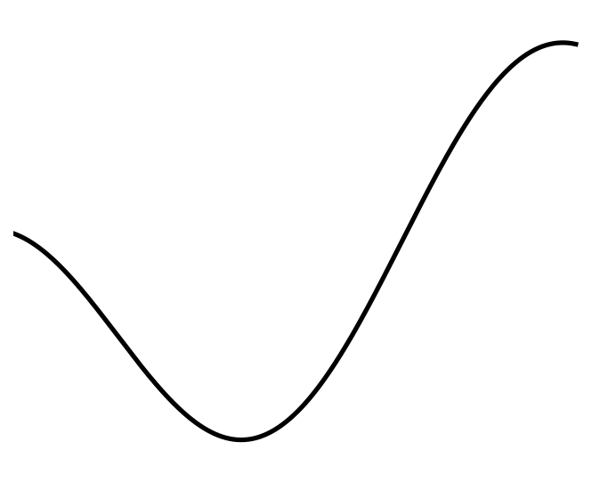
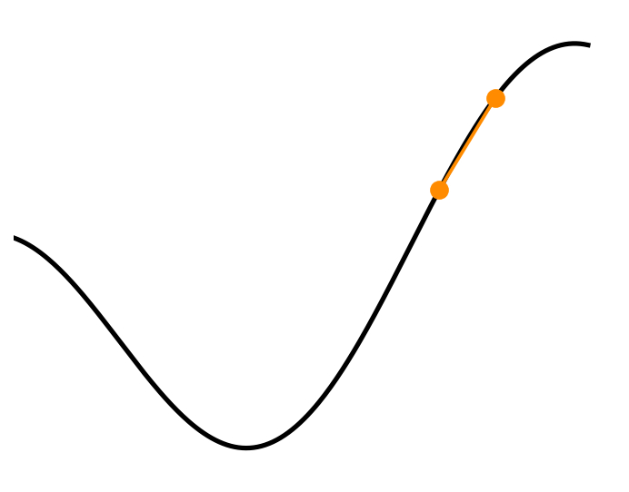
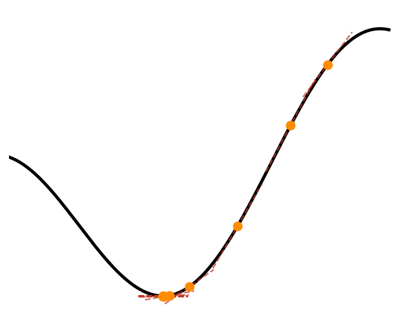
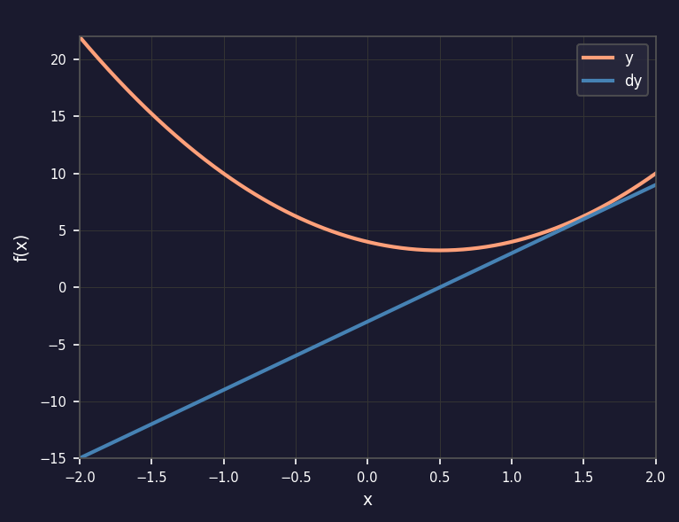
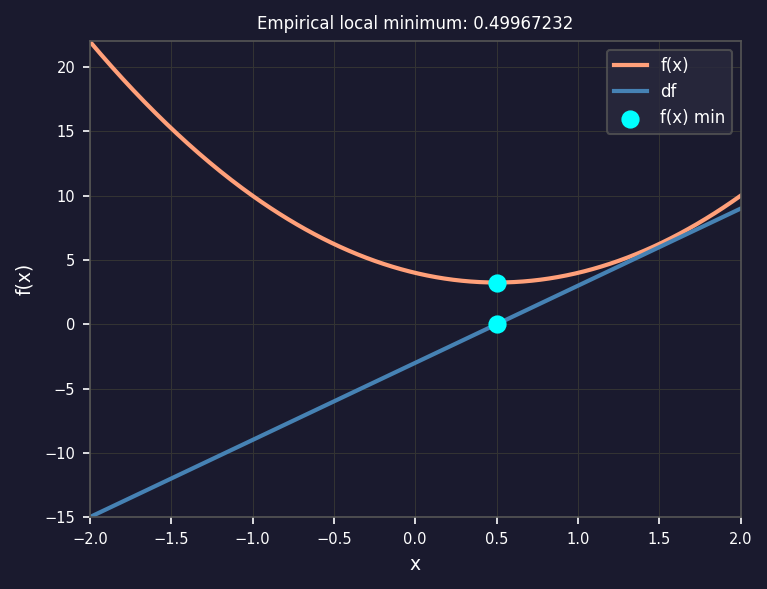
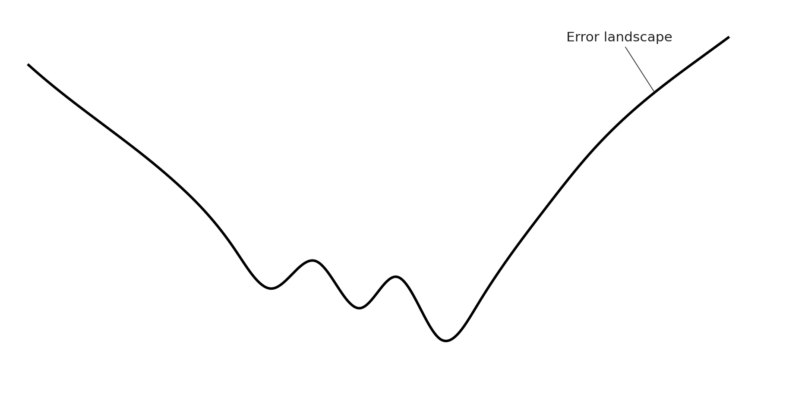
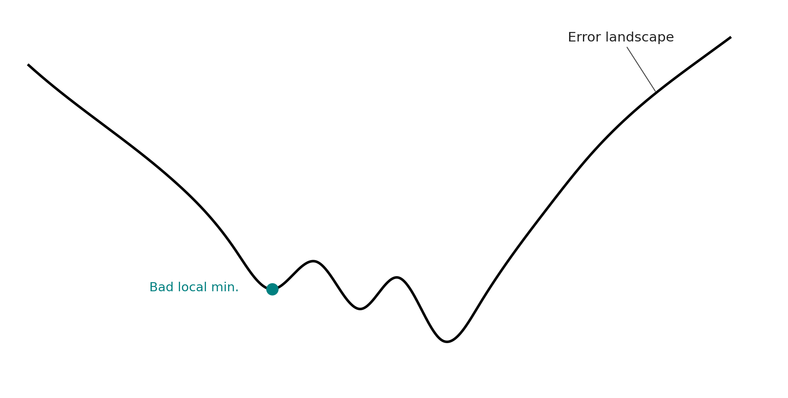
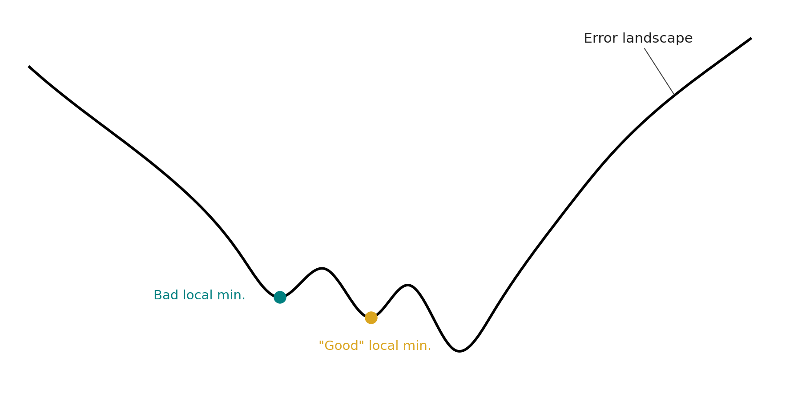
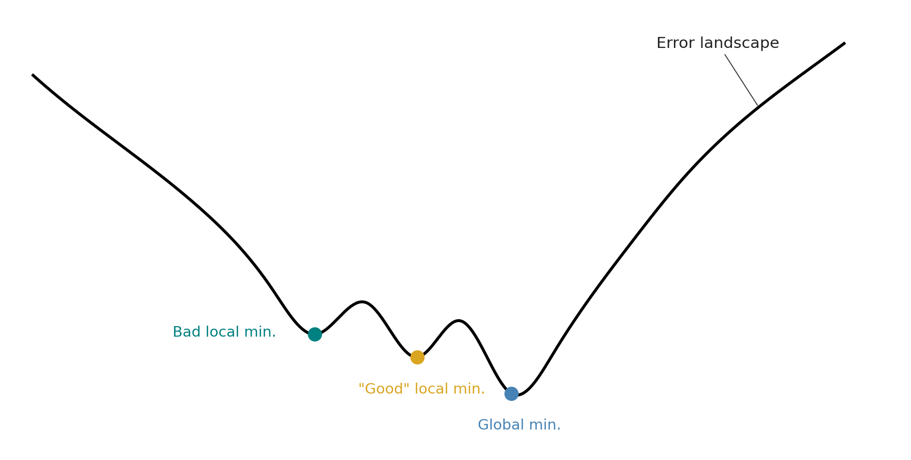

```{r}
knitr::opts_chunk$set(echo = TRUE)
library(reticulate)
use_python("/opt/anaconda3/bin/python")
```

# Aplicaciones: Resumen de la sección Y objetivos

## Aplicaciones: Resumen de la sección y objetivos {.title-line}

::: {.bg style="padding:0em; margin-top:0em; font-size:1.7em;margin-top:0em"}

En esta presentación, aprenderás

::: {.fragment .fade-in data-fragment-index=1 style="color: #c0392b;"}
● Cómo las derivadas hacen que los problemas difíciles sean más fáciles.
:::

::: {.fragment .fade-in data-fragment-index=2 style="color: navy;"}
● Cómo usar las derivadas para resolver problemas difíciles.
:::

::: {.fragment .fade-in data-fragment-index=3 style="color: teal;"}
● Cómo resolver problemas complejos utilizando derivadas.
:::

:::

## ¿Qué hacer con las derivadas? {.title-line}

::: {style="display: flex; flex-direction: column; justify-content: center; align-items: center; flex: 1; min-height: 0; gap: 0.8em; font-size: 1.5em;"}

::: {style="display: flex; flex-direction: row; align-items: center; gap: 0.5em;"}
::: {style="color: #c0392b; font-weight: bold;"}
Bosquejar funciones
:::
::: {.fragment .fade-in data-fragment-index=1 style="display: flex; flex-direction: row; align-items: center; gap: 0.5em;"}
$\Rightarrow$
:::
::: {.fragment .fade-in data-fragment-index=1 style="color: #B8860B; font-weight: bold;"}
¡Más fácil!
:::
:::

::: {style="display: flex; flex-direction: row; align-items: center; gap: 0.5em;"}
::: {style="color: navy; font-weight: bold;"}
Aproximar funciones
:::
::: {.fragment .fade-in data-fragment-index=2 style="display: flex; flex-direction: row; align-items: center; gap: 0.5em;"}
$\Rightarrow$
:::
::: {.fragment .fade-in data-fragment-index=2 style="color: #B8860B; font-weight: bold;"}
¡Más fácil!
:::
:::

::: {style="display: flex; flex-direction: row; align-items: center; gap: 0.5em;"}
::: {style="color: teal; font-weight: bold;"}
Resolver ecuaciones
:::
::: {.fragment .fade-in data-fragment-index=3 style="display: flex; flex-direction: row; align-items: center; gap: 0.5em;"}
$\Rightarrow$
:::
::: {.fragment .fade-in data-fragment-index=3 style="color: #B8860B; font-weight: bold;"}
¡Más fácil!
:::
:::

::: {style="display: flex; flex-direction: row; align-items: center; gap: 0.5em;"}
::: {style="color: #1a7a5a; font-weight: bold;"}
Optimizaciones
:::
::: {.fragment .fade-in data-fragment-index=4 style="display: flex; flex-direction: row; align-items: center; gap: 0.5em;"}
$\Rightarrow$
:::
::: {.fragment .fade-in data-fragment-index=4 style="color: #B8860B; font-weight: bold;"}
¡Más fácil!
:::
:::

:::

## ¡Funciones corriendo al infinito y más allá! {.title-line}

::: {.bg style="padding:0em; margin-top:0em; font-size:1.7em;margin-top:0em"}
En esta presentación, aprenderás


::: {.fragment .fade-in data-fragment-index=1 style="color: #c0392b;"}
● Cómo comparar qué tan rápido crecen las funciones hacia el infinito.
::: 

::: {.fragment .fade-in data-fragment-index=2 style="color: navy;"}
● Una aplicación de la regla de L'Hôpital.
:::

::: {.fragment .fade-in data-fragment-index=3 style="color: teal;"}
● ¡Por qué $e^x$ crece hacia el infinito tan rápido!
:::
:::

## La carrera ha comenzado {.title-line}

::: {style="display: flex; flex-direction: column; flex: 1; min-height: 0; padding: 0.5em 2em;"}

::: {style="text-align: center; padding-top: 0.5em;"}

::: {style="color: goldenrod; font-size: 1.3em; font-weight: bold;"}
¿Qué crece más rápido hacia el infinito:
:::

::: {style="color: navy; font-size: 1.3em; font-weight: bold;"}
$x$ ó $x^2$?
:::

:::

::: {style="display: flex; flex-direction: row; flex: 1; align-items: center; padding: 0 2em; gap: 4em;"}

::: {style="flex: 1; text-align: center; font-size: 1.8em;"}

::: {.r-stack}

::: {.fragment .fade-in data-fragment-index=1}
$$\frac{x^2}{x}$$
:::

::: {.fragment .fade-in data-fragment-index=2 style="background: white;"}
$$\lim_{x \to \infty} \frac{x^2}{x}$$
:::

:::

:::

::: {.fragment .fade-in data-fragment-index=3 style="flex: 1.2; display: flex; flex-direction: column; gap: 0.55em; font-size: 0.95em;"}

::: {style="color: #c0392b; font-weight: bold; font-size: 1.1em;"}
Respuestas posibles:
:::

::: {style="color: navy;"}
$\infty$: El numerador crece más rápido.
:::

::: {style="color: teal;"}
$0$: El denominador crece más rápido.
:::

::: {style="color: #666; font-style: italic;"}
$r$: La razón de crecimiento se estabiliza a un valor.
:::

:::

:::

:::

## La carrera de polinomios {.title-line}

::: {style="display: flex; flex-direction: column; justify-content: center; flex: 1; min-height: 0; padding: 0.3em 4em; gap: 0.2em; font-size: 0.92em;"}

::: {style="text-align: center; color: goldenrod;"}
$$f(x) = 5x^3 + x^2 + x + 1$$
:::

::: {style="text-align: center; color: #c0392b;"}
$$g(x) = 4x^3 + 9x^2 + 9x + 9$$
:::

::: {.fragment .fade-in data-fragment-index=1 style="margin-left: 3em;"}
$\displaystyle\lim_{x \to \infty} \frac{{\color{goldenrod} f(x)}}{{\color{#c0392b} g(x)}} = \frac{\infty}{\infty}$
:::

::: {style="display: flex; flex-direction: row; align-items: center; gap: 0.3em; margin-left: 3em;"}

::: {.fragment .fade-in data-fragment-index=2}
$\displaystyle\lim_{x \to \infty} \frac{{\color{goldenrod} f'}}{{\color{#c0392b} g'}} =$
:::

::: {.fragment .fade-in data-fragment-index=3}
$\displaystyle\frac{15x^2 + 2x + 1}{12x^2 + 18x + 9} =$
:::

::: {.fragment .fade-in data-fragment-index=4}
$\displaystyle\frac{\infty}{\infty}$
:::

:::

::: {.fragment .fade-in data-fragment-index=4 style="margin-left: 3em;"}
$\displaystyle\lim_{x \to \infty} \frac{{\color{goldenrod} f''}}{{\color{#c0392b} g''}} = \frac{30x + 2}{24x + 18} = \frac{\infty}{\infty}$
:::

::: {.fragment .fade-in data-fragment-index=5 style="margin-left: 3em;"}
$\displaystyle\lim_{x \to \infty} \frac{{\color{goldenrod} f^{(3)}}}{{\color{#c0392b} g^{(3)}}} = \frac{30}{24} = \frac{5}{4}$
:::

:::

## Potencias vs Exponenciales {.title-line}

::: {style="display: flex; flex-direction: column; justify-content: center; flex: 1; min-height: 0; padding: 0.3em 4em; gap: 0.6em; font-size: 0.92em;"}

::: {style="text-align: center; color: goldenrod;"}
$$f(x) = e^x$$
:::

::: {style="text-align: center; color: teal;"}
$$g(x) = x^2$$
:::

::: {.fragment .fade-in data-fragment-index=1 style="margin-left: 3em;"}
$\displaystyle\lim_{x \to \infty} \frac{{\color{goldenrod} f(x)}}{{\color{teal} g(x)}} = \frac{\infty}{\infty}$
:::

::: {.fragment .fade-in data-fragment-index=2 style="margin-left: 3em;"}
$\displaystyle\lim_{x \to \infty} \frac{{\color{goldenrod} f'}}{{\color{teal} g'}} = \frac{e^x}{2x} = \frac{\infty}{\infty}$
:::

::: {.fragment .fade-in data-fragment-index=3 style="margin-left: 3em;"}
$\displaystyle\lim_{x \to \infty} \frac{{\color{goldenrod} f''}}{{\color{teal} g''}} = \frac{e^x}{2} = \infty$
:::

:::

## Potencias vs Exponenciales {.title-line}

::: {style="display: flex; flex-direction: column; justify-content: center; align-items: center; flex: 1; min-height: 0; padding: 0.5em 2em; gap: 0.1em; font-size: 0.75em;"}

::: {style="font-size: 1.2em;"}
$$f(x) = {\color{goldenrod} e}^x$$
:::

::: {style="font-size: 1.2em;"}
$$g(x) = {\color{teal} x}^n$$
:::

::: {.fragment .fade-in data-fragment-index=1 style="font-size: 1.1em; margin-top: 0.5em;"}
$$\lim_{{\color{teal} x} \to \infty} \frac{f({\color{teal} x})}{g({\color{teal} x})} = \frac{\infty}{\infty}$$
:::

::: {.fragment .fade-in data-fragment-index=2 style="font-size: 1.1em; margin-top: 0.5em;"}
$$\lim_{{\color{teal} x} \to \infty} \frac{f'}{g'} = \frac{{\color{goldenrod} e}^{\color{teal} x}}{n{\color{teal} x}^{n-1}} = \frac{\infty}{\infty}$$
:::

::: {.fragment .fade-in data-fragment-index=3 style="font-size: 1.1em; margin-top: 0.5em;"}
$$\lim_{{\color{teal} x} \to \infty} \frac{f'}{g'} = \frac{{\color{goldenrod} e}^{\color{teal} x}}{c} = \infty$$
:::

::: {.fragment .fade-in data-fragment-index=4 style="font-size: 1.35em; margin-top: -1.5em; color: #2e0dc1;"}
El exponente natural crece hasta el infinito más rápido que cualquier potencia (o cualquier función no infinitamente diferenciable)
:::

:::

## Potencias vs Exponenciales {.title-line}

::: {style="display: flex; flex-direction: column; justify-content: center; align-items: center; flex: 1; min-height: 0; padding: 0.5em 2em; gap: 0.4em; font-size: 1.1em;"}

::: {style="font-size: 1.2em;"}
${\color{goldenrod}f}({\color{teal}x}) = e^{{\color{teal}-x}}$
:::

::: {style="font-size: 1.2em;"}
${\color{maroon}g}({\color{teal}x}) = {\color{teal}x}^2$
:::

::: {.fragment .fade-in data-fragment-index=1 style="margin-top: 0.6em; font-size: 1.1em;"}
$$\lim_{{\color{teal}x} \to \infty} \frac{{\color{goldenrod}f}({\color{teal}x})}{{\color{maroon}g}({\color{teal}x})} = \frac{{\color{maroon}0}}{\infty}$$
:::

::: {.fragment .fade-in data-fragment-index=2 style="margin-top: 0.4em; font-size: 1.1em;"}
$$\lim_{{\color{teal}x} \to \infty} \frac{{\color{goldenrod}f}'}{{\color{maroon}g}'} = \frac{{\color{teal}-e^{{\color{teal}-x}}}}{{\color{maroon}2}} = \frac{{\color{maroon}0}}{{\color{maroon}2}}$$
:::

:::

## La prueba de la segunda derivada {.title-line}

::: {style="display: flex; flex-direction: column; justify-content: center; align-items: flex-start; flex: 1; min-height: 0; padding: 0.5em 3em; gap: 0.5em; font-size: 1.1em;"}

::: {style="font-size: 1.2em; color: goldenrod; font-weight: bold; margin-bottom: 0.3em;"}
En esta presentación, aprenderás
:::

::: {.fragment .fade-in data-fragment-index=1 style="color: #c0392b;"}
- Qué es la prueba de la "segunda derivada".
:::

::: {.fragment .fade-in data-fragment-index=2 style="color: #1a5276;"}
- Cómo usar la prueba de 2.' para evaluar un punto crítico.
:::

::: {.fragment .fade-in data-fragment-index=3 style="color: #148777;"}
- Intuición de por qué funciona la prueba de 2.' (advertencia: no es muy intuitiva).
:::

::: {.fragment .fade-in data-fragment-index=4 style="color: #117a65;"}
- Cuándo y por qué la prueba de 2.' es inconclusa.
:::

:::

## Recordemos sobre los puntos críticos {.title-line}

```{python}
#| include: false
import numpy as np
import matplotlib.pyplot as plt

GOLD_CP  = '#B8860B'
RED_CP   = '#c0392b'
NAVY_CP  = 'navy'
TEAL_CP  = 'teal'
CORN_CP  = '#8e44ad'   # púrpura — diferencia Corner de Inflection
CURVE_CP = '#1a237e'

# ============================================
# PUNTO DE UNIÓN entre seno y cúbica (x=3.0)
# ============================================
_X_UNION_CP = 3.0  # Punto donde se conectan seno y cúbica

# ============================================
# SECCIÓN 2: Función cúbica f(x) = x³ (trasladada)
# Punto de inflexión claro: cambia de cóncavo a convexo
# ============================================
_X_INFL_CP = 3.5  # Punto de inflexión de la cúbica
_Y_INFL_CP = 2.8  # Valor en el punto de inflexión
_CUBIC_A_CP = 0.8  # Factor de escala para la cúbica

def _f_cubica_cp(x):
    """Función cúbica con punto de inflexión en (_X_INFL_CP, _Y_INFL_CP)"""
    return _Y_INFL_CP + _CUBIC_A_CP * (x - _X_INFL_CP)**3

def _df_cubica_cp(x):
    """Primera derivada de la cúbica"""
    return 3 * _CUBIC_A_CP * (x - _X_INFL_CP)**2

# Valores en el punto de unión (desde la cúbica)
_Y_UNION_CP = _f_cubica_cp(_X_UNION_CP)      # Valor de continuidad
_DY_UNION_CP = _df_cubica_cp(_X_UNION_CP)    # Pendiente para suavidad (C¹)

# ============================================
# SECCIÓN 1: Seno con máximo y mínimo
# Conectado suavemente con la cúbica en x=3.0
# f_seno(x) = A + B·sin(w·x + φ)
# Condiciones en x=3.0:
#   f_seno(3.0) = Y_UNION_CP (continuidad C⁰)
#   f'_seno(3.0) = DY_UNION_CP (suavidad C¹)
# ============================================
_W_CP = np.pi / 1.5  # Frecuencia angular (ajustada para mostrar mínimo)
_B_CP = 1.4          # Amplitud (ligeramente mayor)

# Calcular fase y offset para conectar suavemente
# f(3.0) = A + B·sin(w·3.0 + φ) = Y_UNION_CP
# f'(3.0) = B·w·cos(w·3.0 + φ) = DY_UNION_CP
def _f_seno_cp(x):
    # Fase calculada para que f'(3.0) = DY_UNION_CP
    _phase_at_union = np.arccos(np.clip(_DY_UNION_CP / (_B_CP * _W_CP), -1, 1))
    _phi_cp = _phase_at_union - _W_CP * _X_UNION_CP
    # Offset calculado para que f(3.0) = Y_UNION_CP
    _A_cp = _Y_UNION_CP - _B_CP * np.sin(_W_CP * _X_UNION_CP + _phi_cp)
    return _A_cp + _B_CP * np.sin(_W_CP * x + _phi_cp)

# ============================================
# SECCIÓN 3: Función gaussiana (derecha)
# ============================================
X_MAX2_CP = 6.5
Y_MAX2_CP = 3.7

def _f_right_cp(x):
    return 1.3 + 2.4 * np.exp(-0.7 * (x - X_MAX2_CP)**2)

# ============================================
# PUNTOS CRÍTICOS CLAVE
# ============================================
# Mínimo del seno: ocurre cuando sin(w·x + φ) = -1
X_MIN_CP  = 1.6
Y_MIN_CP  = _f_seno_cp(X_MIN_CP)

# Inflexión de la cúbica
X_INFL_CP = _X_INFL_CP
Y_INFL_CP = _f_cubica_cp(_X_INFL_CP)

# Esquina (corner)
X_CORN_CP = 5.0
Y_CORN_CP = 5.0

# Discontinuidad
X_DISC_CP = 5.5
Y_DISC_CP = 2.5

# Máximo de la gaussiana
#X_MAX2_CP = 6.5
#Y_MAX2_CP = _f_right_cp#(X_MAX2_CP)

# ============================================
# SECCIONES DE LA CURVA (precomputadas)
# ============================================
# Sección 1: Seno (x=0.5 a x=3.0) - conecta suavemente en x=3.0
_xs1_cp = np.linspace(0.5, _X_UNION_CP, 300)
_ys1_cp = _f_seno_cp(_xs1_cp)

# Sección 2: Cúbica (x=3.0 a x=4.5) - muestra claramente el punto de inflexión
_xs2_cp = np.linspace(_X_UNION_CP, 4.5, 200)
_ys2_cp = _f_cubica_cp(_xs2_cp)

# Sección 3a: Línea hacia la esquina (x=4.5 a x=5.0)
_xs3a_cp = np.array([4.5, X_CORN_CP])
_ys3a_cp = np.array([_f_cubica_cp(4.5), Y_CORN_CP])

# Sección 3b: Línea desde la esquina hacia discontinuidad
_xs3b_cp = np.array([X_CORN_CP, X_DISC_CP])
_ys3b_cp = np.array([Y_CORN_CP, Y_DISC_CP])

# Sección 4: Gaussiana (derecha) - ampliada para mostrar más de la parábola
_xs4_cp = np.linspace(5.75, 7.5, 200)
_ys4_cp = _f_right_cp(_xs4_cp)

def plot_cp(show_points=False, show_legend=False):
    fig, ax = plt.subplots(figsize=(10, 7))

    # Dibujar todas las secciones
    ax.plot(_xs1_cp,  _ys1_cp,  color=CURVE_CP, lw=2.5, label='Seno')
    ax.plot(_xs2_cp,  _ys2_cp,  color=CURVE_CP, lw=2.5, label='Cúbica')
    ax.plot(_xs3a_cp, _ys3a_cp, color=CURVE_CP, lw=2.5)
    ax.plot(_xs3b_cp, _ys3b_cp, color=CURVE_CP, lw=2.5)
    ax.plot(_xs4_cp,  _ys4_cp,  color=CURVE_CP, lw=2.5)

    if show_points:
        ms, mk = 11, 's'
        ax.plot(X_MIN_CP,  Y_MIN_CP,  mk, color=RED_CP,  ms=ms, zorder=5)
        ax.plot(X_INFL_CP, Y_INFL_CP, mk, color=TEAL_CP, ms=ms, zorder=5)
        ax.plot(X_CORN_CP, Y_CORN_CP, '^', color=CORN_CP, ms=14, zorder=5)
        ax.plot(X_MAX2_CP, Y_MAX2_CP, mk, color=GOLD_CP, ms=ms, zorder=5)
        
        # Discontinuidad: ○ fin izquierdo (valor excluido) + ● inicio derecho
        _xdr = 5.75
        _ydr = _f_right_cp(_xdr)
        ax.plot(X_DISC_CP, Y_DISC_CP, 'o', ms=12, zorder=6,
                color='white', markeredgecolor=NAVY_CP, markeredgewidth=2.5)
        ax.plot(_xdr, _ydr, 'o', ms=12, zorder=6, color=NAVY_CP)

    if show_legend:
        lx = 4.4
        items = [
            ('Maximum',       GOLD_CP, 1.8),
            ('Minimum',       RED_CP,  1.4),
            ('Discontinuity', NAVY_CP, 1.0),
            ('Inflection',    TEAL_CP, 0.6),
            ('Corner',        CORN_CP, 0.2),
        ]
        for label, color, ly in items:
            ax.text(lx, ly, label, color=color, fontsize=22,
                    fontweight='bold', ha='left', va='center')

    ax.set_xticks([])
    ax.set_yticks([])
    for sp in ax.spines.values():
        sp.set_visible(False)
    ax.set_xlim(0.1, 8.1)
    ax.set_ylim(-0.3, 6.5)  # Límite inferior negativo para mostrar el mínimo
    plt.tight_layout(pad=0.3)
    plt.show()
```

::: {style="display: flex; flex-direction: column; flex: 1; min-height: 0;"}

::: {.r-stack style="flex: 1; min-height: 0; width: 100%;"}

::: {style="width: 100%;"}

```{python}
#| echo: false
#| fig-align: center
plot_cp()
```

:::

::: {.fragment .fade-in data-fragment-index=1 style="background: white; width: 100%;"}

```{python}
#| echo: false
#| fig-align: center
plot_cp(show_points=True)
```

:::


::: {.fragment .fade-in data-fragment-index=2 style="background: white; width: 100%;"}

```{python}
#| echo: false
#| fig-align: center
plot_cp(show_points=True, show_legend=True)
```

:::

:::

:::

## La prueba 2da derivada {.title-line}

::: {style="display: flex; flex-direction: column; justify-content: center; align-items: center; flex: 1; min-height: 0; padding: 0.5em 2em; gap: 0.3em; font-size: 1.15em;"}

::: {style="text-align: center; font-size: 1.1em;"}
si $\tilde{{\color{#148777}x}}$ es un punto crítico $f$, y
:::

::: {style="text-align: center; font-size: 1.1em;"}
si $f'(\tilde{{\color{#148777}x}})$ y $f''(\tilde{{\color{#148777}x}})$ existe, entonces:
:::

::: {.fragment .fade-in data-fragment-index=1 style="display: flex; flex-direction: column; align-items: center; gap: 0.05em; font-size: 1em; margin-top: 0em;"}

::: {style="display: flex; align-items: center; gap: 0.1em;"}
$$f''(\tilde{{\color{#148777}x}}) > {\color{maroon}0} \;\to\; f(\tilde{{\color{#148777}x}}) \text{ es un mínimo local,}$$
:::

::: {style="display: flex; align-items: center; gap: 0.1em;"}
$$f''(\tilde{{\color{#148777}x}}) < {\color{maroon}0} \;\to\; f(\tilde{{\color{#148777}x}}) \text{ es un máximo local,}$$
:::

::: {style="display: flex; align-items: center; gap: 0.1em;"}
$$f''(\tilde{{\color{#148777}x}}) = {\color{maroon}0} \;\to\; \text{inconclusivo.}$$
:::

:::

:::

## La prueba 2da derivada Ejercicio -1- {.title-line}

::: {style="display: flex; flex-direction: column; flex: 1; min-height: 0; font-size: 0.95em; position: relative;"}

::: {style="width: 100%; padding: 0.8em 3em; display: flex; flex-direction: row; gap: 5em; align-items: flex-start;"}

::: {style="display: flex; flex-direction: column; gap: 0.6em;"}

${\color{goldenrod} f} = {\color{teal} x}^4 - 8{\color{teal} x}^2$

::: {.fragment .fade-in data-fragment-index=1}
${\color{goldenrod} f'} = 4{\color{teal} x}^3 - 16{\color{teal} x}$
:::

::: {.fragment .fade-in data-fragment-index=1}
${\color{goldenrod} f''} = 12{\color{teal} x}^2 - 16$
:::

:::

::: {style="display: flex; flex-direction: column; gap: 0.5em;"}

::: {.fragment .fade-in data-fragment-index=2}
${\color{goldenrod} f'} = 0$
:::

::: {.fragment .fade-in data-fragment-index=2}
$0 = 4{\color{teal} x}^3 - 16{\color{teal} x}$
:::

::: {.fragment .fade-in data-fragment-index=3}
$0 = {\color{teal} x}(4{\color{teal} x}^2 - 16)$
:::

::: {.fragment .fade-in data-fragment-index=4}
$0 = 4{\color{teal} x}^2 - 16$
:::

::: {.fragment .fade-in data-fragment-index=4}
$16 = 4{\color{teal} x}^2$
:::

::: {.fragment .fade-in data-fragment-index=4}
$4 = {\color{teal} x}^2$
:::

::: {.fragment .fade-in data-fragment-index=4}
${\color{teal} x} = {\color{goldenrod} -2, 0, 2}$
:::

:::

:::

::: {.fragment .fade-in data-fragment-index=5 style="position: absolute; inset: 0; background: white; padding: 0.8em 3em; display: flex; flex-direction: row; justify-content: space-between; align-items: flex-start;"}

::: {}
${\color{goldenrod} f} = {\color{teal} x}^4 - 8{\color{teal} x}^2$
:::

::: {style="display: flex; flex-direction: column; gap: 0.6em;"}
${\color{goldenrod} f''(-2) > 0}$

${\color{goldenrod} f''(0) < 0}$

${\color{goldenrod} f''(2) > 0}$
:::

:::

::: {.fragment .fade-in data-fragment-index=6 style="position: absolute; inset: 0; background: white; padding: 0.8em 3em; display: flex; flex-direction: row; justify-content: space-between; align-items: flex-start;"}

::: {style="display: flex; flex-direction: column; gap: 0.6em;"}

${\color{goldenrod} f} = {\color{teal} x}^4 - 8{\color{teal} x}^2$

::: {style="margin-top: 1em; display: flex; flex-direction: column; gap: 0.4em;"}

**Conclusiones:**

::: {style="color: #148777;"}
$f(-2)$ es un mínimo local
:::

::: {style="color: #148777;"}
$f(0)$ es un máximo local
:::

::: {style="color: #148777;"}
$f(2)$ es un mínimo local
:::

:::

:::

::: {style="display: flex; flex-direction: column; gap: 0.6em;"}
${\color{goldenrod} f''(-2) > 0}$

${\color{goldenrod} f''(0) < 0}$

${\color{goldenrod} f''(2) > 0}$
:::

:::

:::

## Intuición detrás de la prueba 2da derivada {.title-line}

```{python}
#| include: false
import numpy as np
import matplotlib.pyplot as plt
import matplotlib.patches as mpatches

GOLD_IB = '#B8860B'
RED_IB  = '#c0392b'
BLUE_IB = 'steelblue'

def _f_ib(x):   return x**4 - 8*x**2
def _df_ib(x):  return 4*x**3 - 16*x
def _d2f_ib(x): return 12*x**2 - 16

X_CRIT_IB  = np.array([-2.0, 0.0, 2.0])
Y_CRIT_IB  = _f_ib(X_CRIT_IB)
X_INFL_IB  = np.array([-np.sqrt(4/3), np.sqrt(4/3)])

_xs_ib   = np.linspace(-3.2, 3.2, 500)
_ys_f_ib  = _f_ib(_xs_ib)
_ys_df_ib = _df_ib(_xs_ib)
_ys_d2_ib = _d2f_ib(_xs_ib)

_Y_LO_IB, _Y_HI_IB = -21, 8

def plot_ib(show_all=False, show_boxes_12=False, show_box_3=False, show_vlines=False):
    fig, ax = plt.subplots(figsize=(10, 6.2))

    ax.plot(_xs_ib, _ys_f_ib, color=GOLD_IB, lw=2.8, label=r"$f$", zorder=3)

    if show_all:
        ax.plot(_xs_ib, _ys_df_ib, color=RED_IB,  lw=2.2, label=r"$f'$",  zorder=3)
        ax.plot(_xs_ib, _ys_d2_ib, color=BLUE_IB, lw=2.2, label=r"$f''$", zorder=3)
        ax.axhline(0, color='black', lw=1.0, ls='--', alpha=0.55, zorder=2)
        for xc, yc in zip(X_CRIT_IB, Y_CRIT_IB):
            ax.plot(xc, yc, 'o', color=GOLD_IB, ms=10, zorder=5,
                    markeredgecolor='white', markeredgewidth=1.5)
        ax.legend(loc='upper right', fontsize=19, framealpha=0.9)

    if not show_vlines:
        regions = []
        if show_boxes_12:
            regions.append((-3.2,          X_INFL_IB[0]))
            regions.append((X_INFL_IB[0],  X_INFL_IB[1]))
        if show_box_3:
            regions.append((X_INFL_IB[1],  3.2))
        for (x0, x1) in regions:
            ax.add_patch(mpatches.Rectangle(
                (x0, _Y_LO_IB), x1 - x0, _Y_HI_IB - _Y_LO_IB,
                linewidth=2, edgecolor=BLUE_IB, facecolor='none',
                linestyle='--', zorder=4, alpha=0.85
            ))

    if show_vlines:
        for xi in X_INFL_IB:
            ax.axvline(xi, color=BLUE_IB, lw=2.2, ls='--', zorder=4)

    ax.set_xticks([])
    ax.set_yticks([])
    for sp in ax.spines.values():
        sp.set_visible(False)
    ax.set_xlim(-3.2, 3.2)
    ax.set_ylim(_Y_LO_IB, _Y_HI_IB)
    plt.tight_layout(pad=0.3)
    plt.show()
```

::: {style="display: flex; flex-direction: column; flex: 1; min-height: 0; padding: 0.2em 2em 0 2em;"}

::: {style="font-size: 1.1em; margin-bottom: 0.15em;"}
${\color{goldenrod} f}({\color{teal} x}) = {\color{teal} x}^4 - 8{\color{teal} x}^2$
:::

::: {.r-stack style="flex: 1; min-height: 0; width: 100%;"}

::: {style="width: 100%;"}

```{python}
#| echo: false
#| fig-align: center
plot_ib()
```

:::

::: {.fragment .fade-in data-fragment-index=1 style="background: white; width: 100%;"}

```{python}
#| echo: false
#| fig-align: center
plot_ib(show_all=True)
```

:::

::: {.fragment .fade-in data-fragment-index=2 style="background: white; width: 100%;"}

```{python}
#| echo: false
#| fig-align: center
plot_ib(show_all=True, show_boxes_12=True)
```

:::

::: {.fragment .fade-in data-fragment-index=3 style="background: white; width: 100%;"}

```{python}
#| echo: false
#| fig-align: center
plot_ib(show_all=True, show_boxes_12=True, show_box_3=True)
```

:::

::: {.fragment .fade-in data-fragment-index=4 style="background: white; width: 100%;"}

```{python}
#| echo: false
#| fig-align: center
plot_ib(show_all=True, show_vlines=True)
```

:::

:::

:::

## Ejemplo 2 {.title-line}

::: {style="display: flex; flex-direction: row; flex: 1; min-height: 0; padding: 0.5em 1em; gap: 1em; align-items: center;"}

::: {style="display: flex; flex-direction: column; justify-content: center; align-items: flex-start; gap: 0.4em; width: 42%; font-size: 1.05em;"}

::: {}
${\color{goldenrod} f}({\color{teal} x}) = 2\pi{\color{teal} x} + \sin(\pi{\color{teal} x})$
:::

::: {.fragment .fade-in data-fragment-index=1}
${\color{goldenrod} f}'({\color{teal} x}) = 2\pi + \pi\cos(\pi{\color{teal} x})$
:::

::: {.fragment .fade-in data-fragment-index=2 style="color: navy; font-style: italic; font-size: 1.1em; margin-top: 0.3em;font-weight: bold;"}
*No critical points!*
:::

:::

::: {.fragment .fade-in data-fragment-index=3 style="width: 58%; display: flex; flex-direction: column; gap: 0.3em;"}

```{python}
#| echo: false
#| fig-align: center
#| results: 'hide'
import numpy as np
import matplotlib.pyplot as plt

x = np.linspace(-3, 3, 400)
y = 2*np.pi*x + np.sin(np.pi*x)
yp = 2*np.pi + np.pi*np.cos(np.pi*x)

fig, axes = plt.subplots(2, 1, figsize=(7.5, 6.8))

ax1 = axes[0]
ax1.plot(x, y, color='#8B7D3A', lw=1.8)
ax1.set_xlim(-3, 3)
ax1.set_ylim(-20, 22)
ax1.set_xticks([-3, -2, -1, 0, 1, 2, 3])
ax1.set_yticks([-20, 0, 20])
ax1.text(0.98, 1.02, r'$f(x) = 2\pi x + \sin(\pi x)$',
         transform=ax1.transAxes, fontsize=16, ha='right', va='bottom')

ax2 = axes[1]
ax2.plot(x, yp, color='#A0522D', lw=1.8)
ax2.set_xlim(-3, 3)
ax2.set_ylim(0, 11)
ax2.set_xticks([-3, -2, -1, 0, 1, 2, 3])
ax2.set_yticks([0, 5, 10])
ax2.text(0.98, 1.02, r"$f'(x) = 2\pi + \pi\cos(\pi x)$",
         transform=ax2.transAxes, fontsize=16, ha='right', va='bottom')

plt.tight_layout()
plt.show()
```

:::

:::

## DesafioCode: Prueba de la 2da derivada {.title-line}

::: {style="display: flex; flex-direction: column; justify-content: center; align-items: flex-start; flex: 1; min-height: 0; padding: 0.5em 3em; gap: 0.5em; font-size: 1.1em;"}

::: {style="font-size: 1.2em; color: goldenrod; font-weight: bold; margin-bottom: 0.3em;"}
En esta presentación, aprenderás
:::

::: {style="display: flex; flex-direction: column; gap: 0.3em; font-size: 1.05em;"}

::: {style="color: #c0392b;"}
• How to implement the second derivative test in python.
:::

::: {style="color: navy;"}
• More about working with sympy.
:::

:::

:::

## Implementando la prueba de la 2da derivada {.title-line}

## Ejercicio 1: Compute and plot the derivatives {.title-line}

::: {style="display: flex; flex-direction: column; justify-content: center; align-items: center; flex: 1; min-height: 0; font-size: 1.5em;"}

$$f = {\color{teal} x}^4 - 8{\color{teal} x}^2$$

:::

```{python style="font-size: 1.2em;align-items: center;"}
#| echo: false
#| results: 'hide'
#| fig-align: center
import numpy as np
import sympy as sym
import matplotlib.pyplot as plt

x = sym.symbols('x')

# the function and its derivatives
f = x**4 - 8*x**2
df = sym.diff(f,x)
ddf = sym.diff(f,x,2)

# find f'=0
critPoints = np.array(sym.solve(df))

# lambdify and plot
f_l = sym.lambdify(x,f)
df_l = sym.lambdify(x,df)
ddf_l = sym.lambdify(x,ddf)
xx = np.linspace(-3,3,101)

plt.plot(xx,f_l(xx),label="f")
plt.plot(xx,df_l(xx),label="f'")
plt.plot(xx,ddf_l(xx),label="f''")
plt.plot(critPoints,df_l(critPoints),'o',label="f'=0")
plt.plot(critPoints,ddf_l(critPoints),'d',label="f''(f'=0)")
plt.plot(xx[[0,-1]],[0,0],'k--',linewidth=.2)

plt.ylim([-50,50])
plt.xlim(xx[[0,-1]])
plt.legend()
plt.show()
```

## Taller de programación {.title-line}

::: {style="display: flex; flex-direction: column; justify-content: center; flex: 1; min-height: 0;"}

```{.python style="font-size: 1.4em;" code-line-numbers="1-3|5|8-9|11|14-16|19-20|23-26|28-33|35-38"}
import numpy as np
import sympy as sym
import matplotlib.pyplot as plt

from IPython.display import display,Math

# better image resolution
import matplotlib_inline.backend_inline as disPlay
disPlay.set_matplotlib_formats('svg')

x = sym.symbols('x')

# the function and its derivatives
f = x**4 - 8*x**2
df = sym.diff(f,x)
ddf = sym.diff(f,x,2)

# find f'=0
critPoints = np.array( sym.solve(df) )
critPoints

# lambdify and plot
f_l = sym.lambdify(x,f)
df_l = sym.lambdify(x,df)
ddf_l = sym.lambdify(x,ddf)
xx = np.linspace(-3,3,101)

plt.plot(xx,f_l(xx),label="f")
plt.plot(xx,df_l(xx),label="f'")
plt.plot(xx,ddf_l(xx),label="f''")
plt.plot(critPoints,df_l(critPoints),'o',label="f'=0")
plt.plot(critPoints,ddf_l(critPoints),'d',label="f''(f'=0)")
plt.plot(xx[[0,-1]],[0,0],'k--',linewidth=.2)

plt.ylim([-50,50])
plt.xlim(xx[[0,-1]])
plt.legend()
plt.show()
```

::: {style="margin-top: -1.5em; font-size: 0.82em; color: #2c3e50;"}
**Resultado de la ejecución:**
:::

```{python style="font-size: 0.75em;"}
#| echo: false
#| results: asis
import numpy as np
import sympy as sym
import matplotlib.pyplot as plt

x = sym.symbols('x')

# the function and its derivatives
f = x**4 - 8*x**2
df = sym.diff(f,x)
ddf = sym.diff(f,x,2)

print(r"$$f = " + sym.latex(f) + "$$\n\n")
print(r"$$f' = " + sym.latex(df) + "$$\n\n")
print(r"$$f'' = " + sym.latex(ddf) + "$$\n\n")

# find f'=0
critPoints = np.array(sym.solve(df))
print(r"$$\text{Critical points: } " + r', '.join([sym.latex(p) for p in critPoints]) + "$$\n\n")

# lambdify and plot
f_l = sym.lambdify(x,f)
df_l = sym.lambdify(x,df)
ddf_l = sym.lambdify(x,ddf)
xx = np.linspace(-3,3,101)

plt.plot(xx,f_l(xx),label="f")
plt.plot(xx,df_l(xx),label="f'")
plt.plot(xx,ddf_l(xx),label="f''")
plt.plot(critPoints,df_l(critPoints),'o',label="f'=0")
plt.plot(critPoints,ddf_l(critPoints),'d',label="f''(f'=0)")
plt.plot(xx[[0,-1]],[0,0],'k--',linewidth=.2)

plt.ylim([-50,50])
plt.xlim(xx[[0,-1]])
plt.legend()
plt.show()
```

:::

## Ejercicio 2: Implementar la prueba de la 2da derivada {.title-line}

::: {style="display: flex; flex-direction: column; justify-content: center; align-items: center; flex: 1; min-height: 0; padding: 0.5em 3em; gap: 0.8em; font-size: 1.1em;"}

::: {style="font-size: 1.3em; color: goldenrod; font-weight: bold; text-align: center;"}
Recorrer todos los puntos críticos.
:::

::: {style="font-size: 1.15em; color: #2c3e50; text-align: center; margin-bottom: 0.5em;"}
Probar cada uno e informar los resultados.
:::

::: {.fragment .fade-in data-fragment-index=1 style="display: flex; flex-direction: column; align-items: center; gap: 0.6em; font-size: 1.1em;"}

::: {style="color: #27ae60;"}
$$f(-2) > 0 \;\Longrightarrow\; f(-2) \text{ es un mínimo local}$$
:::

::: {style="color: #e74c3c;"}
$$f(0) < 0 \;\Longrightarrow\; f(0) \text{ es un máximo local}$$
:::

::: {style="color: #27ae60;"}
$$f(2) > 0 \;\Longrightarrow\; f(2) \text{ es un mínimo local}$$
:::

:::

:::

## Aproximación Lineal {.title-line}

::: {style="font-size: 1.35em; padding: 0.5em 1em; line-height: 1.6;"}

::: {style="font-size: 1.2em; color: goldenrod; font-weight: bold; margin-bottom: 0.3em;"}
En esta presentación, aprenderás
:::

::: {style="display: flex; flex-direction: column; gap: 0.3em; font-size: 1.05em;"}

::: {style="color: #c0392b; margin-bottom: 0.3em;"}
● Qué significa aproximar linealmente una función.
:::

::: {style="color: navy; margin-bottom: 0.3em;"}
● Por qué son importantes las aproximaciones lineales.
:::

::: {style="color: navy;"}
● La fórmula para las aproximaciones lineales (pista: ¡involucra la derivada!).
:::

:::

:::

## ¿Qué es una aproximar linealmente Lineal? {.title-line}

::: {style="font-size: 1.35em; padding: 0.5em 1em; line-height: 1.6;"}

::: {style="color: goldenrod; font-weight: bold; margin-bottom: 0.5em;"}
En esta presentación, aprenderás
:::

::: {style="color: #c0392b; margin-bottom: 0.3em;"}
● Las funciones no lineales pueden aproximarse bien mediante funciones lineales si $dx$ es "suficientemente pequeño".
:::

::: {style="color: navy; margin-bottom: 0.3em;"}
● Las funciones no lineales pueden ser difíciles de calcular, requieren mucho tiempo y son propensas a imprecisiones numéricas.
:::

::: {style="color: navy; margin-bottom: 0.3em;"}
● Las funciones lineales son fáciles, rápidas y precisas.
:::
::: {style="color: navy; margin-bottom: 0.3em;"}
● (Las aproximaciones lineales eran extremadamente importantes antes de las computadoras, pero se siguen usando ahora).
:::

:::

## ¿Cómo funcionan las aproximaciones lineales? {.title-line}

```{python}
#| include: false
import numpy as np
import matplotlib.pyplot as plt

GOLD_LA = '#B8860B'
RED_LA  = '#c0392b'
BLUE_LA = '#1a237e'
TEAL_LA = 'teal'

def _f_la(x):  return 1.5*np.sin(x) + 0.3*x + 2.0
def _df_la(x): return 1.5*np.cos(x) + 0.3

_A_LA   = 6.0
_X0_LA  = 6.5
_FA_LA  = _f_la(_A_LA)
_DFA_LA = _df_la(_A_LA)
_FX0_LA = _f_la(_X0_LA)
_LX0_LA = _FA_LA + _DFA_LA * (_X0_LA - _A_LA)

_xs_la = np.linspace(0.3, 8.5, 600)
_ys_la = _f_la(_xs_la)

_XLIM_LA = (0.0, 8.7)
_YLIM_LA = (0.3, 7.2)

def _draw_full_la(ax):
    ax.plot(_xs_la, _ys_la, color=BLUE_LA, lw=2.5, zorder=3)
    t_x = np.array([_A_LA - 3.2, _A_LA + 2.2])
    t_y = _FA_LA + _DFA_LA * (t_x - _A_LA)
    ax.plot(t_x, t_y, color=GOLD_LA, lw=2.0, zorder=3)
    ax.plot(_A_LA,  _FA_LA,  'o', color=GOLD_LA, ms=12, zorder=5)
    ax.plot(_X0_LA, _FX0_LA, 'o', color=RED_LA,  ms=10, zorder=5)
    ax.plot(_X0_LA, _LX0_LA, 'o', color=RED_LA,  ms=8,  zorder=5,
            markeredgecolor='white', markeredgewidth=1.2)
    ax.plot([_X0_LA, _X0_LA], [_LX0_LA, _FX0_LA],
            color=RED_LA, lw=1.8, zorder=4)
    ax.axvline(_A_LA,  color=GOLD_LA, lw=1.2, ls='--', alpha=0.65, zorder=2)
    ax.axvline(_X0_LA, color=RED_LA,  lw=1.5, ls='--', alpha=0.75, zorder=2)
    y0 = _YLIM_LA[0] + 0.25
    ax.text(_A_LA  - 0.1, y0, r'$a$',    color=GOLD_LA, fontsize=20, ha='right', va='bottom')
    ax.text(_X0_LA + 0.1, y0, r'$x_0$',  color=RED_LA,  fontsize=20, ha='left',  va='bottom')
    for sp in ax.spines.values(): sp.set_visible(False)
    ax.set_xticks([]); ax.set_yticks([])
    ax.set_xlim(*_XLIM_LA); ax.set_ylim(*_YLIM_LA)

def plot_la(show_zoom=False):
    if not show_zoom:
        fig, ax = plt.subplots(figsize=(11, 6.2))
        _draw_full_la(ax)
    else:
        fig, (ax_z, ax_f) = plt.subplots(1, 2, figsize=(12, 6.0),
                                          gridspec_kw={'width_ratios': [1.3, 1]})
        zr = 0.55
        xz = np.linspace(_A_LA - zr, _A_LA + zr, 300)
        yz_f = _f_la(xz)
        yz_t = _FA_LA + _DFA_LA * (xz - _A_LA)
        dy   = zr * abs(_DFA_LA) + 0.25
        zy_lo, zy_hi = _FA_LA - dy, _FA_LA + dy

        ax_z.plot(xz, yz_f, color=BLUE_LA, lw=3.5, zorder=3)
        ax_z.plot(xz, yz_t, color=GOLD_LA, lw=2.5, zorder=3)
        ax_z.plot(_A_LA,  _FA_LA,  'o', color=GOLD_LA, ms=20, zorder=5)
        ax_z.plot(_X0_LA, _FX0_LA, 'o', color=RED_LA,  ms=10, zorder=5)
        ax_z.axhline(_FA_LA, color='black', lw=1.2, zorder=2)
        ax_z.axvline(_A_LA,  color='black', lw=1.2, zorder=2)
        ax_z.axvline(_X0_LA, color=RED_LA,  lw=1.8, ls='--', zorder=4)
        for sp in ax_z.spines.values():
            sp.set_visible(True)
            sp.set_color(TEAL_LA)
            sp.set_linewidth(2.5)
            sp.set_linestyle('--')
        ax_z.set_xticks([]); ax_z.set_yticks([])
        ax_z.set_xlim(_A_LA - zr, _A_LA + zr)
        ax_z.set_ylim(zy_lo, zy_hi)

        _draw_full_la(ax_f)

    plt.tight_layout(pad=0.4)
    plt.show()
```

::: {style="display: flex; flex-direction: column; flex: 1; min-height: 0;"}

::: {.r-stack style="flex: 1; min-height: 0; width: 100%;"}

::: {style="width: 100%;"}

```{python}
#| echo: false
#| fig-align: center
plot_la()
```

:::

::: {.fragment .fade-in data-fragment-index=1 style="background: white; width: 100%;"}

```{python}
#| echo: false
#| fig-align: center
plot_la(show_zoom=True)
```

:::

:::

:::

## Fórmula para la aproximación Lineal {.title-line}

::: {style="display: flex; flex-direction: column; justify-content: center; align-items: center; flex: 1; min-height: 0; gap: 0.7em; font-size: 1.7em; position: relative;"}

$${\color{goldenrod} f(x_0)} \approx {\color{navy} f'(a)(x_0-a)} + {\color{#c0392b} f(a)}$$

::: {.fragment .fade-in data-fragment-index=1}
$${\color{goldenrod} y} = {\color{navy} m}{\color{teal} x} + {\color{#c0392b} b}$$
:::

::: {.fragment .fade-in data-fragment-index=2 style="display: flex; flex-direction: row; justify-content: space-around; width: 100%; max-width: 30em; font-size: 0.72em;"}

::: {style="color: goldenrod;"}
Aproximación
:::

::: {style="color: navy;"}
Pendiente
:::

::: {style="color: teal;"}
dx
:::

::: {style="color: #c0392b;"}
Intercepto
:::

:::

::: {.fragment .fade-in data-fragment-index=3 style="position: absolute; inset: 0; background: white; display: flex; flex-direction: column; justify-content: center; align-items: center; gap: 0.7em;"}

$${\color{goldenrod} f(x_0)} \approx {\color{navy} f'(a)(x_0-a)} + {\color{#c0392b} f(a)}$$

$${\color{goldenrod} L(x_0)} = {\color{#c0392b} f(a)} + {\color{navy} f'(a)(x_0-a)}$$

:::

:::

## Ejemplo de aproximación Lineal -1a- {.title-line}

::: {style="display: flex; flex-direction: column; justify-content: center; align-items: center; flex: 1; min-height: 0; gap: 0.05em; font-size: 1.05em;"}

::: {style="display: flex; flex-direction: column; align-items: center; gap: 0.1em;"}

$${\color{goldenrod} f}({\color{teal} x}) = \sqrt{{\color{teal} x}} + 2{\color{teal} x}$$

::: {.fragment .fade-in data-fragment-index=1}
$${\color{goldenrod} f'}({\color{teal} x}) = \frac{1}{2}{\color{teal} x}^{-1/2} + 2$$
:::

::: {.fragment .fade-in data-fragment-index=2}
$$= \frac{1}{2 \sqrt{{\color{teal} x}}} + 2$$
:::

:::

::: {style="display: flex; flex-direction: column; align-items: center; gap: 0.15em;"}

$${\color{#c0392b} a} = 4$$
$${\color{teal} x_0} = 4.37$$
$${\color{goldenrod} L(x_0)} = {\color{navy} f'(a)(x_0-a)} + {\color{#c0392b} f(a)}$$

:::

:::

## Ejemplo de aproximación Lineal -1b- {.title-line}

::: {style="display: flex; flex-direction: column; justify-content: flex-start; align-items: flex-start; flex: 1; min-height: 0; padding: 1.8em 2em 1em 4em; gap: 0.5em; font-size: 1.15em;"}

$\displaystyle{\color{goldenrod} L(x_0)} = {\color{navy} f'(a)}({\color{teal} x_0} - {\color{#c0392b} a}) + {\color{#c0392b} f(a)}$

::: {.fragment .fade-in data-fragment-index=1 style="margin-left: 3em;"}
$\displaystyle= \left[\frac{1}{2\sqrt{{\color{#c0392b} 4}}} + 2\right]({\color{teal} 4.37} - {\color{#c0392b} 4}) + \left(\sqrt{{\color{#c0392b} 4}} + 2 \cdot {\color{#c0392b} 4}\right)$
:::

::: {.fragment .fade-in data-fragment-index=2 style="margin-left: 3em;"}
$\displaystyle= \frac{9}{4}(.37) + 2 + 8$
:::

::: {.fragment .fade-in data-fragment-index=3 style="margin-left: 3em;"}
$\displaystyle= 10.8325$
:::

::: {.fragment .fade-in data-fragment-index=4 style="margin-left: 3em;"}
$\displaystyle f(x_0)= 10.8304544960$
:::

:::

## Ejemplo de aproximación Lineal -1c- {.title-line}

```{python}
#| include: false
import numpy as np
import matplotlib.pyplot as plt
from matplotlib.lines import Line2D

GOLD_LA1 = '#B8860B'
RED_LA1  = '#c0392b'
NAVY_LA1 = 'navy'
TEAL_LA1 = 'teal'

def _f_la1(x):  return np.sqrt(x) + 2*x
def _df_la1(x): return 0.5 / np.sqrt(x) + 2

_A_LA1   = 4.0
_X0_LA1  = 4.37
_FA_LA1  = _f_la1(_A_LA1)
_DFA_LA1 = _df_la1(_A_LA1)
_FX0_LA1 = _f_la1(_X0_LA1)
_LX0_LA1 = _FA_LA1 + _DFA_LA1 * (_X0_LA1 - _A_LA1)

_xs_la1 = np.linspace(0.02, 8.5, 500)
_ys_la1 = _f_la1(_xs_la1)

def _legend_la1(ax):
    handles = [
        Line2D([0], [0], color=GOLD_LA1, lw=2.5),
        Line2D([0], [0], marker='o', color='w', markerfacecolor=RED_LA1,  markersize=12),
        Line2D([0], [0], marker='o', color='w', markerfacecolor=NAVY_LA1, markersize=10),
        Line2D([0], [0], marker='o', color='w', markerfacecolor=TEAL_LA1, markersize=10),
    ]
    labels = [r'$f(x)$', r'$f(a)$', r'$f(x_0)$', r'$L(x_0)$']
    leg = ax.legend(handles=handles, labels=labels, fontsize=14,
                    loc='upper right', framealpha=0.9)
    for txt, clr in zip(leg.get_texts(), [GOLD_LA1, RED_LA1, NAVY_LA1, TEAL_LA1]):
        txt.set_color(clr)

def _draw_full_la1(ax):
    ax.plot(_xs_la1, _ys_la1, color=GOLD_LA1, lw=2.5)
    ax.plot(_A_LA1,  _FA_LA1,  'o', color=RED_LA1,  markersize=14, zorder=5)
    ax.plot(_X0_LA1, _FX0_LA1, 'o', color=NAVY_LA1, markersize=10, zorder=5)
    ax.plot(_X0_LA1, _LX0_LA1, 'o', color=TEAL_LA1, markersize=10, zorder=6)
    ax.set_ylabel('y', fontsize=14, rotation=0, labelpad=8)
    ax.spines['top'].set_visible(False)
    ax.spines['right'].set_visible(False)
    ax.set_xlim(-0.2, 8.7)
    ax.set_ylim(-0.5, 22)
    _legend_la1(ax)

def plot_la1(show_zoom=False):
    if not show_zoom:
        fig, ax = plt.subplots(figsize=(10, 6.2))
        _draw_full_la1(ax)
    else:
        fig, (ax_z, ax_f) = plt.subplots(1, 2, figsize=(13, 6.0),
                                          gridspec_kw={'width_ratios': [1.4, 1]})
        zr = 0.003
        xlz = np.linspace(_X0_LA1 - zr, _X0_LA1 + zr, 300)
        ax_z.plot(xlz, _f_la1(xlz), color=GOLD_LA1, lw=2.5)
        ax_z.plot(_X0_LA1, _FX0_LA1, 'o', color=NAVY_LA1, markersize=11, zorder=5)
        ax_z.plot(_X0_LA1, _LX0_LA1, 'o', color=TEAL_LA1, markersize=11, zorder=6)
        ax_z.set_xlim(_X0_LA1 - zr, _X0_LA1 + zr)
        y_mid = (_FX0_LA1 + _LX0_LA1) / 2
        ax_z.set_ylim(y_mid - 0.004, y_mid + 0.004)
        ax_z.spines['top'].set_visible(True)
        ax_z.spines['right'].set_visible(True)
        _draw_full_la1(ax_f)

    plt.tight_layout(pad=0.4)
    plt.show()
```

::: {style="display: flex; flex-direction: column; flex: 1; min-height: 0;"}

::: {.r-stack style="flex: 1; min-height: 0; width: 100%;"}

::: {style="width: 100%;"}

```{python}
#| echo: false
#| fig-align: center
plot_la1()
```

:::

::: {.fragment .fade-in data-fragment-index=1 style="background: white; width: 100%;"}

```{python}
#| echo: false
#| fig-align: center
plot_la1(show_zoom=True)
```

:::

:::

:::

## Ejemplo de aproximación Lineal -2a- {.title-line}

::: {style="display: flex; flex-direction: column; justify-content: center; align-items: center; flex: 1; min-height: 0; gap: 2.5em; font-size: 1.05em;"}

::: {style="display: flex; flex-direction: column; align-items: center; gap: 0.3em;"}

$${\color{goldenrod} f}({\color{teal} \zeta}) = |\sin({\color{teal} \zeta})|$$

::: {.fragment .fade-in data-fragment-index=1}
$${\color{goldenrod} f'}({\color{teal} \zeta}) = \mathrm{sgn}(\sin({\color{teal} \zeta}))\cos({\color{teal} \zeta})$$
:::

:::

::: {style="display: flex; flex-direction: column; align-items: center; gap: 0.15em;"}

$${\color{#c0392b} a} = \pi/2$$
$${\color{teal} x_0} = 5\pi/8$$
$${\color{goldenrod} L(x_0)} = {\color{navy} f'(a)}({\color{teal} x_0} - {\color{#c0392b} a}) + {\color{#c0392b} f(a)}$$

:::

:::

## Ejemplo de aproximación Lineal -2b- {.title-line}

::: {style="display: flex; flex-direction: column; justify-content: flex-start; align-items: flex-start; flex: 1; min-height: 0; padding: 1.8em 2em 1em 4em; gap: 0.4em; font-size: 1.0em;"}

$\displaystyle{\color{goldenrod} L(x_0)} = {\color{navy} f'(a)}({\color{teal} x_0} - {\color{#c0392b} a}) + {\color{#c0392b} f(a)}$

::: {.fragment .fade-in data-fragment-index=1 style="margin-left: 3em;"}
$\displaystyle= \mathrm{sgn}(\sin({\color{#c0392b} \pi/2})) \cos({\color{#c0392b} \pi/2})({\color{teal} 5\pi/8} - {\color{#c0392b} \pi/2}) + |\sin({\color{#c0392b} \pi/2})|$
:::

::: {.fragment .fade-in data-fragment-index=2 style="display: flex; flex-direction: column; gap: 0.3em;"}

::: {style="margin-left: 3em;"}
$\displaystyle= 1 \cdot 0 \cdot () + 1$
:::

::: {style="margin-left: 3em;"}
$\displaystyle= 1$
:::

$\displaystyle{\color{goldenrod} f}({\color{teal} 5\pi/8}) = 0.923879532511287$

:::

:::

## Ejemplo de aproximación Lineal -2c- {.title-line}

```{python}
#| include: false
import numpy as np
import matplotlib.pyplot as plt
from matplotlib.lines import Line2D

GOLD_LA2 = '#B8860B'
RED_LA2  = '#c0392b'
NAVY_LA2 = 'navy'
TEAL_LA2 = 'teal'

def _f_la2(z): return np.abs(np.sin(z))

_A_LA2   = np.pi / 2
_X0_LA2  = 5 * np.pi / 8
_FA_LA2  = 1.0
_LX0_LA2 = 1.0
_FX0_LA2 = _f_la2(_X0_LA2)

_xs_la2      = np.linspace(0, 2 * np.pi, 500)
_xticks_la2  = [0, np.pi/2, np.pi, 3*np.pi/2, 2*np.pi]
_xlabels_la2 = ['0', r'$\pi/2$', r'$\pi$', r'$3\pi/2$', r'$2\pi$']

def _legend_la2(ax):
    handles = [
        Line2D([0], [0], color=GOLD_LA2, lw=2.5),
        Line2D([0], [0], marker='o', color='w', markerfacecolor=RED_LA2,  markersize=12),
        Line2D([0], [0], marker='o', color='w', markerfacecolor=NAVY_LA2, markersize=10),
        Line2D([0], [0], marker='o', color='w', markerfacecolor=TEAL_LA2, markersize=10),
    ]
    labels = [r'$f(\zeta)$', r'$f(a)$', r'$f(x_0)$', r'$L(x_0)$']
    leg = ax.legend(handles=handles, labels=labels, fontsize=14,
                    loc='upper right', framealpha=0.9)
    for txt, clr in zip(leg.get_texts(), [GOLD_LA2, RED_LA2, NAVY_LA2, TEAL_LA2]):
        txt.set_color(clr)

def _draw_base_la2(ax):
    ax.plot(_xs_la2, _f_la2(_xs_la2), color=GOLD_LA2, lw=2.5, zorder=3)
    ax.plot(_A_LA2,  _FA_LA2,  'o', color=RED_LA2,  markersize=14, zorder=5)
    ax.plot(_X0_LA2, _FX0_LA2, 'o', color=NAVY_LA2, markersize=10, zorder=5)
    ax.plot(_X0_LA2, _LX0_LA2, 'o', color=TEAL_LA2, markersize=10, zorder=6)
    ax.set_xticks(_xticks_la2)
    ax.set_xticklabels(_xlabels_la2, fontsize=13)
    ax.spines['top'].set_visible(False)
    ax.spines['right'].set_visible(False)
    ax.set_xlim(-0.1, 2 * np.pi + 0.3)
    ax.set_ylim(-0.05, 1.15)
    _legend_la2(ax)

def plot_la2(show_hline=False):
    fig, ax = plt.subplots(figsize=(10, 6.2))
    _draw_base_la2(ax)
    if show_hline:
        ax.axhline(1.0, color=RED_LA2, lw=1.5, ls='--', alpha=0.7, zorder=2)
    plt.tight_layout(pad=0.4)
    plt.show()
```

::: {.r-stack}

```{python}
#| echo: false
plot_la2()
```

::: {.fragment .fade-in data-fragment-index=1}
```{python}
#| echo: false
plot_la2(show_hline=True)
```
:::

:::

## Escenarios de falla de aproximacion lineal {.title-line}

```{python}
#| include: false
import numpy as np
import matplotlib.pyplot as plt

NAVY_LF = '#1a237e'
GOLD_LF = '#B8860B'
TEAL_LF = 'teal'

# Panel izquierdo: función con curvatura extrema y recta SECANTE
def _f_lf_L(x):  return np.exp(5*x)
# Recta secante que pasa por (-0.5, f(-0.5)) y (0.5, f(0.5))
_f0_L = np.exp(5 * -0.5)  # f(-0.5)
_f1_L = np.exp(5 * 0.5)   # f(0.5)
_m_sec_L = (_f1_L - _f0_L) / (1.0)  # pendiente de la secante
def _L_lf_L(x):  return _f0_L + _m_sec_L * (x + 0.5)

# Panel derecho: función exponencial estándar
def _f_lf_R(x):  return np.exp(x)
def _L_lf_R(x):  return 1 + x

_XL_LF = np.linspace(-1, 1, 500)
_XR_LF = np.linspace(-0.3, 0.3, 300)

def _draw_panel_lf(ax, xs, f_func, L_func, show_legend=False, y_bottom=-0.4, y_top=None):
    ax.plot(xs, f_func(xs), color=NAVY_LF, lw=2.5,
            label='Nonlinear function' if show_legend else '_nolegend_')
    ax.plot(xs, L_func(xs), color=GOLD_LF, lw=2.2,
            label='Linear approximation' if show_legend else '_nolegend_')
    ax.spines['top'].set_visible(False)
    ax.spines['right'].set_visible(False)
    if y_top is not None:
        ax.set_ylim(bottom=y_bottom, top=y_top)
    else:
        ax.set_ylim(bottom=y_bottom)
    if show_legend:
        leg = ax.legend(fontsize=13, loc='upper left', framealpha=0.0)
        for txt, clr in zip(leg.get_texts(), [NAVY_LF, GOLD_LF]):
            txt.set_color(clr)

def _brace_lf(ax, x1, x2, y, label, fontsize=13, pad=0.3):
    ax.annotate('', xy=(x2, y), xytext=(x1, y),
        arrowprops=dict(arrowstyle=']-[', color=TEAL_LF, lw=1.8, mutation_scale=8))
    ax.text((x1 + x2) / 2, y - pad, label,
        ha='center', va='top', color=TEAL_LF, fontsize=fontsize)

def plot_lf(show_zoom=False, show_large_dx=False, show_small_dx=False):
    if not show_zoom:
        fig, ax = plt.subplots(figsize=(8, 5.8))
        _draw_panel_lf(ax, _XL_LF, _f_lf_L, _L_lf_L, show_legend=True, y_bottom=-20, y_top=80)
        ax.set_xlim(-1, 1)
    else:
        fig, (ax_l, ax_r) = plt.subplots(1, 2, figsize=(13, 5.8))
        _draw_panel_lf(ax_l, _XL_LF, _f_lf_L, _L_lf_L, show_legend=True, y_bottom=-20, y_top=80)
        ax_l.set_xlim(-1, 1)
        if show_large_dx:
            _brace_lf(ax_l, -0.5, 0.5, -10, '"Large" dx', fontsize=13, pad=2)
        _draw_panel_lf(ax_r, _XR_LF, _f_lf_R, _L_lf_R, show_legend=False, y_bottom=-0.3)
        ax_r.set_xlim(-0.3, 0.3)
        if show_small_dx:
            _brace_lf(ax_r, -0.0375, 0.0375, -0.15, '"Small" dx', fontsize=18, pad=0.08)
    plt.tight_layout(pad=0.4)
    plt.show()
```

::: {.r-stack}

```{python}
#| echo: false
plot_lf()
```

::: {.fragment .fade-in data-fragment-index=1}
```{python}
#| echo: false
plot_lf(show_zoom=True)
```
:::

::: {.fragment .fade-in data-fragment-index=2}
```{python}
#| echo: false
plot_lf(show_zoom=True, show_large_dx=True)
```
:::

::: {.fragment .fade-in data-fragment-index=3}
```{python}
#| echo: false
plot_lf(show_zoom=True, show_large_dx=True, show_small_dx=True)
```
:::

:::

## Escenario ganador de aproximacion lineal {.title-line}

```{python}
#| include: false
import numpy as np
import matplotlib.pyplot as plt

NAVY_LW = '#1a237e'
GOLD_LW = '#B8860B'
RED_LW  = '#c0392b'
TEAL_LW = 'teal'

def _f_lw(x):
    return (2.0*np.sin(0.9*x + 0.371)
            + 0.4*np.sin(2.5*x + 0.409)
            + 0.3*x + 1.111)

def _df_lw(x):
    return (2.0*0.9*np.cos(0.9*x + 0.371)
            + 0.4*2.5*np.cos(2.5*x + 0.409)
            + 0.3)

_A_LW  = 8.0
_X0_LW = 8.2
_X1_LW = 1.5

_FA_LW  = _f_lw(_A_LW)
_FX0_LW = _f_lw(_X0_LW)
_FX1_LW = _f_lw(_X1_LW)
_DFA_LW = _df_lw(_A_LW)

def _L_lw(x): return _FA_LW + _DFA_LW * (x - _A_LW)

_XS_LW   = np.linspace(-0.5, 10.5, 600)
_XLIM_LW = (-0.5, 10.5)
_YLIM_LW = (-0.7, _f_lw(_XS_LW).max() * 1.12)

def plot_lw(show_x1=False, show_tangent=False):
    fig, ax = plt.subplots(figsize=(10, 5.5))

    ax.plot(_XS_LW, _f_lw(_XS_LW), color=NAVY_LW, lw=2.5, zorder=3)

    ax.plot(_A_LW,  _FA_LW,  'o', color=GOLD_LW, markersize=7, zorder=5)
    ax.plot(_X0_LW, _FX0_LW, 'o', color=RED_LW,  markersize=7, zorder=5)

    ax.plot([_A_LW,  _A_LW],  [0, _FA_LW],  '--', color=GOLD_LW, lw=1.5, alpha=0.75)
    ax.plot([_X0_LW, _X0_LW], [0, _FX0_LW], '--', color=RED_LW,  lw=1.5, alpha=0.75)

    ax.text(_A_LW,  -0.3, r'$a$',   ha='center', va='top', color=RED_LW, fontsize=18)
    ax.text(_X0_LW+0.2, -0.3, r'$x_0$', ha='center', va='top', color=RED_LW, fontsize=18)

    for sp in ax.spines.values():
        sp.set_visible(False)
    ax.set_xticks([])
    ax.set_yticks([])
    ax.axhline(0, color='#ccc', lw=0.8, zorder=1)
    ax.set_xlim(*_XLIM_LW)
    ax.set_ylim(*_YLIM_LW)

    if show_x1:
        _LX1_LW = _L_lw(_X1_LW)
        ax.plot(_X1_LW, _LX1_LW, 'o', color=GOLD_LW, markersize=7, zorder=5)
        ax.plot([_X1_LW, _X1_LW], [0, _FX1_LW], '--', color=TEAL_LW, lw=1.5, alpha=0.75)
        ax.text(_X1_LW, -0.3, r'$x_1$', ha='center', va='top', color=TEAL_LW, fontsize=18,fontweight= 'bold')
        ax.plot([_X1_LW, _A_LW], [0, 0], '-', color='#aaa', lw=1.5, zorder=2)
        ax.plot([_X1_LW, _A_LW], [_LX1_LW, _LX1_LW], ':', color=GOLD_LW, lw=1.2, alpha=0.6, zorder=2)
        ax.plot([_A_LW, _A_LW], [_FA_LW, _LX1_LW], ':', color=GOLD_LW, lw=1.2, alpha=0.6, zorder=2)

    if show_tangent:
        ax.plot(_XS_LW, _L_lw(_XS_LW), color=GOLD_LW, lw=2.0, alpha=0.85, zorder=4)

    plt.tight_layout(pad=0.4)
    plt.show()
```

::: {.r-stack}

```{python}
#| echo: false
plot_lw()
```

::: {.fragment .fade-in data-fragment-index=1}
```{python}
#| echo: false
plot_lw(show_x1=True)
```
:::

::: {.fragment .fade-in data-fragment-index=2}
```{python}
#| echo: false
plot_lw(show_x1=True, show_tangent=True)
```
:::

:::

## Escenario ganador de aproximacion lineal {.title-line}

```{python}
#| include: false

def plot_lw_dark():
    DARK = '#111'
    GRAY = '#777'
    _X1D  = 1.333
    _FX1D = _f_lw(_X1D)
    _LX1D = _L_lw(_X1D)

    fig, ax = plt.subplots(figsize=(9, 5.5))

    ax.plot(_XS_LW, _f_lw(_XS_LW), color=DARK, lw=2.5, zorder=3)

    ax.plot(_A_LW,  _FA_LW,  'o', color=DARK, markersize=12, zorder=5)
    ax.plot(_X0_LW, _FX0_LW, 'o', color=DARK, markersize=9,  zorder=5)

    ax.plot([_A_LW,  _A_LW],  [0, _FA_LW],  '--', color=DARK, lw=1.2, alpha=0.6)
    ax.plot([_X0_LW, _X0_LW], [0, _FX0_LW], '--', color=DARK, lw=1.2, alpha=0.6)

    ax.text(_A_LW,  -0.3, r'$a$',   ha='center', va='top', color=DARK, fontsize=14)
    ax.text(_X0_LW, -0.3, r'$x_0$', ha='center', va='top', color=DARK, fontsize=14)

    ax.plot([_X1D, _X1D], [0, _FX1D], '--', color=DARK, lw=1.2, alpha=0.6)
    ax.text(_X1D, -0.3, r'$x_1$', ha='center', va='top', color=DARK, fontsize=14)
    ax.plot([_X1D, _A_LW], [0, 0], '-', color='#bbb', lw=1.2)

    ax.plot(_XS_LW, _L_lw(_XS_LW), color=GRAY, lw=1.8, zorder=4)

    ax.plot(_X1D, _LX1D, 'o', color=DARK, markersize=9, zorder=6)

    for sp in ax.spines.values():
        sp.set_visible(False)
    ax.set_xticks([])
    ax.set_yticks([])
    ax.axhline(0, color='#ccc', lw=0.8, zorder=1)
    ax.set_xlim(*_XLIM_LW)
    ax.set_ylim(*_YLIM_LW)

    plt.tight_layout(pad=0.4)
    plt.show()
```

::: {style="display: flex; flex-direction: row; flex: 1; min-height: 0; align-items: center; gap: 0.5em; padding: 0 0.5em;"}

::: {style="flex: 1.1; min-height: 0;"}

```{python}
#| echo: false
plot_lw_dark()
```

:::

::: {style="flex: 1.0; display: flex; flex-direction: column; justify-content: center; gap: 1.0em; font-size: 1.05em; padding-right: 1.5em;"}

::: {.fragment .fade-in data-fragment-index=1 style="color: goldenrod; font-weight: bold;"}
¿Qué tan cerca deben estar $a$ y $x_0$?
:::

::: {.fragment .fade-in data-fragment-index=2 style="color: goldenrod; font-style: italic; margin-left: 1.5em;"}
— *Depende de la función.*
:::

::: {.fragment .fade-in data-fragment-index=3 style="color: #c0392b; font-weight: bold;"}
¿Cuál es un error aceptable?
:::

::: {.fragment .fade-in data-fragment-index=4 style="color: #c0392b; font-style: italic; margin-left: 1.5em;"}
— *Depende de la aplicación.*
:::

::: {.fragment .fade-in data-fragment-index=5 style="color: navy; font-weight: bold;"}
¿La aproximación sobreestima o subestima?
:::

::: {.fragment .fade-in data-fragment-index=6 style="color: navy; font-style: italic; margin-left: 1.5em;"}
— *Depende de la curvatura.*
:::

:::

:::

## El método de Newton para encontrar raíces {.title-line}

::: {style="font-size: 1.35em; padding: 0.5em 1em; line-height: 1.6;"}

::: {style="color: goldenrod; font-weight: bold; margin-bottom: 0.5em;"}
En esta presentación, aprenderás
:::

::: {style="color: #c0392b; margin-bottom: 0.3em;"}
● Qué son las "raíces" de una función.
:::

::: {style="color: navy; margin-bottom: 0.3em;"}
● Cómo estimar raíces usando el método de Newton.
:::

::: {style="color: navy; margin-bottom: 0.3em;"}
● Posibles escenarios de falla y estrategias de mitigación.
:::

:::

## Raiz de un a función (algebra) {.title-line}

::: {style="display: flex; flex-direction: column; justify-content: center; align-items: center; flex: 1; min-height: 0; gap: 0.55em; font-size: 1.1em;"}

::: {style="font-size: 1.6em;"}
$f({\color{teal} x}) = 0$
:::

::: {.fragment .fade-in data-fragment-index=1}
$2{\color{teal} x}^2 + {\color{teal} x} = 0$
:::

::: {.fragment .fade-in data-fragment-index=2 style="margin-left: 3em;"}
$e^{\color{teal} x} \overset{?}{=} 0$
:::

::: {.fragment .fade-in data-fragment-index=3 style="margin-top: 0.6em;"}
$3{\color{teal} x}^3 + 2{\color{teal} x} = 7\pi$
:::

::: {.fragment .fade-in data-fragment-index=4 style="margin-left: 3em;"}
$3{\color{teal} x}^3 + 2{\color{teal} x} - 7\pi = 0$
:::

:::

## Método de Newton para encontrar raíces -1a- {.title-line}

```{python}
#| include: false
import numpy as np
import matplotlib.pyplot as plt

GOLD_NW = '#B8860B'; TEAL_NW = 'teal'; RED_NW = '#c0392b'
STEEL_NW = 'steelblue'; ORANGE_NW = '#e67e22'

def _f_nw(x):  return 3*x**3 + 2*x - 7*np.pi
def _df_nw(x): return 9*x**2 + 2

_xr = 2.0
for _ in range(80):
    _xr -= _f_nw(_xr) / _df_nw(_xr)
_X_ROOT_NW = _xr

_X0_NW = 1.0
_X1_NW = _X0_NW - _f_nw(_X0_NW) / _df_nw(_X0_NW)
_X2_NW = _X1_NW - _f_nw(_X1_NW) / _df_nw(_X1_NW)

_XS_NW = np.linspace(-1.05, 3.05, 600)
_XLIM_NW = (-1.1, 3.1)
_YLIM_NW = (-40, 48)

def _draw_base_nw(ax):
    ax.plot(_XS_NW, _f_nw(_XS_NW), color=GOLD_NW, lw=2.5, zorder=3)
    ax.axhline(0, color='#aaa', lw=1.0, ls='--', zorder=1)
    ax.plot(_X_ROOT_NW, 0, 'x', color=TEAL_NW, markersize=14, markeredgewidth=2.5, zorder=5)
    ax.set_xlim(*_XLIM_NW); ax.set_ylim(*_YLIM_NW)
    ax.set_xticks([-1, 0, 1, 2, 3]); ax.set_yticks([-40, -20, 0, 20, 40])
    ax.spines['top'].set_visible(False); ax.spines['right'].set_visible(False)

def plot_nw(show_x0=False, show_tang0=False, show_x1=False, show_tang1=False, show_x2=False):
    fig, ax = plt.subplots(figsize=(9.5, 6.2))
    _draw_base_nw(ax)
    if show_x0:
        ax.plot(_X0_NW, _f_nw(_X0_NW), 'o', color=RED_NW, markersize=12, zorder=5)
        ax.plot([_X0_NW, _X0_NW], [0, _f_nw(_X0_NW)], '--', color=RED_NW, lw=1.5, alpha=0.7)
        ax.text(_X0_NW + 0.1, _f_nw(_X0_NW) * 0.35, r'$x_0$', color=RED_NW, fontsize=14, va='center')
    if show_tang0:
        _xs_t0 = np.array([-0.2, 3.05])
        ax.plot(_xs_t0, _f_nw(_X0_NW) + _df_nw(_X0_NW) * (_xs_t0 - _X0_NW), color=STEEL_NW, lw=1.8, zorder=4)
        ax.text(_X1_NW + 0.08, -4.5, r'$x_1$', color=GOLD_NW, fontsize=14)
    if show_x1:
        ax.plot(_X1_NW, _f_nw(_X1_NW), 'o', color=GOLD_NW, markersize=11, zorder=5)
        ax.plot([_X1_NW, _X1_NW], [0, _f_nw(_X1_NW)], '--', color=GOLD_NW, lw=1.5, alpha=0.7)
    if show_tang1:
        _xs_t1 = np.array([1.3, 3.05])
        ax.plot(_xs_t1, _f_nw(_X1_NW) + _df_nw(_X1_NW) * (_xs_t1 - _X1_NW), color=ORANGE_NW, lw=1.8, zorder=4)
        ax.text(_X2_NW + 0.08, -4.5, r'$x_2$', color=ORANGE_NW, fontsize=14)
    if show_x2:
        ax.plot(_X2_NW, _f_nw(_X2_NW), 'o', color=ORANGE_NW, markersize=11, zorder=5)
        ax.plot([_X2_NW, _X2_NW], [0, _f_nw(_X2_NW)], '--', color=ORANGE_NW, lw=1.5, alpha=0.7)
    plt.tight_layout(pad=0.4); plt.show()
```

::: {style="display: flex; flex-direction: column; justify-content: center; align-items: center; flex: 1; min-height: 0;"}

::: {.r-stack}

```{python}
#| echo: false
plot_nw()
```

::: {.fragment .fade-in data-fragment-index=1}
```{python}
#| echo: false
plot_nw(show_x0=True)
```
:::

::: {.fragment .fade-in data-fragment-index=2}
```{python}
#| echo: false
plot_nw(show_x0=True, show_tang0=True)
```
:::

::: {.fragment .fade-in data-fragment-index=3}
```{python}
#| echo: false
plot_nw(show_x0=True, show_tang0=True, show_x1=True)
```
:::

::: {.fragment .fade-in data-fragment-index=4}
```{python}
#| echo: false
plot_nw(show_x0=True, show_tang0=True, show_x1=True, show_tang1=True)
```
:::

::: {.fragment .fade-in data-fragment-index=5}
```{python}
#| echo: false
plot_nw(show_x0=True, show_tang0=True, show_x1=True, show_tang1=True, show_x2=True)
```
:::

:::

:::

## Método de Newton para encontrar raíces -1b- {.title-line}

::: {style="display: flex; flex-direction: row; flex: 1; min-height: 0; align-items: center; padding: 0 1.5em; gap: 2em;"}

::: {style="flex: 0 0 45%;"}
```{python}
#| echo: false
plot_nw(show_x0=True, show_tang0=True)
```
:::

::: {style="flex: 1; font-size: 1.1em;"}

::: {.r-stack}

::: {style="min-height: 11em;"}
:::

::: {.fragment .fade-in data-fragment-index=1 style="background: white; width: 100%;"}
$$\frac{0 - {\color{goldenrod} f(x_n)}}{{\color{navy} x_{n+1} - x_n}}$$
:::

::: {.fragment .fade-in data-fragment-index=2 style="background: white; width: 100%;"}
$${\color{goldenrod} f'(x_n)} = \frac{0 - {\color{goldenrod} f(x_n)}}{{\color{navy} x_{n+1} - x_n}}$$
:::

::: {.fragment .fade-in data-fragment-index=3 style="background: white; width: 100%;"}
$${\color{goldenrod} f'(x_n)} = \frac{0 - {\color{goldenrod} f(x_n)}}{{\color{navy} x_{n+1} - x_n}}$$

$${\color{navy} x_{n+1} - x_n} = -\frac{{\color{goldenrod} f(x_n)}}{{\color{goldenrod} f'(x_n)}}$$
:::

::: {.fragment .fade-in data-fragment-index=4 style="background: white; width: 100%;"}
$${\color{goldenrod} f'(x_n)} = \frac{0 - {\color{goldenrod} f(x_n)}}{{\color{navy} x_{n+1} - x_n}}$$

$${\color{navy} x_{n+1} - x_n} = -\frac{{\color{goldenrod} f(x_n)}}{{\color{goldenrod} f'(x_n)}}$$

$${\color{navy} x_{n+1}} = {\color{navy} x_n} - \frac{{\color{goldenrod} f(x_n)}}{{\color{goldenrod} f'(x_n)}}$$
:::

:::

:::

:::

## Ejemplo -1- {.title-line}

```{python}
#| include: false
import numpy as np
import matplotlib.pyplot as plt

GOLD_EX1 = '#B8860B'; TEAL_EX1 = 'teal'; RED_EX1 = '#c0392b'; BLUE_EX1 = '#1565C0'

def _f_ex1(x): return 2*x**3 - 3
_X_ROOT_EX1 = (1.5)**(1/3)
_X0_EX1 = 1.0
_X1_EX1 = 7/6

def _draw_ex1(ax, xlim, ylim):
    xs = np.linspace(xlim[0], xlim[1], 600)
    ax.plot(xs, _f_ex1(xs), color=GOLD_EX1, lw=2.5, zorder=3)
    ax.axhline(0, color='#aaa', lw=1.0, ls='--', zorder=1)
    ax.plot(_X0_EX1, _f_ex1(_X0_EX1), 'o', color=RED_EX1, markersize=10, zorder=5)
    ax.plot(_X1_EX1, _f_ex1(_X1_EX1), 'o', color=GOLD_EX1, markersize=10, zorder=5)
    ax.plot(_X_ROOT_EX1, 0, 'o', color=TEAL_EX1, markersize=10, zorder=5)
    ax.set_xlim(*xlim); ax.set_ylim(*ylim)
    ax.spines['top'].set_visible(False); ax.spines['right'].set_visible(False)

def plot_ex1_wide():
    fig, ax = plt.subplots(figsize=(5.5, 4.2))
    _draw_ex1(ax, (-1.5, 2.0), (-10, 10))
    plt.tight_layout(pad=0.4); plt.show()

def plot_ex1_zoom():
    fig, ax = plt.subplots(figsize=(5.5, 4.2))
    _draw_ex1(ax, (0.7, 1.5), (-3.0, 2.5))
    plt.tight_layout(pad=0.4); plt.show()
```

::: {style="display: flex; flex-direction: row; flex: 1; min-height: 0; padding: 0 1.5em; gap: 1.5em; align-items: flex-start; padding-top: 0.5em;"}

::: {style="flex: 0 0 58%; display: flex; flex-direction: column; gap: 0.4em; font-size: 0.85em;"}

$f({\color{teal} x}) = 2{\color{teal} x}^3 - 3$

::: {.fragment .fade-in data-fragment-index=1}
$\quad = 2{\color{teal} x}^3 - 3 = 0$

$f'({\color{teal} x}) = 6{\color{teal} x}^2$

${\color{#c0392b} x_0} = {\color{#c0392b} 1}$
:::

::: {.fragment .fade-in data-fragment-index=2}
$${\color{goldenrod} {x_1}} = {\color{#c0392b} 1} - \frac{f({\color{#c0392b} 1})}{f'({\color{#c0392b} 1})} = {\color{#c0392b} 1} - \frac{2({\color{#c0392b} 1})^3 - 3}{6({\color{#c0392b} 1})^2} = {\color{#c0392b} 1} - \frac{-1}{6} = \frac{{\color{goldenrod} 7}}{{\color{goldenrod} 6}}$$
:::

::: {.fragment .fade-in data-fragment-index=3}
$${\color{teal} {x_2}} = \frac{{\color{goldenrod} 7}}{{\color{goldenrod} 6}} - \frac{f\!\left(\tfrac{7}{6}\right)}{f'\!\left(\tfrac{7}{6}\right)} = \frac{{\color{goldenrod} 7}}{{\color{goldenrod} 6}} - \frac{2\!\left(\dfrac{343}{216}\right) - 3}{6\!\left(\dfrac{49}{36}\right)} = {\color{teal} {1.14512}}$$
:::

:::

::: {style="flex: 1; display: flex; flex-direction: column; gap: 0.8em; align-items: center;"}

::: {.r-stack}

::: {style="min-height: 16em;"}
:::

::: {.fragment .fade-in data-fragment-index=4}
```{python}
#| echo: false
plot_ex1_wide()
```
:::

::: {.fragment .fade-in data-fragment-index=5 style="background: white; width: 100%;"}
```{python}
#| echo: false
plot_ex1_zoom()
```
:::

:::

::: {.fragment .fade-in data-fragment-index=6 style="border: 2px solid #555; border-radius: 6px; padding: 0.6em 1.2em; text-align: center; background: white; font-size: 0.95em;"}
Más preciso:

${\color{blue} x = 1.14471424255333}$
:::

:::

:::

## Ejemplo -2a- {.title-line}

```{python}
#| include: false
import numpy as np
import matplotlib.pyplot as plt

GOLD_EX2A = '#B8860B'; TEAL_EX2A = 'teal'; RED_EX2A = '#c0392b'

def _f_ex2a(x): return 2*(x-1)**3 - 3
_X0_EX2A = 1.0

def plot_ex2a(show_tangent=False):
    fig, ax = plt.subplots(figsize=(5.5, 4.2))
    xs = np.linspace(-1.0, 3.0, 600)
    ax.plot(xs, _f_ex2a(xs), color=GOLD_EX2A, lw=2.5, zorder=3)
    ax.axhline(0, color='#aaa', lw=1.0, ls='--', zorder=1)
    ax.plot(_X0_EX2A, _f_ex2a(_X0_EX2A), 'o', color=RED_EX2A, markersize=10, zorder=5)
    if show_tangent:
        ax.axhline(_f_ex2a(_X0_EX2A), color=TEAL_EX2A, lw=2.0, alpha=0.85, zorder=4)
    ax.set_xlim(-1.0, 3.0); ax.set_ylim(-10, 10)
    ax.spines['top'].set_visible(False); ax.spines['right'].set_visible(False)
    plt.tight_layout(pad=0.4); plt.show()
```

::: {style="display: flex; flex-direction: row; flex: 1; min-height: 0; padding: 0 1.5em; gap: 1.5em; align-items: flex-start; padding-top: 0.5em;"}

::: {style="flex: 0 0 55%; display: flex; flex-direction: column; gap: 0.4em; font-size: 0.88em;"}

$f({\color{teal} x}) = 2({\color{teal} x}-1)^3 = 3, \qquad {\color{#c0392b} x_0} = {\color{#c0392b} 1}$

::: {.fragment .fade-in data-fragment-index=1}
$\quad = 2({\color{teal} x}-1)^3 - 3 = 0$
:::

::: {.fragment .fade-in data-fragment-index=2}
$f'({\color{teal} x}) = 6({\color{teal} x}-1)^2$
:::

::: {.fragment .fade-in data-fragment-index=3}
$${\color{goldenrod} x_1} = 1 - \frac{f(1)}{f'(1)} = 1 - \frac{2(1-1)^3 - 3}{6(1-1)^2} = 1 - \frac{-3}{{\color{#c0392b} 0}}$$
:::

:::

::: {style="flex: 1; display: flex; flex-direction: column; gap: 0.5em; align-items: center;"}

::: {.r-stack}

::: {style="min-height: 16em;"}
:::

::: {.fragment .fade-in data-fragment-index=4}
```{python}
#| echo: false
plot_ex2a()
```
:::

::: {.fragment .fade-in data-fragment-index=5 style="background: white; width: 100%;"}
```{python}
#| echo: false
plot_ex2a(show_tangent=True)
```
:::

:::

:::

:::

## Ejemplo -2b- {.title-line}

::: {style="display: flex; flex-direction: column; flex: 1; min-height: 0; padding: 0 1.5em; gap: 0.5em; font-size: 0.88em; padding-top: 0.5em;"}

$f({\color{teal} x}) = 2({\color{teal} x}-1)^3 = 3, \qquad {\color{#c0392b} x_0} = {\color{#c0392b} 2}$

::: {.fragment .fade-in data-fragment-index=1}
$\quad = 2({\color{teal} x}-1)^3 - 3 = 0$

$f'({\color{teal} x}) = 6({\color{teal} x}-1)^2$
:::

::: {.fragment .fade-in data-fragment-index=2}
$${\color{goldenrod} x_1} = {\color{#c0392b} 2} - \frac{f({\color{#c0392b} 2})}{f'({\color{#c0392b} 2})} = {\color{#c0392b} 2} - \frac{2({\color{#c0392b} 2}-1)^3 - 3}{6({\color{#c0392b} 2}-1)^2} = {\color{#c0392b} 2} - \frac{-1}{6} = \frac{{\color{goldenrod} 13}}{{\color{goldenrod} 6}} = 2.1667$$
:::

::: {.fragment .fade-in data-fragment-index=3 style="border: 2px solid #555; border-radius: 6px; padding: 0.6em 2em; text-align: center; background: white; font-size: 0.95em; align-self: center;"}
More accurate:

${\color{blue} x = 2.14471424255333}$
:::

:::

## Escenarios de fallos del método de Newton {.title-line}

::: {style="display: flex; flex-direction: column; flex: 1; min-height: 0; padding: 0.5em 2.5em; gap: 0.2em; font-size: 1.0em; justify-content: center;"}

::: {.fragment .fade-in data-fragment-index=1 style="color: goldenrod; font-weight: bold;"}
Una mala suposición inicial puede llevar a falta de convergencia.
:::

::: {.fragment .fade-in data-fragment-index=2 style="color: goldenrod; font-style: italic; margin-left: 2.5em;"}
– Elige una suposición inicial más cercana a ${\color{goldenrod} f(x_n)=0}$
:::

::: {.fragment .fade-in data-fragment-index=3}

::: {style="color: #c0392b; font-weight: bold;"}
${\color{#c0392b} f'(x_n) = 0}$
:::

::: {style="color: #c0392b; font-style: italic; margin-left: 2.5em;"}
– Elige otra suposición inicial
:::

:::

::: {.fragment .fade-in data-fragment-index=4 style="color: navy; font-weight: bold;"}
Derivada desconocida o difícil de calcular
:::

::: {.fragment .fade-in data-fragment-index=5 style="color: navy; font-style: italic; margin-left: 2.5em;"}
– Usa el "método de la secante" (pendiente local empírica)
:::

::: {.fragment .fade-in data-fragment-index=6 style="color: navy; font-weight: bold;"}
F(x) no tiene raíces reales
:::

::: {.fragment .fade-in data-fragment-index=7 style="color: navy; font-style: italic; margin-left: 2.5em;"}
– Acepta esta respuesta, o encuentra el valor mínimo
:::

:::

## Resolución de problemas de optimización simple {.title-line}

::: {style="display: flex; flex-direction: column; flex: 1; min-height: 0; padding: 0.5em 2.5em; gap: 0.65em; font-size: 1.2em; justify-content: center;"}

::: {style="color: goldenrod; font-weight: bold; font-size: 1.1em;"}
En esta presentación, aprenderás
:::

::: {style="color: #c0392b;"}
● Un tipo típico de problema de cálculo de tarea/examen.
:::

::: {style="color: navy;"}
● Cómo resolver problemas de maximización.
:::

::: {style="color: teal;"}
● Que plantear el problema suele ser la parte difícil.
:::

:::

## Enunciado especifico del problema {.title-line}

::: {style="display: flex; flex-direction: column; flex: 1; min-height: 0; padding: 0.5em 2.5em; gap: 1.2em; font-size: 1.1em; justify-content: center;"}

::: {style="color: goldenrod; font-weight: bold;"}
Un granjero quiere cercar un área rectangular usando XX metros de valla.
:::

::: {style="color: #c0392b; font-weight: bold;"}
Un museo quiere maximizar el área delimitada por una cuerda usando XX metros de cuerda.
:::

::: {style="color: navy; font-weight: bold;"}
Un profesor de cálculo quiere crear un problema de optimización que involucre derivadas y puntos críticos.
:::

:::

## ¿Cómo resolver problemas de optimización? {.title-line}

::: {style="display: flex; flex-direction: column; flex: 1; min-height: 0;"}

::: {.r-stack style="flex: 1; min-height: 0; width: 100%;"}

::: {style="width: 100%; display: flex; flex-direction: column; flex: 1; min-height: 0; padding: 0 2.5em; gap: 1.0em; font-size: 1.1em; justify-content: center;"}
Maximiza el área de un jardín rectangular usando 50 metros de valla, dado que un lado del jardín es una pared exterior.

¿Cuáles son las dimensiones del rectángulo?
:::

::: {.fragment .fade-in data-fragment-index=1 style="background: white; width: 100%; display: flex; flex-direction: column; flex: 1; min-height: 0; padding: 0 2.5em; gap: 1.0em; font-size: 1.0em; justify-content: center;"}

::: {style="color: goldenrod;"}
**Paso 1:**[ Analizar el problema para identificar restricciones y el objetivo de optimización.]{.fragment .fade-in data-fragment-index=2}
:::

::: {style="color: #c0392b;"}
**Paso 2:**[ Dibujar diagramas, escribir ecuaciones, despejar variables.]{.fragment .fade-in data-fragment-index=3}
:::

::: {style="color: navy;"}
**Paso 3:**[ Esbozar o graficar la función de optimización.]{.fragment .fade-in data-fragment-index=4}
:::

::: {style="color: steelblue;"}
**Paso 4:**[ Resolver la optimización.]{.fragment .fade-in data-fragment-index=5}
:::

::: {style="color: teal;"}
**Paso 5:**[ Responder la pregunta original.]{.fragment .fade-in data-fragment-index=6}
:::

:::

::: {.fragment .fade-in data-fragment-index=7 style="background: white; width: 100%; display: flex; flex-direction: column; flex: 1; min-height: 0; padding: 0 2.5em; gap: 1.0em; font-size: 1.1em; justify-content: center;"}
Maximiza el área de un jardín rectangular usando 50 metros de valla, dado que un lado del jardín es una pared exterior.

¿Cuáles son las dimensiones del rectángulo?
:::

::: {.fragment .fade-in data-fragment-index=8 style="background: white; width: 100%; display: flex; flex-direction: row; flex: 1; min-height: 0; padding: 0 2em; gap: 2em; align-items: center;"}

::: {style="flex: 0 0 50%; font-size: 1.0em; line-height: 1.8;"}
[Maximiza el área]{style="color: teal;"} de un jardín rectangular [usando 50 metros de valla,]{style="color: navy;"} dado que [un lado del jardín es una pared exterior.]{style="color: goldenrod;"}

[¿Cuáles son las dimensiones del rectángulo?]{style="color: navy;"}
:::

::: {style="flex: 1; border: 2px solid #888; border-radius: 4px; padding: 1em 1.2em; align-self: stretch; display: flex; flex-direction: column; gap: 0.8em; font-size: 1.0em;"}

::: {.fragment .fade-in data-fragment-index=9 style="color: goldenrod;"}
Distracción inútil
:::

::: {.fragment .fade-in data-fragment-index=10 style="color: #c0392b;"}
Información útil
:::

::: {.fragment .fade-in data-fragment-index=11 style="color: navy;"}
Restricción
:::

::: {.fragment .fade-in data-fragment-index=12 style="color: steelblue;"}
Respuesta buscada
:::

::: {.fragment .fade-in data-fragment-index=13 style="color: teal;"}
Objetivo de optimización
:::

:::

:::

:::

:::

## Como resolver problemas de optimización - ejemplo {.title-line}

```{python}
#| include: false
import numpy as np
import matplotlib.pyplot as plt
import matplotlib.patches as _patches_opt

_TEAL_OPT = 'teal'
_GOLD_OPT = '#B8860B'
_STEEL_OPT = 'steelblue'

def plot_opt_diagram(show_values=False):
    fig, ax = plt.subplots(figsize=(3.8, 3.0))
    wall = _patches_opt.Rectangle((0.0, 0.0), 0.13, 1.0,
                                   facecolor='#444444', edgecolor='#222222', lw=1.5)
    ax.add_patch(wall)
    garden = _patches_opt.Rectangle((0.13, 0.0), 1.0, 1.0,
                                     facecolor='#eaf4fb', edgecolor=_STEEL_OPT,
                                     linestyle='--', lw=2.2)
    ax.add_patch(garden)
    if show_values:
        ax.text(0.635, 1.10, '12.5', ha='center', va='bottom',
                fontsize=13, color=_TEAL_OPT, fontweight='bold')
        ax.text(0.635, -0.10, '12.5', ha='center', va='top',
                fontsize=13, color=_TEAL_OPT, fontweight='bold')
        ax.text(1.19, 0.50, '25', ha='left', va='center',
                fontsize=13, color=_GOLD_OPT, fontweight='bold')
    else:
        ax.text(0.635, 1.10, r'$x$', ha='center', va='bottom',
                fontsize=15, color=_TEAL_OPT, fontweight='bold')
        ax.text(1.19, 0.50, r'$y$', ha='left', va='center',
                fontsize=15, color=_GOLD_OPT, fontweight='bold')
    ax.set_xlim(-0.05, 1.45)
    ax.set_ylim(-0.28, 1.32)
    ax.set_aspect('equal')
    ax.axis('off')
    plt.tight_layout(pad=0.1)
    plt.show()

def plot_opt_area(show_deriv=False):
    _x = np.linspace(0, 25, 400)
    _A = 50 * _x - 2 * _x**2
    if show_deriv:
        fig, (ax1, ax2) = plt.subplots(2, 1, figsize=(4.5, 5.0),
                                        gridspec_kw={'hspace': 0.55})
    else:
        fig, ax1 = plt.subplots(figsize=(4.5, 3.8))
    ax1.plot(_x, _A, color=_GOLD_OPT, lw=2.5)
    ax1.axhline(0, color='black', lw=0.8)
    ax1.axvline(0, color='black', lw=0.8)
    ax1.set_xlabel('Length of side $x$', fontsize=10)
    ax1.set_ylabel('Area', fontsize=10)
    ax1.spines['top'].set_visible(False)
    ax1.spines['right'].set_visible(False)
    ax1.tick_params(labelsize=9)
    if show_deriv:
        _dA = 50 - 4 * _x
        ax2.plot(_x, _dA, color=_TEAL_OPT, lw=2.5)
        ax2.axhline(0, color='black', lw=0.8)
        ax2.axvline(0, color='black', lw=0.8)
        ax2.set_xlabel('Length of side $x$', fontsize=10)
        ax2.set_ylabel(r"$A'(x)$", fontsize=10)
        ax2.spines['top'].set_visible(False)
        ax2.spines['right'].set_visible(False)
        ax2.tick_params(labelsize=9)
    plt.tight_layout(pad=0.3)
    plt.show()
```

::: {style="display: flex; flex-direction: column; flex: 1; min-height: 0;"}

::: {.r-stack style="flex: 1; min-height: 0; width: 100%;"}

::: {style="background: white; width: 100%; display: flex; flex-direction: row; flex: 1; min-height: 0; padding: 0 1.5em; gap: 2em; align-items: center;"}

::: {style="flex: 0 0 42%;"}

```{python}
#| echo: false
#| out-width: "100%"
plot_opt_diagram()
```

:::

::: {style="flex: 1;"}
:::

:::

::: {.fragment .fade-in data-fragment-index=1 style="background: white; width: 100%; display: flex; flex-direction: row; flex: 1; min-height: 0; padding: 0 1.5em; gap: 2em; align-items: center;"}

::: {style="flex: 0 0 42%;"}

```{python}
#| echo: false
#| out-width: "100%"
plot_opt_diagram()
```

:::

::: {style="flex: 1; font-size: 1.2em; display: flex; flex-direction: column; gap: 0.55em; justify-content: center;"}

$A = {\color{teal} x}{\color{goldenrod} y}$

::: {.fragment .fade-in data-fragment-index=2}
$F = 2{\color{teal} x} + {\color{goldenrod} y} = 50$
:::

::: {.fragment .fade-in data-fragment-index=3}
${\color{goldenrod} y} = 50 - 2{\color{teal} x}$
:::

::: {.fragment .fade-in data-fragment-index=4}
$A = {\color{teal} x}(50 - 2{\color{teal} x})$
:::

::: {.fragment .fade-in data-fragment-index=5}
$\quad = 50{\color{teal} x} - 2{\color{teal} x}^2$
:::

:::

:::

::: {.fragment .fade-in data-fragment-index=6 style="background: white; width: 100%; display: flex; flex-direction: row; flex: 1; min-height: 0; padding: 0 1.5em; gap: 2em; align-items: center;"}

::: {style="flex: 0 0 42%;"}

```{python}
#| echo: false
#| out-width: "100%"
plot_opt_diagram()
```

:::

::: {style="flex: 1;"}

```{python}
#| echo: false
#| out-width: "100%"
plot_opt_area()
```

:::

:::

::: {.fragment .fade-in data-fragment-index=7 style="background: white; width: 100%; display: flex; flex-direction: row; flex: 1; min-height: 0; padding: 0 1.5em; gap: 2em; align-items: center;"}

::: {style="flex: 0 0 42%;"}

```{python}
#| echo: false
#| out-width: "100%"
plot_opt_diagram()
```

:::

::: {style="flex: 1;"}

```{python}
#| echo: false
#| out-width: "100%"
plot_opt_area(show_deriv=True)
```

:::

:::

::: {.fragment .fade-in data-fragment-index=8 style="background: white; width: 100%; display: flex; flex-direction: row; flex: 1; min-height: 0; padding: 0 1.5em; gap: 2em; align-items: center;"}

::: {style="flex: 0 0 42%;"}

```{python}
#| echo: false
#| out-width: "100%"
plot_opt_diagram()
```

:::

::: {style="flex: 1; font-size: 1.2em; display: flex; flex-direction: column; gap: 0.55em; justify-content: center;"}

$A = {\color{teal} x}{\color{goldenrod} y}$

$F = 2{\color{teal} x} + {\color{goldenrod} y} = 50$

${\color{goldenrod} y} = 50 - 2{\color{teal} x}$

$A = {\color{teal} x}(50 - 2{\color{teal} x})$

$\quad = 50{\color{teal} x} - 2{\color{teal} x}^2$

::: {.fragment .fade-in data-fragment-index=9}
$A' = 50 - 4{\color{teal} x}$
:::

:::

:::

::: {.fragment .fade-in data-fragment-index=10 style="background: white; width: 100%; display: flex; flex-direction: row; flex: 1; min-height: 0; padding: 0 1.5em; gap: 2em; align-items: center;"}

::: {style="flex: 0 0 42%;"}

```{python}
#| echo: false
#| out-width: "100%"
plot_opt_diagram(show_values=True)
```

:::

::: {style="flex: 1; font-size: 1.05em; display: flex; flex-direction: column; gap: 0.7em; justify-content: center;"}

$A' = 50 - 4{\color{teal} x} = 0 \Rightarrow {\color{teal} x} = 12.5$

${\color{goldenrod} y} = 50 - 2(12.5) = 25$

::: {.fragment .fade-in data-fragment-index=11}
Maximiza el área de un jardín rectangular usando 50 metros de valla, dado que un lado del jardín es una pared exterior.
:::

::: {.fragment .fade-in data-fragment-index=12 style="color: steelblue; font-weight: bold;"}
Las dimensiones del rectángulo son ${\color{teal} 12.5}$ por ${\color{goldenrod} 25}$ metros.
:::

::: {.fragment .fade-in data-fragment-index=13 style="color: #B8860B; font-weight: bold;"}
El área del jardín es ${\color{#B8860B} 312.5}$ m².
:::

:::

:::

:::

:::

## Como resolver problemas de optimización - resumen {.title-line}

```{python}
#| include: false
import numpy as np
import matplotlib.pyplot as plt

_CRIM_SUM = '#a93226'
_DOT_SUM  = '#2471a3'

def plot_opt_sum_single():
    _x = np.linspace(0, 10, 400)
    _f = -((_x - 5)**2) + 25
    fig, ax = plt.subplots(figsize=(6.5, 4.5))
    ax.plot(_x[_f >= 0], _f[_f >= 0], color=_CRIM_SUM, lw=2.5)
    ax.axhline(0, color='black', lw=0.8)
    ax.axvline(0, color='black', lw=0.8)
    ax.set_ylabel('Optimization objective\n(gain or cost)', fontsize=10)
    ax.set_xlabel('Independent variable (x)', fontsize=10)
    ax.spines['top'].set_visible(False)
    ax.spines['right'].set_visible(False)
    ax.tick_params(labelbottom=False, labelleft=False, bottom=False, left=False)
    ax.set_xlim(-0.5, 10.5)
    ax.set_ylim(-2, 28)
    plt.tight_layout()
    plt.show()

def plot_opt_sum_paired(show_dots=False):
    _x  = np.linspace(0, 10, 400)
    _f  = -((_x - 5)**2) + 25
    _df = -2 * (_x - 5)
    _m  = _f >= 0
    fig, (ax1, ax2) = plt.subplots(1, 2, figsize=(10, 3.8),
                                    gridspec_kw={'wspace': 0.45})
    ax1.plot(_x[_m], _f[_m], color=_CRIM_SUM, lw=2.5)
    ax1.axhline(0, color='black', lw=0.8)
    ax1.axvline(0, color='black', lw=0.8)
    ax1.set_ylabel('Optimization objective', fontsize=10)
    ax1.set_xlabel('Independent variable (x)', fontsize=10)
    ax1.spines['top'].set_visible(False)
    ax1.spines['right'].set_visible(False)
    ax1.tick_params(labelbottom=False, labelleft=False, bottom=False, left=False)
    ax1.set_xlim(-0.5, 10.5)
    ax1.set_ylim(-2, 28)
    if show_dots:
        ax1.plot(5, 25, 'o', color=_DOT_SUM, markersize=13, zorder=5)
    ax2.plot(_x[_m], _df[_m], color=_CRIM_SUM, lw=2.5)
    ax2.axhline(0, color='black', lw=1.2)
    ax2.axvline(0, color='black', lw=0.8)
    ax2.set_ylabel('do/dx', fontsize=10)
    ax2.set_xlabel('Independent variable (x)', fontsize=10)
    ax2.spines['top'].set_visible(False)
    ax2.spines['right'].set_visible(False)
    ax2.tick_params(labelbottom=False, labelleft=False, bottom=False, left=False)
    ax2.set_xlim(-0.5, 10.5)
    if show_dots:
        ax2.plot(5, 0, 'o', color=_DOT_SUM, markersize=13, zorder=5)
    plt.tight_layout()
    plt.show()

def plot_opt_sum_complex():
    _x = np.linspace(-1.5, 1.5, 400)
    _f = -_x**4 + 2*_x**2 + 0.3
    fig, ax = plt.subplots(figsize=(6.5, 4.5))
    ax.plot(_x, _f, color=_CRIM_SUM, lw=2.5)
    ax.axhline(0, color='black', lw=0.8)
    ax.axvline(0, color='black', lw=0.8)
    ax.set_ylabel('Optimization objective\n(gain or cost)', fontsize=10)
    ax.set_xlabel('Size of a physical thing', fontsize=10)
    ax.set_xticks([-1, 0, 1])
    ax.set_xticklabels(['−', '0', '+'], fontsize=11)
    ax.tick_params(labelleft=False, left=False)
    ax.spines['top'].set_visible(False)
    ax.spines['right'].set_visible(False)
    ax.set_xlim(-1.65, 1.65)
    ax.set_ylim(-0.35, 1.55)
    plt.tight_layout()
    plt.show()
```

::: {style="display: flex; flex-direction: column; flex: 1; min-height: 0;"}

::: {.r-stack style="flex: 1; min-height: 0; width: 100%;"}

::: {style="background: white; width: 100%; display: flex; flex: 1; min-height: 0; align-items: center; justify-content: center;"}

```{python}
#| echo: false
#| fig-align: "center"
plot_opt_sum_single()
```

:::

::: {.fragment .fade-in data-fragment-index=1 style="background: white; width: 100%; display: flex; flex: 1; min-height: 0; align-items: center; justify-content: center;"}

```{python}
#| echo: false
#| out-width: "95%"
#| fig-align: "center"
plot_opt_sum_paired()
```

:::

::: {.fragment .fade-in data-fragment-index=2 style="background: white; width: 100%; display: flex; flex: 1; min-height: 0; align-items: center; justify-content: center;"}

```{python}
#| echo: false
#| out-width: "95%"
#| fig-align: "center"
plot_opt_sum_paired(show_dots=True)
```

:::

::: {.fragment .fade-in data-fragment-index=3 style="background: white; width: 100%; display: flex; flex: 1; min-height: 0; align-items: center; justify-content: center;"}

```{python}
#| echo: false
#| fig-align: "center"
plot_opt_sum_complex()
```

:::

:::

:::

## ¿Necesitamos cálculo? {.title-line}

::: {style="display: flex; flex-direction: column; justify-content: center; flex: 1; min-height: 0; padding: 0.5em 3em; gap: 1.4em; font-size: 1.7em;"}

::: {.fragment .fade-in data-fragment-index=1 style="color: goldenrod;"}
Para problemas simples: *No*. Puedes graficar fácilmente la función y encontrar el máximo.
:::

::: {.fragment .fade-in data-fragment-index=2 style="color: #c0392b;"}
Esta técnica se llama *grid-search*, y se usa en el aprendizaje automático (o métodos alternativos como el descenso de gradiente).
:::

::: {.fragment .fade-in data-fragment-index=3 style="color: steelblue;"}
Sin embargo, la visualización/*grid-search* no puede escalar a problemas multivariables. En la práctica, el cálculo es «necesario» para los problemas de optimización.
:::

:::

## Optimizar para áreas de superficie {.title-line}

::: {style="display: flex; flex-direction: column; justify-content: center; flex: 1; min-height: 0; padding: 0.5em 3em; gap: 0.8em; font-size: 1.5em;font-weight: bold;"}

::: {style="color: goldenrod;"}
En este presentación, aprenderás
:::

::: {style="color: #c0392b;"}
● Adquirir experiencia con problemas simples de optimización.
:::

::: {style="color: steelblue;"}
● Aprender sobre agricultores y jardineros ;)
:::

:::

## ¿Cómo resolver problemas de optimización? {.title-line}

::: {style="display: grid; grid-template-columns: 7em 1fr; align-content: center; flex: 1; min-height: 0; padding: 0.3em 2.5em; row-gap: 0.85em; font-size: 1.35em;font-weight: bold;"}

::: {style="color: goldenrod; font-weight: bold;"}
Paso 1:
:::

::: {style="color: goldenrod;"}
Analizar el problema para identificar restricciones y el objetivo de optimización.
:::

::: {style="color: #c0392b; font-weight: bold;"}
Paso 2:
:::

::: {style="color: #c0392b;"}
Dibujar diagramas, escribir ecuaciones, despejar variables.
:::

::: {style="color: navy; font-weight: bold;"}
Paso 3:
:::

::: {style="color: navy;"}
Esbozar o graficar la función de optimización.
:::

::: {style="color: steelblue; font-weight: bold;"}
Paso 4:
:::

::: {style="color: steelblue;"}
Resolver la optimización.
:::

::: {style="color: teal; font-weight: bold;"}
Paso 5:
:::

::: {style="color: teal;"}
Responder la pregunta original.
:::

:::

## Ejemplo -1- El jardin del Jardinero {.title-line}

::: {style="display: flex; flex-direction: column; flex: 1; min-height: 0;"}

::: {.r-stack style="flex: 1; min-height: 0; width: 100%;"}

::: {style="background: white; width: 100%; display: flex; flex-direction: row; flex: 1; min-height: 0; padding: 1em 2.5em; gap: 2em; align-items: flex-start; font-size: 1.5em;font-weight: bold;"}

::: {style="flex: 1;"}
Un jardinero necesita 100 metros cuadrados para cultivar granadas usando la menor cantidad de cercado para rodear el área.

Encontrar las longitudes de los lados del área del jardín.
:::

::: {style="flex: 0 0 38%;"}
:::

:::

::: {.fragment .fade-in data-fragment-index=1 style="background: white; width: 100%; display: flex; flex-direction: row; flex: 1; min-height: 0; padding: 1em 2.5em; gap: 2em; align-items: flex-start; font-size: 1.25em;font-weight: bold;"}

::: {style="flex: 1; color: goldenrod;"}
Un jardinero necesita [100 metros cuadrados]{style="color: navy;"} para cultivar granadas usando la [menor cantidad de cercado para rodear el área.]{style="color: teal;"}

Encontrar las [longitudes de los lados]{style="color: steelblue;"} del área del jardín.
:::

::: {style="flex: 0 0 38%; border: 1.5px solid #aaa; border-radius: 4px; padding: 0.8em 1.1em; display: flex; flex-direction: column; gap: 0.65em;"}

::: {style="color: goldenrod;"}
Distracción inútil
:::

::: {.fragment .fade-in data-fragment-index=2 style="color: #c0392b;"}
Información útil
:::

::: {.fragment .fade-in data-fragment-index=3 style="color: navy;"}
Restricción
:::

::: {.fragment .fade-in data-fragment-index=4 style="color: steelblue;"}
Respuesta buscada
:::

::: {.fragment .fade-in data-fragment-index=5 style="color: teal;"}
Objetivo de optimización
:::

:::

:::

:::

:::

## Ejemplo -1- El jardin del Jardinero {.title-line}

```{python}
#| include: false
import numpy as np
import matplotlib.pyplot as plt

_GOLD_G = '#B8860B'

def plot_garden_perimeter():
    _x = np.linspace(0.5, 100, 600)
    _P  = 2*_x + 200/_x
    _dP = 2 - 200/_x**2
    fig, (ax1, ax2) = plt.subplots(2, 1, figsize=(5.5, 4.2),
                                    gridspec_kw={'hspace': 0.5})
    ax1.plot(_x, _P, color=_GOLD_G, lw=2.5)
    ax1.set_xlabel('Length of garden', fontsize=8)
    ax1.set_ylabel('Perimeter', fontsize=8)
    ax1.set_title(r'$f(x) = 2x + 200x^{-1}$', fontsize=9)
    ax1.spines['top'].set_visible(False)
    ax1.spines['right'].set_visible(False)
    ax1.tick_params(labelsize=7)
    ax1.set_xlim(0, 100)
    ax1.set_ylim(0, 420)
    ax2.plot(_x, _dP, color=_GOLD_G, lw=2.5)
    ax2.axhline(0, color='#aaa', lw=1.0, linestyle='--')
    ax2.set_xlabel('Length of garden', fontsize=8)
    ax2.set_ylabel('dP/dx', fontsize=8)
    ax2.set_title(r"$f'(x) = 2 - 200x^{-2}$", fontsize=9)
    ax2.spines['top'].set_visible(False)
    ax2.spines['right'].set_visible(False)
    ax2.tick_params(labelsize=7)
    ax2.set_xlim(0, 100)
    ax2.set_ylim(-5, 5)
    plt.tight_layout(pad=0.3)
    plt.show()
```

::: {style="display: flex; flex-direction: row; flex: 1; min-height: 0; padding: 0.8em 1.5em; gap: 1.5em; align-items: flex-start;"}

::: {style="flex: 0 0 28%; display: flex; flex-direction: column; gap: 0.4em;"}

::: {style="display: flex; flex-direction: row; align-items: center; gap: 0.5em;"}

::: {style="border: 1.5px solid #666; border-radius: 3px; padding: 0.4em 0.8em; font-size: 1.0em;"}
${\color{goldenrod} A} = {\color{teal} x}{\color{goldenrod} y} = {\color{navy} 100}$

${\color{#c0392b} P} = {\color{teal} 2x}+{\color{goldenrod} 2y}$
:::

::: {style="color: steelblue; font-size: 1.3em;"}
$y$
:::

:::

::: {style="color: steelblue; font-size: 1.3em; text-align: center;"}
$x$
:::

::: {.fragment .fade-in data-fragment-index=7 style="font-size: 1.05em;"}
$${\color{#c0392b} P''} = \frac{400}{{\color{teal} x}^3}$$
:::

:::

::: {style="flex: 1; min-height: 0; display: flex; flex-direction: column;"}

::: {.r-stack style="flex: 1; min-height: 0; width: 100%;"}

::: {style="background: white; width: 100%; height: 100%;"}
:::

::: {.fragment .fade-in data-fragment-index=1 style="background: white; width: 100%; height: 100%; display: flex; flex-direction: column; gap: 0; justify-content: flex-start; padding-top: 1.5em; font-size: 0.95em;"}

::: {style="margin: -0.4em 0;"}
$$A = {\color{teal} x}{\color{goldenrod} y}$$
:::

::: {style="margin: -0.4em 0;"}
$${\color{goldenrod} y} = \frac{100}{{\color{teal} x}}$$
:::

::: {.fragment .fade-in data-fragment-index=2 style="margin: -0.4em 0;"}
$${\color{#c0392b} P} = {\color{teal} 2x} + {\color{goldenrod} 2y} = {\color{teal} 2x} + \frac{200}{{\color{teal} x}}$$
:::

::: {.fragment .fade-in data-fragment-index=3 style="margin: -0.4em 0;"}
$${\color{#c0392b} P'} = 2 - \frac{200}{{\color{teal} x}^2}$$
:::

::: {.fragment .fade-in data-fragment-index=4 style="margin: -0.4em 0;"}
$$0 = 2 - \frac{200}{{\color{teal} x}^2}$$
:::

::: {.fragment .fade-in data-fragment-index=5 style="margin: -0.4em 0;"}
$$\frac{1}{{\color{teal} x}^2} = \frac{1}{100}$$

$${\color{teal} x}^2 = 100$$
:::

:::

::: {.fragment .fade-in data-fragment-index=6 style="background: white; width: 100%; height: 100%;"}

```{python}
#| echo: false
#| out-width: "100%"
plot_garden_perimeter()
```

:::

::: {.fragment .fade-in data-fragment-index=8 style="background: white; width: 100%; height: 100%; display: flex; flex-direction: column; gap: 0.8em; justify-content: center; font-size: 1.05em; padding: 0.5em 1em;"}

**Respuesta:**

::: {style="color: goldenrod;"}
El jardinero usa la menor cantidad de cercado cuando el rectángulo es un cuadrado (ambos lados son 10 metros), y la cantidad total de cercado es 40 metros.
:::

:::

:::

:::

:::

## Ejemplo -2- La cerda del Granjero {.title-line}

::: {style="display: flex; flex-direction: row; flex: 1; min-height: 0; padding: 1em 2em; gap: 2em; align-items: flex-start;"}

::: {style="flex: 1; font-size: 1.05em; color: goldenrod; line-height: 1.6;"}
Los granjeros Fred y Fran son vecinos. Fred quiere cercar un [rectángulo de 400 m²]{style="color: navy;"} que [comparte un lado con Fran. Fran acepta pagar el 50% del costo de ese lado. La cerca cuesta 100 euros/metro.]{style="color: #c0392b;"} Encuentra las [longitudes de los lados]{style="color: steelblue;"} que [minimicen el costo de la cerca de Fred.]{style="color: teal;"}
:::

::: {style="flex: 0 0 38%; border: 1.5px solid #aaa; border-radius: 4px; padding: 0.8em 1.1em; display: flex; flex-direction: column; gap: 0.65em;"}

::: {.fragment .fade-in data-fragment-index=1 style="color: goldenrod;"}
Distracción inútil
:::

::: {.fragment .fade-in data-fragment-index=2 style="color: #c0392b;"}
Información útil
:::

::: {.fragment .fade-in data-fragment-index=3 style="color: navy;"}
Restricción
:::

::: {.fragment .fade-in data-fragment-index=4 style="color: steelblue;"}
Respuesta buscada
:::

::: {.fragment .fade-in data-fragment-index=5 style="color: teal;"}
Objetivo de optimización
:::

:::

:::

## Ejemplo -2- La cerda del Granjero {.title-line}

```{python}
#| include: false
import numpy as np
import matplotlib.pyplot as plt

_GOLD_F = '#B8860B'

def plot_fence_single():
    _x = np.linspace(1, 70, 600)
    _C  = 2*_x + 600/_x
    fig, ax = plt.subplots(figsize=(5.5, 3.3))
    ax.plot(_x, _C, color=_GOLD_F, lw=2.5)
    ax.set_xlabel('Length (x) of fencing', fontsize=8)
    ax.set_ylabel('Cost', fontsize=8)
    ax.set_title(r'$f(x) = 2x + 600x^{-1}$', fontsize=9)
    ax.spines['top'].set_visible(False)
    ax.spines['right'].set_visible(False)
    ax.tick_params(labelsize=7)
    ax.set_xlim(0, 70)
    ax.set_ylim(40, 160)
    plt.tight_layout(pad=0.3)
    plt.show()

def plot_fence_paired():
    _x = np.linspace(1, 70, 600)
    _C  = 2*_x + 600/_x
    _dC = 2 - 600/_x**2
    fig, (ax1, ax2) = plt.subplots(2, 1, figsize=(5.5, 4.2),
                                    gridspec_kw={'hspace': 0.5})
    ax1.plot(_x, _C, color=_GOLD_F, lw=2.5)
    ax1.set_xlabel('Length (x) of fencing', fontsize=8)
    ax1.set_ylabel('Cost', fontsize=8)
    ax1.set_title(r'$f(x) = 2x + 600x^{-1}$', fontsize=9)
    ax1.spines['top'].set_visible(False)
    ax1.spines['right'].set_visible(False)
    ax1.tick_params(labelsize=7)
    ax1.set_xlim(0, 70)
    ax1.set_ylim(40, 160)
    ax2.plot(_x, _dC, color=_GOLD_F, lw=2.5)
    ax2.axhline(0, color='#aaa', lw=1.0, linestyle='--')
    ax2.set_xlabel('Length (x) of fencing', fontsize=8)
    ax2.set_ylabel('Cost', fontsize=8)
    ax2.set_title(r"$f'(x) = 2 - 600x^{-2}$", fontsize=9)
    ax2.spines['top'].set_visible(False)
    ax2.spines['right'].set_visible(False)
    ax2.tick_params(labelsize=7)
    ax2.set_xlim(0, 70)
    ax2.set_ylim(-12, 4)
    plt.tight_layout(pad=0.3)
    plt.show()
```

::: {style="display: flex; flex-direction: row; flex: 1; min-height: 0; padding: 0.8em 1.5em; gap: 1.5em; align-items: flex-start;"}

::: {style="flex: 0 0 26%; display: flex; flex-direction: column; gap: 0.4em;"}

::: {style="display: flex; flex-direction: row; align-items: stretch; gap: 0.3em;"}

::: {style="border: 1.5px solid #c0392b; border-radius: 3px; padding: 0.4em 0.7em; font-size: 0.9em;"}
${\color{navy} A} = {\color{teal} x}{\color{goldenrod} y}$

${\color{#c0392b} C} = {\color{teal} 2x}+{\color{goldenrod} y}+{\color{goldenrod} y}/2$
:::

::: {style="width: 4px; background: teal; flex-shrink: 0; align-self: stretch;"}
&nbsp;
:::

::: {style="color: goldenrod; font-size: 1.2em; display: flex; align-items: center;"}
$y$
:::

:::

::: {style="color: steelblue; font-size: 1.2em; padding-left: 2em;"}
$x$
:::

:::

::: {style="flex: 1; min-height: 0; display: flex; flex-direction: column;"}

::: {.r-stack style="flex: 1; min-height: 0; width: 100%;"}

::: {style="background: white; width: 100%; height: 100%;"}
:::

::: {.fragment .fade-in data-fragment-index=1 style="background: white; width: 100%; height: 100%; display: flex; flex-direction: column; gap: 0; justify-content: flex-start; padding-top: 3em; font-size: 1.0em;"}

::: {style="margin: -0.4em 0;"}
$${\color{navy} 400} = {\color{teal} x}{\color{goldenrod} y}$$
:::

:::

::: {.fragment .fade-in data-fragment-index=2 style="background: white; width: 100%; height: 100%; display: flex; flex-direction: column; gap: 0; justify-content: flex-start; padding-top: 1.5em; font-size: 1.0em;"}

::: {style="margin: -0.4em 0;"}
$${\color{navy} 400} = {\color{teal} x}{\color{goldenrod} y}$$
:::

::: {style="margin: -0.4em 0;"}
$${\color{goldenrod} y} = \frac{400}{{\color{teal} x}}$$
:::

::: {style="margin: -0.4em 0;"}
$${\color{#c0392b} C} = {\color{teal} 2x} + \frac{3{\color{goldenrod} y}}{2}$$
:::

::: {style="margin: -0.4em 0;"}
$$= {\color{teal} 2x} + \frac{3 \cdot \frac{400}{{\color{teal} x}}}{2}$$
:::

:::

::: {.fragment .fade-in data-fragment-index=3 style="background: white; width: 100%; height: 100%; display: flex; flex-direction: column; gap: 0; justify-content: flex-start; padding-top: 0.8em; font-size: 1.0em;"}

::: {style="margin: -0.4em 0;"}
$${\color{navy} 400} = {\color{teal} x}{\color{goldenrod} y}$$
:::

::: {style="margin: -0.4em 0;"}
$${\color{goldenrod} y} = \frac{400}{{\color{teal} x}}$$
:::

::: {style="margin: -0.4em 0;"}
$${\color{#c0392b} C} = {\color{teal} 2x} + \frac{3{\color{goldenrod} y}}{2}$$
:::

::: {style="margin: -0.4em 0;"}
$$= {\color{teal} 2x} + \frac{3 \cdot \frac{400}{{\color{teal} x}}}{2}$$
:::

::: {style="margin: -0.4em 0;"}
$$= {\color{teal} 2x} + \frac{600}{{\color{teal} x}}$$
:::

::: {style="margin: -0.4em 0;"}
$$= {\color{teal} 2x} + 600{\color{teal} x}^{-1}$$
:::

:::

::: {.fragment .fade-in data-fragment-index=4 style="background: white; width: 100%; height: 100%;"}

```{python}
#| echo: false
#| out-width: "100%"
plot_fence_single()
```

:::

::: {.fragment .fade-in data-fragment-index=5 style="background: white; width: 100%; height: 100%; display: flex; flex-direction: column; gap: 0; justify-content: flex-start; padding-top: 3em; font-size: 1.0em;"}

::: {style="margin: -0.4em 0;"}
$${\color{#c0392b} C'} = 2 - 600{\color{teal} x}^{-2}$$
:::

:::

::: {.fragment .fade-in data-fragment-index=6 style="background: white; width: 100%; height: 100%; display: flex; flex-direction: column; gap: 0; justify-content: flex-start; padding-top: 0.4em; font-size: 0.95em;"}

::: {style="margin: -0.4em 0;"}
$${\color{#c0392b} C'} = 2 - 600{\color{teal} x}^{-2}$$
:::

::: {style="margin: -0.4em 0;"}
$$0 = 2 - 600{\color{teal} x}^{-2}$$
:::

::: {style="margin: -0.4em 0;"}
$$600{\color{teal} x}^{-2} = 2$$
:::

::: {style="margin: -0.4em 0;"}
$${\color{teal} x}^{-2} = \frac{1}{300}$$
:::

::: {style="margin: -0.4em 0;"}
$${\color{teal} x}^{2} = 300$$
:::

::: {style="margin: -0.4em 0;"}
$${\color{teal} x} = +\sqrt{300}$$
:::

::: {.fragment .fade-in data-fragment-index=7 style="margin: -0.4em 0;"}
$$= \sqrt{25} \cdot \sqrt{4} \cdot \sqrt{3} = 10\sqrt{3} \approx 17.32$$
:::

:::

::: {.fragment .fade-in data-fragment-index=8 style="background: white; width: 100%; height: 100%;"}

```{python}
#| echo: false
#| out-width: "100%"
plot_fence_paired()
```

:::

::: {.fragment .fade-in data-fragment-index=9 style="background: white; width: 100%; height: 100%; display: flex; flex-direction: column; gap: 0.5em; justify-content: flex-start; padding-top: 0.6em; font-size: 1.1em;font-weight: bold;"}

Los granjeros Fred y Fran son vecinos. Fred quiere cercar un rectángulo de 400 m² que comparte un lado con Fran. Fran acepta pagar el 50% del costo de ese lado. La cerca cuesta 100 euros/metro. [Encuentra las longitudes de los lados que minimicen el costo de la cerca de Fred.]{style="color: steelblue;"}

::: {style="margin: -0.4em 0;"}
$${\color{teal} x} = 10\sqrt{3} \approx 17.32$$
:::

::: {.fragment .fade-in data-fragment-index=10 style="margin: -0.4em 0;"}
$${\color{goldenrod} y} = \frac{400}{10\sqrt{3}} \approx 23.1$$
:::

:::

:::

:::

:::

## Optimizar para volumen {.title-line}

::: {style="display: flex; flex-direction: column; justify-content: center; flex: 1; min-height: 0; padding: 0.5em 3em; gap: 1.2em; font-size: 1.5em;font-weight: bold;"}

::: {style="color: goldenrod;"}
En esta presentación vas a:
:::

- [Ganar más experiencia con problemas simples de optimización.]{style="color: #c0392b;"}

- [Ver que pequeños cambios en la descripción del problema pueden llevar a cambios significativos en el resultado.]{style="color: steelblue;"}

:::

## Ejemplo -1- La caja de la señora de los gatos {.title-line}

::: {style="display: flex; flex-direction: row; flex: 1; min-height: 0; padding: 1em 2em; gap: 2em; align-items: flex-start;"}

::: {style="flex: 1; font-size: 1.05em; color: goldenrod; line-height: 1.6;font-weight: bold;"}
La señora loca de los gatos del vecindario quiere construir una caja para que sus gatos se sienten. Empieza con una hoja plana de cartón [(45×80 cm)]{style="color: navy;"} y [recortará esquinas cuadradas para doblar los lados.]{style="color: #c0392b;"} [¿De qué tamaño deben ser las esquinas]{style="color: steelblue;"} para hacer la [caja más grande?]{style="color: teal;"}
:::

::: {style="flex: 0 0 38%; border: 1.5px solid #aaa; border-radius: 4px; padding: 0.8em 1.1em; display: flex; flex-direction: column; gap: 0.65em;"}

::: {.fragment .fade-in data-fragment-index=1 style="color: goldenrod;"}
Distracción inútil
:::

::: {.fragment .fade-in data-fragment-index=2 style="color: #c0392b;"}
Información útil
:::

::: {.fragment .fade-in data-fragment-index=3 style="color: navy;"}
Restricción
:::

::: {.fragment .fade-in data-fragment-index=3 style="color: steelblue;"}
Respuesta buscada
:::

::: {.fragment .fade-in data-fragment-index=4 style="color: teal;"}
Objetivo de optimización
:::

:::

:::

## Ejemplo -1- La caja de la señora de los gatos {.title-line}

```{python}
#| include: false
import numpy as np
import matplotlib.pyplot as plt
import matplotlib.patches as mpatch

_GOLD_B = '#B8860B'

def plot_box_diagram():
    W, H, xs = 45, 80, 8
    fig, ax = plt.subplots(figsize=(2.0, 3.5))
    ax.add_patch(mpatch.Rectangle((0, 0), W, H, fill=False,
                                   linestyle='--', edgecolor='#444', linewidth=1.5))
    for cx, cy in [(0, H-xs), (W-xs, H-xs), (0, 0), (W-xs, 0)]:
        ax.add_patch(mpatch.Rectangle((cx, cy), xs, xs, fill=False,
                                       linestyle='--', edgecolor='#444', linewidth=1.0))
    ax.text(W-xs/2, xs/2, r'$x$', ha='center', va='center',
            color='steelblue', fontsize=10, fontstyle='italic')
    ax.text(W-xs/2, H-xs/2, r'$x$', ha='center', va='center',
            color='steelblue', fontsize=10, fontstyle='italic')
    ax.text(W+4, H/2, '80', ha='left', va='center', fontsize=9)
    ax.text(W/2, -6, '45', ha='center', va='top', fontsize=9)
    ax.set_xlim(-2, W+14)
    ax.set_ylim(-12, H+3)
    ax.set_aspect('equal')
    ax.axis('off')
    plt.tight_layout(pad=0.1)
    plt.show()

def plot_box_volume():
    _x  = np.linspace(0, 45, 600)
    _A  = 4*_x**3 - 250*_x**2 + 3600*_x
    _dA = 12*_x**2 - 500*_x + 3600
    fig, (ax1, ax2) = plt.subplots(2, 1, figsize=(5.5, 4.2),
                                    gridspec_kw={'hspace': 0.5})
    ax1.plot(_x, _A, color=_GOLD_B, lw=2.5)
    ax1.set_xlabel('Size of cutout edge', fontsize=8)
    ax1.set_ylabel('Area', fontsize=8)
    ax1.set_title(r'$f(x) = 4x^3 - 250x^2 + 3600x$', fontsize=9)
    ax1.spines['top'].set_visible(False)
    ax1.spines['right'].set_visible(False)
    ax1.tick_params(labelsize=7)
    ax1.set_xlim(0, 45)
    ax2.plot(_x, _dA, color=_GOLD_B, lw=2.5)
    ax2.axhline(0, color='#aaa', lw=1.0, linestyle='--')
    ax2.set_xlabel('Size of cutout edge', fontsize=8)
    ax2.set_ylabel("dP/dx", fontsize=8)
    ax2.set_title(r"$f'(x) = 12x^2 - 500x + 3600$", fontsize=9)
    ax2.spines['top'].set_visible(False)
    ax2.spines['right'].set_visible(False)
    ax2.tick_params(labelsize=7)
    ax2.set_xlim(0, 45)
    plt.tight_layout(pad=0.3)
    plt.show()
```

::: {style="display: flex; flex-direction: row; flex: 1; min-height: 0; padding: 0.5em 1.5em; gap: 1.5em; align-items: flex-start;"}

::: {style="flex: 0 0 22%; display: flex; flex-direction: column; align-items: center;"}

```{python}
#| echo: false
#| out-width: "100%"
plot_box_diagram()
```

:::

::: {style="flex: 1; min-height: 0; display: flex; flex-direction: column;"}

::: {.r-stack style="flex: 1; min-height: 0; width: 100%;"}

::: {style="background: white; width: 100%; height: 100%;"}
:::

::: {.fragment .fade-in data-fragment-index=1 style="background: white; width: 100%; height: 100%; display: flex; flex-direction: column; gap: 0; justify-content: flex-start; padding-top: 0.8em; font-size: 0.88em;"}

::: {style="margin: -0.4em 0;"}
$$A = LWH$$
:::

::: {.fragment .fade-in data-fragment-index=2 style="margin: -0.4em 0;"}
$$= (80 - 2{\color{teal} x})(45 - 2{\color{teal} x}){\color{teal} x}$$
:::

::: {.fragment .fade-in data-fragment-index=3 style="margin: -0.4em 0;"}
$$= \left[(80)(45) - (80)(2{\color{teal} x}) - (2{\color{teal} x})(45) + (-2{\color{teal} x})(-2{\color{teal} x})\right] {\color{teal} x}$$
:::

::: {.fragment .fade-in data-fragment-index=4 style="margin: -0.4em 0;"}
$$= (4{\color{teal} x}^2 - 250{\color{teal} x} + 3600) \, {\color{teal} x}$$
:::

::: {.fragment .fade-in data-fragment-index=5 style="margin: -0.4em 0;"}
$$= 4{\color{teal} x}^3 - 250{\color{teal} x}^2 + 3600{\color{teal} x}$$
:::

::: {.fragment .fade-in data-fragment-index=6 style="margin-top: 0.5em; margin-bottom: -0.4em;"}
$$A' = 12{\color{teal} x}^2 - 500{\color{teal} x} + 3600$$
:::

::: {.fragment .fade-in data-fragment-index=7 style="margin: -0.4em 0;"}
$${\color{teal} x} = \{9.256, \; 32.410\}$$
:::

:::

::: {.fragment .fade-in data-fragment-index=8 style="background: white; width: 100%; height: 100%;"}

```{python}
#| echo: false
#| out-width: "100%"
plot_box_volume()
```

:::

:::

:::

:::

## Ejemplo -2- Cubo de Qberto {.title-line}

::: {style="display: flex; flex-direction: row; flex: 1; min-height: 0; padding: 1em 2em; gap: 2em; align-items: flex-start;"}

::: {style="flex: 1; font-size: 1.05em; color: goldenrod; line-height: 1.6;"}
Qbert fabrica cajas cerradas de [200 cm³]{style="color: navy;"}, con la [parte superior e inferior siendo cuadrados.]{style="color: #c0392b;"}

Pero el material es caro y Qbert es un alien honesto y trabajador. [¿De qué tamaño deben ser las aristas]{style="color: steelblue;"} para [minimizar los costos de material?]{style="color: teal;"}
:::

::: {style="flex: 0 0 38%; border: 1.5px solid #aaa; border-radius: 4px; padding: 0.8em 1.1em; display: flex; flex-direction: column; gap: 0.65em;"}

::: {.fragment .fade-in data-fragment-index=1 style="color: goldenrod;"}
Distracción inútil
:::

::: {.fragment .fade-in data-fragment-index=2 style="color: #c0392b;"}
Información útil
:::

::: {.fragment .fade-in data-fragment-index=3 style="color: navy;"}
Restricción
:::

::: {.fragment .fade-in data-fragment-index=4 style="color: steelblue;"}
Respuesta buscada
:::

::: {.fragment .fade-in data-fragment-index=5 style="color: teal;"}
Objetivo de optimización
:::

:::

:::

## Ejemplo -2- Cubo de Qberto {.title-line}

```{python}
#| include: false
import numpy as np
import matplotlib.pyplot as plt
from matplotlib.patches import Polygon as MplPoly

_GOLD_C = '#B8860B'

def plot_cube_diagram():
    fig, ax = plt.subplots(figsize=(2.2, 2.8))
    ax.set_aspect('equal')
    ax.axis('off')
    s = 1.0; ox = 0.42; oy = 0.28
    front = [(0,0),(s,0),(s,s),(0,s)]
    right = [(s,0),(s+ox,oy),(s+ox,s+oy),(s,s)]
    top   = [(0,s),(s,s),(s+ox,s+oy),(ox,s+oy)]
    for verts, fc in [(front,'#3333CC'),(right,'#2020AA'),(top,'#5555DD')]:
        ax.add_patch(MplPoly(verts, closed=True, facecolor=fc, edgecolor='white', linewidth=2.0, zorder=2))
    ax.text(s+ox+0.08, (s+oy)/2, r'$y$', color='goldenrod', fontsize=14,
            ha='left', va='center', fontstyle='italic')
    ax.text(s+ox*0.55, oy*0.35, r'$x$', color='teal', fontsize=13,
            ha='center', va='top', fontstyle='italic')
    ax.text(s*0.5, -0.13, r'$x$', color='teal', fontsize=13,
            ha='center', va='top', fontstyle='italic')
    ax.set_xlim(-0.15, s+ox+0.55)
    ax.set_ylim(-0.35, s+oy+0.2)
    plt.tight_layout(pad=0.1)
    plt.show()

def plot_cube_surface():
    x  = np.linspace(0.5, 45, 500)
    S  = 2*x**2 + 800/x
    Sp = 4*x - 800/x**2
    fig, (ax1, ax2) = plt.subplots(2, 1, figsize=(5.5, 4.2),
                                    gridspec_kw={'hspace': 0.5})
    ax1.plot(x, S, color=_GOLD_C, lw=2.0)
    ax1.set_title(r'$f(x) = 2x^2 + 800/x$', fontsize=9)
    ax1.set_xlabel('x', fontsize=8)
    ax1.set_ylabel('Surface area', fontsize=8)
    ax1.tick_params(labelsize=7)
    ax1.set_ylim(0, 2100)
    ax1.spines['top'].set_visible(False)
    ax1.spines['right'].set_visible(False)
    ax2.plot(x, Sp, color=_GOLD_C, lw=2.0)
    ax2.axhline(0, color='#aaa', lw=1.0, linestyle='--')
    ax2.set_title(r"$f'(x) = 4x - 800/x^2$", fontsize=9)
    ax2.set_xlabel('x', fontsize=8)
    ax2.set_ylabel('dS/dx', fontsize=8)
    ax2.tick_params(labelsize=7)
    ax2.set_ylim(-120, 210)
    ax2.spines['top'].set_visible(False)
    ax2.spines['right'].set_visible(False)
    plt.tight_layout(pad=0.3)
    plt.show()
```

::: {style="display: flex; flex-direction: row; flex: 1; min-height: 0; padding: 0.8em 1.5em; gap: 1.5em; align-items: flex-start;"}

::: {style="flex: 0 0 28%; display: flex; flex-direction: column; align-items: center;"}

```{python}
#| echo: false
#| out-width: "100%"
plot_cube_diagram()
```

:::

::: {style="flex: 1; min-height: 0; display: flex; flex-direction: column;"}

::: {.r-stack style="flex: 1; min-height: 0; width: 100%;"}

::: {style="background: white; width: 100%; height: 100%;"}
:::

::: {.fragment .fade-in data-fragment-index=1 style="background: white; width: 100%; height: 100%; display: flex; flex-direction: column; gap: 0; justify-content: flex-start; padding-top: 1.2em; font-size: 0.95em;"}

::: {style="margin: -0.4em 0;"}
$$V = {\color{teal} x}{\color{teal} x}{\color{goldenrod} y} = {\color{teal} x}^2{\color{goldenrod} y} = 200$$
:::

::: {.fragment .fade-in data-fragment-index=2 style="margin: -0.4em 0;"}
$${\color{goldenrod} y} = \frac{200}{{\color{teal} x}^2}$$
:::

::: {.fragment .fade-in data-fragment-index=3 style="margin: -0.4em 0;"}
$$S = 2{\color{teal} x}^2 + 4{\color{teal} x}\left(\frac{200}{{\color{teal} x}^2}\right)$$
:::

::: {.fragment .fade-in data-fragment-index=4 style="margin: -0.4em 0;"}
$$= 2{\color{teal} x}^2 + \frac{800}{{\color{teal} x}}$$
:::

:::

::: {.fragment .fade-in data-fragment-index=5 style="background: white; width: 100%; height: 100%;"}
:::

::: {.fragment .fade-in data-fragment-index=6 style="background: white; width: 100%; height: 100%; display: flex; flex-direction: column; gap: 0; justify-content: flex-start; padding-top: 1.2em; font-size: 0.95em;"}

::: {style="margin: -0.4em 0;"}
$$S' = 4{\color{teal} x} - \frac{800}{{\color{teal} x}^2}$$
:::

::: {style="margin: -0.4em 0;"}
$$0 = {\color{teal} x} - \frac{200}{{\color{teal} x}^2}$$
:::

::: {.fragment .fade-in data-fragment-index=7 style="margin: -0.4em 0;"}
$$0 = 1 - \frac{200}{{\color{teal} x}^3}$$
:::

::: {.fragment .fade-in data-fragment-index=8 style="margin: -0.4em 0;"}
$$\frac{1}{{\color{teal} x}^3} = \frac{1}{200}$$
:::

:::

::: {.fragment .fade-in data-fragment-index=9 style="background: white; width: 100%; height: 100%; display: flex; flex-direction: column; gap: 0; justify-content: flex-start; padding-top: 1.5em; font-size: 0.95em;"}

::: {style="margin: -0.4em 0;"}
$${\color{teal} x} = \sqrt[3]{200} \approx 5.848$$
:::

::: {style="margin: -0.4em 0;"}
$${\color{goldenrod} y} = \frac{200}{(\sqrt[3]{200})^2} = (200^{3/3})(200^{-2/3}) \approx 5.848$$
:::

:::

::: {.fragment .fade-in data-fragment-index=10 style="background: white; width: 100%; height: 100%;"}

```{python}
#| echo: false
#| out-width: "100%"
plot_cube_surface()
```

:::

:::

:::

:::

## Ejemplo -3- El ahorro de costos de Qbert {.title-line}

::: {style="display: flex; flex-direction: column; justify-content: center; flex: 1; min-height: 0; padding: 1em 2.5em; font-size: 1.15em; line-height: 1.9;"}

Qbert fabrica [cajas abiertas]{style="color: #c0392b; font-style: italic;"} de 200 cm³, con el fondo siendo un cuadrado y [sin tapa.]{style="color: #c0392b; font-style: italic;"}

Pero el material es caro y Qbert es un alien honesto y trabajador. ¿De qué tamaño deben ser las [caras]{style="color: #c0392b; font-style: italic;"} para minimizar los costos de material?

:::

## Ejemplo -3- El ahorro de costos de Qbert {.title-line}

```{python}
#| include: false
import numpy as np
import matplotlib.pyplot as plt
from matplotlib.patches import Polygon as MplPoly

def plot_open_box():
    fig, ax = plt.subplots(figsize=(2.2, 2.8))
    ax.set_aspect('equal')
    ax.axis('off')
    s = 1.0; ox = 0.42; oy = 0.28
    front = [(0,0),(s,0),(s,s),(0,s)]
    right = [(s,0),(s+ox,oy),(s+ox,s+oy),(s,s)]
    top   = [(0,s),(s,s),(s+ox,s+oy),(ox,s+oy)]
    for verts, fc in [(front,'#3333CC'),(right,'#2020AA')]:
        ax.add_patch(MplPoly(verts, closed=True, facecolor=fc, edgecolor='white', linewidth=2.0, zorder=2))
    top_pts = np.array(top + [top[0]])
    ax.plot(top_pts[:,0], top_pts[:,1], color='#888', linewidth=1.5, linestyle='--', zorder=3)
    ax.text(s+ox+0.08, (s+oy)/2, r'$y$', color='goldenrod', fontsize=14, ha='left', va='center', fontstyle='italic')
    ax.text(s+ox*0.55, oy*0.35, r'$x$', color='teal', fontsize=13, ha='center', va='top', fontstyle='italic')
    ax.text(s*0.5, -0.13, r'$x$', color='teal', fontsize=13, ha='center', va='top', fontstyle='italic')
    ax.set_xlim(-0.15, s+ox+0.55)
    ax.set_ylim(-0.35, s+oy+0.2)
    plt.tight_layout(pad=0.1)
    plt.show()

def plot_open_box_labeled():
    fig, ax = plt.subplots(figsize=(2.2, 2.8))
    ax.set_aspect('equal')
    ax.axis('off')
    s = 1.0; ox = 0.42; oy = 0.28
    front = [(0,0),(s,0),(s,s),(0,s)]
    right = [(s,0),(s+ox,oy),(s+ox,s+oy),(s,s)]
    top   = [(0,s),(s,s),(s+ox,s+oy),(ox,s+oy)]
    for verts, fc in [(front,'#3333CC'),(right,'#2020AA')]:
        ax.add_patch(MplPoly(verts, closed=True, facecolor=fc, edgecolor='white', linewidth=2.0, zorder=2))
    top_pts = np.array(top + [top[0]])
    ax.plot(top_pts[:,0], top_pts[:,1], color='#888', linewidth=1.5, linestyle='--', zorder=3)
    ax.text(s/2, s/2, '27.14', color='white', fontsize=9, ha='center', va='center', fontweight='bold', zorder=4)
    ax.text(s+ox/2, (oy+s)/2, '27.14', color='white', fontsize=9,
            ha='center', va='center', fontweight='bold', rotation=32, zorder=4)
    ax.text(s+ox+0.08, (s+oy)/2, r'$y$', color='goldenrod', fontsize=14, ha='left', va='center', fontstyle='italic')
    ax.text(s+ox*0.55, oy*0.35, r'$x$', color='teal', fontsize=13, ha='center', va='top', fontstyle='italic')
    ax.text(s*0.5, -0.13, r'$x$', color='teal', fontsize=13, ha='center', va='top', fontstyle='italic')
    ax.set_xlim(-0.15, s+ox+0.55)
    ax.set_ylim(-0.35, s+oy+0.2)
    plt.tight_layout(pad=0.1)
    plt.show()
```

::: {style="display: flex; flex-direction: column; flex: 1; min-height: 0;"}

::: {.r-stack style="flex: 1; min-height: 0; width: 100%;"}

::: {style="display: flex; flex-direction: row; width: 100%; padding: 0.8em 1.5em; gap: 1.5em; align-items: flex-start;"}

::: {style="flex: 0 0 28%; display: flex; flex-direction: column; align-items: center;"}

```{python}
#| echo: false
#| out-width: "100%"
plot_open_box()
```

:::

::: {style="flex: 1; display: flex; flex-direction: column; gap: 0; justify-content: flex-start; padding-top: 0.5em; font-size: 0.92em;"}

::: {style="margin: -0.4em 0;"}
$$V = {\color{teal} x}{\color{teal} x}{\color{goldenrod} y} = {\color{teal} x}^2{\color{goldenrod} y} = 200$$
:::

::: {style="margin: -0.4em 0;"}
$${\color{goldenrod} y} = \frac{200}{{\color{teal} x}^2}$$
:::

::: {style="margin: -0.4em 0;"}
$$S = {\color{teal} x}^2 + 4{\color{teal} x}\left(\frac{200}{{\color{teal} x}^2}\right)$$
:::

::: {.r-stack style="width: 100%; margin-top: 0.8em;"}

::: {style="width: 100%;"}

::: {style="margin: -0.4em 0;"}
$${\color{teal} x} = \sqrt[3]{400} \approx 7.368$$
:::

::: {style="margin: -0.4em 0;"}
$${\color{goldenrod} y} = \frac{200}{(\sqrt[3]{400})^2} \approx 3.684$$
:::

:::

::: {.fragment .fade-in data-fragment-index=1 style="width: 100%; text-align: center; color: teal; font-size: 7em; line-height: 1.0;"}
⊘
:::

:::

:::

:::

::: {.fragment .fade-in data-fragment-index=2 style="background: white; width: 100%; height: 100%; display: flex; flex-direction: row; padding: 0.8em 1.5em; gap: 1.5em; align-items: flex-start;"}

::: {style="flex: 0 0 28%; display: flex; flex-direction: column; align-items: center;"}

```{python}
#| echo: false
#| out-width: "100%"
plot_open_box_labeled()
```

:::

::: {style="flex: 1; display: flex; flex-direction: column; justify-content: flex-start; padding-top: 0.5em; font-size: 1.05em; line-height: 1.8; gap: 0.5em;"}

Qbert fabrica [cajas abiertas]{style="color: #c0392b; font-style: italic;"} de 200 cm³, con el fondo siendo un cuadrado y [sin tapa.]{style="color: #c0392b; font-style: italic;"}

Pero el material es caro y Qbert es un alien honesto y trabajador. ¿De qué tamaño deben ser las [caras]{style="color: #c0392b; font-style: italic;"} para minimizar los costos de material?

::: {.fragment .fade-in data-fragment-index=3 style="font-size: 0.92em; display: flex; flex-direction: column; gap: 0;"}

::: {style="margin: -0.4em 0;"}
$${\color{teal} x}^2 = (\sqrt[3]{400})^2 = 20\sqrt[3]{20} \approx 54.29$$
:::

::: {style="margin: -0.4em 0;"}
$${\color{teal} x}{\color{goldenrod} y} = 200/\sqrt[3]{400} \approx 27.14$$
:::

:::

:::

:::

:::

:::

## Descenso de gardiente {.title-line}

::: {style="display: flex; flex-direction: column; justify-content: center; flex: 1; min-height: 0; padding: 1em 2.5em; gap: 0.6em;font-size: 1.5em; font-weight: bold;"}


[En esta presentación vas a aprender:]{style="color: goldenrod; font-weight: bold; font-size: 1.1em;"}

- [Qué significa el "descenso de gradiente" y por qué lo necesitamos.]{style="color: #c0392b;"}
- [El algoritmo de descenso de gradiente.]{style="color: steelblue;"}

:::

## Descenso de gardiente: Teoría y motivación {.title-line}

::: {style="display: flex; flex-direction: column; justify-content: flex-start; flex: 1; min-height: 0; padding: 1em 2em; gap: 0.4em; font-size: 1.15em;font-weight: bold;"}

[Aprendiendo por descenso de gradiente:]{style="color: goldenrod; font-weight: bold;"}

::: {.fragment .fade-in data-fragment-index=1 style="color: #c0392b; padding-left: 1.5em;"}
1)  Adivina una solución.
:::

::: {.fragment .fade-in data-fragment-index=2 style="color: #c0392b; padding-left: 1.5em;"}
2)  Calcula el error (los errores cometidos).
:::

::: {.fragment .fade-in data-fragment-index=3 style="color: #c0392b; padding-left: 1.5em;"}
3)  Aprende de los errores para mejorar la siguiente suposición.
:::

::: {.fragment .fade-in data-fragment-index=4 style="line-height: 1.6; margin-top: 0.4em;"}
[Comienza con una descripción matemática del "paisaje" del error del problema (el costo, también conocido como el objetivo de minimización),]{style="color: navy;"} [y luego encuentra el mínimo del paisaje.]{style="color: teal;"}
:::

::: {.fragment .fade-in data-fragment-index=5 style="color: teal; font-weight: bold;"}
¡Las derivadas al rescate!
:::

:::

## Descenso de gradiente es como encontar raíces {.title-line}

```{python}
#| include: false
import numpy as np
import matplotlib.pyplot as plt

GOLD_NW = '#B8860B'; TEAL_NW = 'teal'; RED_NW = '#c0392b'
STEEL_NW = 'steelblue'; ORANGE_NW = '#e67e22'

def _f_nw(x):  return 3*x**3 + 2*x - 7*np.pi
def _df_nw(x): return 9*x**2 + 2

_xr = 2.0
for _ in range(80):
    _xr -= _f_nw(_xr) / _df_nw(_xr)
_X_ROOT_NW = _xr

_X0_NW = 1.0
_X1_NW = _X0_NW - _f_nw(_X0_NW) / _df_nw(_X0_NW)
_X2_NW = _X1_NW - _f_nw(_X1_NW) / _df_nw(_X1_NW)

_XS_NW = np.linspace(-1.05, 3.05, 600)
_XLIM_NW = (-1.1, 3.1)
_YLIM_NW = (-40, 48)

def _draw_base_nw(ax):
    ax.plot(_XS_NW, _f_nw(_XS_NW), color=GOLD_NW, lw=2.5, zorder=3)
    ax.axhline(0, color='#aaa', lw=1.0, ls='--', zorder=1)
    ax.plot(_X_ROOT_NW, 0, 'x', color=TEAL_NW, markersize=14, markeredgewidth=2.5, zorder=5)
    ax.set_xlim(*_XLIM_NW); ax.set_ylim(*_YLIM_NW)
    ax.set_xticks([-1, 0, 1, 2, 3]); ax.set_yticks([-40, -20, 0, 20, 40])
    ax.spines['top'].set_visible(False); ax.spines['right'].set_visible(False)

def plot_nw(show_x0=False, show_tang0=False, show_x1=False, show_tang1=False, show_x2=False):
    fig, ax = plt.subplots(figsize=(9.5, 6.2))
    _draw_base_nw(ax)
    if show_x0:
        ax.plot(_X0_NW, _f_nw(_X0_NW), 'o', color=RED_NW, markersize=12, zorder=5)
        ax.plot([_X0_NW, _X0_NW], [0, _f_nw(_X0_NW)], '--', color=RED_NW, lw=1.5, alpha=0.7)
        ax.text(_X0_NW + 0.1, _f_nw(_X0_NW) * 0.35, r'$x_0$', color=RED_NW, fontsize=14, va='center')
    if show_tang0:
        _xs_t0 = np.array([-0.2, 3.05])
        ax.plot(_xs_t0, _f_nw(_X0_NW) + _df_nw(_X0_NW) * (_xs_t0 - _X0_NW), color=STEEL_NW, lw=1.8, zorder=4)
        ax.text(_X1_NW + 0.08, -4.5, r'$x_1$', color=GOLD_NW, fontsize=14)
    if show_x1:
        ax.plot(_X1_NW, _f_nw(_X1_NW), 'o', color=GOLD_NW, markersize=11, zorder=5)
        ax.plot([_X1_NW, _X1_NW], [0, _f_nw(_X1_NW)], '--', color=GOLD_NW, lw=1.5, alpha=0.7)
    if show_tang1:
        _xs_t1 = np.array([1.3, 3.05])
        ax.plot(_xs_t1, _f_nw(_X1_NW) + _df_nw(_X1_NW) * (_xs_t1 - _X1_NW), color=ORANGE_NW, lw=1.8, zorder=4)
        ax.text(_X2_NW + 0.08, -4.5, r'$x_2$', color=ORANGE_NW, fontsize=14)
    if show_x2:
        ax.plot(_X2_NW, _f_nw(_X2_NW), 'o', color=ORANGE_NW, markersize=11, zorder=5)
        ax.plot([_X2_NW, _X2_NW], [0, _f_nw(_X2_NW)], '--', color=ORANGE_NW, lw=1.5, alpha=0.7)
    plt.tight_layout(pad=0.4); plt.show()
```

::: {style="display: flex; flex-direction: column; justify-content: center; align-items: center; flex: 1; min-height: 0;"}

::: {.r-stack}

```{python}
#| echo: false
plot_nw()
```

::: {.fragment .fade-in data-fragment-index=1}
```{python}
#| echo: false
plot_nw(show_x0=True)
```
:::

::: {.fragment .fade-in data-fragment-index=2}
```{python}
#| echo: false
plot_nw(show_x0=True, show_tang0=True)
```
:::

::: {.fragment .fade-in data-fragment-index=3}
```{python}
#| echo: false
plot_nw(show_x0=True, show_tang0=True, show_x1=True)
```
:::

::: {.fragment .fade-in data-fragment-index=4}
```{python}
#| echo: false
plot_nw(show_x0=True, show_tang0=True, show_x1=True, show_tang1=True)
```
:::

::: {.fragment .fade-in data-fragment-index=5}
```{python}
#| echo: false
plot_nw(show_x0=True, show_tang0=True, show_x1=True, show_tang1=True, show_x2=True)
```
:::

:::

:::

## ¿Qué es el descenso de gradiente? {.title-line}

```{python}
#| include: false
import numpy as np
import matplotlib.pyplot as plt

def plot_gd_curve():
    fig, ax = plt.subplots(figsize=(4.5, 4.5))
    ax.set_facecolor('white')
    x = np.linspace(-0.5, 4.5, 400)
    y = (x - 0.5)**2
    ax.plot(x, y, color='teal', linewidth=2.5, zorder=2)
    xs = np.array([4.0, 3.3, 2.7, 2.2, 1.75, 1.35, 1.05, 0.8, 0.62, 0.52, 0.5])
    ys = (xs - 0.5)**2
    for i in range(len(xs) - 2):
        ax.annotate('', xy=(xs[i+1], ys[i+1]), xytext=(xs[i], ys[i]),
                    arrowprops=dict(arrowstyle='->', color='#333', lw=1.0, mutation_scale=8), zorder=4)
    ax.plot(xs[0], ys[0], 'o', color='#cc5599', markersize=13, zorder=5)
    ax.plot(xs[-1], ys[-1], 'o', color='#cc5500', markersize=13, zorder=5)
    ax.text(xs[0]+0.15, ys[0]+0.3, 'Initial weights', fontsize=10.5, color='#222')
    ax.text(xs[-1]-2.2, ys[-1]+0.6, 'Global minimum', fontsize=10.5, color='#222')
    ax.set_xlim(-1.2, 5.5)
    ax.set_ylim(-1, 15)
    ax.axis('off')
    ax.annotate('', xy=(5.2, -0.5), xytext=(-0.9, -0.5),
                arrowprops=dict(arrowstyle='->', color='#333', lw=1.8))
    ax.annotate('', xy=(-0.9, 14.5), xytext=(-0.9, -0.5),
                arrowprops=dict(arrowstyle='->', color='#333', lw=1.8))
    ax.text(-1.15, 13.5, 'J(W)', fontsize=13, ha='left', color='#222', fontweight='bold')
    ax.text(5.2, -0.9, 'W', fontsize=13, ha='right', color='#222', fontweight='bold')
    plt.tight_layout(pad=0.2)
    plt.show()

def plot_gd_contour():
    fig, ax = plt.subplots(figsize=(4.5, 4.5))
    x = np.linspace(-5, 5, 500)
    y = np.linspace(-3.5, 3.5, 500)
    X, Y = np.meshgrid(x, y)
    Z = (X**2)/10 + (Y**2)/3
    levels = np.linspace(0, 4.5, 25)
    ax.contourf(X, Y, Z, levels=levels, cmap='YlOrRd_r', alpha=0.9)
    ax.contour(X, Y, Z, levels=levels[::2], colors='#999', linewidths=0.6, alpha=0.5)
    def gd_path(x0, y0, lr, n):
        pts = [[x0, y0]]
        xi, yi = x0, y0
        for _ in range(n):
            xi -= lr * (xi / 5)
            yi -= lr * (yi * 2 / 3)
            pts.append([xi, yi])
        return np.array(pts)
    p1 = gd_path(4.5, -3.0, lr=0.7, n=16)
    p2 = gd_path(-4.0, 2.8, lr=0.45, n=20)
    ax.plot(p1[:,0], p1[:,1], '-', color='#2266cc', lw=1.8, alpha=0.9)
    ax.plot(p2[:,0], p2[:,1], '-', color='#cc3333', lw=1.8, alpha=0.9)
    ax.axhline(0, color='#888', lw=0.8, linestyle='--', alpha=0.7)
    ax.axvline(0, color='#888', lw=0.8, linestyle='--', alpha=0.7)
    ax.set_xlim(-5, 5)
    ax.set_ylim(-3.5, 3.5)
    ax.set_xticks([])
    ax.set_yticks([])
    for sp in ax.spines.values():
        sp.set_visible(False)
    plt.tight_layout(pad=0.2)
    plt.show()
```

::: {style="display: flex; flex-direction: row; flex: 1; min-height: 0; padding: 0.5em 1em; gap: 1em; align-items: center;"}

::: {style="flex: 1; display: flex; flex-direction: column; align-items: center; gap: 0.3em;"}

```{python}
#| echo: false
#| out-width: "100%"
plot_gd_curve()
```

::: {style="font-size: 0.45em; color: #888; text-align: center;"}
kdnuggets.com/2018/06/intuitive-introduction-gradient-descent.html
:::

:::

::: {style="flex: 1; display: flex; flex-direction: column; align-items: center; gap: 0.3em;"}

```{python}
#| echo: false
#| out-width: "100%"
plot_gd_contour()
```

::: {style="font-size: 0.45em; color: #888; text-align: center;"}
https://en.wikipedia.org/wiki/Gradient_descent
:::

:::

:::

## El descenso de gradiente es incorrecto??? {.title-line}

```{python}
#| echo: false
import numpy as np
import matplotlib
matplotlib.use('Agg')
import matplotlib.pyplot as plt

def _gd_algo_f(x):
    return 1.5 * np.sin(x) + 0.3 * x + 1.5

def _gd_algo_fp(x):
    return 1.5 * np.cos(x) + 0.3

def _gd_algo_base(ax):
    x = np.linspace(2.0, 8.2, 300)
    y = _gd_algo_f(x)
    ax.plot(x, y, 'k-', linewidth=2.5, zorder=2)
    for sp in ax.spines.values():
        sp.set_visible(False)
    ax.set_xticks([])
    ax.set_yticks([])
    ax.set_xlim(2.0, 8.5)
    ax.set_ylim(y.min() - 0.3, y.max() + 0.3)

def plot_gd_algo_curve():
    fig, ax = plt.subplots(figsize=(4.5, 3.5))
    _gd_algo_base(ax)
    plt.tight_layout(pad=0.3)
    plt.savefig('plot_gd_algo_curve.png', dpi=150, bbox_inches='tight', transparent=True)
    plt.close()

def plot_gd_algo_dots():
    fig, ax = plt.subplots(figsize=(4.5, 3.5))
    _gd_algo_base(ax)
    x0 = 7.2
    alpha = 0.5
    x1 = x0 - alpha * _gd_algo_fp(x0)
    xs = [x0, x1]
    ys = [_gd_algo_f(xi) for xi in xs]
    ax.plot(xs, ys, '-', color='#FF8C00', linewidth=1.8, zorder=3)
    ax.scatter(xs, ys, color='#FF8C00', s=80, zorder=4)
    plt.tight_layout(pad=0.3)
    plt.savefig('plot_gd_algo_dots.png', dpi=150, bbox_inches='tight', transparent=True)
    plt.close()

def plot_gd_algo_descent():
    fig, ax = plt.subplots(figsize=(4.5, 3.5))
    _gd_algo_base(ax)
    x0 = 7.2
    alpha = 0.5
    xs = [x0]
    for _ in range(18):
        xn = xs[-1] - alpha * _gd_algo_fp(xs[-1])
        if xn < 2.0 or xn > 8.4:
            break
        xs.append(xn)
    ys = [_gd_algo_f(xi) for xi in xs]
    ax.scatter(xs, ys, color='#FF8C00', s=45, zorder=4)
    for xi, yi in zip(xs, ys):
        slope = _gd_algo_fp(xi)
        xt = np.array([xi - 0.4, xi + 0.4])
        yt = yi + slope * (xt - xi)
        ax.plot(xt, yt, '--', color='#c0392b', linewidth=1.2, alpha=0.75, zorder=3)
    plt.tight_layout(pad=0.3)
    plt.savefig('plot_gd_algo_descent.png', dpi=150, bbox_inches='tight', transparent=True)
    plt.close()

plot_gd_algo_curve()
plot_gd_algo_dots()
plot_gd_algo_descent()
```

::: {style="display: flex; flex-direction: column; flex: 1; min-height: 0;"}
::: {.r-stack style="flex: 1; min-height: 0; width: 100%;"}

::: {style="display: flex; flex-direction: row; width: 100%; padding: 0.5em 1.5em; gap: 1.5em; align-items: flex-start;"}

::: {style="flex: 0 0 48%; display: flex; flex-direction: column; gap: 0.3em; font-size: 0.92em; font-family: monospace; line-height: 1.8;"}

[**Initialize** random guess of minimum]{style="color: navy;"}

[**loop** over training iterations]{style="color: navy;"}

::: {style="padding-left: 2em; color: goldenrod;"}
Compute derivative at guess
:::

::: {style="padding-left: 2em; color: #c0392b; line-height: 1.5;"}
Update guess: previous guess minus derivative scaled by learning rate
:::

:::

::: {style="flex: 1; display: flex; flex-direction: column; align-items: center;"}

::: {.r-stack style="width: 100%;"}

::: {}
{width="100%"}
:::

::: {.fragment .fade-in data-fragment-index=1}
{width="100%"}
:::

:::

:::

:::

::: {.fragment .fade-in data-fragment-index=2 style="background: white; width: 100%; display: flex; flex-direction: row; padding: 0.5em 1.5em; gap: 1.5em; align-items: flex-start;"}

::: {style="flex: 0 0 48%; display: flex; flex-direction: column; gap: 0; justify-content: flex-start; padding-top: 0.8em; font-size: 0.9em;"}

::: {style="margin: -0.4em 0;"}
$$\text{Goal: } \min\{ {\color{goldenrod} f}({\color{teal} x}) \}$$
:::

::: {style="margin: -0.4em 0;"}
$$\text{guess } {\color{teal} x_m}$$
:::

::: {style="margin: -0.4em 0;"}
$$\text{loop:}$$
:::

::: {style="margin: -0.4em 0; padding-left: 3em;"}
$${\color{goldenrod} d} = {\color{goldenrod} f}'({\color{teal} x_m})$$
:::

::: {style="margin: -0.4em 0; padding-left: 3em;"}
$${\color{teal} x_m} = {\color{teal} x_m} - {\color{goldenrod} d} \cdot {\color{goldenrod} \alpha}$$
:::

:::

::: {style="flex: 1; display: flex; flex-direction: column; align-items: center;"}

{width="100%"}

:::

:::

:::
:::

## El descenso de gradiente es incorrecto??? {.title-line}

```{python}
#| echo: false
import numpy as np
import matplotlib
matplotlib.use('Agg')
import matplotlib.pyplot as plt

def _gd_wrong_style(fig, ax):
    fig.patch.set_facecolor('#1a1a2e')
    ax.set_facecolor('#1a1a2e')
    ax.tick_params(colors='white', labelsize=7)
    for sp in ax.spines.values():
        sp.set_edgecolor('#555')
    ax.grid(True, color='#333', linewidth=0.5)
    ax.set_xlabel('x', fontsize=9, color='white')
    ax.set_ylabel('f(x)', fontsize=9, color='white', labelpad=5)
    ax.set_xlim(-2, 2)
    ax.set_ylim(-15, 22)

def plot_gd_wrong_1():
    fig, ax = plt.subplots(figsize=(5.0, 3.8))
    _gd_wrong_style(fig, ax)
    x = np.linspace(-2, 2, 300)
    ax.plot(x, 3*x**2 - 3*x + 4, color='#FFA07A', linewidth=2, label='y')
    ax.plot(x, 6*x - 3, color='steelblue', linewidth=2, label='dy')
    ax.set_title(' ', fontsize=8)
    leg = ax.legend(fontsize=8, loc='upper right', facecolor='#2a2a3e', edgecolor='#555')
    for t in leg.get_texts():
        t.set_color('white')
    plt.tight_layout(pad=0.3)
    plt.savefig('plot_gd_wrong_1.png', dpi=150, bbox_inches='tight')
    plt.close()

def plot_gd_wrong_2():
    x_gd = 0.0
    alpha = 0.1
    for _ in range(8):
        x_gd = x_gd - alpha * (6 * x_gd - 3)
    fig, ax = plt.subplots(figsize=(5.0, 3.8))
    _gd_wrong_style(fig, ax)
    x = np.linspace(-2, 2, 300)
    ax.plot(x, 3*x**2 - 3*x + 4, color='#FFA07A', linewidth=2, label='f(x)')
    ax.plot(x, 6*x - 3, color='steelblue', linewidth=2, label='df')
    f_min = 3*x_gd**2 - 3*x_gd + 4
    ax.scatter([x_gd, x_gd], [f_min, 6*x_gd - 3],
               color='cyan', s=60, zorder=5, label='f(x) min')
    ax.set_title(f'Empirical local minimum: {x_gd}', fontsize=8, color='white')
    leg = ax.legend(fontsize=8, loc='upper right', facecolor='#2a2a3e', edgecolor='#555')
    for t in leg.get_texts():
        t.set_color('white')
    plt.tight_layout(pad=0.3)
    plt.savefig('plot_gd_wrong_2.png', dpi=150, bbox_inches='tight')
    plt.close()

plot_gd_wrong_1()
plot_gd_wrong_2()
```

::: {style="display: flex; flex-direction: row; flex: 1; min-height: 0; padding: 0.8em 1.5em; gap: 1.5em; align-items: flex-start;"}

::: {style="flex: 0 0 48%; display: flex; flex-direction: column; gap: 0; justify-content: flex-start; padding-top: 0.5em; font-size: 1.0em;"}

::: {style="margin: -0.4em 0;"}
$${\color{goldenrod} f}({\color{teal} x}) = 3{\color{teal} x}^2 - 3{\color{teal} x} + 4$$
:::

::: {style="margin: -0.4em 0;"}
$$\frac{d{\color{goldenrod} f}}{d{\color{teal} x}} = 6{\color{teal} x} - 3$$
:::

::: {.fragment .fade-in data-fragment-index=1 style="margin: -0.4em 0; padding-left: 1.5em;"}
$$0 = 6{\color{teal} x} - 3$$
:::

::: {.fragment .fade-in data-fragment-index=1 style="margin: -0.4em 0; padding-left: 1.5em;"}
$$6{\color{teal} x} = 3$$
:::

::: {.fragment .fade-in data-fragment-index=1 style="margin: -0.4em 0; padding-left: 1.5em;"}
$${\color{teal} x} = 0.5$$
:::

:::

::: {style="flex: 1; display: flex; flex-direction: column; align-items: center;"}

::: {.r-stack style="width: 100%;"}

::: {}
:::

::: {.fragment .fade-in data-fragment-index=1}
{width="100%"}
:::

::: {.fragment .fade-in data-fragment-index=2}
{width="100%"}
:::

:::

:::

:::

## Mínimo local vs global {.title-line}

```{python}
#| echo: false
import numpy as np
import matplotlib
matplotlib.use('Agg')
import matplotlib.pyplot as plt
from scipy.interpolate import CubicSpline

_X_CTRL = np.array([0,   1,   2,   2.8, 3.3, 3.9, 4.5, 5.0, 5.6, 6.1, 7.0, 7.6, 8.5, 9.5])
_Y_CTRL = np.array([8.5, 7.0, 5.5, 3.8, 2.8, 3.5, 2.3, 3.1, 1.5, 2.4, 4.8, 6.2, 7.8, 9.2])
_CS = CubicSpline(_X_CTRL, _Y_CTRL)
_X_F = np.linspace(0, 9.5, 800)
_Y_F = _CS(_X_F)
_BAD_X, _GOOD_X, _GLOB_X = 3.3, 4.5, 5.6

def _minima_base(ax, fig):
    fig.patch.set_facecolor('white')
    ax.set_facecolor('white')
    for sp in ax.spines.values():
        sp.set_visible(False)
    ax.set_xticks([])
    ax.set_yticks([])
    ax.plot(_X_F, _Y_F, 'k-', linewidth=2.8, zorder=2)
    ax.set_xlim(-0.3, 10.2)
    ax.set_ylim(0.2, 10.0)
    ax.annotate('Error landscape',
                xy=(8.5, float(_CS(8.5))), xytext=(7.3, 9.2),
                arrowprops=dict(arrowstyle='-', color='#444', lw=1.0),
                fontsize=15, color='#222', ha='left', va='center')

def _add_bad(ax):
    y = float(_CS(_BAD_X))
    ax.scatter([_BAD_X], [y], color='teal', s=160, zorder=5)
    ax.text(_BAD_X - 0.45, y + 0.05, 'Bad local min.', color='teal',
            fontsize=14, ha='right', va='center')

def _add_good(ax):
    y = float(_CS(_GOOD_X))
    ax.scatter([_GOOD_X], [y], color='goldenrod', s=160, zorder=5)
    ax.text(_GOOD_X + 0.05, y - 0.55, '"Good" local min.', color='goldenrod',
            fontsize=14, ha='center', va='top')

def _add_glob(ax):
    y = float(_CS(_GLOB_X))
    ax.scatter([_GLOB_X], [y], color='steelblue', s=160, zorder=5)
    ax.text(_GLOB_X + 0.1, y - 0.55, 'Global min.', color='steelblue',
            fontsize=14, ha='center', va='top')

for _name, _extras in [
    ('plot_minima_1', []),
    ('plot_minima_2', [_add_bad]),
    ('plot_minima_3', [_add_bad, _add_good]),
    ('plot_minima_4', [_add_bad, _add_good, _add_glob]),
]:
    _fig, _ax = plt.subplots(figsize=(12, 6))
    _minima_base(_ax, _fig)
    for _fn in _extras:
        _fn(_ax)
    plt.tight_layout(pad=0.2)
    plt.savefig(f'{_name}.png', dpi=150, bbox_inches='tight')
    plt.close()
```

::: {style="display: flex; flex-direction: column; justify-content: center; align-items: center; flex: 1; min-height: 0; padding: 0.3em 0.5em;"}

::: {.r-stack style="width: 100%;"}

{width="100%"}

::: {.fragment .fade-in data-fragment-index=1}
{width="100%"}
:::

::: {.fragment .fade-in data-fragment-index=2}
{width="100%"}
:::

::: {.fragment .fade-in data-fragment-index=3}
{width="100%"}
:::

:::

:::

## Gradiente vs f'()=0 {.title-line}

::: {style="display: flex; flex-direction: column; flex: 1; min-height: 0;"}
::: {.r-stack style="flex: 1; min-height: 0; width: 100%;"}

::: {style="display: flex; flex-direction: column; width: 100%; padding: 1em 2em; gap: 1.2em; font-size: 1.15em; line-height: 1.65;font-weight: bold;"}

[El descenso de gradiente se usa en problemas de alta dimensionalidad (p.ej., millones de variables).]{style="color: goldenrod;"}

::: {.fragment .fade-in data-fragment-index=1 style="color: #c0392b;"}
También se usa cuando la derivada es desconocida o solo puede estimarse localmente.
:::

::: {.fragment .fade-in data-fragment-index=2 style="color: steelblue;"}
Las soluciones "suficientemente buenas" son generalmente aceptables en ML.
:::

::: {.fragment .fade-in data-fragment-index=3 style="color: steelblue;"}
La mayoría de las limitaciones del descenso de gradiente tienen soluciones o estrategias de mitigación.
:::

:::

::: {.fragment .fade-in data-fragment-index=4 style="background: white; width: 100%; height: 100%; display: flex; flex-direction: column; padding: 1em 2em; gap: 1.2em; font-size: 1.15em; line-height: 1.65;font-weight: bold;"}

::: {.fragment .fade-in data-fragment-index=5 style="color: goldenrod;"}
¡Usa la derivada para obtener una optimización exacta siempre que sea posible!
:::

::: {.fragment .fade-in data-fragment-index=6 style="color: #c0392b;"}
El descenso de gradiente es una alternativa increíble para problemas de optimización computacional o matemáticamente intratables.
:::

::: {.fragment .fade-in data-fragment-index=7 style="color: steelblue;"}
¡Hay muchas otras técnicas de optimización! Muchas (pero no todas) involucran derivadas.
:::

:::

:::
:::