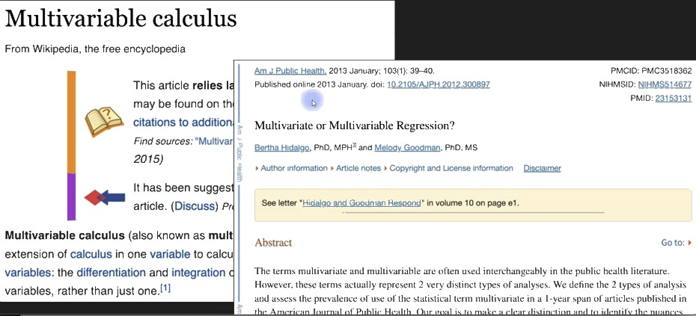

```{r}
knitr::opts_chunk$set(echo = TRUE)
library(reticulate)
use_python("/opt/anaconda3/bin/python")
```

# Multivariable Differentiation

En esta sección, exploraremos la diferenciación de funciones de varias variables. Aprenderemos a calcular derivadas parciales, gradientes y a aplicar la regla de la cadena en contextos multivariables. Al finalizar esta sección, serás capaz de:

## Multivariable Differentiation: Resumen de la sección Y objetivos {.title-line}

::: {style="display: flex; flex-direction: column; justify-content: center; flex: 1; min-height: 0; padding: 0 2em; gap: 0.9em; font-size: 1.5em;"}

[En esta presentación, aprenderás]{style="color: goldenrod;"}

- [Cómo pensar, crear y visualizar funciones 2D.]{style="color: #c0392b;"}

- [Cómo diferenciar funciones 2D (pista: es fácil pero requiere tiempo).]{style="color: navy;"}

- [Algunas aplicaciones de la optimización multivariable (descenso de gradiente y campos de gradiente).]{style="color: teal;"}

- [¡Que el cálculo multivariable es hermoso de ver!]{style="color: #c0392b;"}

:::

## Temas importantes de esta sección {.title-line}

::: {style="display: flex; flex-direction: column; justify-content: center; flex: 1; min-height: 0; padding: 1em 2.5em; gap: 1.3em; font-size: 1.3em; line-height: 1.6;"}

::: {.fragment .fade-in data-fragment-index=1 style="color: goldenrod;"}
El cálculo multivariable es (mayormente) igual al cálculo de una variable, pero con más variables.
:::

::: {.fragment .fade-in data-fragment-index=2 style="color: steelblue;"}
En la mayoría de los casos, cada variable se trata de forma independiente.
:::

::: {.fragment .fade-in data-fragment-index=3 style="color: goldenrod;"}
Por lo tanto, el cálculo multivariable es lo mismo que el cálculo de una variable, pero con más variables.
:::

:::

## ¿Que hay en ese nombre? {.title-line}

::: {style="display: flex; flex-direction: column; justify-content: center; align-items: center; flex: 1; min-height: 0; padding: 1em 2em; text-align: center; font-size: 1.45em; line-height: 1.75;font-weight: bold;"}

[¿Cuál es la diferencia entre el cálculo ]{style="color: goldenrod;"}["multivariable,"]{style="color: #c0392b;"} ["multivariate,"]{style="color: steelblue;"} [y "multidimensional"?]{style="color: teal;"}
{width="80%"}
:::

## La respuesta {.title-line}

::: {style="display: flex; flex-direction: column; justify-content: center; flex: 1; min-height: 0; padding: 0.8em 2.5em; gap: 0.7em; font-size: 1.15em; line-height: 1.6;"}

::: {style="display: flex; gap: 0.6em; align-items: flex-start; color: #c0392b;"}
● **Multivariable** → $(f: \mathbb{R}^n \to \mathbb{R})$. Varias variables de entrada, una salida escalar. Herramientas: derivadas parciales y gradiente.
:::

::: {style="display: flex; gap: 0.6em; align-items: flex-start; color: steelblue;"}
● **Multivariate** → Sinónimo de *multivariable*. Término preferido en estadística (*análisis multivariante*). No hay diferencia técnica real.
:::

::: {style="display: flex; gap: 0.6em; align-items: flex-start; color: teal;"}
● **Multidimensional** → Énfasis geométrico en la dimensión del espacio. Incluye campos escalares $(f: \mathbb{R}^n \to \mathbb{R}) \text{y campos vectoriales} (\mathbf{F}: \mathbb{R}^n \to \mathbb{R}^m)$.
:::

::: {style="border-top: 2px solid goldenrod; margin-top: 0.5em; padding-top: 0.8em; color: goldenrod; text-align: center; font-size: 1.1em; font-weight: bold;"}
Conclusión: *Multivariable* y *multivariate* son equivalentes. *Multidimensional* es más general e incluye ambos tipos de funciones.
:::

:::

## Funciones 2D {.title-line}

::: {style="display: flex; flex-direction: column; justify-content: center; flex: 1; min-height: 0; padding: 0 2em; gap: 0.9em; font-size: 1.5em;"}

[En esta presentación, aprenderás]{style="color: goldenrod;"}

- [Qué son las funciones 2D.]{style="color: #c0392b;"}

- [Cómo visualizar funciones 2D.]{style="color: navy;"}

- [Cómo pensar en las derivadas de funciones 2D.]{style="color: teal;"}

:::

## Recordatorio: funciones de una variable {.title-line}

::: {style="display: flex; flex-direction: column; justify-content: center; align-items: center; flex: 1; min-height: 0; padding: 0.8em 2em;"}

::: {style="border: 2px solid #aaa; border-radius: 10px; padding: 1.4em 2.2em; width: 78%; display: flex; flex-direction: column; gap: 1em;"}

::: {style="font-size: 1.2em; font-weight: bold; text-align: center; border-bottom: 1px solid #aaa; padding-bottom: 0.45em;"}
¿Qué es una función?
:::

::: {style="font-size: 1.05em; line-height: 1.6;"}
[**Función:**]{style="color: navy;"} [Una expresión o regla (o conjunto de expresiones) que mapea una variable (o conjunto de variables) a otra variable.]{style="color: navy;"}
:::

::: {style="display: flex; flex-direction: row; justify-content: center; align-items: center; gap: 0.6em; font-size: 1.7em; margin-top: 0.2em;"}

::: {style="border: 2px dashed goldenrod; border-radius: 6px; padding: 0.1em 0.6em;"}
${\color{goldenrod} y}$
:::

$=$

::: {style="border: 2px dashed #c0392b; border-radius: 6px; padding: 0.1em 0.6em;"}
${\color{#c0392b} f}({\color{teal} x})$
:::

:::

::: {style="display: flex; flex-direction: row; justify-content: center; gap: 4em; font-size: 0.92em;"}

::: {style="display: flex; flex-direction: column; align-items: center; gap: 0.15em; color: goldenrod;"}
↓

Salida (variable dependiente)
:::

::: {style="display: flex; flex-direction: column; align-items: center; gap: 0.15em; color: #c0392b;"}
↓

Función
:::

::: {style="display: flex; flex-direction: column; align-items: center; gap: 0.15em; color: teal;"}
↓

Entrada (variable independiente)
:::

:::

:::

:::

## ¿Qué es una función 2D {.title-line}

::: {style="display: flex; flex-direction: column; justify-content: center; align-items: center; flex: 1; min-height: 0; padding: 0.5em 2em;"}

::: {.r-stack style="width: 100%;"}

::: {style="font-size: 2.5em; display: flex; flex-direction: row; align-items: center; justify-content: center; gap: 0.2em; padding: 1.2em 0;"}

${\color{goldenrod} Z}$

$=$

${\color{#c0392b} f}({\color{teal} x, y})$

:::

::: {.fragment .fade-in data-fragment-index=1 style="background: white; width: 100%; height: 100%; display: flex; flex-direction: column; align-items: center; gap: 0.5em; padding: 1em 0 0.8em 0;"}

::: {style="font-size: 2.5em; display: flex; flex-direction: row; align-items: center; justify-content: center; gap: 0.2em;"}

${\color{goldenrod} Z}$

$=$

::: {style="border: 2px dashed #c0392b; border-radius: 8px; padding: 0.08em 0.2em;"}
${\color{#c0392b} f}$
:::

$({\color{teal} x, y})$

:::

::: {style="display: flex; flex-direction: row; width: 100%; justify-content: center; font-size: 0.95em; padding: 0 12em 0 6em;"}

::: {style="display: flex; flex-direction: column; align-items: center; gap: 0.15em; color: #c0392b;"}
↓

Función
:::

:::

:::

::: {.fragment .fade-in data-fragment-index=2 style="background: white; width: 100%; height: 100%; display: flex; flex-direction: column; align-items: center; gap: 0.5em; padding: 1em 0 0.8em 0;"}

::: {style="font-size: 2.5em; display: flex; flex-direction: row; align-items: center; justify-content: center; gap: 0.2em;"}

${\color{goldenrod} Z}$

$=$

::: {style="border: 2px dashed #c0392b; border-radius: 8px; padding: 0.08em 0.2em;"}
${\color{#c0392b} f}$
:::

::: {style="border: 2px dashed teal; border-radius: 8px; padding: 0.08em 0.2em;"}
$({\color{teal} x, y})$
:::

:::

::: {style="display: flex; flex-direction: row; width: 100%; justify-content: center; font-size: 0.95em; gap: 3em; padding: 0 6em 0 5em;"}

::: {style="display: flex; flex-direction: column; align-items: center; gap: 0.15em; color: #c0392b;"}
↓

Función
:::

::: {style="display: flex; flex-direction: column; align-items: center; gap: 0.15em; color: teal;"}
↓

Entradas (variables independientes)
:::

:::

:::

::: {.fragment .fade-in data-fragment-index=3 style="background: white; width: 100%; height: 100%; display: flex; flex-direction: column; align-items: center; gap: 0.5em; padding: 1em 0 0.8em 0;"}

::: {style="font-size: 2.5em; display: flex; flex-direction: row; align-items: center; justify-content: center; gap: 0.2em;"}

::: {style="border: 2px dashed goldenrod; border-radius: 8px; padding: 0.08em 0.2em;"}
${\color{goldenrod} Z}$
:::

$=$

::: {style="border: 2px dashed #c0392b; border-radius: 8px; padding: 0.08em 0.2em;"}
${\color{#c0392b} f}$
:::

::: {style="border: 2px dashed teal; border-radius: 8px; padding: 0.08em 0.2em;"}
$({\color{teal} x, y})$
:::

:::

::: {style="display: flex; flex-direction: row; justify-content: center; font-size: 0.95em; gap: 2.5em;"}

::: {style="display: flex; flex-direction: column; align-items: center; gap: 0.15em; color: goldenrod;"}
↓

Salida (variable dependiente)
:::

::: {style="display: flex; flex-direction: column; align-items: center; gap: 0.15em; color: #c0392b;"}
↓

Función
:::

::: {style="display: flex; flex-direction: column; align-items: center; gap: 0.15em; color: teal;"}
↓

Entradas (variables independientes)
:::

:::

:::

:::

:::

## ¿Cómo se vizualiza una función 1D? {.title-line}

```{python}
#| echo: false
import matplotlib.pyplot as plt
import numpy as np

GOLD = '#B8860B'

def _setup_1d_ax(ax):
    ax.spines['top'].set_visible(False)
    ax.spines['right'].set_visible(False)
    ax.spines['left'].set_linewidth(1.4)
    ax.spines['bottom'].set_linewidth(1.4)
    ax.set_xlim(-0.3, 8.3)
    ax.set_ylim(-0.3, 5.8)
    ax.set_xlabel('Function input', fontsize=11, labelpad=6)
    ax.set_ylabel('Function output', fontsize=11, labelpad=6)
    ax.set_xticks([])
    ax.set_yticks([])

def _f1d(x):
    return 0.14 * (x - 4.0)**2 + 0.5
```

::: {style="display: flex; flex-direction: column; justify-content: center; align-items: center; flex: 1; min-height: 0; padding: 0.5em 2em;"}

::: {.r-stack style="width: 100%;"}

::: {style="width: 62%;"}
```{python}
#| echo: false
fig, ax = plt.subplots(figsize=(7.2, 5.8))
_setup_1d_ax(ax)
plt.tight_layout(pad=0.5)
plt.show()
```
:::

::: {.fragment .fade-in data-fragment-index=1 style="width: 62%;"}
```{python}
#| echo: false
fig, ax = plt.subplots(figsize=(7.2, 5.8))
_setup_1d_ax(ax)
x = np.linspace(0.4, 7.6, 300)
ax.plot(x, _f1d(x), color=GOLD, linewidth=2.5)
plt.tight_layout(pad=0.5)
plt.show()
```
:::

::: {.fragment .fade-in data-fragment-index=2 style="width: 62%;"}
```{python}
#| echo: false
fig, ax = plt.subplots(figsize=(7.2, 5.8))
_setup_1d_ax(ax)
x_pts = np.array([0.6, 1.1, 1.8, 2.6, 3.3, 4.0, 4.7, 5.4, 6.1, 6.8, 7.4])
ax.scatter(x_pts, _f1d(x_pts), color=GOLD, s=90, zorder=5)
plt.tight_layout(pad=0.5)
plt.show()
```
:::

::: {.fragment .fade-in data-fragment-index=3 style="width: 62%;"}
```{python}
#| echo: false
fig, ax = plt.subplots(figsize=(7.2, 5.8))
_setup_1d_ax(ax)
x_pts = np.array([0.6, 1.1, 1.8, 2.6, 3.3, 4.0, 4.7, 5.4, 6.1, 6.8, 7.4])
y_pts = _f1d(x_pts)
ax.scatter(x_pts, y_pts, color=GOLD, s=90, zorder=5)
for xi, yi in zip(x_pts, y_pts):
    ax.plot([xi, xi], [0, yi], '--', color=GOLD, alpha=0.45, linewidth=1.1)
ax.set_xticks(x_pts)
ax.set_xticklabels([])
ax.tick_params(axis='x', direction='inout', length=8, width=2, colors='#333333')
plt.tight_layout(pad=0.5)
plt.show()
```
:::

:::

:::

## ¿Cómo se vizualiza una función 2D? {.title-line}

```{python}
#| echo: false
#| results: 'hide'
import matplotlib.pyplot as plt
import numpy as np
from mpl_toolkits.mplot3d import Axes3D

PI_TICKS  = [0, np.pi/2, np.pi, 3*np.pi/2, 2*np.pi]
PI_LABELS = ['0', 'π/2', 'π', '3π/2', '2π']

def _3d_empty(ax):
    ax.set_xlabel('Function input $X$', fontsize=15, labelpad=5)
    ax.set_ylabel('Function input $Y$', fontsize=15, labelpad=5)
    ax.set_zlabel('Function output', fontsize=15, labelpad=5)
    ax.set_xticks([]); ax.set_yticks([]); ax.set_zticks([])
    ax.grid(False)
    for pane in [ax.xaxis.pane, ax.yaxis.pane, ax.zaxis.pane]:
        pane.fill = False
        pane.set_edgecolor('none')
    ax.view_init(elev=25, azim=-60)
```

::: {style="display: flex; flex-direction: column; justify-content: center; align-items: center; flex: 1; min-height: 0; padding: 0.2em 2em;"}

::: {.r-stack style="width: 100%;"}

::: {style="width: 58%; display: flex; justify-content: center;"}
```{python}
#| echo: false
#| results: 'hide'
fig, ax = plt.subplots(figsize=(8.0, 6.8))
for s in ['top', 'right']:
    ax.spines[s].set_visible(False)
ax.spines['left'].set_linewidth(1.3)
ax.spines['bottom'].set_linewidth(1.3)
ax.set_xlabel('Function input $X$', fontsize=10)
ax.set_ylabel('Function output', fontsize=10)
ax.set_xticks([]); ax.set_yticks([])
fig.patch.set_facecolor('white')
plt.tight_layout(pad=0.5)
plt.show()
```
:::

::: {.fragment .fade-in data-fragment-index=1 style="background: white; width: 58%; display: flex; justify-content: center;"}
```{python}
#| echo: false
#| results: 'hide'
fig = plt.figure(figsize=(8.0, 6.8))
ax = fig.add_subplot(111, projection='3d')
_3d_empty(ax)
ax.set_xlim(0, 6); ax.set_ylim(0, 6); ax.set_zlim(0, 6)
fig.patch.set_facecolor('white')
plt.tight_layout(pad=0.5)
plt.show()
```
:::

::: {.fragment .fade-in data-fragment-index=2 style="background: white; width: 58%; display: flex; justify-content: center;"}
```{python}
#| echo: false
#| results: 'hide'
fig = plt.figure(figsize=(8.0, 6.8))
ax = fig.add_subplot(111, projection='3d')
_3d_empty(ax)
ax.set_xlim(0, 6); ax.set_ylim(0, 6); ax.set_zlim(0, 6)
xg = np.linspace(0.5, 5.5, 7)
yg = np.linspace(0.5, 5.5, 5)
Xg, Yg = np.meshgrid(xg, yg)
ax.scatter(Xg.ravel(), Yg.ravel(), np.zeros_like(Xg.ravel()),
           color='black', s=18, depthshade=False)
fig.patch.set_facecolor('white')
plt.tight_layout(pad=0.5)
plt.show()
```
:::

::: {.fragment .fade-in data-fragment-index=3 style="background: white; width: 70%; display: flex; justify-content: center;"}
```{python}
#| echo: false
#| results: 'hide'
x = np.linspace(0, 2*np.pi, 50)
y = np.linspace(0, 2*np.pi, 50)
X, Y = np.meshgrid(x, y)
Z = np.sin(X) + np.cos(Y)
fig = plt.figure(figsize=(10.0, 8.8))
ax = fig.add_subplot(111, projection='3d')
ax.plot_surface(X, Y, Z, cmap='coolwarm', alpha=0.92, linewidth=0, antialiased=True)
ax.set_xlabel('X', fontsize=10, labelpad=3)
ax.set_ylabel('Y', fontsize=10, labelpad=3)
ax.set_zlabel('Function output', fontsize=14, labelpad=3)
ax.set_xticks(PI_TICKS); ax.set_xticklabels(PI_LABELS, fontsize=10)
ax.set_yticks(PI_TICKS); ax.set_yticklabels(PI_LABELS, fontsize=10)
ax.set_title(r'$f(x, y) = \sin(X) + \cos(Y)$', fontsize=18, pad=8)
ax.view_init(elev=25, azim=-50)
ax.grid(False)
fig.patch.set_facecolor('white')
plt.tight_layout(pad=0.3)
plt.show()
```
:::

::: {.fragment .fade-in data-fragment-index=4 style="background: white; width: 70%; display: flex; justify-content: center;"}
```{python}
#| echo: false
#| results: 'hide'
x = np.linspace(0, 2*np.pi, 100)
y = np.linspace(0, 2*np.pi, 100)
X, Y = np.meshgrid(x, y)
Z = np.sin(X) + np.cos(Y)
fig, ax = plt.subplots(figsize=(10.0, 8.8))
im = ax.pcolormesh(X, Y, Z, cmap='coolwarm', shading='auto')
plt.colorbar(im, ax=ax, shrink=0.88, pad=0.02)
ax.set_xlabel('X', fontsize=14)
ax.set_ylabel('Y', fontsize=14)
ax.set_xticks(PI_TICKS); ax.set_xticklabels(PI_LABELS, fontsize=10)
ax.set_yticks(PI_TICKS); ax.set_yticklabels(PI_LABELS, fontsize=10)
ax.set_title(r'$f(x, y) = \sin(X) + \cos(Y)$', fontsize=18, pad=8)
fig.patch.set_facecolor('white')
plt.tight_layout(pad=0.3)
plt.show()
```
:::

:::

:::

## ¿Qué es un función 2 D? {.title-line}

::: {style="display: flex; flex-direction: column; justify-content: center; align-items: center; flex: 1; min-height: 0; padding: 0.5em 2em; gap: 2em; font-size: 1.6em;"}

$${\color{goldenrod} U} = {\color{#c0392b} f}({\color{teal} x, y, z})$$

::: {.fragment .fade-in data-fragment-index=1}
$${\color{goldenrod} Y} = {\color{#c0392b} f}({\color{teal} x_1, x_2, \ldots, x_n})$$
:::

:::

## Derivadas de funciones 2D {.title-line}

```{python}
#| echo: false
import matplotlib.pyplot as plt
import numpy as np

_PI_T = [0, np.pi/2, np.pi, 3*np.pi/2, 2*np.pi]
_PI_L = ['0', 'π/2', 'π', '3π/2', '2π']

def _hmap(ax):
    x = np.linspace(0, 2*np.pi, 100)
    y = np.linspace(0, 2*np.pi, 100)
    X, Y = np.meshgrid(x, y)
    Z = np.sin(X) + np.cos(Y)
    im = ax.pcolormesh(X, Y, Z, cmap='coolwarm', shading='auto')
    ax.invert_yaxis()
    ax.set_xticks(_PI_T); ax.set_xticklabels(_PI_L, fontsize=12)
    ax.set_yticks(_PI_T); ax.set_yticklabels(_PI_L, fontsize=12)
    ax.set_xlabel('X', fontsize=14)
    ax.set_ylabel('Y', fontsize=14)
    ax.set_title(r'$f(x, y) = \sin(X) + \cos(Y)$', fontsize=18, pad=5)
    plt.colorbar(im, ax=ax, shrink=0.88, pad=0.02)
```

::: {style="display: flex; flex-direction: row; flex: 1; min-height: 0; padding: 0.5em 1em; gap: 0.5em; align-items: center;"}

::: {style="flex: 0 0 24%; display: flex; flex-direction: column; justify-content: center; align-items: flex-start; gap: 1.8em; font-size: 1.35em; padding-left: 1em;"}

::: {.fragment .fade-in data-fragment-index=1}
$$\frac{\partial {\color{goldenrod} f}}{\partial {\color{teal} x}}$$
:::

::: {.fragment .fade-in data-fragment-index=2}
$$\frac{\partial {\color{goldenrod} f}}{\partial {\color{#c0392b} y}}$$
:::

:::

::: {style="flex: 1; min-height: 0; display: flex; flex-direction: column;"}

::: {.r-stack style="flex: 1; min-height: 0; width: 100%;"}

::: {}
```{python}
#| echo: false
#| results: 'hide'
fig, ax = plt.subplots(figsize=(8.0, 6.8))
_hmap(ax)
fig.patch.set_facecolor('white')
plt.tight_layout(pad=0.3)
plt.show()
```
:::

::: {.fragment .fade-in data-fragment-index=2 style="background: white; width: 100%; height: 100%;"}
```{python}
#| echo: false
#| results: 'hide'
fig, ax = plt.subplots(figsize=(8.0, 6.8))
_hmap(ax)
ax.annotate('', xy=(3*np.pi/2, np.pi), xytext=(np.pi, np.pi),
            arrowprops=dict(arrowstyle='->', color='steelblue',
                            lw=3, mutation_scale=22))
fig.patch.set_facecolor('white')
plt.tight_layout(pad=0.3)
plt.show()
```
:::

::: {.fragment .fade-in data-fragment-index=3 style="background: white; width: 100%; height: 100%;"}
```{python}
#| echo: false
#| results: 'hide'
fig, ax = plt.subplots(figsize=(8.0, 6.8))
_hmap(ax)
ax.annotate('', xy=(3*np.pi/2, np.pi), xytext=(np.pi, np.pi),
            arrowprops=dict(arrowstyle='->', color='steelblue',
                            lw=3, mutation_scale=22))
ax.annotate('', xy=(np.pi/2, np.pi), xytext=(np.pi/2, 3*np.pi/2),
            arrowprops=dict(arrowstyle='->', color='#c0392b',
                            lw=3, mutation_scale=22))
fig.patch.set_facecolor('white')
plt.tight_layout(pad=0.3)
plt.show()
```
:::

:::

:::

:::

## Derivadas Parciales {.title-line}

::: {style="display: flex; flex-direction: column; justify-content: center; flex: 1; min-height: 0; padding: 0 2em; gap: 0.9em; font-size: 1.5em;"}

[En esta presentación, aprenderás]{style="color: goldenrod;"}

- [Qué significa una "derivada parcial".]{style="color: #c0392b;"}

- [Varias notaciones.]{style="color: navy;"}

- [Cómo calcular derivadas parciales.]{style="color: teal;"}

- [La definición formal de derivadas parciales basada en límites.]{style="color: #c0392b;"}

:::

## Derivadas parciales: ¿Qué?, porqué y cómo {.title-line}

::: {style="display: flex; flex-direction: column; justify-content: center; flex: 1; min-height: 0; padding: 1em 3em; gap: 2em; font-size: 1.0em;"}

::: {style="display: flex; flex-direction: row; align-items: flex-start; gap: 1.5em;"}

::: {style="flex: 0 0 10em; font-size: 1.3em; font-weight: bold; color: goldenrod; padding-top: 0.1em;"}
¿Qué?
:::

::: {.fragment .fade-in data-fragment-index=1 style="flex: 1; color: goldenrod; line-height: 1.5;"}
Las funciones multivariables cambian a lo largo de cada variable. Las derivadas parciales revelan esos cambios.
:::

:::

::: {style="display: flex; flex-direction: row; align-items: flex-start; gap: 1.5em;"}

::: {style="flex: 0 0 10em; font-size: 1.3em; font-weight: bold; color: #c0392b; padding-top: 0.1em;"}
¿Por qué?
:::

::: {.fragment .fade-in data-fragment-index=2 style="flex: 1; color: #c0392b; line-height: 1.5;"}
Necesitamos descomponer los cambios de la función para entender sus comportamientos.
:::

:::

::: {style="display: flex; flex-direction: row; align-items: flex-start; gap: 1.5em;"}

::: {style="flex: 0 0 10em; font-size: 1.3em; font-weight: bold; color: navy; padding-top: 0.1em;"}
¿Cómo?
:::

::: {.fragment .fade-in data-fragment-index=3 style="flex: 1; color: navy; line-height: 1.5;"}
Diferencia una variable a la vez, tratando las otras variables como constantes.
:::

:::

:::

## Notaciones {.title-line}

::: {style="display: flex; flex-direction: row; flex: 1; min-height: 0; padding: 0.8em 2.5em; gap: 2em; align-items: center;"}

::: {style="flex: 0 0 48%;"}

::: {.r-stack style="width: 100%;"}

::: {style="width: 100%; font-size: 1.65em;"}

$$\frac{{\color{navy}\partial}{\color{goldenrod}f}}{{\color{teal}\partial x}} = {\color{goldenrod}f}_{\color{teal}x}$$

$$\frac{{\color{navy}\partial}{\color{goldenrod}f}}{{\color{#c0392b}\partial y}} = {\color{goldenrod}f}_{\color{#c0392b}y}$$

:::

::: {.fragment .fade-in data-fragment-index=1 style="background: white; width: 100%; font-size: 1.65em;"}

::: {style="display: flex; flex-direction: row; align-items: flex-start; gap: 0.4em;"}

::: {style="color: navy; font-size: 0.37em; text-align: right; line-height: 1.9; flex-shrink: 0; padding-top: 1.1em;"}
"Partial"

"del"
:::

::: {}
$\displaystyle\frac{\bbox[border: 2px dashed navy]{{\color{navy}\partial}}{\color{goldenrod}f}}{{\color{teal}\partial x}} = {\color{goldenrod}f}_{\color{teal}x}$
:::

:::

$\displaystyle\frac{{\color{navy}\partial}{\color{goldenrod}f}}{{\color{#c0392b}\partial y}} = {\color{goldenrod}f}_{\color{#c0392b}y}$

:::

:::

:::

::: {.fragment .fade-in data-fragment-index=2 style="flex: 1; display: flex; flex-direction: column; gap: 1em; font-size: 1.05em;"}

::: {style="color: teal; font-weight: bold; font-size: 1.15em;"}
Cómo se lee en voz alta:
:::

::: {style="display: flex; flex-direction: column; gap: 0.8em; color: #222;"}

● "La derivada parcial de *$f$* con respecto a *$x$*."

● "Parcial *$f$*, parcial *$x$*."

● "Parcial *$x$*."

:::

:::

:::

## Derivadas de funciones 2D {.title-line}

```{python}
#| echo: false
import matplotlib.pyplot as plt
import numpy as np

_PI_T = [0, np.pi/2, np.pi, 3*np.pi/2, 2*np.pi]
_PI_L = ['0', 'π/2', 'π', '3π/2', '2π']

def _hmap(ax):
    x = np.linspace(0, 2*np.pi, 100)
    y = np.linspace(0, 2*np.pi, 100)
    X, Y = np.meshgrid(x, y)
    Z = np.sin(X) + np.cos(Y)
    im = ax.pcolormesh(X, Y, Z, cmap='coolwarm', shading='auto')
    ax.invert_yaxis()
    ax.set_xticks(_PI_T); ax.set_xticklabels(_PI_L, fontsize=12)
    ax.set_yticks(_PI_T); ax.set_yticklabels(_PI_L, fontsize=12)
    ax.set_xlabel('X', fontsize=14)
    ax.set_ylabel('Y', fontsize=14)
    ax.set_title(r'$f(x, y) = \sin(X) + \cos(Y)$', fontsize=18, pad=5)
    plt.colorbar(im, ax=ax, shrink=0.88, pad=0.02)
```

::: {style="display: flex; flex-direction: row; flex: 1; min-height: 0; padding: 0.5em 1em; gap: 0.5em; align-items: center;"}

::: {style="flex: 0 0 24%; display: flex; flex-direction: column; justify-content: center; align-items: flex-start; gap: 1.8em; font-size: 1.35em; padding-left: 1em;"}

::: {.fragment .fade-in data-fragment-index=1}
$$\frac{\partial {\color{goldenrod} f}}{\partial {\color{teal} x}}$$
:::

::: {.fragment .fade-in data-fragment-index=2}
$$\frac{\partial {\color{goldenrod} f}}{\partial {\color{#c0392b} y}}$$
:::

:::

::: {style="flex: 1; min-height: 0; display: flex; flex-direction: column;"}

::: {.r-stack style="flex: 1; min-height: 0; width: 100%;"}

::: {}
```{python}
#| echo: false
#| results: 'hide'
fig, ax = plt.subplots(figsize=(8.0, 6.8))
_hmap(ax)
fig.patch.set_facecolor('white')
plt.tight_layout(pad=0.3)
plt.show()
```
:::

::: {.fragment .fade-in data-fragment-index=2 style="background: white; width: 100%; height: 100%;"}
```{python}
#| echo: false
#| results: 'hide'
fig, ax = plt.subplots(figsize=(8.0, 6.8))
_hmap(ax)
ax.annotate('', xy=(3*np.pi/2, np.pi), xytext=(np.pi, np.pi),
            arrowprops=dict(arrowstyle='->', color='steelblue',
                            lw=3, mutation_scale=22))
fig.patch.set_facecolor('white')
plt.tight_layout(pad=0.3)
plt.show()
```
:::

::: {.fragment .fade-in data-fragment-index=3 style="background: white; width: 100%; height: 100%;"}
```{python}
#| echo: false
#| results: 'hide'
fig, ax = plt.subplots(figsize=(8.0, 6.8))
_hmap(ax)
ax.annotate('', xy=(3*np.pi/2, np.pi), xytext=(np.pi, np.pi),
            arrowprops=dict(arrowstyle='->', color='steelblue',
                            lw=3, mutation_scale=22))
ax.annotate('', xy=(np.pi/2, np.pi), xytext=(np.pi/2, 3*np.pi/2),
            arrowprops=dict(arrowstyle='->', color='#c0392b',
                            lw=3, mutation_scale=22))
fig.patch.set_facecolor('white')
plt.tight_layout(pad=0.3)
plt.show()
```
:::

:::

:::

:::

## Ejemplo {.title-line}

```{python}
#| echo: false
import matplotlib.pyplot as plt
import numpy as np

_x = np.linspace(-10, 10, 200)
_y = np.linspace(-10, 10, 200)
_X, _Y = np.meshgrid(_x, _y)
_Z  = 2*_X**3 + 5*_Y**3 + np.cos(_X)*np.sin(_Y)
_Zx = 6*_X**2 - np.sin(_X)*np.sin(_Y)
_Zy = 15*_Y**2 + np.cos(_X)*np.cos(_Y)
_CM = 'RdYlBu'
```

::: {style="display: flex; flex-direction: column; flex: 1; min-height: 0;"}

::: {.r-stack style="flex: 1; min-height: 0; width: 100%;"}

::: {style="width: 100%; display: flex; flex-direction: column; justify-content: center; align-items: center; padding: 0.5em 2em; gap: 0; font-size: 1.3em;"}

::: {style="margin: -0.35em 0;"}
$${\color{goldenrod}f}({\color{teal}x}, {\color{#c0392b}y}) = 2{\color{teal}x}^3 + 5{\color{#c0392b}y}^3 + \cos({\color{teal}x})\sin({\color{#c0392b}y})$$
:::

::: {.fragment .fade-in data-fragment-index=1 style="margin: -0.35em 0;"}
$${\color{goldenrod}f}_{\color{teal}x} = 6{\color{teal}x}^2 + \quad 0 \quad - \sin({\color{teal}x})\sin({\color{#c0392b}y})$$
:::

::: {.fragment .fade-in data-fragment-index=2 style="margin: -0.35em 0;"}
$${\color{goldenrod}f}_{\color{#c0392b}y} = 0 \; + 15{\color{#c0392b}y}^2 + \cos({\color{teal}x})\cos({\color{#c0392b}y})$$
:::

:::

::: {.fragment .fade-in data-fragment-index=3 style="background: white; width: 100%; height: 100%; display: flex; flex-direction: column; align-items: center; justify-content: flex-start; padding: 0.3em 1em; gap: 0.3em;"}

::: {style="font-size: 0.85em;"}
${\color{goldenrod}f}({\color{teal}x},{\color{#c0392b}y}) = 2{\color{teal}x}^3 + 5{\color{#c0392b}y}^3 + \cos({\color{teal}x})\sin({\color{#c0392b}y})$
:::

```{python}
#| echo: false
#| results: 'hide'
fig, ax = plt.subplots(figsize=(8.5, 6.5))
im = ax.pcolormesh(_X, _Y, _Z, cmap=_CM, shading='auto')
plt.colorbar(im, ax=ax)
ax.set_xticks([-10, 0, 10])
ax.set_yticks([-10, 0, 10])
plt.tight_layout(pad=0.4)
plt.show()
```

:::

::: {.fragment .fade-in data-fragment-index=4 style="background: white; width: 100%; height: 100%; display: flex; flex-direction: column; align-items: center; justify-content: flex-start; padding: 0.3em 1em; gap: 0.3em;"}

::: {style="font-size: 0.85em;"}
${\color{goldenrod}f}({\color{teal}x},{\color{#c0392b}y}) = 2{\color{teal}x}^3 + 5{\color{#c0392b}y}^3 + \cos({\color{teal}x})\sin({\color{#c0392b}y})$
:::

```{python}
#| echo: false
#| results: 'hide'
fig, axd = plt.subplot_mosaic(
    [['top', 'top'], ['bl', 'br']],
    figsize=(10.5, 8.5),
    gridspec_kw={'height_ratios': [1.7, 1], 'hspace': 0.65, 'wspace': 0.3}
)
ax_top = axd['top']
ax_bl  = axd['bl']
ax_br  = axd['br']

im0 = ax_top.pcolormesh(_X, _Y, _Z, cmap=_CM, shading='auto')
fig.colorbar(im0, ax=ax_top)
ax_top.set_xticks([-10, 0, 10])
ax_top.set_yticks([-10, 0, 10])
ax_top.tick_params(labelsize=8)

ax_bl.set_title(r'$f_x = 6x^2 - \sin(x)\sin(y)$', fontsize=9, color='steelblue')
ax_bl.pcolormesh(_X, _Y, _Zx, cmap=_CM, shading='auto')
ax_bl.set_xticks([-10, 0, 10])
ax_bl.set_yticks([-10, 0, 10])
ax_bl.tick_params(labelsize=7)

ax_br.set_title(r'$f_y = 15y^2 + \cos(x)\cos(y)$', fontsize=9, color='goldenrod')
ax_br.pcolormesh(_X, _Y, _Zy, cmap=_CM, shading='auto')
ax_br.set_xticks([-10, 0, 10])
ax_br.set_yticks([-10, 0, 10])
ax_br.tick_params(labelsize=7)

plt.show()
```

:::

:::

:::

## Definición formal {.title-line}

::: {style="display: flex; flex-direction: column; justify-content: center; flex: 1; min-height: 0; padding: 0.5em 2.5em; gap: 0; font-size: 1.15em;"}

::: {.fragment .fade-in data-fragment-index=1 style="margin: -0.3em 0;"}
$${\color{goldenrod}f}_{\color{teal}x} = \frac{{\color{navy}\partial} {\color{goldenrod}f}}{{\color{navy}\partial} {\color{teal}x}} = \lim_{{\color{navy}h} \to 0} \frac{{\color{goldenrod}f}({\color{teal}x} + {\color{navy}h},\, {\color{#c0392b}y}) - {\color{goldenrod}f}({\color{teal}x},\, {\color{#c0392b}y})}{{\color{navy}h}}$$
:::

::: {.fragment .fade-in data-fragment-index=2 style="margin: -0.3em 0;"}
$${\color{goldenrod}f}_{\color{#c0392b}y} = \frac{{\color{navy}\partial} {\color{goldenrod}f}}{{\color{navy}\partial} {\color{#c0392b}y}} = \lim_{{\color{navy}h} \to 0} \frac{{\color{goldenrod}f}({\color{teal}x},\, {\color{#c0392b}y} + {\color{navy}h}) - {\color{goldenrod}f}({\color{teal}x},\, {\color{#c0392b}y})}{{\color{navy}h}}$$
:::

:::