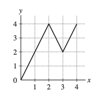
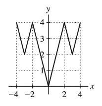

---
title: "Experimental Relaciones y funciones"
author: "Elvis Sánchez"
format:
  pdf:
    documentclass: article
    fontsize: 12pt
    break-on-sections: true
---    

### **1. Determine el dominio y el rango de la función**

$$f: \{r, s, t, u\} \to \{A, B, C, D, E\}$$

### **2.Ejercicios: Encuentra el dominio y el rango de la función.**

#### **a. $f(x)=-x$**

#### **b. $f(x)=|x|$**

### **3. Ejercicio, sea f(x) la función mostrada en la Figura 1.**

A continuación, se presenta un gráfico con los ejes x e y. La función $f(x)$ es una línea quebrada que comienza en el origen $(0,0)$, sube al punto $(2,4)$, baja al punto $(3,2)$ y sube de nuevo al punto $(4,4)$. La figura está etiquetada como **FIGURA 1**.

#### **a. Extienda el gráfico de $f(x)$ al $[-4,4]$ para que sea una función par.**



**SOLUCIÓN**

### **1. Determine el dominio y el rango de la función**

$$f: \{r, s, t, u\} \to \{A, B, C, D, E\}$$

**SOLUCIÓN**
El dominio es el conjunto $D=\{r, s, t, u\}$; el rango es el conjunto $R=\{A, B, E\}$.

### **2.Ejercicios: Encuentra el dominio y el rango de la función.**

#### **a. $f(x)=-x$**

**SOLUCIÓN**
$D$: todos los reales; $R$: todos los reales

#### **b. $f(x)=|x|$**

**SOLUCIÓN**
$D$: todos los reales; $R$: $\{y : y \ge 0\}$

### **3. Ejercicio, sea f(x) la función mostrada en la Figura 1.**

A continuación, se presenta un gráfico con los ejes x e y. La función $f(x)$ es una línea quebrada que comienza en el origen $(0,0)$, sube al punto $(2,4)$, baja al punto $(3,2)$ y sube de nuevo al punto $(4,4)$. La figura está etiquetada como **FIGURA 1**.

#### **a. Extienda el gráfico de $f(x)$ al $[-4,4]$ para que sea una función par.**

**SOLUCIÓN**
Para continuar el gráfico de $f(x)$ al intervalo $[-4,4]$ como una **función par**, refleje el gráfico de $f(x)$ a través del **eje y**.

