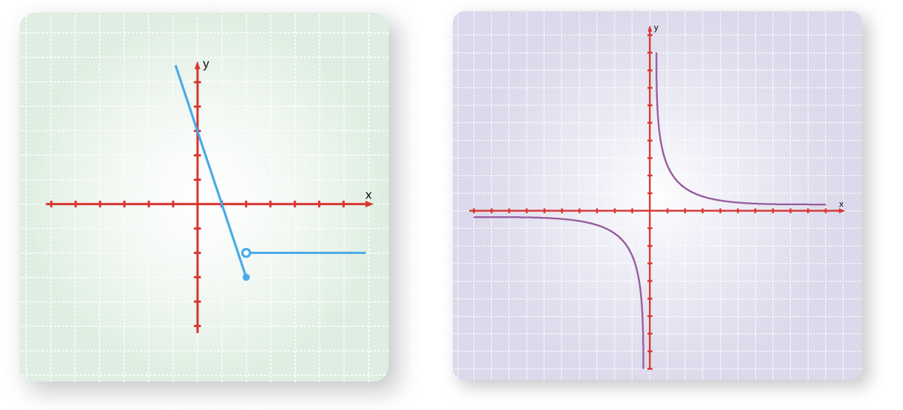
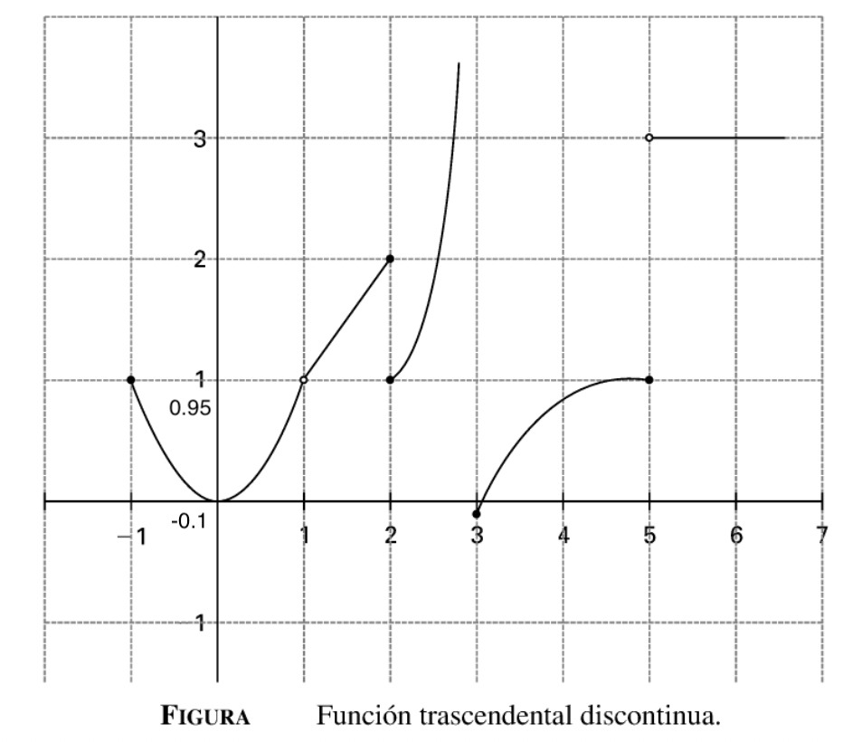

---
title: "Prueba Primer Parcial"
author: "Elvis Sánchez"
format:
  pdf:
    fontsize: 12pt
    break-on-sections: true
    documentclass: article
    include-in-header:
      text: |
        \usepackage[top=2cm, left=2.5cm, right=2.5cm, bottom=2.5cm]{geometry}
--- 

## Ejercicio 1: Límite 

$$
\lim_{x\to\infty} \frac{4^{x+1} + 5^{x+1}}{4^x + 5^x}
$$

**a) Qué surge al sustituir $\infty$** explique con sus palabras. 

**b) Resuelva el límite:** Muestre todos los pasos.

::: {.callout-note appearance="default" icon="false"}
**SOLUCIÓN**

a) La indeterminación es del tipo $\frac{\infty}{\infty}$​.

b) Resuelva el límite:

Dividiendo numerador y denominador por $5^x$ tenemos

$$
\lim_{x\to\infty} \frac{4^{x+1} + 5^{x+1}}{4^x + 5^x} = \lim_{x\to\infty} \frac{\frac{4^{x+1}}{5^x} + \frac{5^{x+1}}{5^x}}{\frac{4^x}{5^x} + \frac{5^x}{5^x}} = \lim_{x\to\infty} \frac{4\left(\frac{4}{5}\right)^x + 5}{\left(\frac{4}{5}\right)^x + 1}
$$

Como $0 \le 4/5 < 1$ se tiene que $\left(\frac{4}{5}\right)^x \to 0$ cuando $x \to \infty$. Por tanto

$$
\lim_{x\to\infty} \frac{4\left(\frac{4}{5}\right)^x + 5}{\left(\frac{4}{5}\right)^x + 1} = 5.
$$

:::

## Ejercicio 2: Discontinuidad y Función por Partes

$$
f(x)=
\begin{cases}
0 & \text{si } x=0 \\
1-x & \text{si } 0<x<1 \\
1 & \text{si } x=1
\end{cases}
$$

a) La función es constinua o discontinua?
b) Que puntos de su dominio entre $[0,1]$ no tienen imagen?
c) Es posible modificar la función y como evitar alguna discontinuidad si existe?

::: {.callout-note appearance="default" icon="false"}
**SOLUCIÓN**
a) La función es constinua o discontinua?
No, es continia presenta discontinuidad justo en el punto $0$ y $1$ s decir en sus extremos.

b) Todos los puntos de su dominio tienen imagen .

c) Modificacndo la función

La función base en el intervalo abierto $(0, 1)$ es $f(x) = 1-x$. Si queremos que sea continua, los puntos frontera deben "rellenar" los huecos que dejan los límites:

- 1	En $x=0$:

◦	Necesitamos $f(0) = \lim_{x\to 0^+} (1-x) = 1$.
◦	La función original tiene $f(0)=0$. Debemos cambiarlo a $f(0)=1$.

- 2	En $x=1$:
	
◦	Necesitamos $f(1) = \lim_{x\to 1^-} (1-x) = 0$.
◦	La función original tiene $f(1)=1$. Debemos cambiarlo a $f(1)=0$.

Nueva función continua $g(x)$:

La función continua redefinida sería $g(x)$:
$$g(x)= \begin{cases} 1 & \text{si } x=0 \\ 1-x & \text{si } 0<x<1 \\ 0 & \text{si } x=1 \end{cases}$$
Alternativamente, dado que la función $1-x$ es continua en todo $\mathbb{R}$, podemos reescribirla de manera más simple:
$$g(x) = 1-x \quad \text{para todo } x \in [0, 1]$$
Esta nueva función $g(x) = 1-x$ es continua en $[0, 1]$.

:::

## Ejercicio 3: A continuación se representan las siguintes graficas.

a) Identifica en cada una de las gráficas que expresión algebraica corresponde, así como su nombre, dominio, codominio y si es continua o discontinua,¿en que punto?

::: {.columns}
::: {.column width="50%"}

:::
::: {.column width="50%"}
::: center
{width="50%"}
:::

:::
::: 

::: {.callout-note appearance="default" icon="false"}
**SOLUCIÓN**

### Gráfica : Función por Partes con Salto (Inferior Izquierda)

| Concepto | Análisis |
| :--- | :--- |
| **Expresión Algebraica** | **Función definida a trozos** (La ecuación exacta no es necesaria, solo la forma). Para $x \le 1$ es una línea con pendiente negativa. Para $x > 1$ es una línea horizontal. |
| **Nombre** | **Función por Partes** |
| **Dominio** | $\mathbb{R}$ (Todos los números reales). |
| **Codominio (Rango/Imagen)** | $(-\infty, \text{aprox. } 1.5] \cup \{\text{aprox. } -2\}$ |
| **Continuidad** | **Discontinua** en el punto $\mathbf{x=1}$. Presenta una **discontinuidad de salto finito** ya que los límites laterales existen pero son diferentes (aprox. $\lim_{x \to 1^-} f(x) \approx 1.5$ y $\lim_{x \to 1^+} f(x) \approx -2$). |

### Gráfica 2: Hipérbola (Inferior Derecha)

| Concepto | Análisis |
| :--- | :--- |
| **Expresión Algebraica** | $f(x) = \frac{k}{x^n} + c$. Específicamente, parece ser la función recíproca desplazada. $\mathbf{f(x) = \frac{1}{x} + 0}$ o $\mathbf{f(x) = \frac{1}{x}}$ (con asíntotas en $x=0$ y $y=0$). |
| **Nombre** | **Función Racional** (o Función Recíproca) |
| **Dominio** | $\mathbb{R} - \{0\}$ (Todos los reales excepto $x=0$). |
| **Codominio (Rango/Imagen)** | $\mathbb{R} - \{0\}$ (Todos los reales excepto $y=0$). |
| **Continuidad** | **Discontinua** en el punto $\mathbf{x=0}$. Presenta una **discontinuidad infinita** (asíntota vertical), ya que el límite tiende a $\pm \infty$ en ese punto. |
:::

## Ejercicio 4: Dada la gráfica de la función trascendental de la figura, se pide verificar la existencia de los siguientes límites: si existen poner su valor, caso contrario poner no existe.

{width="50%"}

1) $\lim_{x \to -1^-} f(x)$, 2) $\lim_{x \to 1^+} f(x)$, 3) $\lim_{x \to 2^-} f(x)$, 4) $\lim_{x \to 2^+} f(x)$, 5) $\lim_{x \to 2} f(x)$, 6) $\lim_{x \to 3^-} f(x)$, 7) $\lim_{x \to 3^+} f(x)$, 8) $\lim_{x \to 3} f(x)$, 9) $\lim_{x \to 4^-} f(x)$, 10) $\lim_{x \to 4^+} f(x)$, 11) $\lim_{x \to 4} f(x)$, 12) $\lim_{x \to 5^-} f(x)$, 13) $\lim_{x \to 5^+} f(x)$, 14) $\lim_{x \to 5} f(x)$.

::: {.callout-note appearance="default" icon="false"}
**SOLUCIÓN**

La manera de determinar los límites que se piden es a través de dibujar las ordenadas correspondientes, por la izquierda y por la derecha de cada valor sugerido, viendo si la sucesión de ordenadas convergen hacia el propio valor.

1. $\lim_{x \to -1^-} f(x) = \text{No existe}$ \quad \quad \quad \quad \quad \quad \quad \quad \quad \quad \quad 8. $\lim_{x \to 3} f(x) = \text{No existe}$

2. $\lim_{x \to 1^+} f(x) = 1$ \quad \quad \quad \quad \quad \quad \quad \quad \quad 9. $\lim_{x \to 4^-} f(x) = 0.95$

3. $\lim_{x \to 2^-} f(x) = 2$ \quad \quad \quad \quad \quad \quad \quad \quad \quad \quad \quad 10. $\lim_{x \to 4^+} f(x) = 0.95$

4. $\lim_{x \to 2^+} f(x) = 1$ \quad \quad \quad \quad \quad \quad \quad \quad \quad \quad \quad 11. $\lim_{x \to 4} f(x) = 0.95$

5. $\lim_{x \to 2} f(x) = \text{No existe}$ \quad \quad \quad \quad \quad \quad \quad \quad \quad 12. $\lim_{x \to 5^-} f(x) = 1$

6. $\lim_{x \to 3^-} f(x) = \text{No existe}$ \quad \quad \quad \quad \quad \quad \quad \quad \quad 13. $\lim_{x \to 5^+} f(x) = 3$

7. $\lim_{x \to 3^+} f(x) = -0.1$ \quad \quad \quad \quad \quad \quad \quad \quad \quad 14. $\lim_{x \to 5} f(x) = \text{No existe}$

En el caso del $\lim_{x \to 3^-} f(x)$, la no existencia se afirma diciendo que el límite de la sucesión de las $y$ tiende a **infinito**. En los otros casos de no existencia, las gráficas presentan **saltos** que no dejan que ello ocurra.
:::