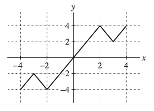

---
title: "Relaciones y funciones"
author: "Elvis Sánchez"
format:
  pdf:
    documentclass: article
    fontsize: 12pt
    break-on-sections: true
---   

### **1. Determine el dominio y el rango de la función**

$$f: \{r, s, t, u\} \to \{A, B, C, D, E\}$$

$$\text{definida por } f(r)=A, f(s)=B, f(t)=B, f(u)=E.$$

### **2. Dé un ejemplo de una función cuyo dominio $D$ tiene tres elementos y cuyo rango $R$ tiene dos elementos. ¿Existe una función cuyo dominio $D$ tiene dos elementos y cuyo rango $R$ tiene tres elementos?**

### **3. Ejercicios a–h: Encuentra el dominio y el rango de la función.**

#### **a. $f(x)=-x$**

#### **b. $g(t)=t^4$**

#### **c. $f(x)=x^3$**

#### **d. $g(t)=\sqrt{2-t}$**

#### **e. $f(x)=|x|$**

#### **f. $h(s)=\frac{1}{s}$**

#### **g. $f(x)=\frac{1}{x^2}$**

#### **h. $g(t)=\cos\frac{1}{t}$**

### **4. En los ejercicios a-d, sea f(x) la función mostrada en la Figura 01.**

A continuación, se presenta un gráfico con los ejes x e y. La función $f(x)$ es una línea quebrada que comienza en el origen $(0,0)$, sube al punto $(2,4)$, baja al punto $(3,2)$ y sube de nuevo al punto $(4,4)$. La figura está etiquetada como **FIGURA 1**.

### **a. Extienda el gráfico de $f(x)$ al $[-4,4]$ para que sea una función par.**

### **b. Extienda el gráfico de $f(x)$ al $[-4,4]$ para que sea una función impar.**



## SOLUCIONES

### **1. Determine el dominio y el rango de la función**

$$f: \{r, s, t, u\} \to \{A, B, C, D, E\}$$

$$\text{definida por } f(r)=A, f(s)=B, f(t)=B, f(u)=E.$$

**SOLUCIÓN**
El dominio es el conjunto $D=\{r, s, t, u\}$; el rango es el conjunto $R=\{A, B, E\}$.

### **2. Dé un ejemplo de una función cuyo dominio $D$ tiene tres elementos y cuyo rango $R$ tiene dos elementos. ¿Existe una función cuyo dominio $D$ tiene dos elementos y cuyo rango $R$ tiene tres elementos?**

**SOLUCIÓN**
Defina $f$ por $f: \{a, b, c\} \to \{1, 2\}$ donde $f(a)=1, f(b)=1, f(c)=2$.

No existe una función cuyo dominio tenga dos elementos y un rango de tres elementos. Si eso ocurriera, uno de los elementos del dominio se asignaría a más de un elemento del rango, lo que contradice la definición de una función.

### **3. Ejercicios 1–8: Encuentra el dominio y el rango de la función.**

#### **1. $f(x)=-x$**

**SOLUCIÓN**
$D$: todos los reales; $R$: todos los reales

#### **2. $g(t)=t^4$**

**SOLUCIÓN**
$D$: todos los reales; $R$: $\{y : y \ge 0\}$

#### **3. $f(x)=x^3$**

**SOLUCIÓN**
$D$: todos los reales; $R$: todos los reales

#### **4. $g(t)=\sqrt{2-t}$**

**SOLUCIÓN**
$D$: $\{t : t \le 2\}$; $R$: $\{y : y \ge 0\}$

#### **5. $f(x)=|x|$**

**SOLUCIÓN**
$D$: todos los reales; $R$: $\{y : y \ge 0\}$

#### **6. $h(s)=\frac{1}{s}$**

**SOLUCIÓN**
$D$: $\{s : s \ne 0\}$; $R$: $\{y : y \ne 0\}$

#### **7. $f(x)=\frac{1}{x^2}$**

**SOLUCIÓN**
$D$: $\{x : x \ne 0\}$; $R$: $\{y : y > 0\}$

#### **8. $g(t)=\cos\frac{1}{t}$**

**SOLUCIÓN**
$D$: $\{t : t \ne 0\}$; $R$: $\{y : -1 \le y \le 1\}$

### **4. En los ejercicios a-d, sea f(x) la función mostrada en la Figura 01.**

A continuación, se presenta un gráfico con los ejes x e y. La función $f(x)$ es una línea quebrada que comienza en el origen $(0,0)$, sube al punto $(2,4)$, baja al punto $(3,2)$ y sube de nuevo al punto $(4,4)$. La figura está etiquetada como **FIGURA 1**.

### **a. Extienda el gráfico de $f(x)$ al $[-4,4]$ para que sea una función par.**

**SOLUCIÓN**
Para continuar el gráfico de $f(x)$ al intervalo $[-4,4]$ como una **función par**, refleje el gráfico de $f(x)$ a través del **eje y**.

### **b. Extienda el gráfico de $f(x)$ al $[-4,4]$ para que sea una función impar.**

**SOLUCIÓN**
Para continuar el gráfico de $f(x)$ al intervalo $[-4,4]$ como una **función impar**, refleje el gráfico de $f(x)$ a través del **origen**.

