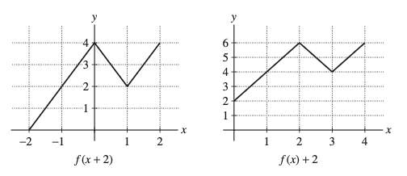
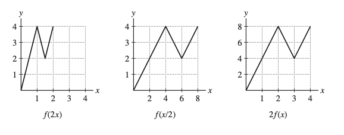
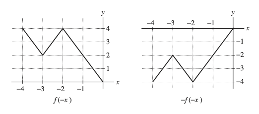

---
title: "Relaciones y funciones"
author: "Elvis Sánchez"
format:
  pdf:
    documentclass: article
    fontsize: 12pt
    break-on-sections: true
---    

### **1. Determine el dominio y el rango de la función**

$$f: \{r, s, t, u\} \to \{A, B, C, D, E\}$$

$$\text{definida por } f(r)=A, f(s)=B, f(t)=B, f(u)=E.$$

### **2. Dé un ejemplo de una función cuyo dominio $D$ tiene tres elementos y cuyo rango $R$ tiene dos elementos. ¿Existe una función cuyo dominio $D$ tiene dos elementos y cuyo rango $R$ tiene tres elementos?**



## SOLUCIONES

### **1. Determine el dominio y el rango de la función**

$$f: \{r, s, t, u\} \to \{A, B, C, D, E\}$$

$$\text{definida por } f(r)=A, f(s)=B, f(t)=B, f(u)=E.$$

**SOLUCIÓN**
El dominio es el conjunto $D=\{r, s, t, u\}$; el rango es el conjunto $R=\{A, B, E\}$.

### **2. Dé un ejemplo de una función cuyo dominio $D$ tiene tres elementos y cuyo rango $R$ tiene dos elementos. ¿Existe una función cuyo dominio $D$ tiene dos elementos y cuyo rango $R$ tiene tres elementos?**

**SOLUCIÓN**
Defina $f$ por $f: \{a, b, c\} \to \{1, 2\}$ donde $f(a)=1, f(b)=1, f(c)=2$.

No existe una función cuyo dominio tenga dos elementos y un rango de tres elementos. Si eso ocurriera, uno de los elementos del dominio se asignaría a más de un elemento del rango, lo que contradice la definición de una función.

### **3. Determine si la función es par, impar o ninguna de las dos.**

(a) $f(t) = \frac{1}{t^4 + t + 1} - \frac{1}{t^4 - t + 1}$
(b) $g(t) = 2^t - 2^{-t}$
(c) $G(\theta) = \sin\theta + \cos\theta$
(d) $H(\theta) = \sin(\theta^2)$

**SOLUCIÓN**
(a) Esta función es impar porque

$$f(-t) = \frac{1}{(-t)^4 + (-t) + 1} - \frac{1}{(-t)^4 - (-t) + 1}$$
$$= \frac{1}{t^4 - t + 1} - \frac{1}{t^4 + t + 1} = - \left( \frac{1}{t^4 + t + 1} - \frac{1}{t^4 - t + 1} \right) = -f(t)$$

(b) $g(-t) = 2^{-t} - 2^{-(-t)} = 2^{-t} - 2^t = -(2^t - 2^{-t}) = -g(t)$, por lo que esta función es impar.

(c) $G(-\theta) = \sin(-\theta) + \cos(-\theta) = -\sin\theta + \cos\theta$ lo cual es igual a ni $G(\theta)$ ni $-G(\theta)$, por lo que esta función no es ni impar ni par.

(d) $H(-\theta) = \sin((-\theta)^2) = \sin(\theta^2) = H(\theta)$, por lo que esta función es par.

### **4. En los ejercicios a-d, sea f(x) la función mostrada en la Figura 01.**

A continuación, se presenta un gráfico con los ejes x e y. La función $f(x)$ es una línea quebrada que comienza en el origen $(0,0)$, sube al punto $(2,4)$, baja al punto $(3,2)$ y sube de nuevo al punto $(4,4)$. La figura está etiquetada como **FIGURA 1**.

### **a. Determine el dominio de $f(x)$ y el rango de $f(x)$.

Dominio: 
$$0\leq x \leq 4$$
 Rango: 
$$0\leq f(x) \leq 
### **b. Bosqueje los gráficos de $f(x+2)$ y $f(x)+2$.**

**SOLUCIÓN**
El gráfico de $y=f(x+2)$ se obtiene al desplazar el gráfico de $y=f(x)$ dos unidades a la izquierda. El gráfico de $y=f(x)+2$ se obtiene al desplazar el gráfico de $y=f(x)$ dos unidades hacia arriba.

_Descripción de la imagen:_ Dos gráficos. El de la izquierda muestra el gráfico de $f(x+2)$, que es el gráfico de $f(x)$ (un "zigzag" que comienza en $(0,0)$) desplazado dos unidades a la izquierda, comenzando en $(-2,0)$. El de la derecha muestra el gráfico de $f(x)+2$, que es el gráfico de $f(x)$ desplazado dos unidades hacia arriba, comenzando en $(0,2)$.

### **c. Bosqueje los gráficos de $f(2x)$, $f(\frac{1}{2}x)$, y $2f(x)$.**

**SOLUCIÓN**
El gráfico de $y=f(2x)$ se obtiene al comprimir el gráfico de $y=f(x)$ horizontalmente por un factor de 2. El gráfico de $y=f(\frac{1}{2}x)$ se obtiene al estirar el gráfico de $y=f(x)$ horizontalmente por un factor de 2. El gráfico de $y=2f(x)$ se obtiene al estirar el gráfico de $y=f(x)$ verticalmente por un factor de 2.

_Descripción de la imagen:_ Tres gráficos. El de la izquierda muestra el gráfico de $f(2x)$, que está horizontalmente comprimido. El del medio muestra el gráfico de $f(\frac{1}{2}x)$, que está horizontalmente estirado. El de la derecha muestra el gráfico de $2f(x)$, que está verticalmente estirado.

### **d. Bosqueje los gráficos de $f(-x)$ y $-f(-x)$.**

**SOLUCIÓN**
El gráfico de $y=f(-x)$ se obtiene al reflejar el gráfico de $y=f(x)$ a través del eje y. El gráfico de $y=-f(-x)$ se obtiene al reflejar el gráfico de $y=f(x)$ a través de los ejes x e y, o de forma equivalente, sobre el origen.

_Descripción de la imagen:_ Dos gráficos. El de la izquierda muestra el gráfico de $f(-x)$, que es una reflexión del gráfico original de $f(x)$ sobre el eje y. El de la derecha muestra el gráfico de $-f(-x)$, que es una reflexión del gráfico de $f(x)$ sobre el origen.
