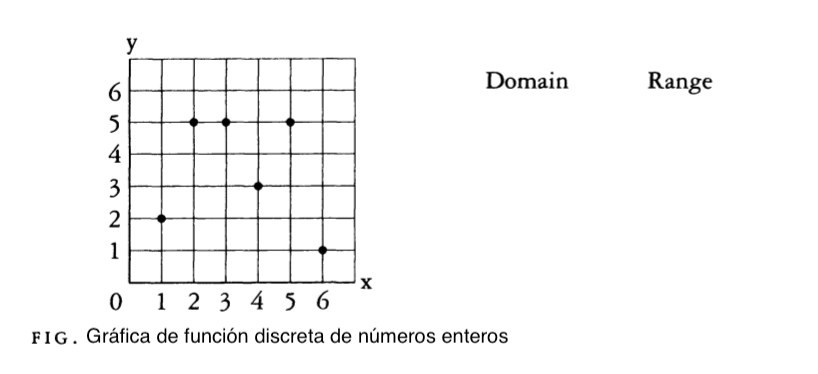

---
title: "Autonomo:funciones"
author: "Elvis Sánchez"
format:
  pdf:
    documentclass: article
    fontsize: 12pt
    break-on-sections: true
--- 

## Problema 1: Dominio e Imagen de una Función Discreta

Observa el siguiente gráfico de una función $f:\mathbb{Z}\longrightarrow \mathbb{Z}$.  y responde las siguientes preguntas. 

a) Identificación de Dominio e Imagen

Basándote en los puntos graficados, identifica y lista los elementos del dominio y la imagen (rango) de la función $f$.

    - Dominio:

    - Imagen (rango):

b) Diagrama de Correspondencia (Diagrama de Venn)

Dibuja un diagrama de correspondencia (similar a un diagrama de Venn con flechas) para representar la función $f$. Asegúrate de incluir todos los elementos del dominio y la imagen que identificaste en la parte a), y traza las flechas correctas que muestren la asignación.

c) Análisis de la función

Con base en tu trabajo anterior, responde y justifica las siguientes preguntas:

- ¿Es la función $f$ inyectiva? Explica por qué.

- ¿Es la función $f$ sobreyectiva en su codominio $\mathbb{Z}$? Explica por qué.



## Problema 2: Dominio e Imagen de una Función discreta

* **"Con base en tu respuesta, ¿la función $f$ es inyectiva? Explica por qué."**

    * (La respuesta correcta sería no, porque $f(2) = 5$ y $f(4) = 5$, y $2 \neq 4$. Esto conecta directamente con tus ejemplos de clase sobre inyectividad.)

* **"Con base en tu respuesta, ¿la función $f$ es sobreyectiva en su codominio $\mathbb{Z}$? Explica por qué."**

    * (La respuesta sería no, ya que la imagen de la función es solo $\{1, 2, 3, 5\}$, lo que no cubre todos los números enteros del codominio $\mathbb{Z}$.)

